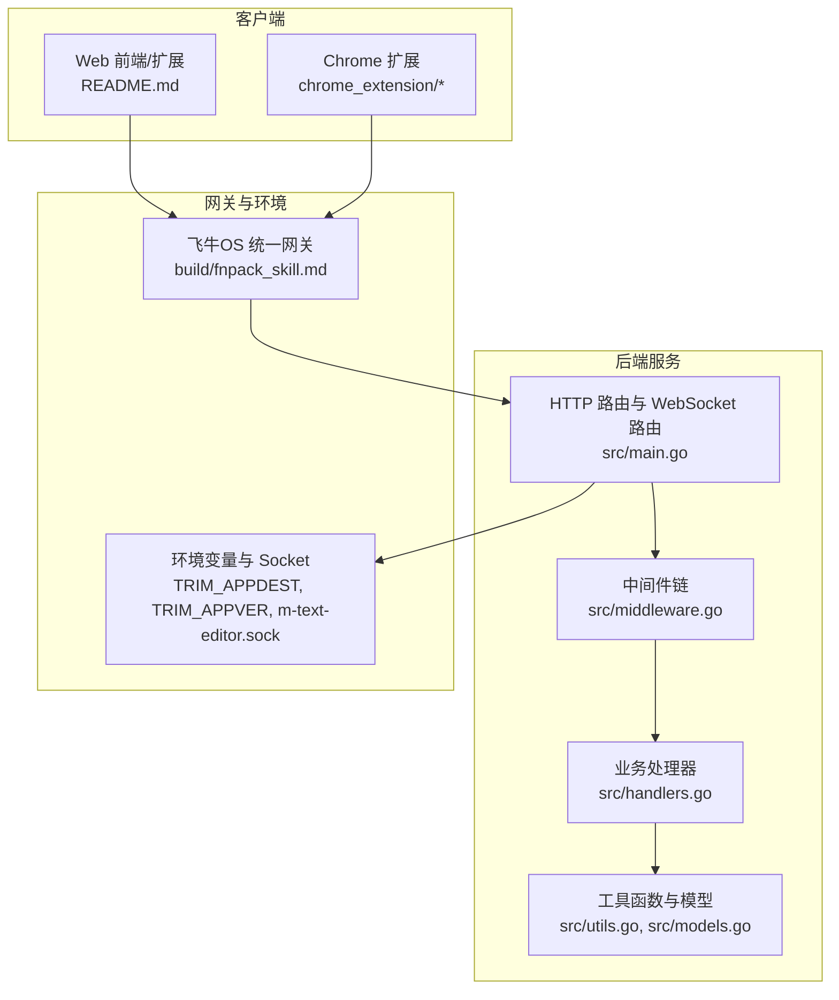
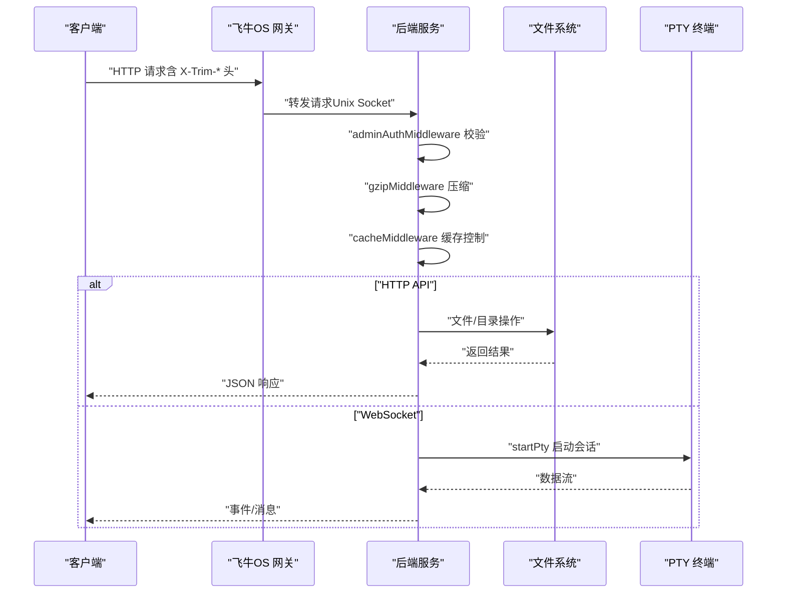
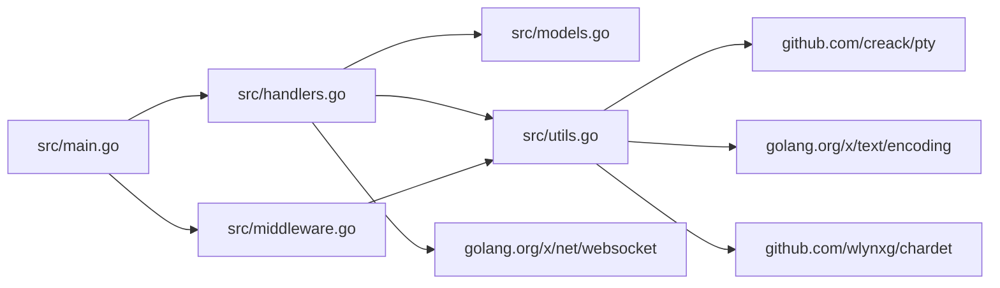

# API 接口文档

<cite>
**本文档引用的文件**
- [src/main.go](file://src/main.go)
- [src/handlers.go](file://src/handlers.go)
- [src/middleware.go](file://src/middleware.go)
- [src/models.go](file://src/models.go)
- [src/utils.go](file://src/utils.go)
- [build/fnpack_skill.md](file://build/fnpack_skill.md)
- [test/scratch/settings.json](file://test/scratch/settings.json)
- [test/scratch/settings_mobile.json](file://test/scratch/settings_mobile.json)
- [README.md](file://README.md)
</cite>

## 目录
1. [简介](#简介)
2. [项目结构](#项目结构)
3. [核心组件](#核心组件)
4. [架构总览](#架构总览)
5. [详细组件分析](#详细组件分析)
6. [依赖关系分析](#依赖关系分析)
7. [性能考量](#性能考量)
8. [故障排查指南](#故障排查指南)
9. [结论](#结论)
10. [附录](#附录)

## 简介
本项目是基于飞牛OS（FNOS）适配的轻量极速文本编辑器后端服务，提供文件读取、保存、目录浏览、文件创建、设置读取与 WebSocket 文件监控、终端会话等能力。接口通过统一网关前缀 `/app/m-text-editor/` 暴露，采用 Unix Domain Socket 监听，结合中间件实现管理员鉴权、Gzip 压缩与缓存控制。本文档面向前后端开发者与集成方，提供完整的 HTTP API 与 WebSocket API 接口说明、参数与响应结构、错误处理策略与安全注意事项。

## 项目结构
后端服务主要由以下模块构成：
- 入口与路由：负责初始化 HTTP 路由与 WebSocket 路由，绑定中间件链。
- 处理器：实现具体业务逻辑，包括文件读取、保存、目录列表、文件创建、设置读取、文件监控与终端会话。
- 中间件：实现管理员鉴权、Gzip 压缩与缓存控制。
- 工具与模型：路径清理与校验、编码探测、语言识别、PTTY 会话、数据模型定义。
- 配置与文档：飞牛OS网关与安全规范、移动端/桌面端设置样例。

图表来源
- [src/main.go:111-119](file://src/main.go#L111-L119)
- [src/middleware.go:22-38](file://src/middleware.go#L22-L38)
- [src/handlers.go:21-112](file://src/handlers.go#L21-L112)
- [build/fnpack_skill.md:317-327](file://build/fnpack_skill.md#L317-L327)

章节来源
- [src/main.go:15-145](file://src/main.go#L15-L145)
- [README.md:1-39](file://README.md#L1-L39)

## 核心组件
- 路由与入口
  - 动态入口服务：处理首页、样式与脚本版本注入、静态资源转发。
  - 业务 API 路由：/api/read、/api/save、/api/list、/api/new、/api/settings、/api/create。
  - WebSocket 路由：/api/watch/ws、/api/terminal/ws。
- 中间件
  - 管理员鉴权：通过 X-Trim-Isadmin 头部校验。
  - Gzip 压缩：对 API 与静态资源进行透明压缩。
  - 缓存控制：对 Monaco 资源与带版本号资源进行强缓存。
- 数据模型
  - Response：通用响应结构，包含 content、mtime、size、mode、language、encoding、error。
  - FileInfo：目录项元数据，包含 name、path、is_dir、size、mtime、is_symlink。
  - ListResponse：目录列表响应结构，包含 path、files、error。
- 工具函数
  - 路径清理与校验：防止目录逃逸，限制应用自身资源访问。
  - 编码探测与转换：UTF-8、GBK、GB18030、Big5、UTF-16LE/BE。
  - 语言识别：基于扩展名与 shebang 判断。
  - PTY 终端：基于 pty 启动 bash，双向数据转发。

章节来源
- [src/main.go:111-119](file://src/main.go#L111-L119)
- [src/middleware.go:22-92](file://src/middleware.go#L22-L92)
- [src/models.go:3-29](file://src/models.go#L3-L29)
- [src/utils.go:25-165](file://src/utils.go#L25-L165)

## 架构总览
后端通过 Unix Domain Socket 监听，统一网关负责鉴权与路由转发。管理员鉴权中间件在进入业务处理前校验 X-Trim-Isadmin 头部；Gzip 中间件对 API 与静态资源进行透明压缩；缓存中间件对 Monaco 与带版本号资源进行强缓存。业务处理器负责具体文件操作与 WebSocket 会话。

图表来源
- [src/main.go:121-128](file://src/main.go#L121-L128)
- [src/middleware.go:22-92](file://src/middleware.go#L22-L92)
- [src/utils.go:167-261](file://src/utils.go#L167-L261)

## 详细组件分析

### HTTP API

#### /api/read（文件读取）
- 方法与路径
  - 方法：GET
  - 路径：/app/m-text-editor/api/read
- 查询参数
  - path：必填，目标文件绝对路径。
  - encoding：可选，优先编码（如 utf-8、gbk、gb18030、big5、utf-16le、utf-16be）。
- 请求格式
  - URL 查询参数形式。
- 响应结构
  - 成功：返回 Response 结构，包含 content、mtime、size、mode、language、encoding。
  - 失败：返回 Response 结构，包含 error。
- 错误码
  - 400：路径无效或缺失。
  - 403：禁止访问系统受保护目录。
  - 404：文件不存在。
  - 413：文件超过 10MB。
  - 422：检测到二进制内容。
- 安全与性能
  - 路径清理与校验，防止目录逃逸。
  - 10MB 限制保护编辑器性能。
  - 自动编码探测与转换，避免乱码。
- 请求示例
  - GET /app/m-text-editor/api/read?path=/vol1/docs/readme.md&encoding=utf-8
- 响应示例
  - 成功：{"content":"...","mtime":1700000000,"size":1024,"mode":"-rw-r--r--","language":"markdown","encoding":"utf-8"}
  - 失败：{"error":"文件不存在，请检查路径是否正确。"}

章节来源
- [src/handlers.go:114-212](file://src/handlers.go#L114-L212)
- [src/utils.go:25-53](file://src/utils.go#L25-L53)
- [src/utils.go:108-165](file://src/utils.go#L108-L165)

#### /api/save（文件保存）
- 方法与路径
  - 方法：POST
  - 路径：/app/m-text-editor/api/save
- 请求体
  - JSON 结构，包含 path、content、encoding、mtime。
- 响应结构
  - 成功：返回 Response 结构，包含 content（固定为 "ok"）、mtime、size、mode。
  - 失败：返回 Response 结构，包含 error。
- 错误码
  - 400：请求体解析失败。
  - 403：禁止修改系统受保护目录。
  - 405：仅支持 POST。
  - 409：目标文件已存在且 mtime 为 0（防止覆盖）。
  - 412：文件已被外部修改（mtime 不一致）。
  - 500：写入或原子替换失败。
- 安全与性能
  - 原子写入：先写临时文件，再重命名为目标文件。
  - 权限与 UID/GID 同步。
  - 编码转换与替换不受支持字符。
- 请求示例
  - POST /app/m-text-editor/api/save
  - Body: {"path":"/vol1/docs/readme.md","content":"...","encoding":"utf-8","mtime":1700000000}
- 响应示例
  - 成功：{"content":"ok","mtime":1700000001,"size":1025,"mode":"-rw-r--r--"}
  - 失败：{"error":"目标文件已存在。为防止内容覆盖，请刷新页面或更改路径后重试。"}

章节来源
- [src/handlers.go:214-324](file://src/handlers.go#L214-L324)
- [src/utils.go:149-165](file://src/utils.go#L149-L165)

#### /api/list（目录浏览）
- 方法与路径
  - 方法：GET
  - 路径：/app/m-text-editor/api/list
- 查询参数
  - path：必填，目标目录绝对路径。
- 响应结构
  - 成功：返回 ListResponse 结构，包含 path、files（FileInfo 数组）。
  - 失败：返回 ListResponse 结构，包含 error。
- 错误码
  - 400：缺少 path 参数。
  - 403：禁止访问系统受保护目录。
  - 404：目录不存在。
  - 500：无法读取目录。
- 安全与性能
  - 路径清理与校验，隐藏以点开头的条目。
  - 目录项排序：目录优先，大小写不敏感排序。
- 请求示例
  - GET /app/m-text-editor/api/list?path=/vol1/docs
- 响应示例
  - 成功：{"path":"/vol1/docs","files":[{"name":"readme.md","path":"/vol1/docs/readme.md","is_dir":false,"size":1024,"mtime":1700000000,"is_symlink":false}]}

章节来源
- [src/handlers.go:21-112](file://src/handlers.go#L21-L112)
- [src/models.go:14-29](file://src/models.go#L14-L29)

#### /api/new（文件创建）
- 方法与路径
  - 方法：POST
  - 路径：/app/m-text-editor/api/new
- 请求体
  - JSON 结构，包含 path。
- 响应结构
  - 成功：返回 Response 结构，包含 content（固定为 "ok"）、mtime（固定为 0）。
  - 失败：返回 Response 结构，包含 error。
- 错误码
  - 400：请求体解析失败。
  - 403：禁止在此系统目录中创建文件。
  - 409：目标文件已存在或为目录。
  - 500：文件创建失败。
- 安全与性能
  - 父目录存在性校验。
  - 创建后同步 UID/GID 为 1000:1000。
- 请求示例
  - POST /app/m-text-editor/api/new
  - Body: {"path":"/vol1/docs/new.md"}
- 响应示例
  - 成功：{"content":"ok","mtime":0}

章节来源
- [src/handlers.go:363-424](file://src/handlers.go#L363-L424)

#### /api/create（新建文件预检）
- 方法与路径
  - 方法：GET
  - 路径：/app/m-text-editor/api/create
- 查询参数
  - path：必填，目标文件绝对路径。
- 响应结构
  - 成功：返回 Response 结构，包含 content（固定为 "ok"）、language。
  - 失败：返回 Response 结构，包含 error。
- 错误码
  - 400：路径无效。
  - 403：禁止在此系统目录中创建文件。
  - 409：目标文件已存在或为目录。
- 请求示例
  - GET /app/m-text-editor/api/create?path=/vol1/docs/new.md
- 响应示例
  - 成功：{"content":"ok","language":"markdown"}

章节来源
- [src/handlers.go:326-361](file://src/handlers.go#L326-L361)

#### /api/settings（设置获取/保存）
- 方法与路径
  - GET /app/m-text-editor/api/settings?client=desktop|mobile
  - POST /app/m-text-editor/api/settings
- 查询参数（GET）
  - client：可选，desktop 或 mobile。mobile 返回 settings_mobile.json。
- 请求体（POST）
  - JSON 结构，任意键值对。
- 响应结构
  - GET：返回 settings.json 或 settings_mobile.json 的内容；若文件不存在，返回 {}。
  - POST：返回 Response 结构，包含 content（固定为 "ok"）。
  - 失败：返回 Response 结构，包含 error。
- 错误码
  - 400：JSON 解析失败。
  - 500：读取/写入/序列化/原子替换失败。
- 安全与性能
  - 配置文件写入采用原子替换流程。
  - 目录不存在时自动创建。
  - 写入后设置权限为 0644。
- 请求示例
  - GET /app/m-text-editor/api/settings?client=mobile
  - POST /app/m-text-editor/api/settings
  - Body: {"fontSize":12,"theme":"dark"}
- 响应示例
  - GET：{"fontSize":12,"theme":"dark"}
  - POST：{"content":"ok"}

章节来源
- [src/handlers.go:531-611](file://src/handlers.go#L531-L611)
- [test/scratch/settings.json:1-16](file://test/scratch/settings.json#L1-L16)
- [test/scratch/settings_mobile.json:1-16](file://test/scratch/settings_mobile.json#L1-L16)

### WebSocket API

#### /api/watch/ws（文件监控）
- 路由与协议
  - 路径：/app/m-text-editor/api/watch/ws
  - 协议：WebSocket
- 查询参数
  - path：必填，被监控文件的绝对路径。
- 消息格式
  - 服务端发送：JSON 对象，包含 event、mtime、size。
  - 客户端发送：忽略或保持空闲心跳。
- 事件类型
  - change：文件发生变更（mtime 或 size 变化）。
- 错误处理
  - 无效路径：{"error":"无效的路径"}
  - 监听文件不存在：{"error":"监听的文件不存在"}
  - 文件被外部删除：{"error":"文件已被外部删除"}
- 性能与稳定性
  - 每秒轮询检查一次，避免频繁 I/O。
  - 客户端读超时（90 秒）防止连接挂起。
- 请求示例
  - ws://host/app/m-text-editor/api/watch/ws?path=/vol1/docs/readme.md
- 事件示例
  - {"event":"change","mtime":1700000001,"size":1025}

章节来源
- [src/handlers.go:426-494](file://src/handlers.go#L426-L494)

#### /api/terminal/ws（终端会话）
- 路由与协议
  - 路径：/app/m-text-editor/api/terminal/ws
  - 协议：WebSocket
- 查询参数
  - cols：可选，终端列数，默认 80。
  - rows：可选，终端行数，默认 24。
  - user：可选，"current" 表示切换到当前用户；否则使用 root。
- 请求头（由网关透传）
  - X-Trim-Isadmin：是否为管理员（"true"|"false"）。
  - X-Trim-Username：用户名。
- 消息格式
  - 客户端发送：
    - 普通输入：字符串。
    - 心跳："\x00ping"。
    - 尺寸变更："\x00resize:<cols>,<rows>"。
  - 服务端发送：
    - 输出数据：字符串。
    - 心跳响应："\x00pong"。
- 错误处理
  - 非管理员访问：发送 "拒绝访问: 仅限系统管理员使用终端"。
  - PTY 启动失败：发送 "无法启动终端: ..."。
- 安全与性能
  - 管理员鉴权前置校验。
  - 90 秒无交互自动断开，防止资源泄露。
  - 支持窗口尺寸动态调整。
- 请求示例
  - ws://host/app/m-text-editor/api/terminal/ws?cols=120&rows=40&user=current
- 事件示例
  - 客户端："\x00ping" 或 "\x00resize:120,40"
  - 服务端："PS1> " 或命令输出

章节来源
- [src/handlers.go:496-516](file://src/handlers.go#L496-L516)
- [src/utils.go:167-261](file://src/utils.go#L167-L261)
- [build/fnpack_skill.md:317-327](file://build/fnpack_skill.md#L317-L327)

## 依赖关系分析
- 组件耦合
  - 路由层与处理器层松耦合，通过函数注册与中间件链组合。
  - 工具层提供独立能力（路径清理、编码、语言识别、PTY），被多个处理器复用。
- 外部依赖
  - golang.org/x/net/websocket：WebSocket 支持。
  - golang.org/x/text/encoding：字符编码转换。
  - github.com/creack/pty：伪终端。
  - github.com/wlynxg/chardet：编码探测。
- 关键依赖图

图表来源
- [src/main.go:11-11](file://src/main.go#L11-L11)
- [src/handlers.go:3-19](file://src/handlers.go#L3-L19)
- [src/utils.go:3-23](file://src/utils.go#L3-L23)

章节来源
- [src/main.go:11-11](file://src/main.go#L11-L11)
- [src/handlers.go:3-19](file://src/handlers.go#L3-L19)
- [src/utils.go:3-23](file://src/utils.go#L3-L23)

## 性能考量
- 压缩与缓存
  - Gzip 中间件对 API 与静态资源进行透明压缩，减少带宽消耗。
  - 缓存中间件对 Monaco 与带版本号资源进行强缓存，提升加载速度。
- I/O 优化
  - 文件读取限制最大 10MB，避免大文件拖慢编辑器。
  - 目录遍历与排序在内存中完成，避免频繁系统调用。
- WebSocket
  - 文件监控每秒轮询一次，终端会话 90 秒无交互自动断开，防止资源泄露。
- 原子写入
  - 保存与设置写入均采用临时文件 + 原子重命名，保证一致性与可靠性。

## 故障排查指南
- 常见错误与处理
  - 403 禁止访问：确认 X-Trim-Isadmin 为 "true"，检查路径是否在应用资源目录内。
  - 404 文件/目录不存在：确认 path 参数正确，路径存在且可访问。
  - 413 文件过大：文件超过 10MB，建议拆分或使用其他工具。
  - 412 内容覆盖：mtime 不一致，刷新页面后重试。
  - 500 写入失败：检查磁盘权限、空间与 SELinux/AppArmor 策略。
- 调试技巧
  - 启用日志：观察 [HTTP] 日志与各处理器日志。
  - 路径校验：使用 cleanAndValidatePath 的行为验证路径合法性。
  - 编码问题：检查 encoding 参数与 predictEncoding 的建议值。
  - WebSocket：使用浏览器开发者工具 Network 面板查看握手与消息。
- 安全注意事项
  - 严禁信任客户端上报的 UID/用户名，必须使用网关透传的 X-Trim-Uid/X-Trim-Username/X-Trim-Isadmin。
  - 禁止读取应用自身资源目录与敏感文件。
  - 管理员权限仅授予可信用户。

章节来源
- [src/middleware.go:22-38](file://src/middleware.go#L22-L38)
- [src/utils.go:25-53](file://src/utils.go#L25-L53)
- [build/fnpack_skill.md:317-327](file://build/fnpack_skill.md#L317-L327)

## 结论
本后端服务围绕飞牛OS统一网关构建，提供稳定可靠的文件读写、目录浏览、设置管理与实时监控/终端能力。通过严格的路径校验、管理员鉴权与原子写入机制，确保安全性与一致性；通过 Gzip 压缩与缓存策略，兼顾性能与用户体验。建议集成方严格遵循网关透传头与安全规范，合理使用查询参数与消息格式，以获得最佳的使用体验。

## 附录
- 认证机制
  - 管理员鉴权：X-Trim-Isadmin 为 "true"。
  - 用户信息透传：X-Trim-Uid、X-Trim-Username。
  - WebSocket 鉴权绑定：连接建立后以 X-Trim-Uid 强绑定。
- 环境变量
  - TRIM_APPDEST：应用运行根目录，用于路径校验与 Socket 路径。
  - TRIM_APPVER：版本号，用于资源版本注入。
  - TRIM_PKGVAR：配置文件根目录，用于 settings.json/settings_mobile.json。
- 客户端集成要点
  - 使用统一网关前缀 /app/m-text-editor/。
  - 通过 X-Trim-* 头进行身份与权限透传。
  - WebSocket 连接时携带必要的查询参数与心跳消息。
  - 设置读取时区分 desktop/mobile 客户端类型。

章节来源
- [src/main.go:16-28](file://src/main.go#L16-L28)
- [src/middleware.go:22-38](file://src/middleware.go#L22-L38)
- [build/fnpack_skill.md:317-327](file://build/fnpack_skill.md#L317-L327)