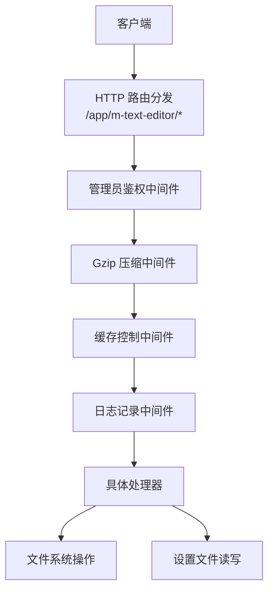
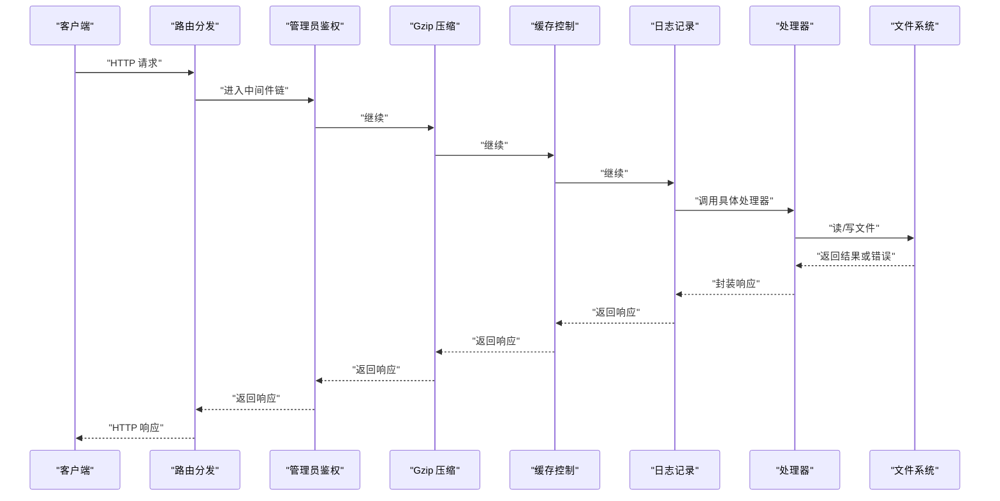
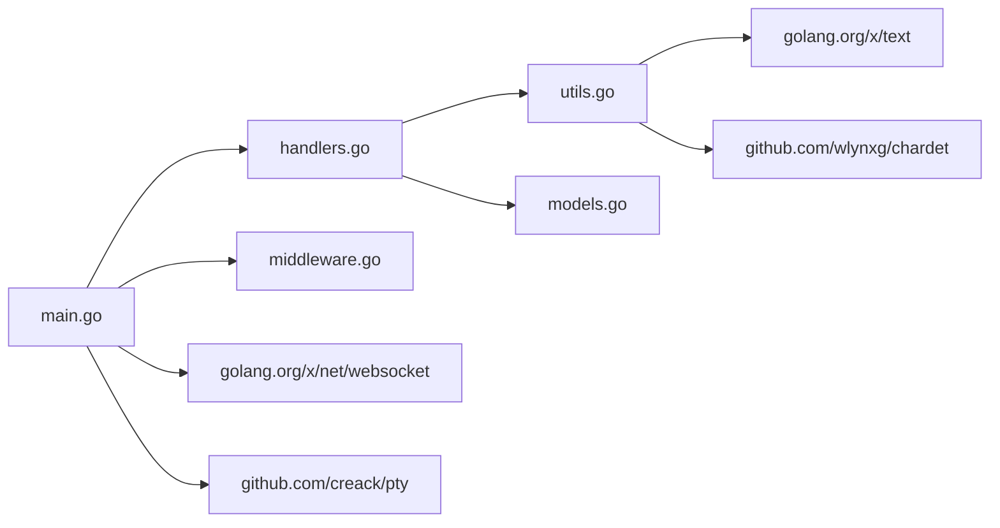

# HTTP API 端点

<cite>
**本文引用的文件**
- [src/main.go](file://src/main.go)
- [src/handlers.go](file://src/handlers.go)
- [src/middleware.go](file://src/middleware.go)
- [src/models.go](file://src/models.go)
- [src/utils.go](file://src/utils.go)
- [test/scratch/mock_server.js](file://test/scratch/mock_server.js)
</cite>

## 目录
1. [简介](#简介)
2. [项目结构](#项目结构)
3. [核心组件](#核心组件)
4. [架构总览](#架构总览)
5. [详细端点文档](#详细端点文档)
6. [依赖关系分析](#依赖关系分析)
7. [性能考量](#性能考量)
8. [故障排查指南](#故障排查指南)
9. [结论](#结论)
10. [附录](#附录)

## 简介
本文件面向使用者与集成开发者，系统性梳理后端提供的 HTTP API 端点，覆盖以下接口：
- /api/read：读取文件内容并按需转码
- /api/save：保存文件内容（原子写入）
- /api/list：列出目录内容
- /api/new：创建新文件
- /api/settings：读取或写入云端设置

文档包含请求参数、请求格式、响应结构、错误码、JSON 示例、文件大小限制、编码检测机制、权限验证规则以及典型使用场景。

## 项目结构
后端通过 Unix Socket 提供服务，路由前缀为 /app/m-text-editor/，注册了多个 API 路由，并在生产环境启用管理员鉴权中间件、Gzip 压缩与缓存控制中间件。

图表来源
- [src/main.go:111-129](file://src/main.go#L111-L129)
- [src/middleware.go:22-92](file://src/middleware.go#L22-L92)

章节来源
- [src/main.go:111-129](file://src/main.go#L111-L129)
- [src/middleware.go:22-92](file://src/middleware.go#L22-L92)

## 核心组件
- 路由与入口：在主程序中注册静态资源网关与业务 API 路由，并串联中间件链。
- 处理器：实现各 API 的业务逻辑，包括路径校验、文件读写、编码检测、语言识别等。
- 中间件：管理员鉴权、Gzip 压缩、缓存控制。
- 数据模型：统一响应结构、目录项结构。
- 工具函数：路径清理与校验、编码预测、语言识别、PTY 终端会话等。

章节来源
- [src/main.go:111-129](file://src/main.go#L111-L129)
- [src/handlers.go:21-614](file://src/handlers.go#L21-L614)
- [src/middleware.go:22-92](file://src/middleware.go#L22-L92)
- [src/models.go:3-29](file://src/models.go#L3-L29)
- [src/utils.go:25-262](file://src/utils.go#L25-L262)

## 架构总览
下图展示了请求从客户端到处理器再到文件系统的整体流程，以及中间件对请求的影响。

图表来源
- [src/main.go:111-129](file://src/main.go#L111-L129)
- [src/middleware.go:22-92](file://src/middleware.go#L22-L92)
- [src/handlers.go:21-614](file://src/handlers.go#L21-L614)

## 详细端点文档

### 通用约定
- 基础路径：/app/m-text-editor/
- 公共响应字段（除特殊说明外）：
  - content：字符串，业务含义随端点而定
  - mtime：整数，UNIX 时间戳（秒）
  - size：整数，字节数
  - mode：字符串，文件权限描述
  - language：字符串，Monaco 语言标识
  - encoding：字符串，建议的编码名称
  - error：字符串，错误信息（出现错误时返回）

- 成功响应 Content-Type：application/json
- 失败响应 Content-Type：application/json 或状态码 4xx/5xx

- 认证与权限
  - 生产环境（TRIM_APPDEST 设置）：需要请求头 X-Trim-Isadmin=true
  - 路径安全：禁止访问应用自身资源目录；路径必须经 cleanAndValidatePath 校验
  - 读取/保存：禁止访问系统受保护目录

- 编码与语言
  - 编码检测：基于 chardet 进行多编码候选评估，优先映射到 utf-8、gb18030、big5、utf-16le、utf-16be
  - 语言识别：基于扩展名与 shebang 判断
  - 转码：当请求指定 encoding 或检测到非 UTF-8 时进行解码/编码

- 文件大小限制
  - 读取：最大 10MB，超过则拒绝加载
  - 保存：无硬性上限，但会进行原子写入与权限同步

- 常见错误码
  - 400：请求参数解析失败、参数缺失或非法
  - 403：拒绝访问（非管理员或路径越权）
  - 404：资源不存在
  - 405：方法不允许
  - 409：保存冲突（mtime 不匹配）
  - 413：请求实体过大（由上游或浏览器限制）
  - 500：服务器内部错误

章节来源
- [src/handlers.go:21-614](file://src/handlers.go#L21-L614)
- [src/middleware.go:22-92](file://src/middleware.go#L22-L92)
- [src/utils.go:25-165](file://src/utils.go#L25-L165)
- [src/models.go:3-29](file://src/models.go#L3-L29)

---

### /api/read（文件读取）
- 方法：GET
- 路径：/app/m-text-editor/api/read
- 查询参数：
  - path：必需，目标文件的绝对路径
  - encoding：可选，请求指定的编码名称（如 utf-8、gb18030、big5、utf-16le、utf-16be），留空表示自动检测
- 请求格式：无请求体
- 响应字段：
  - content：文件内容（已按 encoding 转码为 UTF-8 文本）
  - mtime：最后修改时间
  - size：文件大小
  - mode：权限描述
  - language：语言标识
  - encoding：建议的编码（当检测到与请求不一致时）
  - error：错误信息（出现错误时）
- 错误码：
  - 400：缺少或无效 path
  - 403：禁止访问受保护目录
  - 404：文件不存在或路径为目录
  - 413：文件超过 10MB
  - 500：读取/转码失败
- 编码检测与转码：
  - 读取文件前 1024 字节进行编码预测
  - 若检测到包含 0 字节且非 UTF-16，则拒绝加载以避免二进制损坏
  - 当 encoding 为 utf-8 或未指定时，若检测到其他编码，将采用检测结果进行解码
- 使用示例：
  - 请求：GET /app/m-text-editor/api/read?path=/data/a.txt&encoding=gb18030
  - 成功响应示例（简化）：
    {
      "content": "文件内容文本",
      "mtime": 1700000000,
      "size": 1024,
      "mode": "rw-r--r--",
      "language": "plaintext",
      "encoding": "gb18030"
    }
  - 失败响应示例（简化）：
    {
      "error": "文件不存在，请检查路径是否正确。"
    }

章节来源
- [src/handlers.go:114-212](file://src/handlers.go#L114-L212)
- [src/utils.go:108-165](file://src/utils.go#L108-L165)
- [src/utils.go:25-53](file://src/utils.go#L25-L53)
- [src/models.go:3-12](file://src/models.go#L3-L12)

---

### /api/save（文件保存）
- 方法：POST
- 路径：/app/m-text-editor/api/save
- 请求体 JSON 字段：
  - path：必需，目标文件绝对路径
  - content：必需，要保存的文本内容
  - encoding：可选，写入时使用的编码（如 utf-8、gb18030、big5、utf-16le、utf-16be）
  - mtime：可选，用于并发保护；0 表示新建；>0 表示更新并校验远端修改
- 请求格式：application/json
- 响应字段：
  - content：字符串，成功时为 "ok"
  - mtime：保存后的最后修改时间
  - size：保存后的文件大小
  - mode：权限描述
  - error：错误信息（出现错误时）
- 错误码：
  - 400：请求体解析失败、参数缺失
  - 403：禁止修改受保护目录
  - 404：文件不存在但 mtime>0（更新模式）
  - 409：保存冲突（远端文件被修改）
  - 405：方法不允许（非 POST）
  - 500：写入失败、原子替换失败
- 原子写入流程：
  - 以临时文件写入，成功后重命名为目标文件
  - 尽量保持原文件权限与属主属组
  - 强制落盘（sync）以提升可靠性
- 使用示例：
  - 请求体示例（简化）：
    {
      "path": "/data/a.txt",
      "content": "新内容",
      "encoding": "utf-8",
      "mtime": 1700000000
    }
  - 成功响应示例（简化）：
    {
      "content": "ok",
      "mtime": 1700000100,
      "size": 1024,
      "mode": "rw-r--r--"
    }
  - 冲突错误示例（简化）：
    {
      "error": "文件已被外部修改。为防止内容覆盖，请刷新页面后重试。"
    }

章节来源
- [src/handlers.go:214-324](file://src/handlers.go#L214-L324)
- [src/utils.go:25-53](file://src/utils.go#L25-L53)
- [src/models.go:3-12](file://src/models.go#L3-L12)

---

### /api/list（目录浏览）
- 方法：GET
- 路径：/app/m-text-editor/api/list
- 查询参数：
  - path：必需，目标目录绝对路径
- 请求格式：无请求体
- 响应字段：
  - path：请求的目录路径
  - files：数组，目录项列表
    - name：名称
    - path：完整路径
    - is_dir：是否为目录
    - size：大小
    - mtime：修改时间
    - is_symlink：是否为符号链接
  - error：错误信息（出现错误时）
- 错误码：
  - 400：缺少或无效 path
  - 403：禁止访问受保护目录
  - 404：目录不存在或路径为文件
  - 500：读取目录失败
- 排序规则：
  - 目录优先于文件
  - 同类按名称大小写不敏感排序
- 使用示例：
  - 请求：GET /app/m-text-editor/api/list?path=/data
  - 成功响应示例（简化）：
    {
      "path": "/data",
      "files": [
        {"name": "dir1", "path": "/data/dir1", "is_dir": true, "size": 0, "mtime": 1700000000, "is_symlink": false},
        {"name": "file1.txt", "path": "/data/file1.txt", "is_dir": false, "size": 1024, "mtime": 1700000000, "is_symlink": false}
      ]
    }

章节来源
- [src/handlers.go:21-112](file://src/handlers.go#L21-L112)
- [src/models.go:14-29](file://src/models.go#L14-L29)

---

### /api/new（文件创建）
- 方法：POST
- 路径：/app/m-text-editor/api/new
- 请求体 JSON 字段：
  - path：必需，要创建的空文件绝对路径
- 请求格式：application/json
- 响应字段：
  - content：字符串，成功时为 "ok"
  - mtime：创建后的时间戳（空文件为 0）
  - error：错误信息（出现错误时）
- 错误码：
  - 400：请求体解析失败、参数缺失
  - 403：禁止在此系统目录中创建文件
  - 404：父目录不存在
  - 409：目标文件已存在
  - 405：方法不允许（非 POST）
- 权限同步：
  - 创建后尝试同步属主/属组为 1000:1000
- 使用示例：
  - 请求体示例（简化）：
    {
      "path": "/data/new.txt"
    }
  - 成功响应示例（简化）：
    {
      "content": "ok",
      "mtime": 0
    }

章节来源
- [src/handlers.go:363-424](file://src/handlers.go#L363-L424)
- [src/utils.go:25-53](file://src/utils.go#L25-L53)
- [src/models.go:3-12](file://src/models.go#L3-L12)

---

### /api/settings（设置获取/保存）
- 方法：GET/POST
- 路径：/app/m-text-editor/api/settings
- 查询参数：
  - client：可选，"mobile" 时读取 settings_mobile.json，否则读取 settings.json
- 请求格式：
  - GET：无请求体
  - POST：application/json，任意键值对
- 响应字段：
  - GET：返回 JSON 文本
  - POST：返回 {"content":"ok"} 或错误信息
- 错误码：
  - 400：请求体解析失败
  - 403：拒绝访问（非管理员，生产环境）
  - 405：方法不允许（非 GET/POST）
  - 500：读取/写入失败、序列化失败、原子替换失败
- 存储位置：
  - 由环境变量 TRIM_PKGVAR 指定的目录下，settings.json 或 settings_mobile.json
- 使用示例：
  - GET 请求：/app/m-text-editor/api/settings?client=
  - GET 响应示例（简化）：
    {
      "theme": "dark",
      "fontSize": 14
    }
  - POST 请求体示例（简化）：
    {
      "autoSave": true,
      "encoding": "utf-8"
    }
  - POST 响应示例（简化）：
    {
      "content": "ok"
    }

章节来源
- [src/handlers.go:531-611](file://src/handlers.go#L531-L611)
- [src/utils.go:518-529](file://src/utils.go#L518-L529)
- [src/models.go:3-12](file://src/models.go#L3-L12)

---

## 依赖关系分析
- 路由与中间件
  - 主程序注册路由并串联中间件链：管理员鉴权 → Gzip 压缩 → 缓存控制 → 日志记录
  - 中间件对 API 与静态资源分别生效，WebSocket 路由除外
- 处理器与工具
  - 处理器依赖工具函数进行路径校验、编码预测、语言识别
  - 处理器依赖模型定义统一响应结构
- 外部依赖
  - 文本编码转换：golang.org/x/text
  - 字符集检测：github.com/wlynxg/chardet
  - WebSocket：golang.org/x/net/websocket
  - PTY 终端：github.com/creack/pty

图表来源
- [src/main.go:111-129](file://src/main.go#L111-L129)
- [src/handlers.go:1-20](file://src/handlers.go#L1-L20)
- [src/middleware.go:1-12](file://src/middleware.go#L1-L12)
- [src/utils.go:3-23](file://src/utils.go#L3-L23)
- [src/models.go](file://src/models.go)

章节来源
- [src/main.go:111-129](file://src/main.go#L111-L129)
- [src/handlers.go:1-20](file://src/handlers.go#L1-L20)
- [src/middleware.go:1-12](file://src/middleware.go#L1-L12)
- [src/utils.go:3-23](file://src/utils.go#L3-L23)
- [src/models.go](file://src/models.go)

## 性能考量
- Gzip 压缩：对 API 与静态资源（js/css/html）启用透明压缩，减少带宽占用
- 缓存策略：Monaco 核心资源强缓存一年；带版本号的业务资源缓存 30 天；普通业务资源缓存 1 天
- 读取限制：单次读取最大 10MB，避免大文件拖慢编辑器
- 原子写入：保存采用临时文件 + 重命名，降低写入风险并尽量保证一致性
- 跳过压缩：WebSocket 升级请求与终端路由不进行压缩

章节来源
- [src/middleware.go:40-92](file://src/middleware.go#L40-L92)
- [src/handlers.go:146-151](file://src/handlers.go#L146-L151)
- [src/handlers.go:270-314](file://src/handlers.go#L270-L314)

## 故障排查指南
- 403 拒绝访问
  - 确认请求头 X-Trim-Isadmin=true（生产环境）
  - 检查路径是否位于应用资源目录内
- 400 参数错误
  - 检查请求体 JSON 格式与必填字段
  - 对于 /api/read，确认 path 与 encoding 查询参数
- 404 资源不存在
  - 确认路径存在；对于 /api/new，确认父目录存在
- 409 保存冲突
  - 刷新页面重新获取 mtime 后再提交
- 二进制文件拒绝加载
  - /api/read 在检测到 0 字节且非 UTF-16 时拒绝加载
- 编码问题
  - 明确指定 encoding 或接受返回的 encoding 建议
- 设置读写失败
  - 检查 TRIM_PKGVAR 环境变量是否设置；确认目标文件可写

章节来源
- [src/middleware.go:22-38](file://src/middleware.go#L22-L38)
- [src/utils.go:25-53](file://src/utils.go#L25-L53)
- [src/handlers.go:114-212](file://src/handlers.go#L114-L212)
- [src/handlers.go:214-324](file://src/handlers.go#L214-L324)
- [src/handlers.go:531-611](file://src/handlers.go#L531-L611)

## 结论
该 API 设计围绕“安全、可靠、易用”展开：严格的路径校验与管理员鉴权保障安全；统一的响应模型与错误语义便于前端处理；编码检测与语言识别提升跨平台兼容性；原子写入与缓存策略兼顾性能与一致性。建议在生产环境中始终开启管理员鉴权，并根据实际部署调整路径白名单与权限策略。

## 附录
- 典型使用场景参考（来自测试与构建产物中的调用方式）
  - 读取文件：GET /app/m-text-editor/api/read?path=...&encoding=...
  - 保存文件：POST /app/m-text-editor/api/save（JSON 请求体）
  - 列出目录：GET /app/m-text-editor/api/list?path=...
  - 创建文件：POST /app/m-text-editor/api/new（JSON 请求体）
  - 读取设置：GET /app/m-text-editor/api/settings?client=
  - 写入设置：POST /app/m-text-editor/api/settings（JSON 请求体）

章节来源
- [test/scratch/mock_server.js](file://test/scratch/mock_server.js)
- [src/main.go:111-119](file://src/main.go#L111-L119)