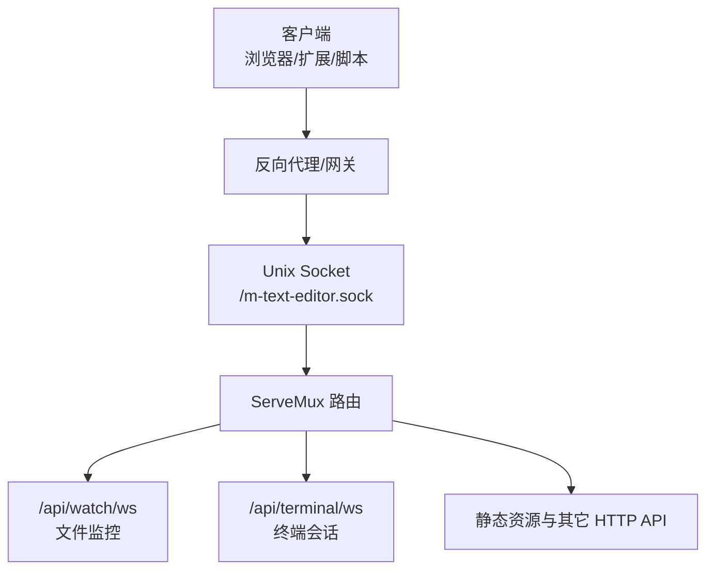
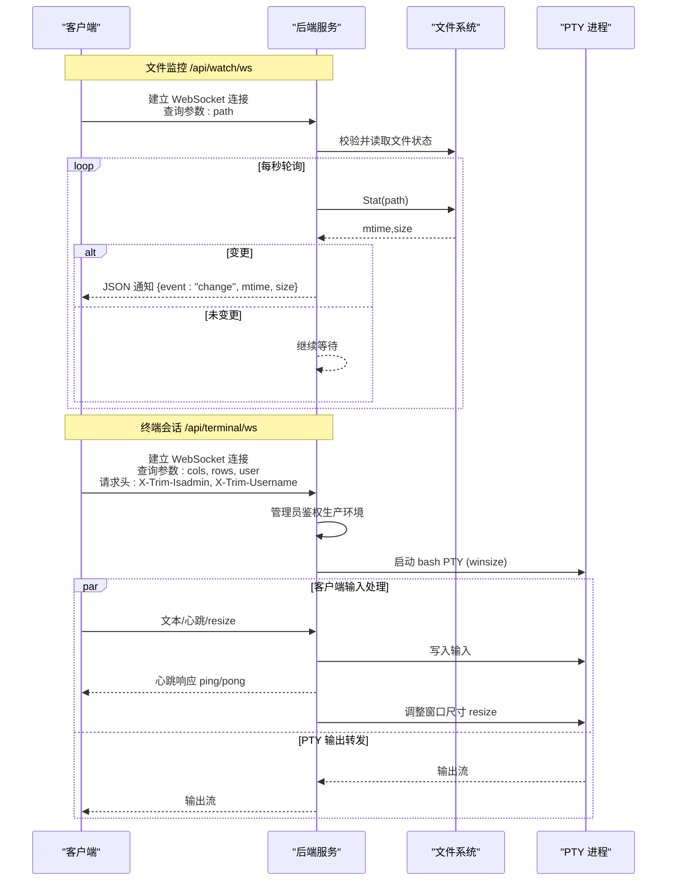
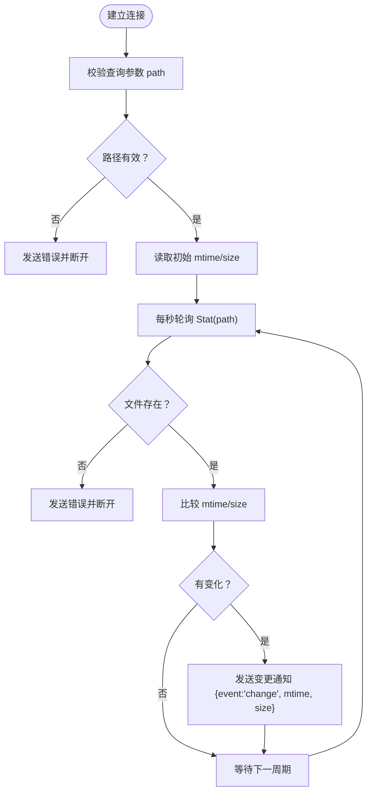
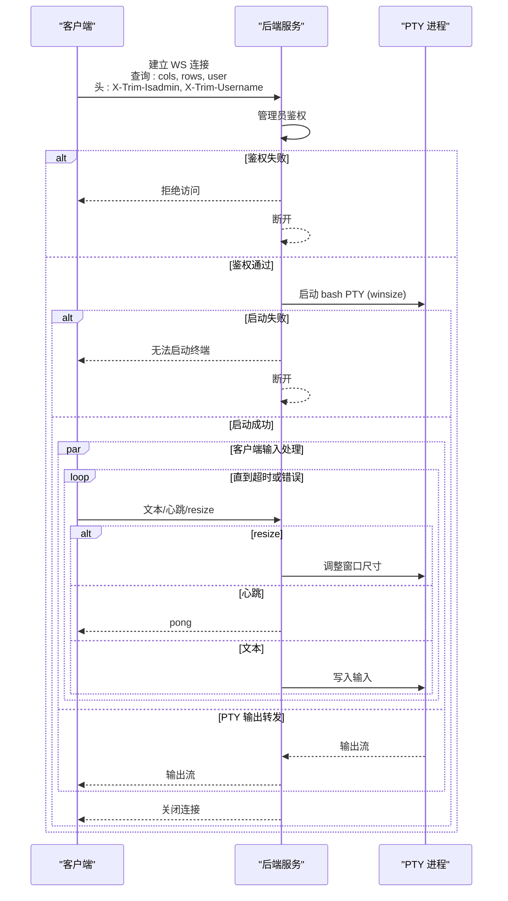
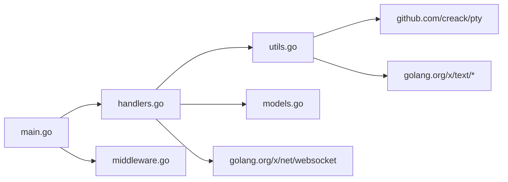

# WebSocket API 端点

<cite>
**本文引用的文件**
- [main.go](file://src/main.go)
- [handlers.go](file://src/handlers.go)
- [utils.go](file://src/utils.go)
- [middleware.go](file://src/middleware.go)
- [models.go](file://src/models.go)
- [README.md](file://README.md)
</cite>

## 目录
1. [简介](#简介)
2. [项目结构](#项目结构)
3. [核心组件](#核心组件)
4. [架构总览](#架构总览)
5. [详细组件分析](#详细组件分析)
6. [依赖关系分析](#依赖关系分析)
7. [性能考量](#性能考量)
8. [故障排查指南](#故障排查指南)
9. [结论](#结论)
10. [附录](#附录)

## 简介
本文档面向前端与集成方，系统性梳理后端提供的两个 WebSocket API 端点：
- /api/watch/ws：文件监控 WebSocket，用于实时感知文件变更。
- /api/terminal/ws：终端会话 WebSocket，提供交互式 Bash 终端能力。

文档涵盖连接建立方式、查询参数、心跳机制、消息格式、会话管理、错误处理策略以及连接生命周期与资源清理机制，并给出客户端连接示例与最佳实践。

## 项目结构
后端采用 Go 语言实现，通过 Unix Socket 对外提供服务，路由注册于统一的 ServeMux 上，并对 WebSocket 连接启用管理员鉴权中间件与压缩/缓存等中间件链。

图表来源
- [main.go:111-119](file://src/main.go#L111-L119)
- [main.go:121-128](file://src/main.go#L121-L128)

章节来源
- [main.go:15-145](file://src/main.go#L15-L145)
- [README.md:1-39](file://README.md#L1-L39)

## 核心组件
- 文件监控处理器：负责建立 WebSocket 连接，周期性轮询文件状态，发现变更后推送事件。
- 终端会话处理器：负责建立 WebSocket 连接，启动 PTY，转发输入输出，处理窗口尺寸调整与心跳。
- 中间件链：管理员鉴权、Gzip 压缩、缓存控制；WebSocket 升级请求不受压缩影响。
- 路由注册：将 WebSocket 端点注册到统一的 ServeMux，并包装日志中间件。

章节来源
- [handlers.go:426-494](file://src/handlers.go#L426-L494)
- [handlers.go:496-516](file://src/handlers.go#L496-L516)
- [middleware.go:22-38](file://src/middleware.go#L22-L38)
- [middleware.go:40-72](file://src/middleware.go#L40-L72)
- [middleware.go:74-92](file://src/middleware.go#L74-L92)
- [main.go:111-119](file://src/main.go#L111-L119)

## 架构总览
WebSocket 端点的总体调用流程如下：

图表来源
- [handlers.go:426-494](file://src/handlers.go#L426-L494)
- [handlers.go:496-516](file://src/handlers.go#L496-L516)
- [utils.go:167-261](file://src/utils.go#L167-L261)

## 详细组件分析

### 文件监控 WebSocket /api/watch/ws
- 连接建立
  - 通过 WebSocket 协议连接至 /api/watch/ws。
  - 查询参数：
    - path：被监控文件的绝对路径（经安全校验与符号链接解析）。
  - 连接建立后，服务端立即校验路径有效性与文件存在性，若失败则返回错误并断开连接。
- 心跳机制
  - 服务端不主动发送心跳；客户端需在连接建立后定期发送任意数据以维持连接活跃，避免被读超时关闭。
  - 若客户端长时间无任何读取，服务端会因读超时而关闭连接。
- 变更通知
  - 服务端每秒轮询一次文件状态（mtime、size），一旦发现变化即推送 JSON 通知：
    - event: "change"
    - mtime: 文件最后修改时间戳（秒）
    - size: 文件大小（字节）
- 错误处理
  - 路径无效：返回错误并断开。
  - 文件不存在：返回错误并断开。
  - 文件被外部删除：推送错误并断开。
  - 发送失败：记录日志并断开。
- 生命周期与资源清理
  - 连接关闭时自动停止轮询定时器与读取协程，释放监控资源。
  - 客户端断开或读取错误时，服务端主动退出循环并关闭连接。

图表来源
- [handlers.go:426-494](file://src/handlers.go#L426-L494)

章节来源
- [handlers.go:426-494](file://src/handlers.go#L426-L494)

### 终端会话 WebSocket /api/terminal/ws
- 连接建立
  - 通过 WebSocket 协议连接至 /api/terminal/ws。
  - 查询参数：
    - cols：终端列数（可选，默认值见实现）。
    - rows：终端行数（可选，默认值见实现）。
    - user：用户切换策略，current 表示按用户名切换到对应用户的家目录与环境。
  - 请求头：
    - X-Trim-Isadmin：布尔字符串，生产环境要求为 true 才能建立连接。
    - X-Trim-Username：当前用户名，配合 user=current 使用。
- 心跳机制
  - 客户端发送特殊消息 \x00ping，服务端回显 \x00pong，作为心跳保活。
  - 服务端设置读超时为 90 秒，若 90 秒内无任何交互（包括心跳），连接将被强制断开，防止协程泄漏与资源占用。
- 消息格式
  - 文本输入：直接写入 PTY。
  - 尺寸调整：前缀 \x00resize: 后跟逗号分隔的 cols,row，如 \x00resize:80,24。
  - 心跳：发送 \x00ping，收到 \x00pong。
- 会话管理
  - 启动 bash 进程，设置 TERM、LANG、LC_ALL 等环境变量。
  - 支持按用户名切换用户上下文（UID/GID、HOME、USER 等），若失败则记录日志并继续。
  - 终端工作目录优先使用用户家目录，否则回退到 /root。
  - 终端输出通过 io.Copy 直接转发给 WebSocket 客户端。
- 错误处理
  - 管理员鉴权失败：直接拒绝连接。
  - PTY 启动失败：返回错误消息并断开。
  - 会话过程中出现读写错误：记录日志并断开。
- 生命周期与资源清理
  - 连接关闭时，会话 goroutine 退出，PTY 文件句柄关闭，进程被杀死，确保资源回收。

图表来源
- [handlers.go:496-516](file://src/handlers.go#L496-L516)
- [utils.go:167-261](file://src/utils.go#L167-L261)

章节来源
- [handlers.go:496-516](file://src/handlers.go#L496-L516)
- [utils.go:167-261](file://src/utils.go#L167-L261)

## 依赖关系分析
- 路由与中间件
  - WebSocket 端点注册在统一的 ServeMux 上，随后被包装为带日志的中间件链。
  - 管理员鉴权中间件对所有非 WebSocket 路由生效；对 /api/terminal/ws 的 WebSocket 升级请求同样生效。
  - Gzip 压缩中间件忽略 WebSocket 升级请求，避免协议冲突。
- 组件耦合
  - 文件监控与终端会话分别独立实现，均依赖 WebSocket 库与标准库。
  - 终端会话依赖 PTY 库与系统进程管理，具备更强的系统交互能力。
- 外部依赖
  - golang.org/x/net/websocket：WebSocket 协议支持。
  - github.com/creack/pty：PTY 启动与窗口尺寸调整。
  - golang.org/x/text：字符编码检测与转换。
  - golang.org/x/net：HTTP 协议与 WebSocket 协议栈。

图表来源
- [main.go:111-119](file://src/main.go#L111-L119)
- [handlers.go:426-494](file://src/handlers.go#L426-L494)
- [handlers.go:496-516](file://src/handlers.go#L496-L516)
- [utils.go:167-261](file://src/utils.go#L167-L261)

章节来源
- [main.go:111-119](file://src/main.go#L111-L119)
- [middleware.go:22-38](file://src/middleware.go#L22-L38)
- [middleware.go:40-72](file://src/middleware.go#L40-L72)

## 性能考量
- 文件监控
  - 每秒一次 Stat 调用，开销极低；仅在 mtime 或 size 实际变化时才推送通知，避免冗余。
  - 客户端应保持活跃，避免读超时导致频繁重建连接。
- 终端会话
  - PTY 启动成本较低，但输出复制为阻塞 IO；建议客户端及时消费输出，避免缓冲积压。
  - 窗口尺寸调整为 O(1) 操作，建议在客户端窗口变化时及时发送 resize 指令。
  - 读超时 90 秒可有效回收闲置会话，降低资源占用。
- 中间件
  - Gzip 压缩对 WebSocket 升级请求无效，避免协议干扰；静态资源与 API 响应可获得压缩收益。

[本节为通用性能讨论，无需具体文件引用]

## 故障排查指南
- 文件监控
  - 现象：连接立即断开或无变更通知。
  - 排查：确认 path 是否有效且文件存在；检查客户端是否发送任意数据维持活跃；查看服务端日志中的错误提示。
- 终端会话
  - 现象：连接被拒绝或无法启动终端。
  - 排查：确认 X-Trim-Isadmin 为 true；确认 user=current 时 X-Trim-Username 正确；查看 PTY 启动失败原因；检查客户端是否发送了正确的 \x00ping/\x00pong 与 \x00resize 指令。
- 通用
  - 现象：连接超时断开。
  - 排查：确认客户端在 90 秒内至少发送一次消息（包括心跳）；检查网络稳定性与代理配置。

章节来源
- [handlers.go:426-494](file://src/handlers.go#L426-L494)
- [handlers.go:496-516](file://src/handlers.go#L496-L516)
- [utils.go:167-261](file://src/utils.go#L167-L261)

## 结论
- /api/watch/ws 提供轻量、稳定的文件变更通知，适合前端监听文件变化并触发刷新或提示。
- /api/terminal/ws 提供完整的交互式终端体验，支持用户切换、窗口尺寸动态调整与心跳保活。
- 两端均具备完善的错误处理与资源清理机制，生产环境建议配合管理员鉴权与合适的超时策略使用。

[本节为总结性内容，无需具体文件引用]

## 附录

### 客户端连接示例与最佳实践
- 文件监控
  - 连接：ws://<host>/app/m-text-editor/api/watch/ws?path=/absolute/path/to/file
  - 维持活跃：在连接建立后定期发送任意数据，避免读超时。
  - 处理变更：收到 event: "change" 后更新文件状态或触发刷新。
- 终端会话
  - 连接：ws://<host>/app/m-text-editor/api/terminal/ws?cols=80&rows=24&user=current
  - 头部：X-Trim-Isadmin: true, X-Trim-Username: <username>
  - 心跳：发送 \x00ping，收到 \x00pong。
  - 尺寸调整：发送 \x00resize:<cols>,<rows>。
  - 输出消费：及时读取并渲染输出，避免阻塞。

章节来源
- [handlers.go:426-494](file://src/handlers.go#L426-L494)
- [handlers.go:496-516](file://src/handlers.go#L496-L516)
- [utils.go:167-261](file://src/utils.go#L167-L261)