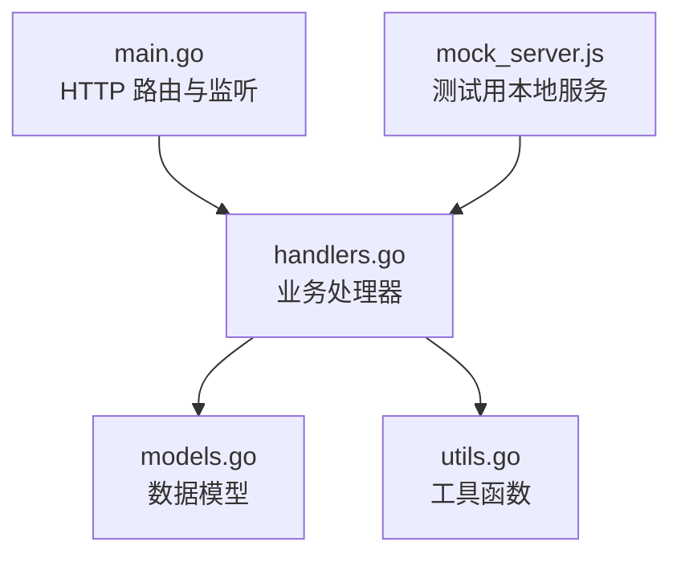
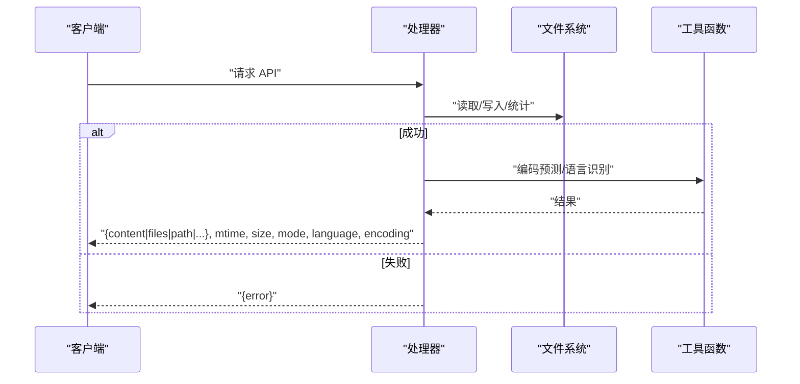
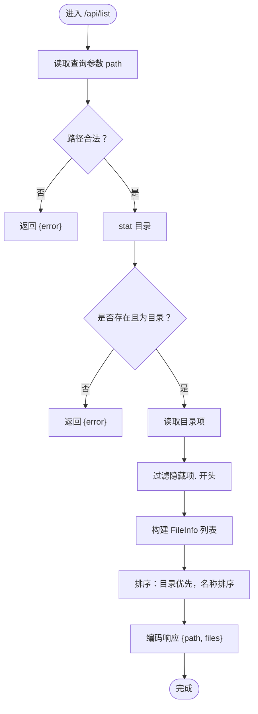
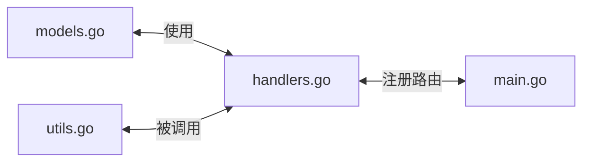

# 响应数据结构

<cite>
**本文引用的文件**
- [models.go](file://src/models.go)
- [handlers.go](file://src/handlers.go)
- [utils.go](file://src/utils.go)
- [main.go](file://src/main.go)
- [mock_server.js](file://test/scratch/mock_server.js)
</cite>

## 目录
1. [简介](#简介)
2. [项目结构](#项目结构)
3. [核心组件](#核心组件)
4. [架构总览](#架构总览)
5. [详细组件分析](#详细组件分析)
6. [依赖关系分析](#依赖关系分析)
7. [性能考量](#性能考量)
8. [故障排查指南](#故障排查指南)
9. [结论](#结论)
10. [附录](#附录)

## 简介
本文件系统性地梳理并规范统一的响应数据结构，重点说明两类基础响应模型：
- Response：通用的单对象响应，用于读取、保存、新建等操作返回文件内容与元数据
- ListResponse：目录列表响应，包含路径与文件条目数组，条目为 FileInfo 结构

文档同时给出字段定义、数据类型、含义说明、典型 JSON 示例以及错误响应的统一格式与常见错误码含义，并涵盖编码检测、文件元数据与目录列表的标准格式。

## 项目结构
后端采用 Go 语言实现，主要模块如下：
- 数据模型：定义 Response、ListResponse、FileInfo 等结构体
- 处理器：实现 API 路由与业务逻辑，负责构造统一响应
- 工具函数：路径清洗、编码预测、语言识别、终端会话等
- 入口：HTTP 路由注册与 Unix Socket 监听

图表来源
- [main.go:111-119](file://src/main.go#L111-L119)
- [handlers.go:21-212](file://src/handlers.go#L21-L212)
- [models.go:4-29](file://src/models.go#L4-L29)
- [utils.go:25-165](file://src/utils.go#L25-L165)

章节来源
- [main.go:111-119](file://src/main.go#L111-L119)
- [handlers.go:21-212](file://src/handlers.go#L21-L212)
- [models.go:4-29](file://src/models.go#L4-L29)
- [utils.go:25-165](file://src/utils.go#L25-L165)

## 核心组件
本节聚焦两类基础响应结构及其字段定义、类型与语义。

- Response（通用响应）
  - 字段
    - content: 字符串，文件内容（解压/转码后），可为空
    - mtime: 整数（秒），文件最后修改时间戳
    - size: 整数（字节），文件原始字节大小
    - mode: 字符串，文件权限位描述
    - language: 字符串，Monaco 语言 ID
    - encoding: 字符串，建议的编码（如与请求编码不一致时）
    - error: 字符串，错误信息描述，成功时为空
  - 用途：读取文件、保存文件、新建预检等场景

- ListResponse（目录列表响应）
  - 字段
    - path: 字符串，目录绝对路径
    - files: FileInfo 数组，目录下文件/目录项列表
    - error: 字符串，错误信息描述，成功时为空
  - 用途：列出目录内容

- FileInfo（目录项元数据）
  - 字段
    - name: 字符串，文件/目录名称
    - path: 字符串，完整绝对路径
    - is_dir: 布尔，是否为目录
    - size: 整数（字节），文件大小；目录项通常为 0
    - mtime: 整数（秒），修改时间戳
    - is_symlink: 布尔，是否为符号链接
  - 用途：作为 ListResponse.files 的元素

章节来源
- [models.go:4-29](file://src/models.go#L4-L29)

## 架构总览
统一响应在各处理器中按需填充字段，错误通过 error 字段统一返回，成功时返回对应业务字段。

图表来源
- [handlers.go:114-212](file://src/handlers.go#L114-L212)
- [utils.go:108-165](file://src/utils.go#L108-L165)

## 详细组件分析

### Response 统一响应
- 字段定义与含义
  - content：解码后的文本内容，二进制文件不会返回此字段
  - mtime：文件最后修改时间（秒）
  - size：文件大小（字节）
  - mode：文件权限字符串
  - language：Monaco 语言 ID，用于前端语法高亮
  - encoding：建议的编码（当检测到与请求编码不一致时）
  - error：错误信息，成功时为空
- 典型使用场景
  - 读取文件：返回 content、mtime、size、mode、language、encoding
  - 保存文件：返回 mtime、size、mode（Content 为“ok”）
  - 新建预检：返回 language（Content 为“ok”）

章节来源
- [models.go:4-12](file://src/models.go#L4-L12)
- [handlers.go:114-212](file://src/handlers.go#L114-L212)
- [utils.go:108-165](file://src/utils.go#L108-L165)

### ListResponse 与 FileInfo
- ListResponse
  - path：请求目录的绝对路径
  - files：FileInfo 列表，按“目录优先、名称排序”的规则组织
  - error：错误信息，成功时为空
- FileInfo
  - name/path：名称与绝对路径
  - is_dir：是否为目录
  - size：文件大小；目录项为 0
  - mtime：修改时间（秒）
  - is_symlink：是否为符号链接（若为软链接，会尝试解析其目标类型）

章节来源
- [models.go:14-29](file://src/models.go#L14-L29)
- [handlers.go:21-112](file://src/handlers.go#L21-L112)

### 错误响应统一格式
- 统一策略
  - 成功：不返回 error 字段或 error 为空
  - 失败：返回包含 error 字段的 JSON 对象
- 常见错误场景与示例
  - 缺少必要参数
    - 请求：/api/list?path=...
    - 响应：{"error":"缺少 path 参数"}
  - 路径非法或越权
    - 响应：{"error":"无效的路径"} 或 {"error":"禁止访问系统受保护目录"}
  - 目标不存在或类型不符
    - 响应：{"error":"目录不存在"} 或 {"error":"目标路径不是一个文件夹"}
  - 读取/写入失败
    - 响应：{"error":"无法读取目录: ..."} 或 {"error":"打开文件失败: ..."}
  - 文件过大
    - 响应：{"error":"文件超过 10MB，为保护编辑器性能，后端拒绝加载。"}
  - 检测到二进制内容
    - 响应：{"error":"检测到二进制内容。为防止文件损坏，编辑器拒绝加载。"}
  - 保存冲突（外部修改）
    - 响应：{"error":"文件已被外部修改。为防止内容覆盖，请刷新页面后重试。"}

章节来源
- [handlers.go:21-112](file://src/handlers.go#L21-L112)
- [handlers.go:114-212](file://src/handlers.go#L114-L212)
- [handlers.go:214-324](file://src/handlers.go#L214-L324)

### 编码检测与语言识别
- 编码检测
  - 读取文件开头若干字节，使用 chardet 进行多候选集检测，映射到目标编码集合
  - 若 UTF-8 可验证有效，则返回 "utf-8"
  - 返回值用于建议 encoding 字段
- 语言识别
  - 基于扩展名映射，部分特殊文件名（如 Dockerfile、Makefile）单独处理
  - 若首行包含 shebang，进一步识别语言（如 python、shell、node 等）
  - 默认返回 "plaintext"

章节来源
- [utils.go:108-165](file://src/utils.go#L108-L165)
- [handlers.go:165-211](file://src/handlers.go#L165-L211)

### 目录列表流程

图表来源
- [handlers.go:21-112](file://src/handlers.go#L21-L112)

## 依赖关系分析
- 模型层
  - models.go 定义 Response、ListResponse、FileInfo
- 处理器层
  - handlers.go 依赖 models.go 的结构体，调用 utils.go 的工具函数
- 工具层
  - utils.go 提供路径清洗、编码预测、语言识别、终端会话等能力
- 入口层
  - main.go 注册路由并启动服务

图表来源
- [models.go:4-29](file://src/models.go#L4-L29)
- [handlers.go:21-212](file://src/handlers.go#L21-L212)
- [utils.go:25-165](file://src/utils.go#L25-L165)
- [main.go:111-119](file://src/main.go#L111-L119)

章节来源
- [models.go:4-29](file://src/models.go#L4-L29)
- [handlers.go:21-212](file://src/handlers.go#L21-L212)
- [utils.go:25-165](file://src/utils.go#L25-L165)
- [main.go:111-119](file://src/main.go#L111-L119)

## 性能考量
- 文件大小限制
  - 读取文件时限制最大 10MB，避免大文件拖慢编辑器性能
- 编码检测与转码
  - 仅对非 UTF-16 的内容进行二进制探测，避免对 UTF-16 的误判
  - 仅在需要时进行解码，减少不必要的 CPU 开销
- 目录列表排序
  - 先按类型分组再按名称排序，保证目录优先显示，提升可读性

章节来源
- [handlers.go:146-176](file://src/handlers.go#L146-L176)
- [handlers.go:98-106](file://src/handlers.go#L98-L106)

## 故障排查指南
- 常见问题定位
  - 读取失败：检查路径是否存在、是否有读权限、是否为文件
  - 保存失败：确认目标路径存在且未被外部修改；检查写权限与磁盘空间
  - 目录列表失败：确认 path 参数有效且为目录；检查读取权限
- 错误码与含义
  - 400：参数缺失或非法（如缺少 path、目标不是文件夹）
  - 403：禁止访问（如系统受保护目录）
  - 404：资源不存在
  - 409：保存冲突（外部修改）
  - 500：内部错误（如读写失败、编码转换失败）
- 建议排查步骤
  - 在客户端打印完整响应体，确认是否包含 error 字段
  - 在服务端日志中查找对应请求日志，核对路径与权限
  - 使用 mock_server.js 进行本地复现，验证边界条件

章节来源
- [handlers.go:21-112](file://src/handlers.go#L21-L112)
- [handlers.go:114-212](file://src/handlers.go#L114-L212)
- [handlers.go:214-324](file://src/handlers.go#L214-L324)
- [mock_server.js:92-142](file://test/scratch/mock_server.js#L92-L142)
- [mock_server.js:144-171](file://test/scratch/mock_server.js#L144-L171)
- [mock_server.js:173-199](file://test/scratch/mock_server.js#L173-L199)

## 结论
本文档明确了 Response 与 ListResponse 两类基础响应结构的字段定义、类型与语义，并结合处理器实现展示了典型使用场景与错误处理策略。通过统一的 error 字段与标准化的元数据格式，前后端可以稳定协作，提升开发体验与系统可靠性。

## 附录

### JSON 示例

- 成功读取文件
  - 请求：/api/read?path=/absolute/path/to/file
  - 响应：
    - {
        "content": "文件内容",
        "mtime": 1700000000,
        "size": 1024,
        "mode": "0644",
        "language": "javascript",
        "encoding": "utf-8"
      }

- 目录列表
  - 请求：/api/list?path=/absolute/path/to/dir
  - 响应：
    - {
        "path": "/absolute/path/to/dir",
        "files": [
          {
            "name": "subdir",
            "path": "/absolute/path/to/dir/subdir",
            "is_dir": true,
            "size": 0,
            "mtime": 1700000000,
            "is_symlink": false
          },
          {
            "name": "notes.txt",
            "path": "/absolute/path/to/dir/notes.txt",
            "is_dir": false,
            "size": 123,
            "mtime": 1700000000,
            "is_symlink": false
          }
        ]
      }

- 保存文件
  - 请求：POST /api/save
  - 请求体：
    - {
        "path": "/absolute/path/to/file",
        "content": "新内容",
        "encoding": "utf-8",
        "mtime": 1700000000
      }
  - 响应：
    - {
        "content": "ok",
        "mtime": 1700000001,
        "size": 1025,
        "mode": "0644"
      }

- 新建预检
  - 请求：/api/create?path=/absolute/path/to/newfile
  - 响应：
    - {
        "content": "ok",
        "language": "python"
      }

- 错误响应
  - 请求：/api/list?path=invalid
  - 响应：
    - {
        "error": "无效的路径"
      }

- 编码建议
  - 当检测到与请求编码不一致时，encoding 字段会返回建议值
  - 示例：
    - {
        "content": "内容",
        "encoding": "gb18030"
      }

章节来源
- [handlers.go:114-212](file://src/handlers.go#L114-L212)
- [handlers.go:214-324](file://src/handlers.go#L214-L324)
- [handlers.go:21-112](file://src/handlers.go#L21-L112)
- [mock_server.js:92-142](file://test/scratch/mock_server.js#L92-L142)
- [mock_server.js:144-171](file://test/scratch/mock_server.js#L144-L171)
- [mock_server.js:173-199](file://test/scratch/mock_server.js#L173-L199)