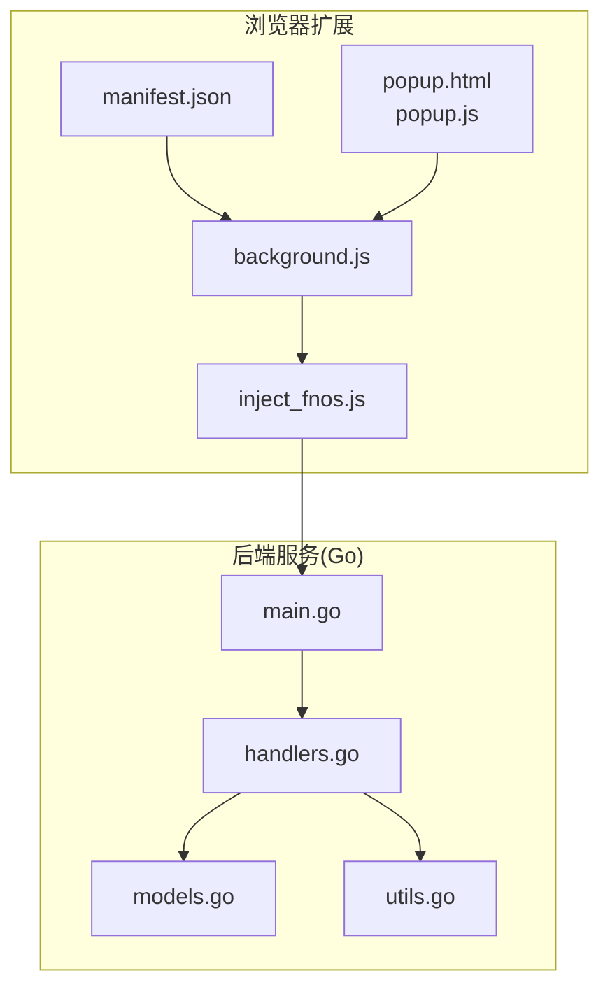
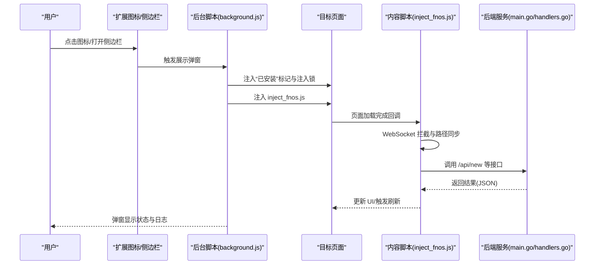
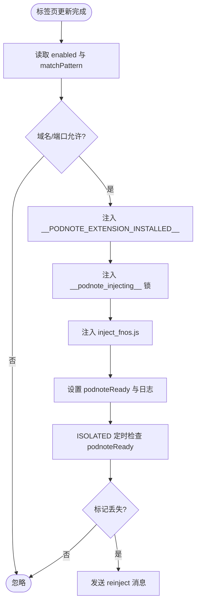
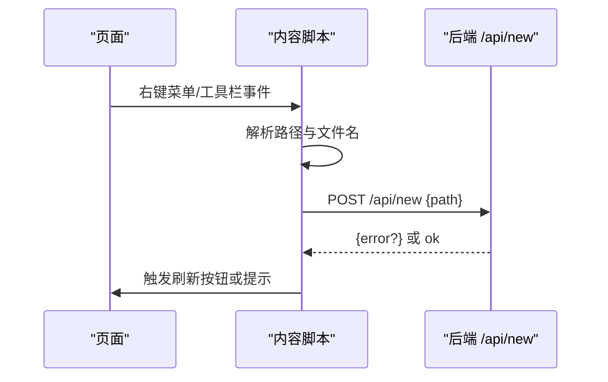
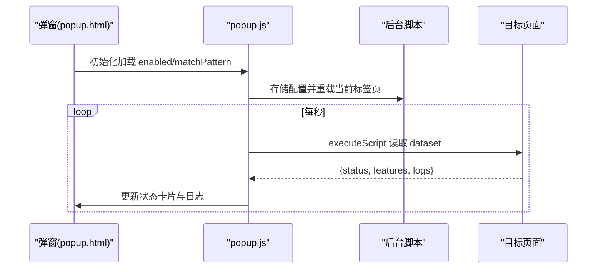
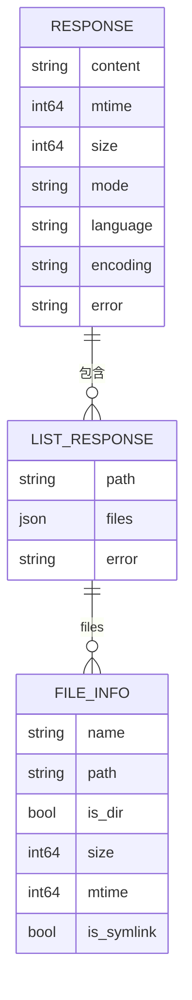
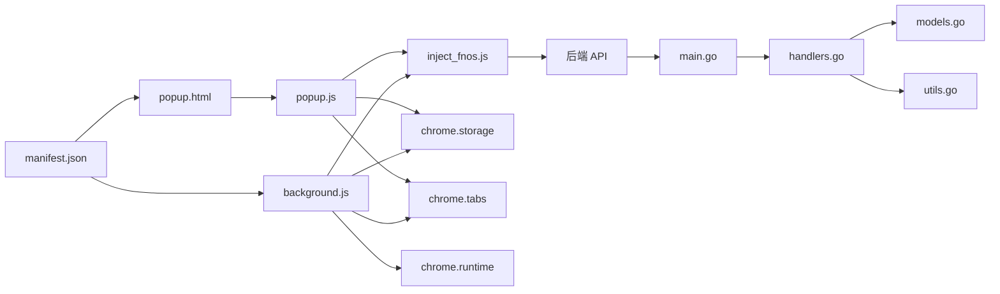

# Chrome 扩展开发

<cite>
**本文引用的文件**
- [manifest.json](file://chrome_extension/manifest.json)
- [background.js](file://chrome_extension/background.js)
- [inject_fnos.js](file://chrome_extension/inject_fnos.js)
- [popup.html](file://chrome_extension/popup.html)
- [popup.js](file://chrome_extension/popup.js)
- [main.go](file://src/main.go)
- [handlers.go](file://src/handlers.go)
- [models.go](file://src/models.go)
- [utils.go](file://src/utils.go)
- [README.md](file://README.md)
</cite>

## 目录
1. [简介](#简介)
2. [项目结构](#项目结构)
3. [核心组件](#核心组件)
4. [架构总览](#架构总览)
5. [组件详解](#组件详解)
6. [依赖关系分析](#依赖关系分析)
7. [性能考量](#性能考量)
8. [故障排查指南](#故障排查指南)
9. [结论](#结论)
10. [附录](#附录)

## 简介
本项目为 PodNote 的 Chrome/Edge 扩展，旨在与飞牛 OS（FNOS）文件管理器深度集成，提供右键编辑、工具栏“新建文件”、路径同步与日志监控等能力。扩展通过后台脚本在允许的域名/端口范围内自动注入内容脚本，内容脚本与页面交互并通过后端服务完成文件读写、新建等操作；弹出界面提供用户配置与状态监控。

## 项目结构
- chrome_extension：浏览器扩展源码
  - manifest.json：扩展清单，声明权限、后台脚本、侧边栏与图标
  - background.js：后台脚本，负责标签页生命周期监听、注入控制与重连
  - inject_fnos.js：内容脚本，负责与页面交互、UI 注入、WebSocket 拦截与后端 API 调用
  - popup.html + popup.js：弹出界面与逻辑，展示状态、日志与配置
- src：后端服务（Go），提供静态网关、API 与 WebSocket 通道
  - main.go：服务入口、路由注册与中间件链
  - handlers.go：具体业务处理器（读取/保存/新建/列表/监听/终端）
  - models.go：统一响应模型
  - utils.go：路径清洗、编码探测、终端 PTY 启动等工具
- README.md：扩展使用说明与安装指引

图表来源
- [manifest.json:1-28](file://chrome_extension/manifest.json#L1-L28)
- [background.js:1-169](file://chrome_extension/background.js#L1-L169)
- [inject_fnos.js:1-898](file://chrome_extension/inject_fnos.js#L1-L898)
- [popup.html:1-173](file://chrome_extension/popup.html#L1-L173)
- [popup.js:1-200](file://chrome_extension/popup.js#L1-L200)
- [main.go:1-145](file://src/main.go#L1-L145)
- [handlers.go:1-614](file://src/handlers.go#L1-L614)
- [models.go:1-30](file://src/models.go#L1-L30)
- [utils.go:1-262](file://src/utils.go#L1-L262)

章节来源
- [manifest.json:1-28](file://chrome_extension/manifest.json#L1-L28)
- [README.md:1-39](file://README.md#L1-L39)

## 核心组件
- 清单与权限
  - Manifest V3，声明 scripting、storage、tabs、sidePanel 权限，启用侧边栏与图标
- 后台脚本
  - 监听标签页更新，按域名/端口白名单判断是否注入
  - 注入“已安装”标记与互斥注入锁，避免重复注入
  - ISOLATED 监控，定期检查注入状态并在丢失时自动重注
- 内容脚本
  - WebSocket 拦截与路径同步，右键菜单注入“使用 PodNote 编辑”，工具栏注入“新建文件”
  - 与后端 API 交互，创建文件并触发页面刷新
- 弹出界面
  - 开关控制、域名/端口配置、状态与日志展示、DOM 标记清理

章节来源
- [manifest.json:6-27](file://chrome_extension/manifest.json#L6-L27)
- [background.js:4-117](file://chrome_extension/background.js#L4-L117)
- [inject_fnos.js:78-898](file://chrome_extension/inject_fnos.js#L78-L898)
- [popup.html:1-173](file://chrome_extension/popup.html#L1-L173)
- [popup.js:1-200](file://chrome_extension/popup.js#L1-L200)

## 架构总览
扩展采用“后台脚本 + 内容脚本 + 弹出界面”的三层架构：
- 后台脚本负责策略与注入控制
- 内容脚本负责页面交互与后端调用
- 弹出界面负责用户配置与状态可视化

图表来源
- [background.js:40-117](file://chrome_extension/background.js#L40-L117)
- [inject_fnos.js:826-854](file://chrome_extension/inject_fnos.js#L826-L854)
- [main.go:111-120](file://src/main.go#L111-L120)
- [handlers.go:363-424](file://src/handlers.go#L363-L424)
- [popup.js:99-158](file://chrome_extension/popup.js#L99-L158)

## 组件详解

### 清单与权限（manifest.json）
- 权限
  - scripting：动态注入脚本
  - storage：持久化用户配置
  - tabs：查询/重载当前标签页
  - sidePanel：启用侧边栏
- 主机权限
  - 允许所有 URL，便于在目标站点注入
- 后台与入口
  - service_worker：background.js
  - action.default_popup：popup.html
  - side_panel.default_path：popup.html

章节来源
- [manifest.json:6-27](file://chrome_extension/manifest.json#L6-L27)

### 后台脚本（background.js）
- 域名/端口白名单校验
  - 从 storage 读取 enabled 与 matchPattern，解析 host 关键词
- 标签页生命周期监听
  - onUpdated 完成时注入“已安装”标记与互斥锁，再注入 inject_fnos.js
  - 注入完成后设置 podnoteReady 标记与日志
- ISOLATED 监控
  - 在页面中设置定时器，若检测到 podnoteReady 丢失则发送 reinject 消息
- 重注流程
  - 收到 reinject 消息后再次执行注入与标记设置

图表来源
- [background.js:40-117](file://chrome_extension/background.js#L40-L117)
- [background.js:119-168](file://chrome_extension/background.js#L119-L168)

章节来源
- [background.js:4-117](file://chrome_extension/background.js#L4-L117)
- [background.js:119-168](file://chrome_extension/background.js#L119-L168)

### 内容脚本（inject_fnos.js）
- 日志与状态
  - 使用 dataset.podnoteLogs/podnoteStatus/podnoteFeatures 与扩展通信
- WebSocket 拦截
  - 识别 type=file 的 WS，解析 file.ls 请求，同步路径到窗口容器
- UI 注入
  - 右键菜单注入“使用 PodNote 编辑”
  - 工具栏注入“新建文件”按钮，调用 /api/new 创建空文件并触发刷新
- 窗口管理
  - 创建可拖拽/缩放/最大化的编辑器窗口，支持幽灵模式与焦点管理
- 事件与观察者
  - MutationObserver 监听 DOM 变化，自动注入 UI

图表来源
- [inject_fnos.js:826-854](file://chrome_extension/inject_fnos.js#L826-L854)
- [handlers.go:363-424](file://src/handlers.go#L363-L424)

章节来源
- [inject_fnos.js:78-123](file://chrome_extension/inject_fnos.js#L78-L123)
- [inject_fnos.js:179-194](file://chrome_extension/inject_fnos.js#L179-L194)
- [inject_fnos.js:317-595](file://chrome_extension/inject_fnos.js#L317-L595)
- [inject_fnos.js:718-868](file://chrome_extension/inject_fnos.js#L718-L868)
- [inject_fnos.js:874-898](file://chrome_extension/inject_fnos.js#L874-L898)

### 弹出界面（popup.html + popup.js）
- 状态与配置
  - 开关控制 enabled，输入框配置 matchPattern
  - 切换开关后写入 storage 并重载当前标签页
- 实时状态轮询
  - 每秒通过 executeScript 读取页面 dataset.podnoteStatus/features/logs
  - 渲染“注入状态/右键菜单/新建按钮”状态与日志列表
- DOM 标记清理
  - 禁用时主动清理页面上的 podnote* 标记，避免残留

图表来源
- [popup.html:1-173](file://chrome_extension/popup.html#L1-L173)
- [popup.js:13-158](file://chrome_extension/popup.js#L13-L158)
- [popup.js:160-189](file://chrome_extension/popup.js#L160-L189)

章节来源
- [popup.html:1-173](file://chrome_extension/popup.html#L1-L173)
- [popup.js:1-200](file://chrome_extension/popup.js#L1-L200)

### 后端服务（Go）
- 路由与网关
  - 动态注入版本号后缀，保证缓存失效与资源更新
  - 静态资源转发与 Monaco 核心资源处理
- 业务 API
  - /api/read：读取文件并转码
  - /api/save：原子写入保存
  - /api/create：新建文件预检
  - /api/new：物理创建空文件
  - /api/list：目录列表
  - /api/watch/ws：文件变更监控
  - /api/terminal/ws：终端会话（PTY）
  - /api/settings：云端配置读写
- 安全与健壮性
  - 路径清洗与目录逃逸防护
  - 编码探测与转码
  - 读写大小限制与二进制检测
  - 终端会话超时与心跳

图表来源
- [models.go:3-29](file://src/models.go#L3-L29)

章节来源
- [main.go:37-129](file://src/main.go#L37-L129)
- [handlers.go:21-112](file://src/handlers.go#L21-L112)
- [handlers.go:114-212](file://src/handlers.go#L114-L212)
- [handlers.go:214-324](file://src/handlers.go#L214-L324)
- [handlers.go:326-424](file://src/handlers.go#L326-L424)
- [handlers.go:426-494](file://src/handlers.go#L426-L494)
- [handlers.go:496-516](file://src/handlers.go#L496-L516)
- [handlers.go:531-611](file://src/handlers.go#L531-L611)
- [utils.go:25-53](file://src/utils.go#L25-L53)
- [utils.go:108-165](file://src/utils.go#L108-L165)
- [utils.go:167-261](file://src/utils.go#L167-L261)

## 依赖关系分析
- 扩展内部
  - manifest.json 依赖 background.js、inject_fnos.js、popup.html
  - background.js 依赖 storage、tabs、scripting、runtime
  - inject_fnos.js 依赖页面 DOM、WebSocket、fetch、dataset
  - popup.js 依赖 storage、tabs、scripting
- 后端服务
  - main.go 依赖 handlers.go、models.go、utils.go
  - handlers.go 依赖 utils.go、models.go

图表来源
- [manifest.json:1-28](file://chrome_extension/manifest.json#L1-L28)
- [background.js:1-169](file://chrome_extension/background.js#L1-L169)
- [inject_fnos.js:1-898](file://chrome_extension/inject_fnos.js#L1-L898)
- [popup.html:1-173](file://chrome_extension/popup.html#L1-L173)
- [popup.js:1-200](file://chrome_extension/popup.js#L1-L200)
- [main.go:1-145](file://src/main.go#L1-L145)
- [handlers.go:1-614](file://src/handlers.go#L1-L614)
- [models.go:1-30](file://src/models.go#L1-L30)
- [utils.go:1-262](file://src/utils.go#L1-L262)

章节来源
- [manifest.json:1-28](file://chrome_extension/manifest.json#L1-L28)
- [background.js:1-169](file://chrome_extension/background.js#L1-L169)
- [inject_fnos.js:1-898](file://chrome_extension/inject_fnos.js#L1-L898)
- [popup.html:1-173](file://chrome_extension/popup.html#L1-L173)
- [popup.js:1-200](file://chrome_extension/popup.js#L1-L200)
- [main.go:1-145](file://src/main.go#L1-L145)
- [handlers.go:1-614](file://src/handlers.go#L1-L614)
- [models.go:1-30](file://src/models.go#L1-L30)
- [utils.go:1-262](file://src/utils.go#L1-L262)

## 性能考量
- 注入互斥与去抖
  - 通过注入锁与页面标记避免重复注入，减少资源浪费
- 轮询频率
  - 弹窗每秒轮询一次，建议在低频场景下可适当增加间隔
- 网络与 IO
  - 后端对文件大小限制与二进制检测，避免大文件与二进制导致的性能问题
  - 保存采用临时文件 + 原子重命名，降低并发写入风险
- WebSocket 监控
  - 文件监控与终端会话均设置超时与心跳，防止资源泄漏

[本节为通用指导，无需特定文件来源]

## 故障排查指南
- 注入失败
  - 检查域名/端口白名单是否匹配
  - 查看后台脚本日志与页面 dataset.podnoteLogs
- 状态丢失
  - ISOLATED 监控会自动重注，若仍失败，检查页面是否存在注入锁或标记被清理
- 弹窗无日志
  - 确认 enabled 已开启，页面处于 http(s) 协议，且已注入
- 后端错误
  - 查看后端日志与返回的 error 字段，确认路径合法性、权限与文件状态

章节来源
- [background.js:101-117](file://chrome_extension/background.js#L101-L117)
- [background.js:119-168](file://chrome_extension/background.js#L119-L168)
- [popup.js:99-158](file://chrome_extension/popup.js#L99-L158)
- [handlers.go:363-424](file://src/handlers.go#L363-L424)

## 结论
该扩展通过后台脚本与内容脚本的协同，实现了与 FNOS 文件管理器的深度集成，具备良好的用户体验与可观测性。后端服务在安全、稳定与性能方面均有保障。建议在生产环境中持续关注注入互斥、日志容量与网络超时等细节，以提升稳定性与可维护性。

[本节为总结，无需特定文件来源]

## 附录

### 安全最佳实践
- 权限最小化：仅授予必要权限（scripting、storage、tabs、sidePanel）
- 白名单策略：严格配置域名/端口，避免在不受信任站点注入
- 路径清洗：后端对路径进行清洗与目录逃逸防护
- 编码与二进制检测：防止恶意内容加载
- 终端鉴权：仅管理员可使用终端会话

章节来源
- [manifest.json:6-11](file://chrome_extension/manifest.json#L6-L11)
- [background.js:10-36](file://chrome_extension/background.js#L10-L36)
- [utils.go:25-53](file://src/utils.go#L25-L53)
- [handlers.go:146-176](file://src/handlers.go#L146-L176)
- [handlers.go:496-516](file://src/handlers.go#L496-L516)

### 性能优化建议
- 减少 DOM 观察范围：MutationObserver 仅监听必要节点
- 合理缓存：弹窗轮询间隔可根据场景调整
- 后端压缩与缓存：中间件链已包含压缩与缓存控制
- WebSocket 心跳与超时：避免长时间空闲连接占用资源

章节来源
- [inject_fnos.js:891-894](file://chrome_extension/inject_fnos.js#L891-L894)
- [popup.js:52-56](file://chrome_extension/popup.js#L52-L56)
- [main.go:121-128](file://src/main.go#L121-L128)

### 兼容性处理
- Manifest V3：使用 service_worker 与 side_panel
- 主机权限：使用 <all_urls> 以覆盖不同域名/端口
- 页面世界：注入时指定 world: MAIN，确保与页面脚本互操作

章节来源
- [manifest.json:12-27](file://chrome_extension/manifest.json#L12-L27)
- [background.js:48-70](file://chrome_extension/background.js#L48-L70)

### 打包、发布与调试流程
- 本地调试
  - chrome://extensions 开启开发者模式，加载已解压的扩展目录
- 打包
  - 使用 zip 压缩扩展目录，提交至浏览器扩展商店
- 发布
  - 参考 README 中的 Microsoft Edge Addons 链接与安装步骤

章节来源
- [README.md:23-31](file://README.md#L23-L31)