# Manifest 配置详解

<cite>
**本文档引用的文件**
- [manifest.json](file://chrome_extension/manifest.json)
- [background.js](file://chrome_extension/background.js)
- [popup.html](file://chrome_extension/popup.html)
- [popup.js](file://chrome_extension/popup.js)
- [inject_fnos.js](file://chrome_extension/inject_fnos.js)
- [README.md](file://README.md)
</cite>

## 目录
1. [简介](#简介)
2. [项目结构概览](#项目结构概览)
3. [核心配置项详解](#核心配置项详解)
4. [权限配置深度解析](#权限配置深度解析)
5. [后台服务工作线程配置](#后台服务工作线程配置)
6. [用户界面组件对比](#用户界面组件对比)
7. [图标配置与版本管理](#图标配置与版本管理)
8. [安全配置策略](#安全配置策略)
9. [最佳实践指南](#最佳实践指南)
10. [常见问题排查](#常见问题排查)
11. [总结](#总结)

## 简介

本文档深入解析 PodNote Chrome 扩展的 Manifest V3 配置，这是一个专为飞牛OS（FNOS）文件管理器设计的文本编辑辅助扩展。该扩展通过 Manifest V3 的现代化架构实现了与浏览器的深度集成，提供了文件管理器右键编辑、工具栏新建文件等核心功能。

该扩展采用模块化设计，包含后台服务工作线程、弹出式界面和注入式脚本三个主要组件，通过精心配置的权限系统实现了安全高效的浏览器扩展体验。

## 项目结构概览

PodNote 扩展采用清晰的文件组织结构，主要包含以下核心文件：

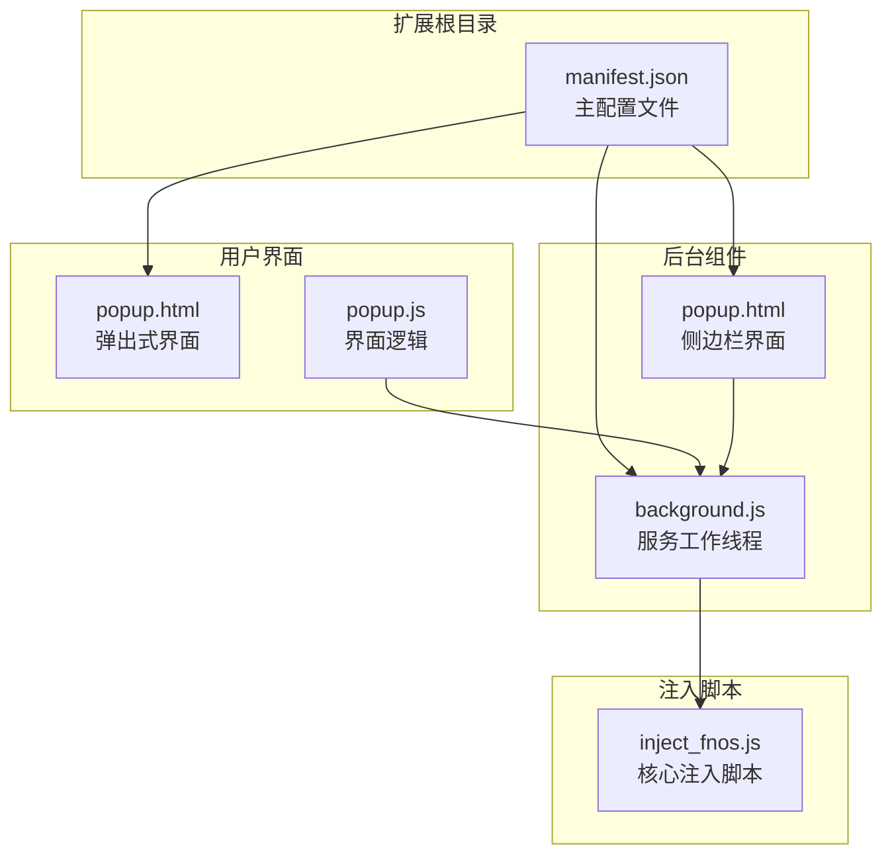

**图表来源**
- [manifest.json:1-28](file://chrome_extension/manifest.json#L1-L28)
- [background.js:1-169](file://chrome_extension/background.js#L1-L169)

**章节来源**
- [README.md:12-18](file://README.md#L12-L18)

## 核心配置项详解

### 基础信息配置

Manifest V3 配置文件的核心基础信息定义了扩展的基本属性和元数据：

| 配置项 | 值 | 说明 |
|--------|-----|------|
| `manifest_version` | 3 | 指定使用 Manifest V3 标准，享受最新的浏览器扩展功能 |
| `name` | "PodNote 拓展" | 扩展显示名称，用户在扩展管理页面可见 |
| `version` | "2.0" | 版本号，遵循语义化版本控制 |
| `description` | "PodNote FNOS 文件管理辅助拓展" | 扩展功能描述，帮助用户理解用途 |

这些基础配置项构成了扩展的身份标识，确保用户能够准确识别和管理扩展。

**章节来源**
- [manifest.json:2-5](file://chrome_extension/manifest.json#L2-L5)

### 权限声明机制

Manifest V3 引入了更严格的权限模型，要求明确声明所需权限。PodNote 扩展声明了以下核心权限：

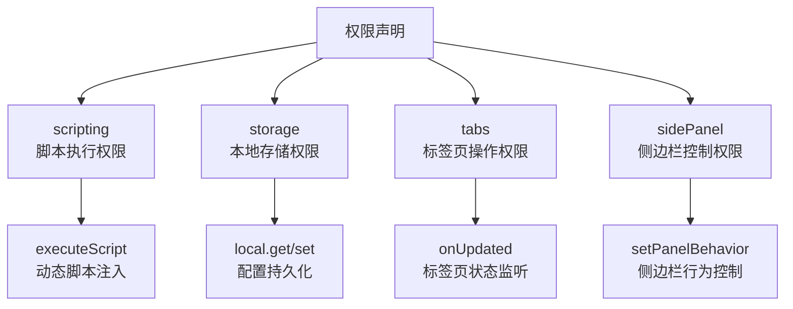

**图表来源**
- [manifest.json:6-11](file://chrome_extension/manifest.json#L6-L11)

**章节来源**
- [manifest.json:6-11](file://chrome_extension/manifest.json#L6-L11)

## 权限配置深度解析

### scripting 权限详解

`scripting` 权限是 PodNote 扩展的核心能力之一，它允许扩展在目标页面中执行 JavaScript 代码：

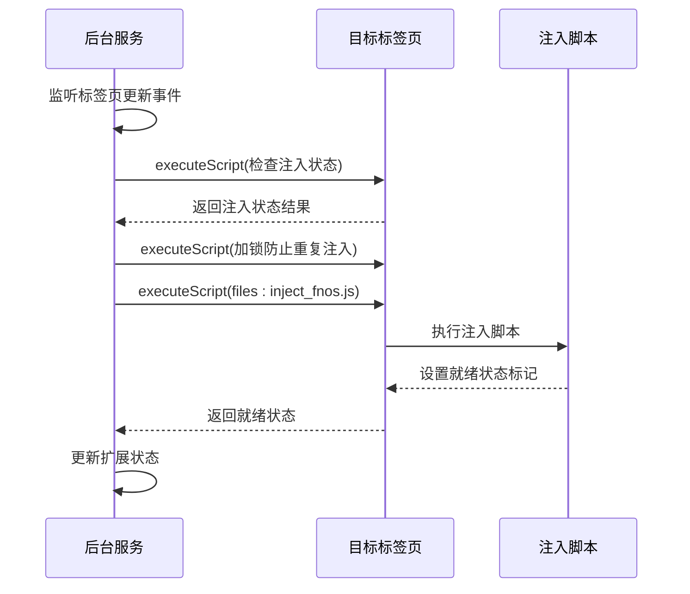

**图表来源**
- [background.js:40-117](file://chrome_extension/background.js#L40-L117)
- [background.js:119-168](file://chrome_extension/background.js#L119-L168)

该权限使扩展能够在合适的时机向目标页面注入核心功能脚本，实现与飞牛OS文件管理器的深度集成。

**章节来源**
- [background.js:48-94](file://chrome_extension/background.js#L48-L94)

### storage 权限应用场景

`storage` 权限用于持久化扩展配置和状态信息：

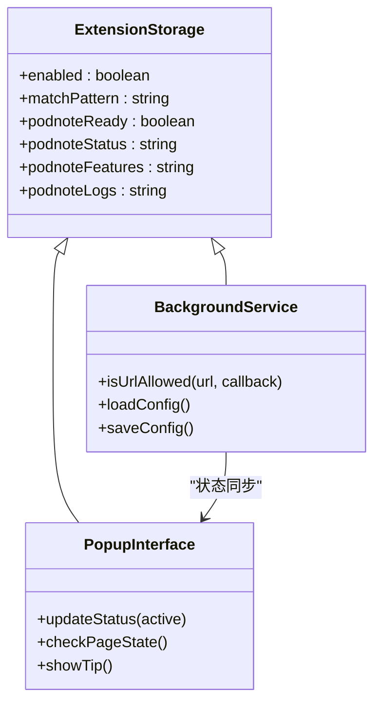

**图表来源**
- [background.js:10-16](file://chrome_extension/background.js#L10-L16)
- [popup.js:13-17](file://chrome_extension/popup.js#L13-L17)

存储权限支持扩展在不同组件间共享配置信息，实现状态的一致性和持久化。

**章节来源**
- [popup.js:13-42](file://chrome_extension/popup.js#L13-L42)

### tabs 权限执行流程

`tabs` 权限允许扩展监听和操作浏览器标签页：

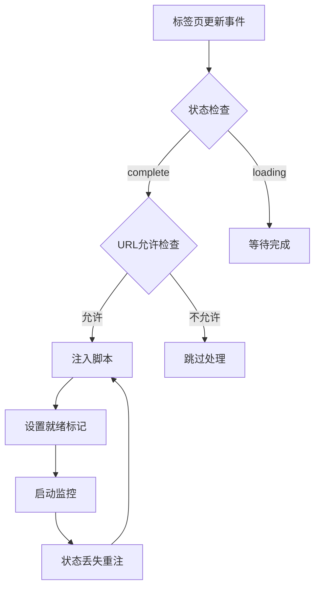

**图表来源**
- [background.js:40-117](file://chrome_extension/background.js#L40-L117)

该权限使扩展能够实时响应页面加载状态，确保在正确的时机执行注入操作。

**章节来源**
- [background.js:40-117](file://chrome_extension/background.js#L40-L117)

### sidePanel 权限配置策略

`sidePanel` 权限启用扩展的侧边栏功能，提供更丰富的用户交互体验：

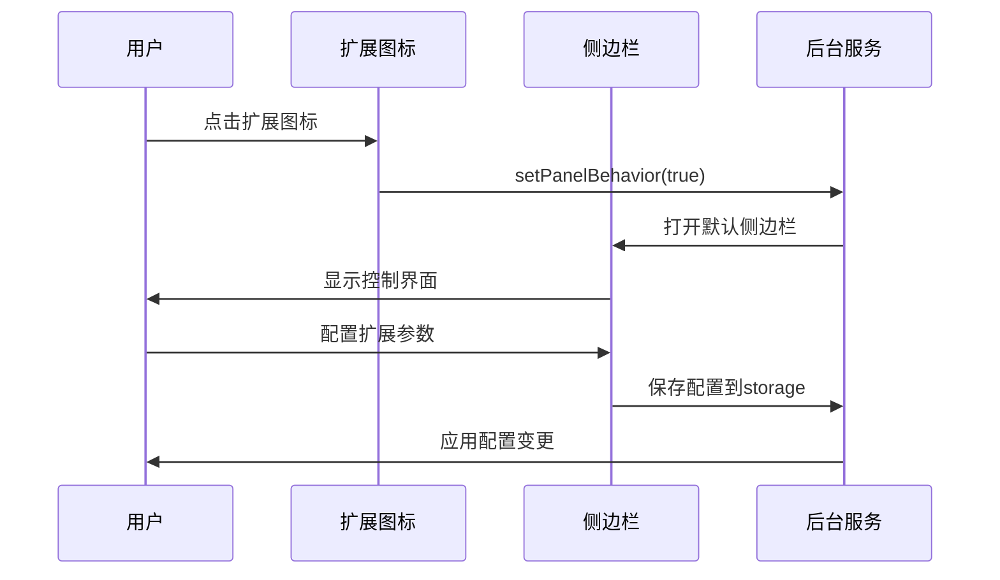

**图表来源**
- [background.js:1-2](file://chrome_extension/background.js#L1-L2)
- [manifest.json:12-14](file://chrome_extension/manifest.json#L12-L14)

**章节来源**
- [manifest.json:12-14](file://chrome_extension/manifest.json#L12-L14)

## 后台服务工作线程配置

### service_worker 生命周期管理

PodNote 扩展使用 `background.service_worker` 配置启用了后台服务工作线程：

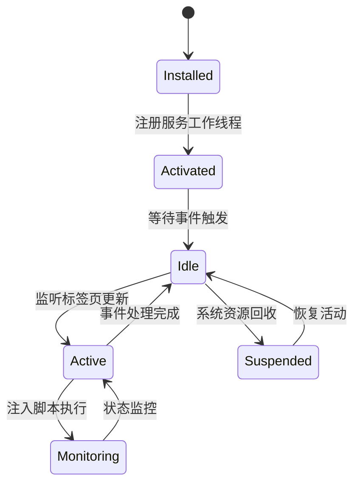

**图表来源**
- [manifest.json:18-20](file://chrome_extension/manifest.json#L18-L20)
- [background.js:1-169](file://chrome_extension/background.js#L1-L169)

服务工作线程具有以下特点：
- **事件驱动**：仅在需要时激活，节省系统资源
- **持久连接**：保持与浏览器的长期通信通道
- **异步处理**：支持复杂的异步操作和状态管理

**章节来源**
- [manifest.json:18-20](file://chrome_extension/manifest.json#L18-L20)

### 标签页事件监听机制

后台服务通过 `chrome.tabs.onUpdated` 监听标签页状态变化：

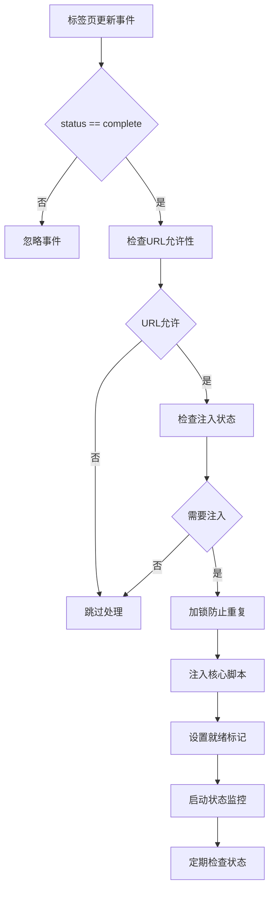

**图表来源**
- [background.js:40-117](file://chrome_extension/background.js#L40-L117)

**章节来源**
- [background.js:40-117](file://chrome_extension/background.js#L40-L117)

## 用户界面组件对比

### action.default_popup vs side_panel

PodNote 扩展同时配置了两种不同的用户界面组件：

| 组件类型 | 配置位置 | 默认路径 | 特点 | 使用场景 |
|----------|----------|----------|------|----------|
| action.default_popup | `action.default_popup` | "popup.html" | 传统弹出式界面 | 快速访问和临时操作 |
| side_panel | `side_panel.default_path` | "popup.html" | 侧边栏界面 | 详细配置和长期交互 |

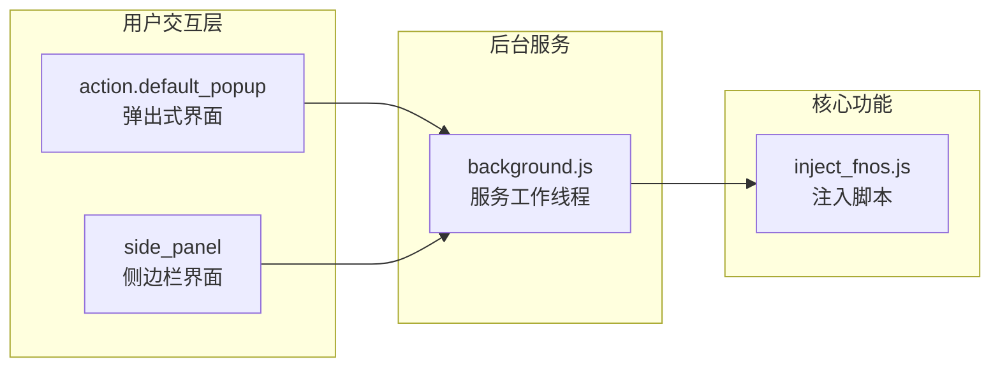

**图表来源**
- [manifest.json:21-23](file://chrome_extension/manifest.json#L21-L23)
- [manifest.json:12-14](file://chrome_extension/manifest.json#L12-L14)

### 界面组件功能差异

**弹出式界面（action.default_popup）**：
- 适合快速访问和临时操作
- 占用空间较小，便于快捷使用
- 适合简单的状态查看和基本配置

**侧边栏界面（side_panel）**：
- 提供更丰富的交互空间
- 支持复杂的配置界面和状态监控
- 适合长期使用的详细功能

**章节来源**
- [manifest.json:21-23](file://chrome_extension/manifest.json#L21-L23)
- [manifest.json:12-14](file://chrome_extension/manifest.json#L12-L14)

## 图标配置与版本管理

### 图标资源配置

PodNote 扩展配置了标准尺寸的图标文件：

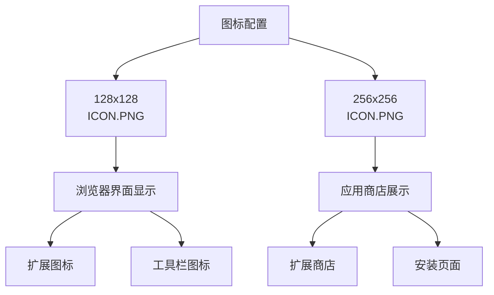

**图表来源**
- [manifest.json:24-27](file://chrome_extension/manifest.json#L24-L27)

图标配置遵循 Chrome 扩展的标准规范，确保在不同界面和分辨率下都有良好的显示效果。

**章节来源**
- [manifest.json:24-27](file://chrome_extension/manifest.json#L24-L27)

### 版本管理策略

扩展采用语义化版本控制：
- **主版本号**：重大功能变更或架构调整
- **次版本号**：新增功能但保持向后兼容
- **修订号**：bug 修复和小功能改进

当前版本 "2.0" 表示该扩展已经过重要功能完善和稳定性提升。

## 安全配置策略

### host_permissions 配置分析

PodNote 扩展配置了 `<all_urls>` 权限，这在功能集成场景下是必要的：

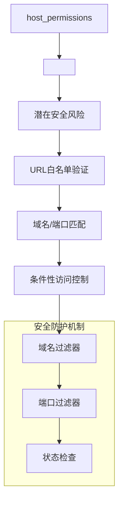

**图表来源**
- [manifest.json:15-17](file://chrome_extension/manifest.json#L15-L17)
- [background.js:5-37](file://chrome_extension/background.js#L5-L37)

### 安全实现机制

扩展通过多重安全措施确保最小权限原则：

1. **URL 白名单机制**：通过 `matchPattern` 配置精确控制允许访问的域名
2. **动态权限验证**：运行时检查 URL 合法性，避免不必要的页面访问
3. **注入状态监控**：实时监控注入状态，防止重复注入和冲突
4. **错误处理机制**：完善的异常捕获和错误恢复

**章节来源**
- [background.js:5-37](file://chrome_extension/background.js#L5-L37)

## 最佳实践指南

### 权限申请最佳实践

根据 PodNote 的实际需求，建议遵循以下权限申请原则：

1. **最小权限原则**：仅申请必要的权限，避免过度授权
2. **动态权限控制**：结合 `host_permissions` 和运行时验证实现细粒度控制
3. **用户透明度**：通过界面明确告知用户权限使用情况
4. **权限撤销机制**：提供用户随时撤销权限的选项

### 性能优化建议

1. **懒加载策略**：仅在需要时加载和执行注入脚本
2. **内存管理**：及时清理事件监听器和定时器
3. **缓存机制**：合理使用 `chrome.storage` 缓存配置信息
4. **异步处理**：避免阻塞主线程，使用异步 API

### 兼容性保证

1. **版本降级**：确保在不同浏览器版本间的兼容性
2. **功能回退**：为不支持的功能提供替代方案
3. **错误处理**：完善的异常捕获和用户提示
4. **测试覆盖**：全面的功能测试和回归测试

## 常见问题排查

### 注入失败问题

**问题现象**：扩展图标显示"未激活"状态

**可能原因**：
1. URL 不在允许列表中
2. 页面尚未完全加载
3. 注入脚本被其他扩展阻止
4. 页面存在 CSP 限制

**解决方法**：
1. 检查 `matchPattern` 配置是否正确
2. 确认页面加载完成后再进行注入
3. 检查其他扩展的冲突情况
4. 调整页面的 CSP 设置

### 状态不同步问题

**问题现象**：弹出式界面与侧边栏显示状态不一致

**解决方法**：
1. 检查 `chrome.storage` 的读写权限
2. 确认状态更新的同步机制
3. 验证事件监听器的注册情况

### 性能问题诊断

**性能监控指标**：
- 注入脚本执行时间
- 内存使用情况
- 事件监听器数量
- 网络请求频率

**优化建议**：
1. 减少不必要的 DOM 查询
2. 合理使用防抖和节流
3. 及时清理不再使用的资源
4. 使用异步加载减少阻塞

## 总结

PodNote Chrome 扩展的 Manifest V3 配置展现了现代浏览器扩展开发的最佳实践。通过精心设计的权限体系、高效的后台服务架构和友好的用户界面，该扩展实现了与飞牛OS文件管理器的深度集成。

关键成功因素包括：
- **权限管理**：遵循最小权限原则，结合运行时验证实现安全控制
- **架构设计**：采用服务工作线程+注入脚本的混合架构，平衡性能和功能
- **用户体验**：提供弹出式和侧边栏两种界面，满足不同使用场景
- **安全性**：通过多层防护机制确保用户数据和隐私安全

该配置方案为类似的企业级浏览器扩展开发提供了优秀的参考模板，展示了如何在功能完整性、性能表现和安全性之间取得最佳平衡。