# 后台服务脚本

<cite>
**本文档引用的文件**
- [background.js](file://chrome_extension/background.js)
- [manifest.json](file://chrome_extension/manifest.json)
- [popup.js](file://chrome_extension/popup.js)
- [popup.html](file://chrome_extension/popup.html)
- [inject_fnos.js](file://chrome_extension/inject_fnos.js)
- [main.go](file://src/main.go)
- [handlers.go](file://src/handlers.go)
- [models.go](file://src/models.go)
</cite>

## 目录
1. [简介](#简介)
2. [项目结构](#项目结构)
3. [核心组件](#核心组件)
4. [架构概览](#架构概览)
5. [详细组件分析](#详细组件分析)
6. [依赖关系分析](#依赖关系分析)
7. [性能考虑](#性能考虑)
8. [故障排除指南](#故障排除指南)
9. [结论](#结论)

## 简介

PodNote 是一个 Chrome 扩展程序，旨在为 FNOS 文件管理系统提供增强的编辑体验。该扩展通过后台服务脚本实现智能的页面注入和状态管理，为用户提供无缝的文件编辑和管理功能。

该扩展的核心架构基于 Chrome Extension Manifest V3，采用服务工作者（Service Worker）作为后台运行环境，结合内容脚本注入和弹出界面管理，实现了高效的浏览器集成解决方案。

## 项目结构

项目采用模块化设计，主要分为三个核心部分：

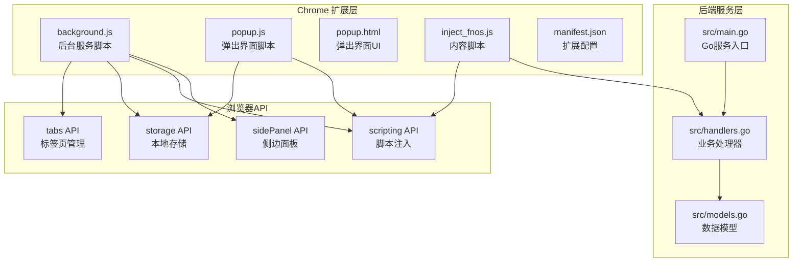

**图表来源**
- [background.js:1-169](file://chrome_extension/background.js#L1-L169)
- [manifest.json:1-28](file://chrome_extension/manifest.json#L1-L28)
- [main.go:1-145](file://src/main.go#L1-L145)

**章节来源**
- [manifest.json:1-28](file://chrome_extension/manifest.json#L1-L28)
- [background.js:1-169](file://chrome_extension/background.js#L1-L169)

## 核心组件

### 1. 后台服务脚本 (background.js)

后台服务脚本是整个扩展的核心控制器，负责以下关键功能：

- **URL 白名单验证**：根据用户配置的域名和端口列表决定是否注入脚本
- **标签页生命周期管理**：监听标签页状态变化，自动注入和管理内容脚本
- **消息路由中心**：处理来自不同来源的消息，协调各组件间通信
- **状态监控与恢复**：通过 ISOLATED 环境监控注入状态，实现自动重连

### 2. 内容脚本注入器 (inject_fnos.js)

内容脚本负责在目标页面中执行实际的功能逻辑：

- **WebSocket 拦截**：监控文件管理相关的 WebSocket 通信
- **UI 组件注入**：向文件管理界面添加新的编辑和操作按钮
- **状态同步**：维护与后台服务的双向通信
- **窗口管理**：创建和管理独立的编辑器窗口

### 3. 弹出界面 (popup.js)

弹出界面提供用户交互入口：

- **配置管理**：允许用户启用/禁用扩展和配置域名白名单
- **状态监控**：实时显示当前页面的注入状态和日志
- **功能展示**：展示扩展的各项功能状态

**章节来源**
- [background.js:1-169](file://chrome_extension/background.js#L1-L169)
- [inject_fnos.js:1-898](file://chrome_extension/inject_fnos.js#L1-L898)
- [popup.js:1-200](file://chrome_extension/popup.js#L1-L200)

## 架构概览

扩展采用分层架构设计，确保各组件间的松耦合和高内聚：

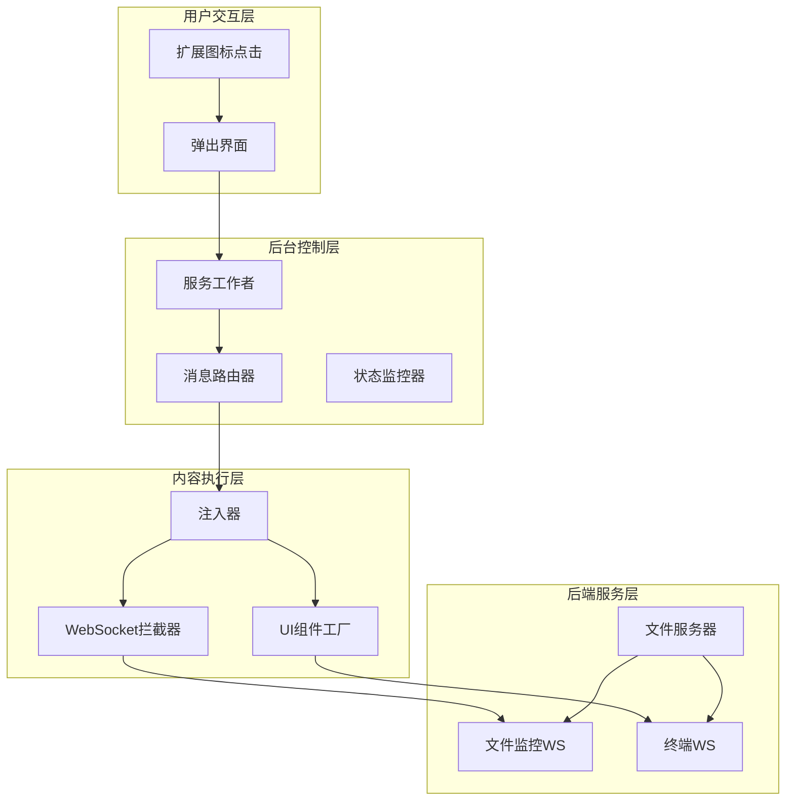

**图表来源**
- [background.js:39-117](file://chrome_extension/background.js#L39-L117)
- [inject_fnos.js:78-123](file://chrome_extension/inject_fnos.js#L78-L123)
- [main.go:111-120](file://src/main.go#L111-L120)

## 详细组件分析

### 后台服务脚本架构分析

#### URL 白名单验证机制

后台脚本实现了灵活的 URL 匹配机制，支持多种配置格式：

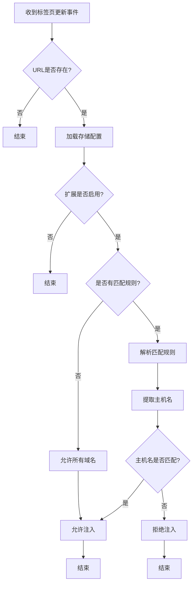

**图表来源**
- [background.js:5-37](file://chrome_extension/background.js#L5-L37)

#### 标签页生命周期管理

后台脚本通过监听 `chrome.tabs.onUpdated` 事件实现对标签页生命周期的完整管理：

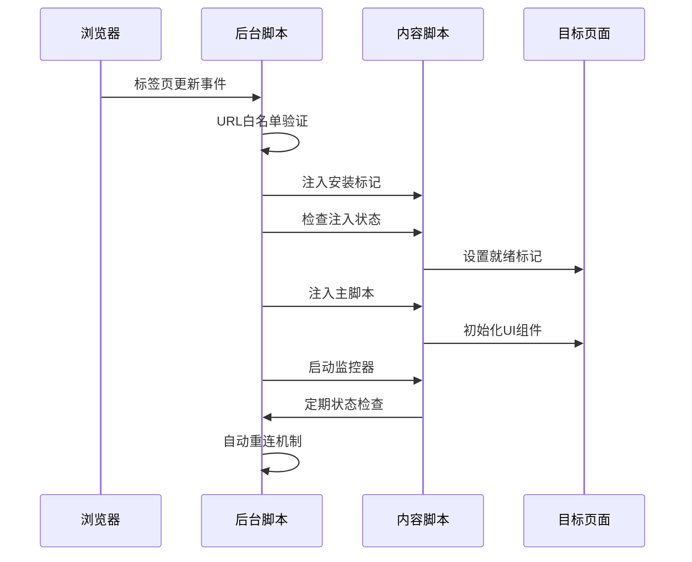

**图表来源**
- [background.js:40-117](file://chrome_extension/background.js#L40-L117)

#### 消息路由机制

扩展实现了多源消息处理系统，支持来自不同组件的消息：

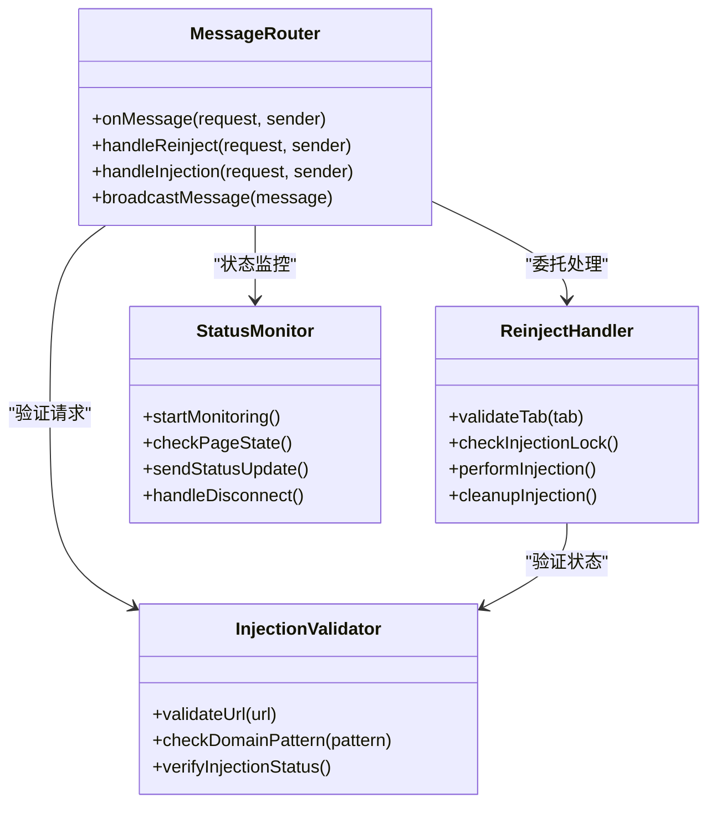

**图表来源**
- [background.js:120-168](file://chrome_extension/background.js#L120-L168)

**章节来源**
- [background.js:1-169](file://chrome_extension/background.js#L1-L169)

### 内容脚本架构分析

#### WebSocket 拦截器设计

内容脚本实现了对特定类型 WebSocket 连接的智能拦截和处理：

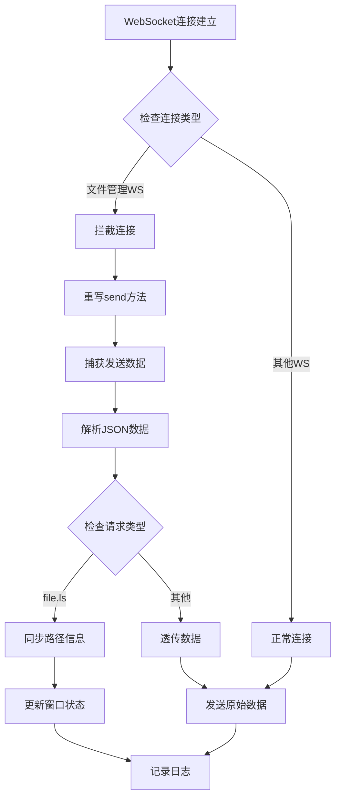

**图表来源**
- [inject_fnos.js:80-123](file://chrome_extension/inject_fnos.js#L80-L123)

#### UI 组件工厂

内容脚本提供了完整的 UI 组件创建和管理能力：

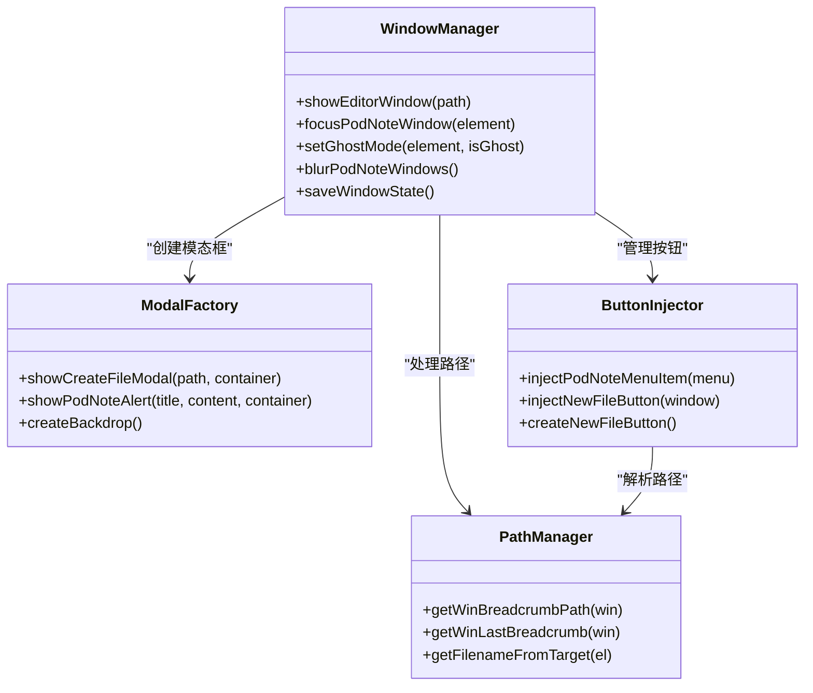

**图表来源**
- [inject_fnos.js:317-595](file://chrome_extension/inject_fnos.js#L317-L595)

**章节来源**
- [inject_fnos.js:1-898](file://chrome_extension/inject_fnos.js#L1-L898)

### 弹出界面架构分析

#### 状态管理系统

弹出界面实现了完整的状态管理机制，包括配置持久化和实时状态同步：

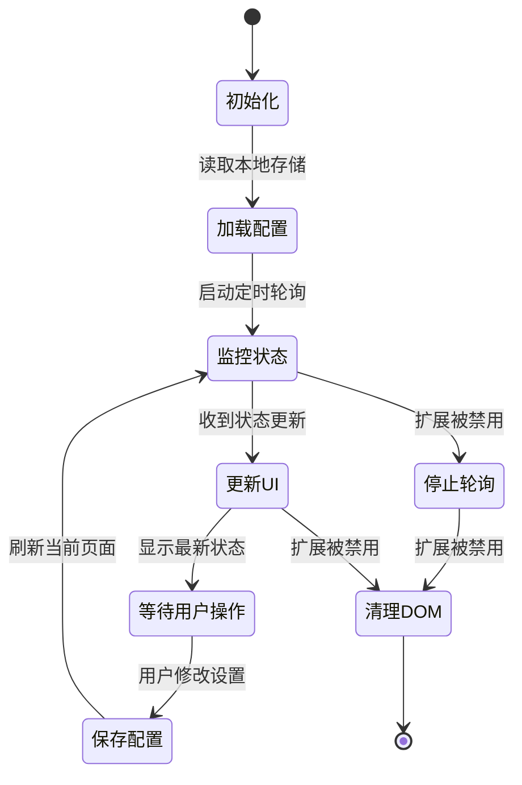

**图表来源**
- [popup.js:44-97](file://chrome_extension/popup.js#L44-L97)

#### 实时日志系统

弹出界面提供了强大的日志监控功能：

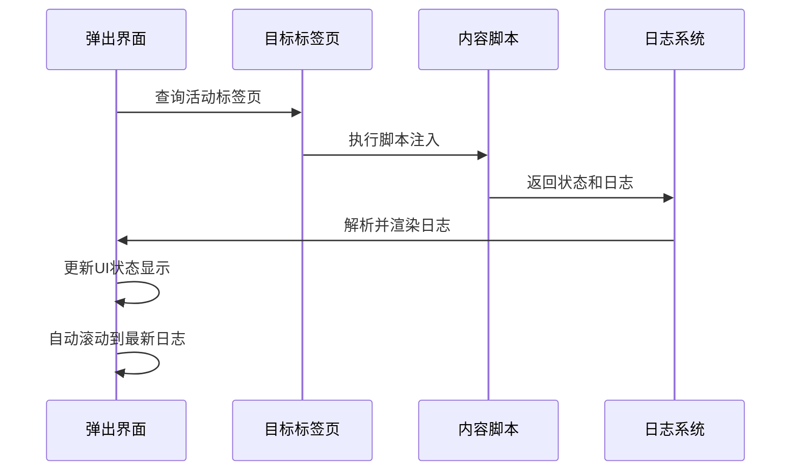

**图表来源**
- [popup.js:99-158](file://chrome_extension/popup.js#L99-L158)

**章节来源**
- [popup.js:1-200](file://chrome_extension/popup.js#L1-L200)

## 依赖关系分析

### 浏览器API集成

扩展深度集成了多个 Chrome 浏览器 API：

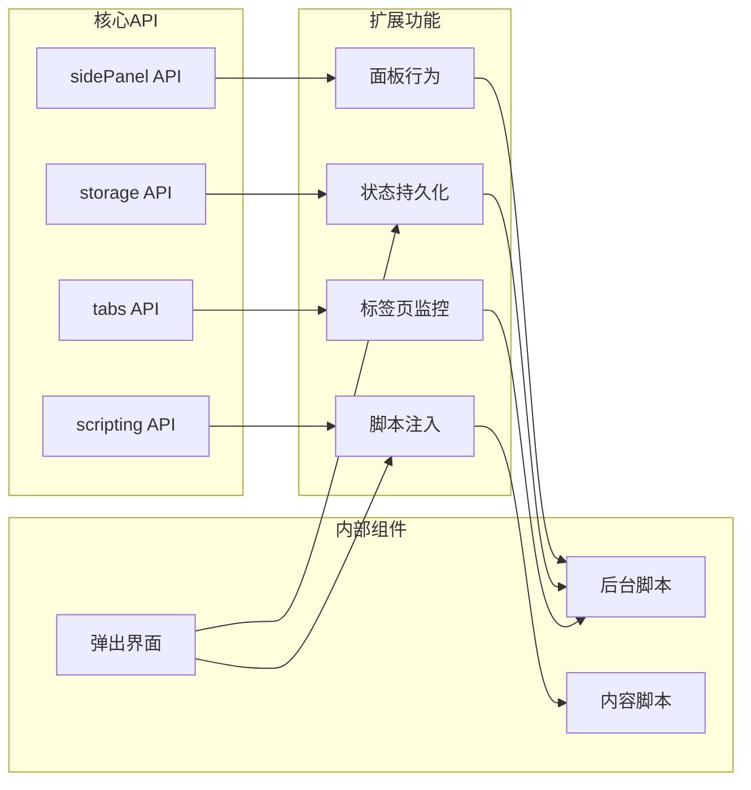

**图表来源**
- [manifest.json:6-11](file://chrome_extension/manifest.json#L6-L11)
- [background.js:1-2](file://chrome_extension/background.js#L1-L2)

### 后端服务集成

扩展通过 HTTP 和 WebSocket 与后端服务通信：

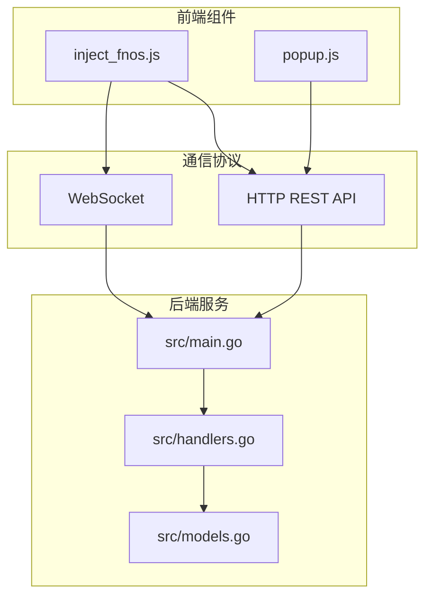

**图表来源**
- [main.go:111-120](file://src/main.go#L111-L120)
- [handlers.go:426-494](file://src/handlers.go#L426-L494)

**章节来源**
- [manifest.json:1-28](file://chrome_extension/manifest.json#L1-L28)
- [main.go:1-145](file://src/main.go#L1-L145)

## 性能考虑

### 内存管理策略

扩展采用了多项内存管理优化措施：

1. **对象池模式**：使用 `window.__NP_WINS__` 对象池管理编辑器窗口实例
2. **事件监听器清理**：定期清理不再使用的 MutationObserver 和事件监听器
3. **DOM 元素回收**：及时移除不再需要的 DOM 元素和样式表
4. **缓存控制**：合理使用 localStorage 存储窗口状态，避免重复计算

### 注入互斥机制

为避免重复注入和资源竞争，扩展实现了完善的互斥控制：

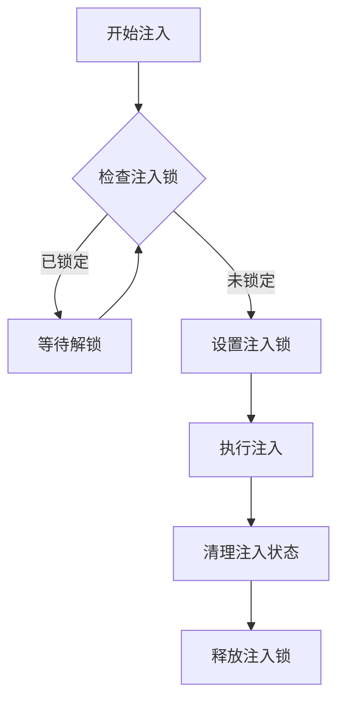

**图表来源**
- [background.js:54-97](file://chrome_extension/background.js#L54-L97)

### 性能优化建议

1. **异步操作优先**：所有长时间运行的操作都使用 Promise 和 async/await
2. **批量DOM操作**：减少DOM查询和修改次数
3. **防抖和节流**：对高频事件使用防抖和节流技术
4. **懒加载策略**：只在需要时加载和初始化功能模块

## 故障排除指南

### 常见问题诊断

#### 注入失败排查

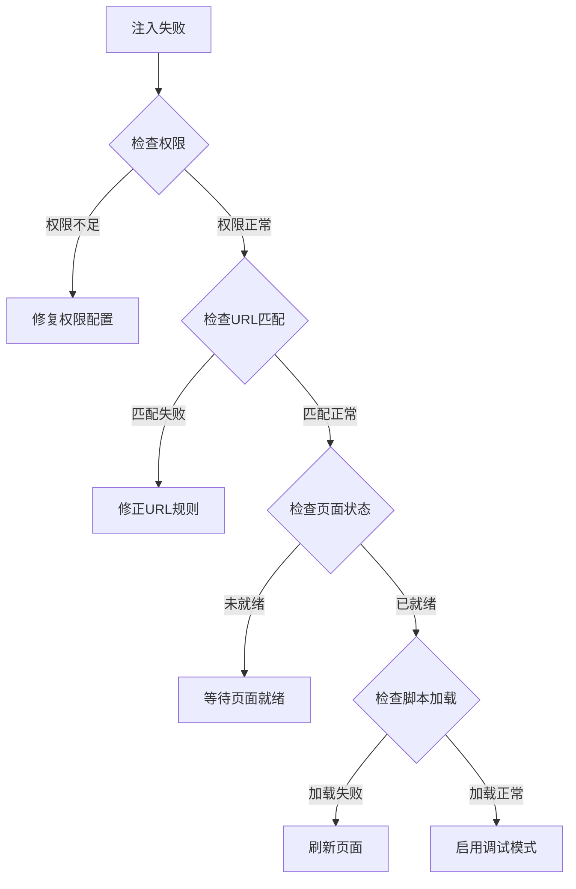

#### 状态监控问题

弹出界面提供了完整的状态监控和调试功能：

1. **日志查看**：通过弹出界面查看详细的执行日志
2. **状态轮询**：每秒自动同步页面状态
3. **错误提示**：对各种异常情况提供友好的错误信息
4. **自动重连**：实现智能的自动重连机制

**章节来源**
- [background.js:119-168](file://chrome_extension/background.js#L119-L168)
- [popup.js:160-189](file://chrome_extension/popup.js#L160-L189)

## 结论

PodNote Chrome 扩展展现了现代浏览器扩展开发的最佳实践，通过精心设计的架构实现了功能完整性、性能优化和用户体验的平衡。

### 主要优势

1. **模块化设计**：清晰的组件分离和职责划分
2. **智能注入**：基于 URL 白名单的精准注入机制
3. **状态管理**：完善的生命周期管理和状态恢复
4. **性能优化**：多项内存管理和异步处理优化
5. **错误处理**：健壮的错误处理和重连机制

### 技术亮点

- **服务工作者架构**：充分利用 Manifest V3 的服务工作者特性
- **WebSocket 拦截**：创新的网络通信拦截和处理机制
- **UI 组件工厂**：可复用的组件创建和管理框架
- **实时监控系统**：完整的状态监控和日志记录

该扩展为 FNOS 文件管理系统提供了强大的浏览器端增强功能，通过优雅的架构设计和完善的错误处理机制，确保了稳定可靠的服务体验。