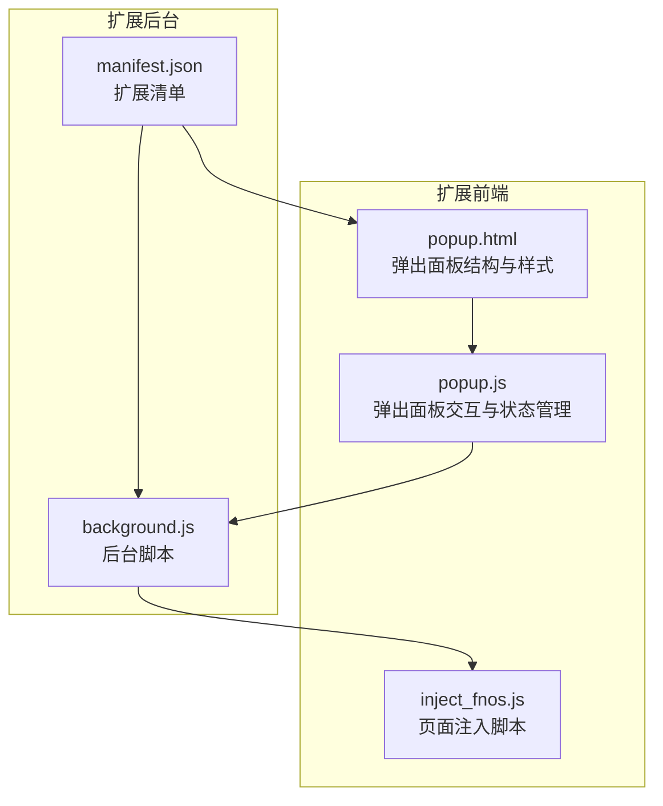
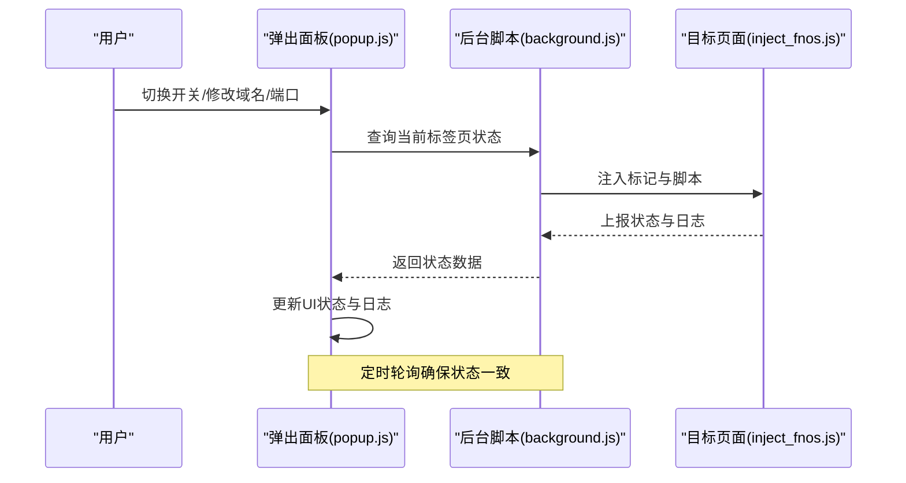
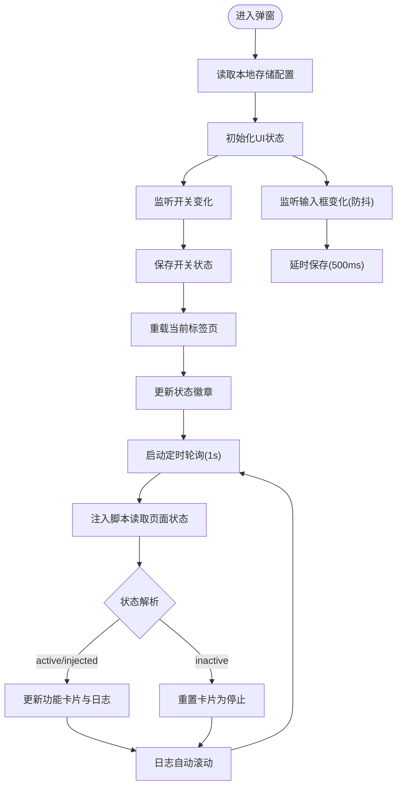
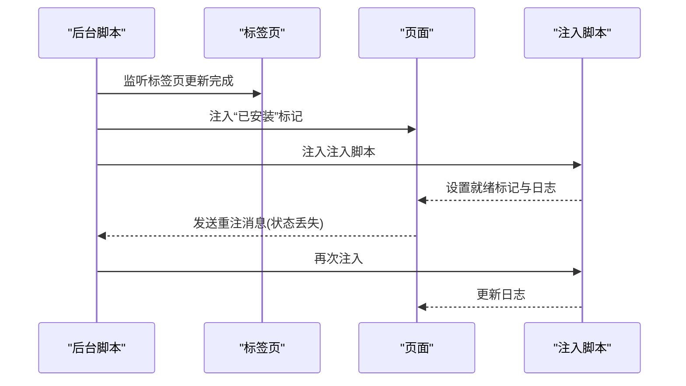
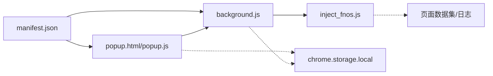

# 弹出界面实现

<cite>
**本文引用的文件**
- [popup.html](file://chrome_extension/popup.html)
- [popup.js](file://chrome_extension/popup.js)
- [background.js](file://chrome_extension/background.js)
- [manifest.json](file://chrome_extension/manifest.json)
- [inject_fnos.js](file://chrome_extension/inject_fnos.js)
</cite>

## 目录
1. [简介](#简介)
2. [项目结构](#项目结构)
3. [核心组件](#核心组件)
4. [架构总览](#架构总览)
5. [详细组件分析](#详细组件分析)
6. [依赖关系分析](#依赖关系分析)
7. [性能考量](#性能考量)
8. [故障排查指南](#故障排查指南)
9. [结论](#结论)
10. [附录](#附录)

## 简介
本文件面向开发者与产品人员，系统性解析 Chrome 扩展弹出界面（popup）的实现，涵盖：
- popup.html 的结构设计与布局方案
- popup.js 的功能实现（用户交互、配置管理、与后台脚本通信）
- 界面状态管理（加载/错误/成功）
- 与后台脚本的消息通信机制（请求发送、响应处理、错误反馈）
- 用户配置的存储与同步（本地存储与同步存储）
- 响应式设计与主题适配
- 用户体验优化与无障碍支持
- 完整交互示例与调试技巧

## 项目结构
弹出界面位于 Chrome 扩展的 chrome_extension 目录下，关键文件如下：
- popup.html：弹出面板的 HTML 结构与样式
- popup.js：弹出面板的交互逻辑与状态管理
- background.js：后台脚本，负责注入控制、消息监听与重注逻辑
- manifest.json：扩展清单，声明权限、入口与侧边栏行为
- inject_fnos.js：注入到目标页面的脚本，负责与页面交互与日志上报

图表来源
- [popup.html:1-173](file://chrome_extension/popup.html#L1-L173)
- [popup.js:1-200](file://chrome_extension/popup.js#L1-L200)
- [background.js:1-169](file://chrome_extension/background.js#L1-L169)
- [manifest.json:1-28](file://chrome_extension/manifest.json#L1-L28)

章节来源
- [popup.html:1-173](file://chrome_extension/popup.html#L1-L173)
- [popup.js:1-200](file://chrome_extension/popup.js#L1-L200)
- [background.js:1-169](file://chrome_extension/background.js#L1-L169)
- [manifest.json:1-28](file://chrome_extension/manifest.json#L1-L28)

## 核心组件
- 弹出面板结构与样式：采用 CSS 变量与网格布局，提供状态徽章、功能卡片、日志区与配置输入区。
- 弹出面板交互逻辑：监听开关与输入框变化，维护运行状态，定时轮询页面注入状态与日志，渲染实时日志。
- 后台脚本：根据配置判断页面是否允许注入，执行注入与重注逻辑，向页面注入标记位，维持注入状态。
- 页面注入脚本：在目标页面中注入 UI 组件与功能按钮，上报状态与日志，与后端 API 交互。

章节来源
- [popup.html:1-173](file://chrome_extension/popup.html#L1-L173)
- [popup.js:1-200](file://chrome_extension/popup.js#L1-L200)
- [background.js:1-169](file://chrome_extension/background.js#L1-L169)
- [inject_fnos.js:1-898](file://chrome_extension/inject_fnos.js#L1-L898)

## 架构总览
弹出面板与页面注入脚本通过后台脚本进行协调，形成“弹窗控制—后台注入—页面交互”的闭环。

图表来源
- [popup.js:1-200](file://chrome_extension/popup.js#L1-L200)
- [background.js:1-169](file://chrome_extension/background.js#L1-L169)
- [inject_fnos.js:1-898](file://chrome_extension/inject_fnos.js#L1-L898)

## 详细组件分析

### 弹出面板结构与布局（popup.html）
- 结构组成
  - 标题与状态徽章：显示“运行中/已禁用”，配合开关切换
  - 功能卡片区：展示注入状态、右键菜单、新建按钮三项指标
  - 实时日志区：展示页面注入脚本产生的日志，支持滚动与计数
  - 配置输入区：域名/端口匹配规则，支持自动保存提示
- 样式与主题
  - 使用 CSS 变量统一主题色与背景色
  - 状态徽章与数值颜色随状态变化（就绪/等待/停止/错误）
  - 日志区采用等宽字体与深色背景，便于阅读
- 响应式与可访问性
  - 使用系统字体栈，提升跨平台一致性
  - 文字大小与行高适中，保证可读性
  - 通过语义化标签与合适的对比度满足基础可访问性

章节来源
- [popup.html:1-173](file://chrome_extension/popup.html#L1-L173)

### 弹出面板交互与状态管理（popup.js）
- 初始化与配置加载
  - 从本地存储读取启用状态与匹配规则，设置 UI 初始值
- 用户交互处理
  - 开关切换：写入本地存储，触发当前标签页重载以应用变更；更新状态徽章与功能区显示
  - 输入框变更：防抖保存，避免频繁写入；显示“已自动保存”提示
- 状态管理
  - 运行中：显示功能区，启动定时轮询
  - 已禁用：隐藏功能区，清空日志，停止轮询，主动清理页面标记
- 页面状态轮询
  - 通过脚本注入读取页面数据集中的状态、特性与日志
  - 根据状态更新功能卡片与日志区
- 日志渲染
  - 解析 JSON 日志，按类型着色（同步/成功/错误），自动滚动到底部

图表来源
- [popup.js:1-200](file://chrome_extension/popup.js#L1-L200)

章节来源
- [popup.js:1-200](file://chrome_extension/popup.js#L1-L200)

### 后台脚本与消息通信（background.js）
- 入口行为
  - 设置点击图标时打开侧边栏
- 域名/端口匹配
  - 读取本地存储的启用状态与匹配规则，基于主机名判断是否允许注入
- 注入流程
  - 标记页面已安装扩展，加锁避免重复注入，注入注入脚本，设置就绪标记并记录日志
- 重注逻辑
  - 监听页面发送的重注消息，再次执行注入流程
- 生命周期
  - 监听标签页更新完成事件，触发注入与监控

图表来源
- [background.js:1-169](file://chrome_extension/background.js#L1-L169)

章节来源
- [background.js:1-169](file://chrome_extension/background.js#L1-L169)

### 页面注入脚本（inject_fnos.js）
- 状态与日志
  - 设置状态为“活动/已注入”，收集并上报日志，限制日志数量
- 功能注入
  - 右键菜单注入“使用 PodNote 打开/编辑”
  - 工具栏注入“新建文件”按钮，调用后端 API 创建文件并触发刷新
- 窗口管理
  - 创建可拖拽、可缩放、可最大化的编辑器窗口，支持幽灵模式与状态持久化
- 事件与观察者
  - 监听鼠标按下与上下文菜单事件，弱化非焦点窗口，维持注入稳定性

章节来源
- [inject_fnos.js:1-898](file://chrome_extension/inject_fnos.js#L1-L898)

## 依赖关系分析
- 权限与入口
  - manifest.json 声明 scripting、storage、tabs、sidePanel 权限，设置默认弹窗与侧边栏路径
- 数据流
  - 弹窗通过本地存储读写配置；后台脚本读取本地存储决定注入策略；页面注入脚本通过数据集与日志数组与弹窗通信
- 耦合与内聚
  - 弹窗与后台脚本通过注入与消息实现松耦合；页面注入脚本与后台脚本通过注入标记与消息实现松耦合

图表来源
- [manifest.json:1-28](file://chrome_extension/manifest.json#L1-L28)
- [popup.js:1-200](file://chrome_extension/popup.js#L1-L200)
- [background.js:1-169](file://chrome_extension/background.js#L1-L169)
- [inject_fnos.js:1-898](file://chrome_extension/inject_fnos.js#L1-L898)

章节来源
- [manifest.json:1-28](file://chrome_extension/manifest.json#L1-L28)
- [popup.js:1-200](file://chrome_extension/popup.js#L1-L200)
- [background.js:1-169](file://chrome_extension/background.js#L1-L169)
- [inject_fnos.js:1-898](file://chrome_extension/inject_fnos.js#L1-L898)

## 性能考量
- 轮询频率与资源占用
  - 弹窗定时轮询周期为 1 秒，建议在禁用状态下停止轮询，减少资源消耗
- 防抖与批量写入
  - 输入框变更采用 500ms 防抖，降低存储写入频率
- 日志渲染
  - 限制日志长度，避免 DOM 过大；自动滚动至底部，减少不必要的滚动计算
- 注入互斥与重注
  - 通过注入锁避免重复注入；定期监控状态，异常时自动重注，保障稳定性

## 故障排查指南
- 弹窗状态不更新
  - 检查开关是否正确保存与页面重载；确认轮询是否在运行
- 页面未注入
  - 校验域名/端口匹配规则；确认后台脚本已注入标记与脚本
- 日志为空
  - 确认页面注入脚本已设置就绪标记；检查日志上限与解析逻辑
- 注入失败或状态丢失
  - 查看后台脚本控制台输出；确认重注消息是否被接收与处理
- 配置不同步
  - 确认本地存储键名一致；检查弹窗与后台脚本读取逻辑

章节来源
- [popup.js:1-200](file://chrome_extension/popup.js#L1-L200)
- [background.js:1-169](file://chrome_extension/background.js#L1-L169)
- [inject_fnos.js:1-898](file://chrome_extension/inject_fnos.js#L1-L898)

## 结论
该弹出界面通过简洁的结构与清晰的状态管理，实现了对页面注入状态与日志的可视化监控。结合后台脚本的注入与重注机制，形成了稳定可靠的扩展控制闭环。建议在后续迭代中进一步优化日志渲染性能、增强错误反馈与可访问性支持。

## 附录

### 用户配置存储与同步
- 存储位置
  - 本地存储：弹窗与后台脚本均使用本地存储保存启用状态与匹配规则
- 使用场景
  - 弹窗：读取初始配置、保存开关状态、保存域名/端口规则
  - 后台：读取启用状态与匹配规则，决定是否注入
- 同步策略
  - 采用本地存储，无需跨设备同步；若需跨设备同步，可在现有基础上引入同步存储

章节来源
- [popup.js:12-42](file://chrome_extension/popup.js#L12-L42)
- [background.js:10-37](file://chrome_extension/background.js#L10-L37)

### 界面响应式设计与主题适配
- 响应式布局
  - 使用 CSS Grid 与弹性布局，适配不同屏幕尺寸
- 主题适配
  - 通过 CSS 变量统一主题色，支持浅色/深色环境下的可读性
- 可访问性
  - 使用系统字体、合理对比度与语义化标签，满足基础可访问性需求

章节来源
- [popup.html:6-120](file://chrome_extension/popup.html#L6-L120)

### 用户体验优化
- 即时反馈
  - 开关切换与输入变更后显示“已自动保存”提示
- 自动刷新
  - 页面状态变化时自动滚动日志至底部
- 状态可视化
  - 不同状态使用不同颜色与动画，直观传达当前状态

章节来源
- [popup.js:31-32](file://chrome_extension/popup.js#L31-L32)
- [popup.js:187-189](file://chrome_extension/popup.js#L187-L189)

### 完整交互示例
- 示例一：启用扩展并查看功能卡片
  - 步骤：打开弹窗，勾选开关，观察状态徽章变为“运行中”，功能区显示
- 示例二：修改域名/端口并自动保存
  - 步骤：在输入框中修改规则，等待 500ms 后观察“已自动保存”提示
- 示例三：页面注入状态变化
  - 步骤：切换到匹配页面，观察功能卡片从“等待中”变为“已注入”，日志区出现同步/成功/错误日志

章节来源
- [popup.js:19-42](file://chrome_extension/popup.js#L19-L42)
- [popup.js:99-158](file://chrome_extension/popup.js#L99-L158)
- [inject_fnos.js:13-55](file://chrome_extension/inject_fnos.js#L13-L55)

### 调试技巧
- 控制台日志
  - 后台脚本与注入脚本均输出控制台日志，便于定位问题
- 状态断点
  - 在弹窗中打印页面数据集字段，确认注入脚本是否正确设置状态与日志
- 注入锁与重注
  - 若发现状态丢失，检查注入锁是否被正确释放与重注消息是否被接收

章节来源
- [background.js:44-96](file://chrome_extension/background.js#L44-L96)
- [background.js:120-167](file://chrome_extension/background.js#L120-L167)
- [inject_fnos.js:13-55](file://chrome_extension/inject_fnos.js#L13-L55)