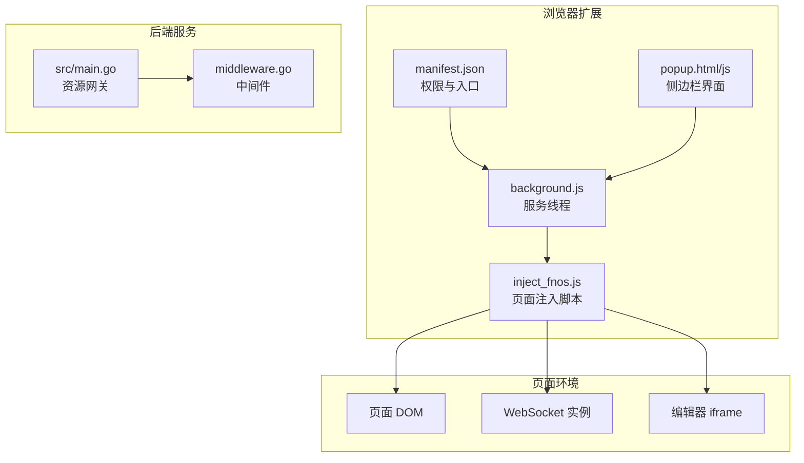
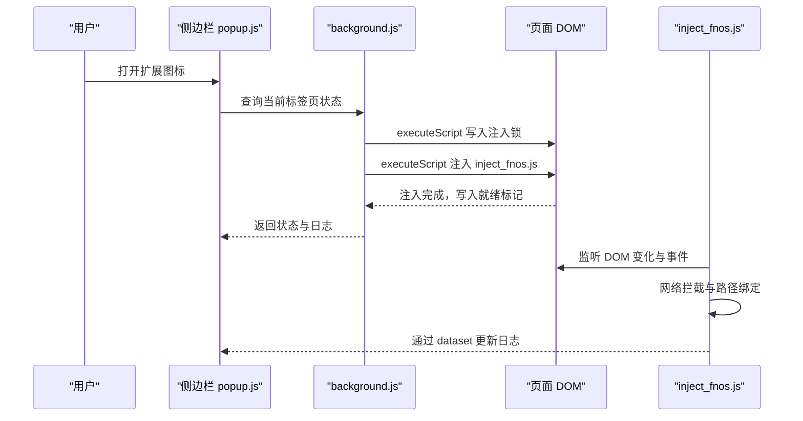
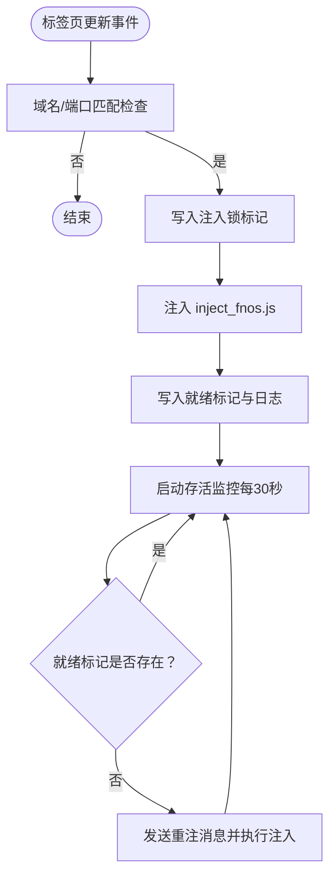
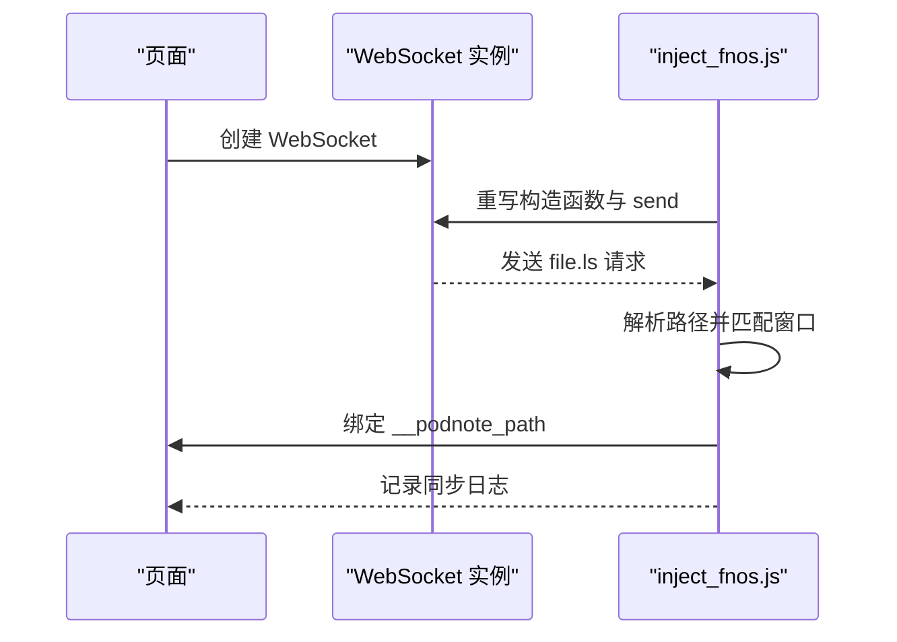
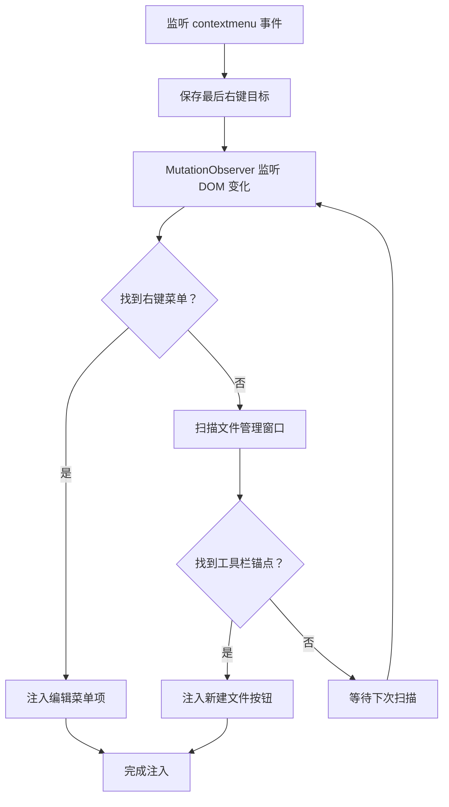
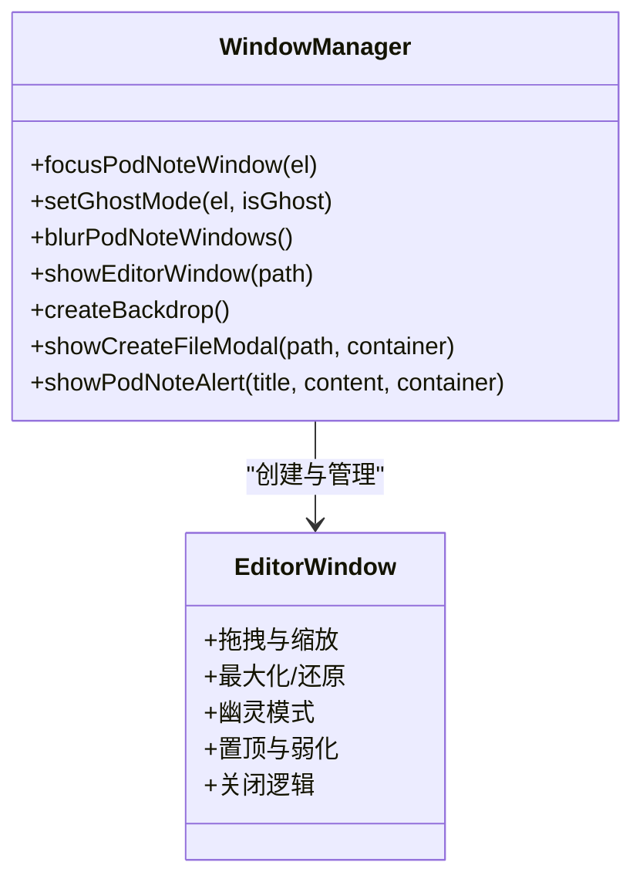
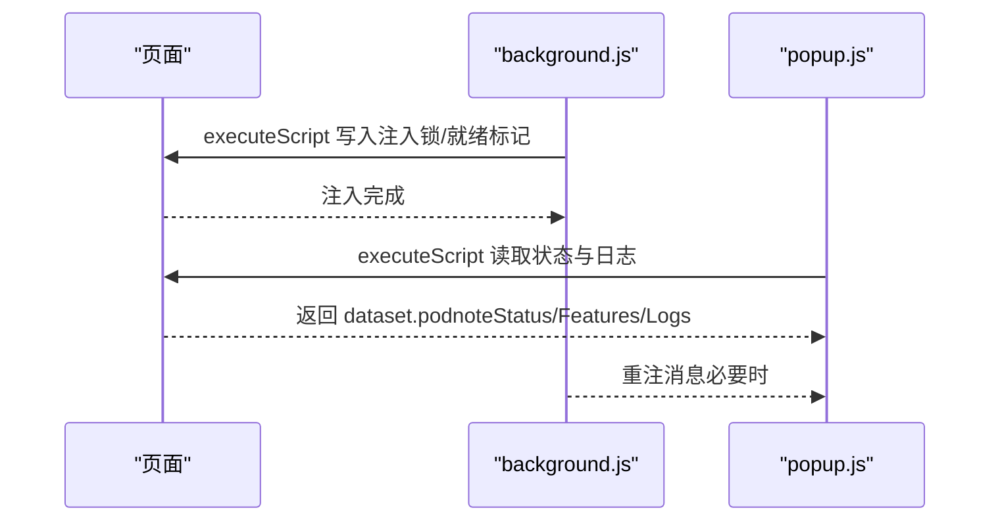
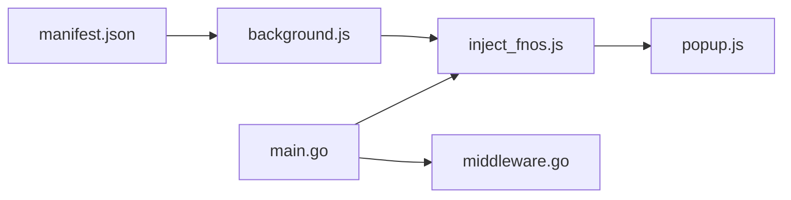

# 页面注入机制

<cite>
**本文档引用的文件**
- [inject_fnos.js](file://chrome_extension/inject_fnos.js)
- [manifest.json](file://chrome_extension/manifest.json)
- [background.js](file://chrome_extension/background.js)
- [popup.html](file://chrome_extension/popup.html)
- [popup.js](file://chrome_extension/popup.js)
- [README.md](file://README.md)
- [chrome_extension/README.md](file://chrome_extension/README.md)
- [main.go](file://src/main.go)
- [middleware.go](file://src/middleware.go)
</cite>

## 目录
1. [简介](#简介)
2. [项目结构](#项目结构)
3. [核心组件](#核心组件)
4. [架构总览](#架构总览)
5. [详细组件分析](#详细组件分析)
6. [依赖关系分析](#依赖关系分析)
7. [性能考量](#性能考量)
8. [故障排除指南](#故障排除指南)
9. [结论](#结论)
10. [附录](#附录)

## 简介
本文件系统性阐述 PodNote Chrome 扩展的页面注入机制，重点围绕 inject_fnos.js 的实现原理与注入策略，涵盖以下方面：
- 注入时机与执行上下文：通过 Manifest V3 的 service worker 在页面生命周期合适节点注入脚本，确保与页面 DOM 的协同工作。
- 与页面 DOM 的交互：基于 MutationObserver 监听 DOM 变化，动态识别并注入右键菜单项与工具栏按钮；通过事件监听实现用户交互。
- 数据交换方式：利用全局变量、DOM dataset、事件与消息传递实现与扩展后台的双向通信。
- 注入隔离机制：通过 MAIN 执行世界与存活标记实现互斥与自愈，避免重复注入与竞态条件。
- 安全考虑：CSP 策略、XSS 防护与跨域交互边界控制。
- 调试技巧与常见问题排查：基于日志系统、状态标记与重注流程进行定位。

## 项目结构
Chrome 扩展采用 MV3 架构，核心文件分布如下：
- manifest.json：声明权限、背景页、动作入口与图标等元信息。
- background.js：服务线程负责注入脚本、存活自愈轮询与状态监控。
- inject_fnos.js：页面注入脚本，实现网络拦截、DOM 注入与窗口管理。
- popup.html/js：侧边栏界面，用于配置与状态监控。
- src/main.go 与 src/middleware.go：后端服务层，提供编辑器页面与资源网关能力。

**图表来源**
- [manifest.json:1-28](file://chrome_extension/manifest.json#L1-L28)
- [background.js:1-169](file://chrome_extension/background.js#L1-L169)
- [inject_fnos.js:1-898](file://chrome_extension/inject_fnos.js#L1-L898)
- [popup.html:1-173](file://chrome_extension/popup.html#L1-L173)
- [popup.js:1-200](file://chrome_extension/popup.js#L1-L200)
- [main.go:52-83](file://src/main.go#L52-L83)
- [middleware.go:51-102](file://src/middleware.go#L51-L102)

**章节来源**
- [README.md:1-39](file://README.md#L1-L39)
- [chrome_extension/README.md:1-39](file://chrome_extension/README.md#L1-L39)

## 核心组件
- 注入调度器（background.js）
  - 域名匹配与注入决策：根据配置的域名/端口列表判断是否允许注入。
  - 注入锁与互斥：通过向页面写入注入锁标记，避免并发重复注入。
  - 存活自愈：定期轮询页面状态标记，缺失时触发重注。
- 注入执行器（inject_fnos.js）
  - 网络拦截：重写 WebSocket 构造与 send 方法，解析文件管理相关消息，建立路径与窗口的绑定。
  - DOM 注入：监听右键菜单生成与工具栏 DOM 变化，注入“使用 PodNote 编辑”与“新建文件”按钮。
  - 窗口管理：动态创建编辑器窗口（iframe），支持拖拽、缩放、最大化与幽灵模式。
  - 日志系统：通过 dataset 将日志持久化到页面，便于侧边栏读取展示。
- 侧边栏（popup.html/js）
  - 配置管理：启用/禁用、域名/端口列表编辑。
  - 状态监控：读取页面状态标记与日志，实时反馈注入状态与功能注入情况。

**章节来源**
- [background.js:40-169](file://chrome_extension/background.js#L40-L169)
- [inject_fnos.js:58-898](file://chrome_extension/inject_fnos.js#L58-L898)
- [popup.html:123-173](file://chrome_extension/popup.html#L123-L173)
- [popup.js:44-199](file://chrome_extension/popup.js#L44-L199)

## 架构总览
下图展示了注入机制的整体流程：扩展后台在页面完成加载后执行注入，注入脚本建立与页面的交互通道，并与后端服务协同工作。

**图表来源**
- [background.js:54-96](file://chrome_extension/background.js#L54-L96)
- [background.js:101-115](file://chrome_extension/background.js#L101-L115)
- [popup.js:99-158](file://chrome_extension/popup.js#L99-L158)
- [inject_fnos.js:873-898](file://chrome_extension/inject_fnos.js#L873-L898)

## 详细组件分析

### 注入策略与时机
- 注入触发点：监听标签页更新事件，当页面状态为 complete 且 URL 匹配配置规则时，执行注入。
- 注入锁：在注入前写入注入锁标记，避免并发重复注入。
- 注入后处理：注入完成后写入就绪标记与日志，供侧边栏读取。
- 自愈机制：每 30 秒轮询检查就绪标记，缺失则主动重注。

**图表来源**
- [background.js:39-117](file://chrome_extension/background.js#L39-L117)
- [background.js:119-168](file://chrome_extension/background.js#L119-L168)

**章节来源**
- [background.js:40-117](file://chrome_extension/background.js#L40-L117)
- [background.js:119-168](file://chrome_extension/background.js#L119-L168)

### 注入脚本核心逻辑（inject_fnos.js）

#### 网络拦截与路径绑定
- 重写 WebSocket 构造函数与原型 send 方法，识别文件管理相关 WebSocket 实例。
- 解析 file.ls 请求中的路径信息，匹配到对应的文件管理窗口，建立 __podnote_path 绑定。
- 通过日志系统记录路径同步状态，便于侧边栏监控。

**图表来源**
- [inject_fnos.js:80-123](file://chrome_extension/inject_fnos.js#L80-L123)

**章节来源**
- [inject_fnos.js:80-123](file://chrome_extension/inject_fnos.js#L80-L123)

#### DOM 注入与事件监听
- 右键菜单注入：监听 contextmenu 事件保存目标，通过 MutationObserver 监听菜单生成，注入“使用 PodNote 编辑”选项。
- 工具栏注入：遍历文件管理窗口，定位“新建文件夹/上传”锚点，在其后注入“新建文件”按钮。
- 事件监听：监听鼠标按下事件以更新活动窗口与弱化编辑器窗口；监听 DOM 变化以持续注入。

**图表来源**
- [inject_fnos.js:873-898](file://chrome_extension/inject_fnos.js#L873-L898)
- [inject_fnos.js:680-716](file://chrome_extension/inject_fnos.js#L680-L716)
- [inject_fnos.js:718-868](file://chrome_extension/inject_fnos.js#L718-L868)

**章节来源**
- [inject_fnos.js:873-898](file://chrome_extension/inject_fnos.js#L873-L898)
- [inject_fnos.js:680-716](file://chrome_extension/inject_fnos.js#L680-L716)
- [inject_fnos.js:718-868](file://chrome_extension/inject_fnos.js#L718-L868)

#### 窗口管理与幽灵模式
- 动态创建编辑器窗口（iframe），支持拖拽、缩放、最大化与双击切换。
- 幽灵模式：降低透明度并开启鼠标穿透，实现底图透视交互，适合临时查看。
- 置顶与弱化：聚焦窗口提升 z-index 并高亮，其他窗口弱化并覆盖遮罩。

**图表来源**
- [inject_fnos.js:597-673](file://chrome_extension/inject_fnos.js#L597-L673)
- [inject_fnos.js:317-595](file://chrome_extension/inject_fnos.js#L317-L595)

**章节来源**
- [inject_fnos.js:597-673](file://chrome_extension/inject_fnos.js#L597-L673)
- [inject_fnos.js:317-595](file://chrome_extension/inject_fnos.js#L317-L595)

### 与页面的数据交换方式
- 全局变量与标记
  - 注入锁：window.__podnote_injecting__，避免并发注入。
  - 就绪标记：document.documentElement.dataset.podnoteReady 与 window.__podnote_fnos_ready__。
  - 状态标记：dataset.podnoteStatus 与 dataset.podnoteFeatures。
  - 日志：dataset.podnoteLogs，JSON 数组，最多保留最近 50 条。
- 事件与观察者
  - MutationObserver：监听 DOM 变化，驱动注入逻辑。
  - 鼠标与键盘事件：窗口拖拽、缩放、双击最大化、关闭等。
- 与扩展后台的消息
  - 侧边栏通过 executeScript 读取页面状态与日志，实现可视化监控。
  - 后台通过 runtime.sendMessage 触发重注流程。

**图表来源**
- [background.js:54-96](file://chrome_extension/background.js#L54-L96)
- [background.js:119-168](file://chrome_extension/background.js#L119-L168)
- [popup.js:99-158](file://chrome_extension/popup.js#L99-L158)

**章节来源**
- [background.js:54-96](file://chrome_extension/background.js#L54-L96)
- [background.js:119-168](file://chrome_extension/background.js#L119-L168)
- [popup.js:99-158](file://chrome_extension/popup.js#L99-L158)

### 注入隔离机制与执行上下文
- 执行世界：注入脚本以 MAIN 执行世界运行，可直接访问页面 DOM 与全局变量，但受同源策略约束。
- 存活标记：通过 dataset.podnoteReady 与 window.__podnote_fnos_ready__ 标识注入状态，避免重复注入。
- 注入锁：window.__podnote_injecting__ 作为互斥锁，确保单次注入过程的原子性。
- 自愈轮询：后台每 30 秒检查存活标记，缺失则触发重注，应对 SPA 切换导致的 DOM 清空。

**章节来源**
- [background.js:54-96](file://chrome_extension/background.js#L54-L96)
- [background.js:101-115](file://chrome_extension/background.js#L101-L115)

### 安全考虑与防护
- CSP 策略
  - 页面通过 meta http-equiv="content-security-policy" 或响应头设置 CSP，限制脚本来源与内联脚本执行，降低 XSS 风险。
  - 注入脚本以 MAIN 执行世界运行，遵循页面 CSP 策略。
- XSS 防护
  - 对用户输入与路径进行最小化信任处理，避免直接拼接为可执行代码。
  - 通过幽灵模式与遮罩减少误触风险，降低恶意交互可能。
- 跨域与权限
  - manifest.json 声明 scripting、storage、tabs、sidePanel 权限，严格限定扩展能力范围。
  - host_permissions 与域名匹配规则限制注入范围，避免对无关站点产生影响。

**章节来源**
- [manifest.json:6-11](file://chrome_extension/manifest.json#L6-L11)
- [manifest.json:15-17](file://chrome_extension/manifest.json#L15-L17)
- [inject_fnos.js:317-595](file://chrome_extension/inject_fnos.js#L317-L595)

## 依赖关系分析
- 扩展权限与入口
  - permissions：scripting、storage、tabs、sidePanel。
  - host_permissions：<all_urls>，配合域名匹配规则使用。
  - action 与 side_panel：默认弹窗与侧边栏入口。
- 后端资源网关
  - main.go 对 HTML/CSS/JS 资源注入版本参数与缓存头，确保资源可缓存与版本控制。
  - middleware.go 实现 gzip 压缩与缓存策略，优化传输效率。

**图表来源**
- [manifest.json:1-28](file://chrome_extension/manifest.json#L1-L28)
- [background.js:1-169](file://chrome_extension/background.js#L1-L169)
- [inject_fnos.js:1-898](file://chrome_extension/inject_fnos.js#L1-L898)
- [popup.js:1-200](file://chrome_extension/popup.js#L1-L200)
- [main.go:52-83](file://src/main.go#L52-L83)
- [middleware.go:51-102](file://src/middleware.go#L51-L102)

**章节来源**
- [manifest.json:1-28](file://chrome_extension/manifest.json#L1-L28)
- [main.go:52-83](file://src/main.go#L52-L83)
- [middleware.go:51-102](file://src/middleware.go#L51-L102)

## 性能考量
- 注入锁与互斥：避免重复注入带来的资源浪费与 DOM 抖动。
- 观察者粒度：MutationObserver 监听 subtree 与 childList，建议在稳定阶段减少不必要的 DOM 变更以降低回调频率。
- 窗口动画与样式：过渡动画与遮罩在高频交互场景下可能影响性能，可通过禁用动画或减少复杂样式优化。
- 缓存与压缩：后端中间件对静态资源实施 gzip 与长缓存策略，显著降低首屏加载与传输成本。

## 故障排除指南
- 注入失败
  - 检查域名匹配规则是否正确，确认页面 URL 符合配置。
  - 查看侧边栏状态与日志，确认是否存在“未激活/未就绪”提示。
- 重复注入或竞态
  - 确认注入锁标记是否被正确写入与释放。
  - 检查自愈轮询是否正常运行，避免后台未收到重注消息。
- DOM 注入不生效
  - 确认右键菜单与工具栏锚点是否被正确识别（关键词与选择器）。
  - 检查是否存在第三方工具已注入相同按钮导致退避。
- 窗口交互异常
  - 检查幽灵模式与遮罩状态，确认指针事件穿透是否符合预期。
  - 验证 z-index 递增逻辑与置顶/弱化流程。
- 日志与诊断
  - 通过侧边栏“实时监控日志”查看最近 50 条日志，定位错误类型（success/info/warn/error/sync）。
  - 在页面控制台查看 NPLog 输出，辅助定位网络拦截与路径绑定问题。

**章节来源**
- [popup.js:99-199](file://chrome_extension/popup.js#L99-L199)
- [inject_fnos.js:13-45](file://chrome_extension/inject_fnos.js#L13-L45)
- [inject_fnos.js:718-868](file://chrome_extension/inject_fnos.js#L718-L868)

## 结论
本注入机制通过 MV3 的服务线程与页面脚本协作，实现了对 FNOS 文件管理器的深度集成：在网络层面建立路径绑定，在 UI 层面注入编辑与新建能力，并通过自愈轮询与日志系统保障稳定性与可观测性。配合严格的权限与 CSP 策略，整体方案在功能性与安全性之间取得良好平衡。

## 附录
- 实际注入示例
  - 右键菜单注入：在“打开方式/新窗口打开/下载”锚点附近插入“使用 PodNote 编辑”菜单项。
  - 工具栏注入：在“新建文件夹/上传”锚点后插入“新建文件”按钮，点击后调用后端新建接口并自动刷新列表。
- 最佳实践
  - 使用最小权限原则配置域名匹配规则，避免对无关站点产生影响。
  - 通过 dataset 与全局变量进行状态与日志传递，避免直接污染页面命名空间。
  - 在 SPA 场景下依赖自愈轮询，确保路由切换后的注入一致性。
  - 对用户输入与路径进行严格校验，防止 XSS 与路径穿越风险。