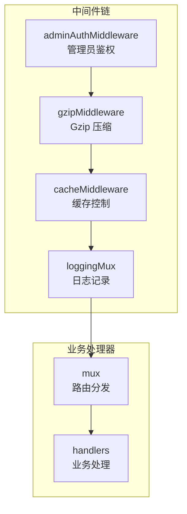
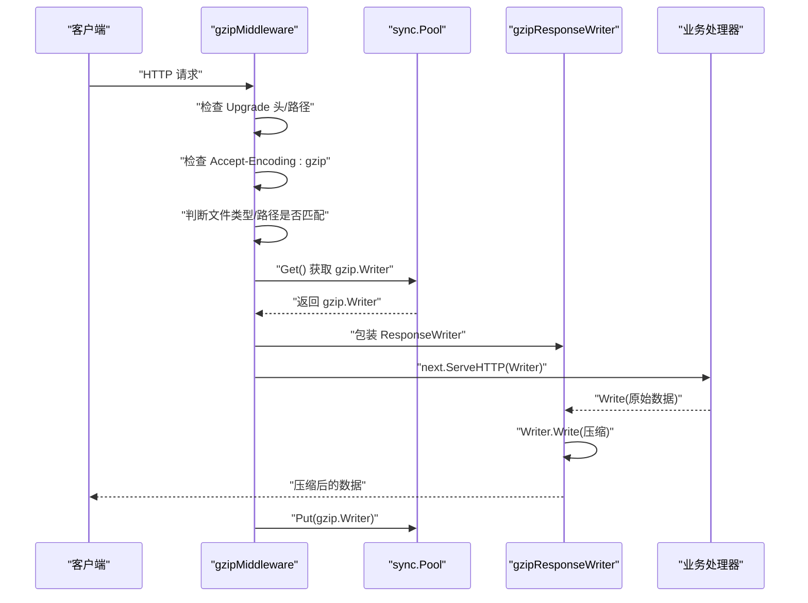
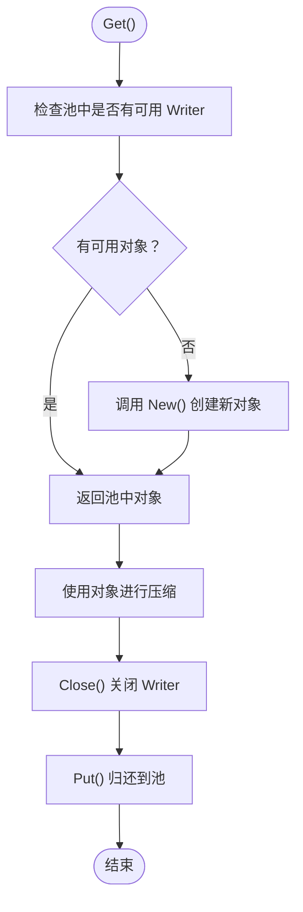
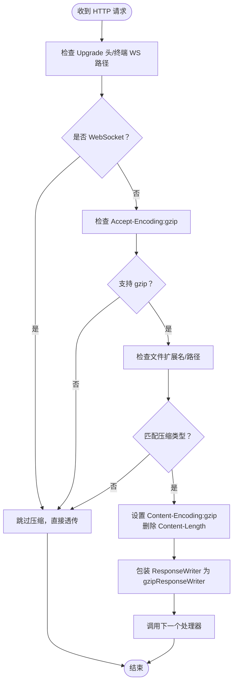
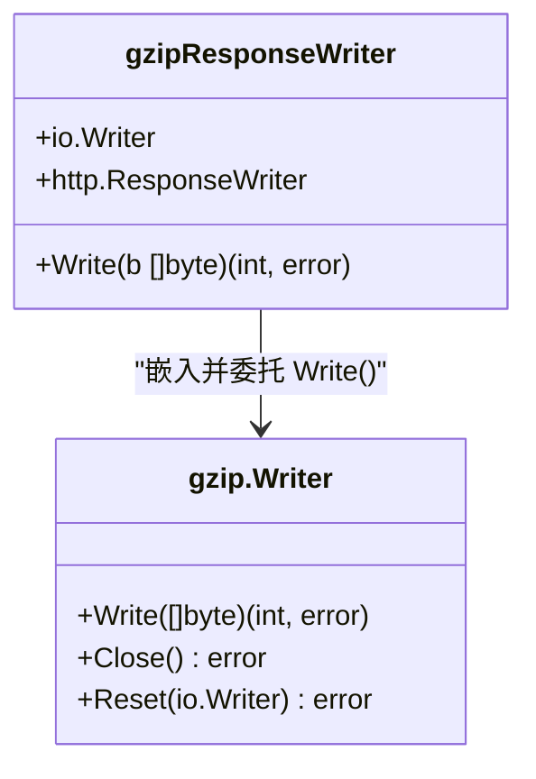
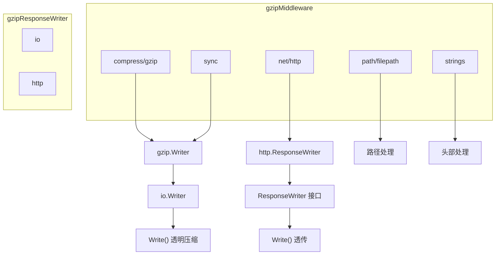

# Gzip 压缩中间件

<cite>
**本文档引用的文件**
- [middleware.go](file://src/middleware.go)
- [main.go](file://src/main.go)
- [handlers.go](file://src/handlers.go)
- [utils.go](file://src/utils.go)
- [README.md](file://src/README.md)
</cite>

## 目录
1. [简介](#简介)
2. [项目结构](#项目结构)
3. [核心组件](#核心组件)
4. [架构概览](#架构概览)
5. [详细组件分析](#详细组件分析)
6. [依赖关系分析](#依赖关系分析)
7. [性能考虑](#性能考虑)
8. [故障排查指南](#故障排查指南)
9. [结论](#结论)

## 简介
本文件针对 Gzip 压缩中间件进行深入技术文档化，重点阐述以下方面：
- gzipMiddleware 的压缩策略与实现机制
- sync.Pool 对 gzip.Writer 的复用优化
- 压缩触发条件：Accept-Encoding 头部检查、文件类型过滤、WebSocket 请求排除
- gzipResponseWriter 的包装实现与压缩数据流处理
- 压缩性能优化建议与调试技巧

## 项目结构
后端服务采用 Go 标准库 http 包构建，中间件通过 Handler 链式组合实现横切关注点。Gzip 压缩中间件位于中间件层，紧随管理员鉴权之后，位于缓存控制之前，形成如下顺序：
- 管理员鉴权中间件
- Gzip 压缩中间件
- 缓存控制中间件
- 日志记录中间件

图表来源
- [main.go:121-129](file://src/main.go#L121-L129)
- [middleware.go:22-38](file://src/middleware.go#L22-L38)
- [middleware.go:40-72](file://src/middleware.go#L40-L72)
- [middleware.go:74-92](file://src/middleware.go#L74-L92)

章节来源
- [main.go:121-129](file://src/main.go#L121-L129)
- [README.md:69-73](file://src/README.md#L69-L73)

## 核心组件
- gzipPool：基于 sync.Pool 的 gzip.Writer 复用池，避免频繁分配/释放带来的 GC 压力
- gzipMiddleware：HTTP 中间件，根据请求特征决定是否启用 Gzip 压缩
- gzipResponseWriter：对 http.ResponseWriter 的包装，将写入的数据透明压缩

章节来源
- [middleware.go:14-20](file://src/middleware.go#L14-L20)
- [middleware.go:40-72](file://src/middleware.go#L40-L72)
- [middleware.go:94-102](file://src/middleware.go#L94-L102)

## 架构概览
Gzip 压缩中间件在请求进入业务处理器前执行，主要职责：
- 检查是否为 WebSocket 升级请求（排除压缩）
- 检查客户端是否支持 gzip（Accept-Encoding 头）
- 判断响应内容类型是否适合压缩（JS/CSS/HTML/API）
- 通过 sync.Pool 获取 gzip.Writer，设置响应头并包装 ResponseWriter
- 将压缩后的数据写回客户端

图表来源
- [middleware.go:40-72](file://src/middleware.go#L40-L72)
- [middleware.go:14-20](file://src/middleware.go#L14-L20)
- [middleware.go:94-102](file://src/middleware.go#L94-L102)

## 详细组件分析

### gzipPool：gzip.Writer 复用池
- 初始化：New 函数创建一个以 io.Discard 为目标的 gzip.Writer，用于预热池对象
- Get/Put：在中间件每次需要压缩时从池中取出，使用完毕后归还
- 优势：减少频繁分配/释放带来的内存压力与 GC 抖动，提升吞吐量

图表来源
- [middleware.go:14-20](file://src/middleware.go#L14-L20)

章节来源
- [middleware.go:14-20](file://src/middleware.go#L14-L20)

### gzipMiddleware：压缩触发与决策
- WebSocket 排除：若 Upgrade 头为 websocket 或路径以 /api/terminal/ws 结尾，则跳过压缩
- Accept-Encoding 检查：若请求头不包含 gzip，则直接透传
- 文件类型与路径过滤：仅对 .js、.css、.html 或 /api/ 路径下的请求进行压缩
- 响应头设置：设置 Content-Encoding:gzip，删除 Content-Length（压缩后长度未知）
- 数据流包装：将 gzip.Writer 作为 io.Writer 传入 gzipResponseWriter，后续写入均被透明压缩

图表来源
- [middleware.go:40-72](file://src/middleware.go#L40-L72)

章节来源
- [middleware.go:40-72](file://src/middleware.go#L40-L72)

### gzipResponseWriter：压缩数据流包装
- 结构：嵌入 io.Writer（即 gzip.Writer）与 http.ResponseWriter
- Write 方法：将原始数据写入内部的 gzip.Writer，实现透明压缩
- 生命周期：在中间件作用域内创建，随请求结束自动关闭并归还到池中

图表来源
- [middleware.go:94-102](file://src/middleware.go#L94-L102)

章节来源
- [middleware.go:94-102](file://src/middleware.go#L94-L102)

### 压缩触发条件详解
- WebSocket 请求排除
  - 升级头检查：若 Upgrade 头为 websocket，则不进行压缩
  - 终端 WS 路径：/api/terminal/ws 明确排除
- Accept-Encoding 头部检查
  - 若请求头不包含 gzip，则直接透传，不设置 Content-Encoding
- 文件类型与路径过滤
  - 扩展名：.js、.css、.html
  - 路径：/api/ 下的所有请求
- Vary 头设置
  - 添加 Vary: Accept-Encoding，确保代理缓存正确区分 gzip 与非 gzip 响应

章节来源
- [middleware.go:43-59](file://src/middleware.go#L43-L59)
- [middleware.go:49](file://src/middleware.go#L49)

### 与业务处理器的关系
- 路由注册：/api/terminal/ws 与 /api/watch/ws 使用 WebSocket 处理器，因此不受 gzip 压缩影响
- 中间件顺序：gzipMiddleware 在业务处理器之前执行，确保所有静态资源与 API 响应均可被压缩

章节来源
- [main.go:111-119](file://src/main.go#L111-L119)
- [handlers.go:426-494](file://src/handlers.go#L426-L494)

## 依赖关系分析
- gzipMiddleware 依赖：
  - compress/gzip：创建与操作 gzip.Writer
  - sync：sync.Pool 复用 gzip.Writer
  - net/http：HTTP 请求/响应处理
  - path/filepath：路径扩展名提取
  - strings：头部与路径字符串处理
- gzipResponseWriter 依赖：
  - io：实现 io.Writer 接口
  - http：实现 http.ResponseWriter 接口

图表来源
- [middleware.go:3-12](file://src/middleware.go#L3-L12)
- [middleware.go:94-102](file://src/middleware.go#L94-L102)

章节来源
- [middleware.go:3-12](file://src/middleware.go#L3-L12)
- [middleware.go:94-102](file://src/middleware.go#L94-L102)

## 性能考虑
- sync.Pool 复用策略
  - 优点：显著降低 GC 压力，提高高并发场景下的吞吐量
  - 注意：池中的对象需在使用后正确 Close 并 Put 回池
- 压缩级别与速度
  - 当前使用 gzip.BestSpeed，偏向更快的压缩速度而非最高压缩比
  - 如需更高压缩比，可调整为其他级别；但会增加 CPU 开销
- 响应头设置
  - 删除 Content-Length 是必要的，因为压缩后长度未知
  - 设置 Vary: Accept-Encoding 可避免代理缓存错误
- WebSocket 排除
  - WebSocket 协议不支持透明压缩，排除可避免协议冲突
- 文件类型过滤
  - 仅对文本类资源（JS/CSS/HTML/API）进行压缩，避免对二进制资源重复压缩
- 缓存策略配合
  - gzipMiddleware 位于缓存中间件之前，确保缓存命中率与压缩效果兼顾

章节来源
- [middleware.go:14-20](file://src/middleware.go#L14-L20)
- [middleware.go:58-60](file://src/middleware.go#L58-L60)
- [middleware.go:43-47](file://src/middleware.go#L43-L47)

## 故障排查指南
- 压缩未生效
  - 检查客户端是否发送 Accept-Encoding:gzip
  - 确认请求路径是否匹配 .js/.css/.html 或 /api/
  - 确认请求是否为 WebSocket 升级（将被排除）
- 响应头异常
  - Content-Encoding 是否正确设置为 gzip
  - Content-Length 是否被删除
  - Vary: Accept-Encoding 是否存在
- WebSocket 无法建立
  - 检查 Upgrade 头是否为 websocket
  - 确认路径是否为 /api/terminal/ws
- 性能问题
  - 观察 GC 抖动与 CPU 使用率
  - 调整压缩级别或减少压缩范围
- 调试技巧
  - 使用抓包工具（如 curl 或浏览器开发者工具）查看响应头
  - 在中间件前后打印关键信息（如路径、头部、是否压缩）
  - 通过日志中间件输出请求方法与 URI，定位问题请求

章节来源
- [middleware.go:49-54](file://src/middleware.go#L49-L54)
- [middleware.go:58-60](file://src/middleware.go#L58-L60)
- [middleware.go:43-47](file://src/middleware.go#L43-L47)
- [main.go:125-128](file://src/main.go#L125-L128)

## 结论
Gzip 压缩中间件通过合理的触发条件与 sync.Pool 复用机制，在保证 WebSocket 兼容性的同时，有效提升了静态资源与 API 响应的传输效率。结合缓存中间件与日志中间件，形成了完整的性能优化与可观测性体系。在生产环境中，建议持续监控压缩效果与资源消耗，并根据业务特点调整压缩策略与缓存策略。