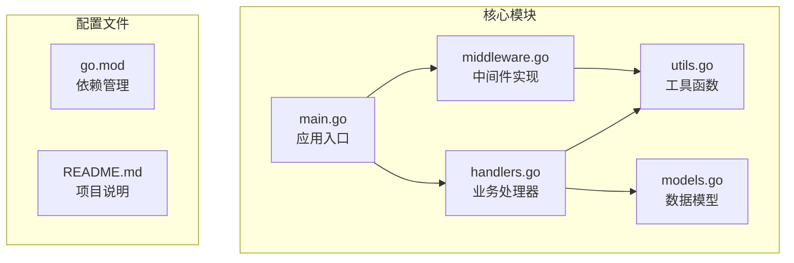
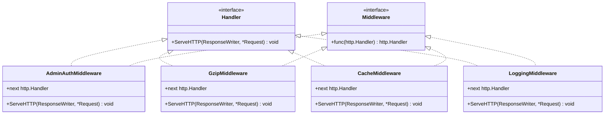
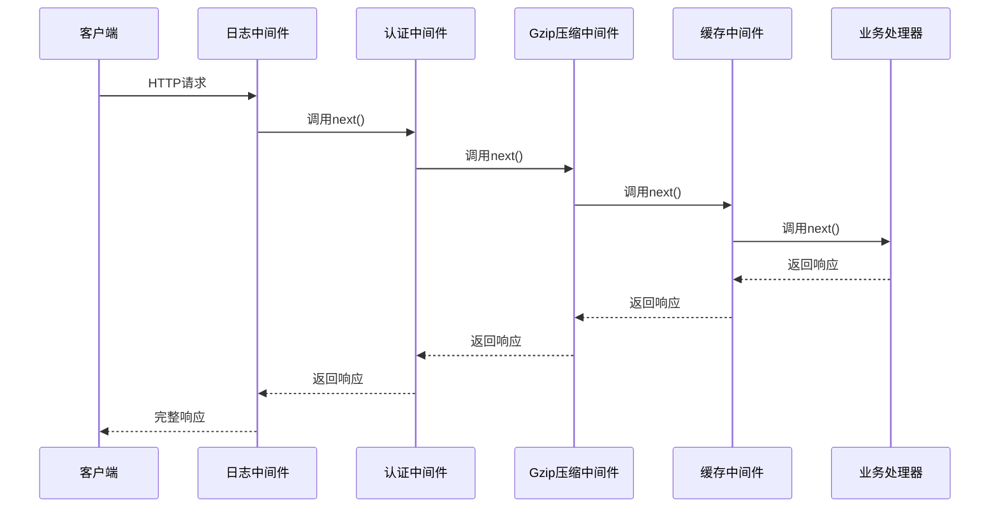
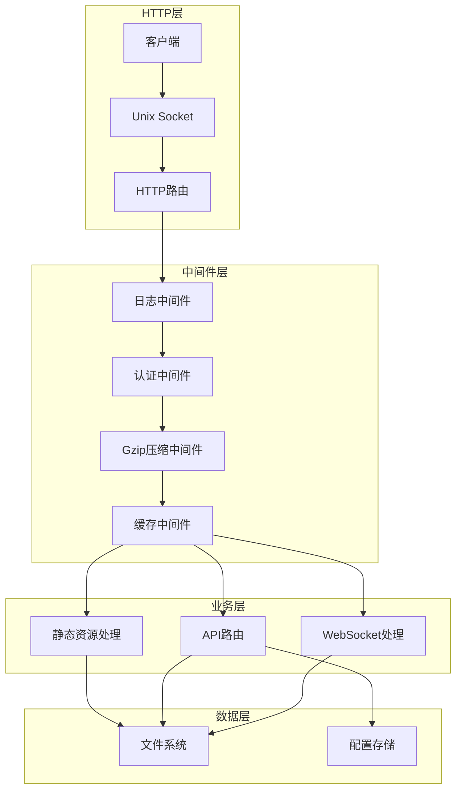
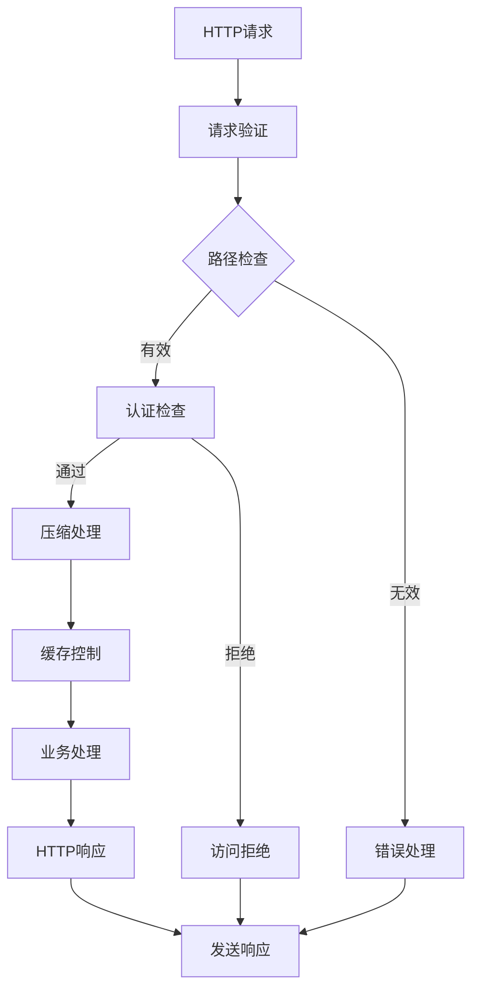
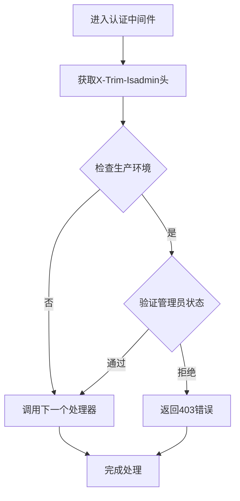
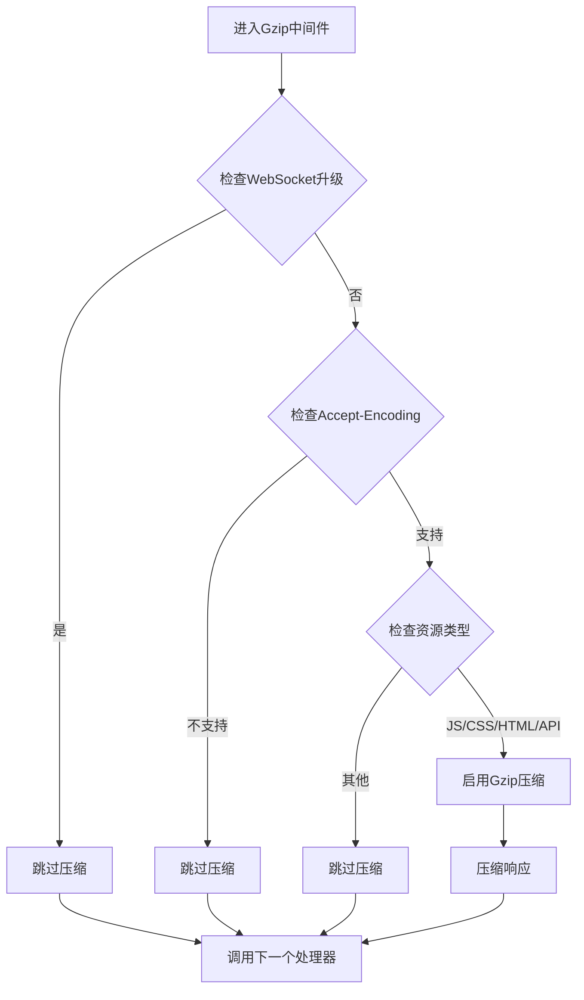
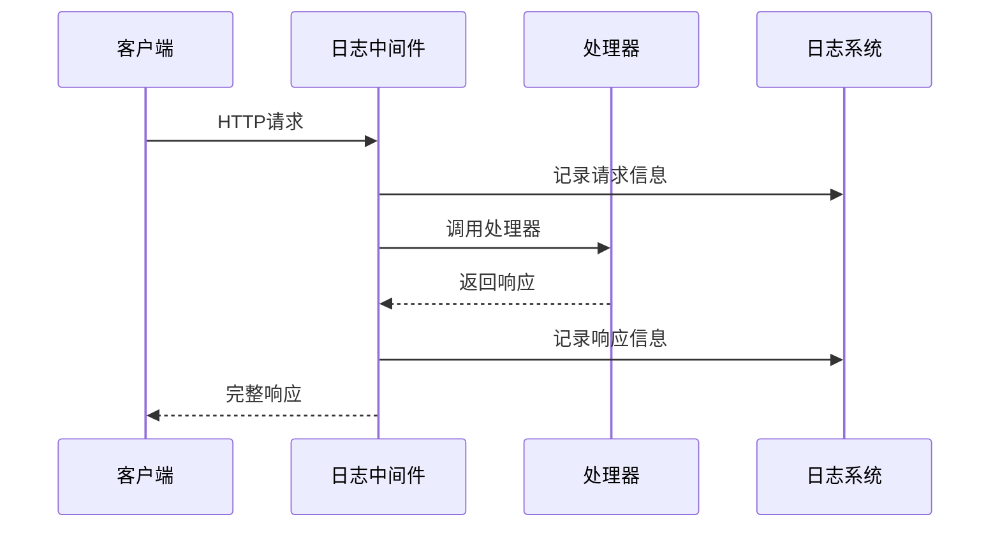
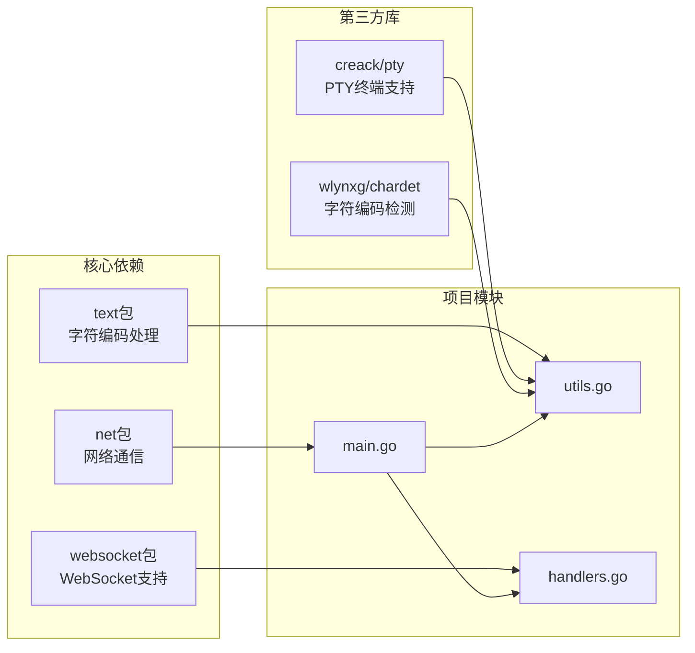
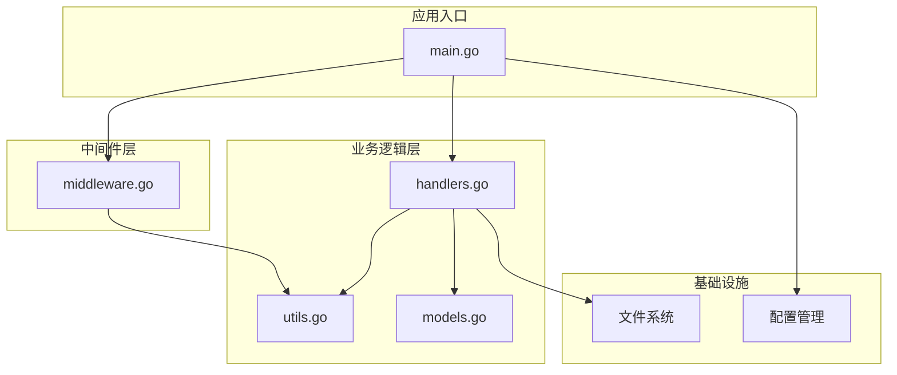

# 中间件扩展指南

<cite>
**本文档引用的文件**
- [middleware.go](file://src/middleware.go)
- [main.go](file://src/main.go)
- [handlers.go](file://src/handlers.go)
- [models.go](file://src/models.go)
- [utils.go](file://src/utils.go)
- [go.mod](file://src/go.mod)
- [README.md](file://README.md)
</cite>

## 目录
1. [简介](#简介)
2. [项目结构](#项目结构)
3. [核心组件](#核心组件)
4. [架构概览](#架构概览)
5. [详细组件分析](#详细组件分析)
6. [依赖关系分析](#依赖关系分析)
7. [性能考虑](#性能考虑)
8. [故障排除指南](#故障排除指南)
9. [结论](#结论)
10. [附录](#附录)

## 简介

本文档面向希望扩展和定制中间件系统的开发者，提供了基于 Go 语言的中间件设计模式和实现规范。该代码库展示了如何构建高性能、可维护的 HTTP 中间件链，包括管理员认证、Gzip 压缩、缓存控制等核心功能。

中间件系统采用装饰器模式，通过函数包装的方式将多个处理逻辑串联起来，形成一个可配置的处理管道。每个中间件都遵循统一的接口规范，可以独立测试和复用。

## 项目结构

该项目采用模块化的 Go 语言项目结构，主要包含以下核心文件：



**图表来源**
- [main.go:1-145](file://src/main.go#L1-L145)
- [middleware.go:1-103](file://src/middleware.go#L1-L103)
- [handlers.go:1-614](file://src/handlers.go#L1-L614)

**章节来源**
- [main.go:1-145](file://src/main.go#L1-L145)
- [go.mod:1-12](file://src/go.mod#L1-L12)

## 核心组件

### 中间件接口设计

中间件系统基于 Go 的 `http.Handler` 接口构建，采用函数式编程范式：



**图表来源**
- [middleware.go:22-92](file://src/middleware.go#L22-L92)

### 中间件链组合模式

中间件按照洋葱模型进行组合，每个中间件都可以在请求处理前后执行特定逻辑：



**图表来源**
- [main.go:121-128](file://src/main.go#L121-L128)

**章节来源**
- [middleware.go:22-92](file://src/middleware.go#L22-L92)
- [main.go:121-128](file://src/main.go#L121-L128)

## 架构概览

### 整体架构设计

系统采用分层架构，从外到内依次为：HTTP 层、中间件层、业务层、数据层：



**图表来源**
- [main.go:37-120](file://src/main.go#L37-L120)

### 数据流处理

中间件系统的核心优势在于其清晰的数据流控制：



**图表来源**
- [middleware.go:22-92](file://src/middleware.go#L22-L92)

**章节来源**
- [main.go:37-145](file://src/main.go#L37-L145)

## 详细组件分析

### 管理员认证中间件

管理员认证中间件实现了基于请求头的权限验证机制：

#### 实现原理



**图表来源**
- [middleware.go:22-38](file://src/middleware.go#L22-L38)

#### 关键特性

- **环境感知**：仅在生产环境启用严格认证
- **请求头验证**：通过 `X-Trim-Isadmin` 头部字段判断管理员身份
- **日志记录**：记录被拒绝的访问尝试
- **快速失败**：认证失败时立即返回错误

**章节来源**
- [middleware.go:22-38](file://src/middleware.go#L22-L38)

### Gzip 压缩中间件

Gzip 压缩中间件实现了透明的响应压缩功能：

#### 压缩策略



**图表来源**
- [middleware.go:40-72](file://src/middleware.go#L40-L72)

#### 性能优化

- **压缩器池化**：使用 `sync.Pool` 复用 Gzip Writer
- **条件压缩**：仅对合适的资源类型进行压缩
- **长度处理**：动态移除 Content-Length 头部
- **Vary 头部**：正确设置缓存相关的头部信息

**章节来源**
- [middleware.go:40-72](file://src/middleware.go#L40-L72)

### 缓存控制中间件

缓存控制中间件根据资源类型和版本信息设置适当的缓存策略：

#### 缓存策略矩阵

| 资源类型 | 版本参数 | 缓存策略 |
|---------|---------|---------|
| Monaco 核心资源 | 任意 | 强缓存一年（immutable） |
| CSS/JS 文件 | 有版本号 | 缓存30天（immutable） |
| CSS/JS 文件 | 无版本号 | 缓存1天 |
| 其他资源 | 任意 | 默认缓存策略 |

**章节来源**
- [middleware.go:74-92](file://src/middleware.go#L74-L92)

### 日志中间件

日志中间件提供了统一的请求日志记录功能：

#### 日志记录流程



**图表来源**
- [main.go:125-128](file://src/main.go#L125-L128)

**章节来源**
- [main.go:125-128](file://src/main.go#L125-L128)

## 依赖关系分析

### 外部依赖管理

项目使用 Go Modules 进行依赖管理，主要依赖包括：



**图表来源**
- [go.mod:1-12](file://src/go.mod#L1-L12)

### 内部模块依赖



**图表来源**
- [main.go:1-145](file://src/main.go#L1-L145)
- [middleware.go:1-103](file://src/middleware.go#L1-L103)

**章节来源**
- [go.mod:1-12](file://src/go.mod#L1-L12)

## 性能考虑

### 中间件性能优化策略

#### 1. 对象池化
- 使用 `sync.Pool` 复用 Gzip Writer，减少内存分配
- 避免频繁创建和销毁昂贵的对象

#### 2. 条件处理
- 仅对合适的资源类型启用压缩
- 跳过 WebSocket 升级请求的处理
- 基于路径和内容类型的智能决策

#### 3. 缓存优化
- 合理设置缓存控制头
- 利用 immutable 标记提高缓存效率
- 避免不必要的响应头修改

### 性能监控指标

建议监控以下关键指标：
- 请求处理时间分布
- 中间件执行耗时
- 内存使用情况
- CPU 使用率
- 错误率统计

## 故障排除指南

### 常见问题诊断

#### 1. 认证失败问题
**症状**：返回 403 禁止访问错误
**排查步骤**：
1. 检查 `X-Trim-Isadmin` 请求头是否正确设置
2. 验证生产环境变量 `TRIM_APPDEST` 是否已配置
3. 查看服务器日志中的认证记录

#### 2. 压缩功能异常
**症状**：响应未按预期压缩
**排查步骤**：
1. 检查客户端是否支持 Gzip 编码
2. 验证 `Accept-Encoding` 请求头
3. 确认资源类型是否在压缩范围内

#### 3. 缓存策略问题
**症状**：静态资源未正确缓存
**排查步骤**：
1. 检查缓存控制头是否正确设置
2. 验证资源版本参数
3. 确认路径匹配规则

### 调试技巧

#### 1. 日志分析
- 启用详细的日志记录
- 分析请求处理时间
- 监控错误发生频率

#### 2. 性能分析
- 使用 Go pprof 分析性能瓶颈
- 监控内存分配情况
- 分析 goroutine 数量

**章节来源**
- [middleware.go:22-92](file://src/middleware.go#L22-L92)

## 结论

该中间件系统展示了 Go 语言中中间件模式的最佳实践，具有以下特点：

1. **模块化设计**：每个中间件职责单一，易于维护和测试
2. **性能优化**：采用对象池化、条件处理等优化技术
3. **可扩展性**：遵循统一接口，便于添加新的中间件
4. **错误处理**：完善的错误处理和日志记录机制
5. **环境适应性**：支持开发和生产环境的不同需求

通过学习和参考这个实现，开发者可以构建出高效、可靠的中间件系统，满足各种复杂的 Web 应用需求。

## 附录

### 自定义中间件开发模板

```go
// 基础中间件模板
func customMiddleware(next http.Handler) http.Handler {
    return http.HandlerFunc(func(w http.ResponseWriter, r *http.Request) {
        // 前置处理逻辑
        
        // 调用下一个处理器
        next.ServeHTTP(w, r)
        
        // 后置处理逻辑
    })
}
```

### 中间件组合最佳实践

1. **顺序原则**：将严格的检查放在前面，宽松的功能放在后面
2. **职责分离**：每个中间件只负责单一功能
3. **错误处理**：在中间件中妥善处理和传播错误
4. **性能考虑**：避免在中间件中进行昂贵的操作
5. **日志记录**：为每个中间件添加适当的日志记录

### 配置选项参考

| 中间件 | 关键配置 | 默认值 | 说明 |
|-------|---------|--------|------|
| 认证中间件 | X-Trim-Isadmin | - | 管理员身份标识 |
| Gzip中间件 | Accept-Encoding | - | 压缩支持检测 |
| 缓存中间件 | Cache-Control | - | 缓存策略设置 |
| 日志中间件 | 日志级别 | INFO | 请求日志记录 |