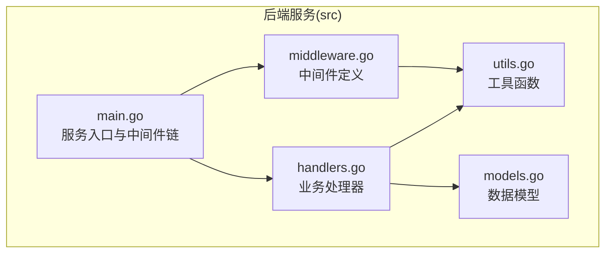
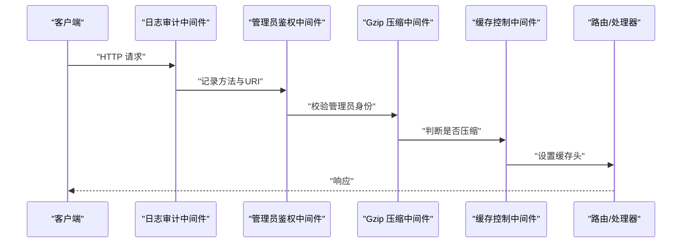
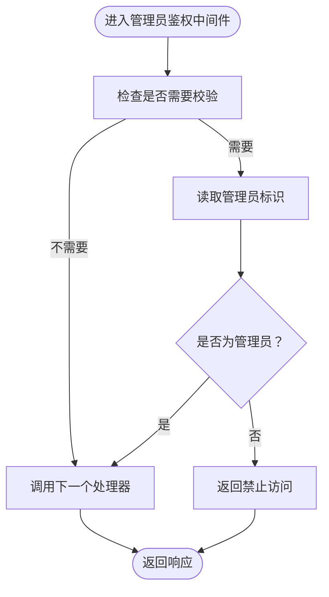
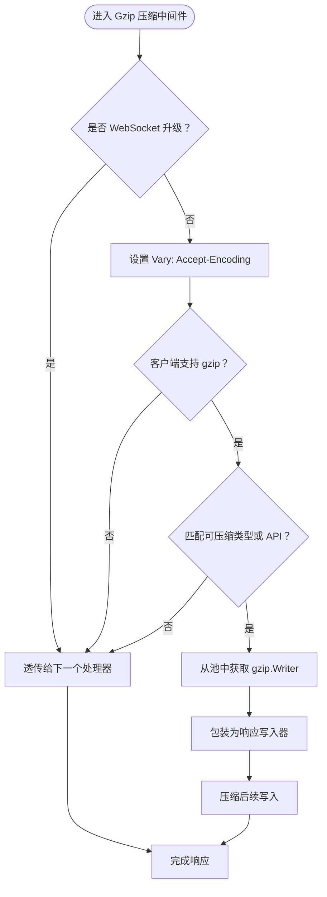
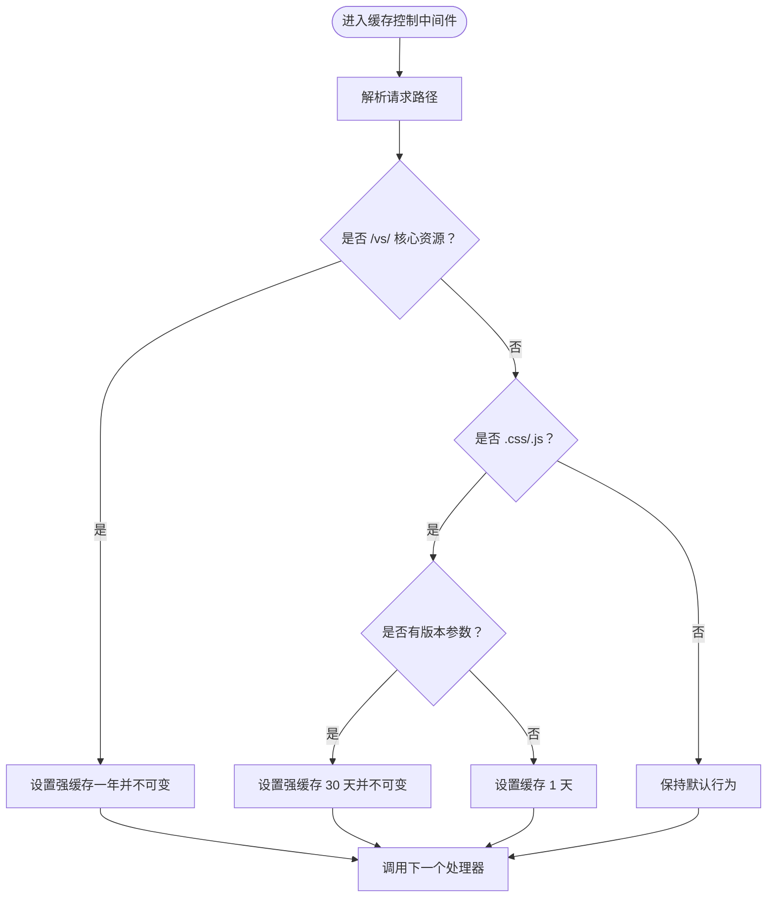
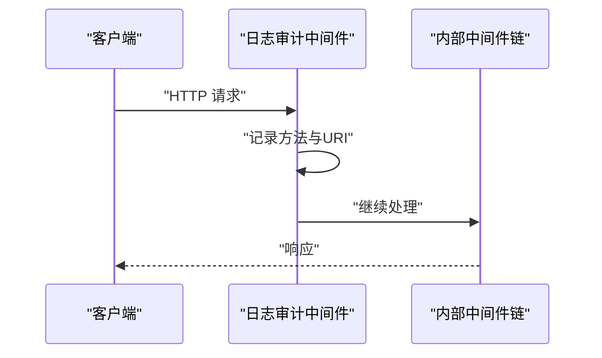
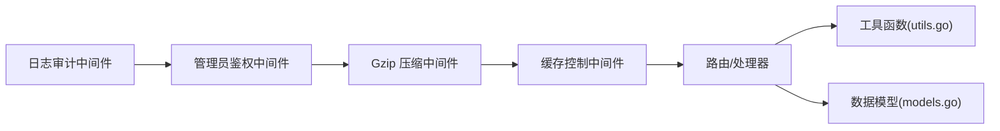

# 中间件系统

<cite>
**本文引用的文件**
- [middleware.go](file://src/middleware.go)
- [main.go](file://src/main.go)
- [handlers.go](file://src/handlers.go)
- [utils.go](file://src/utils.go)
- [models.go](file://src/models.go)
- [README.md](file://src/README.md)
</cite>

## 目录
1. [简介](#简介)
2. [项目结构](#项目结构)
3. [核心组件](#核心组件)
4. [架构总览](#架构总览)
5. [详细组件分析](#详细组件分析)
6. [依赖关系分析](#依赖关系分析)
7. [性能考量](#性能考量)
8. [故障排查指南](#故障排查指南)
9. [结论](#结论)
10. [附录](#附录)

## 简介
本文件系统性阐述中间件设计与实现，重点覆盖以下三类中间件：
- 管理员鉴权中间件：基于请求头校验管理员身份，保障系统安全。
- Gzip 压缩中间件：对文本类静态资源与 API 响应进行透明压缩，提升传输效率。
- 缓存控制中间件：针对不同资源类型设置合理的缓存策略，降低带宽与服务器压力。
- 日志审计中间件：统一记录请求方法与 URI，便于审计与问题定位。

同时，文档说明中间件链的组合方式与执行顺序，给出扩展与自定义中间件的开发指南，并提供性能优化建议与调试技巧。

## 项目结构
后端采用 Go 语言编写，核心文件位于 src 目录：
- main.go：服务入口，注册路由与中间件链，监听 Unix Socket。
- middleware.go：定义三大中间件与响应包装器。
- handlers.go：业务处理器，包括文件读写、终端与监视 WebSocket。
- utils.go：通用工具函数，如路径校验、编码探测、PTY 终端桥接。
- models.go：API 响应与目录项的数据模型。
- README.md：模块说明，包含中间件功能概述。



图表来源
- [main.go:14-144](file://src/main.go#L14-L144)
- [middleware.go:1-103](file://src/middleware.go#L1-L103)
- [handlers.go:1-614](file://src/handlers.go#L1-L614)
- [utils.go:1-262](file://src/utils.go#L1-L262)
- [models.go:1-30](file://src/models.go#L1-L30)

章节来源
- [README.md:1-74](file://src/README.md#L1-L74)
- [main.go:14-144](file://src/main.go#L14-L144)

## 核心组件
- 管理员鉴权中间件：从请求头提取管理员标识，生产环境严格校验，非管理员直接拒绝。
- Gzip 压缩中间件：识别可压缩资源类型与客户端支持，透明压缩并复用压缩器池，避免 WebSocket 升级请求。
- 缓存控制中间件：根据路径特征设置缓存控制头，Monaco 核心资源强缓存一年，带版本号的脚本/样式缓存 30 天，普通业务资源缓存 1 天。
- 日志审计中间件：在中间件链最外层统一记录请求方法与 URI，便于审计与问题定位。

章节来源
- [middleware.go:22-92](file://src/middleware.go#L22-L92)
- [main.go:121-128](file://src/main.go#L121-L128)

## 架构总览
中间件链以洋葱模型组织，请求从外层向内层传递，再逐层返回。执行顺序如下：
1) 日志审计中间件（记录请求）
2) 管理员鉴权中间件（校验管理员）
3) Gzip 压缩中间件（透明压缩）
4) 缓存控制中间件（设置缓存头）
5) 路由与业务处理器（最终处理）



图表来源
- [main.go:121-128](file://src/main.go#L121-L128)
- [middleware.go:22-92](file://src/middleware.go#L22-L92)

## 详细组件分析

### 管理员鉴权中间件
- 设计理念：通过请求头携带的管理员标识进行快速校验，生产环境启用严格校验，避免非授权访问。
- 关键实现点：
  - 从请求头读取管理员标识。
  - 在特定环境变量存在时才进行校验，否则跳过。
  - 校验失败返回禁止访问状态码。
  - 校验通过后调用下一个处理器。
- 与终端 WebSocket 的协同：终端连接同样依赖管理员标识进行二次校验，确保终端能力仅对管理员开放。



图表来源
- [middleware.go:22-38](file://src/middleware.go#L22-L38)
- [handlers.go:496-516](file://src/handlers.go#L496-L516)

章节来源
- [middleware.go:22-38](file://src/middleware.go#L22-L38)
- [handlers.go:496-516](file://src/handlers.go#L496-L516)

### Gzip 压缩中间件
- 设计理念：对文本类静态资源与 API 响应进行透明压缩，减少带宽占用；对 WebSocket 升级请求不做压缩，保证协议升级成功。
- 关键实现点：
  - 忽略 WebSocket 升级请求与特定终端接口。
  - 设置 Vary 头以正确缓存不同编码的响应。
  - 判断客户端是否支持 gzip。
  - 仅对特定扩展名与 API 路径进行压缩。
  - 使用 sync.Pool 复用 gzip.Writer，降低分配成本。
  - 将压缩器包装为响应写入器，透明地压缩后续写入。
- 性能优化：
  - 复用压缩器池，避免频繁分配。
  - 仅对合适资源类型压缩，避免对二进制或已压缩资源重复压缩。



图表来源
- [middleware.go:40-72](file://src/middleware.go#L40-L72)

章节来源
- [middleware.go:40-72](file://src/middleware.go#L40-L72)

### 缓存控制中间件
- 设计理念：针对不同资源类型设置合适的缓存策略，最大化利用浏览器缓存，减少服务器负载。
- 关键实现点：
  - 对 Monaco 核心资源设置强缓存一年并不可变。
  - 对带版本号的脚本/样式设置强缓存 30 天并不可变。
  - 对普通业务资源设置缓存 1 天。
- 与版本注入的关系：前端在动态入口服务中为静态资源注入版本号，缓存中间件据此区分缓存策略。



图表来源
- [middleware.go:74-92](file://src/middleware.go#L74-L92)

章节来源
- [middleware.go:74-92](file://src/middleware.go#L74-L92)

### 日志审计中间件
- 设计理念：在中间件链最外层统一记录请求方法与 URI，便于审计与问题定位。
- 关键实现点：
  - 在调用内部中间件链之前记录请求信息。
  - 保持原有响应处理流程不变。
- 与其他中间件的协作：先记录日志，再进行鉴权、压缩与缓存设置，确保审计覆盖完整生命周期。



图表来源
- [main.go:125-128](file://src/main.go#L125-L128)

章节来源
- [main.go:125-128](file://src/main.go#L125-L128)

### 响应包装器与压缩器池
- gzipResponseWriter：包装 gzip.Writer 与 http.ResponseWriter，使压缩器透明地写入响应。
- gzipPool：使用 sync.Pool 复用 gzip.Writer，降低分配与初始化成本，提高吞吐。

```mermaid
classDiagram
class gzipResponseWriter {
+Write([]byte) (int, error)
+Writer io.Writer
+ResponseWriter http.ResponseWriter
}
class gzipPool {
+New() interface{}
}
gzipResponseWriter --> gzipPool : "使用压缩器"
```

图表来源
- [middleware.go:94-103](file://src/middleware.go#L94-L103)
- [middleware.go:14-20](file://src/middleware.go#L14-L20)

章节来源
- [middleware.go:94-103](file://src/middleware.go#L94-L103)
- [middleware.go:14-20](file://src/middleware.go#L14-L20)

## 依赖关系分析
- 中间件链依赖关系：日志审计中间件包裹整个中间件链，管理员鉴权中间件在最内层，Gzip 与缓存中间件依次包裹业务处理器。
- 与业务处理器的耦合：终端 WebSocket 与文件操作处理器均依赖管理员标识进行二次校验，确保安全。
- 与工具函数的协作：路径校验、编码探测与 PTY 终端桥接等工具函数被业务处理器调用，间接影响中间件链的输入输出。



图表来源
- [main.go:121-128](file://src/main.go#L121-L128)
- [handlers.go:1-614](file://src/handlers.go#L1-L614)
- [utils.go:1-262](file://src/utils.go#L1-L262)
- [models.go:1-30](file://src/models.go#L1-L30)

章节来源
- [main.go:121-128](file://src/main.go#L121-L128)
- [handlers.go:1-614](file://src/handlers.go#L1-L614)
- [utils.go:1-262](file://src/utils.go#L1-L262)
- [models.go:1-30](file://src/models.go#L1-L30)

## 性能考量
- 压缩器池复用：通过 sync.Pool 复用 gzip.Writer，显著降低 CPU 与内存分配开销，适合高并发场景。
- 压缩范围控制：仅对文本类资源与 API 响应进行压缩，避免对二进制或已压缩资源重复压缩。
- 缓存策略优化：针对不同资源类型设置差异化缓存策略，最大化浏览器缓存命中率，降低服务器负载。
- WebSocket 兼容：明确排除 WebSocket 升级请求与终端接口，确保协议升级与实时通信不受影响。
- 日志开销：日志审计中间件仅在请求进入时记录一次，开销极低，不影响核心处理性能。

## 故障排查指南
- 管理员鉴权失败
  - 现象：返回禁止访问。
  - 排查要点：确认请求头中管理员标识是否正确；检查生产环境变量是否启用校验。
  - 参考位置：管理员鉴权中间件与终端处理器中的二次校验。
- 压缩未生效
  - 现象：响应未包含压缩头或体积未减小。
  - 排查要点：确认客户端是否支持 gzip；检查路径是否匹配可压缩类型；确认未被 WebSocket 升级请求绕过。
- 缓存策略异常
  - 现象：静态资源频繁更新或长期不更新。
  - 排查要点：确认路径是否命中对应规则；检查版本参数是否正确注入；核对缓存头设置。
- 日志缺失
  - 现象：请求未被记录。
  - 排查要点：确认日志审计中间件是否包裹了中间件链；检查日志输出级别与目标。

章节来源
- [middleware.go:22-38](file://src/middleware.go#L22-L38)
- [middleware.go:40-72](file://src/middleware.go#L40-L72)
- [middleware.go:74-92](file://src/middleware.go#L74-L92)
- [main.go:125-128](file://src/main.go#L125-L128)

## 结论
本中间件系统以简洁高效为目标，通过三层中间件与统一日志审计，实现了安全、压缩与缓存的协同优化。执行顺序清晰、职责边界明确，既满足飞牛OS容器内的安全与性能需求，也为后续扩展提供了良好基础。

## 附录

### 中间件链组合与执行流程
- 组合方式：使用 http.Handler 的洋葱模型，逐层包裹。
- 执行顺序：日志审计 → 管理员鉴权 → Gzip 压缩 → 缓存控制 → 路由/处理器。
- 返回顺序：处理器 → 缓存控制 → Gzip 压缩 → 管理员鉴权 → 日志审计。

章节来源
- [main.go:121-128](file://src/main.go#L121-L128)

### 自定义中间件开发指南
- 设计原则
  - 明确单一职责：每个中间件专注一个方面（鉴权、压缩、缓存、日志）。
  - 保持幂等：中间件不应改变请求与响应的语义，仅做横切处理。
  - 顺序敏感：注意中间件的先后顺序，避免相互干扰。
- 开发步骤
  - 定义函数签名：接收 http.Handler，返回 http.Handler。
  - 在进入阶段进行前置处理（如读取头部、设置响应头）。
  - 调用 next.ServeHTTP 处理后续。
  - 在返回阶段进行后置处理（如统计耗时、记录日志）。
- 示例思路
  - 认证中间件：从请求头读取令牌并校验，失败则返回错误。
  - 限流中间件：基于 IP 或用户维度进行速率限制。
  - 记账中间件：统计请求耗时、状态码分布，输出指标。
- 注意事项
  - 避免阻塞：不要在中间件中执行耗时操作，必要时异步处理。
  - 保持兼容：确保对 WebSocket、长连接等特殊请求的兼容性。
  - 性能优先：尽量使用对象池、缓存与零拷贝技术。

### 调试技巧
- 启用详细日志：在开发环境增加更详细的日志输出，观察中间件链各环节的行为。
- 使用抓包工具：结合浏览器或 curl 观察响应头，确认压缩与缓存策略是否生效。
- 分层验证：逐个禁用中间件，验证功能差异，定位问题所在。
- 压力测试：模拟高并发场景，观察压缩器池与缓存策略的表现。