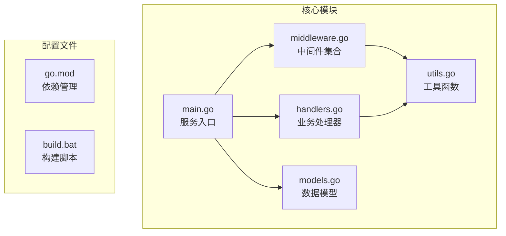
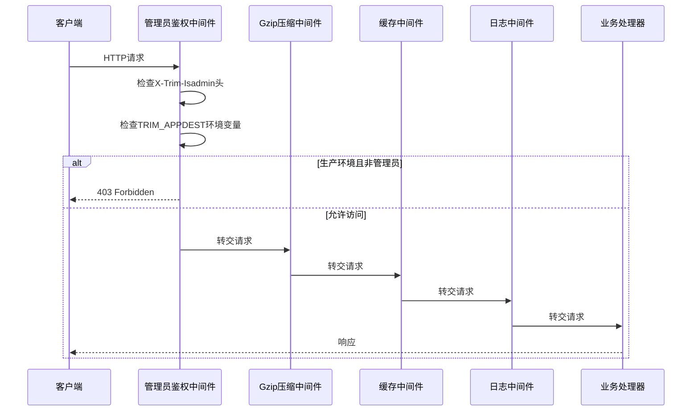
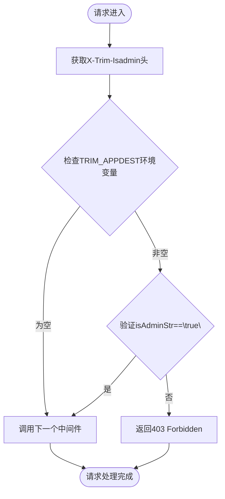
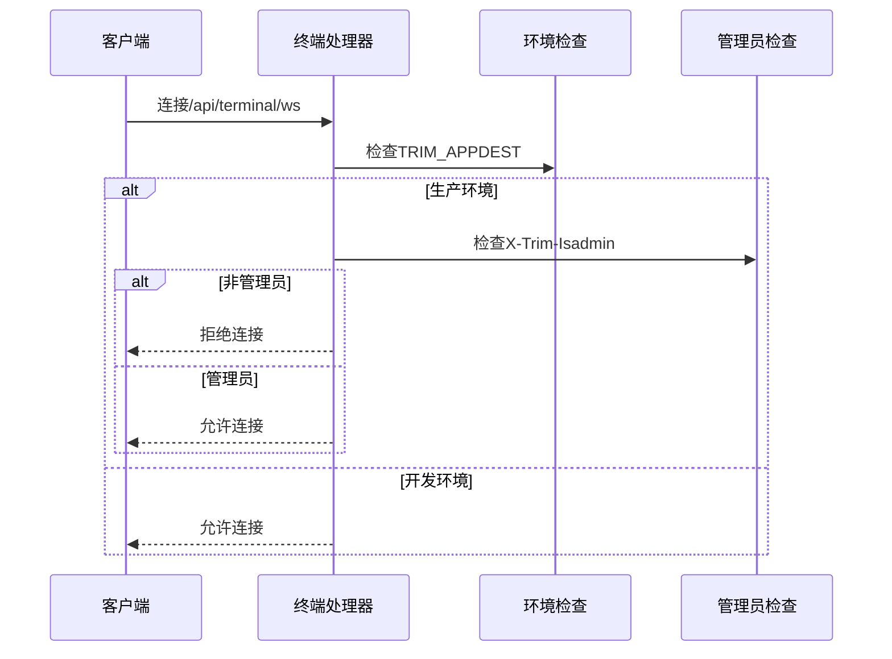
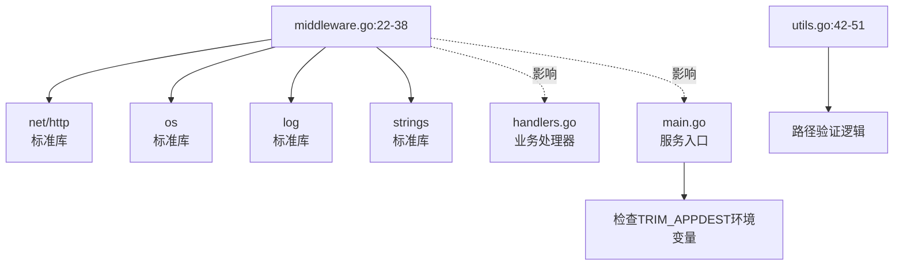

# 管理员鉴权中间件

<cite>
**本文档引用的文件**
- [middleware.go](file://src/middleware.go)
- [main.go](file://src/main.go)
- [handlers.go](file://src/handlers.go)
- [utils.go](file://src/utils.go)
- [README.md](file://src/README.md)
</cite>

## 目录
1. [简介](#简介)
2. [项目结构](#项目结构)
3. [核心组件](#核心组件)
4. [架构概览](#架构概览)
5. [详细组件分析](#详细组件分析)
6. [依赖关系分析](#依赖关系分析)
7. [性能考虑](#性能考虑)
8. [故障排除指南](#故障排除指南)
9. [结论](#结论)

## 简介

管理员鉴权中间件是本项目中的关键安全组件，负责验证请求发起者的管理员身份。该中间件通过检查请求头中的 `X-Trim-Isadmin` 字段来确定用户权限，并结合 `TRIM_APPDEST` 环境变量来判断当前运行环境是否为生产环境。

该中间件采用 HTTP 中间件模式，在请求处理管道中处于最前端位置，确保所有后续处理逻辑都只能在经过身份验证的情况下执行。这种设计提供了统一的安全边界，简化了权限控制的实现和维护。

## 项目结构

该项目采用模块化的 Go 语言架构，主要包含以下核心文件：



**图表来源**
- [main.go:1-145](file://src/main.go#L1-L145)
- [middleware.go:1-103](file://src/middleware.go#L1-L103)
- [handlers.go:1-614](file://src/handlers.go#L1-L614)

**章节来源**
- [README.md:1-74](file://src/README.md#L1-L74)

## 核心组件

管理员鉴权中间件的核心功能由以下组件构成：

### 主要特性
- **环境感知验证**：仅在生产环境（检测到 `TRIM_APPDEST` 环境变量时）启用管理员验证
- **请求头验证**：检查 `X-Trim-Isadmin` 请求头字段
- **即时拒绝**：不符合条件的请求立即被拒绝，不进入后续处理
- **日志记录**：详细的访问日志记录，便于审计和故障排查

### 执行流程
1. 从请求头提取 `X-Trim-Isadmin` 值
2. 检查 `TRIM_APPDEST` 环境变量是否存在
3. 如果环境变量存在（生产环境），验证管理员标识
4. 如果验证失败，返回 403 Forbidden 错误
5. 如果验证成功或非生产环境，继续处理下一个中间件

**章节来源**
- [middleware.go:22-38](file://src/middleware.go#L22-L38)

## 架构概览

管理员鉴权中间件在整个请求处理链路中的位置如下：



**图表来源**
- [main.go:121-128](file://src/main.go#L121-L128)
- [middleware.go:22-38](file://src/middleware.go#L22-L38)

## 详细组件分析

### 管理员鉴权中间件实现

管理员鉴权中间件采用装饰器模式实现，具有以下特点：

#### 核心实现逻辑



**图表来源**
- [middleware.go:23-37](file://src/middleware.go#L23-L37)

#### 关键实现细节

1. **环境检测机制**：
   - 通过检查 `TRIM_APPDEST` 环境变量的存在性来判断是否为生产环境
   - 该变量在服务启动时必须存在，否则服务会直接退出

2. **管理员标识验证**：
   - 严格要求 `X-Trim-Isadmin` 头部值必须精确等于 `"true"`
   - 任何其他值（包括空字符串、"false"、"1"、"0" 等）都会导致拒绝

3. **错误处理**：
   - 使用标准 HTTP 403 Forbidden 状态码
   - 返回清晰的错误消息："拒绝访问: 仅限系统管理员使用此应用"
   - 记录详细的访问日志，包含被拒绝的 URL 路径

#### 中间件链集成

管理员鉴权中间件位于中间件链的最前端：


**图表来源**
- [main.go:121-128](file://src/main.go#L121-L128)

**章节来源**
- [middleware.go:22-38](file://src/middleware.go#L22-L38)
- [main.go:121-128](file://src/main.go#L121-L128)

### 与其他中间件的协作

#### 与 Gzip 中间件的关系
- 管理员鉴权中间件在 Gzip 压缩之前执行
- 未通过验证的请求不会触发不必要的压缩操作
- 有助于减少服务器资源消耗

#### 与缓存中间件的关系
- 管理员鉴权中间件在缓存控制之前执行
- 确保缓存策略只应用于合法请求
- 防止敏感数据被不当缓存

### 端点级别的管理员验证

除了全局中间件验证外，某些特定端点还实现了额外的管理员验证：

#### 终端 WebSocket 端点


**图表来源**
- [handlers.go:496-516](file://src/handlers.go#L496-L516)

**章节来源**
- [handlers.go:496-516](file://src/handlers.go#L496-L516)

## 依赖关系分析

管理员鉴权中间件的依赖关系相对简单，主要依赖于标准库和环境变量：



**图表来源**
- [middleware.go:22-38](file://src/middleware.go#L22-L38)
- [main.go:15-19](file://src/main.go#L15-L19)
- [utils.go:42-51](file://src/utils.go#L42-L51)

### 外部依赖

- **标准库依赖**：net/http、os、log、strings
- **环境变量依赖**：TRIM_APPDEST（用于环境检测）
- **HTTP 标准**：遵循 HTTP 403 状态码规范

**章节来源**
- [middleware.go:3-12](file://src/middleware.go#L3-L12)
- [main.go:15-19](file://src/main.go#L15-L19)

## 性能考虑

管理员鉴权中间件在性能方面具有以下优势：

### 执行效率
- **零拷贝操作**：仅进行字符串比较和环境变量检查
- **短路求值**：一旦发现非管理员请求立即返回，避免后续处理
- **内存友好**：不创建额外的数据结构或缓冲区

### 资源优化
- **早期拒绝**：在请求处理的最早阶段进行验证，减少不必要的计算
- **无状态设计**：不维护会话状态，降低内存占用
- **快速路径**：非生产环境的请求无需验证，直接放行

### 可扩展性
- **模块化设计**：易于与其他中间件组合使用
- **配置灵活**：通过环境变量控制行为，无需重新编译
- **日志审计**：完整的访问日志便于性能监控和故障诊断

## 故障排除指南

### 常见问题及解决方案

#### 1. 服务启动失败（TRIM_APPDEST 未设置）

**症状**：服务启动时立即退出，显示环境变量错误

**原因**：`TRIM_APPDEST` 环境变量缺失

**解决方案**：
```bash
# 设置环境变量
export TRIM_APPDEST=/path/to/app/destination
export TRIM_APPVER=1.0.0
```

**章节来源**
- [main.go:15-24](file://src/main.go#L15-L24)

#### 2. 管理员访问被拒绝

**症状**：返回 403 Forbidden 错误

**可能原因**：
- `X-Trim-Isadmin` 请求头缺失或值不正确
- `TRIM_APPDEST` 环境变量未设置（开发环境）
- 请求头值不是精确的 `"true"`

**解决方案**：
```bash
# 正确设置管理员请求头
curl -H "X-Trim-Isadmin: true" http://localhost/api/read
```

**章节来源**
- [middleware.go:28-34](file://src/middleware.go#L28-L34)

#### 3. 开发环境访问受限

**症状**：即使在开发环境中也收到 403 错误

**原因**：`TRIM_APPDEST` 环境变量被意外设置

**解决方案**：
```bash
# 清除环境变量或确保值为空
unset TRIM_APPDEST
# 或者
export TRIM_APPDEST=""
```

**章节来源**
- [middleware.go:27-34](file://src/middleware.go#L27-L34)

#### 4. 日志分析

**症状**：需要了解访问被拒绝的原因

**解决方案**：查看服务日志中的认证信息

**章节来源**
- [middleware.go:30](file://src/middleware.go#L30)

### 调试技巧

1. **启用详细日志**：检查服务启动时的日志输出
2. **验证环境变量**：确认 `TRIM_APPDEST` 和 `TRIM_APPVER` 已正确设置
3. **测试请求头**：使用 curl 验证 `X-Trim-Isadmin` 头部设置
4. **检查中间件顺序**：确认管理员鉴权中间件位于中间件链最前端

**章节来源**
- [README.md:69-73](file://src/README.md#L69-L73)

## 结论

管理员鉴权中间件通过简洁而有效的设计，为系统提供了可靠的管理员身份验证机制。其核心优势包括：

### 设计优势
- **环境感知**：智能区分开发和生产环境的行为
- **简单可靠**：基于标准 HTTP 头部的简单验证机制
- **性能高效**：早期拒绝和短路求值确保最佳性能
- **易于维护**：模块化设计便于理解和修改

### 安全特性
- **强制管理员权限**：确保只有授权用户才能访问敏感功能
- **详细审计**：完整的访问日志便于安全监控
- **即时防护**：在请求进入处理管道之前进行验证

### 最佳实践建议
1. **明确的环境管理**：确保开发和生产环境的环境变量配置正确
2. **严格的请求头验证**：确保客户端正确设置 `X-Trim-Isadmin` 头部
3. **定期安全审查**：定期检查访问日志和安全配置
4. **文档维护**：保持相关文档与代码实现的一致性

该中间件为整个系统的安全性奠定了坚实基础，是现代 Web 应用中不可或缺的安全组件。