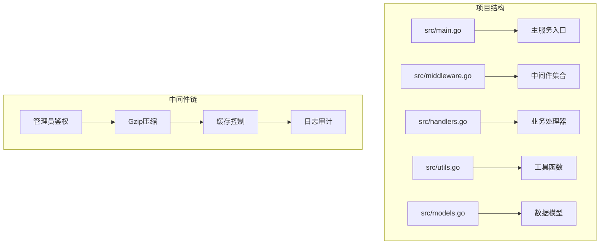
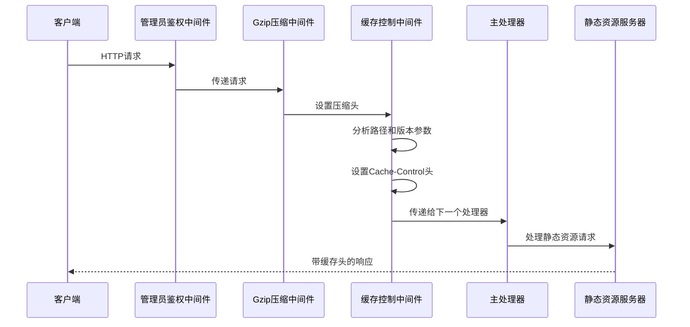
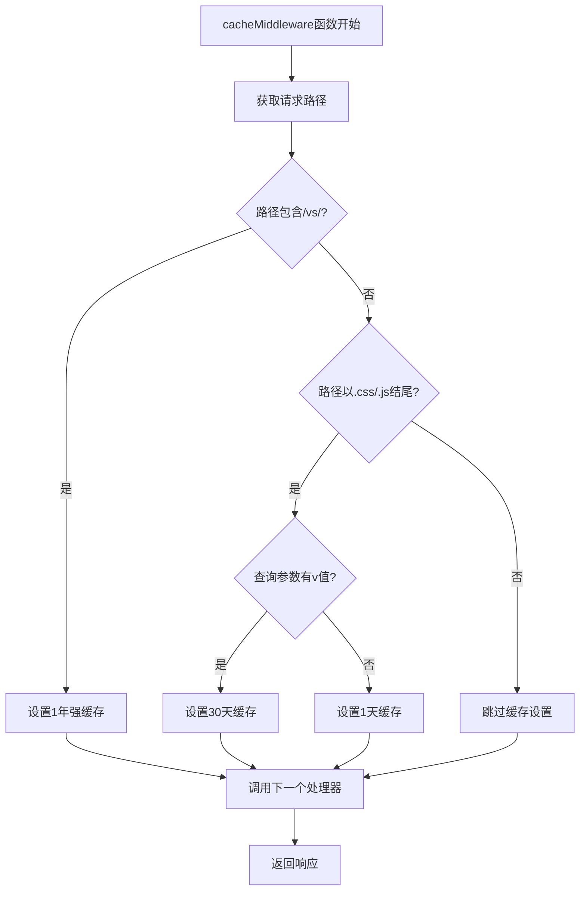
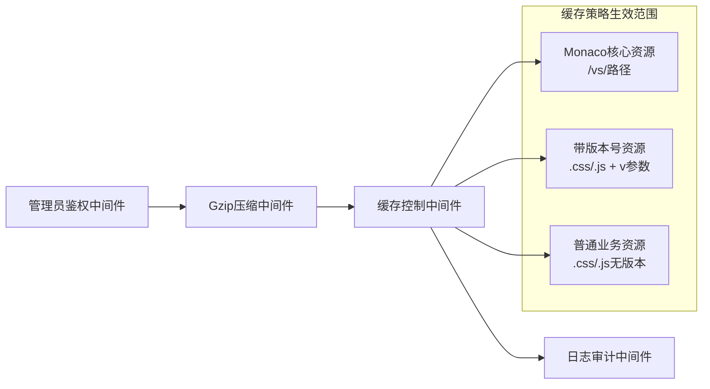
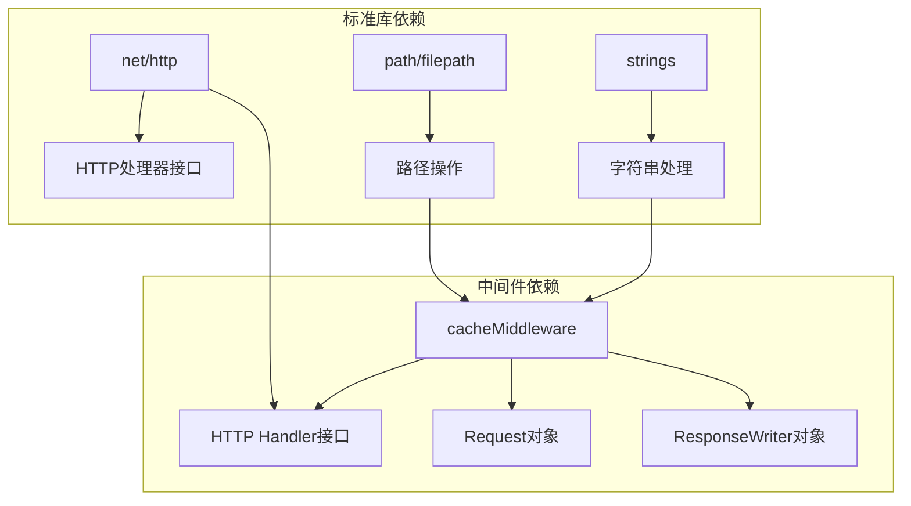

# 缓存控制中间件

<cite>
**本文档引用的文件**
- [middleware.go](file://src/middleware.go)
- [main.go](file://src/main.go)
- [handlers.go](file://src/handlers.go)
- [README.md](file://README.md)
</cite>

## 目录
1. [简介](#简介)
2. [项目结构](#项目结构)
3. [核心组件](#核心组件)
4. [架构概览](#架构概览)
5. [详细组件分析](#详细组件分析)
6. [依赖关系分析](#依赖关系分析)
7. [性能考虑](#性能考虑)
8. [故障排除指南](#故障排除指南)
9. [结论](#结论)

## 简介

本文档深入分析了缓存控制中间件的设计与实现，重点解释了 `cacheMiddleware` 的缓存策略设计。该中间件采用分层缓存策略，针对不同类型的资源实施差异化的缓存策略：Monaco 核心资源采用强缓存一年策略、带版本号的资源采用30天缓存策略、普通业务资源采用1天缓存策略。文档详细说明了 Cache-Control 头部的设置逻辑和路径匹配机制，并提供了性能影响分析和最佳实践建议。

## 项目结构

该项目采用 Go 语言编写的后端服务，主要包含以下核心文件：



**图表来源**
- [main.go:15-145](file://src/main.go#L15-L145)
- [middleware.go:1-103](file://src/middleware.go#L1-L103)

**章节来源**
- [main.go:15-145](file://src/main.go#L15-L145)
- [README.md:1-39](file://README.md#L1-L39)

## 核心组件

缓存控制中间件是整个 HTTP 请求处理管道中的重要组成部分，负责为不同类型的静态资源设置合适的缓存策略。该中间件实现了三层缓存策略：

### 缓存策略层次结构

```mermaid
flowchart TD
A[请求进入] --> B{路径检查}
B --> C[/vs/ 路径?]
C --> |是| D[Monaco 核心资源]
C --> |否| E{文件类型检查}
E --> F{CSS/JS 文件?}
F --> |是| G{查询参数检查}
G --> H{带版本参数?}
H --> |是| I[30天缓存策略]
H --> |否| J[1天缓存策略]
G --> |否| K[跳过缓存设置]
F --> |否| K
D --> L[1年强缓存策略]
I --> L
J --> L
K --> M[继续处理]
L --> M
```

**图表来源**
- [middleware.go:74-92](file://src/middleware.go#L74-L92)

### 缓存策略详解

缓存控制中间件根据资源类型和版本信息实施不同的缓存策略：

1. **Monaco 核心资源（/vs/ 路径）**：强缓存一年（31,536,000秒），使用 `immutable` 标志
2. **带版本号的业务资源（CSS/JS + v参数）**：强缓存30天（2,592,000秒），使用 `immutable` 标志  
3. **普通业务资源（CSS/JS 无版本）**：缓存1天（86,400秒）

**章节来源**
- [middleware.go:74-92](file://src/middleware.go#L74-L92)

## 架构概览

缓存控制中间件在整个 HTTP 请求处理链中扮演着关键角色，位于 Gzip 压缩中间件之后，负责为静态资源设置适当的缓存头。



**图表来源**
- [main.go:121-129](file://src/main.go#L121-L129)
- [middleware.go:74-92](file://src/middleware.go#L74-L92)

## 详细组件分析

### cacheMiddleware 实现分析

`cacheMiddleware` 函数实现了核心的缓存策略逻辑，采用条件判断的方式处理不同类型的资源请求。

#### 核心实现逻辑



**图表来源**
- [middleware.go:74-92](file://src/middleware.go#L74-L92)

#### 路径匹配机制

缓存中间件使用两种主要的路径匹配策略：

1. **包含匹配**：用于识别 Monaco 编辑器的核心资源
   - 检查路径是否包含 `/vs/` 字符串
   - 适用于 Monaco 编辑器的内核文件

2. **后缀匹配**：用于识别静态资源文件类型
   - 检查路径是否以 `.css` 或 `.js` 结尾
   - 适用于样式表和 JavaScript 文件

#### 版本参数检测

对于带版本号的资源，中间件通过查询参数检测来确定缓存策略：

- 检查 URL 查询字符串中的 `v` 参数是否存在且非空
- 如果存在版本参数，则应用30天缓存策略
- 如果不存在版本参数，则应用1天缓存策略

**章节来源**
- [middleware.go:74-92](file://src/middleware.go#L74-L92)

### 与其他中间件的协作

缓存控制中间件在中间件链中的位置决定了它的作用范围和影响：



**图表来源**
- [main.go:121-129](file://src/main.go#L121-L129)
- [middleware.go:74-92](file://src/middleware.go#L74-L92)

**章节来源**
- [main.go:121-129](file://src/main.go#L121-L129)

## 依赖关系分析

缓存控制中间件的实现依赖于标准库的 HTTP 处理机制，具有良好的模块化设计。

### 关键依赖关系



**图表来源**
- [middleware.go:3-12](file://src/middleware.go#L3-L12)

### 中间件链耦合度分析

缓存中间件与其它中间件之间保持松耦合的关系：

- **低耦合性**：仅依赖 HTTP 标准接口，不依赖具体实现细节
- **高内聚性**：专注于缓存策略的计算和设置
- **可测试性**：独立的功能模块，便于单元测试

**章节来源**
- [middleware.go:3-12](file://src/middleware.go#L3-L12)

## 性能考虑

缓存控制中间件的设计充分考虑了性能优化需求，通过合理的缓存策略减少网络传输和服务器负载。

### 缓存策略的性能影响

| 资源类型 | 缓存时长 | 性能收益 | 使用场景 |
|---------|---------|---------|---------|
| Monaco核心资源 | 1年 | 极大减少带宽消耗 | 编辑器内核文件 |
| 带版本号资源 | 30天 | 显著减少请求次数 | 版本化业务脚本 |
| 普通业务资源 | 1天 | 适度减少服务器压力 | 动态生成内容 |

### 缓存策略的实现优势

1. **智能版本检测**：自动识别带版本号的资源，避免缓存过期问题
2. **路径精确匹配**：准确区分不同类型的资源，避免误缓存
3. **零成本处理**：对不需要缓存的请求几乎不增加处理时间

### 最佳实践建议

1. **Monaco资源优化**
   - 确保 `/vs/` 路径下的所有文件都使用强缓存策略
   - 定期验证 Monaco 版本更新后的缓存失效机制

2. **版本化资源管理**
   - 为所有业务脚本和样式表添加版本参数
   - 建立版本号更新的自动化流程

3. **监控和调优**
   - 监控缓存命中率和带宽节省效果
   - 根据实际使用情况进行缓存时长调整

## 故障排除指南

### 常见问题诊断

#### 缓存策略不生效

**症状**：浏览器仍然发送请求获取资源，没有使用缓存

**排查步骤**：
1. 检查请求路径是否正确匹配缓存规则
2. 验证 Cache-Control 头部是否正确设置
3. 确认浏览器缓存功能正常

**解决方案**：
- 确保路径包含 `/vs/` 或以 `.css/.js` 结尾
- 检查查询参数中 `v` 参数的正确性
- 验证中间件执行顺序

#### 缓存过期问题

**症状**：用户看到旧版本的资源

**排查步骤**：
1. 检查版本参数是否正确更新
2. 验证缓存时长设置是否合理
3. 确认 CDN 或代理服务器的缓存配置

**解决方案**：
- 更新版本参数值
- 调整缓存时长设置
- 清除相关缓存

**章节来源**
- [middleware.go:74-92](file://src/middleware.go#L74-L92)

## 结论

缓存控制中间件通过精心设计的三层缓存策略，有效平衡了性能优化和资源更新需求。该实现具有以下特点：

1. **智能化的缓存策略**：根据不同资源类型和版本信息自动选择合适的缓存时长
2. **精确的路径匹配**：准确识别 Monaco 核心资源和业务资源，避免误缓存
3. **良好的性能表现**：显著减少网络传输和服务器负载
4. **易于维护和扩展**：清晰的代码结构和明确的职责划分

通过合理运用这些缓存策略，可以显著提升应用的响应速度和用户体验，同时保持资源更新的及时性。建议在生产环境中结合监控数据持续优化缓存策略，以获得最佳的性能表现。