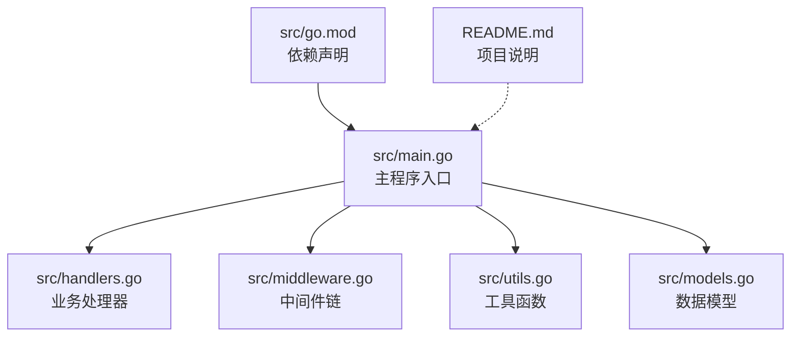
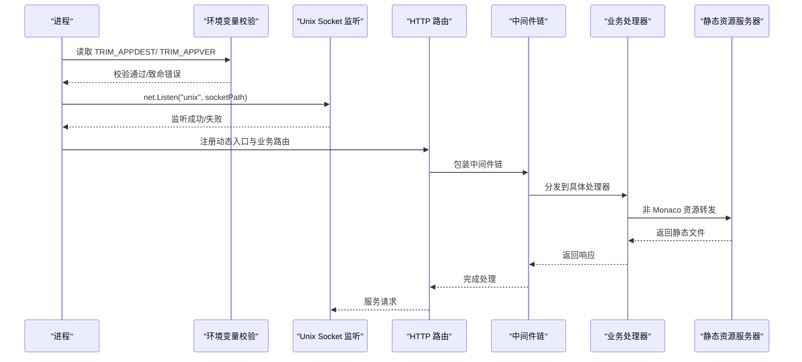
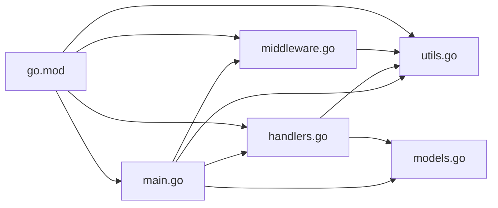

# 主程序入口

<cite>
**本文档引用的文件**
- [main.go](file://src/main.go)
- [handlers.go](file://src/handlers.go)
- [middleware.go](file://src/middleware.go)
- [models.go](file://src/models.go)
- [utils.go](file://src/utils.go)
- [go.mod](file://src/go.mod)
- [README.md](file://README.md)
</cite>

## 目录
1. [简介](#简介)
2. [项目结构](#项目结构)
3. [核心组件](#核心组件)
4. [架构总览](#架构总览)
5. [详细组件分析](#详细组件分析)
6. [依赖关系分析](#依赖关系分析)
7. [性能考虑](#性能考虑)
8. [故障排查指南](#故障排查指南)
9. [结论](#结论)
10. [附录](#附录)

## 简介
本文件聚焦于主程序入口，系统性阐述应用程序的启动流程、环境变量验证、Unix Socket 路径配置与前缀设置、HTTP 路由配置（动态入口服务、静态资源处理、业务 API 路由）、版本号注入机制（HTML/CSS/JS 的版本后缀处理）、静态资源转发与 Monaco 编辑器核心资源的特殊处理、启动日志记录与错误处理策略，以及部署配置与环境要求。

## 项目结构
该仓库采用 Go 语言实现后端服务，核心入口位于 src/main.go，配合 handlers.go、middleware.go、utils.go、models.go 等模块完成业务逻辑、中间件与工具函数。go.mod 描述了依赖，README.md 提供了项目背景与使用说明。

图表来源
- [main.go:1-145](file://src/main.go#L1-L145)
- [handlers.go:1-614](file://src/handlers.go#L1-L614)
- [middleware.go:1-103](file://src/middleware.go#L1-L103)
- [utils.go:1-262](file://src/utils.go#L1-L262)
- [models.go:1-30](file://src/models.go#L1-L30)
- [go.mod:1-12](file://src/go.mod#L1-L12)

章节来源
- [main.go:1-145](file://src/main.go#L1-L145)
- [go.mod:1-12](file://src/go.mod#L1-L12)
- [README.md:1-39](file://README.md#L1-L39)

## 核心组件
- 环境变量与路径配置
  - TRIM_APPDEST：应用根目录，用于定位 www 目录与 m-text-editor.sock。
  - TRIM_APPVER：版本号，用于资源版本后缀注入。
- Unix Socket 监听
  - 使用 net.Listen("unix", socketPath) 监听 m-text-editor.sock。
- HTTP 路由与中间件
  - ServeMux 动态入口服务：首页、样式网关、JS 注入、静态资源转发。
  - 业务 API：读取、保存、设置、新建、列表、文件监控、终端会话。
  - 中间件链：管理员鉴权、Gzip 压缩、缓存控制、日志审计。
- 版本号注入机制
  - HTML：为 style.css、app.js、插件注入 ?v=版本号。
  - CSS：为 @import 引用注入 ?v=版本号。
  - JS：为非 Monaco 的 JS 文件注入 ?v=版本号。
- 静态资源转发与 Monaco 特殊处理
  - 通过 http.StripPrefix(prefix, http.FileServer(http.Dir(wwwDir))) 转发静态资源。
  - 对 /vs/ 路径的资源设置强缓存一年。
- 日志与错误处理
  - 启动阶段打印关键信息；HTTP 请求统一记录方法与 URI；对各类错误返回明确状态码与消息。

章节来源
- [main.go:15-145](file://src/main.go#L15-L145)
- [middleware.go:22-92](file://src/middleware.go#L22-L92)
- [handlers.go:21-611](file://src/handlers.go#L21-L611)

## 架构总览
下图展示从进程启动到请求处理的关键路径，包括环境变量校验、Unix Socket 监听、路由注册、中间件链与业务处理。

图表来源
- [main.go:15-145](file://src/main.go#L15-L145)
- [handlers.go:21-611](file://src/handlers.go#L21-L611)
- [middleware.go:22-92](file://src/middleware.go#L22-L92)

## 详细组件分析

### 启动流程与环境变量验证
- TRIM_APPDEST 必须存在且非空，否则记录致命日志并退出。
- TRIM_APPVER 必须存在且非空，否则记录致命日志并退出。
- 基于 TRIM_APPDEST 计算 socketPath 与 wwwDir，并设置 prefix 为 "/app/m-text-editor/"。
- 启动日志输出版本、Socket 路径、前缀等关键信息。

章节来源
- [main.go:15-35](file://src/main.go#L15-L35)

### Unix Socket 路径配置与监听
- socketPath = TRIM_APPDEST + "/m-text-editor.sock"
- wwwDir = TRIM_APPDEST + "/www"
- 监听前先移除旧 socket 文件，然后以 0666 权限开放。
- 使用 http.Serve(l, loggingMux) 提供服务，异常时记录致命日志。

章节来源
- [main.go:26-35](file://src/main.go#L26-L35)
- [main.go:130-143](file://src/main.go#L130-L143)

### HTTP 路由配置与动态入口服务
- 前缀 prefix 固定为 "/app/m-text-editor/"。
- 动态入口服务（mux.HandleFunc(prefix)）：
  - 首页处理：读取 index.html，注入 style.css、app.js、插件的版本后缀，返回 HTML。
  - 样式网关：读取 style.css，为 @import 引用注入版本后缀，返回 CSS。
  - JS 注入：对非 Monaco 的 JS 文件注入版本后缀，返回 JS。
  - 静态资源转发：对其他资源通过 StripPrefix + FileServer 转发至 wwwDir。
- 业务 API 路由：
  - 列表、读取、保存、新建、设置、文件监控（WebSocket）、终端会话（WebSocket）。

章节来源
- [main.go:37-119](file://src/main.go#L37-L119)

### 版本号注入机制
- HTML 注入：将 href="style.css"、src="app.js"、/plugins/inject_fnos.js 替换为带 ?v=版本号的链接。
- CSS 注入：将 .css'); 与 .css"); 替换为带 ?v=版本号的引用。
- JS 注入：对非 Monaco 的 JS 文件，将 .js'; 与 .js"; 替换为带 ?v=版本号的引用。
- 作用：通过版本后缀实现浏览器缓存失效与资源更新。

章节来源
- [main.go:44-105](file://src/main.go#L44-L105)

### 静态资源转发与 Monaco 特殊处理
- 非 Monaco 资源：通过 http.StripPrefix(prefix, http.FileServer(http.Dir(wwwDir))) 转发。
- Monaco 核心资源：/vs/ 路径下的资源设置强缓存一年，提升加载性能。
- 路径安全：对 JS 注入场景进行路径合法性校验，避免目录逃逸。

章节来源
- [main.go:107-109](file://src/main.go#L107-L109)
- [middleware.go:78-89](file://src/middleware.go#L78-L89)
- [main.go:85-90](file://src/main.go#L85-L90)

### 业务 API 路由与处理器
- 列表：列出目录项，过滤隐藏文件，按目录优先与名称排序。
- 读取：校验路径与权限，限制最大文件大小，探测编码，必要时进行转码。
- 保存：原子写入（临时文件 + 重命名），保留原权限与 UID/GID，同步落盘。
- 新建：预检与物理创建，同步权限。
- 设置：读取/写入 settings.json 或 settings_mobile.json，支持临时文件 + 原子替换。
- 文件监控：WebSocket 实时推送文件变更事件。
- 终端会话：WebSocket 连接，PTY 启动，窗口尺寸调整与心跳保活。

章节来源
- [handlers.go:21-611](file://src/handlers.go#L21-L611)

### 中间件链与错误处理
- 管理员鉴权：生产环境下要求 X-Trim-Isadmin=true，否则返回 403。
- Gzip 压缩：忽略 WebSocket 升级请求，对 .js/.css/.html/API 响应启用压缩。
- 缓存控制：Monaco 资源强缓存一年；带版本号的 CSS/JS 强缓存 30 天；普通业务资源缓存 1 天。
- 日志审计：统一记录 HTTP 方法与 URI，便于问题追踪。
- 错误处理：对路径非法、权限不足、文件不存在、编码探测失败、写入失败等情况返回明确错误与状态码。

章节来源
- [middleware.go:22-92](file://src/middleware.go#L22-L92)
- [handlers.go:21-611](file://src/handlers.go#L21-L611)

### 数据模型
- Response：标准响应结构，包含内容、修改时间、大小、权限、语言、编码建议与错误信息。
- FileInfo：目录项元数据，包含名称、路径、是否目录、大小、修改时间与是否符号链接。
- ListResponse：目录列表响应结构，包含路径、文件数组与错误信息。

章节来源
- [models.go:3-29](file://src/models.go#L3-L29)

### 工具函数
- cleanAndValidatePath：清理并校验路径，防范目录逃逸，排除应用自身资源目录。
- detectLanguage：根据扩展名或 Shebang 识别语言类型。
- predictEncoding/getEncoding：字符编码预测与转换器获取。
- startPty：启动 PTY 并在 WebSocket 间转发数据，支持窗口尺寸调整与心跳保活。

章节来源
- [utils.go:25-53](file://src/utils.go#L25-L53)
- [utils.go:55-106](file://src/utils.go#L55-L106)
- [utils.go:108-165](file://src/utils.go#L108-L165)
- [utils.go:167-261](file://src/utils.go#L167-L261)

## 依赖关系分析
- main.go 依赖 handlers.go（业务处理器）、middleware.go（中间件）、utils.go（工具函数）、models.go（数据模型）。
- handlers.go 依赖 utils.go（路径校验、编码、语言识别）、models.go（响应结构）。
- middleware.go 依赖 utils.go（路径扩展名判断）。
- go.mod 声明第三方依赖：golang.org/x/text、github.com/creack/pty、github.com/wlynxg/chardet、golang.org/x/net。

图表来源
- [main.go:1-145](file://src/main.go#L1-L145)
- [handlers.go:1-614](file://src/handlers.go#L1-L614)
- [middleware.go:1-103](file://src/middleware.go#L1-L103)
- [utils.go:1-262](file://src/utils.go#L1-L262)
- [models.go:1-30](file://src/models.go#L1-L30)
- [go.mod:1-12](file://src/go.mod#L1-L12)

章节来源
- [go.mod:1-12](file://src/go.mod#L1-L12)

## 性能考虑
- Gzip 压缩池：复用 gzip.Writer，降低分配开销。
- 缓存策略：Monaco 核心资源强缓存一年，带版本号的业务资源强缓存 30 天，普通资源缓存 1 天，平衡更新与性能。
- 原子写入：临时文件 + 重命名，减少写入冲突与数据损坏风险。
- PTY 会话：心跳保活与窗口尺寸动态调整，避免长时间无交互导致的资源泄漏。

## 故障排查指南
- 环境变量缺失
  - 现象：启动即退出并提示未检测到 TRIM_APPDEST 或 TRIM_APPVER。
  - 处理：确保在容器环境中正确设置 TRIM_APPDEST 与 TRIM_APPVER。
- Unix Socket 监听失败
  - 现象：无法监听 socket，服务意外终止。
  - 处理：检查 TRIM_APPDEST 权限与磁盘空间，确认 socket 路径可写。
- 路径访问被拒绝
  - 现象：返回 403，提示拒绝访问。
  - 处理：确认请求路径未指向应用自身资源目录，且符合 cleanAndValidatePath 规则。
- 文件读取失败
  - 现象：返回错误信息，如文件不存在、超过大小限制、检测到二进制内容。
  - 处理：检查文件路径、大小与编码，必要时手动转码。
- 保存失败
  - 现象：返回写入失败或原子替换失败。
  - 处理：检查磁盘空间、权限与目标路径是否存在，确认临时文件创建成功。
- WebSocket 连接问题
  - 现象：终端或文件监控连接失败或断开。
  - 处理：检查管理员鉴权头 X-Trim-Isadmin，确认 PTY 启动与心跳机制正常。

章节来源
- [main.go:15-24](file://src/main.go#L15-L24)
- [main.go:130-143](file://src/main.go#L130-L143)
- [handlers.go:21-611](file://src/handlers.go#L21-L611)
- [middleware.go:22-38](file://src/middleware.go#L22-L38)

## 结论
主程序入口通过严格的环境变量校验、Unix Socket 监听与中间件链包装，构建了安全、高效且可维护的服务。动态入口服务实现了资源版本化与静态转发，业务 API 覆盖文件读写、监控与终端会话，整体设计兼顾性能与可靠性。建议在生产环境中严格遵循部署配置与环境要求，确保管理员鉴权与缓存策略生效。

## 附录

### 部署配置与环境要求
- 环境变量
  - TRIM_APPDEST：应用根目录，必须存在且可写。
  - TRIM_APPVER：版本号字符串，用于资源版本后缀。
  - TRIM_PKGVAR：配置存储目录（用于 settings.json/settings_mobile.json）。
- 目录结构
  - www：静态资源目录，包含 index.html、style.css、app.js 及插件。
  - m-text-editor.sock：Unix Socket 文件，监听路径由 TRIM_APPDEST 决定。
- 权限
  - Unix Socket 权限设为 0666，便于代理层访问。
- 依赖
  - Go 版本：1.26.2+
  - 第三方库：golang.org/x/text、github.com/creack/pty、github.com/wlynxg/chardet、golang.org/x/net。

章节来源
- [main.go:15-35](file://src/main.go#L15-L35)
- [handlers.go:518-529](file://src/handlers.go#L518-L529)
- [go.mod:1-12](file://src/go.mod#L1-L12)