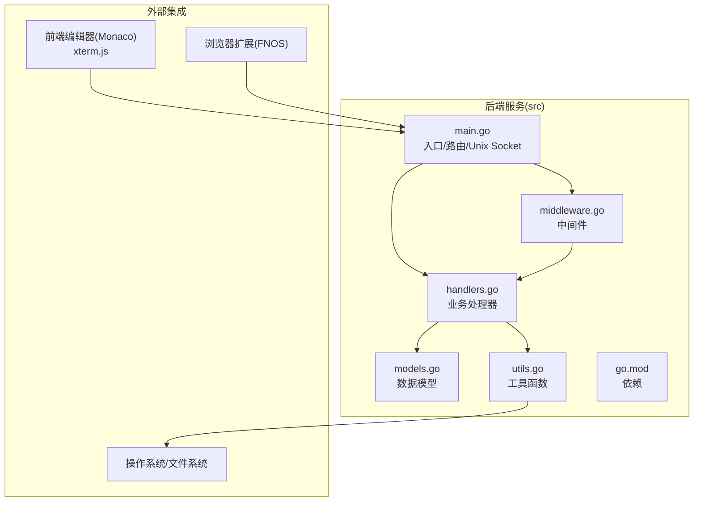
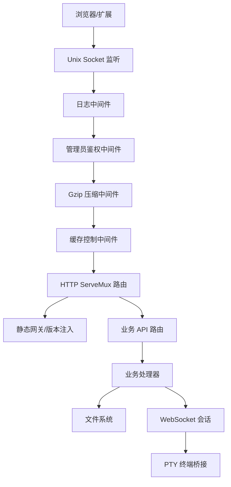
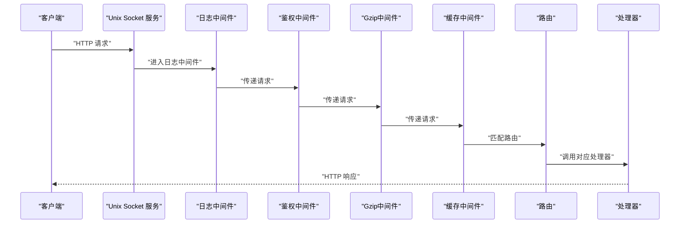
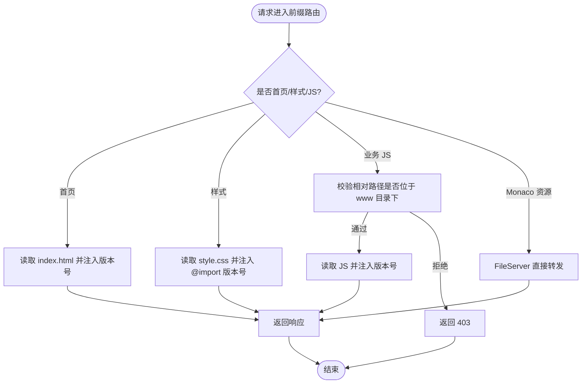
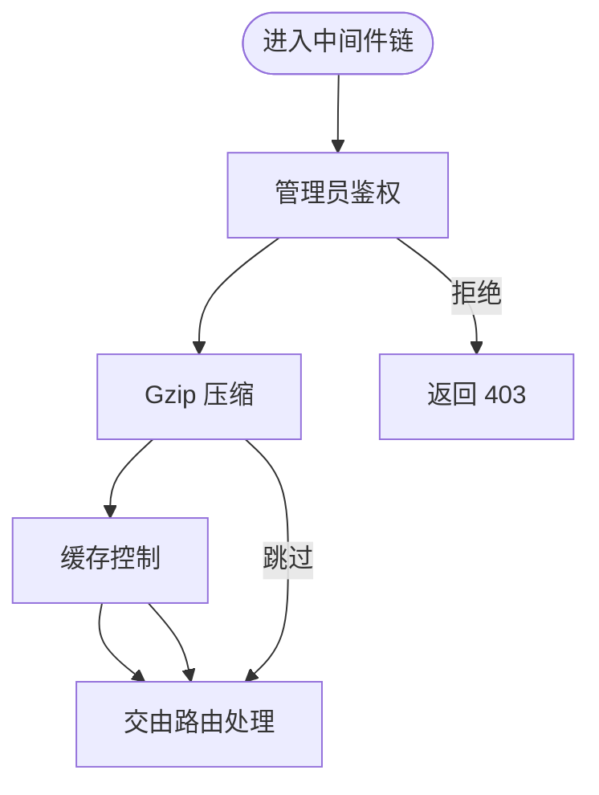
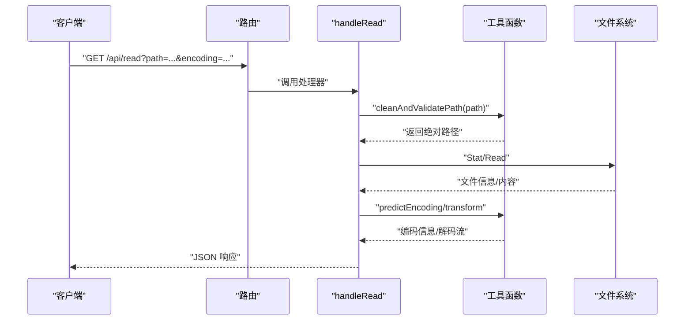
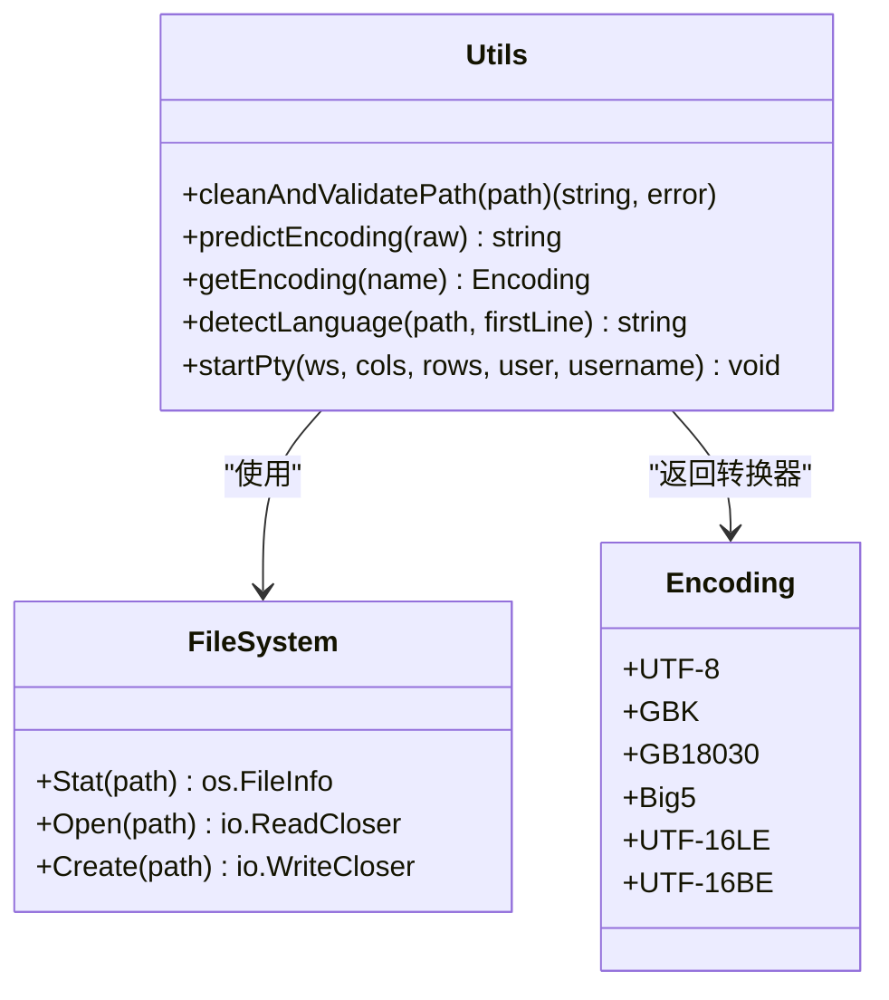
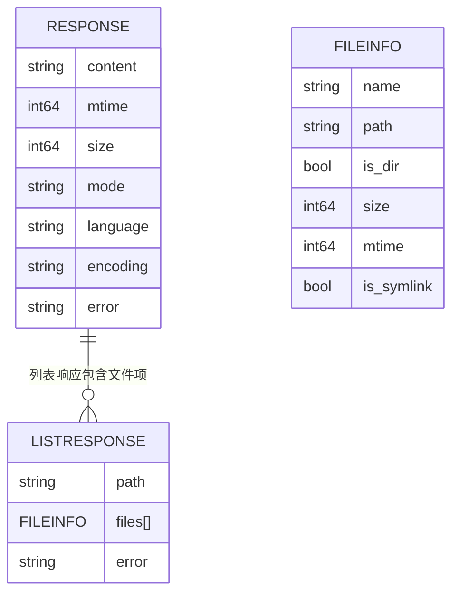
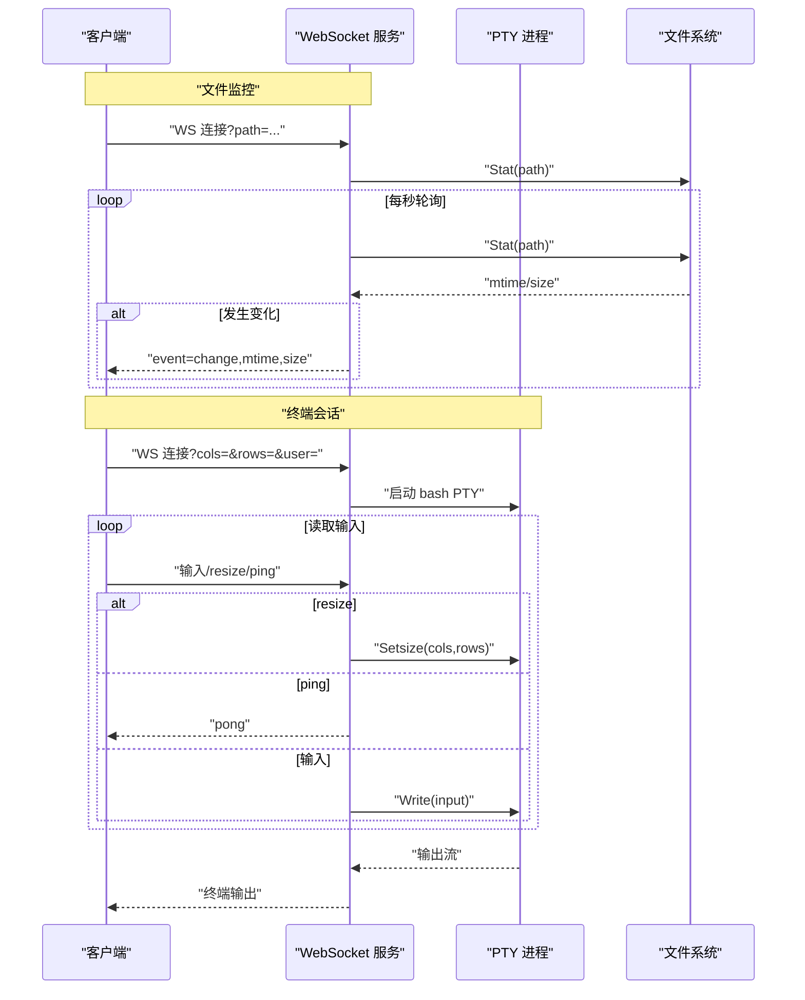
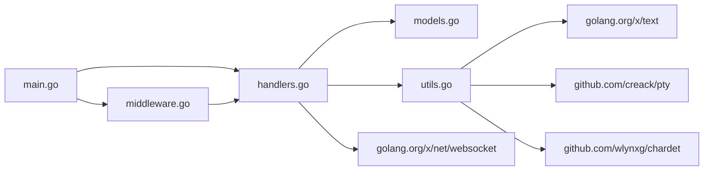

# 后端服务架构

<cite>
**本文引用的文件**
- [main.go](file://src/main.go)
- [handlers.go](file://src/handlers.go)
- [middleware.go](file://src/middleware.go)
- [models.go](file://src/models.go)
- [utils.go](file://src/utils.go)
- [go.mod](file://src/go.mod)
- [README.md](file://README.md)
</cite>

## 目录
1. [简介](#简介)
2. [项目结构](#项目结构)
3. [核心组件](#核心组件)
4. [架构总览](#架构总览)
5. [详细组件分析](#详细组件分析)
6. [依赖关系分析](#依赖关系分析)
7. [性能考虑](#性能考虑)
8. [故障排查指南](#故障排查指南)
9. [结论](#结论)
10. [附录](#附录)

## 简介
本项目为 PodNote 文本编辑器的后端服务，采用 Go 语言实现，提供以下能力：
- 基于 Unix Socket 的本地通信，避免网络暴露风险
- 静态资源网关与版本号注入，配合前端构建产物
- 文件读写、目录浏览、设置读写等核心 API
- WebSocket 文件监控与交互式终端（PTY）会话
- 中间件体系：管理员鉴权、Gzip 压缩、缓存控制
- 数据模型统一响应结构，工具函数涵盖路径安全、编码检测、语言识别、PTY 终端桥接

该服务面向飞牛OS（FNOS）生态，与浏览器扩展和前端编辑器协同工作，提供安全、高性能的本地编辑体验。

## 项目结构
后端代码集中在 src 目录，核心文件如下：
- main.go：服务入口、路由注册、Unix Socket 监听、中间件链包装
- handlers.go：业务处理器（读取/保存/新建/列表/设置/文件监控/终端）
- middleware.go：中间件（管理员鉴权、Gzip 压缩、缓存控制）
- models.go：统一响应模型（Response、FileInfo、ListResponse）
- utils.go：工具函数（路径清理与校验、编码预测、语言识别、PTY 终端桥接）
- go.mod：依赖声明
- README.md：项目说明与特性概览

图示来源
- [main.go:1-145](file://src/main.go#L1-L145)
- [handlers.go:1-614](file://src/handlers.go#L1-L614)
- [middleware.go:1-103](file://src/middleware.go#L1-L103)
- [models.go:1-30](file://src/models.go#L1-L30)
- [utils.go:1-262](file://src/utils.go#L1-L262)
- [go.mod:1-12](file://src/go.mod#L1-L12)

章节来源
- [README.md:1-39](file://README.md#L1-L39)
- [go.mod:1-12](file://src/go.mod#L1-L12)

## 核心组件
- 入口与路由
  - 通过环境变量确定应用根目录与版本，拼接前缀路径
  - 注册静态网关与业务 API 路由
  - 注册 WebSocket 路由（文件监控、终端会话）
- 中间件链
  - 管理员鉴权中间件：生产环境强制管理员头校验
  - Gzip 压缩中间件：对静态资源与 API 响应透明压缩
  - 缓存控制中间件：针对不同资源类型设置缓存策略
- 业务处理器
  - 列表、读取、保存、新建、设置、文件监控、终端会话
- 工具函数
  - 路径安全校验、编码预测、语言识别、PTY 终端桥接
- 数据模型
  - 统一响应结构，便于前后端契约一致

章节来源
- [main.go:15-145](file://src/main.go#L15-L145)
- [handlers.go:21-614](file://src/handlers.go#L21-L614)
- [middleware.go:22-103](file://src/middleware.go#L22-L103)
- [models.go:3-30](file://src/models.go#L3-L30)
- [utils.go:25-262](file://src/utils.go#L25-L262)

## 架构总览
整体架构围绕 Unix Socket 进行本地通信，通过 HTTP ServeMux 注册路由，结合中间件链实现鉴权、压缩与缓存；业务处理器负责文件系统操作与 WebSocket 会话；工具函数提供安全与兼容性保障。

图示来源
- [main.go:37-145](file://src/main.go#L37-L145)
- [handlers.go:426-516](file://src/handlers.go#L426-L516)
- [middleware.go:22-92](file://src/middleware.go#L22-L92)
- [utils.go:167-262](file://src/utils.go#L167-L262)

## 详细组件分析

### Unix Socket 通信机制
- 监听路径：基于 TRIM_APPDEST 环境变量拼接出 socket 文件路径
- 权限设置：监听后将 socket 权限调整为可读写
- 关闭与清理：服务退出前移除旧 socket 文件，避免残留
- 传输协议：HTTP over Unix Domain Socket，避免网络暴露，降低攻击面

图示来源
- [main.go:130-145](file://src/main.go#L130-L145)
- [main.go:121-129](file://src/main.go#L121-L129)
- [main.go:37-119](file://src/main.go#L37-L119)

章节来源
- [main.go:26-139](file://src/main.go#L26-L139)

### 路由配置与静态网关
- 前缀：/app/m-text-editor/
- 首页与样式注入：为 HTML/CSS 中的资源注入版本号查询参数，便于缓存失效
- 非 Monaco JS 注入：对业务脚本注入 ES 模块版本后缀
- 资源转发：Monaco 核心资源通过 FileServer 直接转发
- 安全校验：相对路径拼接后进行绝对路径解析与前缀校验，防止目录逃逸

图示来源
- [main.go:40-109](file://src/main.go#L40-L109)

章节来源
- [main.go:40-109](file://src/main.go#L40-L109)

### 中间件系统设计
- 管理员鉴权中间件
  - 仅在 TRIM_APPDEST 环境变量存在时启用
  - 通过 X-Trim-Isadmin 头判断是否管理员
  - 非管理员直接返回 403
- Gzip 压缩中间件
  - 忽略 WebSocket 升级与终端路由
  - 对 .js/.css/.html 与 /api/ 路径进行透明压缩
  - 使用 sync.Pool 复用 gzip.Writer，降低分配开销
- 缓存控制中间件
  - Monaco 核心资源强缓存一年
  - 带版本号的静态资源强缓存 30 天
  - 普通业务资源缓存 1 天

图示来源
- [middleware.go:22-92](file://src/middleware.go#L22-L92)

章节来源
- [middleware.go:22-103](file://src/middleware.go#L22-L103)

### 数据处理流程（请求到响应）
以读取文件为例，展示典型处理链路：
- 参数提取：从 URL 查询参数获取路径与编码
- 路径校验：cleanAndValidatePath 清洗并校验路径，防止目录逃逸
- 文件检查：stat 判断是否存在、是否为文件、大小限制
- 编码探测：predictEncoding 预测编码，必要时进行 UTF-8 转码
- 内容读取：按需使用 transform.Reader 进行解码
- 响应组装：填充内容、修改时间、大小、权限、语言、编码建议

图示来源
- [handlers.go:114-212](file://src/handlers.go#L114-L212)
- [utils.go:25-165](file://src/utils.go#L25-L165)

章节来源
- [handlers.go:114-212](file://src/handlers.go#L114-L212)
- [utils.go:25-165](file://src/utils.go#L25-L165)

### 工具函数模块
- 路径安全验证
  - 清洗路径、解析符号链接、绝对化
  - 与 TRIM_APPDEST 比较，禁止访问应用自身资源目录
- 编码检测与转换
  - predictEncoding 使用 chardet 检测常见编码，映射到内部 ID
  - getEncoding 返回 text 包中的编码转换器
- 语言识别
  - 基于扩展名与 shebang 判断 Monaco 语言 ID
- PTY 终端桥接
  - 支持按 cols/rows 初始化窗口大小
  - 处理 resize 与 ping/pong 心跳
  - 可按用户名切换用户上下文并设置 HOME/USER 等环境变量

图示来源
- [utils.go:25-262](file://src/utils.go#L25-L262)

章节来源
- [utils.go:25-262](file://src/utils.go#L25-L262)

### 数据模型设计
- Response：统一响应体，包含内容、修改时间、大小、权限、语言、编码建议与错误信息
- FileInfo：目录项元数据，包含名称、路径、是否目录、大小、修改时间、是否符号链接
- ListResponse：目录列表响应，包含路径与文件数组

图示来源
- [models.go:3-30](file://src/models.go#L3-L30)

章节来源
- [models.go:3-30](file://src/models.go#L3-L30)

### WebSocket 会话与终端桥接
- 文件监控
  - 客户端建立 WebSocket 连接，携带目标文件路径
  - 服务端每秒轮询文件修改时间与大小，有变化推送变更事件
- 交互式终端
  - 校验管理员权限（生产环境）
  - 启动 bash PTY，设置窗口大小与环境变量
  - 通过 goroutine 转发输入、处理 resize 与 ping/pong 心跳
  - 90 秒无交互自动断开，防止资源泄露

图示来源
- [handlers.go:426-494](file://src/handlers.go#L426-L494)
- [handlers.go:496-516](file://src/handlers.go#L496-L516)
- [utils.go:167-262](file://src/utils.go#L167-L262)

章节来源
- [handlers.go:426-516](file://src/handlers.go#L426-L516)
- [utils.go:167-262](file://src/utils.go#L167-L262)

## 依赖关系分析
- 外部依赖
  - golang.org/x/text：编码检测与转换
  - github.com/creack/pty：PTY 终端桥接
  - github.com/wlynxg/chardet：字符集检测
  - golang.org/x/net/websocket：WebSocket 支持
- 内部耦合
  - main.go 作为入口，依赖 handlers、middleware、utils
  - handlers 依赖 models 与 utils
  - middleware 与 handlers 通过 http.Handler 接口解耦

图示来源
- [go.mod:5-11](file://src/go.mod#L5-L11)
- [main.go:3-12](file://src/main.go#L3-L12)
- [handlers.go:3-19](file://src/handlers.go#L3-L19)
- [middleware.go:3-12](file://src/middleware.go#L3-L12)
- [utils.go:3-23](file://src/utils.go#L3-L23)

章节来源
- [go.mod:1-12](file://src/go.mod#L1-L12)

## 性能考虑
- 压缩策略
  - 使用 sync.Pool 复用 gzip.Writer，减少 GC 压力
  - 仅对静态资源与 API 响应进行压缩，避免对 WebSocket 流造成额外负担
- 缓存策略
  - Monaco 核心资源强缓存一年，显著降低带宽与延迟
  - 带版本号的资源强缓存 30 天，普通资源缓存 1 天
- 文件读取与写入
  - 读取阶段先探测编码与二进制内容，避免对大文件与二进制文件进行不必要的解码
  - 写入阶段采用临时文件 + 原子重命名，保证一致性与可靠性
- 终端会话
  - 90 秒无交互自动断开，防止僵尸连接占用资源
  - PTY 输出通过 io.Copy 直传，避免多余缓冲

优化建议
- 对高频 API 增加内存缓存（如目录列表），结合文件系统事件触发失效
- 将压缩等级与阈值参数化，根据部署环境动态调整
- 对静态资源引入 ETag/Last-Modified，进一步提升缓存命中率
- 在高并发场景下，考虑将压缩与缓存策略与上游反向代理（如 Nginx）协同

[本节为通用性能指导，无需特定文件引用]

## 故障排查指南
- 环境变量缺失
  - TRIM_APPDEST/ TRIM_APPVER 未设置会导致启动失败
- 路由访问被拒
  - 非管理员在生产环境会被拒绝访问
- 路径安全问题
  - 目录逃逸防护：确保路径经 cleanAndValidatePath 处理
- 文件读取失败
  - 检查文件是否存在、是否为文件、大小是否超过限制
  - 编码检测失败时回退至 UTF-8
- 保存失败
  - 临时文件写入失败或原子重命名失败
  - 与文件权限、UID/GID 同步相关的警告可忽略但需关注
- WebSocket 断连
  - 终端会话 90 秒无交互自动断开
  - 文件监控连接断开时检查文件是否被外部删除

章节来源
- [main.go:16-24](file://src/main.go#L16-L24)
- [handlers.go:26-39](file://src/handlers.go#L26-L39)
- [handlers.go:146-151](file://src/handlers.go#L146-L151)
- [handlers.go:309-314](file://src/handlers.go#L309-L314)
- [utils.go:234-236](file://src/utils.go#L234-L236)

## 结论
该后端服务以 Unix Socket 为核心，结合中间件链实现了安全、高效、可扩展的本地编辑器支撑能力。通过严格的路径安全校验、透明压缩与缓存策略、以及完善的 WebSocket 会话机制，满足了飞牛OS生态下的编辑与终端需求。未来可在缓存策略、压缩参数化与上游代理协同方面进一步优化，以适应更高负载与更复杂的部署场景。

[本节为总结性内容，无需特定文件引用]

## 附录
- 术语
  - Unix Socket：本地域套接字，避免网络暴露
  - PTY：伪终端，用于终端会话桥接
  - Vary：HTTP 头，指示缓存键包含的字段
- 扩展点
  - 增加鉴权白名单与细粒度权限控制
  - 引入上游反向代理与 TLS 终止
  - 添加指标采集与日志聚合
  - 支持更多语言与编码的自动识别

[本节为概念性内容，无需特定文件引用]