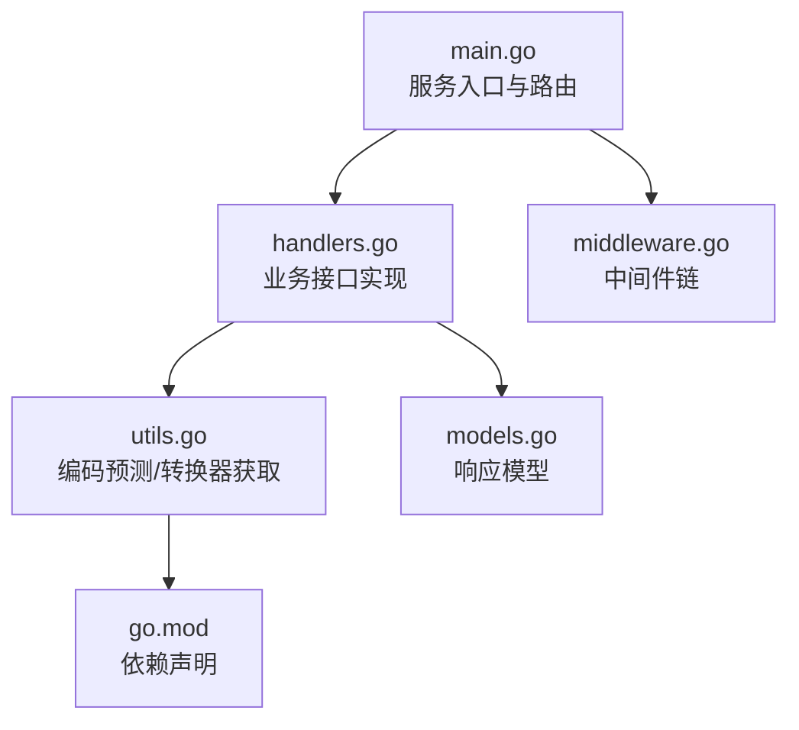
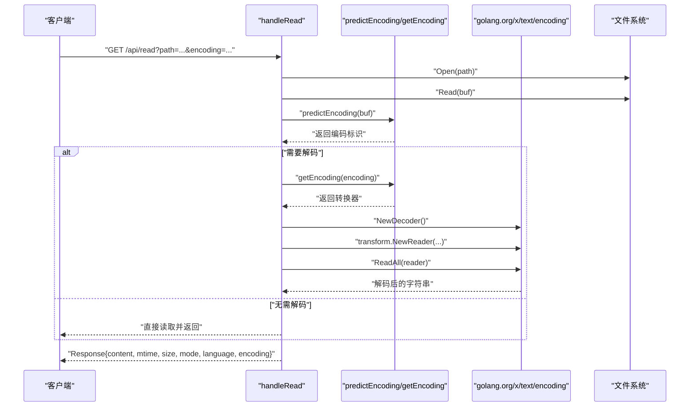
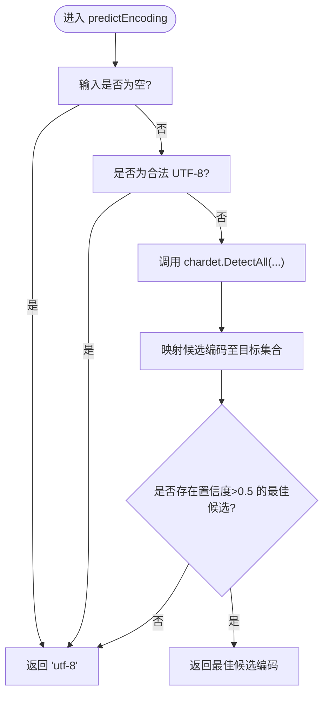
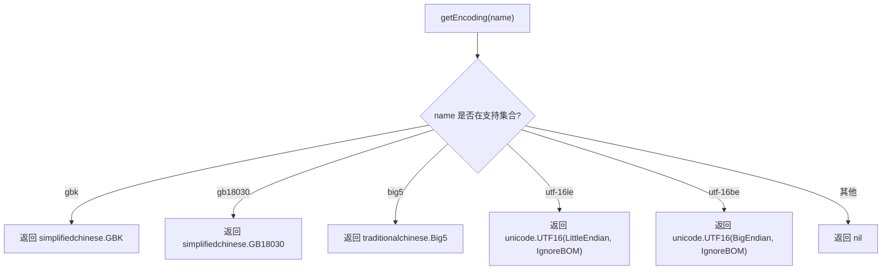
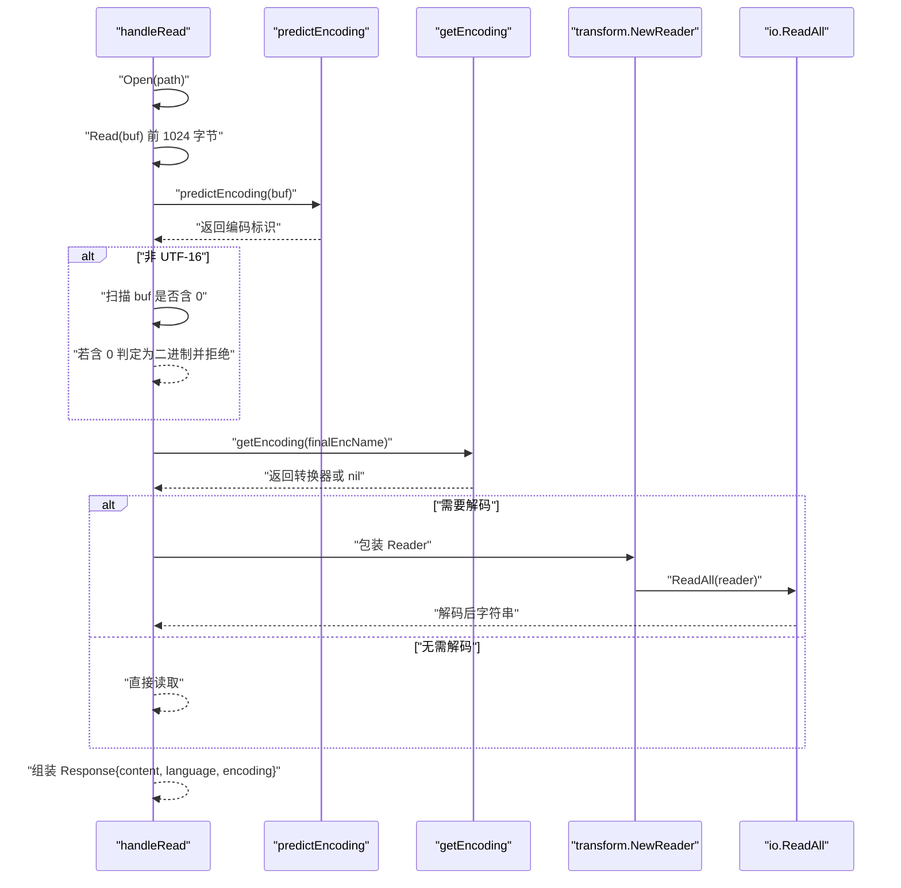
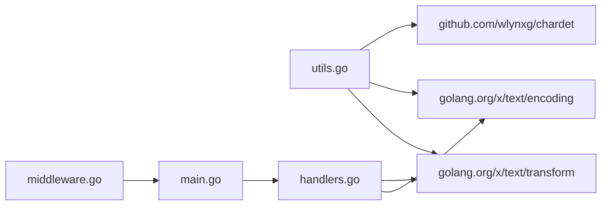

# 字符编码检测

<cite>
**本文引用的文件**
- [main.go](file://src/main.go)
- [utils.go](file://src/utils.go)
- [handlers.go](file://src/handlers.go)
- [models.go](file://src/models.go)
- [middleware.go](file://src/middleware.go)
- [go.mod](file://src/go.mod)
- [README.md](file://README.md)
</cite>

## 目录
1. [简介](#简介)
2. [项目结构](#项目结构)
3. [核心组件](#核心组件)
4. [架构总览](#架构总览)
5. [详细组件分析](#详细组件分析)
6. [依赖关系分析](#依赖关系分析)
7. [性能考量](#性能考量)
8. [故障排查指南](#故障排查指南)
9. [结论](#结论)
10. [附录](#附录)

## 简介
本文件聚焦于字符编码检测功能，系统性阐述以下能力：
- predictEncoding 的实现原理与多编码格式检测算法
- getEncoding 的编码转换器获取机制
- 支持的编码格式与检测精度说明（UTF-8、GBK、GB18030、Big5、UTF-16 等）
- 使用示例与编码转换最佳实践
- 检测失败的处理策略与性能优化建议

该功能在读取文件时自动探测编码，并在必要时进行解码转换，确保前端展示与编辑体验一致。

## 项目结构
后端采用 Go 语言实现，核心逻辑集中在 src 目录：
- main.go：服务入口与路由注册
- handlers.go：业务接口实现（读取、保存、设置等）
- utils.go：通用工具函数（编码预测、编码转换器获取、PTY 终端等）
- models.go：API 响应模型定义
- middleware.go：中间件（管理员鉴权、Gzip 压缩、缓存控制）
- go.mod：依赖声明（含 chardet、golang.org/x/text）

图表来源
- [main.go:1-145](file://src/main.go#L1-L145)
- [handlers.go:1-614](file://src/handlers.go#L1-L614)
- [utils.go:1-262](file://src/utils.go#L1-L262)
- [models.go:1-30](file://src/models.go#L1-L30)
- [middleware.go:1-103](file://src/middleware.go#L1-L103)
- [go.mod:1-12](file://src/go.mod#L1-L12)

章节来源
- [main.go:1-145](file://src/main.go#L1-L145)
- [README.md:1-39](file://README.md#L1-L39)

## 核心组件
- predictEncoding：对输入字节切片进行编码预测，优先判断 UTF-8 可用性，其次调用 chardet 进行多候选检测，并按阈值与映射返回最终编码标识
- getEncoding：根据编码标识返回对应的 golang.org/x/text/encoding 转换器实例，用于后续解码/编码
- handleRead：在读取文件时触发编码预测与转换，避免二进制内容被误当作文本加载
- Response 模型：统一输出结构，包含 content、mtime、size、mode、language、encoding（建议编码）与 error

章节来源
- [utils.go:108-165](file://src/utils.go#L108-L165)
- [handlers.go:114-212](file://src/handlers.go#L114-L212)
- [models.go:3-12](file://src/models.go#L3-L12)

## 架构总览
下图展示了从 HTTP 请求到编码检测与转换的整体流程。

图表来源
- [handlers.go:114-212](file://src/handlers.go#L114-L212)
- [utils.go:108-165](file://src/utils.go#L108-L165)

## 详细组件分析

### predictEncoding 实现原理
- 输入为空：直接返回 UTF-8
- 先行 UTF-8 校验：若输入为合法 UTF-8，则直接返回 UTF-8
- 多候选检测：调用 chardet.DetectAll 对输入进行多编码候选评估
- 映射与阈值：将 chardet 结果映射到目标编码集合（UTF-8、GB18030、UTF-16LE、UTF-16BE、Big5），保留最高置信度且置信度大于 0.5 的结果
- 默认回退：若无有效候选或置信度不足，则回退到 UTF-8

图表来源
- [utils.go:108-147](file://src/utils.go#L108-L147)

章节来源
- [utils.go:108-147](file://src/utils.go#L108-L147)

### getEncoding 编码转换器获取机制
- 支持编码标识：gbk、gb18030、big5、utf-16le、utf-16be
- 返回对应 golang.org/x/text/encoding 转换器：
  - GBK：简体中文编码
  - GB18030：简体中文编码（更广覆盖）
  - Big5：繁体中文编码
  - UTF-16LE/UTF-16BE：分别对应小端/大端 UTF-16（忽略 BOM）
- 未匹配时返回空（表示无需转换）

图表来源
- [utils.go:149-165](file://src/utils.go#L149-L165)

章节来源
- [utils.go:149-165](file://src/utils.go#L149-L165)

### 读取流程中的编码检测与转换
- 读取文件前 1024 字节作为样本
- 调用 predictEncoding 判断编码
- 若检测到 UTF-16，则跳过零字节检查（避免误判）
- 若非 UTF-16，扫描样本中是否包含空字节，若有则判定为二进制内容并拒绝加载
- 根据用户传入 encoding 或检测结果选择最终编码
- 使用 golang.org/x/text/transform 将 Reader 包装为带解码器的 Reader，再一次性读取全部内容
- 将检测建议编码写入响应的 Encoding 字段，便于前端提示

图表来源
- [handlers.go:114-212](file://src/handlers.go#L114-L212)
- [utils.go:108-165](file://src/utils.go#L108-L165)

章节来源
- [handlers.go:114-212](file://src/handlers.go#L114-L212)

### 支持的编码格式与识别规则
- UTF-8：优先检测；若输入为合法 UTF-8，直接返回 UTF-8
- GBK/GB18030：通过 chardet 候选映射到 gb18030；GB18030 覆盖范围更广
- Big5：繁体中文，映射到 big5
- UTF-16：区分大小端（utf-16le/utf-16be），检测到后跳过零字节检查
- 默认回退：当候选置信度不足或无有效候选时，回退到 UTF-8

章节来源
- [utils.go:108-147](file://src/utils.go#L108-L147)
- [utils.go:149-165](file://src/utils.go#L149-L165)

### 使用示例与最佳实践
- 读取文件时建议：
  - 传入 encoding=“utf-8”或留空，让后端自动检测并返回建议编码
  - 若前端已知特定编码，可显式传入 encoding，后端将优先使用该编码进行解码
  - 对于可能包含二进制内容的文件，避免强制传入非 UTF-8 编码
- 保存文件时建议：
  - 传入 encoding 表明期望的存储编码
  - 后端将使用对应编码器进行编码写入
- 前端最佳实践：
  - 当后端返回 Encoding 建议时，提示用户是否采用建议编码
  - 对于 UTF-16 文件，避免二次转换导致 BOM 丢失或字节序错误

章节来源
- [handlers.go:114-212](file://src/handlers.go#L114-L212)
- [handlers.go:214-324](file://src/handlers.go#L214-L324)

### 检测失败的处理策略
- 空输入：默认返回 UTF-8
- 非 UTF-8 且置信度不足：回退到 UTF-8
- 检测到二进制内容（含空字节）：拒绝加载并返回错误
- 读取/解码失败：返回错误信息，便于前端提示与重试

章节来源
- [utils.go:108-147](file://src/utils.go#L108-L147)
- [handlers.go:114-212](file://src/handlers.go#L114-L212)

## 依赖关系分析
- chardet：用于多编码候选检测
- golang.org/x/text/encoding：提供各类编码转换器
- golang.org/x/text/transform：提供 Reader/Writer 包装器，实现流式解码/编码
- golang.org/x/net/websocket：WebSocket 终端桥接（与编码检测无直接关系）

图表来源
- [utils.go:16-23](file://src/utils.go#L16-L23)
- [handlers.go:3-19](file://src/handlers.go#L3-L19)
- [go.mod:5-11](file://src/go.mod#L5-L11)

章节来源
- [go.mod:1-12](file://src/go.mod#L1-L12)

## 性能考量
- 样本大小：读取前 1024 字节进行检测，兼顾准确性与性能
- chardet.DetectAll：对小样本进行多候选评估，通常足够快速
- 转换器复用：golang.org/x/text/encoding 本身不涉及池化，但整体 I/O 为一次性读取，避免重复解码
- 二进制内容快速短路：在非 UTF-16 下扫描空字节，可快速拒绝二进制文件，减少不必要的解码成本
- 建议：
  - 对超大文件（>10MB）建议前端提示或分块处理
  - 对频繁读取的热点文件，可在应用层引入缓存（如基于路径+mtime 的简单缓存）

[本节为通用性能建议，不直接分析具体文件]

## 故障排查指南
- “检测到二进制内容”：
  - 现象：读取时返回错误，提示拒绝加载
  - 原因：样本中出现空字节，判定为二进制
  - 处理：确认文件类型；若确需打开，请确保文件为文本而非二进制
- “内容读取/转码失败”：
  - 现象：读取后解码阶段报错
  - 原因：编码标识与实际不符或 chardet 候选不足
  - 处理：传入正确的 encoding；或接受后端建议编码（Response.Encoding）
- “默认回退到 UTF-8”：
  - 现象：未检测到明确候选或置信度不足
  - 处理：确认文件编码是否为 UTF-8；或手动指定 encoding

章节来源
- [handlers.go:114-212](file://src/handlers.go#L114-L212)

## 结论
该编码检测模块通过“UTF-8 快速通道 + chardet 多候选 + 置信度阈值 + 映射回退”的组合策略，实现了对常见中文编码（GBK/GB18030/Big5）与 UTF-16（大小端）的稳健识别。配合 golang.org/x/text 的转换器与 transform 包装，能够在读取阶段完成高效、安全的文本解码，保障前端展示一致性。对于二进制文件的快速拒绝与错误反馈，进一步提升了系统的鲁棒性。

[本节为总结性内容，不直接分析具体文件]

## 附录
- 关键实现位置参考：
  - predictEncoding：[utils.go:108-147](file://src/utils.go#L108-L147)
  - getEncoding：[utils.go:149-165](file://src/utils.go#L149-L165)
  - 读取流程（含检测与转换）：[handlers.go:114-212](file://src/handlers.go#L114-L212)
  - 保存流程（含编码写入）：[handlers.go:214-324](file://src/handlers.go#L214-L324)
  - 响应模型：[models.go:3-12](file://src/models.go#L3-L12)
  - 依赖声明：[go.mod:5-11](file://src/go.mod#L5-L11)