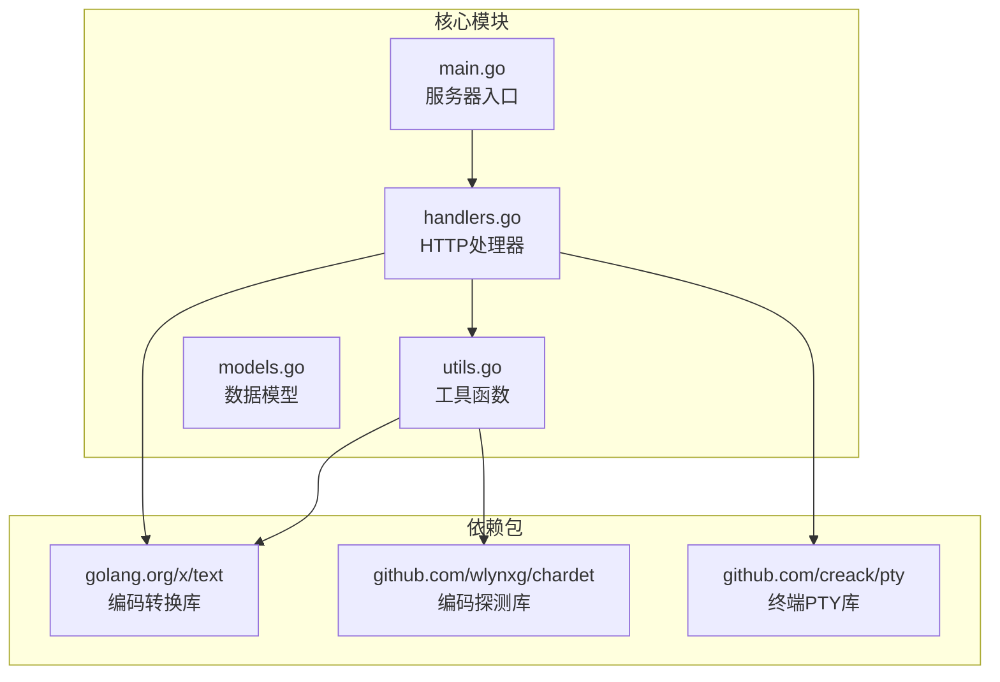
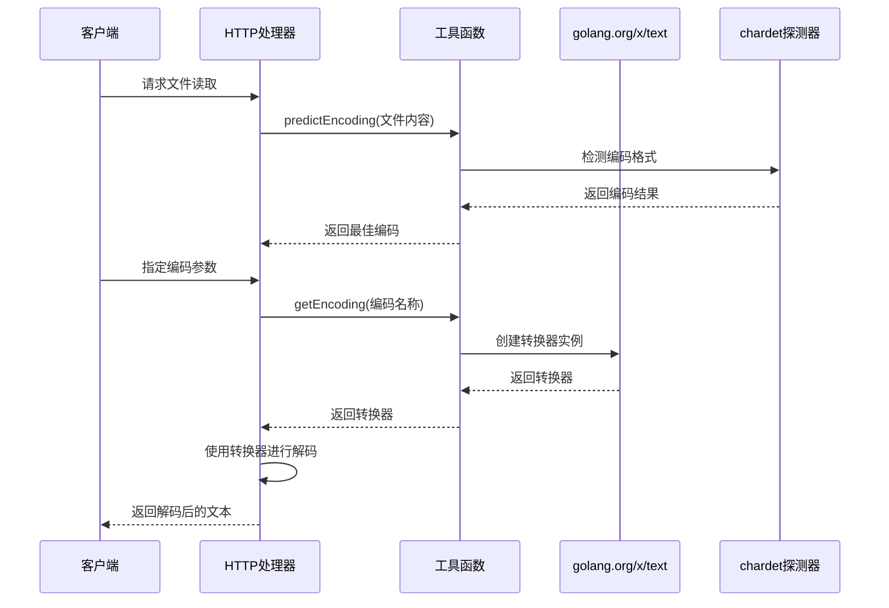
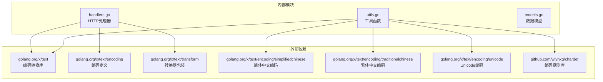

# 编码转换器

<cite>
**本文档引用的文件**
- [main.go](file://src/main.go)
- [utils.go](file://src/utils.go)
- [handlers.go](file://src/handlers.go)
- [models.go](file://src/models.go)
- [go.mod](file://src/go.mod)
- [README.md](file://README.md)
</cite>

## 目录
1. [简介](#简介)
2. [项目结构](#项目结构)
3. [核心组件](#核心组件)
4. [架构概览](#架构概览)
5. [详细组件分析](#详细组件分析)
6. [依赖关系分析](#依赖关系分析)
7. [性能考虑](#性能考虑)
8. [故障排除指南](#故障排除指南)
9. [结论](#结论)

## 简介

编码转换器是文本编辑器后端服务的核心功能模块，负责处理多种字符编码格式之间的转换。该系统基于 Go 语言的 `golang.org/x/text` 包构建，支持中文简体（GBK、GB18030）、中文繁体（Big5）以及 Unicode 变体（UTF-16LE、UTF-16BE）的编码转换。

该编码转换器不仅提供了基础的编码转换功能，还集成了智能编码探测机制，能够自动识别文件的原始编码格式，并提供相应的转换器实例。系统通过统一的接口设计，为上层的文件读取和保存操作提供透明的编码转换支持。

## 项目结构

编码转换器功能主要分布在以下文件中：



**图表来源**
- [main.go:1-145](file://src/main.go#L1-L145)
- [handlers.go:1-614](file://src/handlers.go#L1-L614)
- [utils.go:1-262](file://src/utils.go#L1-L262)

**章节来源**
- [main.go:1-145](file://src/main.go#L1-L145)
- [README.md:1-39](file://README.md#L1-L39)

## 核心组件

编码转换器系统包含三个核心组件：

### 1. 编码转换器获取器 (`getEncoding`)
这是系统的核心功能，负责根据编码名称返回相应的转换器实例。该函数支持以下编码格式：
- **GBK**: 简体中文编码，兼容 GB2312
- **GB18030**: 简体中文国家标准编码，支持更广泛的字符集
- **Big5**: 繁体中文编码，主要用于台湾、香港地区
- **UTF-16LE**: 小端序 UTF-16 编码
- **UTF-16BE**: 大端序 UTF-16 编码

### 2. 智能编码探测器 (`predictEncoding`)
该组件使用 chardet 库进行自动编码识别，支持 UTF-8、GB2312、GB18030、UTF-16LE、UTF-16BE、BIG5 等常见编码格式的检测。

### 3. 编码转换器工厂
系统通过 `golang.org/x/text` 包提供的转换器工厂方法创建具体的转换器实例，包括解码器和编码器。

**章节来源**
- [utils.go:149-165](file://src/utils.go#L149-L165)
- [utils.go:108-147](file://src/utils.go#L108-L147)

## 架构概览

编码转换器在整个系统中的位置和交互关系如下：



**图表来源**
- [handlers.go:114-212](file://src/handlers.go#L114-L212)
- [utils.go:108-165](file://src/utils.go#L108-L165)

## 详细组件分析

### getEncoding 函数实现

`getEncoding` 函数是编码转换器的核心实现，采用简单的字符串匹配机制来返回相应的转换器实例。

#### 函数签名和参数
- **函数名**: `getEncoding`
- **参数**: `name string` - 编码名称
- **返回值**: `encoding.Encoding` - 编码转换器实例或 nil

#### 支持的编码格式

```mermaid
flowchart TD
A[输入编码名称] --> B{编码类型判断}
B --> |gbk| C[返回 simplifiedchinese.GBK]
B --> |gb18030| D[返回 simplifiedchinese.GB18030]
B --> |big5| E[返回 traditionalchinese.Big5]
B --> |utf-16le| F[返回 unicode.UTF16(LittleEndian, IgnoreBOM)]
B --> |utf-16be| G[返回 unicode.UTF16(BigEndian, IgnoreBOM)]
B --> |其他| H[返回 nil]
C --> I[编码转换器实例]
D --> I
E --> I
F --> I
G --> I
H --> J[无转换器]
```

**图表来源**
- [utils.go:149-165](file://src/utils.go#L149-L165)

#### 编码转换器配置详解

每个编码转换器都有特定的配置参数：

1. **GBK 转换器**
   - 来源: `simplifiedchinese.GBK`
   - 用途: 简体中文编码转换
   - 兼容性: 完全兼容 GB2312

2. **GB18030 转换器**
   - 来源: `simplifiedchinese.GB18030`
   - 用途: 简体中文国家标准编码
   - 特点: 支持更广泛的字符集，包括生僻汉字

3. **Big5 转换器**
   - 来源: `traditionalchinese.Big5`
   - 用途: 繁体中文编码转换
   - 地域: 主要用于台湾、香港地区

4. **UTF-16LE 转换器**
   - 来源: `unicode.UTF16(LittleEndian, IgnoreBOM)`
   - 用途: 小端序 UTF-16 编码
   - 参数: `IgnoreBOM` 忽略字节顺序标记

5. **UTF-16BE 转换器**
   - 来源: `unicode.UTF16(BigEndian, IgnoreBOM)`
   - 用途: 大端序 UTF-16 编码
   - 参数: `IgnoreBOM` 忽略字节顺序标记

#### 默认行为和返回机制

当输入的编码名称不在支持列表中时，`getEncoding` 函数返回 `nil`。这种设计有以下意义：

- **明确的错误指示**: 调用者可以检查返回值来确定转换器是否可用
- **优雅降级**: 当遇到未知编码时，系统可以选择不进行转换
- **内存安全**: 避免创建无效的转换器实例

**章节来源**
- [utils.go:149-165](file://src/utils.go#L149-L165)

### predictEncoding 函数实现

`predictEncoding` 函数实现了智能编码探测功能，通过 chardet 库进行自动编码识别。

#### 探测流程

```mermaid
flowchart TD
A[开始探测] --> B{检查输入长度}
B --> |长度为0| C[返回 "utf-8"]
B --> |长度>0| D{检查UTF-8有效性}
D --> |有效| E[返回 "utf-8"]
D --> |无效| F[使用chardet探测]
F --> G[遍历探测结果]
G --> H{检查是否为目标编码}
H --> |是| I{置信度比较}
I --> |更高| J[更新最佳编码]
I --> |更低| K[保持现有编码]
H --> |否| G
J --> L{置信度>0.5?}
K --> L
L --> |是| M[返回最佳编码]
L --> |否| N[返回 "utf-8"]
```

**图表来源**
- [utils.go:108-147](file://src/utils.go#L108-L147)

#### 编码映射规则

系统维护了一个编码映射表，将 chardet 的探测结果转换为内部使用的标准编码名称：

| chardet 结果 | 内部编码名称 | 说明 |
|-------------|-------------|------|
| UTF-8 | utf-8 | 标准 UTF-8 编码 |
| GB2312 | gb18030 | 自动映射到 GB18030 |
| GB18030 | gb18030 | GB18030 编码 |
| UTF-16LE | utf-16le | 小端序 UTF-16 |
| UTF-16BE | utf-16be | 大端序 UTF-16 |
| BIG5 | big5 | 繁体中文编码 |

#### 置信度阈值

系统使用 0.5 作为置信度阈值，只有当探测置信度大于 0.5 时才接受该编码结果。这确保了编码识别的准确性。

**章节来源**
- [utils.go:108-147](file://src/utils.go#L108-L147)

### 编码转换器初始化过程

编码转换器的初始化过程涉及多个步骤：

1. **文件读取**: 从磁盘读取文件的前 1024 字节作为样本
2. **编码探测**: 使用 `predictEncoding` 函数分析样本内容
3. **转换器创建**: 调用 `getEncoding` 函数获取相应的转换器实例
4. **转换器包装**: 使用 `transform.NewReader` 或 `transform.NewWriter` 包装原始读写器
5. **数据转换**: 通过转换器进行实际的编码转换

**章节来源**
- [handlers.go:114-212](file://src/handlers.go#L114-L212)

## 依赖关系分析

编码转换器系统的依赖关系如下：



**图表来源**
- [go.mod:1-12](file://src/go.mod#L1-L12)
- [utils.go:3-23](file://src/utils.go#L3-L23)

### 关键依赖说明

1. **golang.org/x/text**: 提供核心的编码转换功能
2. **github.com/wlynxg/chardet**: 提供智能编码探测能力
3. **github.com/creack/pty**: 用于终端功能（与编码转换相关）

**章节来源**
- [go.mod:1-12](file://src/go.mod#L1-L12)

## 性能考虑

编码转换器在设计时充分考虑了性能优化：

### 1. 编码探测优化
- **样本大小**: 只读取文件前 1024 字节进行编码探测，平衡准确性和性能
- **早期退出**: 对于纯 UTF-8 文本，无需进一步探测
- **缓存策略**: 对于相同编码的多次转换，可复用转换器实例

### 2. 内存管理
- **流式处理**: 使用 `io.Reader` 和 `io.Writer` 进行流式转换，避免一次性加载整个文件
- **转换器复用**: 合理复用转换器实例，减少内存分配

### 3. 错误处理优化
- **快速失败**: 对于二进制文件立即拒绝，避免不必要的转换尝试
- **边界检查**: 对文件大小进行限制，防止大文件占用过多资源

### 4. 并发安全性
- **无状态设计**: 编码转换器函数是纯函数，天然支持并发调用
- **线程安全**: 使用的标准库转换器都是线程安全的

## 故障排除指南

### 常见问题及解决方案

#### 1. 编码转换失败
**症状**: 文件读取后出现乱码或转换错误
**原因分析**:
- 编码名称不正确
- 文件实际编码与预期不符
- 转换器实例创建失败

**解决方法**:
- 检查编码参数是否在支持列表中
- 使用 `predictEncoding` 函数自动探测编码
- 验证文件的实际编码格式

#### 2. 性能问题
**症状**: 大文件转换耗时过长
**原因分析**:
- 文件过大超出处理限制
- 转换器实例频繁创建销毁

**解决方法**:
- 实施文件大小限制（当前为 10MB）
- 复用转换器实例
- 考虑异步处理大文件

#### 3. 内存泄漏
**症状**: 长时间运行后内存占用持续增长
**原因分析**:
- 转换器资源未正确释放
- 文件句柄未及时关闭

**解决方法**:
- 确保所有文件句柄在使用后正确关闭
- 使用 defer 语句确保资源清理
- 监控转换器实例的生命周期

### 调试技巧

1. **启用日志记录**: 在关键转换步骤添加日志输出
2. **验证输入参数**: 确保编码名称格式正确
3. **检查文件完整性**: 验证文件是否被意外修改
4. **监控系统资源**: 定期检查内存和 CPU 使用情况

**章节来源**
- [handlers.go:114-212](file://src/handlers.go#L114-L212)

## 结论

编码转换器功能通过精心设计的架构和实现，为文本编辑器提供了强大而灵活的多编码支持。系统的主要优势包括：

### 技术优势
- **全面的编码支持**: 支持中文简体、繁体和 Unicode 变体编码
- **智能编码探测**: 自动识别文件的真实编码格式
- **高性能设计**: 采用流式处理和优化的算法
- **健壮的错误处理**: 完善的边界检查和异常处理机制

### 架构特点
- **模块化设计**: 清晰的功能分离和职责划分
- **可扩展性**: 易于添加新的编码格式支持
- **线程安全**: 支持高并发场景下的稳定运行
- **资源友好**: 合理的内存管理和资源清理

### 应用价值
该编码转换器不仅满足了文本编辑器的基本需求，还为后续的功能扩展奠定了坚实的基础。通过标准化的接口设计和完善的错误处理机制，系统能够在各种复杂的使用场景下保持稳定可靠的性能表现。

未来可以在以下方面继续改进：
- 添加更多的编码格式支持
- 优化编码探测的准确性
- 实现更精细的性能监控和调优
- 增强对特殊字符和二进制文件的处理能力