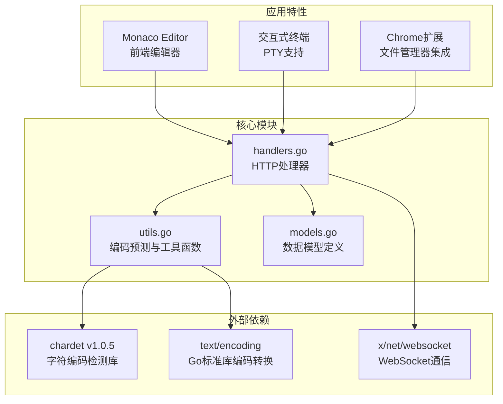
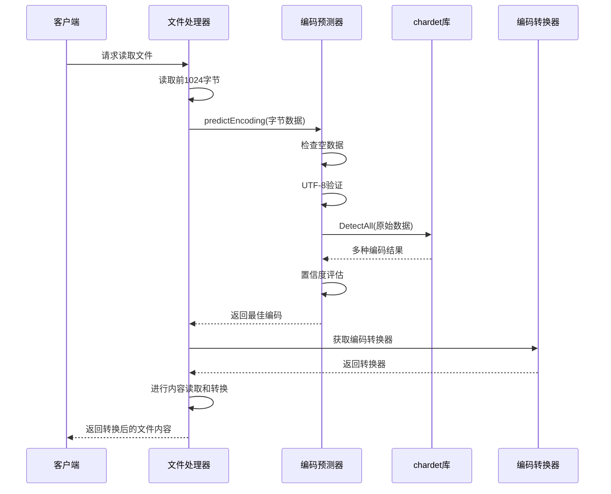
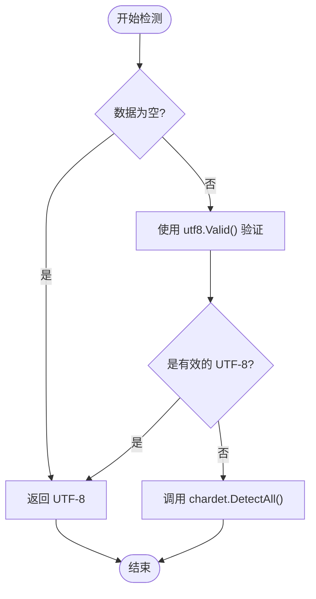
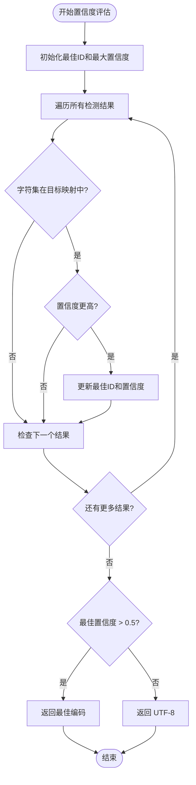
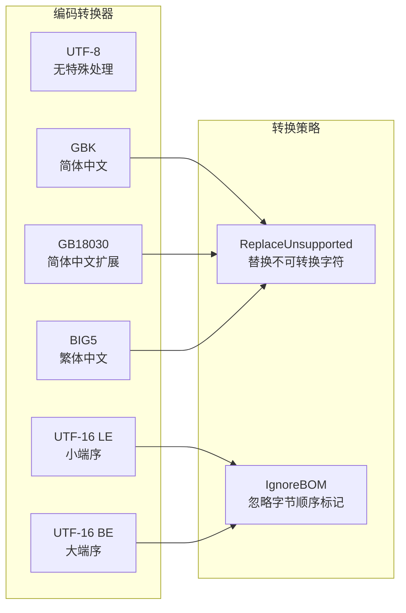
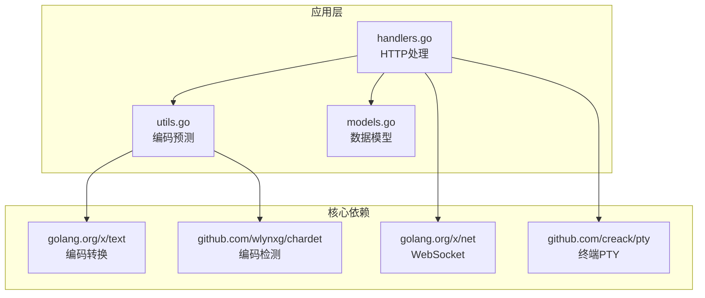
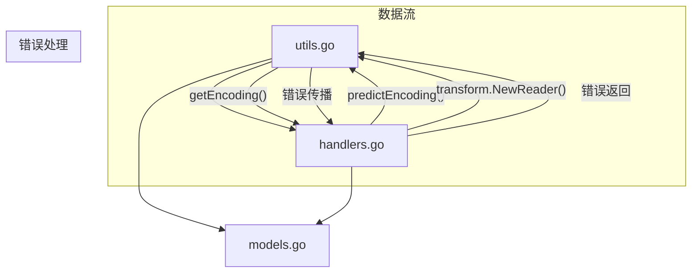
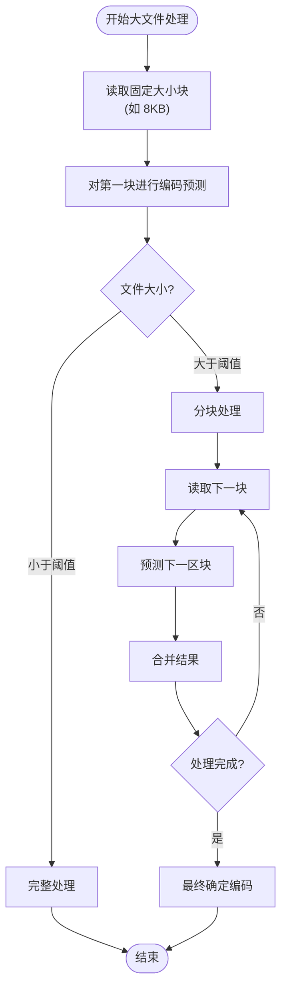

# 编码预测算法

<cite>
**本文档引用的文件**
- [utils.go](file://src/utils.go)
- [handlers.go](file://src/handlers.go)
- [models.go](file://src/models.go)
- [go.mod](file://src/go.mod)
- [README.md](file://README.md)
</cite>

## 目录
1. [简介](#简介)
2. [项目结构](#项目结构)
3. [核心组件](#核心组件)
4. [架构概览](#架构概览)
5. [详细组件分析](#详细组件分析)
6. [依赖关系分析](#依赖关系分析)
7. [性能考虑](#性能考虑)
8. [故障排除指南](#故障排除指南)
9. [结论](#结论)

## 简介

本文档深入分析了 m-text-editor-server 项目中的编码预测算法，重点解释 `predictEncoding` 函数的实现原理。该算法采用多层检测策略，结合 UTF-8 验证、chardet 库的多编码格式检测机制、置信度评估算法和编码映射策略，为文本编辑器提供准确的字符编码识别能力。

该系统支持多种主流编码格式，包括 UTF-8、GB18030、UTF-16LE、UTF-16BE 和 BIG5，并通过合理的阈值设置和回退策略确保在各种场景下的可靠性。

## 项目结构

该项目采用 Go 语言构建的后端服务，主要包含以下关键模块：



**图表来源**
- [utils.go:1-262](file://src/utils.go#L1-L262)
- [handlers.go:1-614](file://src/handlers.go#L1-L614)
- [go.mod:1-12](file://src/go.mod#L1-L12)

**章节来源**
- [README.md:1-39](file://README.md#L1-L39)
- [go.mod:1-12](file://src/go.mod#L1-L12)

## 核心组件

### predictEncoding 函数

`predictEncoding` 是整个编码预测系统的核心函数，实现了三层检测策略：

1. **空数据处理**：对空字节数组直接返回 UTF-8
2. **UTF-8 快速验证**：使用 Go 标准库的 UTF-8 验证函数进行快速检测
3. **多编码检测**：调用 chardet 库进行综合编码分析

### 编码映射策略

系统维护了一个目标编码映射表，将 chardet 检测结果映射到内部使用的统一编码标识：

| chardet 结果 | 内部编码标识 |
|-------------|-------------|
| UTF-8       | utf-8       |
| GB2312      | gb18030     |
| GB18030     | gb18030     |
| UTF-16LE    | utf-16le    |
| UTF-16BE    | utf-16be    |
| BIG5        | big5        |

### 置信度评估

系统使用 0.5 作为置信度阈值，只有当检测到的编码置信度超过此阈值时才采用该编码，否则回退到 UTF-8。

**章节来源**
- [utils.go:108-147](file://src/utils.go#L108-L147)

## 架构概览

编码预测算法在整个系统中的位置和交互关系如下：



**图表来源**
- [handlers.go:114-212](file://src/handlers.go#L114-L212)
- [utils.go:108-147](file://src/utils.go#L108-L147)

## 详细组件分析

### UTF-8 验证机制

UTF-8 验证是编码检测的第一道防线，具有以下特点：



**图表来源**
- [utils.go:109-116](file://src/utils.go#L109-L116)

### chardet 库集成

chardet 库提供了强大的多编码检测能力，支持 100 多种字符集。在本系统中，我们重点关注以下几种编码：

#### 支持的编码格式识别规则

| 编码类型 | 识别特征 | 判断逻辑 |
|---------|---------|---------|
| **UTF-8** | Unicode 标量值序列，无 BOM | 直接返回 utf-8 |
| **GB18030** | 中文简体字符，包含 GB2312 扩展 | 映射到 gb18030 |
| **UTF-16LE** | 小端序 UTF-16 编码 | 返回 utf-16le |
| **UTF-16BE** | 大端序 UTF-16 编码 | 返回 utf-16be |
| **BIG5** | 中文繁体字符 | 返回 big5 |

#### 置信度评估算法



**图表来源**
- [utils.go:118-146](file://src/utils.go#L118-L146)

### 编码映射策略

系统采用统一的内部编码标识，确保跨平台兼容性：

```mermaid
classDiagram
class EncodingMapper {
+map[string]string targetMap
+predictEncoding(raw []byte) string
+mapToInternal(charset string) string
}
class TargetMapping {
"UTF-8" : "utf-8"
"GB2312" : "gb18030"
"GB18030" : "gb18030"
"UTF-16LE" : "utf-16le"
"UTF-16BE" : "utf-16be"
"BIG5" : "big5"
}
class EncodingConverter {
+getEncoding(name string) encoding.Encoding
+convertToUTF8(data []byte, enc string) []byte
}
EncodingMapper --> TargetMapping : 使用
EncodingMapper --> EncodingConverter : 调用
```

**图表来源**
- [utils.go:120-127](file://src/utils.go#L120-L127)
- [utils.go:149-165](file://src/utils.go#L149-L165)

### 置信度阈值设置分析

置信度阈值设置为 0.5 具有以下合理性：

#### 阈值选择依据

1. **准确性平衡**：0.5 阈值能够在准确性和鲁棒性之间取得良好平衡
2. **误检控制**：避免对低置信度结果的误判
3. **回退安全**：当检测不确定时，安全地回退到 UTF-8

#### 阈值调整建议

| 场景 | 建议阈值 | 说明 |
|------|---------|------|
| 高质量文本 | 0.7-0.8 | 对于明显格式的文本 |
| 混合内容 | 0.4-0.5 | 包含多种编码的内容 |
| 二进制文件 | 0.3-0.4 | 需要更严格的二进制检测 |

### 编码转换器实现

系统提供了针对不同编码格式的转换器：



**图表来源**
- [utils.go:149-165](file://src/utils.go#L149-L165)

**章节来源**
- [utils.go:108-165](file://src/utils.go#L108-L165)

## 依赖关系分析

### 外部依赖

系统依赖以下关键库：



**图表来源**
- [go.mod:5-11](file://src/go.mod#L5-L11)
- [utils.go:3-23](file://src/utils.go#L3-L23)

### 内部模块耦合

编码预测算法与其他模块的耦合关系：



**图表来源**
- [handlers.go:165](file://src/handlers.go#L165)
- [utils.go:150-165](file://src/utils.go#L150-L165)

**章节来源**
- [go.mod:1-12](file://src/go.mod#L1-12)

## 性能考虑

### 大数据量处理最佳实践

对于大文件的编码检测，建议采用以下策略：

#### 分块检测方法



#### 性能优化建议

1. **内存管理**：限制最大文件大小（当前实现为 10MB）
2. **缓存策略**：对频繁访问的文件进行编码缓存
3. **并发处理**：对独立文件的检测可以并行处理
4. **预分配**：为转换后的数据预分配内存空间

#### 时间复杂度分析

- **UTF-8 验证**：O(n)，其中 n 为字节数
- **chardet 检测**：O(n × k)，其中 k 为支持的编码数量
- **整体复杂度**：O(n × k)

**章节来源**
- [handlers.go:146-151](file://src/handlers.go#L146-L151)
- [handlers.go:161-165](file://src/handlers.go#L161-L165)

## 故障排除指南

### 常见问题及解决方案

#### 编码检测失败

**症状**：返回 UTF-8 或检测到二进制内容

**可能原因**：
1. 文件内容为空
2. chardet 无法确定编码
3. 检测到二进制内容

**解决方法**：
1. 检查文件是否为空
2. 验证文件内容的完整性
3. 确认文件不是二进制格式

#### 置信度过低

**症状**：检测结果置信度低于 0.5

**解决方法**：
1. 增加检测的数据量
2. 检查数据是否包含多种编码
3. 手动指定编码格式

#### 编码转换错误

**症状**：转换过程中出现错误

**解决方法**：
1. 检查编码映射表
2. 验证转换器配置
3. 确认输入数据的有效性

### 调试技巧

1. **启用日志记录**：在关键节点添加详细的日志输出
2. **数据采样**：对可疑文件进行数据采样分析
3. **边界测试**：测试极端情况下的行为表现

**章节来源**
- [handlers.go:168-176](file://src/handlers.go#L168-L176)
- [handlers.go:192-196](file://src/handlers.go#L192-L196)

## 结论

编码预测算法通过多层检测策略和合理的阈值设置，为文本编辑器提供了可靠的字符编码识别能力。该系统的主要优势包括：

1. **多层次检测**：从简单到复杂的检测流程，确保准确性
2. **合理的阈值设置**：0.5 的置信度阈值在准确性和鲁棒性之间取得平衡
3. **统一的编码标识**：简化了后续的处理流程
4. **完善的错误处理**：提供了清晰的回退策略

对于未来的发展，建议考虑以下改进方向：

1. **动态阈值调整**：根据文件特征自动调整置信度阈值
2. **机器学习集成**：引入机器学习模型提高检测准确性
3. **缓存机制**：对常见文件类型的编码进行缓存
4. **性能监控**：添加性能指标监控和优化

该算法为文本编辑器提供了坚实的基础，能够满足大多数实际应用场景的需求。