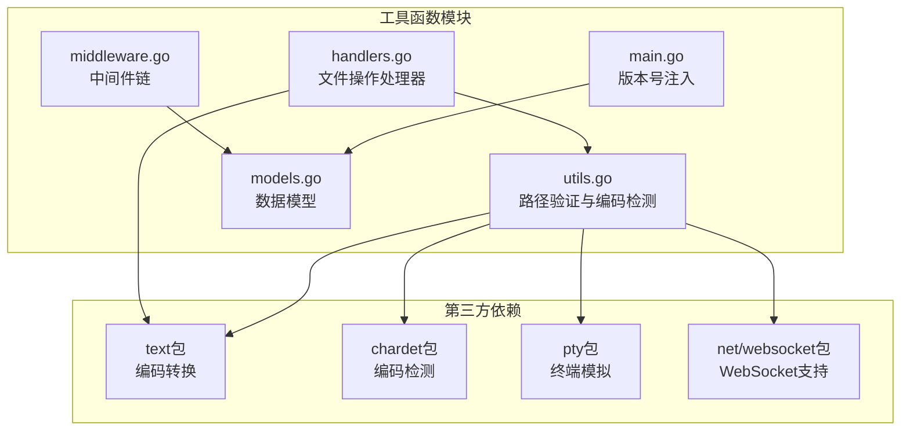
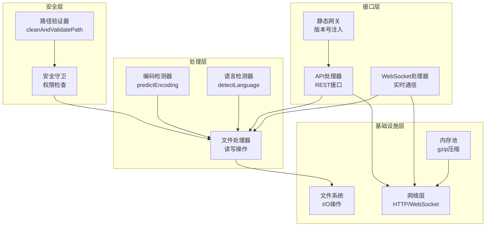
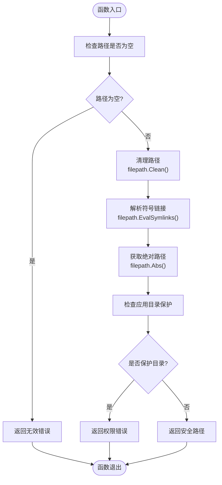
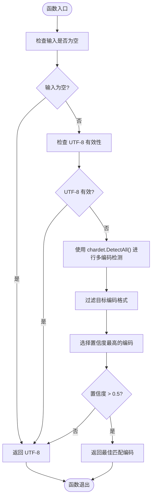
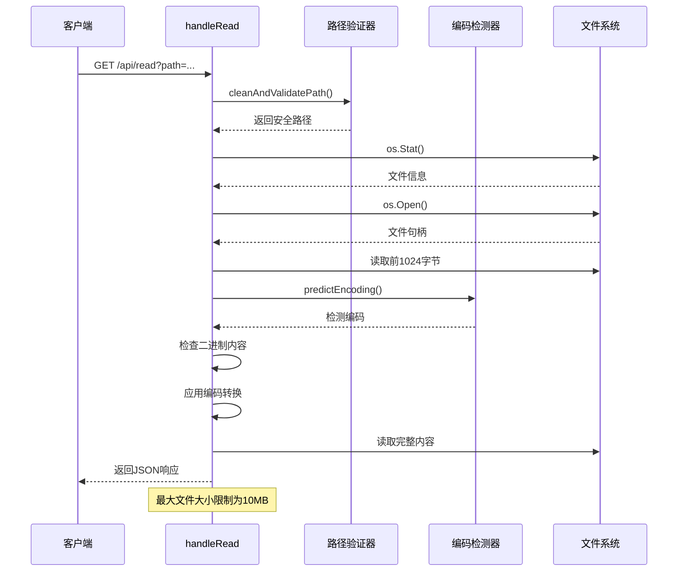
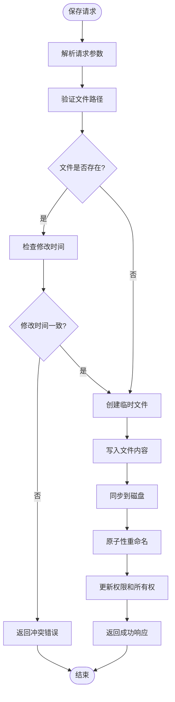
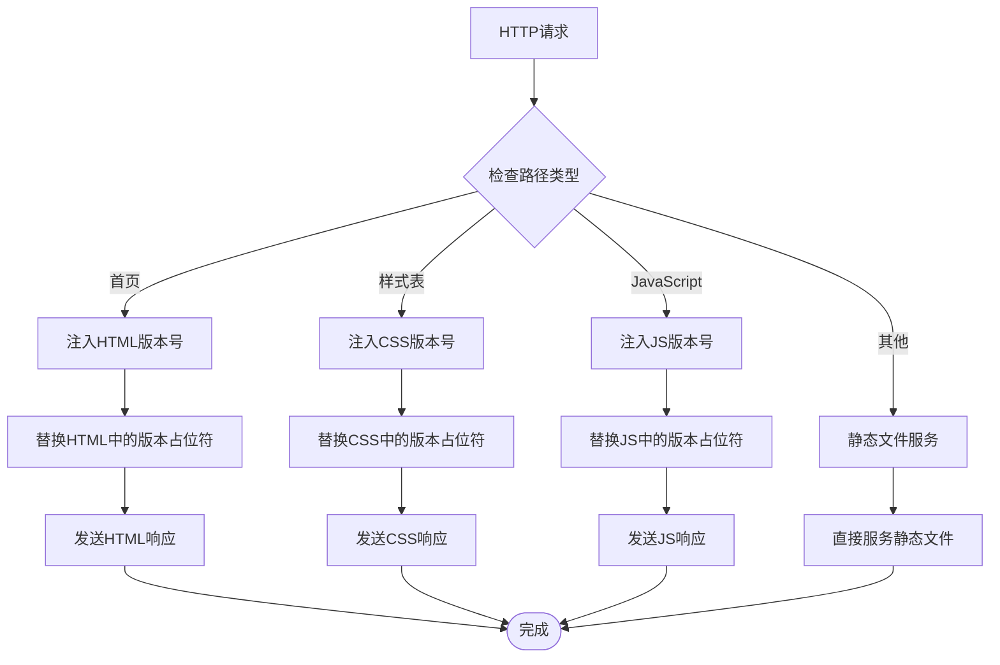
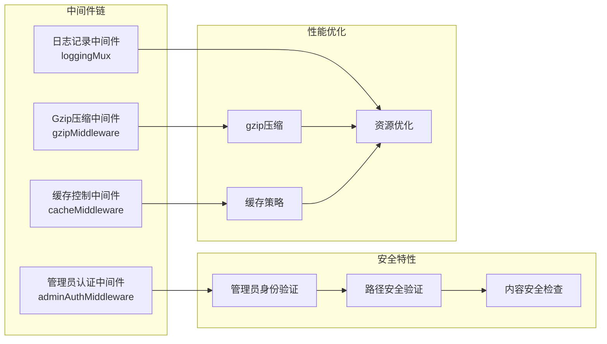
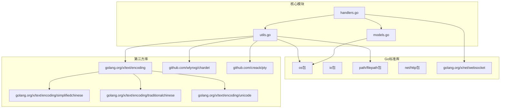

# 工具函数模块

<cite>
**本文档引用的文件**
- [utils.go](file://src/utils.go)
- [handlers.go](file://src/handlers.go)
- [main.go](file://src/main.go)
- [middleware.go](file://src/middleware.go)
- [models.go](file://src/models.go)
- [go.mod](file://src/go.mod)
</cite>

## 目录
1. [简介](#简介)
2. [项目结构](#项目结构)
3. [核心组件](#核心组件)
4. [架构概览](#架构概览)
5. [详细组件分析](#详细组件分析)
6. [依赖关系分析](#依赖关系分析)
7. [性能考虑](#性能考虑)
8. [故障排除指南](#故障排除指南)
9. [结论](#结论)

## 简介

工具函数模块是文本编辑器服务器的核心基础设施，负责提供安全的路径验证、字符编码检测、文件操作辅助以及字符串处理等关键功能。该模块采用Go语言实现，集成了多种第三方库来提供强大的文本处理能力，包括路径安全验证、多编码格式识别、文件读写权限控制等功能。

## 项目结构

工具函数模块主要分布在以下文件中：

**图表来源**
- [utils.go:1-262](file://src/utils.go#L1-L262)
- [handlers.go:1-614](file://src/handlers.go#L1-L614)
- [main.go:1-145](file://src/main.go#L1-L145)
- [middleware.go:1-103](file://src/middleware.go#L1-L103)

**章节来源**
- [utils.go:1-262](file://src/utils.go#L1-L262)
- [handlers.go:1-614](file://src/handlers.go#L1-L614)
- [main.go:1-145](file://src/main.go#L1-L145)
- [middleware.go:1-103](file://src/middleware.go#L1-L103)
- [models.go:1-30](file://src/models.go#L1-L30)

## 核心组件

工具函数模块包含以下核心组件：

### 1. 路径安全验证组件
- `cleanAndValidatePath`: 提供绝对路径的安全验证，防范目录遍历攻击
- 集成符号链接解析和应用目录保护机制

### 2. 字符编码检测组件
- `predictEncoding`: 多编码格式识别和自动转换
- `getEncoding`: 编码转换器获取和管理
- `detectLanguage`: 语言类型自动识别

### 3. 文件操作辅助组件
- 文件读取、写入和权限检查
- 原子性文件保存机制
- 目录遍历和文件监控

### 4. 字符串处理组件
- 版本号注入和内容替换
- 缓存控制和压缩处理

**章节来源**
- [utils.go:25-165](file://src/utils.go#L25-L165)
- [handlers.go:21-614](file://src/handlers.go#L21-L614)
- [main.go:40-109](file://src/main.go#L40-L109)

## 架构概览

工具函数模块采用分层架构设计，通过清晰的职责分离实现了高度的安全性和可维护性：

**图表来源**
- [utils.go:25-165](file://src/utils.go#L25-L165)
- [handlers.go:21-614](file://src/handlers.go#L21-L614)
- [main.go:40-109](file://src/main.go#L40-L109)
- [middleware.go:22-92](file://src/middleware.go#L22-L92)

## 详细组件分析

### 路径安全验证组件

#### cleanAndValidatePath 函数分析

路径安全验证是整个工具函数模块的核心安全机制，采用多层防护策略：

**图表来源**
- [utils.go:25-53](file://src/utils.go#L25-L53)

**实现特点**：
- **路径规范化**: 使用 `filepath.Clean()` 清理路径中的冗余部分
- **符号链接防护**: 通过 `filepath.EvalSymlinks()` 解析符号链接，防止目录遍历攻击
- **应用目录保护**: 检查 `TRIM_APPDEST` 环境变量，防止访问应用自身资源目录
- **错误处理**: 返回标准化的错误类型，便于上层处理

**章节来源**
- [utils.go:25-53](file://src/utils.go#L25-L53)
- [handlers.go:31-39](file://src/handlers.go#L31-L39)

### 字符编码检测组件

#### predictEncoding 函数分析

字符编码检测组件提供了智能的多编码格式识别能力：

**图表来源**
- [utils.go:108-147](file://src/utils.go#L108-L147)

**支持的编码格式**：
- UTF-8 (自动检测)
- GB2312/GB18030 (简体中文)
- UTF-16 LE/BE (Unicode)
- BIG5 (繁体中文)

**章节来源**
- [utils.go:108-165](file://src/utils.go#L108-L165)
- [handlers.go:164-196](file://src/handlers.go#L164-L196)

### 文件操作辅助组件

#### 文件读取流程分析

文件读取操作采用了严格的安全检查和编码转换机制：

**图表来源**
- [handlers.go:114-212](file://src/handlers.go#L114-L212)
- [utils.go:108-165](file://src/utils.go#L108-L165)

**实现特性**：
- **文件大小限制**: 10MB上限防止内存溢出
- **二进制内容检测**: 自动识别并拒绝二进制文件
- **编码自动转换**: 支持多种编码格式的自动识别和转换
- **语言类型识别**: 基于扩展名和Shebang的智能语言检测

**章节来源**
- [handlers.go:114-212](file://src/handlers.go#L114-L212)

#### 原子性文件保存机制

文件保存操作采用了原子性重命名技术，确保数据完整性：

**图表来源**
- [handlers.go:214-324](file://src/handlers.go#L214-L324)

**安全特性**：
- **临时文件机制**: 先写入临时文件，成功后再重命名
- **权限同步**: 保持文件原有的权限和所有权
- **修改时间检查**: 防止并发修改冲突
- **原子性操作**: 使用重命名确保操作的原子性

**章节来源**
- [handlers.go:214-324](file://src/handlers.go#L214-L324)

### 字符串处理工具组件

#### 版本号注入机制

静态资源网关实现了智能的版本号注入功能：

**图表来源**
- [main.go:40-109](file://src/main.go#L40-L109)

**实现细节**：
- **环境变量驱动**: 使用 `TRIM_APPVER` 环境变量获取版本号
- **智能替换**: 自动识别和替换HTML、CSS、JS中的版本占位符
- **Monaco编辑器兼容**: 特别处理Monaco编辑器核心资源的版本控制
- **缓存优化**: 为不同类型的资源设置合适的缓存策略

**章节来源**
- [main.go:40-109](file://src/main.go#L40-L109)

### 中间件链组件

#### 安全中间件分析

中间件链提供了多层次的安全防护和性能优化：

**图表来源**
- [middleware.go:22-92](file://src/middleware.go#L22-L92)

**实现特性**：
- **管理员认证**: 通过 `X-Trim-Isadmin` 头部验证管理员身份
- **Gzip压缩**: 使用sync.Pool复用压缩器，提高性能
- **缓存控制**: 为不同资源类型设置最优缓存策略
- **日志审计**: 记录所有HTTP请求用于审计

**章节来源**
- [middleware.go:22-103](file://src/middleware.go#L22-L103)

## 依赖关系分析

工具函数模块的依赖关系体现了清晰的分层架构：

**图表来源**
- [utils.go:3-23](file://src/utils.go#L3-L23)
- [handlers.go:3-19](file://src/handlers.go#L3-L19)
- [go.mod:1-12](file://src/go.mod#L1-L12)

**依赖特性**：
- **最小依赖原则**: 仅引入必要的第三方库
- **功能明确分工**: 每个库负责特定的功能领域
- **版本锁定**: 使用go.mod锁定依赖版本，确保构建一致性

**章节来源**
- [go.mod:1-12](file://src/go.mod#L1-L12)
- [utils.go:3-23](file://src/utils.go#L3-L23)

## 性能考虑

工具函数模块在设计时充分考虑了性能优化：

### 内存管理优化
- **Gzip压缩器池化**: 使用sync.Pool复用gzip.Writer实例
- **缓冲区复用**: 合理使用缓冲区减少内存分配
- **流式处理**: 对大文件采用流式读写避免内存峰值

### 网络性能优化
- **连接复用**: 通过Unix Socket提供低延迟通信
- **压缩传输**: 对静态资源启用gzip压缩
- **缓存策略**: 为不同类型资源设置最优缓存策略

### 文件系统优化
- **路径缓存**: 避免重复的路径解析操作
- **批量操作**: 合并相关的文件系统调用
- **异步处理**: 对耗时操作采用异步处理模式

## 故障排除指南

### 常见问题及解决方案

#### 路径验证错误
**问题**: `无效的路径` 或 `禁止访问系统受保护目录`
**原因**: 路径包含 `../` 或访问应用目录
**解决方案**: 
- 确保路径使用绝对路径
- 避免使用相对路径导航
- 检查 `TRIM_APPDEST` 环境变量设置

#### 编码检测失败
**问题**: 文件读取返回乱码
**原因**: 编码检测算法无法准确识别
**解决方案**:
- 显式指定文件编码参数
- 检查文件实际编码格式
- 验证chardet库的检测结果

#### 文件保存失败
**问题**: 原子性重命名操作失败
**原因**: 权限不足或文件被占用
**解决方案**:
- 检查目标文件权限
- 确认文件未被其他进程占用
- 验证磁盘空间充足

#### WebSocket连接问题
**问题**: 终端连接超时或断开
**原因**: 心跳检测失败或权限验证错误
**解决方案**:
- 确保客户端定期发送心跳消息
- 验证管理员身份验证头
- 检查终端会话超时设置

**章节来源**
- [handlers.go:31-39](file://src/handlers.go#L31-L39)
- [handlers.go:118-126](file://src/handlers.go#L118-L126)
- [handlers.go:232-242](file://src/handlers.go#L232-L242)

## 结论

工具函数模块通过精心设计的安全机制、高效的编码处理能力和完善的文件操作接口，为文本编辑器提供了可靠的技术支撑。模块的主要优势包括：

### 安全性保障
- 多层路径验证防止目录遍历攻击
- 符号链接解析确保路径安全性
- 应用目录保护机制防止内部资源泄露

### 功能完整性
- 智能字符编码检测支持多语言文本处理
- 原子性文件保存确保数据完整性
- 实时文件监控提供良好的用户体验

### 性能优化
- 合理的内存管理和资源复用
- 智能的缓存策略和压缩机制
- 流式处理提升大文件操作效率

该模块的设计遵循了现代Web应用的最佳实践，在保证功能完整性的同时，重点关注了安全性、性能和可维护性，为后续的功能扩展奠定了坚实的基础。