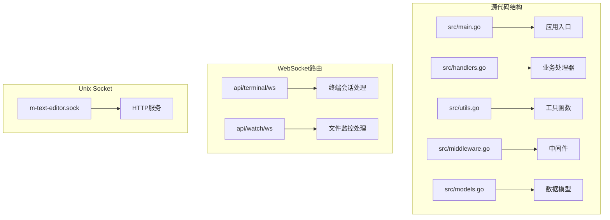
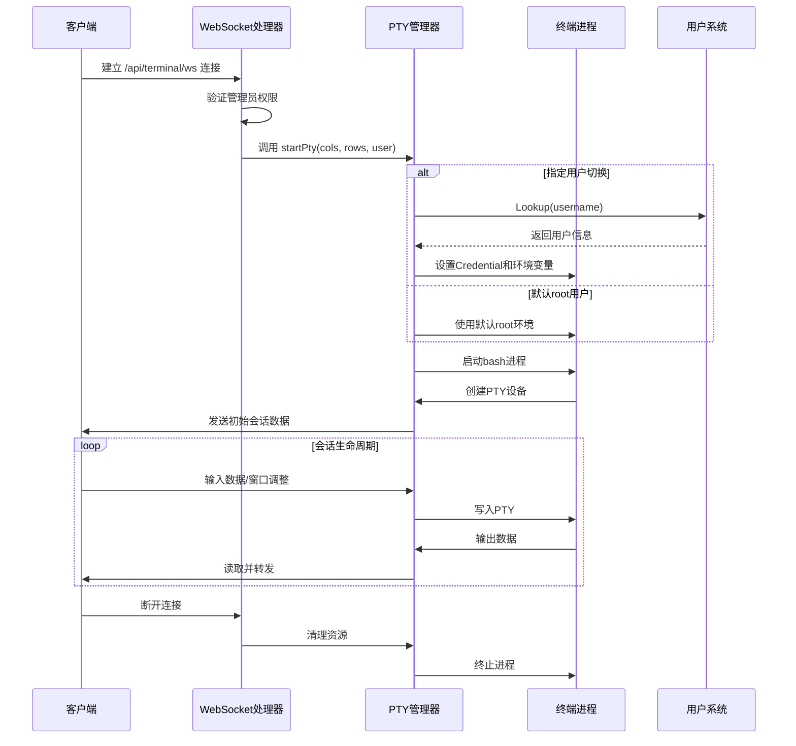
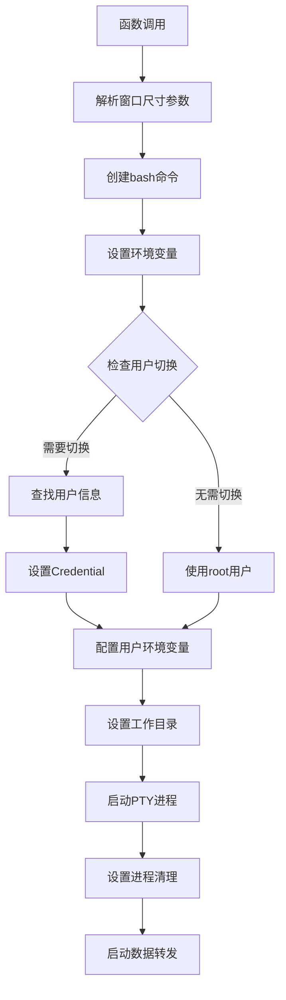
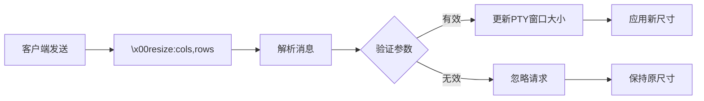
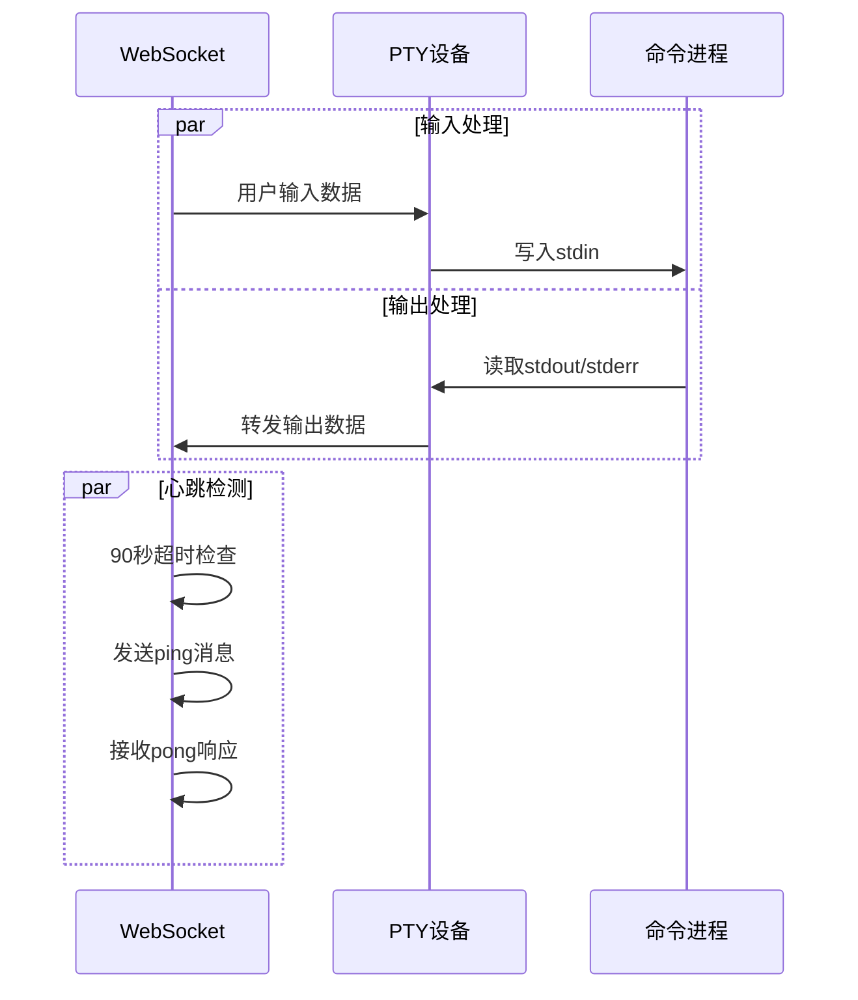
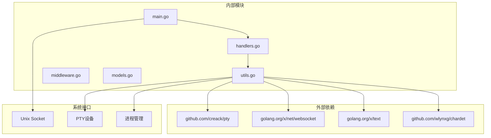

# 终端会话管理

<cite>
**本文档引用的文件**
- [main.go](file://src/main.go)
- [handlers.go](file://src/handlers.go)
- [utils.go](file://src/utils.go)
- [middleware.go](file://src/middleware.go)
- [models.go](file://src/models.go)
</cite>

## 目录
1. [简介](#简介)
2. [项目结构](#项目结构)
3. [核心组件](#核心组件)
4. [架构概览](#架构概览)
5. [详细组件分析](#详细组件分析)
6. [依赖关系分析](#依赖关系分析)
7. [性能考虑](#性能考虑)
8. [故障排除指南](#故障排除指南)
9. [结论](#结论)
10. [附录](#附录)

## 简介

本文档深入解析 m.text.editor 项目中的终端会话管理功能，重点阐述 `startPty` 函数的实现机制。该功能通过 WebSocket 提供安全的终端访问能力，支持 PTY 启动、用户切换、窗口大小调整和双向数据转发。

终端会话管理是现代 Web 编辑器的重要组成部分，它允许用户通过浏览器界面直接访问服务器终端，执行命令行操作。本文将从架构设计、实现细节、错误处理和最佳实践等多个维度进行全面分析。

## 项目结构

该项目采用 Go 语言构建，主要文件组织如下：



**图表来源**
- [main.go:118-119](file://src/main.go#L118-L119)
- [main.go:130-143](file://src/main.go#L130-L143)

**章节来源**
- [main.go:1-145](file://src/main.go#L1-145)
- [handlers.go:1-614](file://src/handlers.go#L1-L614)
- [utils.go:1-262](file://src/utils.go#L1-L262)
- [middleware.go:1-103](file://src/middleware.go#L1-L103)
- [models.go:1-30](file://src/models.go#L1-L30)

## 核心组件

### WebSocket 终端处理器

终端会话功能通过 WebSocket 实现，主要组件包括：

- **handleTerminalWS**: WebSocket 终端连接建立
- **startPty**: PTY 启动和数据转发核心逻辑
- **管理员鉴权中间件**: 确保只有授权用户可以访问终端

### PTY 管理系统

系统使用 `github.com/creack/pty` 库管理伪终端，提供以下功能：
- PTY 进程创建和管理
- 窗口大小动态调整
- 用户上下文切换
- 双向数据流控制

### 数据模型

定义了标准的 API 响应结构，支持统一的错误处理和状态反馈。

**章节来源**
- [handlers.go:496-516](file://src/handlers.go#L496-L516)
- [utils.go:167-261](file://src/utils.go#L167-L261)
- [models.go:3-29](file://src/models.go#L3-L29)

## 架构概览



**图表来源**
- [handlers.go:496-516](file://src/handlers.go#L496-L516)
- [utils.go:167-261](file://src/utils.go#L167-L261)

## 详细组件分析

### startPty 函数实现详解

`startPty` 是终端会话管理的核心函数，负责完整的 PTY 生命周期管理：

#### PTY 启动流程



**图表来源**
- [utils.go:167-261](file://src/utils.go#L167-L261)

#### 用户切换机制

系统支持基于用户名的用户上下文切换：

| 参数 | 类型 | 描述 | 默认值 |
|------|------|------|--------|
| user | string | 目标用户名 | "" |
| current | string | 当前登录用户 | "" |
| username | string | WebSocket头部传递的用户名 | "" |

用户切换过程包括：
1. 通过 `user.Lookup(username)` 获取用户信息
2. 设置 `syscall.Credential` 实现 UID/GID 切换
3. 配置 HOME、USER、LOGNAME 环境变量
4. 设置用户家目录为工作目录

#### 窗口大小调整处理

系统支持动态窗口大小调整，通过特殊消息格式实现：



**图表来源**
- [utils.go:241-250](file://src/utils.go#L241-L250)

#### 数据转发机制

系统实现双向数据流转发：



**图表来源**
- [utils.go:230-259](file://src/utils.go#L230-L259)

**章节来源**
- [utils.go:167-261](file://src/utils.go#L167-L261)

### WebSocket 终端处理器

`handleTerminalWS` 函数负责 WebSocket 连接的建立和初始化：

#### 权限验证流程

```mermaid
flowchart TD
A[建立WebSocket连接] --> B[检查TRIM_APPDEST环境变量]
B --> C{环境变量存在?}
C --> |是| D[验证X-Trim-Isadmin头]
C --> |否| E[跳过权限检查]
D --> F{isAdmin == "true"?}
F --> |是| G[允许连接]
F --> |否| H[拒绝访问]
E --> G
H --> I[返回错误消息]
G --> J[调用startPty]
```

**图表来源**
- [handlers.go:506-512](file://src/handlers.go#L506-L512)

#### 参数处理

| 查询参数 | 类型 | 必需 | 描述 |
|----------|------|------|------|
| cols | string | 否 | 终端列数，默认80 |
| rows | string | 否 | 终端行数，默认24 |
| user | string | 否 | 用户切换参数 |

**章节来源**
- [handlers.go:496-516](file://src/handlers.go#L496-L516)

### 中间件集成

系统集成了多层中间件来增强功能：

#### 管理员鉴权中间件

```mermaid
flowchart TD
A[HTTP请求] --> B[检查X-Trim-Isadmin头]
B --> C{TRIM_APPDEST环境变量}
C --> |存在| D{isAdmin == "true"?}
C --> |不存在| E[跳过验证]
D --> |否| F[返回403错误]
D --> |是| G[继续处理]
E --> G
F --> H[记录日志]
G --> I[调用下一个中间件]
```

**图表来源**
- [middleware.go:22-38](file://src/middleware.go#L22-L38)

#### Gzip压缩中间件

系统对静态资源进行透明压缩，但跳过 WebSocket 连接以保证实时性。

**章节来源**
- [middleware.go:22-103](file://src/middleware.go#L22-L103)

## 依赖关系分析



**图表来源**
- [main.go:11](file://src/main.go#L11)
- [utils.go:16-23](file://src/utils.go#L16-L23)

### 关键依赖说明

| 依赖包 | 版本 | 用途 |
|--------|------|------|
| github.com/creack/pty | v1.x | PTY设备管理 |
| golang.org/x/net/websocket | latest | WebSocket协议支持 |
| golang.org/x/text | latest | 文本编码处理 |
| github.com/wlynxg/chardet | v1.x | 字符编码检测 |

**章节来源**
- [main.go:3-12](file://src/main.go#L3-L12)
- [utils.go:3-23](file://src/utils.go#L3-L23)

## 性能考虑

### 资源管理优化

1. **连接超时机制**: 90秒无活动自动断开，防止资源泄漏
2. **内存池复用**: Gzip压缩器使用 sync.Pool 复用
3. **异步数据处理**: 使用 goroutine 处理双向数据流
4. **及时清理**: 确保进程和文件描述符正确关闭

### 性能监控建议

- 监控 PTY 进程数量和内存使用
- 跟踪 WebSocket 连接数和活跃度
- 分析数据转发延迟和吞吐量
- 监控磁盘IO和CPU使用率

## 故障排除指南

### 常见问题及解决方案

#### PTY 启动失败

**症状**: 终端连接立即断开，显示启动错误

**可能原因**:
- bash可执行文件不存在
- 权限不足
- PTY设备创建失败

**解决方法**:
1. 验证 `/bin/bash` 可执行权限
2. 检查系统资源限制
3. 确认 PTY 设备可用性

#### 用户切换失败

**症状**: 用户切换请求被忽略

**可能原因**:
- 用户名不存在
- 权限不足
- 系统用户数据库不可用

**解决方法**:
1. 验证用户名有效性
2. 检查系统用户配置
3. 确认用户Lookup权限

#### 窗口调整无效

**症状**: 调整终端大小后无变化

**可能原因**:
- 消息格式错误
- 参数解析失败
- PTY设置调用失败

**解决方法**:
1. 确认消息格式为 `\x00resize:cols,rows`
2. 验证参数为正整数
3. 检查 PTY 设备状态

**章节来源**
- [utils.go:217-221](file://src/utils.go#L217-L221)
- [utils.go:203-206](file://src/utils.go#L203-L206)
- [utils.go:246-250](file://src/utils.go#L246-L250)

## 结论

终端会话管理功能通过精心设计的架构实现了安全、高效的远程终端访问。`startPty` 函数作为核心组件，提供了完整的 PTY 生命周期管理，包括用户切换、窗口调整和双向数据转发。

系统的主要优势包括：
- **安全性**: 严格的管理员权限验证
- **可靠性**: 完善的错误处理和资源清理
- **性能**: 异步处理和内存优化
- **可维护性**: 清晰的代码结构和模块化设计

通过遵循本文档的最佳实践，开发者可以有效地扩展和维护终端会话功能，为用户提供稳定可靠的远程终端体验。

## 附录

### 配置选项参考

| 环境变量 | 类型 | 必需 | 描述 |
|----------|------|------|------|
| TRIM_APPDEST | string | 是 | 应用安装目录路径 |
| TRIM_APPVER | string | 是 | 应用版本号 |
| TRIM_PKGVAR | string | 是 | 配置文件存储目录 |

### API 使用示例

#### 基本终端连接
```
ws://localhost/app/m-text-editor/api/terminal/ws?cols=80&rows=24
```

#### 指定用户连接
```
ws://localhost/app/m-text-editor/api/terminal/ws?cols=120&rows=40&user=current
```

#### 心跳检测
客户端应定期发送 `\x00ping` 消息，服务器响应 `\x00pong`。

#### 窗口调整
客户端发送 `\x00resize:{{cols}},{{rows}}` 格式的消息进行窗口调整。

### 最佳实践

1. **安全优先**: 始终启用管理员权限验证
2. **资源管理**: 确保及时清理 PTY 进程和文件描述符
3. **错误处理**: 实现完善的异常捕获和恢复机制
4. **性能监控**: 建立连接数、延迟和资源使用的监控体系
5. **日志记录**: 详细记录关键操作和错误信息便于调试