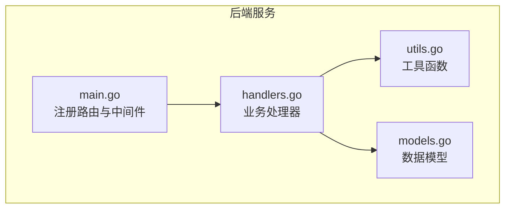
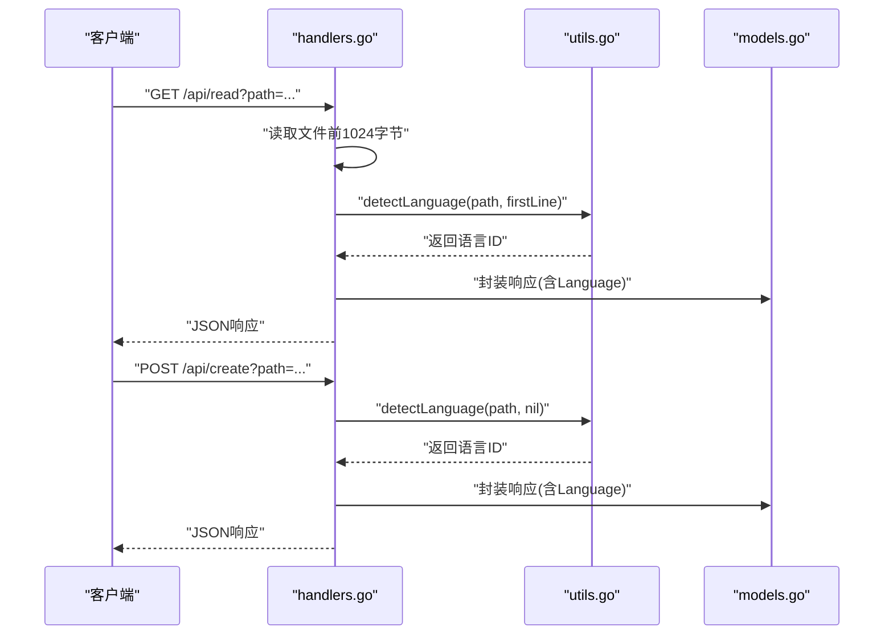
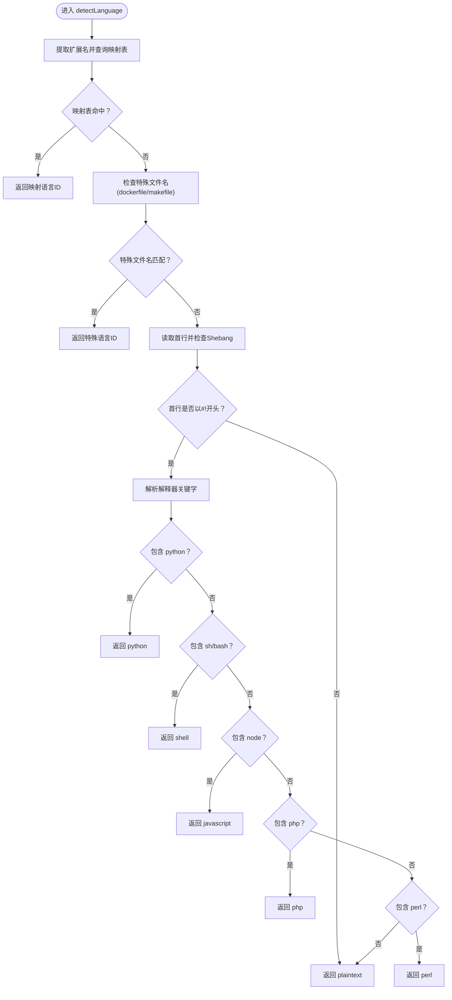
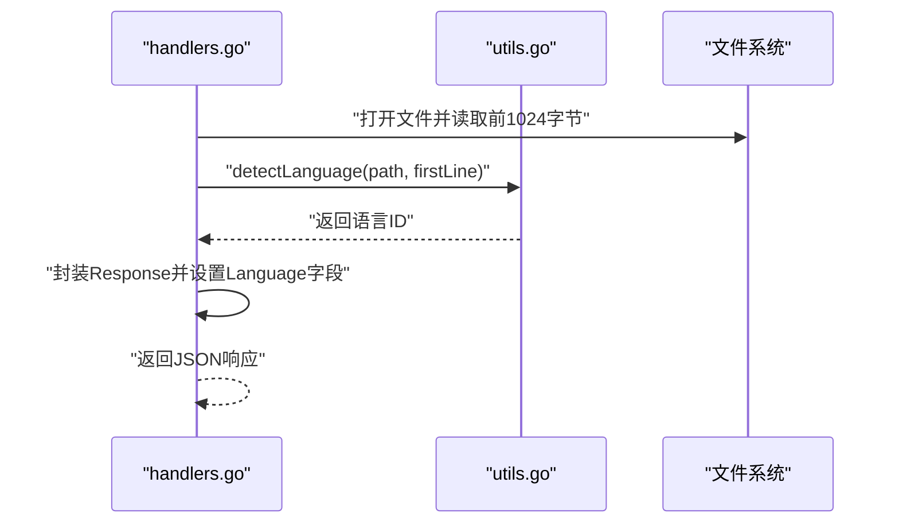
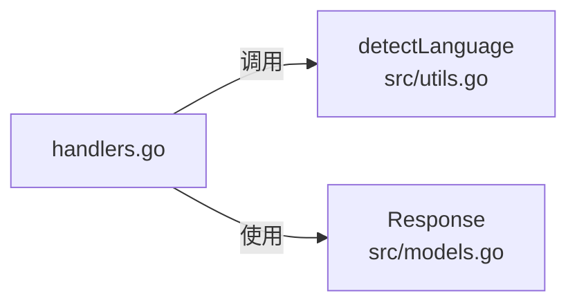

# 语言识别功能

<cite>
**本文档引用的文件**
- [src/utils.go](file://src/utils.go)
- [src/handlers.go](file://src/handlers.go)
- [src/models.go](file://src/models.go)
- [src/main.go](file://src/main.go)
- [test/scratch/files/app.js](file://test/scratch/files/app.js)
- [test/scratch/files/demo.html](file://test/scratch/files/demo.html)
- [test/scratch/files/marked_test.md](file://test/scratch/files/marked_test.md)
- [test/scratch/files/script.py](file://test/scratch/files/script.py)
- [test/scratch/files/style.css](file://test/scratch/files/style.css)
- [test/scratch/files/test/main.go](file://test/scratch/files/test/main.go)
- [test/scratch/files/test/package.json](file://test/scratch/files/test/package.json)
</cite>

## 目录
1. [简介](#简介)
2. [项目结构](#项目结构)
3. [核心组件](#核心组件)
4. [架构总览](#架构总览)
5. [详细组件分析](#详细组件分析)
6. [依赖分析](#依赖分析)
7. [性能考虑](#性能考虑)
8. [故障排除指南](#故障排除指南)
9. [结论](#结论)
10. [附录](#附录)

## 简介
本文件聚焦于语言识别功能，系统性阐述 detectLanguage 函数的实现机制，包括：
- 文件扩展名映射表的设计与覆盖范围
- Shebang 行解析策略与优先级
- 语言自动识别算法的决策流程
- 支持的语言类型与扩展名映射关系
- 使用示例与自定义扩展名映射方法
- 识别准确性优化建议与边界情况处理

该能力贯穿文件读取与新建流程，在返回响应中通过 Language 字段向前端提供 Monaco 编辑器所需的语法高亮语言标识。

## 项目结构
语言识别功能位于后端服务中，主要涉及以下模块：
- 工具函数模块：提供 detectLanguage、predictEncoding、getEncoding 等工具
- 处理器模块：在文件读取与新建接口中调用语言识别
- 数据模型模块：定义统一响应结构，包含 Language 字段
- 主程序模块：注册路由与中间件，承载业务 API

**图表来源**
- [src/main.go:15-145](file://src/main.go#L15-L145)
- [src/handlers.go:114-212](file://src/handlers.go#L114-L212)
- [src/utils.go:55-147](file://src/utils.go#L55-L147)
- [src/models.go:3-12](file://src/models.go#L3-L12)

**章节来源**
- [src/main.go:15-145](file://src/main.go#L15-L145)
- [src/handlers.go:114-212](file://src/handlers.go#L114-L212)
- [src/utils.go:55-147](file://src/utils.go#L55-L147)
- [src/models.go:3-12](file://src/models.go#L3-L12)

## 核心组件
- detectLanguage：根据扩展名、特殊文件名与 Shebang 行综合判断语言类型
- predictEncoding：基于 chardet 进行字符编码预测，并结合置信度阈值输出建议编码
- getEncoding：将标准化后的编码名称映射为 Go 文本转换器
- Response.Language：统一响应结构中的语言字段，供前端使用

**章节来源**
- [src/utils.go:55-147](file://src/utils.go#L55-L147)
- [src/models.go:3-12](file://src/models.go#L3-L12)

## 架构总览
语言识别在文件读取与新建两个关键流程中被调用，形成如下序列：

**图表来源**
- [src/handlers.go:114-212](file://src/handlers.go#L114-L212)
- [src/handlers.go:326-361](file://src/handlers.go#L326-L361)
- [src/utils.go:55-106](file://src/utils.go#L55-L106)
- [src/models.go:3-12](file://src/models.go#L3-L12)

## 详细组件分析

### detectLanguage 实现机制
detectLanguage 的决策流程分为三个层次，按优先级依次评估：
1) 扩展名映射：通过扩展名到语言ID的映射表快速匹配
2) 特殊文件名：针对 Dockerfile、Makefile 等无扩展名但有特定语义的文件
3) Shebang 行：当首行以 #! 开头时，解析解释器关键字以推断语言

**图表来源**
- [src/utils.go:55-106](file://src/utils.go#L55-L106)

**章节来源**
- [src/utils.go:55-106](file://src/utils.go#L55-L106)

### 支持的语言类型与扩展名映射
扩展名映射覆盖多种编程语言、标记语言与配置文件，具体包括但不限于：
- 脚本与前端：JavaScript、TypeScript、HTML、CSS、SCSS、Less、Vue、JSON、Markdown
- 后端与系统：Go、Python、C/CPP、C#、Java、PHP、SQL、Rust、Ruby、Lua、Shell、PowerShell
- 配置与构建：YAML/YAML、XML、Dockerfile、INI/Conf/Properties、TOML、Makefile/MK、Gradle
- 其他生态：Dart、Clojure、CoffeeScript、Elixir、F#、Julia、Kotlin、Pascal、Scala、Swift、TCL、VB/VBS、GraphQL、Protocol Buffers、Pug、R、Solidity

此外，还对两类特殊文件名进行识别：
- dockerfile：无扩展名但位于根目录的 Dockerfile
- makefile：无扩展名但位于根目录的 Makefile

Shebang 行解析可识别以下解释器关键字：
- python：对应 Python
- sh/bash：对应 Shell
- node：对应 JavaScript
- php：对应 PHP
- perl：对应 Perl

注意：映射表中的键均为小写扩展名；Shebang 解析时会先转为小写再匹配。

**章节来源**
- [src/utils.go:58-84](file://src/utils.go#L58-L84)
- [src/utils.go:86-104](file://src/utils.go#L86-L104)

### 在业务流程中的集成点
- 文件读取接口：在读取文件内容前，从文件头部读取最多 1024 字节作为首行输入，调用 detectLanguage 计算语言ID并写入响应
- 新建文件接口：在创建物理文件之前，调用 detectLanguage 对空内容进行语言推断，用于初始化界面

**图表来源**
- [src/handlers.go:114-212](file://src/handlers.go#L114-L212)
- [src/utils.go:55-106](file://src/utils.go#L55-L106)

**章节来源**
- [src/handlers.go:114-212](file://src/handlers.go#L114-L212)
- [src/handlers.go:326-361](file://src/handlers.go#L326-L361)

### 使用示例
以下示例展示如何在实际场景中利用语言识别能力：
- 读取文件并获取语言ID：调用 /api/read 接口，响应体包含 Language 字段
- 新建文件并获取默认语言：调用 /api/create 接口，响应体包含 Language 字段
- 自定义扩展名映射：在 detectLanguage 的映射表中添加新的扩展名到语言ID的映射

示例文件参考：
- JavaScript 示例：[test/scratch/files/app.js](file://test/scratch/files/app.js)
- HTML 示例：[test/scratch/files/demo.html](file://test/scratch/files/demo.html)
- Markdown 示例：[test/scratch/files/marked_test.md](file://test/scratch/files/marked_test.md)
- Python 示例：[test/scratch/files/script.py](file://test/scratch/files/script.py)
- CSS 示例：[test/scratch/files/style.css](file://test/scratch/files/style.css)
- Go 示例：[test/scratch/files/test/main.go](file://test/scratch/files/test/main.go)
- Package JSON 示例：[test/scratch/files/test/package.json](file://test/scratch/files/test/package.json)

**章节来源**
- [src/handlers.go:114-212](file://src/handlers.go#L114-L212)
- [src/handlers.go:326-361](file://src/handlers.go#L326-L361)
- [test/scratch/files/app.js](file://test/scratch/files/app.js)
- [test/scratch/files/demo.html](file://test/scratch/files/demo.html)
- [test/scratch/files/marked_test.md](file://test/scratch/files/marked_test.md)
- [test/scratch/files/script.py](file://test/scratch/files/script.py)
- [test/scratch/files/style.css](file://test/scratch/files/style.css)
- [test/scratch/files/test/main.go](file://test/scratch/files/test/main.go)
- [test/scratch/files/test/package.json](file://test/scratch/files/test/package.json)

### 自定义扩展名映射的方法
若需扩展支持新的文件类型，可在 detectLanguage 的扩展名映射表中添加条目。添加步骤：
1) 确定新文件类型的扩展名（如 .foo），并选择对应的 Monaco 语言ID（如 foo）
2) 在映射表中新增键值对：".foo": "foo"
3) 如需特殊文件名识别，可在特殊文件名分支中添加相应逻辑
4) 如需通过 Shebang 识别，可在 Shebang 分支中添加解释器关键字匹配

注意事项：
- 映射表键为小写扩展名
- Shebang 解析为小写匹配
- 若同时存在扩展名与 Shebang，扩展名优先级更高

**章节来源**
- [src/utils.go:58-84](file://src/utils.go#L58-L84)
- [src/utils.go:86-104](file://src/utils.go#L86-L104)

## 依赖分析
语言识别功能的依赖关系如下：
- detectLanguage 依赖于扩展名映射表与字符串处理函数
- 在文件读取流程中，detectLanguage 作为独立工具被调用
- 在新建文件流程中，detectLanguage 也作为独立工具被调用

**图表来源**
- [src/handlers.go:114-212](file://src/handlers.go#L114-L212)
- [src/handlers.go:326-361](file://src/handlers.go#L326-L361)
- [src/utils.go:55-106](file://src/utils.go#L55-L106)
- [src/models.go:3-12](file://src/models.go#L3-L12)

**章节来源**
- [src/handlers.go:114-212](file://src/handlers.go#L114-L212)
- [src/handlers.go:326-361](file://src/handlers.go#L326-L361)
- [src/utils.go:55-106](file://src/utils.go#L55-L106)
- [src/models.go:3-12](file://src/models.go#L3-L12)

## 性能考虑
- 读取缓冲区大小：当前实现仅读取文件前 1024 字节用于语言识别，避免大文件带来的额外 IO 开销
- Shebang 解析：仅在首行存在 #! 时才进行解析，减少不必要的字符串处理
- 扩展名映射：采用哈希表查找，时间复杂度为 O(1)，扩展性强
- 建议：对于极少数需要更精确识别的场景，可考虑扩大读取范围或引入更复杂的启发式规则，但需权衡性能

**章节来源**
- [src/handlers.go:161-163](file://src/handlers.go#L161-L163)
- [src/utils.go:58-73](file://src/utils.go#L58-L73)

## 故障排除指南
常见问题与排查要点：
- 识别结果为 plaintext：可能由于文件无扩展名且 Shebang 不匹配，或首行不含 #!。可通过添加扩展名或在 Shebang 中明确解释器来改善
- 特殊文件名未识别：确认文件名为 dockerfile 或 makefile（大小写不敏感），且位于根目录
- 扩展名映射缺失：检查映射表中是否存在对应扩展名，必要时进行扩展
- 与前端语言ID不一致：确保映射表中的语言ID与 Monaco 支持的语言ID一致

**章节来源**
- [src/utils.go:78-105](file://src/utils.go#L78-L105)

## 结论
detectLanguage 通过“扩展名映射 → 特殊文件名 → Shebang 解析”的三层策略，实现了对多类文件类型的稳定识别。该设计兼顾了准确性与性能，适用于大多数文本编辑场景。通过扩展映射表与合理利用 Shebang，可进一步提升识别覆盖率与准确性。

## 附录
- 语言ID与 Monaco 的对应关系：由映射表中的值决定，需确保与前端使用的语言ID一致
- 响应结构：Language 字段用于指示语法高亮语言，便于前端渲染

**章节来源**
- [src/models.go:3-12](file://src/models.go#L3-L12)