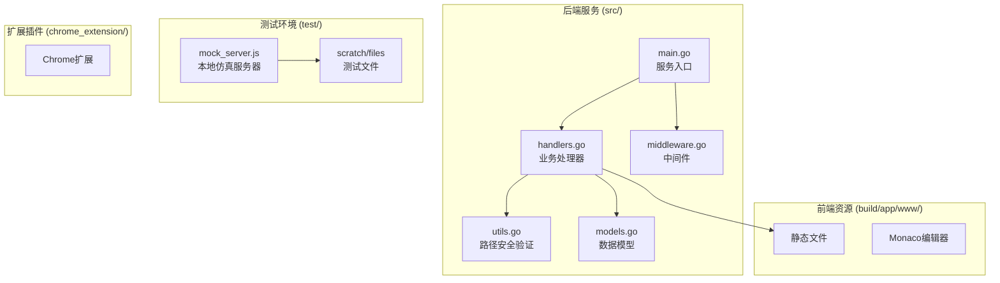
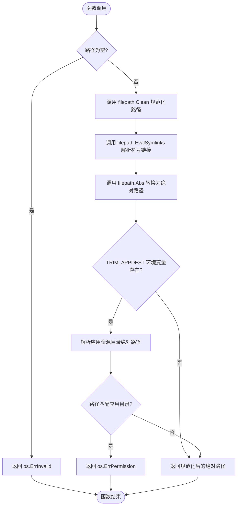
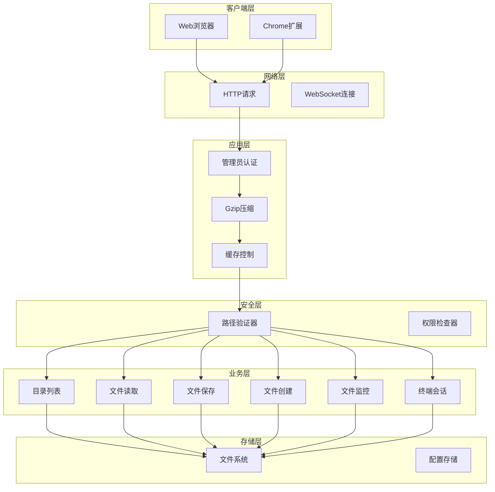
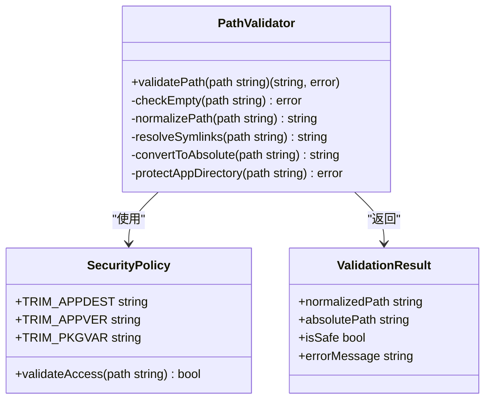
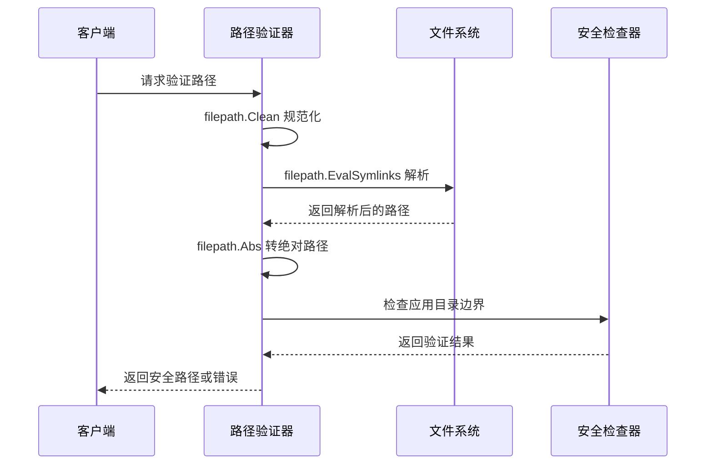
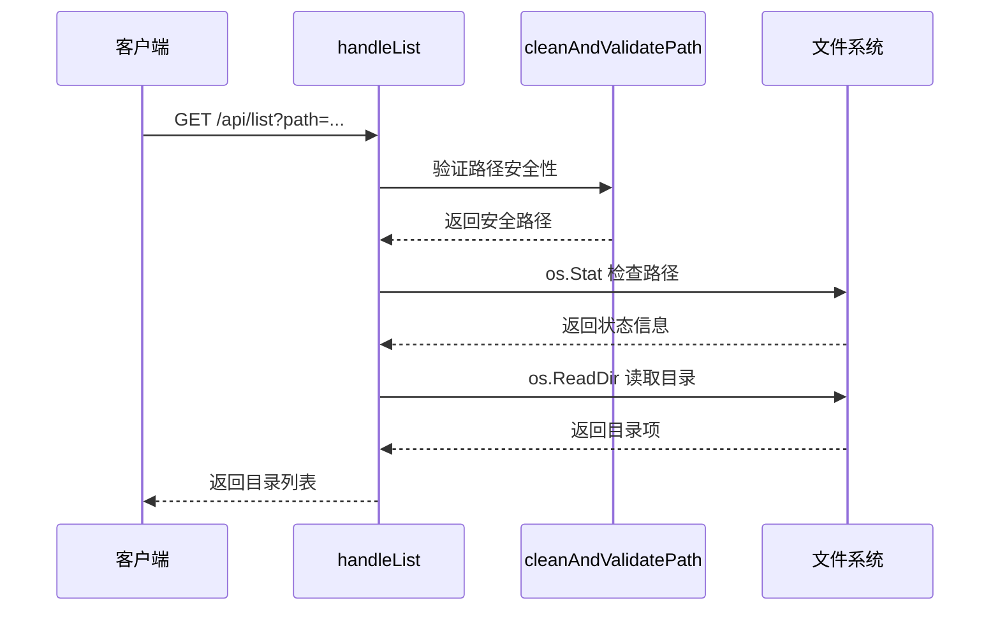
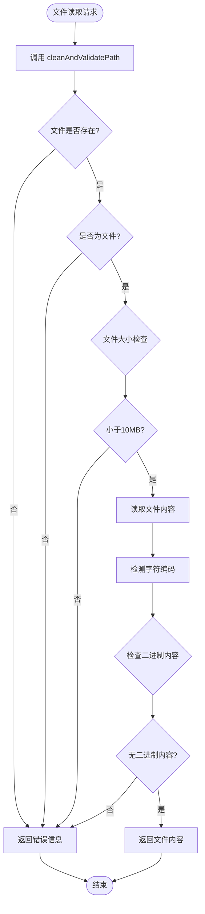
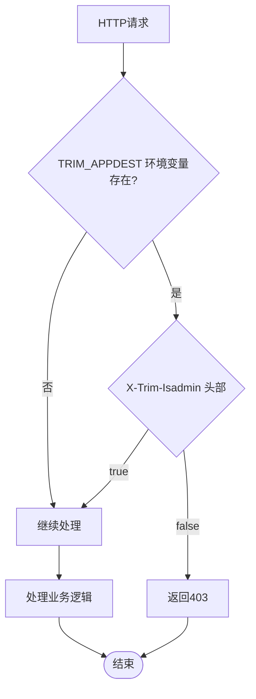
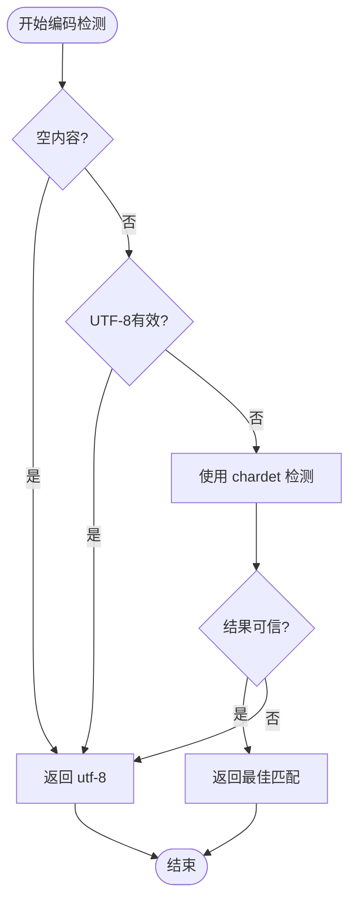

# 路径安全验证

<cite>
**本文档引用的文件**
- [utils.go](file://src/utils.go)
- [handlers.go](file://src/handlers.go)
- [main.go](file://src/main.go)
- [middleware.go](file://src/middleware.go)
- [models.go](file://src/models.go)
- [mock_server.js](file://test/scratch/mock_server.js)
</cite>

## 目录
1. [简介](#简介)
2. [项目结构](#项目结构)
3. [核心组件](#核心组件)
4. [架构概览](#架构概览)
5. [详细组件分析](#详细组件分析)
6. [依赖关系分析](#依赖关系分析)
7. [性能考虑](#性能考虑)
8. [故障排除指南](#故障排除指南)
9. [结论](#结论)

## 简介

本文档深入分析了 m.text.editor 项目中的路径安全验证功能，重点围绕 `cleanAndValidatePath` 函数的实现原理。该函数是整个系统安全架构的核心组件，负责防范目录遍历攻击、符号链接解析和路径规范化处理。

该编辑器基于飞牛OS（FNOS）适配，提供现代化的文本编辑体验，集成了交互式终端和深度的系统适配。路径安全验证功能确保了用户输入的路径在被系统使用之前经过严格的安全检查和规范化处理。

## 项目结构

项目采用 Go 语言开发，主要结构如下：



**图表来源**
- [main.go:1-145](file://src/main.go#L1-L145)
- [utils.go:1-262](file://src/utils.go#L1-L262)
- [handlers.go:1-614](file://src/handlers.go#L1-L614)

**章节来源**
- [main.go:1-145](file://src/main.go#L1-L145)
- [README.md:1-39](file://README.md#L1-L39)

## 核心组件

### cleanAndValidatePath 函数

`cleanAndValidatePath` 是路径安全验证的核心函数，实现了多层次的安全防护机制：



**图表来源**
- [utils.go:25-53](file://src/utils.go#L25-L53)

### 安全策略实现

系统采用了以下安全策略来保护应用资源目录：

1. **路径规范化**：使用 `filepath.Clean` 处理路径中的相对路径引用
2. **符号链接解析**：通过 `filepath.EvalSymlinks` 防范符号链接逃逸攻击
3. **绝对路径转换**：确保所有路径都转换为绝对路径形式
4. **应用目录保护**：检查路径是否指向应用自身的资源目录

**章节来源**
- [utils.go:25-53](file://src/utils.go#L25-L53)

## 架构概览

系统采用分层架构设计，路径安全验证贯穿整个请求处理流程：



**图表来源**
- [main.go:37-129](file://src/main.go#L37-L129)
- [handlers.go:21-614](file://src/handlers.go#L21-L614)
- [middleware.go:22-92](file://src/middleware.go#L22-L92)

## 详细组件分析

### 路径验证器组件

#### 实现原理

路径验证器通过多层检查确保路径的安全性：



**图表来源**
- [utils.go:25-53](file://src/utils.go#L25-L53)

#### 目录遍历攻击防护

系统通过以下机制防范目录遍历攻击：

1. **路径规范化检查**：防止 `../` 等相对路径引用
2. **符号链接安全检查**：解析符号链接并验证最终目标
3. **应用目录边界检查**：确保路径不指向应用自身资源

#### 符号链接解析机制



**图表来源**
- [utils.go:32-40](file://src/utils.go#L32-L40)

**章节来源**
- [utils.go:25-53](file://src/utils.go#L25-L53)

### 业务处理器集成

#### 目录列表处理器

目录列表处理器使用路径验证器确保用户请求的安全性：



**图表来源**
- [handlers.go:21-112](file://src/handlers.go#L21-L112)

#### 文件读取处理器

文件读取处理器不仅验证路径安全性，还实施多重安全检查：



**图表来源**
- [handlers.go:114-212](file://src/handlers.go#L114-L212)

**章节来源**
- [handlers.go:21-112](file://src/handlers.go#L21-L112)
- [handlers.go:114-212](file://src/handlers.go#L114-L212)

### 中间件安全集成

#### 管理员认证中间件

管理员认证中间件确保只有授权用户才能访问敏感操作：



**图表来源**
- [middleware.go:22-38](file://src/middleware.go#L22-L38)

**章节来源**
- [middleware.go:22-38](file://src/middleware.go#L22-L38)

## 依赖关系分析

系统的关键依赖关系如下：

```mermaid
graph LR
subgraph "核心依赖"
PathLib[path/filepath]<br/>路径处理
OSLib[os]<br/>操作系统接口
NetLib[golang.org/x/net/websocket]<br/>WebSocket支持
end
subgraph "第三方库"
PTLIB[github.com/creack/pty]<br/>PTY终端
CHARD[github.com/wlynxg/chardet]<br/>字符编码检测
TEXTENC[golang.org/x/text]<br/>文本编码
end
subgraph "业务模块"
Utils[utils.go]<br/>路径验证
Handlers[handlers.go]<br/>业务处理
Middleware[middleware.go]<br/>中间件
Main[main.go]<br/>服务入口
end
Utils --> PathLib
Utils --> OSLib
Handlers --> PathLib
Handlers --> OSLib
Handlers --> NetLib
Handlers --> TEXTENC
Middleware --> NetLib
Main --> NetLib
Main --> PathLib
Main --> OSLib
```

**图表来源**
- [utils.go:3-23](file://src/utils.go#L3-L23)
- [handlers.go:3-19](file://src/handlers.go#L3-L19)
- [main.go:3-12](file://src/main.go#L3-L12)

**章节来源**
- [utils.go:3-23](file://src/utils.go#L3-L23)
- [handlers.go:3-19](file://src/handlers.go#L3-L19)
- [main.go:3-12](file://src/main.go#L3-L12)

## 性能考虑

### 路径验证性能优化

路径验证器在保证安全性的同时，也考虑了性能影响：

1. **最小化系统调用**：只在必要时进行符号链接解析
2. **缓存策略**：避免重复的路径解析操作
3. **早返回机制**：在发现无效路径时立即返回

### 编码检测性能

字符编码检测使用启发式算法，平衡准确性和性能：



**图表来源**
- [utils.go:108-147](file://src/utils.go#L108-L147)

## 故障排除指南

### 常见错误类型

#### 路径验证错误

| 错误类型 | 错误码 | 描述 | 解决方案 |
|---------|--------|------|----------|
| os.ErrInvalid | 无效路径 | 路径为空或格式不正确 | 检查客户端传入的路径参数 |
| os.ErrPermission | 权限不足 | 尝试访问受保护的应用目录 | 确保路径不指向应用资源目录 |
| os.ErrNotExist | 路径不存在 | 目标文件或目录不存在 | 验证路径的有效性 |

#### 环境变量相关错误

| 错误类型 | 描述 | 解决方案 |
|---------|------|----------|
| TRIM_APPDEST 未设置 | 应用无法确定自身资源目录 | 在容器环境中正确设置环境变量 |
| TRIM_APPVER 未设置 | 版本信息缺失 | 确保应用版本信息正确配置 |

#### 文件操作错误

| 错误类型 | 描述 | 解决方案 |
|---------|------|----------|
| 文件过大 | 超过10MB限制 | 分割大文件或使用其他方式处理 |
| 二进制文件 | 检测到二进制内容 | 使用适当的编码或文件类型 |
| 权限问题 | 无法读取或写入文件 | 检查文件权限和用户权限 |

**章节来源**
- [handlers.go:31-51](file://src/handlers.go#L31-L51)
- [handlers.go:118-144](file://src/handlers.go#L118-L144)
- [handlers.go:232-242](file://src/handlers.go#L232-L242)

### 调试技巧

1. **启用详细日志**：在开发环境中增加日志输出
2. **使用测试文件**：利用测试目录进行路径验证测试
3. **模拟攻击场景**：测试各种可能的路径注入尝试

## 结论

m.text.editor 项目的路径安全验证功能通过 `cleanAndValidatePath` 函数实现了多层次的安全防护。该实现不仅有效防范了目录遍历攻击和符号链接逃逸，还确保了应用资源目录的安全性。

### 主要优势

1. **全面的安全防护**：从路径规范化到符号链接解析，再到应用目录保护
2. **性能优化**：最小化系统调用和早返回机制
3. **错误处理完善**：清晰的错误分类和用户友好的错误消息
4. **易于维护**：模块化的代码结构和清晰的职责分离

### 改进建议

1. **添加路径白名单机制**：为特定应用场景提供更精确的路径控制
2. **增强日志记录**：提供更多详细的审计信息
3. **性能监控**：添加路径验证性能指标
4. **安全测试**：定期进行安全渗透测试

该路径安全验证系统为整个编辑器提供了坚实的安全基础，确保用户能够在安全的环境中进行文件操作和编辑工作。