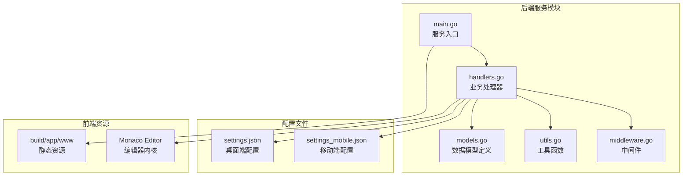
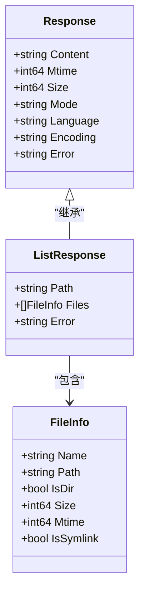
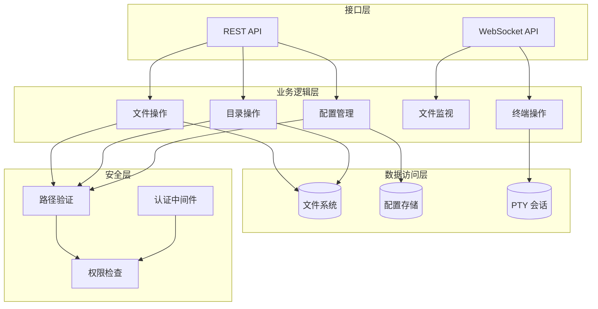
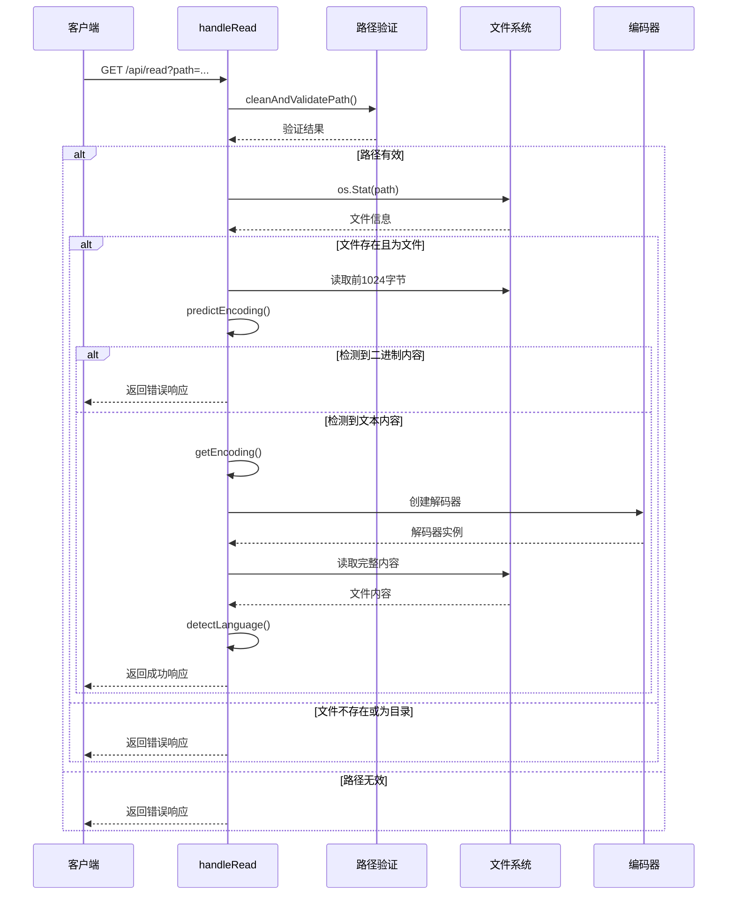
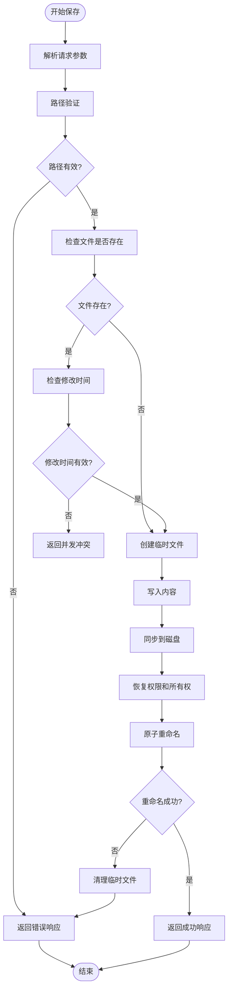
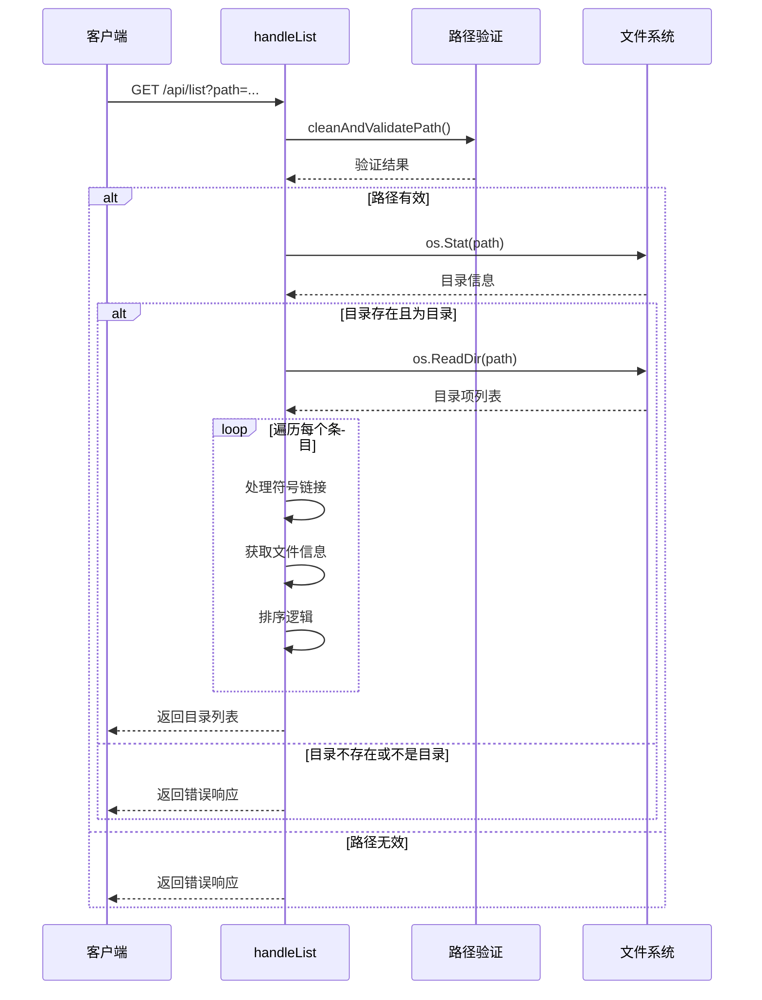
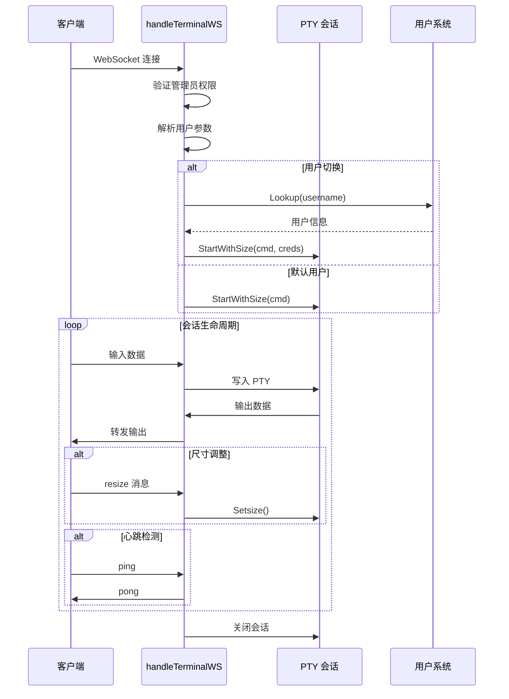
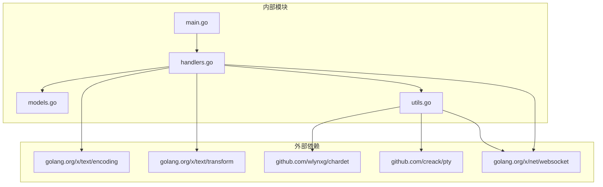

# 数据模型设计

<cite>
**本文档引用的文件**
- [models.go](file://src/models.go)
- [handlers.go](file://src/handlers.go)
- [utils.go](file://src/utils.go)
- [main.go](file://src/main.go)
- [settings.json](file://test/scratch/settings.json)
- [settings_mobile.json](file://test/scratch/settings_mobile.json)
- [mock_server.js](file://test/scratch/mock_server.js)
- [README.md](file://src/README.md)
</cite>

## 目录
1. [简介](#简介)
2. [项目结构](#项目结构)
3. [核心数据模型](#核心数据模型)
4. [架构概览](#架构概览)
5. [详细组件分析](#详细组件分析)
6. [依赖关系分析](#依赖关系分析)
7. [性能考虑](#性能考虑)
8. [故障排除指南](#故障排除指南)
9. [结论](#结论)

## 简介

本文档详细阐述了 PodNote 文本编辑器后端服务的数据模型设计。该系统采用统一响应结构，提供标准化的 API 响应格式，涵盖成功响应和错误响应的完整规范。文档深入解释了文件元数据模型、目录列表结构、配置模型设计以及 PTY 终端会话状态模型。

系统通过严格的路径验证机制确保安全性，实现了文件读取与转码、原子保存、文件监视和终端桥接等核心功能。所有数据模型均采用 Go 结构体定义，配合 JSON 序列化实现跨平台兼容性。

## 项目结构

后端服务采用模块化设计，主要包含以下核心组件：



**图表来源**
- [main.go:1-145](file://src/main.go#L1-L145)
- [models.go:1-30](file://src/models.go#L1-L30)
- [handlers.go:1-614](file://src/handlers.go#L1-L614)

**章节来源**
- [main.go:1-145](file://src/main.go#L1-L145)
- [README.md:12-17](file://README.md#L12-L17)

## 核心数据模型

### 统一响应结构

系统采用统一的 Response 结构作为所有 API 的标准响应格式，确保前后端交互的一致性和可预测性。



**图表来源**
- [models.go:3-29](file://src/models.go#L3-L29)

#### Response 结构详解

Response 结构体定义了统一的 API 响应格式，包含以下字段：

| 字段名 | 类型 | 描述 | 序列化选项 |
|--------|------|------|------------|
| Content | string | 文件内容（解压/转码后） | omitempty |
| Mtime | int64 | 最后修改时间戳（Unix 时间） | omitempty |
| Size | int64 | 文件原始字节大小 | omitempty |
| Mode | string | 文件权限位描述 | omitempty |
| Language | string | Monaco 语言 ID | omitempty |
| Encoding | string | 建议的编码 | omitempty |
| Error | string | 错误信息描述 | omitempty |

#### ListResponse 结构详解

ListResponse 专门用于目录列表响应，扩展了基础 Response 结构：

| 字段名 | 类型 | 描述 | 序列化选项 |
|--------|------|------|------------|
| Path | string | 目标目录路径 | omitempty |
| Files | []FileInfo | 目录项列表 | omitempty |
| Error | string | 错误信息描述 | omitempty |

#### FileInfo 结构详解

FileInfo 定义了目录项的元数据信息：

| 字段名 | 类型 | 描述 | 序列化选项 |
|--------|------|------|------------|
| Name | string | 文件或目录名称 | 必需 |
| Path | string | 完整路径 | 必需 |
| IsDir | bool | 是否为目录 | 必需 |
| Size | int64 | 文件大小（字节） | 必需 |
| Mtime | int64 | 修改时间戳 | 必需 |
| IsSymlink | bool | 是否为符号链接 | 必需 |

**章节来源**
- [models.go:3-29](file://src/models.go#L3-L29)
- [README.md:19-42](file://src/README.md#L19-L42)

## 架构概览

系统采用分层架构设计，各层职责明确，耦合度低：



**图表来源**
- [handlers.go:21-614](file://src/handlers.go#L21-L614)
- [utils.go:25-53](file://src/utils.go#L25-L53)

## 详细组件分析

### 文件读取与转码组件

文件读取组件实现了智能编码探测和透明转码功能：



**图表来源**
- [handlers.go:114-212](file://src/handlers.go#L114-L212)
- [utils.go:108-165](file://src/utils.go#L108-L165)

#### 文件读取流程

1. **路径验证**：使用 `cleanAndValidatePath()` 函数确保路径安全，防止目录遍历攻击
2. **文件检查**：验证目标是否为有效文件而非目录
3. **大小限制**：检查文件大小不超过 10MB 限制
4. **编码探测**：读取前 1024 字节进行编码自动检测
5. **二进制防护**：检测 0 字节以识别二进制文件
6. **内容转码**：将非 UTF-8 内容转换为 UTF-8
7. **语言识别**：基于文件扩展名和 shebang 行识别语言类型

**章节来源**
- [handlers.go:114-212](file://src/handlers.go#L114-L212)
- [utils.go:108-165](file://src/utils.go#L108-L165)

### 原子保存组件

原子保存组件确保文件写入的完整性和一致性：



**图表来源**
- [handlers.go:214-324](file://src/handlers.go#L214-L324)

#### 原子保存机制

1. **乐观锁检查**：通过比较请求中的 `mtime` 和实际文件修改时间防止并发覆盖
2. **临时文件策略**：先写入同级 `.tmp` 临时文件，确保完整性后再替换
3. **强制落盘**：使用 `f.Sync()` 确保数据持久化到磁盘
4. **权限保持**：恢复原始文件的权限和所有权信息
5. **原子替换**：使用 `os.Rename()` 实现原子性的文件替换

**章节来源**
- [handlers.go:214-324](file://src/handlers.go#L214-L324)

### 目录列表组件

目录列表组件提供了安全的目录浏览功能：



**图表来源**
- [handlers.go:21-112](file://src/handlers.go#L21-L112)

#### 目录列表特性

1. **安全过滤**：自动忽略以点开头的隐藏文件
2. **符号链接处理**：正确识别和处理符号链接
3. **智能排序**：文件夹优先显示，然后按名称排序
4. **信息丰富**：提供完整的文件元数据包括大小、修改时间和权限

**章节来源**
- [handlers.go:21-112](file://src/handlers.go#L21-L112)

### PTY 终端会话组件

终端会话组件实现了安全的交互式终端功能：



**图表来源**
- [handlers.go:496-516](file://src/handlers.go#L496-L516)
- [utils.go:167-261](file://src/utils.go#L167-L261)

#### 终端会话特性

1. **用户隔离**：支持基于用户名的用户切换，实现多用户环境下的安全隔离
2. **权限控制**：通过管理员头部验证确保只有授权用户可以访问终端
3. **会话管理**：实现 90 秒无活动自动断开，防止资源泄露
4. **尺寸调整**：支持动态调整终端窗口大小
5. **心跳机制**：通过特殊消息实现客户端心跳检测

**章节来源**
- [handlers.go:496-516](file://src/handlers.go#L496-L516)
- [utils.go:167-261](file://src/utils.go#L167-L261)

### 配置模型组件

配置模型组件提供了灵活的设置管理功能：

```mermaid
classDiagram
class SettingsModel {
+string defaultOpenPath
+int fontSize
+string fontFamily
+string wordWrap
+bool minimap
+bool readOnlyTail
+string tabSize
+string renderWhitespace
+string editorTheme
+string uiTheme
+string terminalFontSize
+string terminalCursorStyle
+bool terminalCursorBlink
+string terminalUser
}
class SettingsResponse {
+string Content
+string Error
}
class SettingsRequest {
+string path
+map[string]interface{} data
}
SettingsResponse <-- SettingsModel : "序列化"
SettingsRequest --> SettingsModel : "反序列化"
```

**图表来源**
- [handlers.go:518-611](file://src/handlers.go#L518-L611)
- [settings.json:1-16](file://test/scratch/settings.json#L1-L16)

#### 配置模型设计

系统支持两种配置文件格式：

| 配置项 | 类型 | 默认值 | 描述 |
|--------|------|--------|------|
| defaultOpenPath | string | "" | 默认打开路径 |
| fontSize | int | 14 | 编辑器字体大小 |
| fontFamily | string | "Consolas, 'Courier New', monospace" | 字体族 |
| wordWrap | string | "on" | 自动换行设置 |
| minimap | bool | true | 显示缩略图 |
| readOnlyTail | bool | false | 只读尾部模式 |
| tabSize | string | "4" | 制表符宽度 |
| renderWhitespace | string | "none" | 空白字符渲染 |
| editorTheme | string | "vs-dark" | 编辑器主题 |
| uiTheme | string | "dark" | 界面主题 |
| terminalFontSize | string | "13" | 终端字体大小 |
| terminalCursorStyle | string | "block" | 终端光标样式 |
| terminalCursorBlink | bool | true | 终端光标闪烁 |
| terminalUser | string | "current" | 终端用户设置 |

**章节来源**
- [handlers.go:518-611](file://src/handlers.go#L518-L611)
- [settings.json:1-16](file://test/scratch/settings.json#L1-L16)
- [settings_mobile.json:1-16](file://test/scratch/settings_mobile.json#L1-L16)

## 依赖关系分析

系统的核心依赖关系如下：



**图表来源**
- [handlers.go:3-19](file://src/handlers.go#L3-L19)
- [utils.go:3-23](file://src/utils.go#L3-L23)

### 数据验证规则和约束条件

系统实现了多层次的数据验证机制：

#### 路径验证规则
1. **绝对路径要求**：所有路径必须为绝对路径
2. **目录遍历防护**：防止 `../` 等相对路径攻击
3. **符号链接解析**：自动解析符号链接防止逃逸
4. **应用目录保护**：禁止访问应用自身资源目录

#### 文件操作约束
1. **大小限制**：单个文件最大 10MB
2. **类型检查**：严格区分文件和目录
3. **权限验证**：检查文件访问权限
4. **并发控制**：通过修改时间戳防止并发覆盖

#### 编码验证规则
1. **二进制检测**：检测 0 字节防止二进制文件加载
2. **编码兼容性**：支持 UTF-8、GBK、GB18030、Big5、UTF-16 等编码
3. **自动识别**：使用 chardet 库进行编码自动检测

**章节来源**
- [utils.go:25-53](file://src/utils.go#L25-L53)
- [handlers.go:146-176](file://src/handlers.go#L146-L176)
- [handlers.go:253-262](file://src/handlers.go#L253-L262)

## 性能考虑

### 序列化优化

1. **延迟序列化**：Response 结构体使用 `omitempty` 标签，避免发送空值
2. **批量处理**：目录列表采用一次性序列化，减少网络往返
3. **流式传输**：文件内容采用流式读取，避免内存峰值

### 缓存策略

1. **静态资源缓存**：Monaco 编辑器资源缓存 1 年
2. **版本控制**：通过查询参数实现缓存失效
3. **条件请求**：支持 ETag 和 Last-Modified 头部

### 内存管理

1. **缓冲区复用**：文件读取使用固定大小缓冲区
2. **及时释放**：确保文件句柄和网络连接及时关闭
3. **垃圾回收**：避免创建不必要的字符串副本

## 故障排除指南

### 常见错误类型

| 错误代码 | 描述 | 可能原因 | 解决方案 |
|----------|------|----------|----------|
| 400 | 路径无效 | 目录遍历攻击尝试 | 检查路径验证日志 |
| 403 | 权限不足 | 访问受保护目录 | 检查用户权限 |
| 404 | 资源不存在 | 文件或目录不存在 | 验证路径正确性 |
| 409 | 并发冲突 | 文件被其他进程修改 | 刷新页面后重试 |
| 500 | 服务器错误 | 系统内部错误 | 检查服务日志 |

### 调试建议

1. **启用详细日志**：检查 `log.Printf` 输出
2. **验证环境变量**：确认 `TRIM_APPDEST` 和 `TRIM_APPVER` 设置
3. **测试路径安全**：使用 `cleanAndValidatePath()` 函数验证路径
4. **监控资源使用**：观察内存和 CPU 使用情况

**章节来源**
- [handlers.go:26-38](file://src/handlers.go#L26-L38)
- [handlers.go:131-144](file://src/handlers.go#L131-L144)
- [handlers.go:253-262](file://src/handlers.go#L253-L262)

## 结论

PodNote 文本编辑器的数据模型设计体现了现代 Web 应用的最佳实践。通过统一的响应结构、严格的安全验证机制和高效的序列化实现，系统在保证安全性的同时提供了良好的用户体验。

关键设计亮点包括：
- **统一响应格式**：简化了前后端交互协议
- **多层次安全验证**：从路径验证到权限控制的全方位保护
- **智能编码处理**：支持多种编码格式的透明转换
- **原子操作保证**：确保文件操作的完整性和一致性
- **灵活的配置管理**：支持桌面端和移动端的不同需求

这些设计原则为系统的可维护性和扩展性奠定了坚实基础，为后续的功能增强和性能优化提供了清晰的方向。