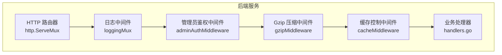
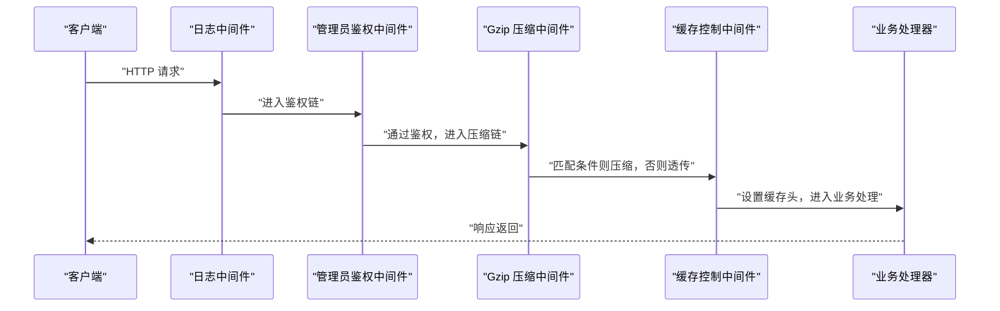
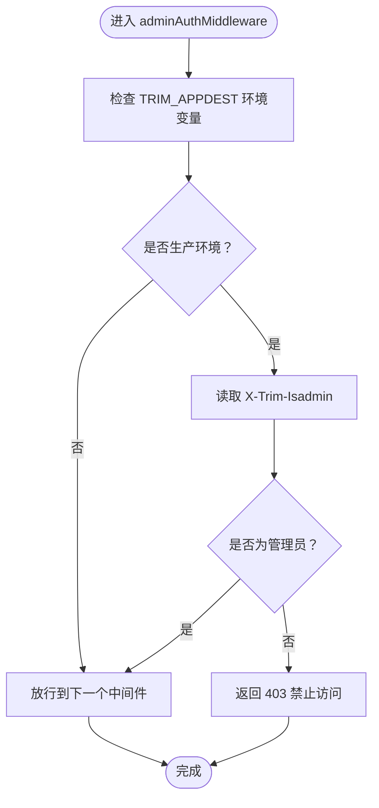
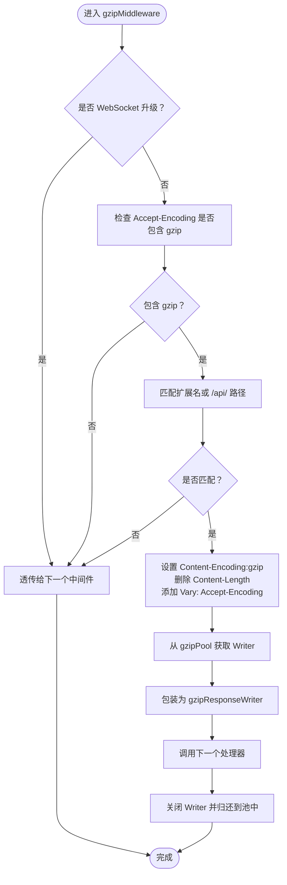
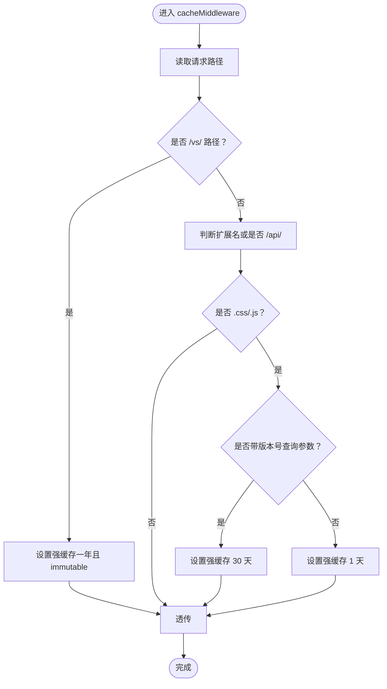
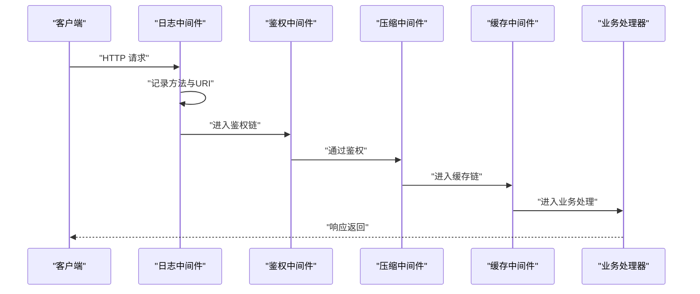
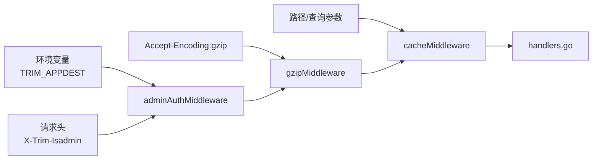

# 中间件模块 (middleware.go)

<cite>
**本文引用的文件**
- [middleware.go](file://src/middleware.go)
- [main.go](file://src/main.go)
- [handlers.go](file://src/handlers.go)
- [utils.go](file://src/utils.go)
- [models.go](file://src/models.go)
- [README.md](file://README.md)
</cite>

## 目录
1. [简介](#简介)
2. [项目结构](#项目结构)
3. [核心组件](#核心组件)
4. [架构总览](#架构总览)
5. [详细组件分析](#详细组件分析)
6. [依赖关系分析](#依赖关系分析)
7. [性能考量](#性能考量)
8. [故障排查指南](#故障排查指南)
9. [结论](#结论)
10. [附录](#附录)

## 简介
本文件聚焦于中间件模块的设计与实现，围绕 src/middleware.go 中的中间件系统展开，涵盖认证中间件、压缩中间件、缓存中间件等关键能力。文档将深入解释中间件的执行顺序、链式调用机制、上下文传递方式，并提供扩展新中间件的开发指南、配置选项、性能优化建议与调试技巧。同时给出实际中间件实现示例的定位路径，便于读者快速上手与二次开发。

## 项目结构
后端采用 Go 语言实现，核心入口位于 main.go，中间件集中定义于 middleware.go，业务处理器位于 handlers.go，通用工具函数与模型定义分别在 utils.go 与 models.go。中间件通过链式包装的方式接入主路由 mux，形成统一的请求处理管线。

图表来源
- [main.go:121-128](file://src/main.go#L121-L128)
- [middleware.go:22-38](file://src/middleware.go#L22-L38)
- [middleware.go:40-72](file://src/middleware.go#L40-L72)
- [middleware.go:74-92](file://src/middleware.go#L74-L92)

章节来源
- [main.go:37-129](file://src/main.go#L37-L129)
- [middleware.go:1-103](file://src/middleware.go#L1-L103)

## 核心组件
- 管理员鉴权中间件：校验请求头中的管理员标识，生产环境强制要求管理员权限。
- Gzip 压缩中间件：对符合条件的静态资源与 API 响应进行透明压缩，复用 gzip.Writer 以降低内存分配。
- 缓存控制中间件：根据路径与查询参数设置合理的 Cache-Control 策略，提升浏览器缓存命中率。
- 日志中间件：统一记录请求方法与 URI，便于审计与排障。

章节来源
- [middleware.go:22-38](file://src/middleware.go#L22-L38)
- [middleware.go:40-72](file://src/middleware.go#L40-L72)
- [middleware.go:74-92](file://src/middleware.go#L74-L92)
- [main.go:125-128](file://src/main.go#L125-L128)

## 架构总览
中间件链在 main.go 中构建，按“鉴权 -> 压缩 -> 缓存 -> 日志”的顺序串联，最终交由业务处理器处理。WebSocket 路由（如终端与文件监控）绕过压缩中间件，避免协议升级冲突。

图表来源
- [main.go:121-128](file://src/main.go#L121-L128)
- [middleware.go:22-38](file://src/middleware.go#L22-L38)
- [middleware.go:40-72](file://src/middleware.go#L40-L72)
- [middleware.go:74-92](file://src/middleware.go#L74-L92)

## 详细组件分析

### 管理员鉴权中间件
- 设计理念：通过请求头携带的管理员标识进行访问控制，生产环境强制启用，保障系统安全。
- 实现要点：
  - 读取请求头 X-Trim-Isadmin 判断是否为管理员。
  - 当 TRIM_APPDEST 环境变量非空时，表示生产环境，必须满足管理员条件。
  - 不满足条件时直接返回禁止访问错误。
  - 满足条件时调用下一个处理器继续处理。
- 上下文传递：中间件不修改请求体，仅在鉴权失败时提前返回，不影响后续中间件与处理器的上下文传递。

图表来源
- [middleware.go:22-38](file://src/middleware.go#L22-L38)

章节来源
- [middleware.go:22-38](file://src/middleware.go#L22-L38)
- [handlers.go:506-512](file://src/handlers.go#L506-L512)

### Gzip 压缩中间件
- 设计理念：对静态资源与 API 响应进行透明压缩，减少带宽占用；通过 sync.Pool 复用 gzip.Writer，降低 GC 压力。
- 实现要点：
  - 忽略 WebSocket 升级请求，避免协议冲突。
  - 检查 Accept-Encoding 是否包含 gzip。
  - 对 .js、.css、.html 以及 /api/ 路径下的响应进行压缩。
  - 设置 Content-Encoding:gzip 与 Vary: Accept-Encoding，禁用 Content-Length。
  - 使用 gzipPool.Get() 获取 Writer，defer 回收至池中。
  - 通过自定义 gzipResponseWriter 包装 ResponseWriter，实现透明压缩。
- 性能优化：复用压缩器、延迟计算 Content-Length、仅对合适资源压缩。

图表来源
- [middleware.go:40-72](file://src/middleware.go#L40-L72)
- [middleware.go:94-102](file://src/middleware.go#L94-L102)

章节来源
- [middleware.go:40-72](file://src/middleware.go#L40-L72)
- [middleware.go:94-102](file://src/middleware.go#L94-L102)

### 缓存控制中间件
- 设计理念：针对不同类型的静态资源设置合适的缓存策略，提升浏览器缓存命中率，减少重复传输。
- 实现要点：
  - 对 /vs/ 路径（Monaco 核心资源）设置强缓存一年且 immutable。
  - 对 .css/.js 资源：
    - 若带版本号查询参数，则强缓存 30 天；
    - 否则普通业务资源缓存 1 天。
  - 其他路径透传，不修改缓存头。
- 上下文传递：仅设置响应头，不改变请求与响应体。

图表来源
- [middleware.go:74-92](file://src/middleware.go#L74-L92)

章节来源
- [middleware.go:74-92](file://src/middleware.go#L74-L92)

### 日志中间件与链式调用
- 设计理念：在中间件链最外层统一记录请求信息，便于审计与问题定位。
- 实现要点：
  - 将日志逻辑封装为 http.HandlerFunc，先记录请求方法与 URI，再调用中间件链。
  - 中间件链顺序：adminAuthMiddleware -> gzipMiddleware -> cacheMiddleware。
  - WebSocket 路由（/api/terminal/ws、/api/watch/ws）在 main.go 中直接注册，不参与压缩中间件链，避免协议升级冲突。
- 上下文传递：日志中间件仅在进入与退出时记录，不影响请求与响应的上下文。

图表来源
- [main.go:121-128](file://src/main.go#L121-L128)
- [main.go:118-119](file://src/main.go#L118-L119)

章节来源
- [main.go:121-128](file://src/main.go#L121-L128)
- [main.go:111-119](file://src/main.go#L111-L119)

## 依赖关系分析
- 中间件依赖关系：
  - adminAuthMiddleware 依赖环境变量 TRIM_APPDEST 与请求头 X-Trim-Isadmin。
  - gzipMiddleware 依赖 gzipPool、Vary 与 Content-Encoding 头。
  - cacheMiddleware 依赖路径判断与查询参数。
- 与业务处理器的关系：
  - handlers.go 中的 WebSocket 路由（/api/terminal/ws、/api/watch/ws）直接注册，不经过压缩中间件。
  - 其余 API 与静态资源均走中间件链。

图表来源
- [middleware.go:22-38](file://src/middleware.go#L22-L38)
- [middleware.go:40-72](file://src/middleware.go#L40-L72)
- [middleware.go:74-92](file://src/middleware.go#L74-L92)
- [main.go:111-119](file://src/main.go#L111-L119)

章节来源
- [middleware.go:14-20](file://src/middleware.go#L14-L20)
- [main.go:111-119](file://src/main.go#L111-L119)

## 性能考量
- 压缩器复用：通过 sync.Pool 缓存 gzip.Writer，避免频繁分配与回收，降低 GC 压力。
- 条件压缩：仅对 .js、.css、.html 与 /api/ 路径响应进行压缩，减少不必要的 CPU 开销。
- 头部优化：动态设置 Content-Encoding 与 Vary: Accept-Encoding，避免固定 Content-Length 导致的额外计算。
- 缓存策略：针对不同资源设置差异化缓存策略，提升浏览器命中率，减少网络往返。
- WebSocket 绕过：WebSocket 升级请求不参与压缩，避免协议冲突与额外处理。

章节来源
- [middleware.go:14-20](file://src/middleware.go#L14-L20)
- [middleware.go:40-72](file://src/middleware.go#L40-L72)
- [middleware.go:74-92](file://src/middleware.go#L74-L92)

## 故障排查指南
- 管理员鉴权失败：
  - 确认 TRIM_APPDEST 环境变量是否为空（生产环境强制启用）。
  - 检查请求头 X-Trim-Isadmin 是否为 "true"。
  - 参考路径：[middleware.go:22-38](file://src/middleware.go#L22-L38)，[handlers.go:506-512](file://src/handlers.go#L506-L512)
- 压缩未生效：
  - 确认客户端是否发送 Accept-Encoding:gzip。
  - 检查路径是否为 .js/.css/.html 或 /api/。
  - 确认 WebSocket 路由是否被正确注册（不参与压缩）。
  - 参考路径：[middleware.go:40-72](file://src/middleware.go#L40-L72)，[main.go:118-119](file://src/main.go#L118-L119)
- 缓存策略异常：
  - 检查路径是否包含 /vs/ 或扩展名为 .css/.js。
  - 确认查询参数 v 是否存在。
  - 参考路径：[middleware.go:74-92](file://src/middleware.go#L74-L92)
- 日志审计：
  - 查看日志中间件输出的请求方法与 URI，定位问题范围。
  - 参考路径：[main.go:125-128](file://src/main.go#L125-L128)

章节来源
- [middleware.go:22-38](file://src/middleware.go#L22-L38)
- [middleware.go:40-72](file://src/middleware.go#L40-L72)
- [middleware.go:74-92](file://src/middleware.go#L74-L92)
- [main.go:125-128](file://src/main.go#L125-L128)
- [main.go:118-119](file://src/main.go#L118-L119)

## 结论
中间件模块通过清晰的职责划分与链式调用机制，实现了安全、高效与可维护的请求处理流程。管理员鉴权确保生产环境安全，Gzip 压缩与缓存控制显著优化了传输效率与用户体验，日志中间件提供了良好的可观测性。该设计易于扩展，可按需新增中间件以满足更多场景需求。

## 附录

### 如何扩展新的中间件处理器
- 设计原则：
  - 保持单一职责，每个中间件专注一个功能域。
  - 严格遵循 http.Handler 接口，返回 http.HandlerFunc。
  - 在链中尽早失败，避免不必要的后续处理。
- 开发步骤：
  1. 定义中间件函数：形如 func(next http.Handler) http.Handler。
  2. 在函数内部实现前置逻辑（如鉴权、日志、限流等）。
  3. 调用 next.ServeHTTP(w, r) 将控制权交给下一个中间件或处理器。
  4. 在 defer 中实现后置逻辑（如统计、清理、错误恢复等）。
- 集成方式：
  - 在 main.go 中按照期望顺序组合中间件链。
  - 对于 WebSocket 路由，可直接注册，无需参与压缩中间件链。
- 示例定位路径：
  - 鉴权中间件参考：[middleware.go:22-38](file://src/middleware.go#L22-L38)
  - 压缩中间件参考：[middleware.go:40-72](file://src/middleware.go#L40-L72)
  - 缓存中间件参考：[middleware.go:74-92](file://src/middleware.go#L74-L92)
  - 日志中间件参考：[main.go:125-128](file://src/main.go#L125-L128)
  - WebSocket 路由参考：[main.go:118-119](file://src/main.go#L118-L119)

章节来源
- [middleware.go:22-38](file://src/middleware.go#L22-L38)
- [middleware.go:40-72](file://src/middleware.go#L40-L72)
- [middleware.go:74-92](file://src/middleware.go#L74-L92)
- [main.go:125-128](file://src/main.go#L125-L128)
- [main.go:118-119](file://src/main.go#L118-L119)