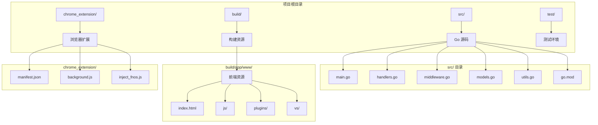
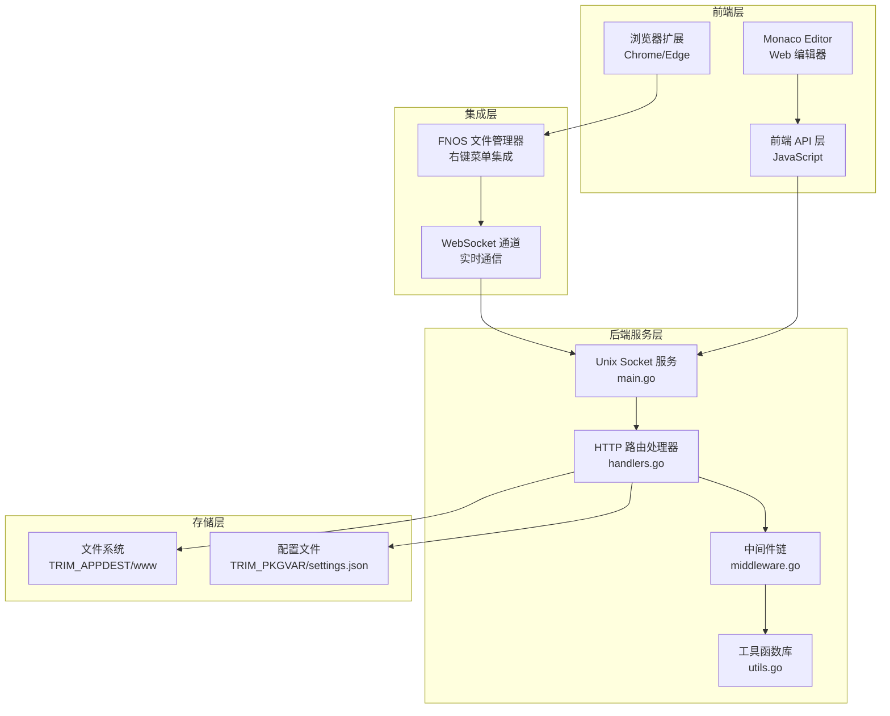
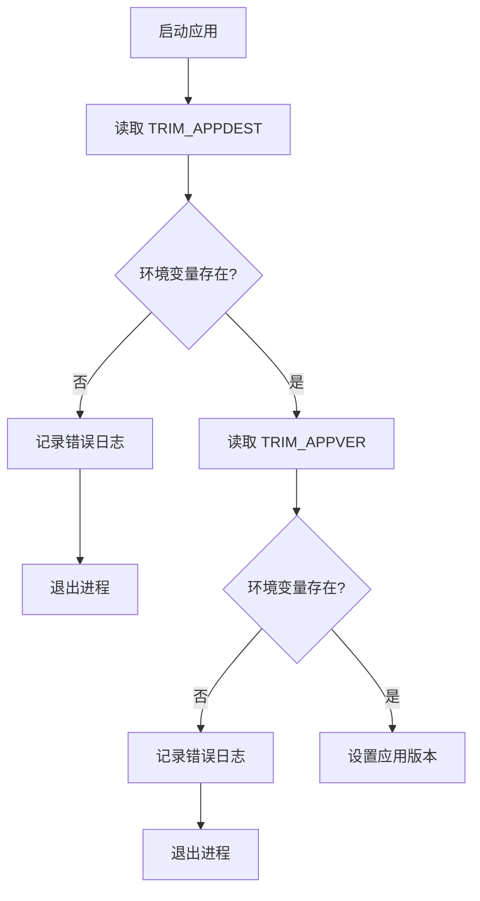
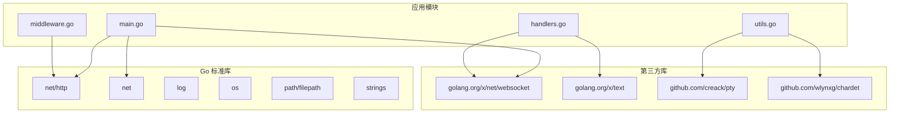

# 主模块 (main.go)

<cite>
**本文档引用的文件**
- [main.go](file://src/main.go)
- [handlers.go](file://src/handlers.go)
- [middleware.go](file://src/middleware.go)
- [models.go](file://src/models.go)
- [utils.go](file://src/utils.go)
- [go.mod](file://src/go.mod)
- [README.md](file://README.md)
- [inject_fnos.js](file://build/app/www/plugins/inject_fnos.js)
- [api.js](file://build/app/www/js/api.js)
- [manifest.json](file://chrome_extension/manifest.json)
</cite>

## 目录
1. [简介](#简介)
2. [项目结构](#项目结构)
3. [核心组件](#核心组件)
4. [架构概览](#架构概览)
5. [详细组件分析](#详细组件分析)
6. [依赖分析](#依赖分析)
7. [性能考虑](#性能考虑)
8. [故障排除指南](#故障排除指南)
9. [结论](#结论)

## 简介

PodNote 是一款基于飞牛OS（FNOS）适配的轻量极速文本编辑器，搭载 Monaco Editor 内核。主模块 (main.go) 作为应用程序的入口点，负责初始化整个服务系统，包括 Unix Socket 监听机制、路由配置、服务器启动流程等核心功能。

该编辑器深度集成了 FNOS 文件管理系统，支持在文件管理器中右键编辑、工具栏一键新建文件等功能。后端采用 Go 语言实现，前端使用 JavaScript 和 Monaco Editor 构建现代化的编辑体验。

## 项目结构

项目采用清晰的模块化组织结构，主要分为以下几个部分：



**图表来源**
- [main.go:1-145](file://src/main.go#L1-L145)
- [go.mod:1-12](file://src/go.mod#L1-L12)

**章节来源**
- [README.md:12-17](file://README.md#L12-L17)
- [main.go:1-145](file://src/main.go#L1-L145)

## 核心组件

### 应用初始化流程

主模块的核心初始化流程包括以下关键步骤：

1. **环境变量验证**：检查 TRIM_APPDEST 和 TRIM_APPVER 环境变量
2. **路径配置**：根据环境变量设置 Socket 路径和 www 目录
3. **日志输出**：打印应用启动信息和配置详情
4. **路由注册**：配置静态资源路由和业务 API 路由
5. **中间件链**：构建管理员鉴权、Gzip 压缩、缓存控制、日志审计的处理链
6. **Unix Socket 监听**：创建并监听 Unix Socket 服务
7. **服务器启动**：启动 HTTP 服务器接受请求

### Unix Socket 监听机制

应用使用 Unix Socket 进行进程间通信，具有以下特点：

- **安全性**：仅限本地进程访问，无需网络防火墙配置
- **性能**：避免 TCP/IP 协议栈开销，提升响应速度
- **隔离性**：与系统其他网络服务完全隔离
- **权限控制**：通过文件系统权限控制访问

**章节来源**
- [main.go:15-144](file://src/main.go#L15-L144)

## 架构概览

PodNote 采用前后端分离的架构设计，后端通过 Unix Socket 提供服务，前端通过浏览器扩展与后端通信：



**图表来源**
- [main.go:37-129](file://src/main.go#L37-L129)
- [handlers.go:21-614](file://src/handlers.go#L21-L614)
- [middleware.go:22-92](file://src/middleware.go#L22-L92)

## 详细组件分析

### 主入口函数 (main)

主入口函数实现了完整的应用生命周期管理：

#### 环境变量处理


**图表来源**
- [main.go:16-24](file://src/main.go#L16-L24)

#### 路由配置系统

应用采用前缀路由模式，所有 API 路由都以 `/app/m-text-editor/` 开头：

```mermaid
graph LR
A[前缀: /app/m-text-editor/] --> B[静态资源路由]
A --> C[业务 API 路由]
A --> D[WebSocket 路由]
B --> B1[首页处理<br/>index.html]
B --> B2[样式网关<br/>style.css]
B --> B3[脚本注入<br/>*.js (除 Monaco)]
B --> B4[静态转发<br/>Monaco 资源]
C --> C1[文件读取<br/>/api/read]
C --> C2[文件保存<br/>/api/save]
C --> C3[目录列表<br/>/api/list]
C --> C4[新建文件<br/>/api/new]
C --> C5[文件预检<br/>/api/create]
C --> C6[设置管理<br/>/api/settings]
D --> D1[文件监控<br/>/api/watch/ws]
D --> D2[终端会话<br/>/api/terminal/ws]
```

**图表来源**
- [main.go:40-119](file://src/main.go#L40-L119)

**章节来源**
- [main.go:37-129](file://src/main.go#L37-L129)

### 中间件系统

应用实现了三层中间件处理链，提供安全、性能和可观测性的保障：

#### 管理员鉴权中间件
- 检查 X-Trim-Isadmin 头部
- 在生产环境强制管理员权限
- 支持匿名访问的开发环境

#### Gzip 压缩中间件
- 智能压缩策略：JS、CSS、HTML 和 API 响应
- WebSocket 连接绕过压缩
- 使用 sync.Pool 复用压缩器

#### 缓存控制中间件
- Monaco 核心资源强缓存一年
- 带版本号的资源缓存 30 天
- 普通业务资源缓存 1 天

**章节来源**
- [middleware.go:22-92](file://src/middleware.go#L22-L92)

### 业务处理器

#### 文件管理系统
- **文件读取**：支持多种编码自动检测和转换
- **文件保存**：原子写入，防止数据丢失
- **目录浏览**：递归列出文件和文件夹
- **文件创建**：预检和物理创建分离

#### 实时通信系统
- **文件监控**：WebSocket 实时推送文件变更
- **终端会话**：基于 PTY 的交互式终端
- **心跳机制**：90 秒超时保护

**章节来源**
- [handlers.go:21-614](file://src/handlers.go#L21-L614)

### 工具函数库

#### 路径安全验证
- 防止目录穿越攻击
- 符号链接安全解析
- 应用资源目录保护

#### 编码检测系统
- 多种编码格式支持：GBK、GB18030、Big5、UTF-16
- 自动编码检测算法
- 文本内容二进制防护

#### PTY 终端桥接
- 用户上下文切换
- 窗口尺寸动态调整
- 心跳保活机制

**章节来源**
- [utils.go:25-262](file://src/utils.go#L25-L262)

## 依赖分析

### 外部依赖关系



**图表来源**
- [go.mod:5-11](file://src/go.mod#L5-L11)
- [main.go:3-12](file://src/main.go#L3-L12)

### 内部模块依赖

应用内部模块之间遵循清晰的依赖层次：

- **main.go**：依赖所有其他模块
- **handlers.go**：依赖 utils.go 和 models.go
- **middleware.go**：独立模块，被 main.go 依赖
- **utils.go**：独立模块，被 handlers.go 依赖
- **models.go**：数据模型定义，被 handlers.go 依赖

**章节来源**
- [go.mod:1-12](file://src/go.mod#L1-L12)

## 性能考虑

### 优化策略

1. **连接池优化**
   - Gzip 压缩器使用 sync.Pool 复用
   - 减少 GC 压力和内存分配

2. **缓存策略**
   - 长期缓存 Monaco 核心资源
   - 版本化资源短时间缓存
   - 避免不必要的网络往返

3. **I/O 优化**
   - 原子文件写入防止数据损坏
   - 临时文件机制确保一致性
   - 同步落盘保证数据持久性

4. **网络优化**
   - Unix Socket 减少协议开销
   - WebSocket 心跳保活
   - 超时控制防止资源泄漏

### 性能监控

应用内置日志系统，记录关键性能指标：
- 请求处理时间
- 文件操作耗时
- WebSocket 连接状态
- 缓存命中率

## 故障排除指南

### 常见问题诊断

#### 环境变量错误
**症状**：应用启动立即退出
**原因**：TRIM_APPDEST 或 TRIM_APPVER 未设置
**解决方案**：检查容器环境变量配置

#### Socket 监听失败
**症状**：无法启动服务
**原因**：Socket 文件权限或路径问题
**解决方案**：检查文件系统权限和路径

#### 文件访问权限
**症状**：文件操作返回 403
**原因**：路径验证失败或权限不足
**解决方案**：检查文件系统权限和路径合法性

#### 编码识别错误
**症状**：文件内容显示乱码
**原因**：编码检测失败
**解决方案**：手动指定文件编码

### 调试技巧

1. **启用详细日志**：观察请求处理流程
2. **监控资源使用**：检查内存和 CPU 占用
3. **WebSocket 测试**：验证实时通信功能
4. **文件系统检查**：确认文件权限和路径

**章节来源**
- [main.go:16-24](file://src/main.go#L16-L24)
- [handlers.go:115-212](file://src/handlers.go#L115-L212)

## 结论

主模块 (main.go) 作为 PodNote 应用的核心入口，展现了现代 Web 应用的良好实践：

1. **安全性优先**：严格的路径验证和权限控制
2. **性能优化**：多层次的缓存和压缩策略
3. **可维护性**：清晰的模块化设计和中间件架构
4. **用户体验**：流畅的编辑体验和实时反馈

该实现为 FNOS 文件管理系统的深度集成提供了坚实的技术基础，通过 Unix Socket 和 WebSocket 技术实现了高效的前后端通信。整体架构既满足了生产环境的稳定性要求，又保持了良好的可扩展性和可维护性。