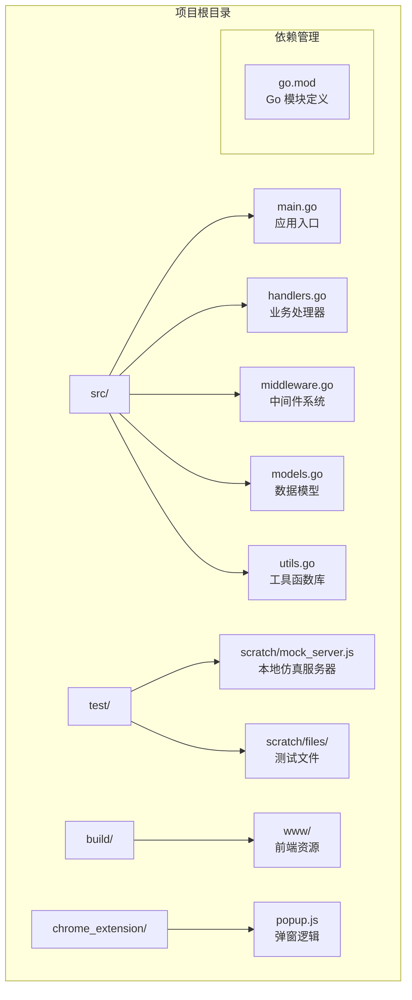
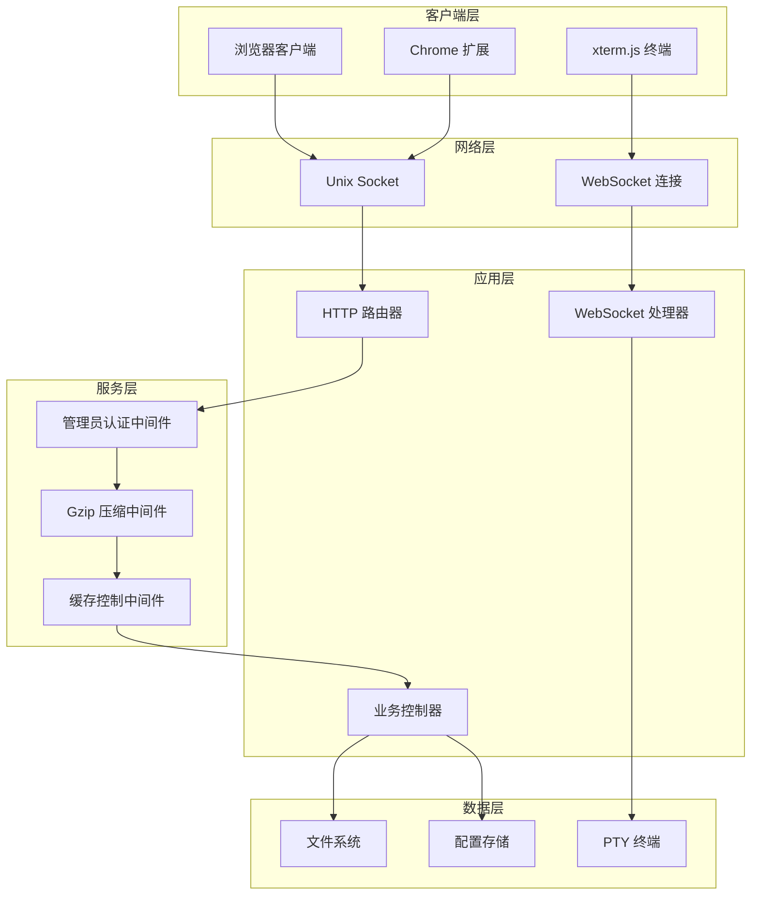
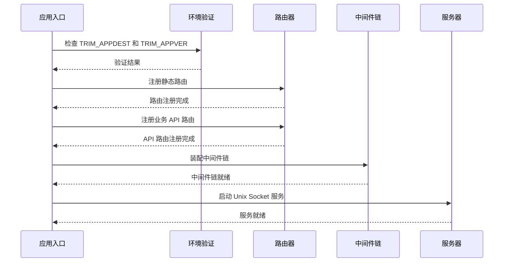
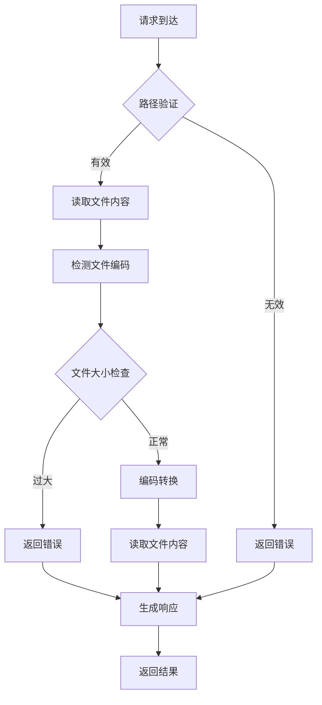
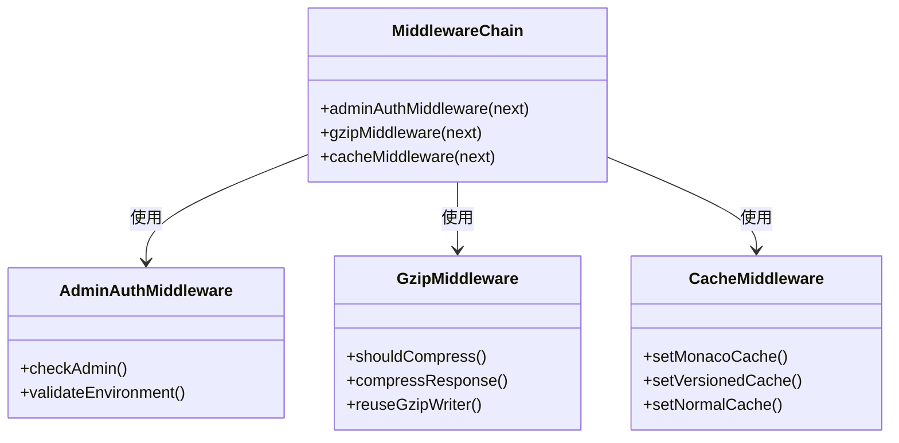
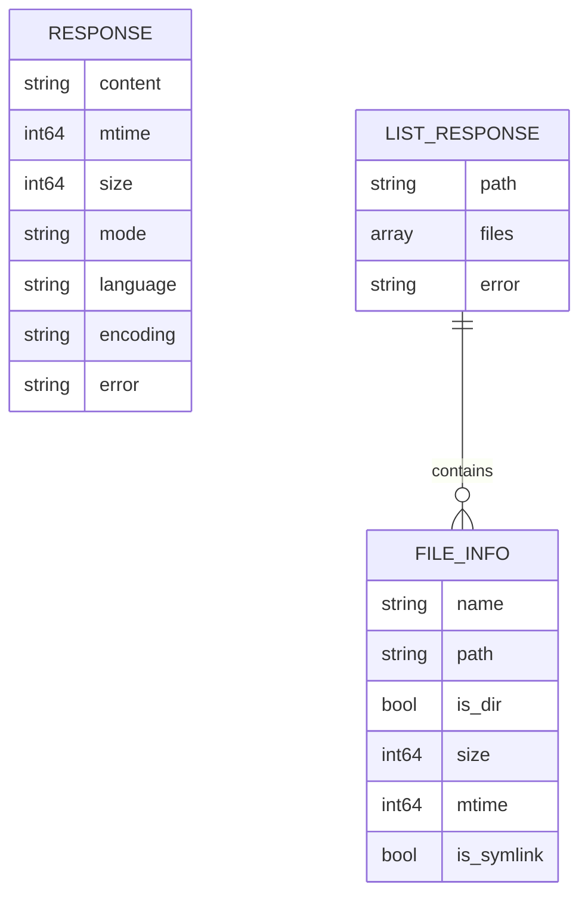
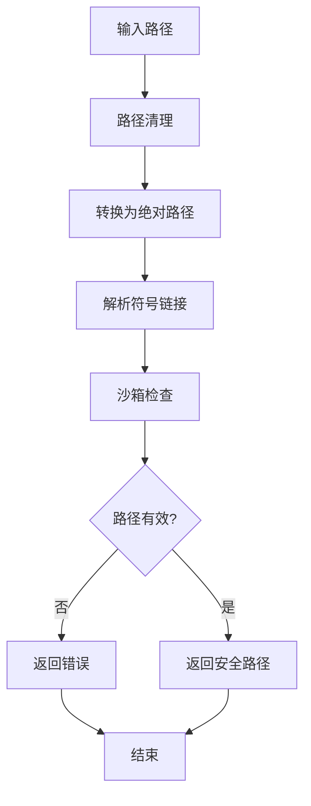
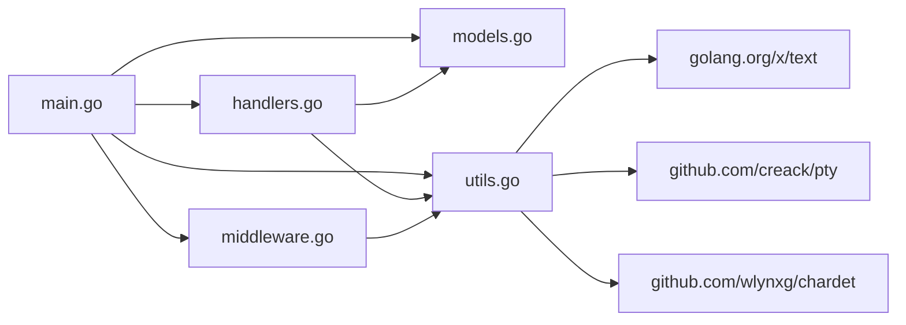

# 代码结构说明

<cite>
**本文档引用的文件**
- [main.go](file://src/main.go)
- [handlers.go](file://src/handlers.go)
- [middleware.go](file://src/middleware.go)
- [models.go](file://src/models.go)
- [utils.go](file://src/utils.go)
- [go.mod](file://src/go.mod)
- [README.md](file://README.md)
- [test/README.md](file://test/README.md)
</cite>

## 目录
1. [简介](#简介)
2. [项目结构](#项目结构)
3. [核心组件](#核心组件)
4. [架构总览](#架构总览)
5. [详细组件分析](#详细组件分析)
6. [依赖关系分析](#依赖关系分析)
7. [性能考虑](#性能考虑)
8. [故障排除指南](#故障排除指南)
9. [结论](#结论)

## 简介
本项目是一个基于飞牛OS（FNOS）适配的轻量极速文本编辑器后端服务，采用 Go 语言实现。项目遵循 MVC 架构模式，通过清晰的模块化组织实现了文件读写、编码处理、WebSocket 监控与终端桥接等核心功能。后端通过 Unix Socket 对外提供服务，结合前端 Monaco Editor 实现现代化的编辑体验。

## 项目结构
项目采用按职责划分的模块化组织方式，核心源文件位于 `src/` 目录，测试环境位于 `test/` 目录，构建资源位于 `build/` 目录，浏览器扩展位于 `chrome_extension/` 目录。

**图表来源**
- [main.go:1-145](file://src/main.go#L1-L145)
- [handlers.go:1-614](file://src/handlers.go#L1-L614)
- [middleware.go:1-103](file://src/middleware.go#L1-L103)
- [utils.go:1-262](file://src/utils.go#L1-L262)

**章节来源**
- [README.md:12-17](file://README.md#L12-L17)
- [go.mod:1-12](file://src/go.mod#L1-L12)

## 核心组件
项目采用经典的 MVC 架构模式，通过清晰的职责分离实现松耦合的系统设计：

### 控制器层（Controllers）
- **路由控制器**：负责 HTTP 路由注册和请求分发
- **业务处理器**：实现具体的业务逻辑处理
- **WebSocket 处理器**：处理实时通信场景

### 模型层（Models）
- **数据传输对象**：统一 API 响应格式
- **文件元数据模型**：封装目录项信息
- **配置模型**：管理用户设置

### 视图层（Views）
- **静态资源服务**：提供前端页面和资源文件
- **动态内容生成**：根据版本信息注入资源链接

### 服务层（Services）
- **中间件服务**：提供认证、压缩、缓存等功能
- **工具服务**：封装通用的辅助功能

**章节来源**
- [main.go:37-129](file://src/main.go#L37-L129)
- [models.go:3-29](file://src/models.go#L3-L29)

## 架构总览
系统采用单进程多路复用的架构设计，通过 Unix Socket 提供高性能的服务接口。

**图表来源**
- [main.go:15-144](file://src/main.go#L15-L144)
- [middleware.go:22-92](file://src/middleware.go#L22-L92)
- [handlers.go:426-516](file://src/handlers.go#L426-L516)

## 详细组件分析

### 应用入口组件（main.go）
应用入口负责初始化整个服务系统，包括环境变量验证、路由配置、中间件装配和 Unix Socket 监听。

#### 核心职责
- **环境初始化**：验证必需的环境变量并配置运行参数
- **路由注册**：建立静态资源服务和业务 API 路由
- **中间件装配**：构建中间件链以实现认证、压缩、缓存等功能
- **服务启动**：创建 Unix Socket 并启动 HTTP 服务器

#### 关键流程

**图表来源**
- [main.go:15-144](file://src/main.go#L15-L144)

**章节来源**
- [main.go:14-144](file://src/main.go#L14-L144)

### 业务处理器组件（handlers.go）
业务处理器实现具体的业务逻辑，包括文件操作、目录浏览、配置管理、WebSocket 监控和终端桥接。

#### 文件操作处理器
- **handleRead**：安全读取文件内容，支持多种编码格式
- **handleSave**：原子写入文件，防止数据丢失
- **handleCreate**：文件创建预检
- **handleNewFile**：物理文件创建

#### 目录操作处理器
- **handleList**：列出目录内容，支持排序和过滤

#### 配置管理处理器
- **handleSettings**：云端配置的读写操作

#### 实时通信处理器
- **handleWatchWS**：文件变化监控
- **handleTerminalWS**：终端会话管理

**图表来源**
- [handlers.go:114-212](file://src/handlers.go#L114-L212)

**章节来源**
- [handlers.go:21-611](file://src/handlers.go#L21-L611)

### 中间件系统组件（middleware.go）
中间件系统提供横切关注点的统一处理，包括管理员认证、Gzip 压缩和缓存控制。

#### 管理员认证中间件
- **功能**：验证请求是否来自管理员用户
- **实现**：检查 X-Trim-Isadmin 请求头
- **条件**：仅在生产环境（TRIM_APPDEST 设置时）生效

#### Gzip 压缩中间件
- **功能**：对合适的响应内容进行透明压缩
- **优化**：使用 sync.Pool 复用压缩器
- **例外**：WebSocket 升级请求不压缩

#### 缓存控制中间件
- **功能**：根据不同类型的资源设置合适的缓存策略
- **策略**：Monaco 核心资源强缓存一年，带版本号资源缓存 30 天

**图表来源**
- [middleware.go:22-92](file://src/middleware.go#L22-L92)

**章节来源**
- [middleware.go:14-103](file://src/middleware.go#L14-L103)

### 数据模型组件（models.go）
数据模型定义了系统中使用的数据结构，确保 API 响应的一致性和类型安全。

#### 核心数据模型
- **Response**：标准 API 响应结构，包含内容、元数据和错误信息
- **FileInfo**：目录项元数据，描述文件或目录的基本信息
- **ListResponse**：目录列表响应，包含路径和文件数组

**图表来源**
- [models.go:3-29](file://src/models.go#L3-L29)

**章节来源**
- [models.go:3-29](file://src/models.go#L3-L29)

### 工具函数组件（utils.go）
工具函数库提供系统运行所需的通用功能，包括路径安全验证、编码检测、语言识别和终端管理。

#### 核心工具函数
- **cleanAndValidatePath**：安全路径清理和验证，防止目录遍历攻击
- **detectLanguage**：基于扩展名和 shebang 的语言识别
- **predictEncoding**：字符编码自动检测
- **getEncoding**：编码转换器获取
- **startPty**：PTY 终端会话管理

**图表来源**
- [utils.go:25-53](file://src/utils.go#L25-L53)

**章节来源**
- [utils.go:25-262](file://src/utils.go#L25-L262)

## 依赖关系分析

### 外部依赖
项目使用 Go 模块管理系统，主要依赖包括：

- **golang.org/x/text**：文本编码处理和转换
- **github.com/creack/pty**：伪终端管理
- **github.com/wlynxg/chardet**：字符编码检测
- **golang.org/x/net**：网络工具和 WebSocket 支持

### 内部模块依赖

**图表来源**
- [go.mod:5-11](file://src/go.mod#L5-L11)
- [main.go:3-12](file://src/main.go#L3-L12)

**章节来源**
- [go.mod:1-12](file://src/go.mod#L1-L12)

## 性能考虑
系统在多个层面进行了性能优化：

### 编码处理优化
- **编码检测缓存**：避免重复的编码检测计算
- **流式处理**：大文件采用流式读取，避免内存溢出
- **智能压缩**：仅对合适的内容进行压缩

### 资源管理优化
- **连接池复用**：Gzip 压缩器使用 sync.Pool 复用
- **文件句柄管理**：及时关闭文件句柄，防止资源泄漏
- **内存优化**：合理使用缓冲区，避免不必要的内存分配

### 网络优化
- **Unix Socket**：减少网络开销，提高 IPC 效率
- **缓存策略**：针对不同资源类型设置最优缓存策略
- **异步处理**：WebSocket 连接采用异步读写模式

## 故障排除指南

### 常见问题诊断
1. **环境变量错误**
   - 检查 TRIM_APPDEST 和 TRIM_APPVER 是否正确设置
   - 确认应用容器环境配置完整

2. **权限问题**
   - 验证文件系统访问权限
   - 检查目录遍历防护机制

3. **编码问题**
   - 使用 predictEncoding 函数检测文件编码
   - 确认 getEncoding 返回正确的编码转换器

### 调试建议
- 启用详细的日志记录
- 使用测试目录中的 mock_server.js 进行本地调试
- 检查中间件链的执行顺序
- 验证 WebSocket 连接状态

**章节来源**
- [main.go:16-24](file://src/main.go#L16-L24)
- [handlers.go:114-212](file://src/handlers.go#L114-L212)

## 结论
本项目通过清晰的 MVC 架构和模块化设计，实现了高性能的文本编辑器后端服务。系统具备完善的错误处理机制、安全的路径验证和高效的资源管理。通过中间件系统实现了横切关注点的统一处理，通过工具函数库提供了丰富的辅助功能。整体设计既满足了飞牛OS平台的特殊需求，又保持了良好的可维护性和扩展性。