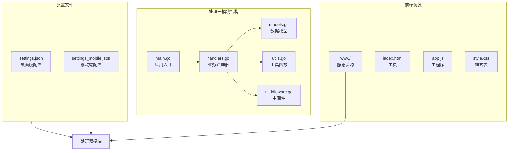
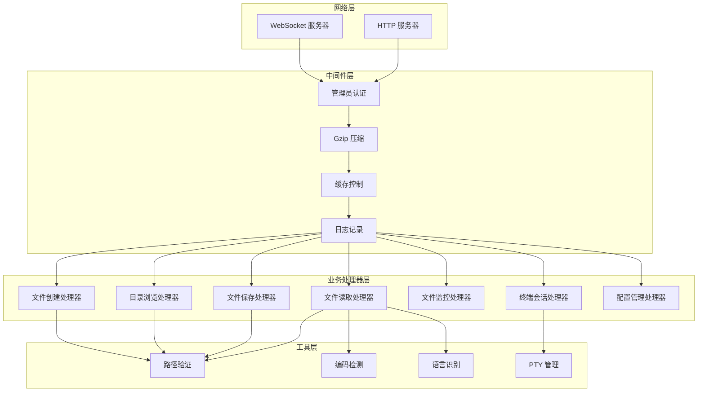
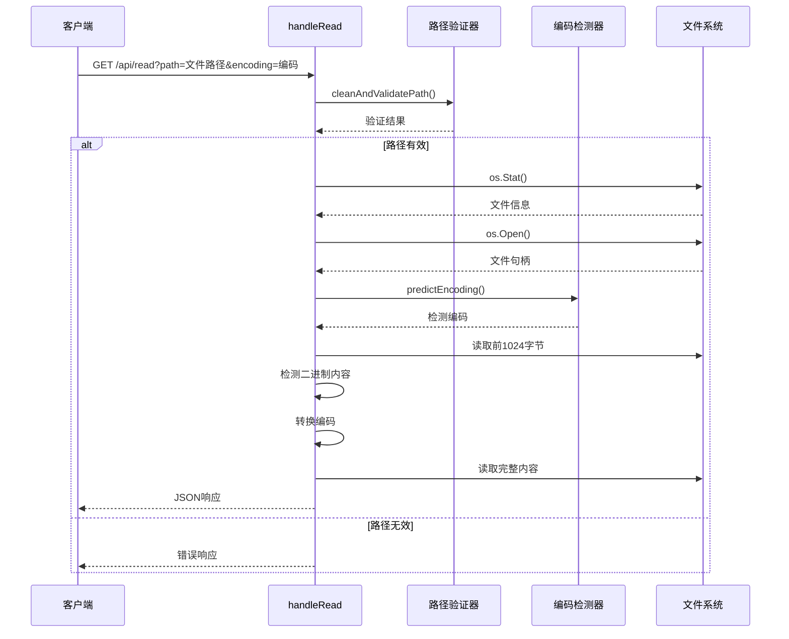
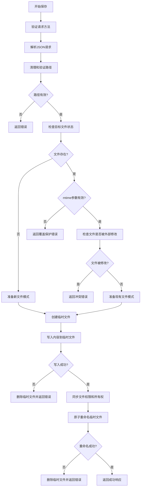
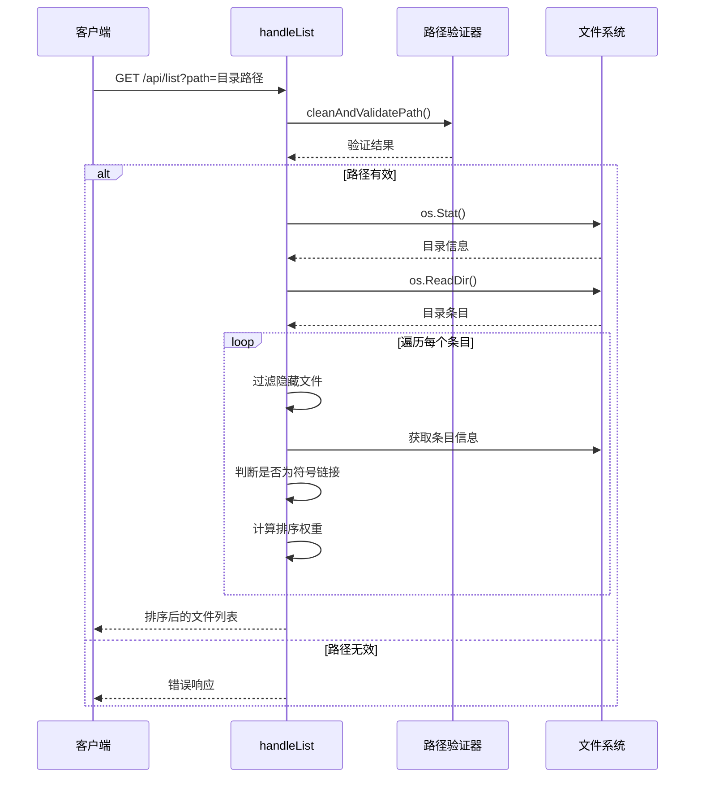
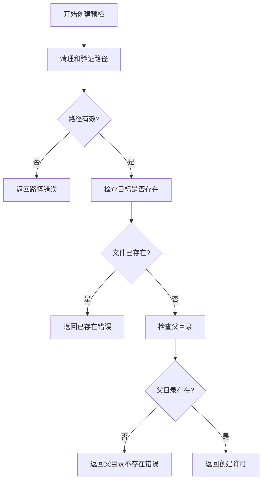
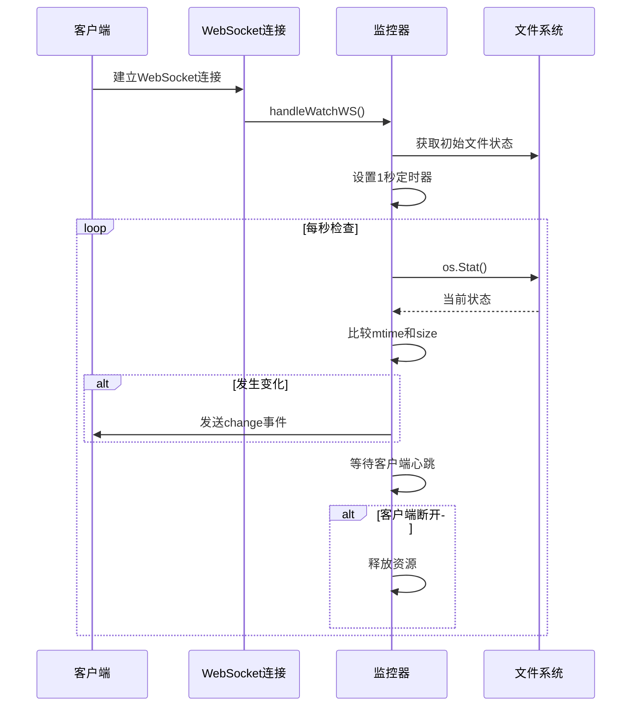
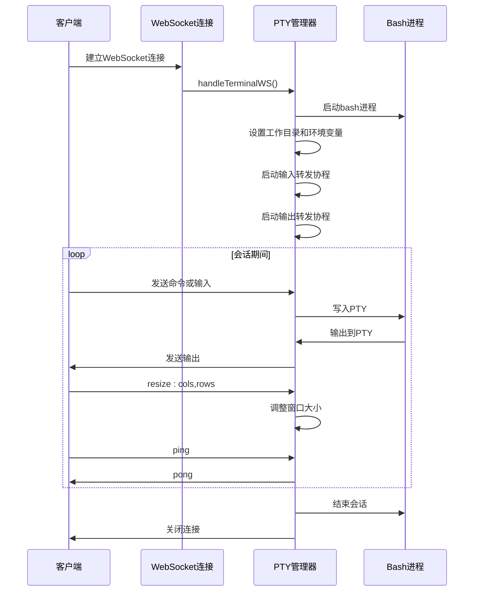
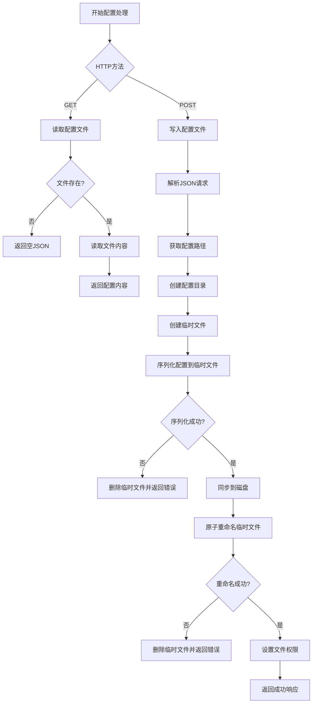
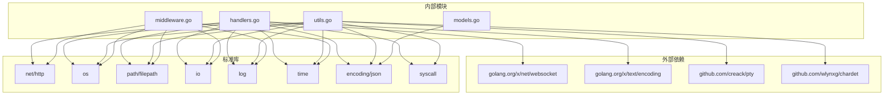

# 处理器模块 (handlers.go)

<cite>
**本文档引用的文件**
- [handlers.go](file://src/handlers.go)
- [main.go](file://src/main.go)
- [models.go](file://src/models.go)
- [utils.go](file://src/utils.go)
- [middleware.go](file://src/middleware.go)
</cite>

## 目录
1. [简介](#简介)
2. [项目结构](#项目结构)
3. [核心组件](#核心组件)
4. [架构概览](#架构概览)
5. [详细组件分析](#详细组件分析)
6. [依赖关系分析](#依赖关系分析)
7. [性能考虑](#性能考虑)
8. [故障排除指南](#故障排除指南)
9. [结论](#结论)

## 简介

处理器模块是 m.text.editor 文本编辑器后端服务的核心组件，负责处理所有业务逻辑请求。该模块实现了完整的文件管理系统，包括文件读取、保存、目录浏览、文件创建等功能，并提供了实时文件监控和终端会话管理能力。

该模块采用 Go 语言编写，基于标准库 HTTP 服务器构建，通过 Unix Socket 提供高性能的服务接口。系统集成了安全验证、编码检测、压缩传输、缓存控制等企业级特性。

## 项目结构

处理器模块位于 `src/` 目录下，包含以下关键文件：

**图表来源**
- [main.go:1-145](file://src/main.go#L1-L145)
- [handlers.go:1-614](file://src/handlers.go#L1-L614)

**章节来源**
- [main.go:15-145](file://src/main.go#L15-L145)
- [handlers.go:1-614](file://src/handlers.go#L1-L614)

## 核心组件

处理器模块包含以下核心组件：

### 数据模型组件

系统定义了统一的响应数据结构，确保所有 API 返回格式的一致性：

| 数据模型 | 字段 | 类型 | 描述 |
|---------|------|------|------|
| Response | Content | string | 文件内容（解码后） |
| Response | Mtime | int64 | 最后修改时间戳 |
| Response | Size | int64 | 文件大小（字节） |
| Response | Mode | string | 文件权限模式 |
| Response | Language | string | Monaco 语言标识符 |
| Response | Encoding | string | 推荐编码格式 |
| Response | Error | string | 错误信息描述 |
| FileInfo | Name | string | 文件名 |
| FileInfo | Path | string | 完整路径 |
| FileInfo | IsDir | bool | 是否为目录 |
| FileInfo | Size | int64 | 文件大小 |
| FileInfo | Mtime | int64 | 修改时间 |
| FileInfo | IsSymlink | bool | 是否为符号链接 |
| ListResponse | Path | string | 目录路径 |
| ListResponse | Files | []FileInfo | 文件列表 |
| ListResponse | Error | string | 错误信息 |

### 安全验证组件

系统实现了多层次的安全验证机制：

1. **路径清理验证**：防止目录遍历攻击
2. **管理员身份验证**：生产环境强制管理员权限
3. **应用目录保护**：禁止访问应用自身资源
4. **文件权限检查**：确保操作符合文件属性

**章节来源**
- [models.go:3-30](file://src/models.go#L3-L30)
- [utils.go:25-53](file://src/utils.go#L25-L53)
- [middleware.go:22-38](file://src/middleware.go#L22-L38)

## 架构概览

处理器模块采用分层架构设计，各组件职责明确：

**图表来源**
- [main.go:111-129](file://src/main.go#L111-L129)
- [handlers.go:21-614](file://src/handlers.go#L21-L614)
- [utils.go:167-261](file://src/utils.go#L167-L261)

## 详细组件分析

### 文件读取处理器 (handleRead)

文件读取处理器负责安全地读取文件内容并进行编码转换：

**图表来源**
- [handlers.go:114-212](file://src/handlers.go#L114-L212)
- [utils.go:25-53](file://src/utils.go#L25-L53)
- [utils.go:108-147](file://src/utils.go#L108-L147)

#### 处理流程特点

1. **安全验证**：使用 `cleanAndValidatePath` 防止路径遍历攻击
2. **大小限制**：限制最大文件大小为 10MB，保护系统性能
3. **编码检测**：自动检测文件编码格式
4. **二进制防护**：检测并拒绝二进制文件
5. **智能转码**：根据检测结果进行编码转换

#### 错误处理机制

- 路径无效：返回 "无效或缺失的路径"
- 文件不存在：返回 "文件不存在，请检查路径是否正确"
- 目标是目录：返回 "目标路径是一个文件夹，编辑器仅支持打开文件"
- 超过大小限制：返回 "文件超过 10MB，为保护编辑器性能，后端拒绝加载"
- 打开失败：返回 "打开文件失败: 错误详情"

**章节来源**
- [handlers.go:114-212](file://src/handlers.go#L114-L212)

### 文件保存处理器 (handleSave)

文件保存处理器实现了原子写入机制，确保数据完整性：

**图表来源**
- [handlers.go:214-324](file://src/handlers.go#L214-L324)

#### 原子写入机制

1. **临时文件创建**：先写入临时文件避免部分写入
2. **权限同步**：保持与原文件相同的权限和所有权
3. **原子重命名**：使用 `os.Rename` 确保写入的原子性
4. **错误回滚**：任何步骤失败都删除临时文件

#### 冲突检测机制

- **覆盖保护**：当 `mtime=0` 且文件存在时，防止意外覆盖
- **外部修改检测**：比较当前修改时间和请求中的 `mtime`
- **时间戳验证**：确保文件没有被其他进程修改

**章节来源**
- [handlers.go:214-324](file://src/handlers.go#L214-L324)

### 目录浏览处理器 (handleList)

目录浏览处理器提供安全的目录列表功能：

**图表来源**
- [handlers.go:21-112](file://src/handlers.go#L21-L112)

#### 目录处理特性

1. **隐藏文件过滤**：自动过滤以点开头的隐藏文件
2. **符号链接处理**：正确识别和处理符号链接
3. **智能排序**：目录优先显示，然后按名称排序
4. **元数据收集**：收集文件大小、修改时间、权限等信息

**章节来源**
- [handlers.go:21-112](file://src/handlers.go#L21-L112)

### 文件创建处理器 (handleCreate)

文件创建处理器提供文件预检功能：

**图表来源**
- [handlers.go:326-361](file://src/handlers.go#L326-L361)

**章节来源**
- [handlers.go:326-361](file://src/handlers.go#L326-L361)

### 物理文件创建处理器 (handleNewFile)

物理文件创建处理器执行实际的文件创建操作：

**章节来源**
- [handlers.go:363-424](file://src/handlers.go#L363-L424)

### 文件监控处理器 (handleWatchWS)

文件监控处理器基于 WebSocket 实现实时文件变化通知：

**图表来源**
- [handlers.go:426-494](file://src/handlers.go#L426-L494)

#### WebSocket 实现特点

1. **心跳检测**：客户端需要定期发送心跳包维持连接
2. **自动断开**：90秒无活动自动断开连接
3. **资源清理**：连接断开时自动释放监控资源
4. **错误处理**：文件被删除时发送错误通知

**章节来源**
- [handlers.go:426-494](file://src/handlers.go#L426-L494)

### 终端会话处理器 (handleTerminalWS)

终端会话处理器基于 PTY 实现 Web 终端功能：

**图表来源**
- [handlers.go:496-516](file://src/handlers.go#L496-L516)
- [utils.go:167-261](file://src/utils.go#L167-L261)

#### PTY 管理特性

1. **用户切换**：支持根据用户名切换执行用户
2. **窗口调整**：动态调整终端窗口大小
3. **超时控制**：90秒无活动自动断开
4. **资源清理**：会话结束时清理所有资源

**章节来源**
- [handlers.go:496-516](file://src/handlers.go#L496-L516)
- [utils.go:167-261](file://src/utils.go#L167-L261)

### 配置管理处理器 (handleSettings)

配置管理处理器提供云端配置的读写功能：

**图表来源**
- [handlers.go:531-611](file://src/handlers.go#L531-L611)

**章节来源**
- [handlers.go:531-611](file://src/handlers.go#L531-L611)

## 依赖关系分析

处理器模块的依赖关系如下：

**图表来源**
- [handlers.go:3-19](file://src/handlers.go#L3-L19)
- [utils.go:3-23](file://src/utils.go#L3-L23)
- [middleware.go:3-12](file://src/middleware.go#L3-L12)

### 关键依赖说明

1. **WebSocket 支持**：使用 `golang.org/x/net/websocket` 实现 WebSocket 功能
2. **文本编码**：使用 `golang.org/x/text/encoding` 处理多国语言编码
3. **PTY 管理**：使用 `github.com/creack/pty` 实现伪终端功能
4. **字符检测**：使用 `github.com/wlynxg/chardet` 检测文件编码
5. **压缩传输**：使用标准库 `compress/gzip` 实现 Gzip 压缩

**章节来源**
- [handlers.go:3-19](file://src/handlers.go#L3-L19)
- [utils.go:3-23](file://src/utils.go#L3-L23)
- [middleware.go:3-12](file://src/middleware.go#L3-L12)

## 性能考虑

### 编码检测优化

处理器实现了高效的编码检测机制：

1. **快速 UTF-8 检测**：使用 `utf8.Valid()` 进行快速检测
2. **智能字符检测**：对非 UTF-8 文件使用字符集检测库
3. **缓存策略**：避免重复的编码检测操作

### 文件操作优化

1. **原子写入**：使用临时文件 + 原子重命名确保数据一致性
2. **内存管理**：合理控制文件读取缓冲区大小
3. **并发控制**：使用 goroutine 处理异步操作

### 网络传输优化

1. **Gzip 压缩**：对合适的资源启用透明 Gzip 压缩
2. **缓存策略**：针对不同类型的资源设置合适的缓存策略
3. **WebSocket 优化**：实现心跳检测和超时控制

## 故障排除指南

### 常见问题诊断

#### 路径验证错误

**症状**：返回 "无效的路径" 或 "禁止访问系统受保护目录"

**可能原因**：
1. 路径包含非法字符或相对路径
2. 尝试访问应用自身资源目录
3. 权限不足访问目标目录

**解决方案**：
1. 使用绝对路径
2. 检查路径是否在允许范围内
3. 确认有足够的文件系统权限

#### 文件读取失败

**症状**：返回 "文件不存在，请检查路径是否正确"

**可能原因**：
1. 文件路径错误
2. 文件被其他进程占用
3. 文件权限不足

**解决方案**：
1. 验证文件路径的正确性
2. 检查文件是否存在且可读
3. 确认文件权限设置

#### 文件保存失败

**症状**：返回 "原子替换（重命名）失败"

**可能原因**：
1. 磁盘空间不足
2. 文件权限不足
3. 目标文件被锁定

**解决方案**：
1. 检查磁盘空间
2. 确认有写入权限
3. 关闭可能锁定文件的进程

#### WebSocket 连接问题

**症状**：WebSocket 连接立即断开

**可能原因**：
1. 客户端未发送心跳包
2. 路径参数无效
3. 权限不足

**解决方案**：
1. 确保客户端定期发送心跳
2. 验证路径参数的有效性
3. 检查管理员权限

**章节来源**
- [handlers.go:26-50](file://src/handlers.go#L26-L50)
- [handlers.go:118-144](file://src/handlers.go#L118-L144)
- [handlers.go:232-263](file://src/handlers.go#L232-L263)
- [handlers.go:427-441](file://src/handlers.go#L427-L441)

## 结论

处理器模块作为 m.text.editor 的核心组件，展现了优秀的架构设计和实现质量。该模块具有以下特点：

1. **安全性**：实现了多层次的安全验证机制，有效防止各种攻击
2. **可靠性**：采用原子操作和错误回滚机制，确保数据完整性
3. **性能**：优化的编码检测、压缩传输和资源管理
4. **可维护性**：清晰的代码结构和完善的错误处理机制

通过合理的组件分离、严格的输入验证和优雅的错误处理，该模块为上层应用提供了稳定可靠的文件管理和实时通信能力。建议在生产环境中配合适当的监控和日志记录机制，以进一步提升系统的可观测性和可维护性。