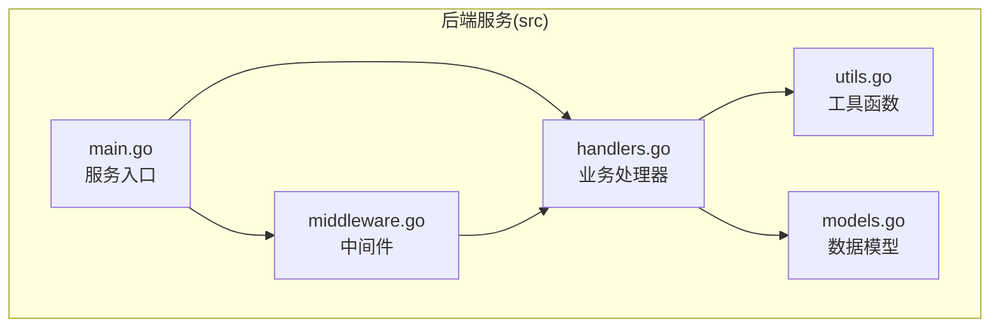
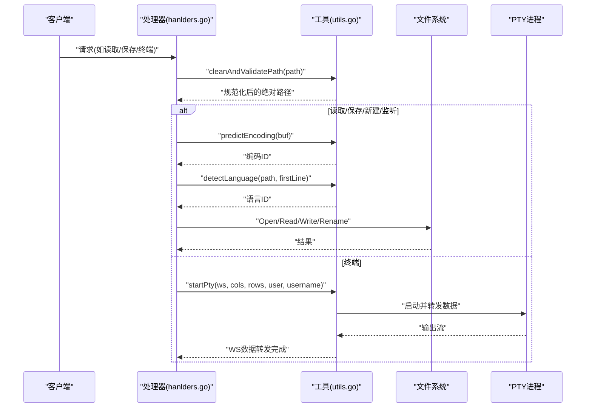
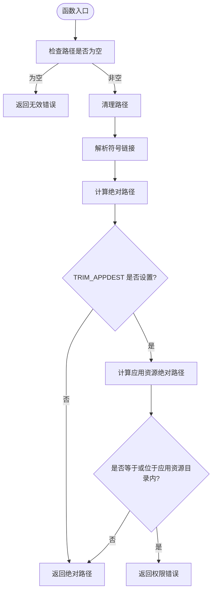
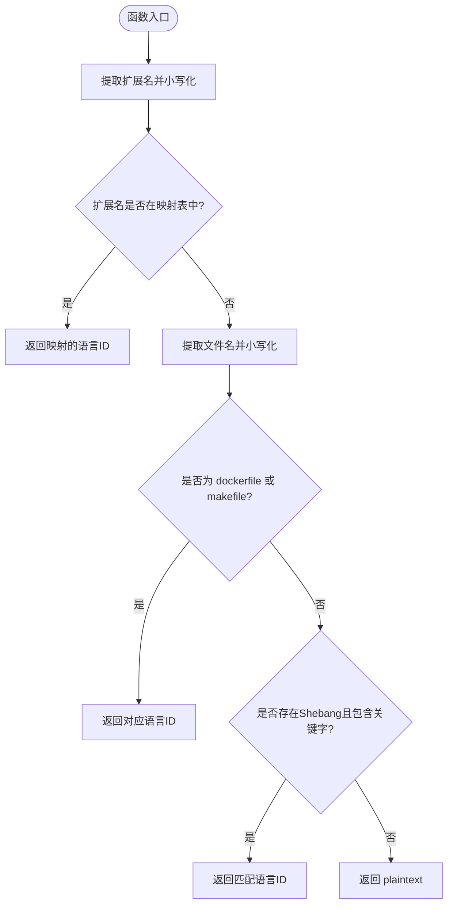
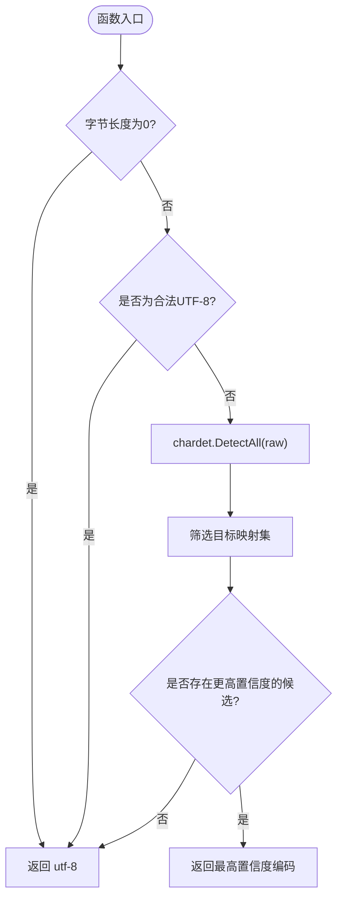
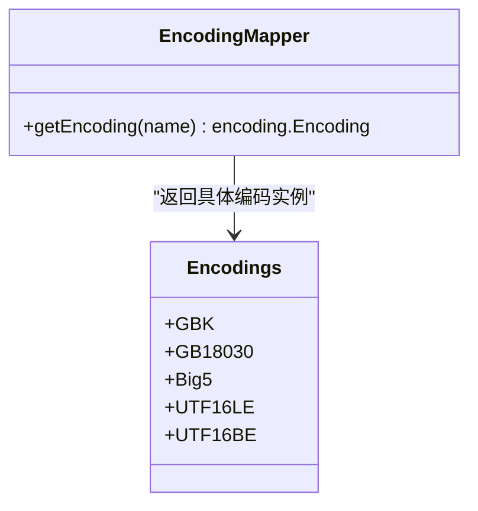
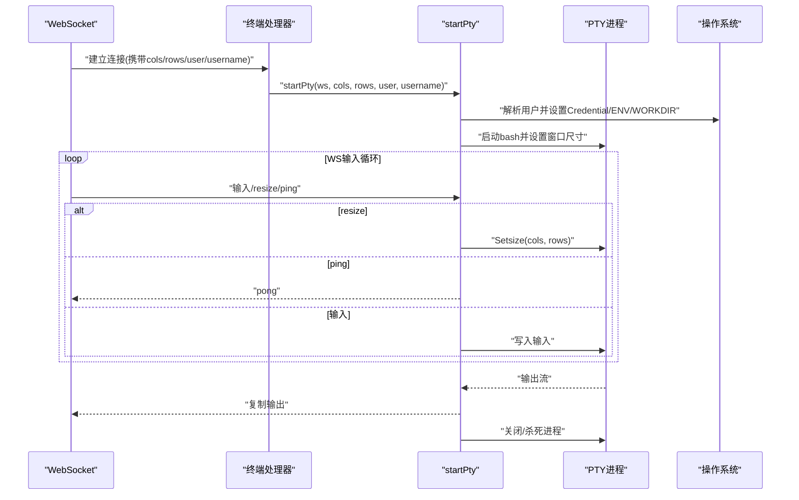
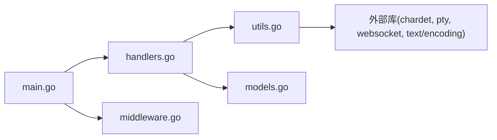

# 工具模块 (utils.go)

<cite>
**本文引用的文件**
- [utils.go](file://src/utils.go)
- [handlers.go](file://src/handlers.go)
- [main.go](file://src/main.go)
- [models.go](file://src/models.go)
- [middleware.go](file://src/middleware.go)
</cite>

## 目录
1. [简介](#简介)
2. [项目结构](#项目结构)
3. [核心组件](#核心组件)
4. [架构总览](#架构总览)
5. [详细组件分析](#详细组件分析)
6. [依赖关系分析](#依赖关系分析)
7. [性能考量](#性能考量)
8. [故障排查指南](#故障排查指南)
9. [结论](#结论)
10. [附录](#附录)

## 简介
本文件聚焦于工具模块（utils.go）中的工具函数设计与实现，涵盖以下主题：
- 路径安全验证：防范路径遍历攻击、符号链接逃逸、应用自身资源目录保护等
- 字符编码检测：基于 chardet 的多编码探测与 UTF-8/GBK/Big5/UTF-16LE/UTF-16BE 的映射策略
- 文件系统操作辅助：语言识别、终端 PTY 启动与 WebSocket 数据转发
- 安全验证机制：环境变量约束、权限检查、最小权限原则
- 编码检测算法：置信度阈值、优先级选择、回退策略
- 使用示例与最佳实践：如何在读取/保存/监控/终端场景中正确调用这些工具函数
- 依赖关系与调用规范：工具函数与处理器、中间件、模型定义之间的协作关系

## 项目结构
工具模块位于后端服务 src 目录下，与处理器、中间件、模型定义共同构成服务的核心能力层。工具函数被多个业务处理器复用，形成统一的安全与数据处理入口。

图表来源
- [utils.go:1-262](file://src/utils.go#L1-L262)
- [handlers.go:1-614](file://src/handlers.go#L1-L614)
- [main.go:1-145](file://src/main.go#L1-L145)
- [models.go:1-30](file://src/models.go#L1-L30)
- [middleware.go:1-103](file://src/middleware.go#L1-L103)

章节来源
- [main.go:14-144](file://src/main.go#L14-L144)
- [handlers.go:21-614](file://src/handlers.go#L21-L614)
- [utils.go:1-262](file://src/utils.go#L1-L262)

## 核心组件
工具模块包含以下关键函数：
- 路径安全验证：cleanAndValidatePath
- 语言识别：detectLanguage
- 字符编码预测：predictEncoding
- 编码转换器获取：getEncoding
- 终端会话启动：startPty

这些函数被处理器（如读取、保存、新建、监听、终端）在进入文件系统操作前统一调用，确保安全与一致性。

章节来源
- [utils.go:25-165](file://src/utils.go#L25-L165)
- [handlers.go:21-614](file://src/handlers.go#L21-L614)

## 架构总览
工具函数在服务中的位置与职责如下：
- 安全前置：所有涉及文件系统路径的操作均通过 cleanAndValidatePath 进行标准化与限制
- 数据预处理：predictEncoding 与 detectLanguage 在读取阶段提供编码与语言建议
- 终端能力：startPty 将 WebSocket 与 PTY 结合，提供安全可控的终端会话
- 编码适配：getEncoding 提供针对不同编码的解码/编码转换器

图表来源
- [handlers.go:114-212](file://src/handlers.go#L114-L212)
- [handlers.go:214-324](file://src/handlers.go#L214-L324)
- [handlers.go:326-424](file://src/handlers.go#L326-L424)
- [handlers.go:426-494](file://src/handlers.go#L426-L494)
- [handlers.go:496-516](file://src/handlers.go#L496-L516)
- [utils.go:25-165](file://src/utils.go#L25-L165)
- [utils.go:167-261](file://src/utils.go#L167-L261)

## 详细组件分析

### 路径安全验证：cleanAndValidatePath
- 设计目标
  - 清洗输入路径，避免相对路径、上溯目录、重复分隔符等问题
  - 解析符号链接，防止通过符号链接绕过限制
  - 绝对化路径，统一后续比较与判断
  - 应用资源目录保护：当 TRIM_APPDEST 设置时，禁止访问该目录及其子目录
- 实现要点
  - 空路径返回无效错误
  - 使用 Clean/EvalSymlinks/Abs 三步走
  - 通过环境变量 TRIM_APPDEST 计算绝对路径并进行前缀匹配
  - 返回标准化后的绝对路径或错误
- 安全意义
  - 防止路径遍历攻击（如 ../..）
  - 防止符号链接逃逸（如链接到系统敏感文件）
  - 保护应用自身资源目录不被读取/修改
- 调用方
  - 列表、读取、保存、新建、监听、设置等处理器均先调用该函数

图表来源
- [utils.go:25-53](file://src/utils.go#L25-L53)

章节来源
- [utils.go:25-53](file://src/utils.go#L25-L53)
- [handlers.go:21-112](file://src/handlers.go#L21-L112)

### 语言识别：detectLanguage
- 设计目标
  - 基于文件扩展名与特殊文件名快速识别语言
  - 支持 Shebang（如 #!/usr/bin/env python）识别
  - 为编辑器提供 Monaco 语言 ID，便于语法高亮与智能提示
- 实现要点
  - 扩展名映射表覆盖常见编程/标记/配置语言
  - 特殊文件名（如 Dockerfile、Makefile）单独处理
  - 若存在 Shebang，根据关键字匹配语言
  - 默认返回 plaintext
- 适用场景
  - 读取文件时自动推断语言
  - 新建文件时预检语言类型
- 调用方
  - 读取处理器在返回响应时设置语言字段
  - 新建处理器在预检阶段设置语言字段

图表来源
- [utils.go:55-106](file://src/utils.go#L55-L106)

章节来源
- [utils.go:55-106](file://src/utils.go#L55-L106)
- [handlers.go:108-212](file://src/handlers.go#L108-L212)

### 字符编码预测：predictEncoding
- 设计目标
  - 对未知编码的原始字节进行多编码探测
  - 优先返回高置信度的常用编码
  - 回退至 UTF-8，保证兼容性
- 实现要点
  - 空字节串默认 UTF-8
  - 先判定是否为合法 UTF-8
  - 使用 chardet.DetectAll 获取候选集
  - 目标映射：UTF-8、GB2312/GB18030、UTF-16LE/UTF-16BE、BIG5
  - 选择置信度最高的目标编码，阈值 > 0.5
  - 无合适候选时回退 UTF-8
- 适用场景
  - 读取文件时自动推断编码，避免乱码
  - 与前端约定的编码参数冲突时给出建议
- 调用方
  - 读取处理器在读取前读取首段字节并调用该函数
  - 读取处理器在必要时对二进制内容进行二次校验

图表来源
- [utils.go:108-147](file://src/utils.go#L108-L147)

章节来源
- [utils.go:108-147](file://src/utils.go#L108-L147)
- [handlers.go:153-212](file://src/handlers.go#L153-L212)

### 编码转换器获取：getEncoding
- 设计目标
  - 将字符串形式的编码名称映射为对应的 text/encoding 实例
  - 支持 GBK、GB18030、Big5、UTF-16LE、UTF-16BE
  - 未知编码返回空，交由调用方决定处理方式
- 实现要点
  - 使用 golang.org/x/text/encoding 及其子包
  - UTF-16LE/BE 使用带 BOM 忽略策略
- 适用场景
  - 读取阶段对非 UTF-8 内容进行解码
  - 保存阶段对内容进行编码写入
- 调用方
  - 读取处理器在需要时创建 Decoder
  - 保存处理器在需要时创建 Encoder

图表来源
- [utils.go:149-165](file://src/utils.go#L149-L165)

章节来源
- [utils.go:149-165](file://src/utils.go#L149-L165)
- [handlers.go:185-189](file://src/handlers.go#L185-L189)
- [handlers.go:278-282](file://src/handlers.go#L278-L282)

### 终端会话启动：startPty
- 设计目标
  - 通过 WebSocket 建立交互式终端会话
  - 支持窗口尺寸变更与心跳保活
  - 支持按用户名切换执行用户与家目录
  - 严格超时控制，避免资源泄漏
- 实现要点
  - 解析 cols/rows 参数，设置 PTY 尺寸
  - 设置 TERM/LANG 等环境变量
  - 用户切换：lookup 用户、设置 Credential、HOME/USER/LOGNAME
  - 工作目录：优先用户家目录，否则 root
  - 启动 bash PTY，转发 WS 输入与 PTY 输出
  - 处理 resize 命令与 ping/pong 心跳
  - 90 秒无交互自动断开
- 安全与健壮性
  - 管理员鉴权：TRIM_APPDEST 存在时要求 X-Trim-Isadmin=true
  - 异常时向 WS 发送错误消息
  - 会话结束后清理进程与资源
- 调用方
  - 终端处理器在建立 WS 连接后调用该函数

图表来源
- [handlers.go:496-516](file://src/handlers.go#L496-L516)
- [utils.go:167-261](file://src/utils.go#L167-L261)

章节来源
- [utils.go:167-261](file://src/utils.go#L167-L261)
- [handlers.go:496-516](file://src/handlers.go#L496-L516)

## 依赖关系分析
- 内部依赖
  - handlers.go 依赖 utils.go 中的 cleanAndValidatePath、predictEncoding、detectLanguage、getEncoding、startPty
  - models.go 为 handlers.go 的响应结构提供类型定义
  - middleware.go 为 main.go 提供中间件链，间接影响工具函数的调用上下文
- 外部依赖
  - chardet：编码检测
  - x/text/encoding：编码转换
  - creack/pty：伪终端
  - x/net/websocket：WebSocket
  - os/exec、os/user、syscall：系统调用与权限

图表来源
- [handlers.go:1-614](file://src/handlers.go#L1-L614)
- [utils.go:1-262](file://src/utils.go#L1-L262)
- [models.go:1-30](file://src/models.go#L1-L30)
- [middleware.go:1-103](file://src/middleware.go#L1-L103)
- [main.go:1-145](file://src/main.go#L1-L145)

章节来源
- [handlers.go:1-614](file://src/handlers.go#L1-L614)
- [utils.go:1-262](file://src/utils.go#L1-L262)
- [models.go:1-30](file://src/models.go#L1-L30)
- [middleware.go:1-103](file://src/middleware.go#L1-L103)
- [main.go:1-145](file://src/main.go#L1-L145)

## 性能考量
- 编码检测
  - chardet.DetectAll 会对输入进行多候选扫描，建议仅对文件开头有限字节进行检测（如 1KB），避免大文件带来的额外开销
  - 置信度阈值 > 0.5，减少误判概率
- 终端会话
  - 90 秒超时断开，避免长时间挂起导致的资源泄漏
  - resize/ping 采用轻量协议，降低网络负担
- 文件读取
  - 读取阶段仅读取首段字节用于编码检测，随后按需完整读取
  - 保存阶段采用临时文件 + 原子重命名，减少并发写入风险

[本节为通用性能讨论，无需列出章节来源]

## 故障排查指南
- 路径相关
  - 症状：返回“无效路径”或“禁止访问系统受保护目录”
  - 排查：确认 TRIM_APPDEST 是否设置；检查路径是否位于应用资源目录内；确认路径非空且可解析
- 编码相关
  - 症状：读取文件出现乱码或提示二进制内容
  - 排查：确认 predictEncoding 的置信度阈值与目标映射；检查文件是否为 UTF-16/二进制；必要时手动指定编码
- 语言识别
  - 症状：语言高亮不正确
  - 排查：确认扩展名是否在映射表中；检查特殊文件名与 Shebang 是否被正确识别
- 终端相关
  - 症状：无法启动终端或连接立即断开
  - 排查：确认管理员鉴权头 X-Trim-Isadmin；检查 cols/rows 参数；确认用户存在且具备执行权限；观察超时断开日志

章节来源
- [utils.go:25-53](file://src/utils.go#L25-L53)
- [utils.go:108-147](file://src/utils.go#L108-L147)
- [handlers.go:114-212](file://src/handlers.go#L114-L212)
- [handlers.go:496-516](file://src/handlers.go#L496-L516)

## 结论
工具模块通过统一的安全前置与数据预处理能力，为整个后端服务提供了可靠、一致且安全的文件系统与数据处理基础。路径安全验证、编码检测与语言识别构成了读取流程的关键环节；终端会话启动则为运维与开发提供了安全可控的交互通道。遵循本文的最佳实践与调用规范，可在保证安全性的同时提升用户体验与系统稳定性。

[本节为总结性内容，无需列出章节来源]

## 附录

### 使用示例与最佳实践
- 读取文件
  - 步骤：先 cleanAndValidatePath，再 predictEncoding，必要时检测二进制，最后 getEncoding 解码
  - 注意：控制最大文件大小，避免内存压力
- 保存文件
  - 步骤：先 cleanAndValidatePath，再 getEncoding 编码，写入临时文件，同步并原子重命名
  - 注意：保留原文件权限与属主，必要时进行同步
- 新建/监听/设置
  - 步骤：统一使用 cleanAndValidatePath；语言识别使用 detectLanguage；设置读写使用原子文件策略
- 终端
  - 步骤：管理员鉴权，startPty 启动，处理 resize/ping，90 秒超时断开

章节来源
- [handlers.go:114-324](file://src/handlers.go#L114-L324)
- [handlers.go:326-424](file://src/handlers.go#L326-L424)
- [handlers.go:426-516](file://src/handlers.go#L426-L516)
- [utils.go:25-165](file://src/utils.go#L25-L165)
- [utils.go:167-261](file://src/utils.go#L167-L261)