# 数据模型模块 (models.go)

<cite>
**本文档引用的文件**
- [models.go](file://src/models.go)
- [handlers.go](file://src/handlers.go)
- [utils.go](file://src/utils.go)
- [main.go](file://src/main.go)
</cite>

## 目录
1. [简介](#简介)
2. [项目结构](#项目结构)
3. [核心数据模型](#核心数据模型)
4. [架构概览](#架构概览)
5. [详细组件分析](#详细组件分析)
6. [依赖关系分析](#依赖关系分析)
7. [性能考虑](#性能考虑)
8. [故障排除指南](#故障排除指南)
9. [结论](#结论)

## 简介

数据模型模块是 m.text.editor 文本编辑器后端服务的核心组成部分，负责定义和管理所有 API 响应数据结构。该模块提供了标准化的数据传输格式，确保前后端之间的数据交换一致性和可靠性。

本文档深入分析了 models.go 文件中的所有数据结构设计，包括 Response 结构体、FileInfo 结构体、ListResponse 结构体等核心数据模型，详细说明每个字段的含义、数据类型、验证规则以及它们之间的关系。

## 项目结构

数据模型模块位于项目的 `src` 目录下，与业务逻辑处理器和工具函数共同构成了完整的后端服务架构。

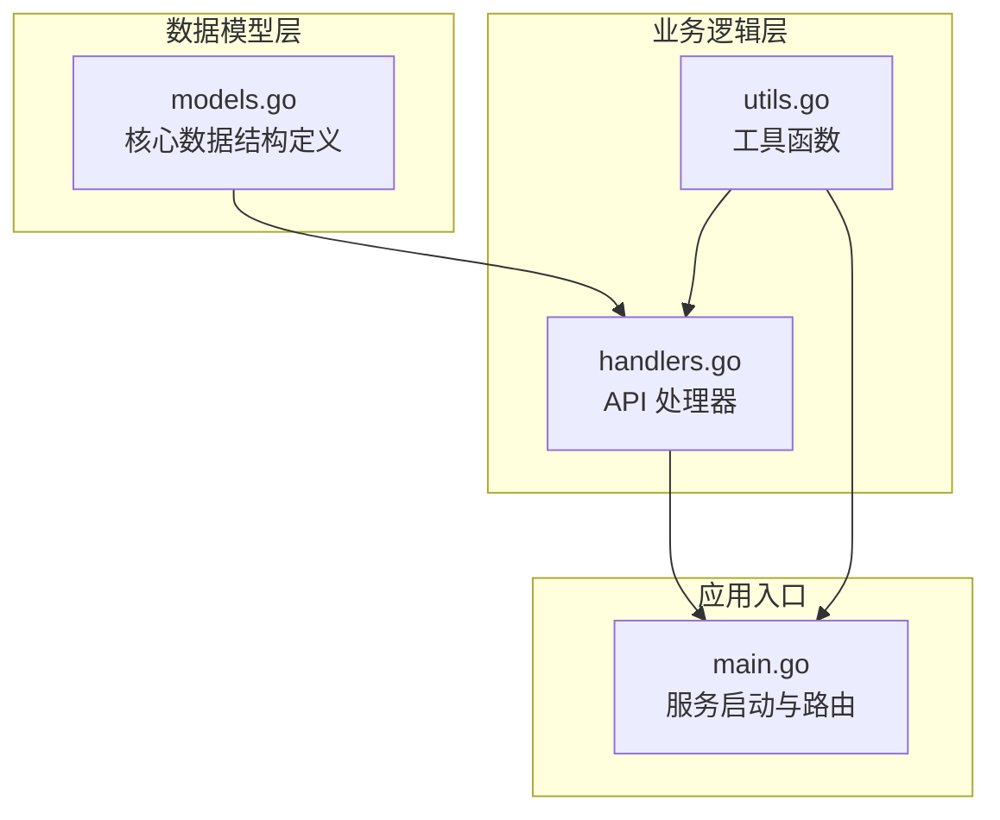

**图表来源**
- [models.go:1-30](file://src/models.go#L1-L30)
- [handlers.go:1-614](file://src/handlers.go#L1-L614)
- [main.go:1-145](file://src/main.go#L1-L145)

**章节来源**
- [models.go:1-30](file://src/models.go#L1-L30)
- [main.go:1-145](file://src/main.go#L1-L145)

## 核心数据模型

### Response 结构体

Response 结构体是整个系统中最核心的数据模型，用于标准化所有 API 响应格式。

#### 字段定义与含义

| 字段名 | 类型 | JSON 标签 | 可选性 | 描述 |
|--------|------|-----------|--------|------|
| Content | string | `"content,omitempty"` | 可选 | 文件内容（解压/转码后） |
| Mtime | int64 | `"mtime,omitempty"` | 可选 | 最后修改时间戳（Unix 时间戳） |
| Size | int64 | `"size,omitempty"` | 可选 | 文件原始字节大小 |
| Mode | string | `"mode,omitempty"` | 可选 | 文件权限位描述（如 `-rw-r--r--`） |
| Language | string | `"language,omitempty"` | 可选 | Monaco 编辑器语言 ID（如 `javascript`、`python`） |
| Encoding | string | `"encoding,omitempty"` | 可选 | 建议的编码格式（如 `utf-8`、`gb18030`） |
| Error | string | `"error,omitempty"` | 可选 | 错误信息描述 |

#### 验证规则

- **Content 字段**：当操作成功时包含文件内容，失败时为空
- **Mtime 字段**：必须为有效的 Unix 时间戳，表示文件最后修改时间
- **Size 字段**：必须为非负整数，表示文件大小（字节）
- **Mode 字段**：遵循标准 Unix 文件权限格式
- **Language 字段**：必须是有效的 Monaco 编辑器支持的语言标识符
- **Encoding 字段**：必须是有效的字符编码格式标识符
- **Error 字段**：当操作失败时包含具体的错误描述

#### 使用示例

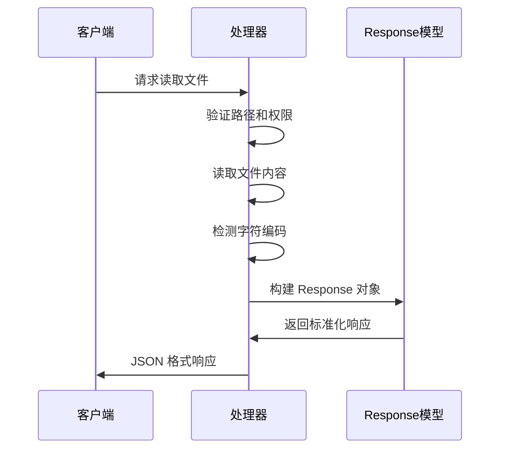

**图表来源**
- [handlers.go:114-212](file://src/handlers.go#L114-L212)
- [models.go:4-12](file://src/models.go#L4-L12)

### FileInfo 结构体

FileInfo 结构体用于描述目录项的元数据信息，是目录列表功能的核心数据模型。

#### 字段定义与含义

| 字段名 | 类型 | JSON 标签 | 必需性 | 描述 |
|--------|------|-----------|--------|------|
| Name | string | `"name"` | 必需 | 文件或目录的名称 |
| Path | string | `"path"` | 必需 | 文件或目录的完整路径 |
| IsDir | bool | `"is_dir"` | 必需 | 是否为目录的布尔标志 |
| Size | int64 | `"size"` | 必需 | 文件大小（字节），目录为 0 |
| Mtime | int64 | `"mtime"` | 必需 | 修改时间戳（Unix 时间戳） |
| IsSymlink | bool | `"is_symlink"` | 必需 | 是否为符号链接的布尔标志 |

#### 验证规则

- **Name 字段**：必须是非空字符串，不能以点开头（隐藏文件会被过滤）
- **Path 字段**：必须是有效的绝对路径，经过安全验证
- **IsDir 字段**：布尔值，准确反映对象类型
- **Size 字段**：非负整数，目录大小通常为 0
- **Mtime 字段**：有效的 Unix 时间戳
- **IsSymlink 字段**：布尔值，准确反映符号链接状态

#### 使用示例

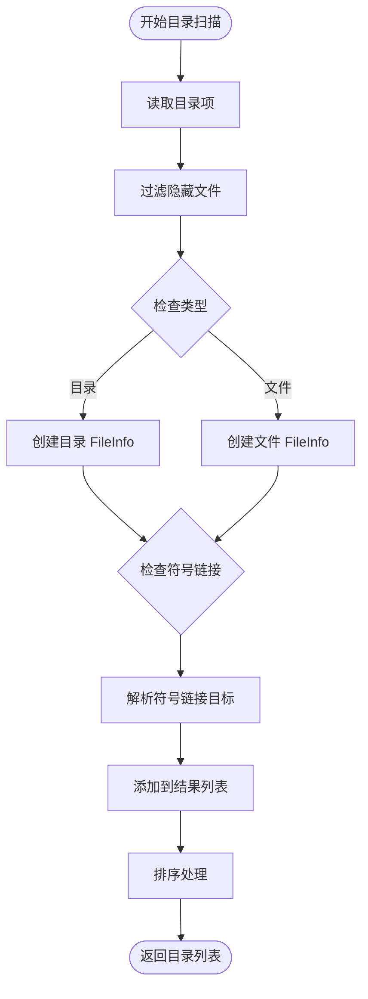

**图表来源**
- [handlers.go:21-112](file://src/handlers.go#L21-L112)
- [models.go:14-22](file://src/models.go#L14-L22)

### ListResponse 结构体

ListResponse 结构体用于封装目录列表的完整响应，包含路径信息、文件列表和错误状态。

#### 字段定义与含义

| 字段名 | 类型 | JSON 标签 | 可选性 | 描述 |
|--------|------|-----------|--------|------|
| Path | string | `"path,omitempty"` | 可选 | 请求的目标目录路径 |
| Files | []FileInfo | `"files,omitempty"` | 可选 | 目录项列表（FileInfo 数组） |
| Error | string | `"error,omitempty"` | 可选 | 错误信息描述 |

#### 验证规则

- **Path 字段**：当操作成功时包含请求的目录路径
- **Files 字段**：数组元素必须都是有效的 FileInfo 对象
- **Error 字段**：当操作失败时包含具体的错误描述

#### 使用示例

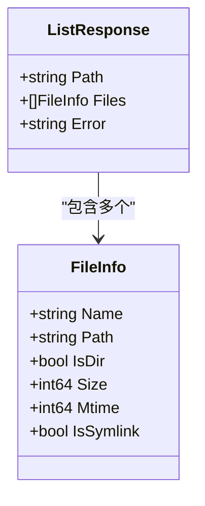

**图表来源**
- [models.go:24-29](file://src/models.go#L24-L29)
- [models.go:14-22](file://src/models.go#L14-L22)

**章节来源**
- [models.go:4-29](file://src/models.go#L4-L29)
- [handlers.go:21-112](file://src/handlers.go#L21-L112)

## 架构概览

数据模型模块在整个系统架构中扮演着关键角色，通过标准化的数据格式确保各组件间的松耦合通信。

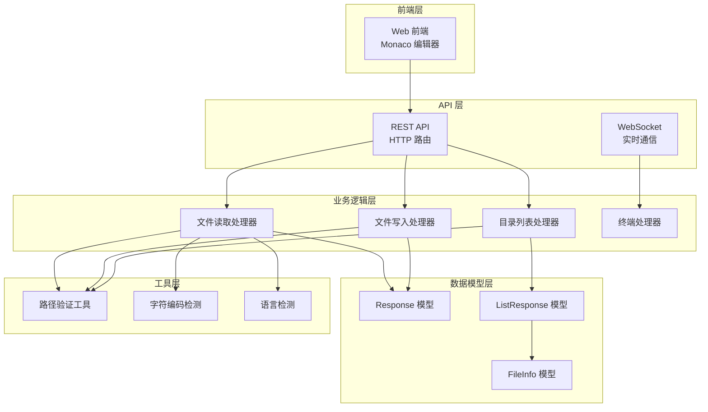

**图表来源**
- [main.go:111-119](file://src/main.go#L111-L119)
- [handlers.go:114-424](file://src/handlers.go#L114-L424)
- [models.go:4-29](file://src/models.go#L4-L29)

## 详细组件分析

### Response 模型深度分析

Response 模型是整个系统的数据传输核心，采用可选字段设计来适应不同的操作场景。

#### 设计模式

Response 模型采用了 Go 语言的标准 JSON 标签模式，结合 `omitempty` 选项实现条件序列化：

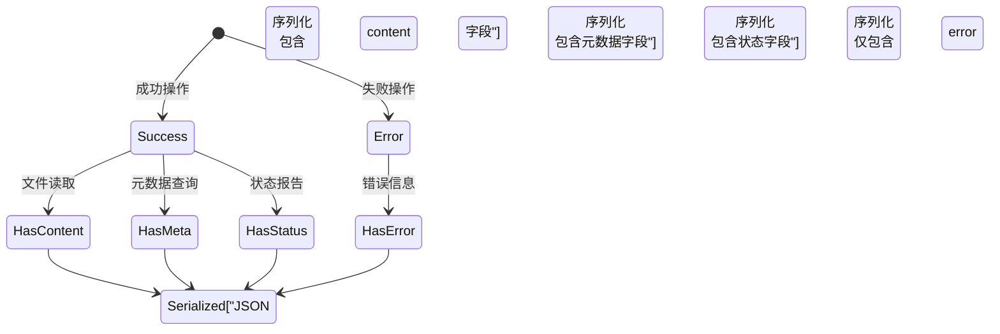

**图表来源**
- [models.go:4-12](file://src/models.go#L4-L12)
- [handlers.go:114-212](file://src/handlers.go#L114-L212)

#### 序列化和反序列化实现

Response 模型的序列化过程由 Go 标准库自动处理，利用 JSON 标签定义字段映射关系。反序列化过程通过 `json.NewDecoder` 实现，支持动态字段解析。

**章节来源**
- [models.go:4-12](file://src/models.go#L4-L12)
- [handlers.go:114-212](file://src/handlers.go#L114-L212)

### FileInfo 模型详细分析

FileInfo 模型专门用于目录项的元数据描述，设计简洁而功能完整。

#### 数据完整性保证

FileInfo 模型通过严格的字段验证确保数据完整性：

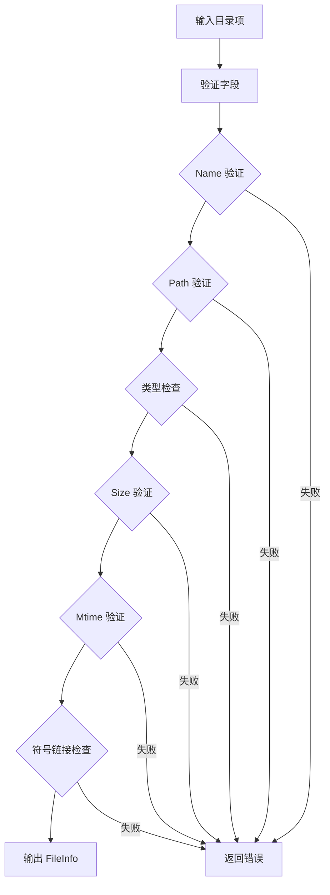

**图表来源**
- [handlers.go:63-96](file://src/handlers.go#L63-L96)
- [models.go:14-22](file://src/models.go#L14-L22)

#### 关系映射

FileInfo 模型与操作系统文件系统紧密对应，通过以下映射关系实现：

| FileInfo 字段 | 操作系统对应属性 | 获取方式 |
|---------------|-------------------|----------|
| Name | 文件名 | `entry.Name()` |
| Path | 完整路径 | `filepath.Join(path, name)` |
| IsDir | 目录标志 | `entry.IsDir()` |
| Size | 文件大小 | `info.Size()` |
| Mtime | 修改时间 | `info.ModTime().Unix()` |
| IsSymlink | 符号链接 | `entry.Type()&os.ModeSymlink != 0` |

**章节来源**
- [handlers.go:63-96](file://src/handlers.go#L63-L96)
- [models.go:14-22](file://src/models.go#L14-L22)

### ListResponse 模型综合分析

ListResponse 模型作为目录列表的统一响应格式，整合了路径信息、文件列表和错误状态。

#### 数据流处理

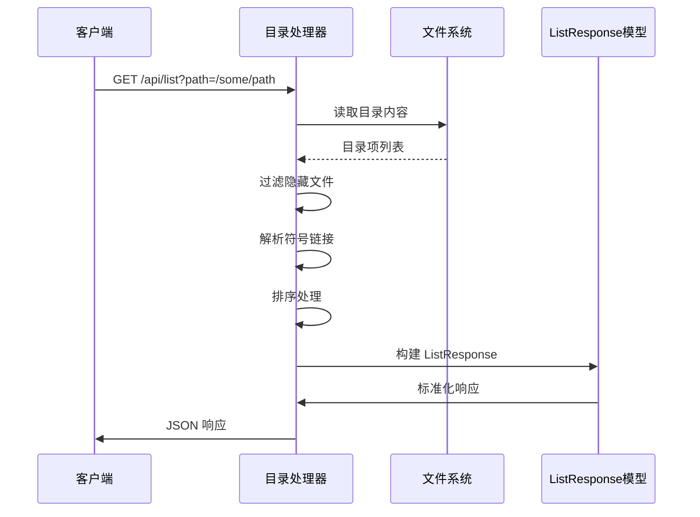

**图表来源**
- [handlers.go:21-112](file://src/handlers.go#L21-L112)
- [models.go:24-29](file://src/models.go#L24-L29)

**章节来源**
- [handlers.go:21-112](file://src/handlers.go#L21-L112)
- [models.go:24-29](file://src/models.go#L24-L29)

## 依赖关系分析

数据模型模块与其他组件之间存在清晰的依赖关系，形成了层次化的架构设计。

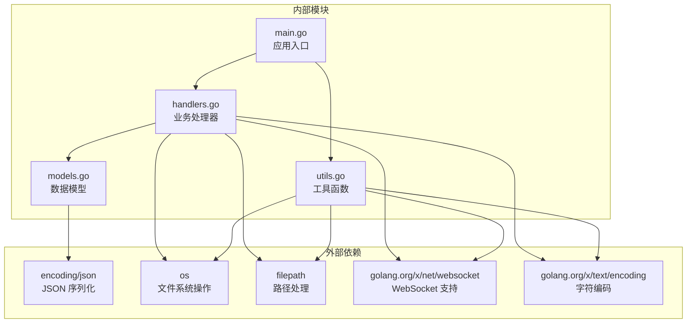

**图表来源**
- [models.go:1-30](file://src/models.go#L1-L30)
- [handlers.go:1-614](file://src/handlers.go#L1-L614)
- [utils.go:1-262](file://src/utils.go#L1-L262)
- [main.go:1-145](file://src/main.go#L1-L145)

### 组件耦合度分析

数据模型模块具有较低的内部耦合度，主要体现在：

1. **单一职责原则**：每个结构体专注于特定的数据表示
2. **接口隔离**：通过 JSON 标签实现清晰的接口定义
3. **依赖倒置**：业务处理器依赖于抽象的数据模型而非具体实现

### 循环依赖检测

经过分析，数据模型模块不存在循环依赖问题：
- models.go 仅依赖标准库
- handlers.go 依赖 models.go 和标准库
- utils.go 依赖 models.go 和标准库
- main.go 依赖 handlers.go 和 utils.go

**章节来源**
- [models.go:1-30](file://src/models.go#L1-L30)
- [handlers.go:1-614](file://src/handlers.go#L1-L614)
- [utils.go:1-262](file://src/utils.go#L1-L262)
- [main.go:1-145](file://src/main.go#L1-L145)

## 性能考虑

数据模型模块在设计时充分考虑了性能优化，特别是在处理大量文件和高并发场景下的表现。

### 内存使用优化

1. **可选字段设计**：使用 `omitempty` 减少不必要的字段序列化
2. **延迟计算**：仅在需要时计算文件大小和修改时间
3. **批量处理**：目录列表采用批量构建模式

### 序列化性能

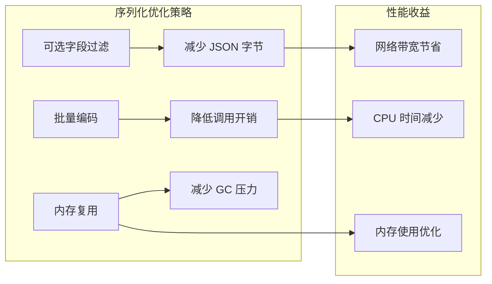

### 并发安全性

数据模型结构体都是不可变的，天然支持并发安全访问。序列化操作通过标准库的线程安全实现保证并发安全性。

## 故障排除指南

### 常见数据模型问题

#### Response 模型错误处理

当操作失败时，Response 模型通过 `Error` 字段提供详细的错误信息：

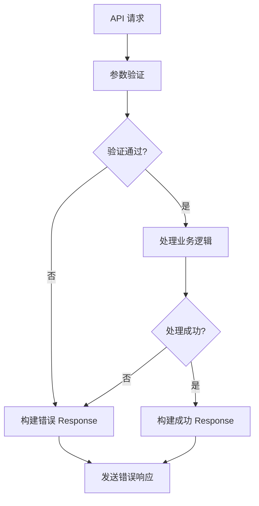

**图表来源**
- [handlers.go:114-212](file://src/handlers.go#L114-L212)
- [models.go:4-12](file://src/models.go#L4-L12)

#### FileInfo 模型数据完整性

当目录项数据异常时，系统会跳过有问题的条目并记录日志：

**章节来源**
- [handlers.go:63-96](file://src/handlers.go#L63-L96)
- [models.go:14-22](file://src/models.go#L14-L22)

### 调试技巧

1. **启用详细日志**：在开发环境中启用详细的请求和响应日志
2. **使用 JSON 验证工具**：验证序列化后的数据格式
3. **监控内存使用**：关注大量文件列表时的内存占用

## 结论

数据模型模块通过精心设计的结构体定义和严格的验证机制，为 m.text.editor 提供了可靠的数据传输基础。Response、FileInfo 和 ListResponse 三个核心结构体相互配合，实现了从简单文件操作到复杂目录管理的完整数据支持。

模块设计的关键优势包括：
- **标准化的数据格式**：统一的 JSON 结构确保前后端兼容性
- **灵活的字段设计**：可选字段支持不同场景的需求
- **严格的数据验证**：确保数据完整性和安全性
- **良好的性能表现**：优化的序列化和内存使用策略

未来的发展方向可能包括：
- 增加更多的数据验证规则
- 扩展支持更多文件类型和编码格式
- 实现更精细的错误分类和处理机制
- 添加数据模型的版本控制和迁移支持