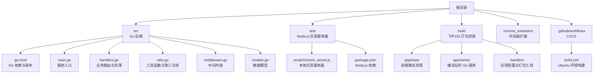
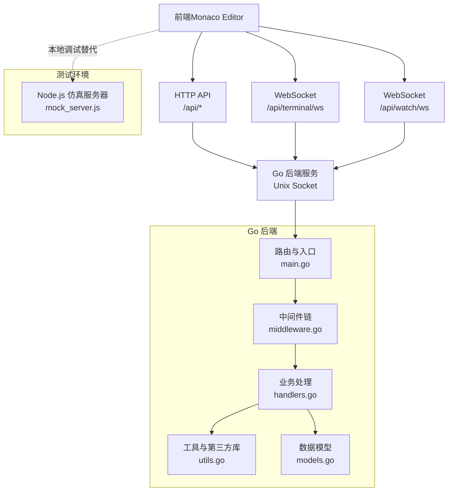
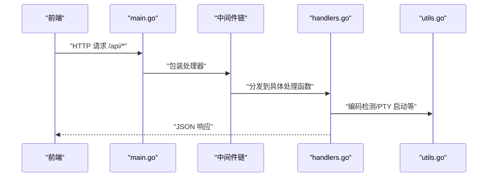
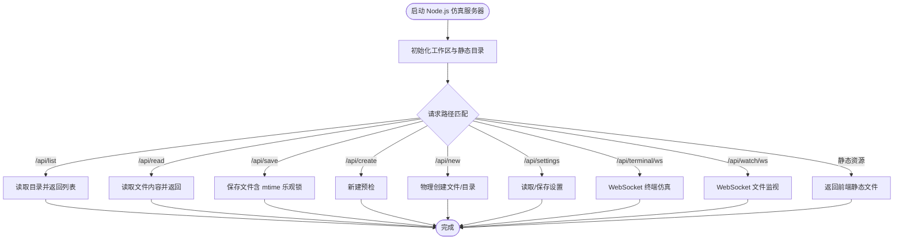
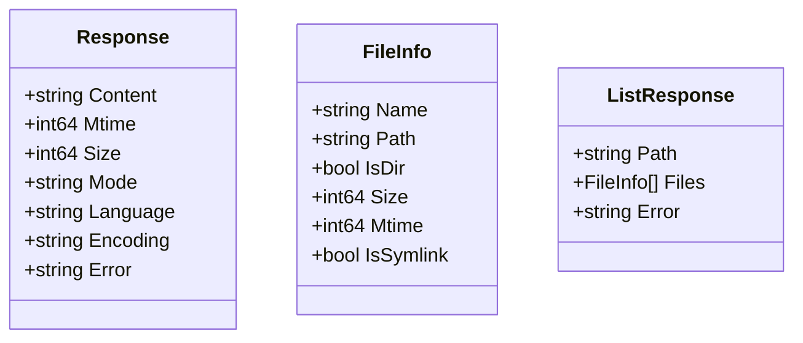
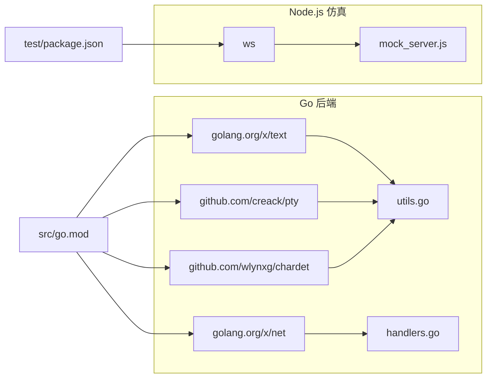

# 开发环境搭建

<cite>
**本文引用的文件**
- [README.md](file://README.md)
- [go.mod](file://src/go.mod)
- [go.sum](file://src/go.sum)
- [main.go](file://src/main.go)
- [handlers.go](file://src/handlers.go)
- [utils.go](file://src/utils.go)
- [middleware.go](file://src/middleware.go)
- [models.go](file://src/models.go)
- [package.json](file://test/package.json)
- [README.md](file://test/README.md)
- [mock_server.js](file://test/scratch/mock_server.js)
- [README.md](file://build/README.md)
- [build.yml](file://.github/workflows/build.yml)
</cite>

## 目录
1. [简介](#简介)
2. [项目结构](#项目结构)
3. [核心组件](#核心组件)
4. [架构总览](#架构总览)
5. [详细组件分析](#详细组件分析)
6. [依赖关系分析](#依赖关系分析)
7. [性能考虑](#性能考虑)
8. [故障排查指南](#故障排查指南)
9. [结论](#结论)
10. [附录](#附录)

## 简介
本指南面向需要在本地搭建与调试本项目的开发者，涵盖以下内容：
- Go 1.26.2+ 的安装与配置要求，包括 GOPATH 与 GOBIN 的设置建议
- 项目关键依赖的安装流程（golang.org/x/text、github.com/creack/pty、github.com/wlynxg/chardet 等）
- 测试环境配置（Node.js 与相关测试工具）
- Windows/macOS/Linux 三平台具体安装步骤
- IDE 配置建议与调试环境设置
- 如何验证环境配置是否正确

## 项目结构
该项目采用多模块/多目录组织方式：
- src：Go 后端服务源码与依赖管理
- test：本地开发仿真调试环境（Node.js 服务器与前端资源）
- build：飞牛OS 打包与分发资源（包含前端静态资源、打包工具等）
- chrome_extension：配套浏览器扩展源码
- .github/workflows：CI/CD 工作流（Ubuntu 环境）

图表来源
- [README.md:12-17](file://README.md#L12-L17)
- [go.mod:1-12](file://src/go.mod#L1-L12)
- [README.md:18-31](file://README.md#L18-L31)
- [README.md:1-11](file://README.md#L1-L11)
- [build/README.md:1-30](file://build/README.md#L1-L30)
- [build.yml:17-33](file://.github/workflows/build.yml#L17-L33)

章节来源
- [README.md:12-17](file://README.md#L12-L17)
- [build/README.md:1-30](file://build/README.md#L1-L30)
- [build.yml:17-33](file://.github/workflows/build.yml#L17-L33)

## 核心组件
- Go 后端服务
  - 服务入口与路由：通过 Unix Socket 对外提供 HTTP/WebSocket 服务
  - 业务处理：文件读取、保存、目录列表、文件/目录创建、设置读写、文件监视、终端会话
  - 中间件：管理员鉴权、Gzip 压缩、缓存控制
  - 数据模型：统一响应结构与目录项结构
- Node.js 仿真服务器
  - 提供与后端一致的 API 仿真（目录、读取、保存、新建、设置、WebSocket 终端与文件监视）
  - 便于在非飞牛OS环境下进行前端调试与联调
- 构建与打包
  - 飞牛OS 打包资源与生命周期脚本
  - CI/CD 在 Ubuntu 环境中完成交叉编译与打包

章节来源
- [main.go:14-144](file://src/main.go#L14-L144)
- [handlers.go:21-611](file://src/handlers.go#L21-L611)
- [middleware.go:22-92](file://src/middleware.go#L22-L92)
- [models.go:3-29](file://src/models.go#L3-L29)
- [mock_server.js:78-294](file://test/scratch/mock_server.js#L78-L294)
- [README.md:12-17](file://README.md#L12-L17)

## 架构总览
后端服务通过 Unix Socket 提供 HTTP 与 WebSocket 服务，前端通过静态资源与 API 与后端交互；测试环境提供 Node.js 仿真服务器以模拟后端行为。

图表来源
- [main.go:37-129](file://src/main.go#L37-L129)
- [handlers.go:112-119](file://src/handlers.go#L112-L119)
- [utils.go:16-23](file://src/utils.go#L16-L23)
- [middleware.go:22-92](file://src/middleware.go#L22-L92)
- [mock_server.js:78-294](file://test/scratch/mock_server.js#L78-L294)

## 详细组件分析

### Go 后端服务
- 服务入口与环境变量
  - 依赖 TRIM_APPDEST、TRIM_APPVER 环境变量，用于定位 www 目录与注入版本号
  - 通过 Unix Socket 监听请求，提供静态资源网关与业务 API
- 业务路由
  - 列表、读取、保存、新建、设置、文件监视、终端会话
- 中间件链
  - 管理员鉴权、Gzip 压缩、缓存控制
- 工具与第三方库
  - golang.org/x/text：编码检测与转换
  - github.com/creack/pty：终端会话
  - github.com/wlynxg/chardet：字符编码预测

图表来源
- [main.go:111-129](file://src/main.go#L111-L129)
- [handlers.go:21-611](file://src/handlers.go#L21-L611)
- [utils.go:16-23](file://src/utils.go#L16-L23)

章节来源
- [main.go:14-144](file://src/main.go#L14-L144)
- [handlers.go:21-611](file://src/handlers.go#L21-L611)
- [middleware.go:22-92](file://src/middleware.go#L22-L92)
- [utils.go:16-23](file://src/utils.go#L16-L23)

### Node.js 仿真服务器
- 本地端口与目录
  - 默认监听 3000 端口，静态资源来自 build/app/www，工作区目录为 test/scratch/files
- 支持的 API
  - 目录列表、文件读取、保存（含乐观锁）、新建（文件/目录）、设置读写、WebSocket 终端与文件监视
- 启动方式
  - 在 test 目录下先安装依赖，再启动服务器

图表来源
- [mock_server.js:78-294](file://test/scratch/mock_server.js#L78-L294)
- [mock_server.js:296-432](file://test/scratch/mock_server.js#L296-L432)

章节来源
- [README.md:30-41](file://test/README.md#L30-L41)
- [package.json:1-6](file://test/package.json#L1-L6)
- [mock_server.js:78-294](file://test/scratch/mock_server.js#L78-L294)

### 数据模型
- 统一响应结构与目录项结构，便于前后端契约一致

图表来源
- [models.go:3-29](file://src/models.go#L3-L29)

章节来源
- [models.go:3-29](file://src/models.go#L3-L29)

## 依赖关系分析
- Go 依赖
  - golang.org/x/text：编码检测与转换
  - github.com/creack/pty：终端会话
  - github.com/wlynxg/chardet：字符编码预测
  - golang.org/x/net：WebSocket 支持
- Node.js 依赖
  - ws：WebSocket 服务器

图表来源
- [go.mod:5-11](file://src/go.mod#L5-L11)
- [package.json:2-4](file://test/package.json#L2-L4)
- [utils.go:16-23](file://src/utils.go#L16-L23)
- [handlers.go:16-18](file://src/handlers.go#L16-L18)
- [mock_server.js:5](file://test/scratch/mock_server.js#L5)

章节来源
- [go.mod:5-11](file://src/go.mod#L5-L11)
- [package.json:2-4](file://test/package.json#L2-L4)

## 性能考虑
- 压缩与缓存
  - Gzip 压缩仅对特定资源启用，避免对 WebSocket 升级请求产生干扰
  - 静态资源与带版本号资源采用强缓存策略，减少网络传输
- 文件操作
  - 读取文件有大小限制，防止大文件影响性能
  - 保存采用临时文件 + 原子重命名，保证一致性与可靠性
- 终端会话
  - PTY 启动时设置窗口大小与环境变量，避免阻塞与资源泄漏

章节来源
- [middleware.go:40-92](file://src/middleware.go#L40-L92)
- [handlers.go:146-151](file://src/handlers.go#L146-L151)
- [handlers.go:270-314](file://src/handlers.go#L270-L314)
- [utils.go:168-261](file://src/utils.go#L168-L261)

## 故障排查指南
- 环境变量缺失
  - TRIM_APPDEST、TRIM_APPVER 未设置会导致服务启动失败
- 权限问题
  - 访问受保护目录或尝试修改应用自身资源会被拒绝
- 文件过大
  - 超过 10MB 的文件读取会被拒绝
- 保存冲突
  - 若文件被外部修改或 mtime 为 0，保存会被阻止
- 终端权限
  - 非管理员用户无法建立终端会话
- 仿真服务器
  - 确认 Node.js 依赖已安装，端口未被占用

章节来源
- [main.go:16-24](file://src/main.go#L16-L24)
- [handlers.go:31-55](file://src/handlers.go#L31-L55)
- [handlers.go:146-151](file://src/handlers.go#L146-L151)
- [handlers.go:253-263](file://src/handlers.go#L253-L263)
- [middleware.go:28-34](file://src/middleware.go#L28-L34)
- [README.md:30-41](file://test/README.md#L30-L41)

## 结论
通过本指南，您可以在本地完成 Go 与 Node.js 环境的搭建，安装并验证项目所需依赖，启动仿真服务器进行前端调试，并理解后端服务的架构与关键流程。若需在飞牛OS环境中运行，还需准备相应的打包与部署资源。

## 附录

### Go 1.26.2+ 安装与配置
- 安装 Go 1.26.2+
  - 下载地址与安装包请参考官方发行版
- GOPATH 与 GOBIN
  - 建议将 GOBIN 设置为 PATH 中可访问的位置，以便直接运行 go build 生成的二进制
  - GOPATH 可按个人偏好设置，但通常保持默认即可
- 验证安装
  - 使用命令行查看版本与环境信息，确认 GOPATH/GOBIN 设置生效

章节来源
- [go.mod:3](file://src/go.mod#L3)

### 项目依赖安装
- Go 依赖
  - 使用 go mod tidy 或 go mod download 安装依赖
  - 关键依赖：golang.org/x/text、github.com/creack/pty、github.com/wlynxg/chardet、golang.org/x/net
- Node.js 依赖
  - 在 test 目录执行依赖安装，然后启动仿真服务器

章节来源
- [go.mod:5-11](file://src/go.mod#L5-L11)
- [package.json:2-4](file://test/package.json#L2-L4)
- [README.md:30-41](file://test/README.md#L30-L41)

### 测试环境配置（Node.js 与工具）
- Node.js 环境
  - 安装 Node.js（推荐 LTS 版本），确保 npm 可用
- 依赖安装与启动
  - 在 test 目录执行依赖安装与启动命令，访问本地 3000 端口进行调试

章节来源
- [README.md:30-41](file://test/README.md#L30-L41)
- [package.json:1-6](file://test/package.json#L1-L6)

### 不同操作系统安装步骤
- Windows
  - 安装 Go 1.26.2+ 与 Node.js
  - 在项目根目录执行 Go 依赖安装与构建
  - 在 test 目录执行 npm install 与启动命令
- macOS
  - 使用包管理器安装 Go 与 Node.js
  - 执行相同依赖安装与启动流程
- Linux
  - 使用发行版包管理器或官方二进制安装
  - 注意确保系统满足终端会话与文件权限要求

章节来源
- [README.md:30-41](file://test/README.md#L30-L41)
- [go.mod:3](file://src/go.mod#L3)

### IDE 配置与调试建议
- Go 语言
  - 使用支持 Go 的 IDE（如 VS Code + Go 扩展），启用 gofmt、golint 等
  - 配置运行参数与环境变量（TRIM_APPDEST、TRIM_APPVER）
- Node.js
  - 在 test 目录配置调试任务，启动仿真服务器
- 调试技巧
  - 通过日志输出与断点定位问题
  - 使用浏览器开发者工具观察网络与 WebSocket 通信

章节来源
- [main.go:16-24](file://src/main.go#L16-L24)
- [README.md:30-41](file://test/README.md#L30-L41)

### 验证环境配置
- Go 服务
  - 启动后检查日志输出，确认监听的 Socket 路径与版本号注入正常
- API 与 WebSocket
  - 通过浏览器访问静态页面，发起 API 请求与 WebSocket 连接
- 仿真服务器
  - 启动后访问本地 3000 端口，确认各 API 与 WebSocket 功能可用

章节来源
- [main.go:30-35](file://src/main.go#L30-L35)
- [README.md:30-41](file://test/README.md#L30-L41)