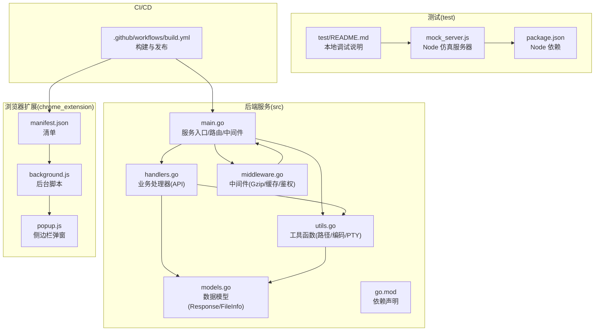
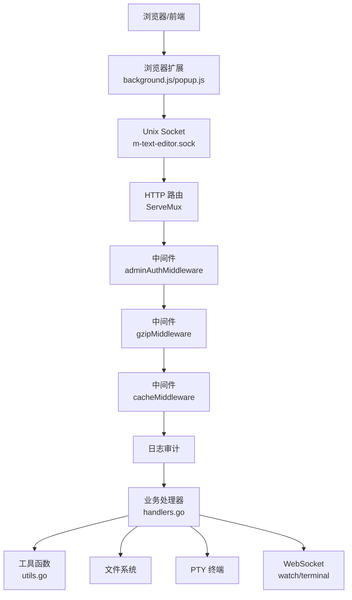
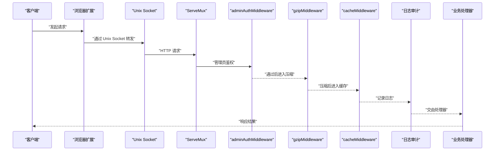
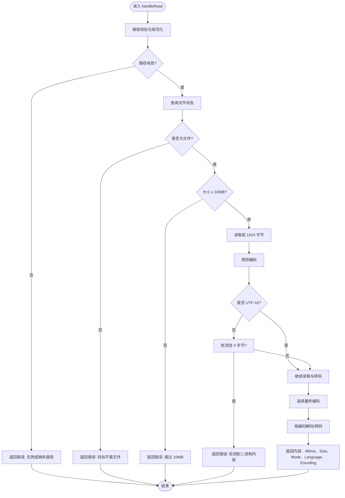
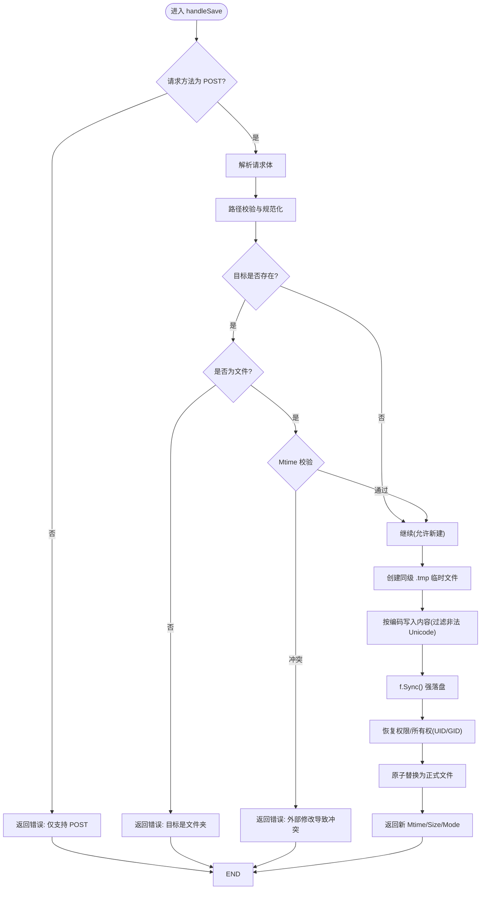
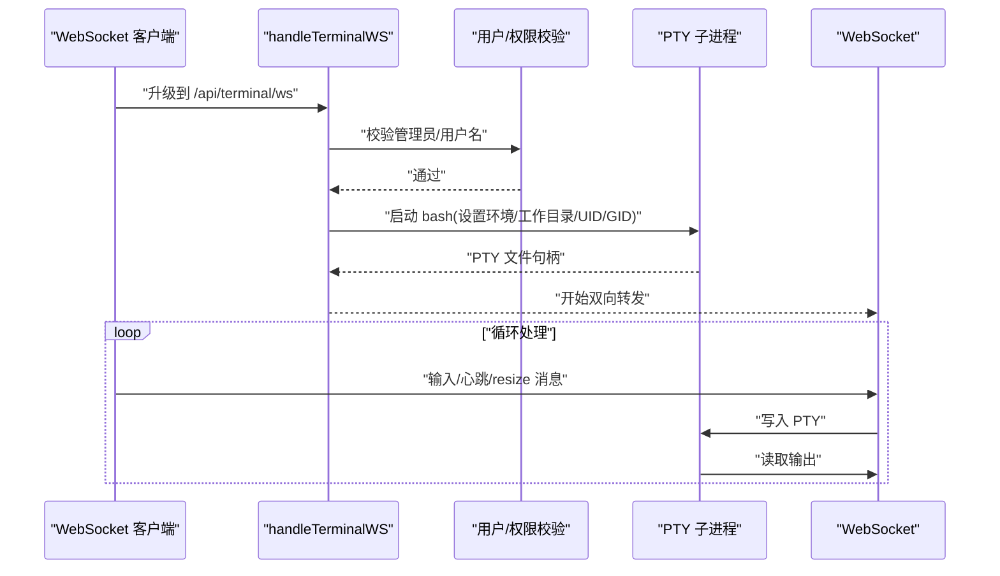
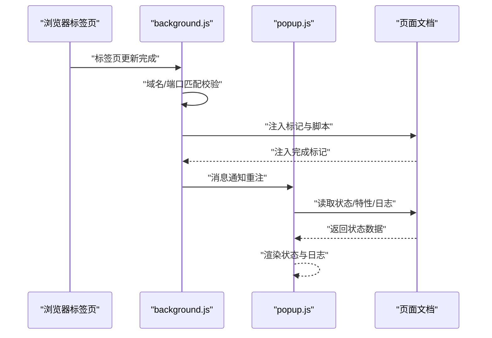
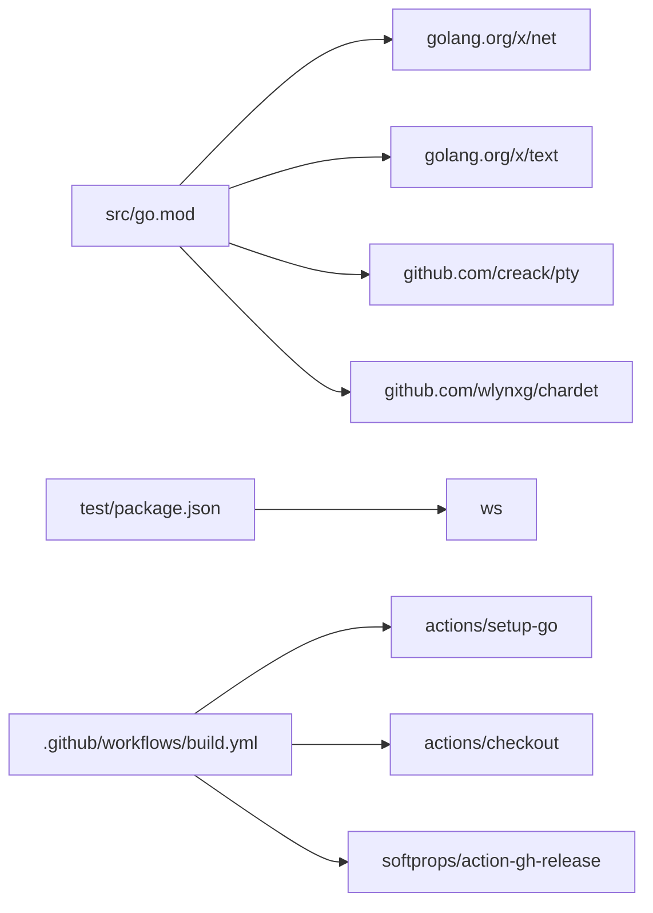

# 开发者指南

<cite>
**本文引用的文件**
- [README.md](file://README.md)
- [src/README.md](file://src/README.md)
- [src/main.go](file://src/main.go)
- [src/handlers.go](file://src/handlers.go)
- [src/middleware.go](file://src/middleware.go)
- [src/models.go](file://src/models.go)
- [src/utils.go](file://src/utils.go)
- [src/go.mod](file://src/go.mod)
- [.github/workflows/build.yml](file://.github/workflows/build.yml)
- [test/README.md](file://test/README.md)
- [test/package.json](file://test/package.json)
- [test/scratch/mock_server.js](file://test/scratch/mock_server.js)
- [chrome_extension/manifest.json](file://chrome_extension/manifest.json)
- [chrome_extension/background.js](file://chrome_extension/background.js)
- [chrome_extension/popup.js](file://chrome_extension/popup.js)
</cite>

## 目录
1. [简介](#简介)
2. [项目结构](#项目结构)
3. [核心组件](#核心组件)
4. [架构总览](#架构总览)
5. [详细组件分析](#详细组件分析)
6. [依赖关系分析](#依赖关系分析)
7. [性能考量](#性能考量)
8. [故障排除指南](#故障排除指南)
9. [结论](#结论)
10. [附录](#附录)

## 简介
本指南面向希望参与开发与维护的贡献者，涵盖开发环境搭建、依赖与测试配置、代码结构与组织方式、构建与部署流程、CI/CD 与自动化测试策略、代码与提交规范、分支管理策略、调试技巧与故障排除，以及扩展点与插件机制的扩展指引。

## 项目结构
仓库采用多模块布局：
- src：Go 后端服务，提供 API、静态资源网关、WebSocket 终端与文件监视、中间件与工具函数。
- test：本地开发与 API 仿真的 Node.js 服务器与测试文件集合，便于在非飞牛 OS 环境下调试。
- chrome_extension：配套浏览器扩展，用于与飞牛 OS 文件管理器集成，注入脚本并提供侧边栏配置。
- .github/workflows：GitHub Actions 构建与发布流水线，产出 x86/arm FPK 包与扩展压缩包。
- 顶层 README：项目概述、目录结构说明与浏览器扩展使用指南。

图表来源
- [src/main.go:1-145](file://src/main.go#L1-L145)
- [src/handlers.go:1-614](file://src/handlers.go#L1-L614)
- [src/middleware.go:1-103](file://src/middleware.go#L1-L103)
- [src/models.go:1-30](file://src/models.go#L1-L30)
- [src/utils.go:1-262](file://src/utils.go#L1-L262)
- [test/README.md:1-41](file://test/README.md#L1-L41)
- [test/scratch/mock_server.js:1-437](file://test/scratch/mock_server.js#L1-L437)
- [chrome_extension/manifest.json:1-28](file://chrome_extension/manifest.json#L1-L28)
- [chrome_extension/background.js:1-169](file://chrome_extension/background.js#L1-L169)
- [.github/workflows/build.yml:1-160](file://.github/workflows/build.yml#L1-L160)

章节来源
- [README.md:12-18](file://README.md#L12-L18)
- [src/README.md:1-74](file://src/README.md#L1-L74)

## 核心组件
- 服务入口与路由
  - 初始化 HTTP ServeMux，动态入口服务处理首页、样式与脚本的版本号注入，静态资源转发至 www 目录。
  - 注册业务 API 路由与 WebSocket 路由，包装中间件链（管理员鉴权 -> Gzip 压缩 -> 缓存控制 -> 日志审计），通过 Unix Socket 监听。
- 中间件
  - 管理员鉴权：从请求头提取管理员标识，生产环境强制校验。
  - Gzip 压缩：对文本静态资源与 API 响应启用透明压缩，忽略 WebSocket 升级请求。
  - 缓存控制：Monaco 核心资源强缓存一年，带版本号的业务脚本缓存 30 天，普通业务资源缓存 1 天。
- 业务处理器
  - 目录列表、文件读取（含编码探测与二进制拦截）、原子保存（乐观锁、临时文件、强落盘、权限/所有权恢复）、新建文件/目录、设置读写、终端 WebSocket 桥接、文件监视 WebSocket。
- 工具与模型
  - 路径安全校验（防目录逃逸、符号链接解析、应用资源目录隔离）、语言识别、字符集预测、编码转换器、PTY 启动与双向转发。
- 测试与扩展
  - Node 仿真服务器提供与后端一致的 API 与 WebSocket 仿真，便于本地调试。
  - 浏览器扩展通过 Manifest V3 注入脚本、侧边栏配置与域名/端口匹配规则，实现与飞牛 OS 文件管理器的联动。

章节来源
- [src/main.go:14-145](file://src/main.go#L14-L145)
- [src/middleware.go:22-103](file://src/middleware.go#L22-L103)
- [src/handlers.go:21-614](file://src/handlers.go#L21-L614)
- [src/utils.go:25-262](file://src/utils.go#L25-L262)
- [src/models.go:3-30](file://src/models.go#L3-L30)
- [test/README.md:15-41](file://test/README.md#L15-L41)
- [chrome_extension/manifest.json:1-28](file://chrome_extension/manifest.json#L1-L28)

## 架构总览
后端服务通过 Unix Socket 对外提供 HTTP 与 WebSocket 服务，前端静态资源由动态入口服务注入版本号并转发。中间件统一处理鉴权、压缩与缓存。业务处理器围绕文件系统与 PTY 终端提供能力。浏览器扩展在目标站点注入脚本并与后端交互。

图表来源
- [src/main.go:37-145](file://src/main.go#L37-L145)
- [src/middleware.go:22-92](file://src/middleware.go#L22-L92)
- [src/handlers.go:21-614](file://src/handlers.go#L21-L614)
- [src/utils.go:167-262](file://src/utils.go#L167-L262)
- [chrome_extension/background.js:1-169](file://chrome_extension/background.js#L1-L169)
- [chrome_extension/popup.js:1-200](file://chrome_extension/popup.js#L1-L200)

## 详细组件分析

### 服务入口与中间件序列图
展示从客户端请求到业务处理的关键调用链与中间件包装顺序。

图表来源
- [src/main.go:121-129](file://src/main.go#L121-L129)
- [src/middleware.go:22-92](file://src/middleware.go#L22-L92)
- [src/handlers.go:21-614](file://src/handlers.go#L21-L614)

章节来源
- [src/main.go:14-145](file://src/main.go#L14-L145)
- [src/middleware.go:22-92](file://src/middleware.go#L22-L92)

### 文件读取与转码流程图
描述读取文件时的路径校验、大小限制、编码探测、二进制拦截与转码流程。

图表来源
- [src/handlers.go:114-212](file://src/handlers.go#L114-L212)
- [src/utils.go:108-165](file://src/utils.go#L108-L165)

章节来源
- [src/handlers.go:114-212](file://src/handlers.go#L114-L212)
- [src/utils.go:108-165](file://src/utils.go#L108-L165)

### 原子保存流程图
描述原子保存的乐观锁、临时文件写入、强落盘与原子替换流程。

图表来源
- [src/handlers.go:214-324](file://src/handlers.go#L214-L324)

章节来源
- [src/handlers.go:214-324](file://src/handlers.go#L214-L324)

### 终端 WebSocket 桥接序列图
展示从握手到 PTY 启动、双向转发与心跳/尺寸调整的完整流程。

图表来源
- [src/handlers.go:496-516](file://src/handlers.go#L496-L516)
- [src/utils.go:167-262](file://src/utils.go#L167-L262)

章节来源
- [src/handlers.go:496-516](file://src/handlers.go#L496-L516)
- [src/utils.go:167-262](file://src/utils.go#L167-L262)

### 浏览器扩展注入与状态同步
展示扩展在匹配域名时的注入流程、状态标记与日志同步。

图表来源
- [chrome_extension/background.js:39-117](file://chrome_extension/background.js#L39-L117)
- [chrome_extension/popup.js:99-158](file://chrome_extension/popup.js#L99-L158)

章节来源
- [chrome_extension/background.js:1-169](file://chrome_extension/background.js#L1-L169)
- [chrome_extension/popup.js:1-200](file://chrome_extension/popup.js#L1-L200)

## 依赖关系分析
- Go 依赖
  - 核心依赖：网络与 WebSocket 支持、字符集探测、PTY 控制。
  - 版本与模块：Go 版本与模块声明见 go.mod。
- Node 依赖
  - 测试仿真服务器使用 ws WebSocket 库。
- CI/CD 依赖
  - GitHub Actions 使用 setup-go、actions/checkout、gh-release 等。

图表来源
- [src/go.mod:1-12](file://src/go.mod#L1-L12)
- [test/package.json:1-6](file://test/package.json#L1-L6)
- [.github/workflows/build.yml:28-33](file://.github/workflows/build.yml#L28-L33)

章节来源
- [src/go.mod:1-12](file://src/go.mod#L1-L12)
- [test/package.json:1-6](file://test/package.json#L1-L6)
- [.github/workflows/build.yml:28-33](file://.github/workflows/build.yml#L28-L33)

## 性能考量
- 压缩与缓存
  - 对文本与 API 响应启用 Gzip 压缩，减少传输体积；对 Monaco 核心资源实施强缓存，降低重复加载成本。
- 资源版本化
  - 首页、样式与脚本注入版本号，避免缓存污染并支持灰度与回滚。
- 文件读取限制
  - 10MB 文件大小限制，保护编辑器性能与内存占用。
- PTY 超时
  - 终端会话在长时间无交互后自动断开，避免资源泄漏。
- 原子写入
  - 临时文件 + 原子替换 + 强落盘，保证一致性与可靠性。

章节来源
- [src/middleware.go:40-92](file://src/middleware.go#L40-L92)
- [src/handlers.go:146-151](file://src/handlers.go#L146-L151)
- [src/utils.go:230-261](file://src/utils.go#L230-L261)
- [src/handlers.go:309-314](file://src/handlers.go#L309-L314)

## 故障排除指南
- 环境变量缺失
  - 未设置 TRIM_APPDEST/TRIM_APPVER 将导致服务启动失败。请在飞牛 OS 应用容器中运行并正确配置。
- 权限不足
  - 非管理员访问会被中间件拒绝。确认请求头携带正确的管理员标识。
- 路径安全
  - 路径校验失败或访问受保护目录将返回错误。检查路径是否位于应用资源目录之外。
- 文件过大或二进制
  - 超过 10MB 或检测到二进制内容将被拒绝加载。请确认文件类型与大小。
- 保存冲突
  - 若文件被外部修改，保存将因乐观锁冲突而失败。请刷新页面后重试。
- 终端无法启动
  - PTY 启动失败或用户切换失败时会返回错误。检查用户权限与工作目录。
- WebSocket 断连
  - 终端/监视 WS 在长时间无交互后会断开。检查心跳与 resize 消息发送。
- 本地调试
  - 使用 test/scratch/mock_server.js 启动本地仿真服务器，访问 http://localhost:3000 进行前端与 API 调试。

章节来源
- [src/main.go:16-24](file://src/main.go#L16-L24)
- [src/middleware.go:22-37](file://src/middleware.go#L22-L37)
- [src/utils.go:25-53](file://src/utils.go#L25-L53)
- [src/handlers.go:146-176](file://src/handlers.go#L146-L176)
- [src/handlers.go:253-262](file://src/handlers.go#L253-L262)
- [src/utils.go:217-221](file://src/utils.go#L217-L221)
- [test/README.md:30-41](file://test/README.md#L30-L41)

## 结论
本项目通过清晰的模块划分与中间件体系，提供了稳定高效的文本编辑与终端能力。借助本地仿真服务器与浏览器扩展，开发者可在非飞牛 OS 环境下高效调试。CI/CD 流水线自动化产出多平台包与扩展资源，保障发布质量与效率。

## 附录

### 开发环境搭建
- Go 环境
  - 安装 Go 版本与工具链，确保 GOPATH 与 PATH 配置正确。
- 依赖管理
  - 使用 go mod tidy 管理依赖，确保 go.sum 与 go.mod 一致。
- 测试环境
  - 在 test/ 目录安装 Node 依赖并启动 mock_server.js，访问 http://localhost:3000 进行调试。

章节来源
- [src/go.mod:1-12](file://src/go.mod#L1-L12)
- [test/README.md:30-41](file://test/README.md#L30-L41)
- [test/package.json:1-6](file://test/package.json#L1-L6)

### 构建与部署流程
- 本地开发
  - 在 src/ 目录下编译后端服务，确保 Unix Socket 目录可写。
- 生产环境
  - 在飞牛 OS 应用容器中运行，设置 TRIM_APPDEST 与 TRIM_APPVER 环境变量。
- CI/CD
  - GitHub Actions 自动构建 x86/arm FPK 包与扩展压缩包，支持发布与更新 FnDepot。

章节来源
- [.github/workflows/build.yml:47-82](file://.github/workflows/build.yml#L47-L82)
- [.github/workflows/build.yml:83-86](file://.github/workflows/build.yml#L83-L86)
- [src/main.go:16-24](file://src/main.go#L16-L24)

### CI/CD 与自动化测试策略
- 触发方式：workflow_dispatch，支持手动触发并选择是否发布。
- Go 版本：固定使用 Go 1.21，启用依赖缓存。
- 构建产物：x86 与 arm 两套 FPK 包，扩展压缩包。
- 发布与更新：生成变更日志，清理已有标签与发布，创建新发布并更新 FnDepot。

章节来源
- [.github/workflows/build.yml:1-160](file://.github/workflows/build.yml#L1-L160)

### 代码规范与提交规范
- Go 代码
  - 遵循 Go 官方风格与命名约定，保持函数与变量简洁明确。
- API 设计
  - 统一使用 JSON 响应结构，错误信息清晰可读。
- 提交信息
  - 使用清晰的提交主题与简要描述，必要时补充变更日志生成。

（本节为通用实践建议，不直接分析具体文件）

### 分支管理策略
- 主分支：稳定发布，遵循语义化版本。
- 功能分支：按功能拆分，合并前进行审查与测试。
- 发布分支：用于准备发布与热修复。

（本节为通用实践建议，不直接分析具体文件）

### 扩展点与插件机制
- 浏览器扩展
  - 通过 Manifest V3 注入脚本、侧边栏配置与域名/端口匹配，实现与飞牛 OS 文件管理器的联动。
- 后端扩展
  - 可在 handlers.go 中新增业务处理器，结合中间件实现统一的安全与性能策略。
- 配置扩展
  - 通过 settings API 读写配置文件，支持 PC 与移动端差异化配置。

章节来源
- [chrome_extension/manifest.json:1-28](file://chrome_extension/manifest.json#L1-L28)
- [chrome_extension/background.js:1-169](file://chrome_extension/background.js#L1-L169)
- [src/handlers.go:518-611](file://src/handlers.go#L518-L611)