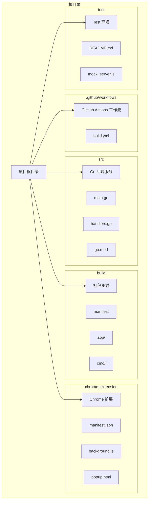
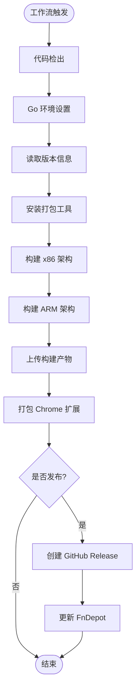
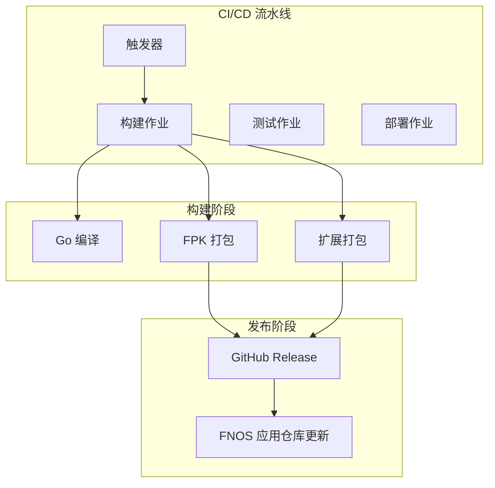
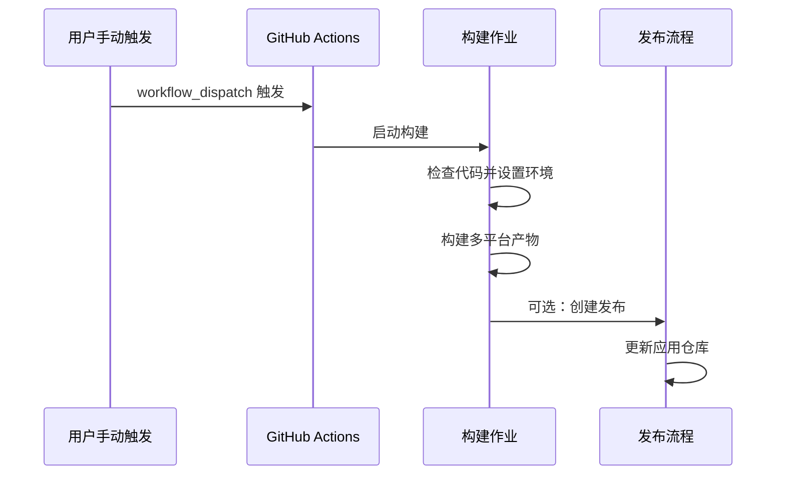
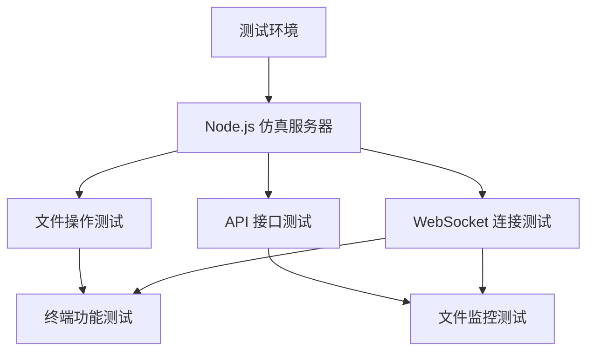
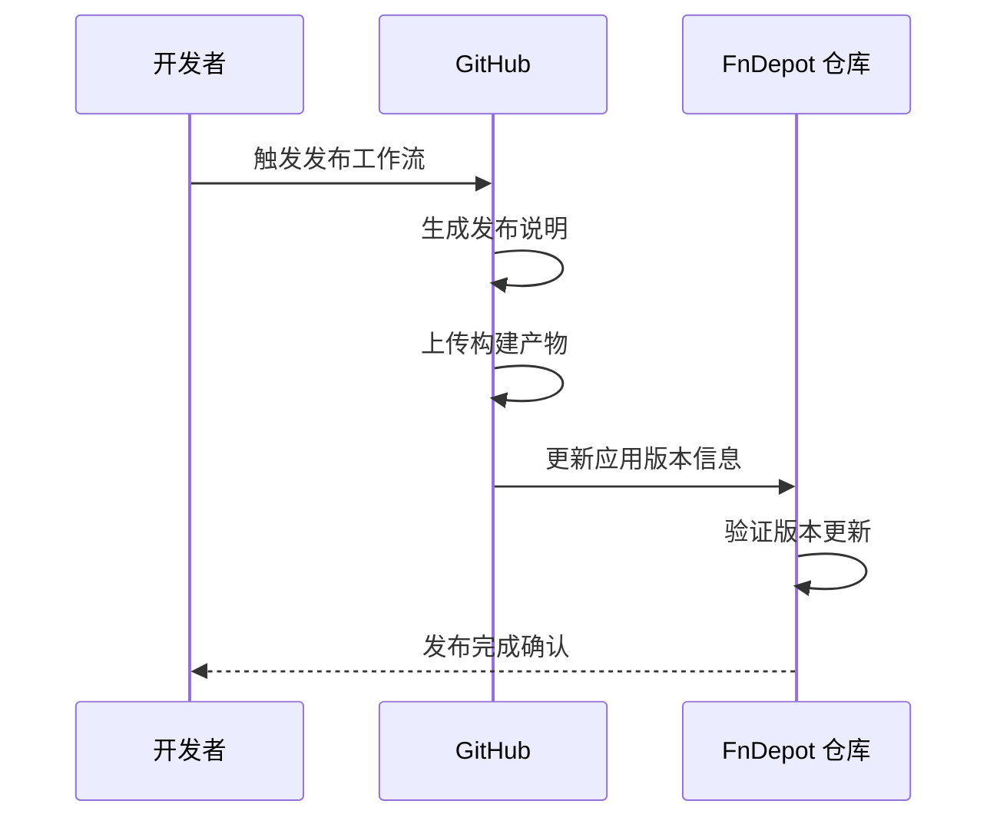
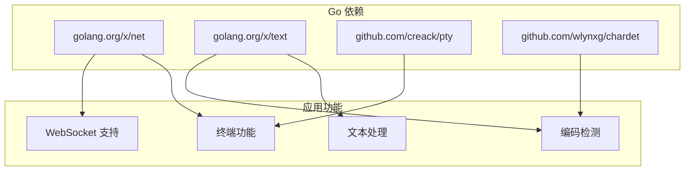
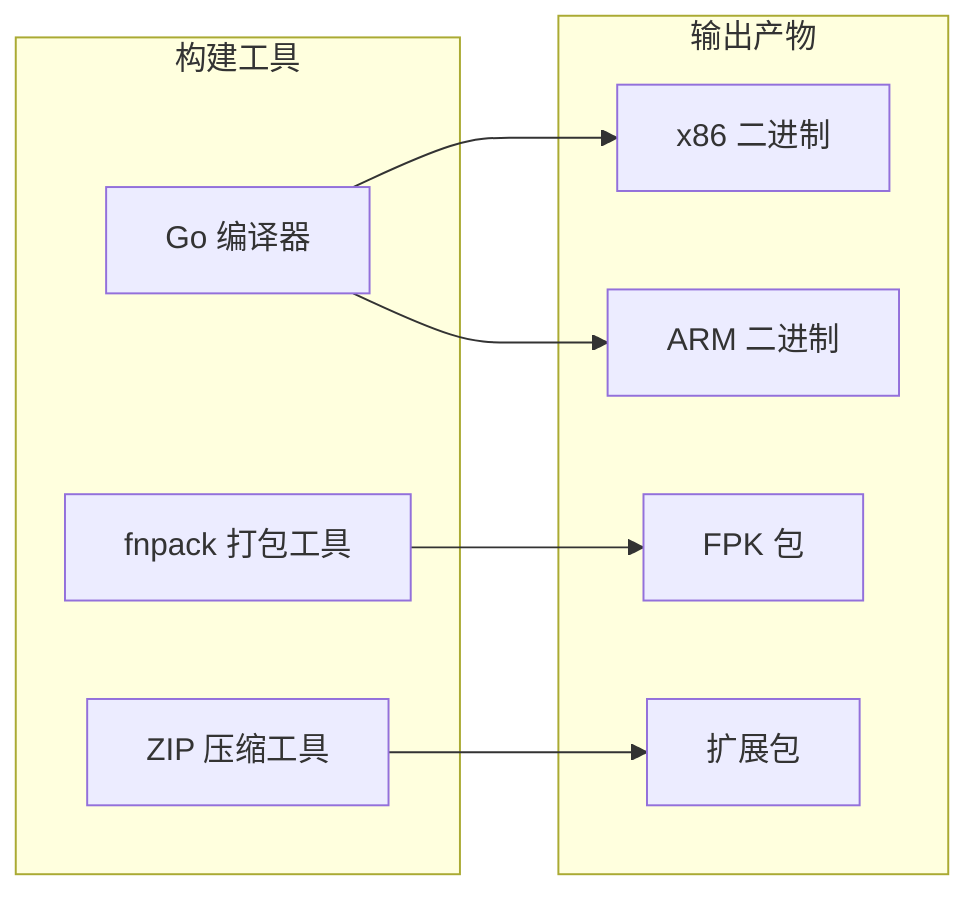
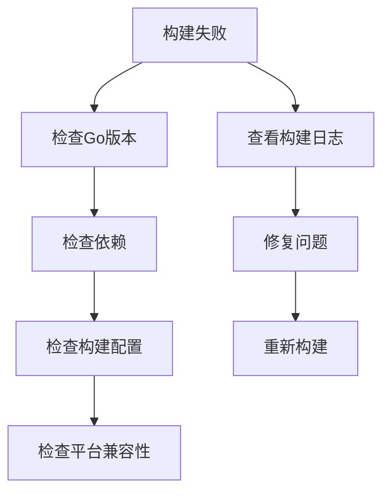

# CI/CD 流水线

<cite>
**本文档引用的文件**
- [.github/workflows/build.yml](file://.github/workflows/build.yml)
- [README.md](file://README.md)
- [src/main.go](file://src/main.go)
- [src/handlers.go](file://src/handlers.go)
- [src/go.mod](file://src/go.mod)
- [test/README.md](file://test/README.md)
- [test/package.json](file://test/package.json)
- [chrome_extension/manifest.json](file://chrome_extension/manifest.json)
- [build/manifest](file://build/manifest)
- [build/README.md](file://build/README.md)
- [CHANGELOG.md](file://CHANGELOG.md)
</cite>

## 目录
1. [简介](#简介)
2. [项目结构](#项目结构)
3. [核心组件](#核心组件)
4. [架构概览](#架构概览)
5. [详细组件分析](#详细组件分析)
6. [依赖关系分析](#依赖关系分析)
7. [性能考虑](#性能考虑)
8. [故障排除指南](#故障排除指南)
9. [结论](#结论)

## 简介

本项目是一个基于飞牛OS（FNOS）适配的轻量极速文本编辑器，采用Go语言开发后端服务，结合Monaco Editor内核提供现代化的编辑体验。项目通过GitHub Actions实现了完整的CI/CD流水线，支持多平台构建、自动化测试、代码质量检查和安全扫描。

该流水线主要面向飞牛OS应用生态，负责构建x86和ARM架构的FPK包，打包Chrome扩展，并在发布时自动更新FnDepot应用仓库。整个流程从代码提交到应用分发实现了端到端的自动化。

## 项目结构

项目采用清晰的分层架构设计，主要包含以下核心目录：

**图表来源**
- [README.md:12-17](file://README.md#L12-L17)
- [build/README.md:7-29](file://build/README.md#L7-L29)

**章节来源**
- [README.md:12-17](file://README.md#L12-L17)
- [build/README.md:1-30](file://build/README.md#L1-L30)

## 核心组件

### GitHub Actions 工作流配置

工作流配置位于`.github/workflows/build.yml`，定义了完整的构建和发布流程：

**图表来源**
- [.github/workflows/build.yml:16-160](file://.github/workflows/build.yml#L16-L160)

### 多平台构建策略

流水线支持x86和ARM两种架构的构建，分别针对不同的硬件平台：

- **x86 架构**: 使用Linux AMD64平台，适合传统服务器和桌面环境
- **ARM 架构**: 使用Linux ARM64平台，适配移动设备和嵌入式系统

每种架构都包含独立的构建步骤，确保产物的兼容性和性能优化。

**章节来源**
- [.github/workflows/build.yml:47-81](file://.github/workflows/build.yml#L47-L81)

## 架构概览

### 整体架构设计

**图表来源**
- [.github/workflows/build.yml:16-160](file://.github/workflows/build.yml#L16-L160)

### 数据流分析

流水线的数据流遵循严格的顺序控制：

1. **版本提取**: 从构建配置中读取应用版本
2. **环境准备**: 设置Go环境和依赖缓存
3. **代码构建**: 编译Go服务并生成二进制文件
4. **打包处理**: 使用fnpack工具生成FPK包
5. **产物管理**: 上传构建产物并生成发布说明
6. **发布部署**: 创建GitHub Release并更新应用仓库

**章节来源**
- [.github/workflows/build.yml:35-160](file://.github/workflows/build.yml#L35-L160)

## 详细组件分析

### 构建触发条件

工作流配置支持多种触发方式：

**图表来源**
- [.github/workflows/build.yml:3-11](file://.github/workflows/build.yml#L3-L11)

### 环境准备和依赖管理

流水线使用GitHub Actions的缓存机制来优化构建性能：

- **Go版本管理**: 固定使用Go 1.21版本
- **依赖缓存**: 基于go.sum文件的依赖缓存
- **工具安装**: 自动安装fnpack打包工具

**章节来源**
- [.github/workflows/build.yml:28-33](file://.github/workflows/build.yml#L28-L33)

### 测试执行机制

虽然当前工作流主要关注构建和发布，但项目提供了完善的测试基础设施：

**图表来源**
- [test/README.md:15-27](file://test/README.md#L15-L27)

**章节来源**
- [test/README.md:1-41](file://test/README.md#L1-L41)
- [test/package.json:1-6](file://test/package.json#L1-L6)

### 部署流程和发布策略

发布流程包含多个安全检查和验证步骤：

**图表来源**
- [.github/workflows/build.yml:87-160](file://.github/workflows/build.yml#L87-L160)

**章节来源**
- [.github/workflows/build.yml:87-160](file://.github/workflows/build.yml#L87-L160)

## 依赖关系分析

### Go 依赖管理

项目使用Go模块进行依赖管理，核心依赖包括：

**图表来源**
- [src/go.mod:5-11](file://src/go.mod#L5-L11)

### 构建工具链依赖

**图表来源**
- [.github/workflows/build.yml:47-86](file://.github/workflows/build.yml#L47-L86)

**章节来源**
- [src/go.mod:1-12](file://src/go.mod#L1-L12)
- [.github/workflows/build.yml:47-86](file://.github/workflows/build.yml#L47-L86)

## 性能考虑

### 构建优化策略

流水线采用了多项性能优化措施：

1. **依赖缓存**: 利用GitHub Actions的缓存机制减少重复下载时间
2. **并行构建**: x86和ARM架构构建可以并行执行
3. **增量构建**: 只在代码变更时触发构建流程
4. **产物复用**: 构建产物在后续步骤中可重复使用

### 内存和资源管理

- **Go构建标志**: 使用`-s -w`标志减小二进制文件大小
- **CGO禁用**: 在构建过程中禁用CGO以提高跨平台兼容性
- **文件大小限制**: 对于大型文件进行适当的内存管理

## 故障排除指南

### 常见构建问题

### 发布流程故障处理

当发布流程出现问题时，可以采取以下措施：

1. **清理现有发布**: 删除已存在的Release和Git标签
2. **重新生成变更日志**: 基于Git历史生成新的发布说明
3. **验证产物完整性**: 确保所有构建产物都已正确生成
4. **检查FnDepot权限**: 验证FnDepot仓库的写入权限

**章节来源**
- [.github/workflows/build.yml:102-114](file://.github/workflows/build.yml#L102-L114)

## 结论

本项目的CI/CD流水线设计完整且高效，实现了从代码构建到应用发布的全流程自动化。通过多平台构建策略，确保了应用在不同硬件平台上的兼容性。发布流程包含了完整的安全检查和验证步骤，保证了发布质量。

未来可以考虑的改进方向包括：
- 添加自动化测试覆盖率报告
- 集成代码质量检查工具
- 实现蓝绿部署策略
- 增加回滚机制的自动化

该流水线为飞牛OS应用生态提供了可靠的持续集成和交付基础，支持快速迭代和稳定发布。