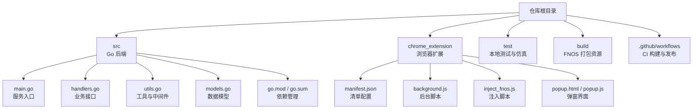
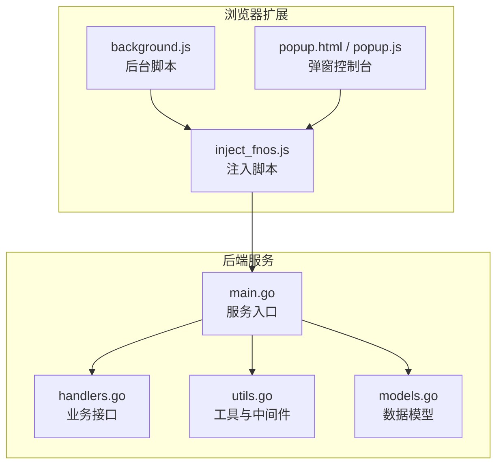
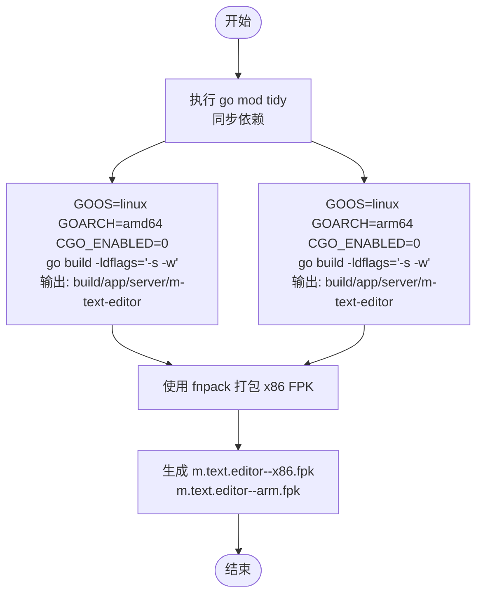
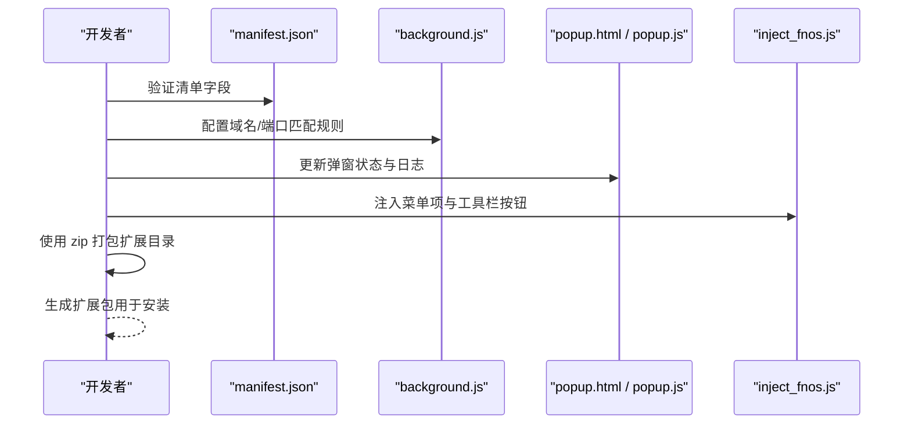
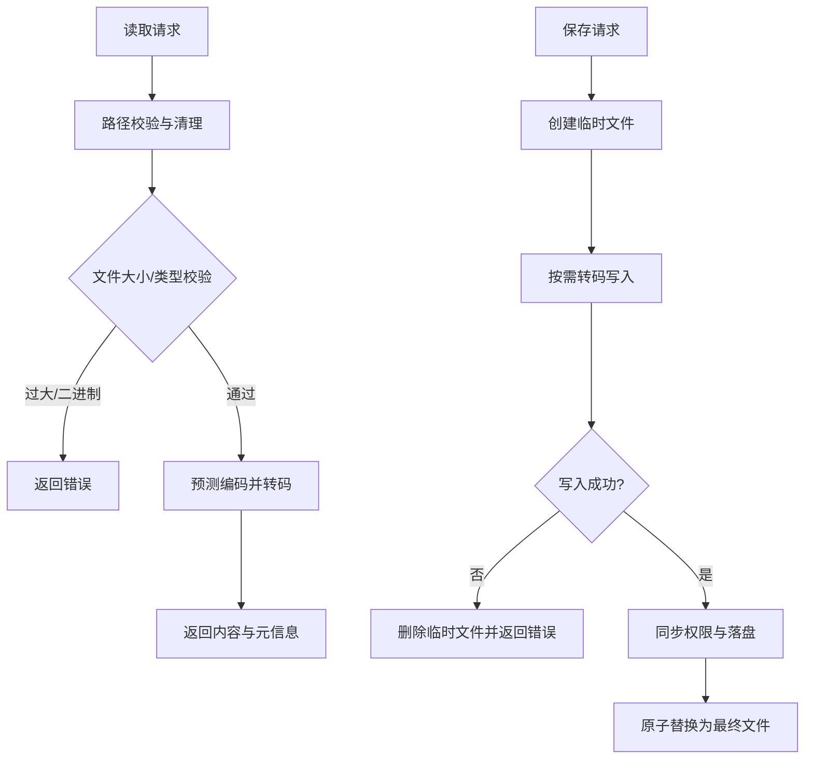
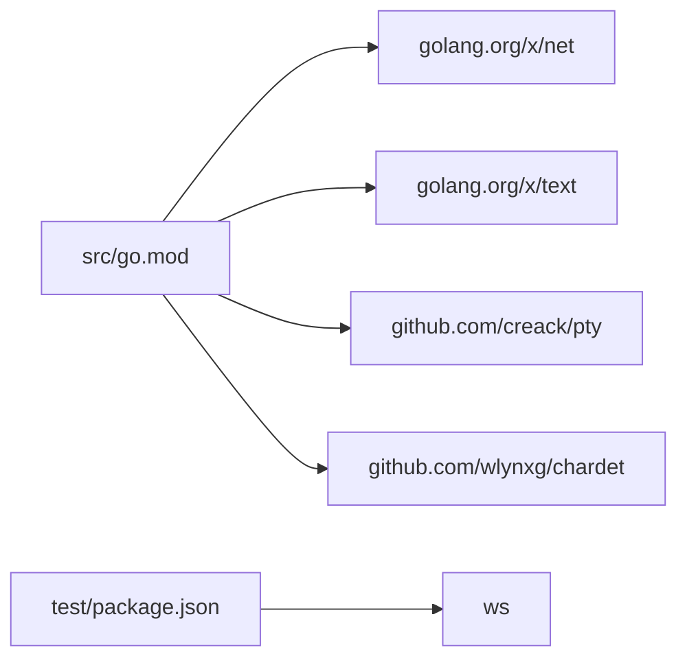

# 本地构建

<cite>
**本文引用的文件**
- [README.md](file://README.md)
- [build.yml](file://.github/workflows/build.yml)
- [go.mod](file://src/go.mod)
- [go.sum](file://src/go.sum)
- [main.go](file://src/main.go)
- [handlers.go](file://src/handlers.go)
- [utils.go](file://src/utils.go)
- [models.go](file://src/models.go)
- [manifest.json](file://chrome_extension/manifest.json)
- [background.js](file://chrome_extension/background.js)
- [inject_fnos.js](file://chrome_extension/inject_fnos.js)
- [popup.html](file://chrome_extension/popup.html)
- [popup.js](file://chrome_extension/popup.js)
- [package.json](file://test/package.json)
</cite>

## 目录
1. [简介](#简介)
2. [项目结构](#项目结构)
3. [核心组件](#核心组件)
4. [架构总览](#架构总览)
5. [详细组件分析](#详细组件分析)
6. [依赖关系分析](#依赖关系分析)
7. [性能考量](#性能考量)
8. [故障排查指南](#故障排查指南)
9. [结论](#结论)
10. [附录](#附录)

## 简介
本指南面向需要在本地完成构建与打包的开发者，涵盖以下内容：
- Go 后端服务的本地构建流程，包括 go mod tidy、go build 的使用与参数说明。
- Chrome 扩展的本地打包与验证流程，包括 manifest.json 配置校验、资源文件处理与扩展包生成。
- 构建产物的组织结构与文件权限设置要点。
- 不同操作系统（Windows、macOS、Linux）下的构建差异与注意事项。
- 常见构建错误排查与解决方案。

## 项目结构
该项目采用多模块布局：
- src：Go 后端服务源码与依赖管理。
- chrome_extension：浏览器扩展源码（Manifest V3），包含后台脚本、注入脚本、弹窗界面等。
- test：本地开发仿真与测试相关资源。
- build：飞牛OS（FNOS）打包分发资源与工具（CI 中使用）。
- .github/workflows：GitHub Actions 构建与发布工作流。

图表来源
- [README.md:12-17](file://README.md#L12-L17)
- [go.mod:1-12](file://src/go.mod#L1-L12)
- [manifest.json:1-28](file://chrome_extension/manifest.json#L1-L28)

章节来源
- [README.md:12-17](file://README.md#L12-L17)
- [go.mod:1-12](file://src/go.mod#L1-L12)
- [manifest.json:1-28](file://chrome_extension/manifest.json#L1-L28)

## 核心组件
- Go 后端服务：提供文件读写、目录浏览、设置存储、WebSocket 终端与文件监控等能力；通过 Unix Socket 对外提供服务。
- 浏览器扩展：在 FNOS 文件管理器中注入菜单项与工具栏按钮，实现“右键编辑/打开目录”的无缝联动。
- 构建与打包：CI 中使用 fnpack 生成 FPK 包，同时打包扩展为 zip；本地可参考此流程进行手工构建与验证。

章节来源
- [main.go:14-144](file://src/main.go#L14-L144)
- [handlers.go:21-614](file://src/handlers.go#L21-L614)
- [utils.go:25-262](file://src/utils.go#L25-L262)
- [build.yml:47-86](file://.github/workflows/build.yml#L47-L86)

## 架构总览
后端服务通过 Unix Socket 提供 HTTP 服务，路由包含静态资源网关、业务 API 与 WebSocket 接口。浏览器扩展在目标页面注入脚本，建立与后端的通信通道，实现文件管理器与编辑器的联动。

图表来源
- [background.js:1-169](file://chrome_extension/background.js#L1-L169)
- [popup.html:1-173](file://chrome_extension/popup.html#L1-L173)
- [inject_fnos.js:1-800](file://chrome_extension/inject_fnos.js#L1-L800)
- [main.go:14-144](file://src/main.go#L14-L144)
- [handlers.go:21-614](file://src/handlers.go#L21-L614)
- [utils.go:25-262](file://src/utils.go#L25-L262)
- [models.go:1-30](file://src/models.go#L1-L30)

## 详细组件分析

### Go 后端服务构建与运行
- 依赖管理
  - 使用 go mod tidy 同步依赖，确保 go.mod 与 go.sum 一致。
  - go.mod 指定 Go 版本与第三方依赖，go.sum 记录校验和。
- 构建命令
  - 使用 go build 生成二进制文件，结合 ldflags 去除符号与调试信息，减小体积。
  - 在 CI 中分别针对 x86 与 arm 平台构建，使用 CGO_ENABLED=0 禁用 CGO，确保跨平台兼容性。
- 运行与权限
  - 服务启动时从环境变量读取应用目录与版本信息，创建 Unix Socket 并设置权限。
  - 通过中间件链实现鉴权、压缩与缓存控制，日志输出便于定位问题。

图表来源
- [build.yml:47-67](file://.github/workflows/build.yml#L47-L67)
- [go.mod:1-12](file://src/go.mod#L1-L12)

章节来源
- [go.mod:1-12](file://src/go.mod#L1-L12)
- [go.sum:1-10](file://src/go.sum#L1-L10)
- [build.yml:47-67](file://.github/workflows/build.yml#L47-L67)
- [main.go:14-144](file://src/main.go#L14-L144)

### 浏览器扩展打包与验证
- 清单配置验证
  - Manifest V3：声明权限、侧边栏默认路径、主机权限、后台脚本、图标等。
  - 通过校验清单字段确保扩展在不同浏览器中的兼容性。
- 资源文件处理
  - 后台脚本负责域名匹配与注入控制，弹窗界面提供运行状态与日志查看。
  - 注入脚本在目标页面动态注入菜单项与工具栏按钮，建立与编辑器的通信。
- 扩展包生成
  - 在 CI 中使用 zip 将 chrome_extension 整体打包为扩展包，便于分发与安装。

图表来源
- [manifest.json:1-28](file://chrome_extension/manifest.json#L1-L28)
- [background.js:1-169](file://chrome_extension/background.js#L1-L169)
- [popup.html:1-173](file://chrome_extension/popup.html#L1-L173)
- [popup.js:1-200](file://chrome_extension/popup.js#L1-L200)
- [inject_fnos.js:1-800](file://chrome_extension/inject_fnos.js#L1-L800)
- [build.yml:83-85](file://.github/workflows/build.yml#L83-L85)

章节来源
- [manifest.json:1-28](file://chrome_extension/manifest.json#L1-L28)
- [background.js:1-169](file://chrome_extension/background.js#L1-L169)
- [popup.html:1-173](file://chrome_extension/popup.html#L1-L173)
- [popup.js:1-200](file://chrome_extension/popup.js#L1-L200)
- [inject_fnos.js:1-800](file://chrome_extension/inject_fnos.js#L1-L800)
- [build.yml:83-85](file://.github/workflows/build.yml#L83-L85)

### 数据流与处理逻辑
- 文件读取与转码
  - 读取文件内容并进行编码预测与转码，限制最大文件大小，避免性能问题。
- 文件保存与原子写入
  - 采用临时文件 + 原子替换策略，保证写入一致性与权限保留。
- WebSocket 终端与文件监控
  - 终端会话通过 PTY 实现，支持窗口尺寸变更与心跳；文件监控周期性检测变更事件。

图表来源
- [handlers.go:114-212](file://src/handlers.go#L114-L212)
- [handlers.go:214-324](file://src/handlers.go#L214-L324)
- [utils.go:108-165](file://src/utils.go#L108-L165)

章节来源
- [handlers.go:114-324](file://src/handlers.go#L114-L324)
- [utils.go:108-165](file://src/utils.go#L108-L165)

## 依赖关系分析
- Go 依赖
  - 使用 golang.org/x/net、golang.org/x/text、github.com/creack/pty、github.com/wlynxg/chardet 等库。
- 测试依赖
  - test/package.json 中包含 ws 依赖，可用于本地 WebSocket 测试场景。

图表来源
- [go.mod:1-12](file://src/go.mod#L1-L12)
- [package.json:1-6](file://test/package.json#L1-L6)

章节来源
- [go.mod:1-12](file://src/go.mod#L1-L12)
- [package.json:1-6](file://test/package.json#L1-L6)

## 性能考量
- 服务端
  - 通过中间件链实现压缩与缓存控制，减少网络传输开销。
  - 静态资源网关对样式与脚本注入版本号，提升缓存命中率。
- 文件处理
  - 限制最大文件大小，避免大文件导致内存与性能压力。
  - 读取时进行二进制检测，防止损坏文件被加载。
- 终端会话
  - 设置读超时与心跳机制，避免长时间空闲连接占用资源。

章节来源
- [main.go:121-128](file://src/main.go#L121-L128)
- [handlers.go:146-176](file://src/handlers.go#L146-L176)
- [utils.go:230-256](file://src/utils.go#L230-L256)

## 故障排查指南
- 环境变量缺失
  - 启动时若未设置 TRIM_APPDEST 或 TRIM_APPVER，服务会直接退出。请在运行环境中正确配置。
- Unix Socket 权限
  - 服务启动后将 socket 权限设置为 0666，确保容器内进程可访问。如遇权限问题，请检查宿主系统与容器权限映射。
- 路径校验与越权
  - cleanAndValidatePath 防范目录逃逸与对应用自身资源目录的访问。若出现“拒绝访问”，请确认路径是否位于允许范围。
- 文件写入失败
  - 保存流程采用临时文件 + 原子替换，若失败会回滚并返回错误。请检查磁盘空间、权限与目标路径是否存在。
- 扩展注入失败
  - 若页面未显示注入状态或菜单项，请检查域名/端口匹配规则与扩展开关状态；必要时在弹窗控制台查看日志。
- CI 打包差异
  - CI 使用 fnpack 与 zip 打包，本地可参考相同流程；若产物不一致，检查平台与工具版本。

章节来源
- [main.go:15-24](file://src/main.go#L15-L24)
- [main.go:130-138](file://src/main.go#L130-L138)
- [utils.go:25-53](file://src/utils.go#L25-L53)
- [handlers.go:214-324](file://src/handlers.go#L214-L324)
- [background.js:10-37](file://chrome_extension/background.js#L10-L37)
- [popup.js:44-97](file://chrome_extension/popup.js#L44-L97)
- [build.yml:47-86](file://.github/workflows/build.yml#L47-L86)

## 结论
通过遵循本指南，可在本地完成 Go 后端服务与浏览器扩展的构建与验证。建议在不同操作系统上分别进行测试，关注环境变量、权限与平台差异，结合日志与中间件输出快速定位问题。对于生产分发，可参考 CI 流程生成跨平台产物并进行一致性校验。

## 附录

### 本地构建步骤（Go 后端）
- 初始化依赖
  - 在 src 目录执行 go mod tidy，确保 go.mod 与 go.sum 一致。
- 构建二进制
  - 使用 CGO_ENABLED=0 禁用 CGO，分别针对 amd64 与 arm64 平台构建，启用 -ldflags="-s -w" 去除符号与调试信息。
- 运行服务
  - 设置 TRIM_APPDEST 与 TRIM_APPVER 环境变量，启动后端服务并通过 Unix Socket 提供接口。

章节来源
- [go.mod:1-12](file://src/go.mod#L1-L12)
- [build.yml:47-67](file://.github/workflows/build.yml#L47-L67)
- [main.go:15-24](file://src/main.go#L15-L24)

### 本地构建步骤（Chrome 扩展）
- 验证清单
  - 检查 manifest.json 的权限、侧边栏路径、后台脚本、图标等字段。
- 资源处理
  - 确认 background.js、inject_fnos.js、popup.html 与 popup.js 的完整性与正确性。
- 打包扩展
  - 使用 zip 将 chrome_extension 目录整体打包为扩展包，便于本地安装与测试。

章节来源
- [manifest.json:1-28](file://chrome_extension/manifest.json#L1-L28)
- [background.js:1-169](file://chrome_extension/background.js#L1-L169)
- [inject_fnos.js:1-800](file://chrome_extension/inject_fnos.js#L1-L800)
- [popup.html:1-173](file://chrome_extension/popup.html#L1-L173)
- [popup.js:1-200](file://chrome_extension/popup.js#L1-L200)
- [build.yml:83-85](file://.github/workflows/build.yml#L83-L85)

### 构建产物组织与权限
- 产物位置
  - 后端二进制输出至 build/app/server/ 下对应平台目录。
  - 扩展包为 chrome_extension.zip。
- 权限设置
  - 服务启动后将 Unix Socket 权限设置为 0666，确保容器内进程可访问。
  - 文件写入时同步原始权限与 UID/GID，必要时进行落盘同步。

章节来源
- [build.yml:47-67](file://.github/workflows/build.yml#L47-L67)
- [main.go:130-138](file://src/main.go#L130-L138)
- [handlers.go:265-298](file://src/handlers.go#L265-L298)
- [handlers.go:518-611](file://src/handlers.go#L518-L611)

### 不同操作系统注意事项
- Windows
  - 使用 WSL 或容器环境进行 Unix Socket 相关测试；注意路径分隔符与权限模拟。
- macOS
  - 默认权限模型与容器权限映射可能不同，建议在容器内统一测试。
- Linux
  - 与 CI 环境一致，使用 CGO_ENABLED=0 与交叉编译工具链，确保产物可执行。

章节来源
- [build.yml:28-33](file://.github/workflows/build.yml#L28-L33)
- [build.yml:47-67](file://.github/workflows/build.yml#L47-L67)