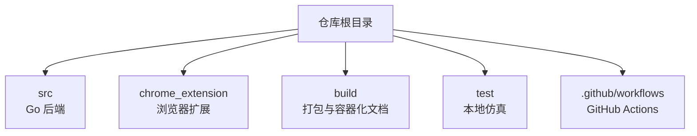
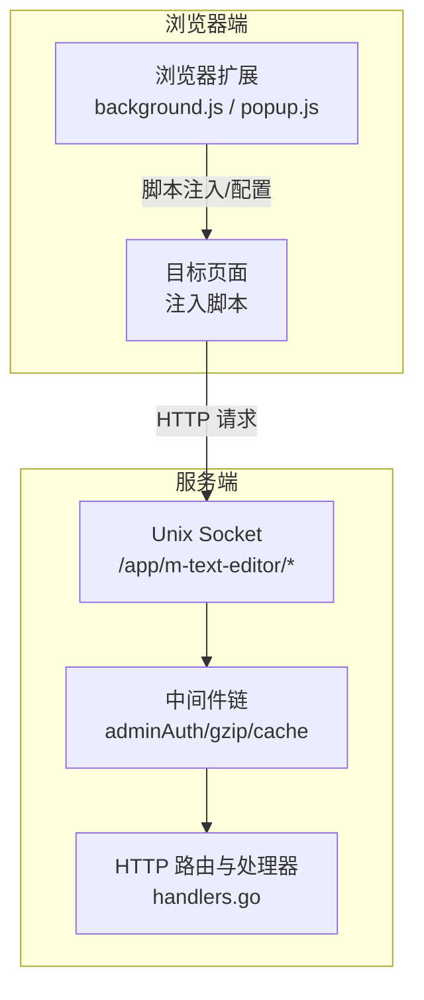
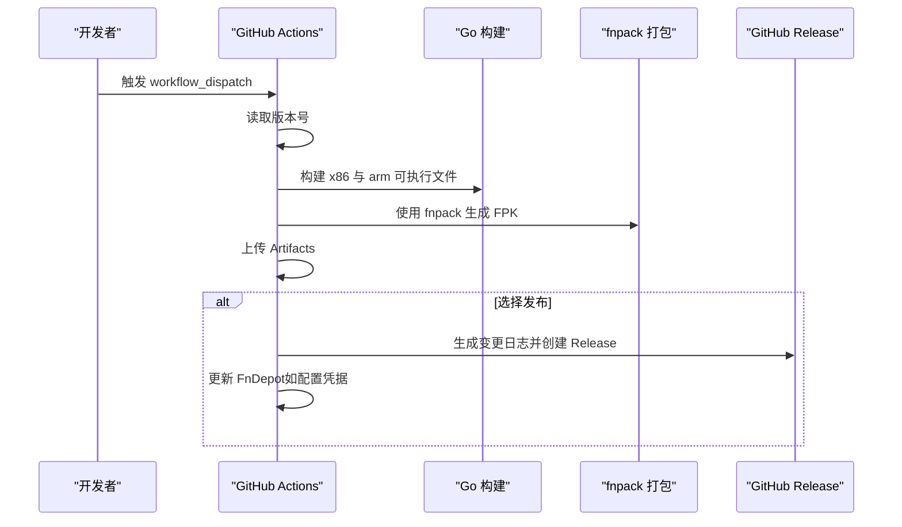
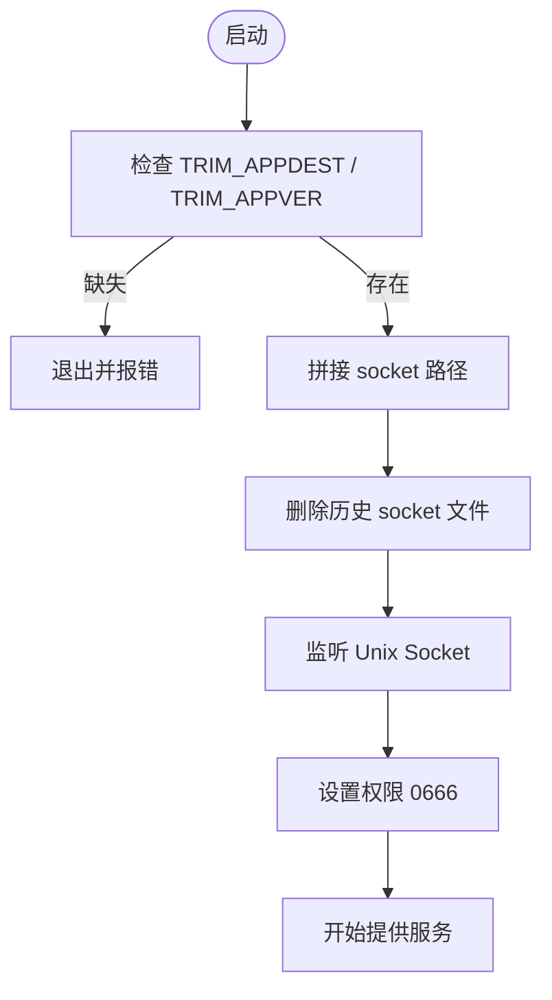
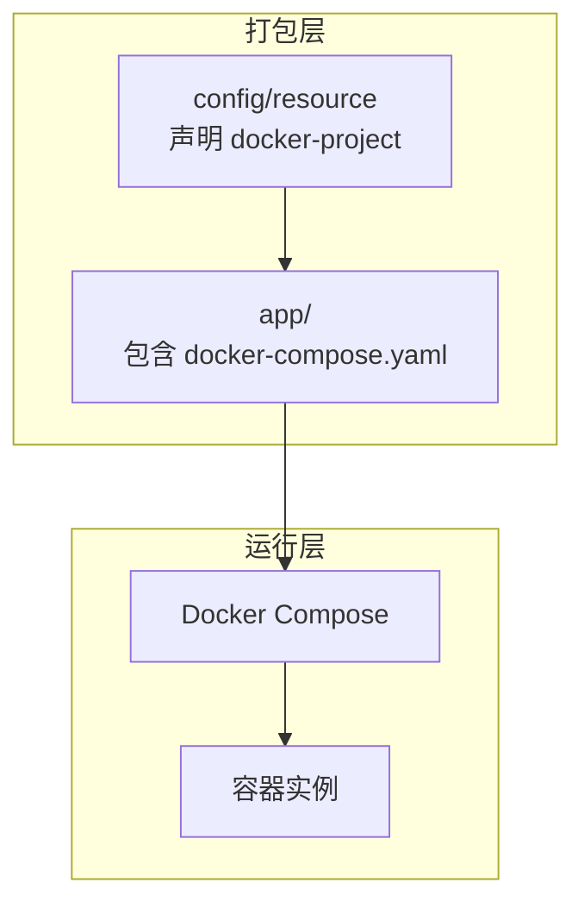
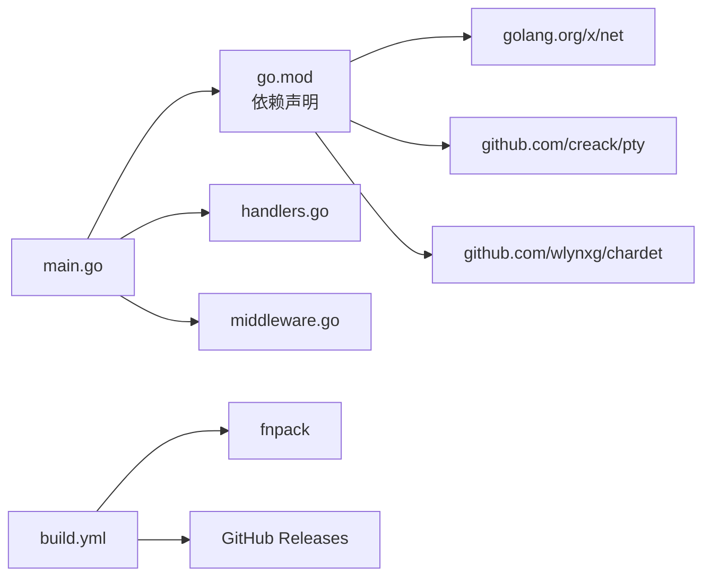

# 构建与部署

<cite>
**本文引用的文件**
- [README.md](file://README.md)
- [main.go](file://src/main.go)
- [handlers.go](file://src/handlers.go)
- [middleware.go](file://src/middleware.go)
- [go.mod](file://src/go.mod)
- [manifest.json](file://chrome_extension/manifest.json)
- [background.js](file://chrome_extension/background.js)
- [popup.js](file://chrome_extension/popup.js)
- [build.yml](file://.github/workflows/build.yml)
- [fnpack_skill.md](file://build/fnpack_skill.md)
- [build/README.md](file://build/README.md)
</cite>

## 目录
1. [简介](#简介)
2. [项目结构](#项目结构)
3. [核心组件](#核心组件)
4. [架构总览](#架构总览)
5. [详细组件分析](#详细组件分析)
6. [依赖关系分析](#依赖关系分析)
7. [性能考虑](#性能考虑)
8. [故障排查指南](#故障排查指南)
9. [结论](#结论)
10. [附录](#附录)

## 简介
本指南面向飞牛OS（FNOS）生态下的 PodNote 文本编辑器，提供从本地构建、Chrome 扩展打包、CI/CD 流水线到多环境部署与验证的完整操作手册。重点涵盖：
- 本地 Go 后端构建与参数配置
- Chrome 扩展打包与签名建议
- GitHub Actions 自动化流水线与测试流程
- 开发/测试/生产三类环境的部署策略与差异
- Unix Socket 的配置与权限设置
- Docker 容器化部署方案（如适用）
- 部署后的验证步骤与监控配置

## 项目结构
该仓库采用按功能域划分的组织方式：
- src：Go 后端服务源码，包含主入口、处理器、中间件与工具函数
- chrome_extension：配套浏览器扩展（Manifest V3），包含后台脚本、弹出页与注入脚本
- build：飞牛OS 打包分发资源与工具说明（含 Docker 与容器化相关文档）
- test：本地开发仿真与示例数据
- .github/workflows：CI/CD 流水线定义

章节来源
- [README.md:12-17](file://README.md#L12-L17)

## 核心组件
- 后端服务（Go）
  - 使用 Unix Socket 提供 HTTP 服务，路由前缀固定为 /app/m-text-editor/
  - 支持静态资源网关、版本号注入、API 路由与 WebSocket 终端/文件监控
  - 通过中间件链实现管理员鉴权、Gzip 压缩与缓存控制
- 浏览器扩展（Manifest V3）
  - 侧边栏面板、后台服务工作者、权限声明与图标
  - 通过脚本注入与存储配置实现与编辑器的联动
- CI/CD（GitHub Actions）
  - 构建 x86 与 arm 两套 FPK 包，打包 Chrome 扩展 ZIP
  - 可选发布到 GitHub Release 并更新 FnDepot

章节来源
- [main.go:14-144](file://src/main.go#L14-L144)
- [handlers.go:21-611](file://src/handlers.go#L21-L611)
- [middleware.go:22-92](file://src/middleware.go#L22-L92)
- [manifest.json:1-28](file://chrome_extension/manifest.json#L1-L28)
- [build.yml:16-160](file://.github/workflows/build.yml#L16-L160)

## 架构总览
后端以 Unix Socket 作为入口，通过 HTTP 路由提供静态资源与业务 API，并通过 WebSocket 提供终端与文件监控能力。浏览器扩展负责在目标页面注入脚本并提供配置面板。

图表来源
- [main.go:37-129](file://src/main.go#L37-L129)
- [handlers.go:114-516](file://src/handlers.go#L114-L516)
- [middleware.go:22-92](file://src/middleware.go#L22-L92)
- [background.js:1-169](file://chrome_extension/background.js#L1-L169)
- [popup.js:1-200](file://chrome_extension/popup.js#L1-L200)

## 详细组件分析

### 本地构建（Go 后端）
- 构建目标
  - 生成 Linux 平台可执行文件，用于飞牛OS应用容器运行
- 关键参数
  - GOOS=linux、GOARCH=amd64/arm64、CGO_ENABLED=0（静态链接）
  - ldflags="-s -w"（剥离符号与调试信息）
- 输出位置
  - 产物输出至 build/app/server/m-text-editor
- 运行前置条件
  - 需要设置 TRIM_APPDEST 与 TRIM_APPVER 环境变量，服务启动时会校验
  - 服务监听 Unix Socket：appDest/m-text-editor.sock
  - 静态资源目录：appDest/www

章节来源
- [build.yml:47-67](file://.github/workflows/build.yml#L47-L67)
- [main.go:16-28](file://src/main.go#L16-L28)
- [main.go:130-143](file://src/main.go#L130-L143)

### Chrome 扩展打包与签名
- Manifest V3 结构
  - 侧边栏默认页、后台服务工作者、权限与图标声明
- 打包流程
  - 将 chrome_extension 目录整体压缩为 zip，便于分发
- 签名建议
  - 建议在发布渠道（如 Microsoft Edge Add-ons）完成签名与上架
  - 本地安装时需启用“开发者模式”，选择“加载已解压的扩展程序”

章节来源
- [manifest.json:1-28](file://chrome_extension/manifest.json#L1-L28)
- [build.yml:83-85](file://.github/workflows/build.yml#L83-L85)
- [README.md:23-31](file://README.md#L23-L31)

### CI/CD 流水线（GitHub Actions）
- 触发方式
  - workflow_dispatch：支持手动触发并选择是否发布
- 关键步骤
  - 读取 build/manifest 中的版本号
  - 安装并使用 fnpack 工具
  - 分别构建 x86 与 arm 平台的 FPK 包
  - 上传为 Artifacts
  - 可选：生成变更日志、清理旧 Release/Tag、创建新 Release 并上传产物
  - 可选：推送更新到 FnDepot（需要 FnDepot_TOKEN）

图表来源
- [build.yml:16-160](file://.github/workflows/build.yml#L16-L160)

章节来源
- [build.yml:1-160](file://.github/workflows/build.yml#L1-L160)

### 不同环境的部署策略与配置差异
- 开发环境
  - 本地运行后端：设置 TRIM_APPDEST 与 TRIM_APPVER，确保 www 目录存在且包含静态资源
  - 本地安装浏览器扩展：启用“开发者模式”，加载已解压扩展
- 测试环境
  - 使用 CI 产出的 FPK 包进行安装验证
  - 对比 x86 与 arm 平台行为一致性
- 生产环境
  - 通过飞牛OS应用商店或 FnDepot 分发
  - 确保 Unix Socket 权限与容器运行上下文一致

章节来源
- [main.go:16-28](file://src/main.go#L16-L28)
- [README.md:23-31](file://README.md#L23-L31)
- [fnpack_skill.md:180-183](file://build/fnpack_skill.md#L180-L183)

### Unix Socket 的配置与权限设置
- 监听路径
  - socketPath = appDest + "/m-text-editor.sock"
- 启动流程
  - 删除历史 socket 文件
  - 监听 Unix Socket
  - 设置权限掩码 0666
- 权限建议
  - 确保运行用户对 appDest 具备读写权限
  - 如需限制访问，可在上游网关或容器层面做 ACL 控制

图表来源
- [main.go:16-28](file://src/main.go#L16-L28)
- [main.go:130-143](file://src/main.go#L130-L143)

章节来源
- [main.go:16-28](file://src/main.go#L16-L28)
- [main.go:130-143](file://src/main.go#L130-L143)

### Docker 容器化部署方案
- 适用场景
  - 通过 Docker Compose 管理容器堆栈，结合 fnpack 的 docker-project 声明
- 关键点
  - app/docker/docker-compose.yaml 的容器名称需与状态检查逻辑一致
  - 通过 docker inspect 动态检查容器运行状态
- 模板创建
  - 可使用 fnpack 模板创建 docker 项目或仅服务项目

图表来源
- [fnpack_skill.md:180-183](file://build/fnpack_skill.md#L180-L183)
- [fnpack_skill.md:871-877](file://build/fnpack_skill.md#L871-L877)
- [fnpack_skill.md:911](file://build/fnpack_skill.md#L911)

章节来源
- [fnpack_skill.md:180-183](file://build/fnpack_skill.md#L180-L183)
- [fnpack_skill.md:871-877](file://build/fnpack_skill.md#L871-L877)
- [fnpack_skill.md:911](file://build/fnpack_skill.md#L911)

### 部署后的验证步骤与监控配置
- 验证步骤
  - 访问静态首页与样式网关，确认版本号注入生效
  - 调用 API 列表/读取/保存等接口，验证文件系统权限与编码处理
  - 建立 WebSocket 连接（终端/文件监控），确认消息收发
  - 浏览器扩展侧边栏状态与日志显示正常
- 监控建议
  - 通过容器日志采集与告警
  - 对关键 API 响应时间与错误率进行指标上报
  - 对 Unix Socket 连接数与文件系统 IO 进行资源监控

章节来源
- [main.go:40-109](file://src/main.go#L40-L109)
- [handlers.go:21-611](file://src/handlers.go#L21-L611)
- [popup.js:99-158](file://chrome_extension/popup.js#L99-L158)

## 依赖关系分析
- Go 模块依赖
  - 使用 golang.org/x/net 提供 WebSocket 支持
  - 使用 github.com/creack/pty 实现终端 PTY 桥接
  - 使用 github.com/wlynxg/chardet 进行编码预测
- 中间件依赖
  - gzip 压缩依赖标准库 compress/gzip
  - 路由与处理器依赖 net/http
- 打包与分发
  - 依赖 fnpack 工具生成 FPK 包
  - 依赖 GitHub Actions 与 GitHub Releases

图表来源
- [go.mod:1-12](file://src/go.mod#L1-L12)
- [main.go:3-12](file://src/main.go#L3-L12)
- [handlers.go:3-19](file://src/handlers.go#L3-L19)
- [middleware.go:3-12](file://src/middleware.go#L3-L12)
- [build.yml:42-45](file://.github/workflows/build.yml#L42-L45)

章节来源
- [go.mod:1-12](file://src/go.mod#L1-L12)
- [build.yml:42-45](file://.github/workflows/build.yml#L42-L45)

## 性能考虑
- 静态资源缓存
  - Monaco 核心资源强缓存一年
  - 带版本号的业务资源强缓存 30 天
  - 普通业务资源缓存 1 天
- 压缩策略
  - 仅对 .js/.css/.html 与 API 响应启用 Gzip，WebSocket 与终端接口跳过
  - 使用 sync.Pool 复用 gzip.Writer，降低分配开销
- 文件读写
  - 保存采用临时文件 + 原子重命名，避免部分写入
  - 同步落盘与权限继承，兼顾一致性与安全性

章节来源
- [middleware.go:74-92](file://src/middleware.go#L74-L92)
- [middleware.go:14-20](file://src/middleware.go#L14-L20)
- [handlers.go:270-324](file://src/handlers.go#L270-L324)

## 故障排查指南
- 环境变量缺失
  - 现象：启动即退出并提示未检测到 TRIM_APPDEST/TRIM_APPVER
  - 处理：在飞牛OS应用容器环境中设置上述变量
- Unix Socket 权限问题
  - 现象：无法监听或连接失败
  - 处理：确认 appDest 目录存在且具备写权限；检查 socket 文件权限掩码
- 路由前缀不匹配
  - 现象：静态资源 404 或版本号未注入
  - 处理：确认浏览器扩展与后端路由前缀一致（/app/m-text-editor/）
- 管理员鉴权失败
  - 现象：访问受限返回 403
  - 处理：在生产环境确保 X-Trim-Isadmin 头为 true
- 扩展未注入或状态异常
  - 现象：侧边栏显示未激活或日志为空
  - 处理：检查扩展开关、匹配规则与页面注入标记；必要时触发重注

章节来源
- [main.go:16-24](file://src/main.go#L16-L24)
- [main.go:130-143](file://src/main.go#L130-L143)
- [handlers.go:516-516](file://src/handlers.go#L516-L516)
- [popup.js:99-158](file://chrome_extension/popup.js#L99-L158)
- [background.js:40-117](file://chrome_extension/background.js#L40-L117)

## 结论
本指南提供了从本地构建、扩展打包、CI/CD 自动化到多环境部署与验证的全链路方法论。建议在开发阶段优先验证 Unix Socket 与静态资源网关，在测试阶段对比不同平台产物，在生产阶段配合容器化与监控体系保障稳定性。

## 附录
- 配置文件与权限
  - config/privilege：权限声明文件
  - config_callback：安装向导回调，用于初始化端口、挂载与 Socket 权限
- Docker 项目模板
  - 使用 fnpack 模板创建 docker 项目或仅服务项目

章节来源
- [build/README.md:12-24](file://build/README.md#L12-L24)
- [fnpack_skill.md:999-1005](file://build/fnpack_skill.md#L999-L1005)