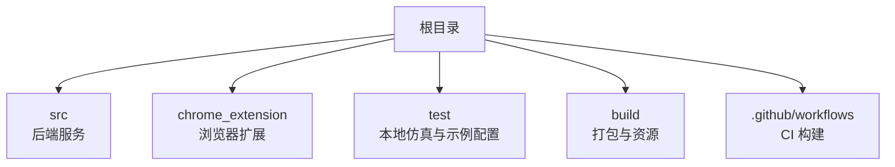
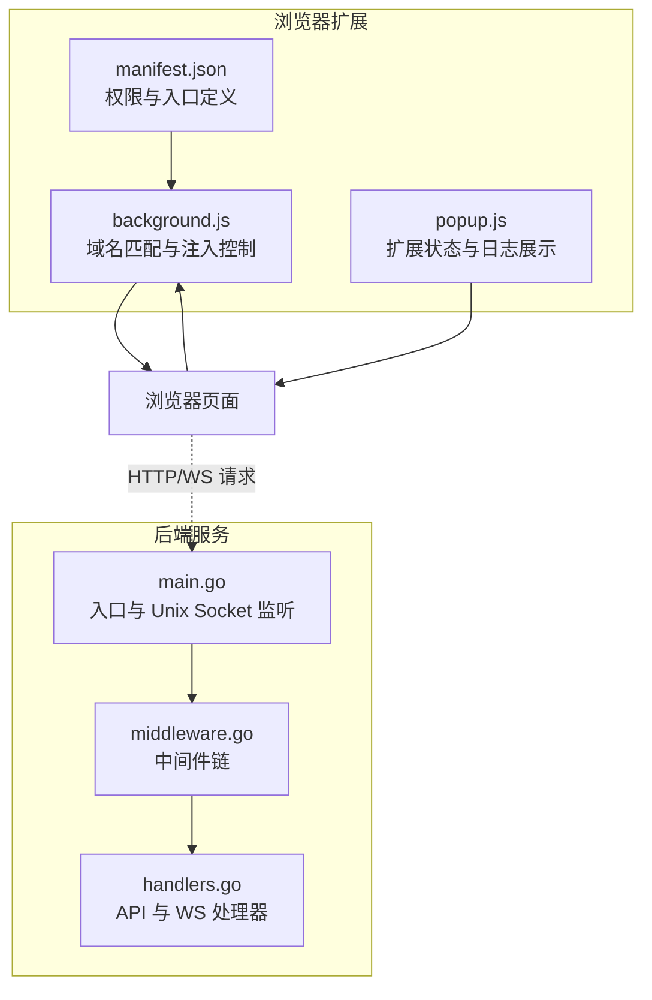
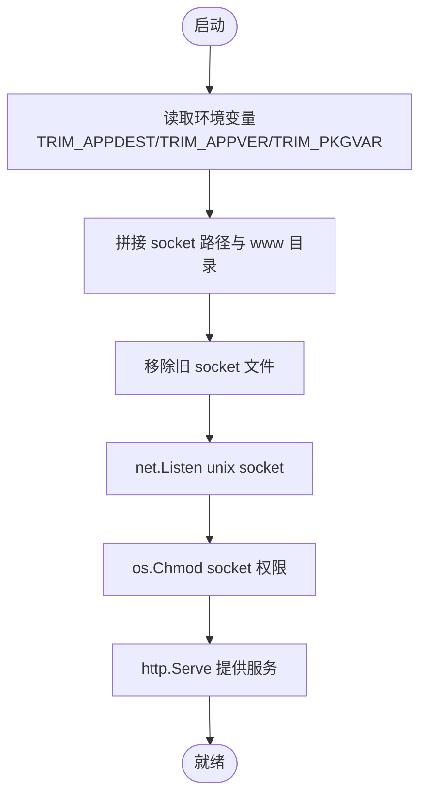
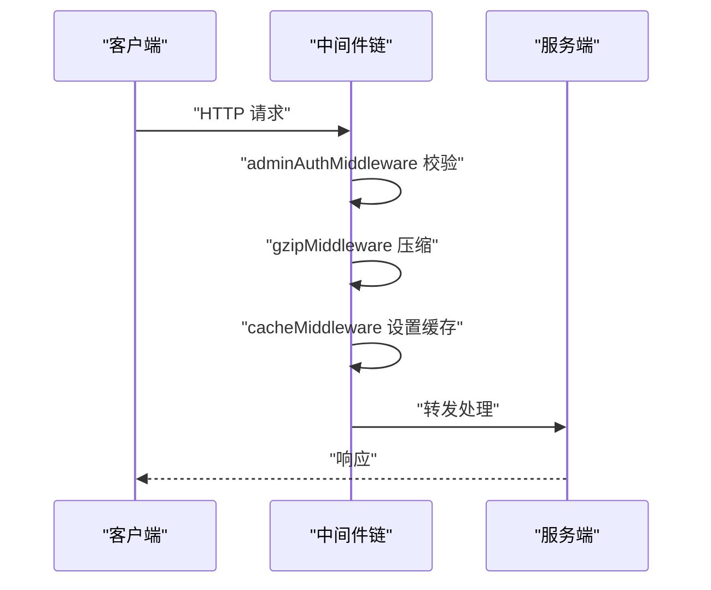
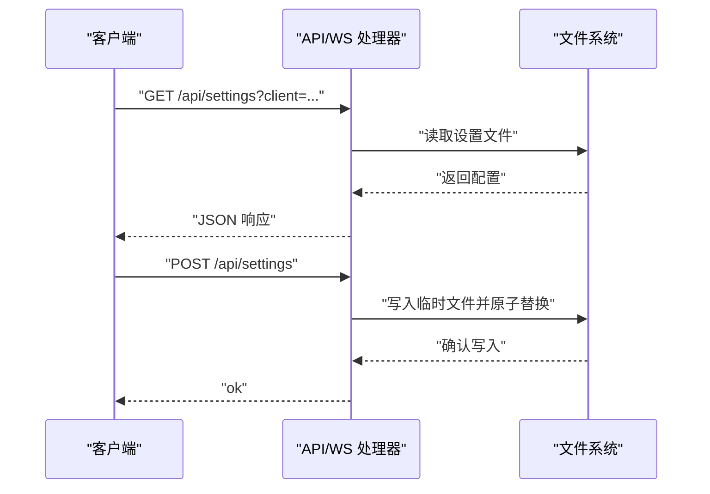
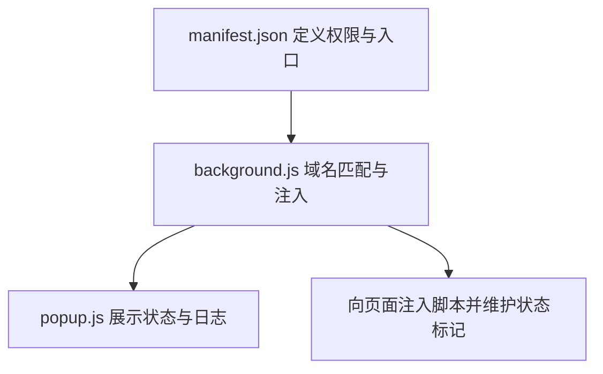
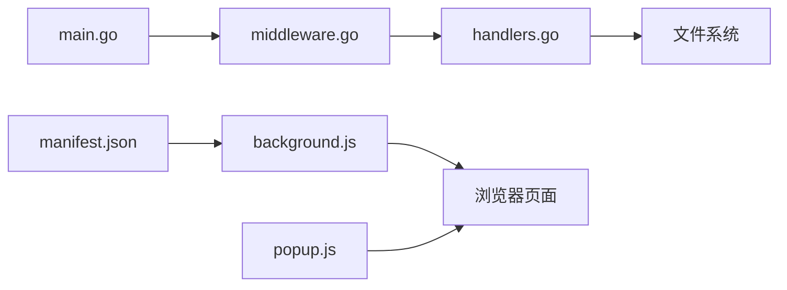

# 环境配置

<cite>
**本文引用的文件**
- [README.md](file://README.md)
- [main.go](file://src/main.go)
- [handlers.go](file://src/handlers.go)
- [middleware.go](file://src/middleware.go)
- [manifest.json](file://chrome_extension/manifest.json)
- [background.js](file://chrome_extension/background.js)
- [popup.js](file://chrome_extension/popup.js)
- [settings.json](file://test/scratch/settings.json)
- [settings_mobile.json](file://test/scratch/settings_mobile.json)
- [build.yml](file://.github/workflows/build.yml)
</cite>

## 目录
1. [简介](#简介)
2. [项目结构](#项目结构)
3. [核心组件](#核心组件)
4. [架构总览](#架构总览)
5. [详细组件分析](#详细组件分析)
6. [依赖关系分析](#依赖关系分析)
7. [性能考量](#性能考量)
8. [故障排查指南](#故障排查指南)
9. [结论](#结论)
10. [附录](#附录)

## 简介
本指南围绕多环境配置管理展开，结合仓库中的后端服务、浏览器扩展与测试配置，系统阐述开发、测试、生产三类环境的配置差异与切换方法；解释 Unix Socket 的配置参数与权限设置；说明 Chrome 扩展在不同环境下的 manifest 配置要点；给出环境变量管理与敏感信息保护的最佳实践；并提供配置文件版本控制与部署策略建议以及环境迁移与配置验证方法。

## 项目结构
该仓库采用按职责分层的组织方式：
- src：Go 后端服务源码，包含入口、路由、中间件、处理器与工具函数
- chrome_extension：配套浏览器扩展源码（Manifest V3）
- test：本地开发仿真与示例配置（含桌面与移动端设置样例）
- build/.github/workflows：构建与发布流水线（CI）

章节来源
- [README.md:12-17](file://README.md#L12-L17)

## 核心组件
- 后端服务入口与 Unix Socket 监听
  - 通过环境变量驱动运行形态与资源路径，监听 Unix Socket 并设置权限
- 中间件链
  - 管理员鉴权、Gzip 压缩、缓存控制与日志审计
- API 处理器
  - 文件读写、目录列举、设置读写、WebSocket 文件监控与终端会话
- 浏览器扩展
  - Manifest V3 配置、后台脚本与弹窗脚本，负责域名匹配与注入控制

章节来源
- [main.go:15-144](file://src/main.go#L15-L144)
- [middleware.go:22-92](file://src/middleware.go#L22-L92)
- [handlers.go:21-611](file://src/handlers.go#L21-L611)
- [manifest.json:1-28](file://chrome_extension/manifest.json#L1-L28)
- [background.js:1-169](file://chrome_extension/background.js#L1-L169)
- [popup.js:1-200](file://chrome_extension/popup.js#L1-L200)

## 架构总览
下图展示后端服务、浏览器扩展与运行环境之间的交互关系，以及 Unix Socket 的接入点。

图表来源
- [main.go:15-144](file://src/main.go#L15-L144)
- [middleware.go:22-92](file://src/middleware.go#L22-L92)
- [handlers.go:21-611](file://src/handlers.go#L21-L611)
- [manifest.json:1-28](file://chrome_extension/manifest.json#L1-L28)
- [background.js:1-169](file://chrome_extension/background.js#L1-L169)
- [popup.js:1-200](file://chrome_extension/popup.js#L1-L200)

## 详细组件分析

### Unix Socket 配置与权限
- 监听与权限
  - 服务启动时移除旧 socket 文件，监听 Unix Socket，并将权限设置为可读写
  - 该行为在不同环境中应保持一致，但需确保宿主系统具备相应权限与目录可写性
- 环境变量
  - TRIM_APPDEST：决定服务运行形态与资源路径前缀
  - TRIM_APPVER：用于前端资源版本注入
  - TRIM_PKGVAR：用于云端设置文件的读写路径
- 安全建议
  - 将 socket 文件置于受控目录，避免暴露至公网
  - 仅授予必要用户组读写权限，避免过度放权
  - 结合操作系统安全基线（如最小权限原则）进行加固

图表来源
- [main.go:15-144](file://src/main.go#L15-L144)

章节来源
- [main.go:15-144](file://src/main.go#L15-L144)

### 管理员鉴权与缓存策略
- 管理员鉴权
  - 仅在 TRIM_APPDEST 存在时启用，通过请求头 X-Trim-Isadmin 校验
- Gzip 压缩
  - 对静态资源与 API 响应进行透明压缩，忽略 WebSocket 升级请求
- 缓存控制
  - Monaco 核心资源强缓存一年；带版本号的业务资源缓存 30 天；普通业务资源缓存 1 天

图表来源
- [middleware.go:22-92](file://src/middleware.go#L22-L92)

章节来源
- [middleware.go:22-92](file://src/middleware.go#L22-L92)

### API 与 WebSocket 处理器
- 文件操作
  - 读取、保存、新建、目录列举等，均进行路径合法性校验与权限限制
- 设置读写
  - 通过 TRIM_PKGVAR 指定设置文件位置，支持桌面与移动端两种配置文件
- WebSocket
  - 文件监控与终端会话，终端连接需管理员权限

图表来源
- [handlers.go:518-611](file://src/handlers.go#L518-L611)

章节来源
- [handlers.go:21-611](file://src/handlers.go#L21-L611)

### 浏览器扩展配置（Manifest V3）
- 权限与入口
  - scripting、storage、tabs、sidePanel 等权限
  - 默认侧边面板与 action 弹窗
- 后台脚本
  - 域名匹配逻辑与注入控制，支持动态启用/禁用与重注流程
- 弹窗脚本
  - 展示运行状态、功能注入进度与日志

图表来源
- [manifest.json:1-28](file://chrome_extension/manifest.json#L1-L28)
- [background.js:1-169](file://chrome_extension/background.js#L1-L169)
- [popup.js:1-200](file://chrome_extension/popup.js#L1-L200)

章节来源
- [manifest.json:1-28](file://chrome_extension/manifest.json#L1-L28)
- [background.js:1-169](file://chrome_extension/background.js#L1-L169)
- [popup.js:1-200](file://chrome_extension/popup.js#L1-L200)

### 多环境配置差异与切换
- 开发环境
  - 使用本地仿真与示例配置，便于快速迭代
  - 可通过环境变量模拟 TRIM_APPDEST/TRIM_APPVER/TRIM_PKGVAR，验证路径与版本注入
- 测试环境
  - 与生产相近的资源布局，但不对外暴露 Unix Socket
  - 通过 CI 构建产物进行部署验证
- 生产环境
  - 严格的安全与权限控制，启用管理员鉴权
  - Unix Socket 放置于受控目录，权限最小化

章节来源
- [main.go:15-144](file://src/main.go#L15-L144)
- [middleware.go:22-92](file://src/middleware.go#L22-L92)
- [build.yml:16-56](file://.github/workflows/build.yml#L16-L56)

### Chrome 扩展在不同环境下的 manifest.json 差异
- Manifest V3 权限与入口在各环境保持一致
- 域名匹配规则可通过扩展弹窗动态调整，适用于不同测试与生产域名
- 建议在不同环境使用不同的存储键值或独立的配置文件，避免跨环境污染

章节来源
- [manifest.json:1-28](file://chrome_extension/manifest.json#L1-L28)
- [background.js:5-37](file://chrome_extension/background.js#L5-L37)
- [popup.js:13-42](file://chrome_extension/popup.js#L13-L42)

### 环境变量管理与敏感信息保护
- 关键环境变量
  - TRIM_APPDEST：应用运行目录，决定 socket 与 www 路径
  - TRIM_APPVER：前端资源版本号，用于缓存失效与一致性
  - TRIM_PKGVAR：设置文件存储目录，区分桌面与移动端配置
- 最佳实践
  - 使用密钥管理服务或环境变量加密工具管理敏感值
  - 在 CI 中使用受控的 secrets 管理，避免硬编码
  - 对外暴露的配置仅包含非敏感参数

章节来源
- [main.go:16-24](file://src/main.go#L16-L24)
- [handlers.go:518-529](file://src/handlers.go#L518-L529)

### 配置文件版本控制与部署策略
- 版本控制
  - settings.json 与 settings_mobile.json 作为示例配置纳入版本库，便于团队协作与回溯
- 部署策略
  - 通过 CI 构建打包，按平台生成产物并在受控环境中部署
  - 生产环境仅部署必要的静态资源与二进制，避免将开发配置随包发布

章节来源
- [settings.json:1-16](file://test/scratch/settings.json#L1-L16)
- [settings_mobile.json:1-16](file://test/scratch/settings_mobile.json#L1-L16)
- [build.yml:16-56](file://.github/workflows/build.yml#L16-L56)

### 环境迁移与配置验证
- 迁移步骤
  - 明确 TRIM_APPDEST/TRIM_APPVER/TRIM_PKGVAR 的目标值
  - 验证 socket 权限与目录可写性
  - 通过 API 与 WebSocket 接口进行连通性与功能验证
- 验证方法
  - 读取设置接口：GET /api/settings?client=...
  - 保存设置接口：POST /api/settings
  - 终端会话：/api/terminal/ws（需管理员权限）
  - 文件监控：/api/watch/ws

章节来源
- [handlers.go:518-611](file://src/handlers.go#L518-L611)
- [handlers.go:426-494](file://src/handlers.go#L426-L494)
- [handlers.go:496-516](file://src/handlers.go#L496-L516)

## 依赖关系分析
- 组件耦合
  - 入口依赖中间件链，中间件链再依赖处理器
  - 处理器依赖文件系统与环境变量
  - 扩展通过后台脚本与弹窗脚本与页面交互
- 外部依赖
  - Go 标准库与第三方库（如 WebSocket、Gzip、文本编码等）
  - 浏览器扩展 API（storage、tabs、scripting、sidePanel 等）

图表来源
- [main.go:15-144](file://src/main.go#L15-L144)
- [middleware.go:22-92](file://src/middleware.go#L22-L92)
- [handlers.go:21-611](file://src/handlers.go#L21-L611)
- [manifest.json:1-28](file://chrome_extension/manifest.json#L1-L28)
- [background.js:1-169](file://chrome_extension/background.js#L1-L169)
- [popup.js:1-200](file://chrome_extension/popup.js#L1-L200)

## 性能考量
- 压缩与缓存
  - 合理的 Gzip 压缩与缓存策略可显著降低带宽与首屏时间
- 资源版本注入
  - 通过 TRIM_APPVER 为静态资源注入版本号，提升缓存命中与更新可控性
- 文件操作
  - 保存采用原子替换与临时文件机制，减少数据损坏风险

章节来源
- [middleware.go:40-92](file://src/middleware.go#L40-L92)
- [main.go:40-109](file://src/main.go#L40-L109)
- [handlers.go:214-324](file://src/handlers.go#L214-L324)

## 故障排查指南
- Unix Socket 监听失败
  - 检查 TRIM_APPDEST 是否设置，确认 socket 路径可写
  - 校验权限是否被正确设置为可读写
- 管理员鉴权失败
  - 确认请求头 X-Trim-Isadmin 是否为预期值
- 设置读写异常
  - 检查 TRIM_PKGVAR 是否设置，确认目标目录存在且可写
- 终端连接被拒
  - 确认管理员权限与请求头携带情况

章节来源
- [main.go:15-144](file://src/main.go#L15-L144)
- [middleware.go:22-38](file://src/middleware.go#L22-L38)
- [handlers.go:518-611](file://src/handlers.go#L518-L611)
- [handlers.go:496-516](file://src/handlers.go#L496-L516)

## 结论
通过明确的环境变量约定、严格的 Unix Socket 权限控制、清晰的中间件链与 API 设计，以及浏览器扩展的动态注入与状态管理，本项目实现了在多环境下的稳定配置与高效运维。建议在实际落地中结合企业安全基线与合规要求，持续优化配置与部署流程。

## 附录
- 示例配置文件
  - 桌面端设置：[settings.json:1-16](file://test/scratch/settings.json#L1-L16)
  - 移动端设置：[settings_mobile.json:1-16](file://test/scratch/settings_mobile.json#L1-L16)
- CI 构建与发布
  - [build.yml:16-56](file://.github/workflows/build.yml#L16-L56)