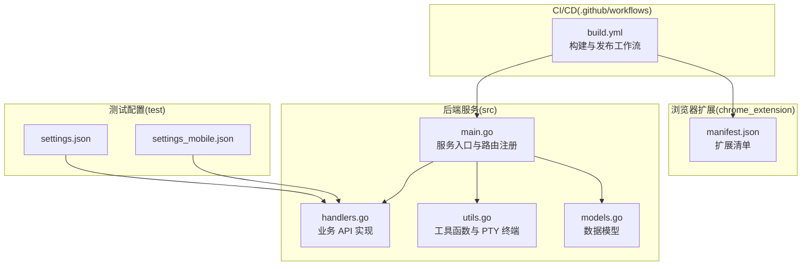
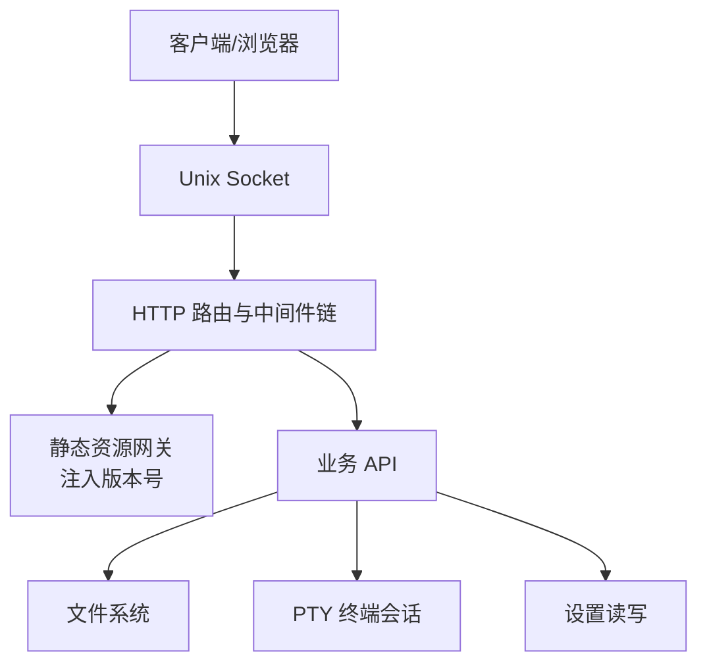
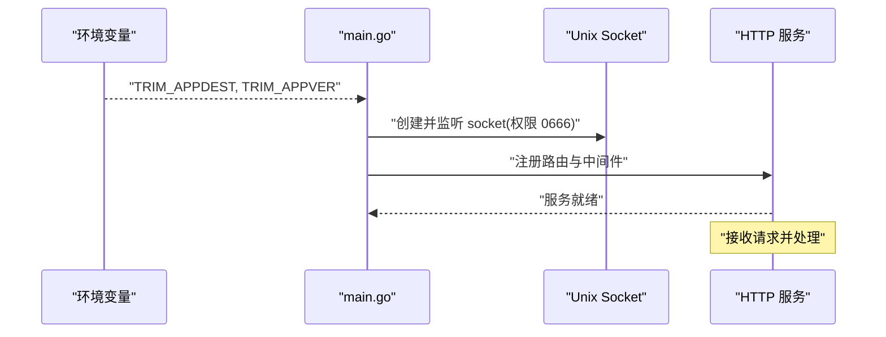
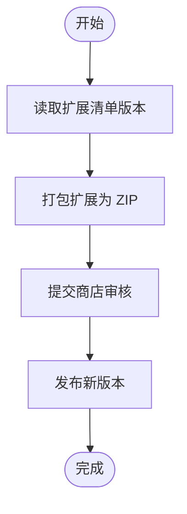
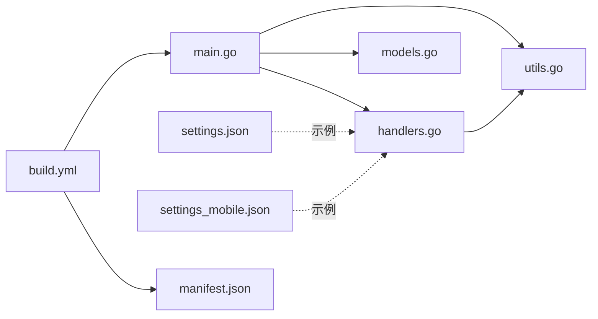

# 部署指南

<cite>
**本文引用的文件**
- [README.md](file://README.md)
- [main.go](file://src/main.go)
- [handlers.go](file://src/handlers.go)
- [utils.go](file://src/utils.go)
- [models.go](file://src/models.go)
- [manifest.json](file://chrome_extension/manifest.json)
- [build.yml](file://.github/workflows/build.yml)
- [settings.json](file://test/scratch/settings.json)
- [settings_mobile.json](file://test/scratch/settings_mobile.json)
</cite>

## 目录
1. [简介](#简介)
2. [项目结构](#项目结构)
3. [核心组件](#核心组件)
4. [架构总览](#架构总览)
5. [详细组件分析](#详细组件分析)
6. [依赖关系分析](#依赖关系分析)
7. [性能考虑](#性能考虑)
8. [故障排查指南](#故障排查指南)
9. [结论](#结论)
10. [附录](#附录)

## 简介
本指南面向生产环境部署 PodNote 文本编辑器服务，涵盖服务安装、配置文件放置与权限设置、Chrome 扩展发布流程、服务启动与停止、部署后验证与健康检查、监控与日志配置，以及故障恢复与紧急回滚操作。文档严格基于仓库中的实际代码与工作流定义，确保可执行性与准确性。

## 项目结构
- 后端服务位于 src/，采用 Go 语言实现，通过 Unix Socket 对外提供 HTTP 服务，并内置静态资源网关与 API。
- 前端静态资源与 www 目录由飞牛 OS 打包工具生成并随 FPK 包分发。
- Chrome 扩展位于 chrome_extension/，使用 Manifest V3，包含后台脚本、弹出面板与图标等。
- 自动化构建与发布由 GitHub Actions 工作流负责，产出 x86 与 ARM 架构的 FPK 包，并可选发布至 GitHub Releases 与 FnDepot。

**图表来源**
- [main.go:1-145](file://src/main.go#L1-L145)
- [handlers.go:1-614](file://src/handlers.go#L1-L614)
- [utils.go:1-262](file://src/utils.go#L1-L262)
- [models.go:1-30](file://src/models.go#L1-L30)
- [manifest.json:1-28](file://chrome_extension/manifest.json#L1-L28)
- [build.yml:1-160](file://.github/workflows/build.yml#L1-L160)
- [settings.json:1-16](file://test/scratch/settings.json#L1-L16)
- [settings_mobile.json:1-16](file://test/scratch/settings_mobile.json#L1-L16)

**章节来源**
- [README.md:12-17](file://README.md#L12-L17)
- [main.go:15-35](file://src/main.go#L15-L35)
- [build.yml:17-82](file://.github/workflows/build.yml#L17-L82)

## 核心组件
- 服务入口与路由
  - 通过环境变量 TRIM_APPDEST 与 TRIM_APPVER 获取应用根目录与版本号，用于定位 www 静态资源与注入版本号。
  - 使用 Unix Socket 监听请求，权限设置为 0666，便于上游网关或容器进程访问。
  - 注册静态资源网关与业务 API 路由，统一通过中间件链处理鉴权、压缩与缓存。
- 业务 API
  - 文件读取、保存、新建、目录列举、设置读写、WebSocket 文件监控与终端会话。
- 工具与模型
  - 路径安全校验、编码探测与转换、语言识别、PTY 终端会话与窗口尺寸调整。
- 扩展清单
  - Manifest V3，声明权限、后台脚本、侧边面板与图标等。

**章节来源**
- [main.go:15-145](file://src/main.go#L15-L145)
- [handlers.go:21-614](file://src/handlers.go#L21-L614)
- [utils.go:25-262](file://src/utils.go#L25-L262)
- [models.go:3-30](file://src/models.go#L3-L30)
- [manifest.json:1-28](file://chrome_extension/manifest.json#L1-L28)

## 架构总览
后端服务通过 Unix Socket 提供 HTTP 服务，静态资源由内置网关按需注入版本号；业务 API 通过中间件链处理请求；WebSocket 用于文件监控与终端会话。

**图表来源**
- [main.go:37-129](file://src/main.go#L37-L129)
- [handlers.go:21-614](file://src/handlers.go#L21-L614)
- [utils.go:167-262](file://src/utils.go#L167-L262)

## 详细组件分析

### 服务安装与配置
- 安装介质
  - 使用 GitHub Actions 产出的 x86 与 ARM 架构 FPK 包，FPK 内含后端二进制与 www 静态资源。
- 部署位置
  - 服务期望在飞牛 OS 容器环境中运行，通过 TRIM_APPDEST 指定应用根目录，www 子目录存放静态资源。
- 环境变量
  - TRIM_APPDEST：应用根目录，用于拼接 socket 与 www 目录。
  - TRIM_APPVER：版本号，用于静态资源版本注入。
  - TRIM_PKGVAR：设置读写的配置文件根目录。
- 权限设置
  - Unix Socket 创建后权限设为 0666，便于容器或上游进程访问。
  - 设置文件保存时权限统一为 0644，确保可读不可随意覆盖。
  - 文件写入采用临时文件 + 原子重命名策略，避免部分写入导致的数据损坏。

**章节来源**
- [main.go:16-28](file://src/main.go#L16-L28)
- [main.go:131-139](file://src/main.go#L131-L139)
- [handlers.go:518-529](file://src/handlers.go#L518-L529)
- [handlers.go:574-605](file://src/handlers.go#L574-L605)
- [handlers.go:270-314](file://src/handlers.go#L270-L314)

### 服务启动与停止
- 启动流程
  - 读取 TRIM_APPDEST 与 TRIM_APPVER。
  - 初始化路由与中间件链。
  - 删除旧 socket 并创建新 socket，设置权限。
  - 启动 HTTP 服务监听。
- 停止流程
  - 正常退出即停止服务；如需优雅停机，建议在上游网关或容器编排层发送终止信号，确保现有连接处理完毕。

**图表来源**
- [main.go:15-145](file://src/main.go#L15-L145)

**章节来源**
- [main.go:15-145](file://src/main.go#L15-L145)

### 部署后验证与健康检查
- 健康检查
  - 访问静态首页，确认返回 HTML 并包含版本号查询参数。
  - 访问样式与脚本，确认返回内容并带有版本号后缀。
  - 访问业务 API，如读取、保存、目录列举、设置读写等，验证返回结构与错误信息。
- WebSocket 连接
  - 文件监控与终端会话需验证 WebSocket 可用性与超时机制。
- 资源完整性
  - 确认静态资源路径与版本号注入生效，Monaco 编辑器核心资源可被正确转发。

**章节来源**
- [main.go:40-109](file://src/main.go#L40-L109)
- [handlers.go:21-614](file://src/handlers.go#L21-L614)

### 监控配置与日志收集
- 日志输出
  - 服务启动日志打印版本、socket 路径与前缀。
  - 中间件链记录每次 HTTP 请求方法与 URI。
  - 关键操作（如设置保存、文件写入、终端会话）记录详细日志与告警。
- 建议
  - 将服务日志接入系统日志收集平台（如 systemd/journald、rsyslog 或集中式日志服务）。
  - 对高频 API 与错误码进行指标采集，结合日志进行问题定位。

**章节来源**
- [main.go:30-35](file://src/main.go#L30-L35)
- [main.go:125-128](file://src/main.go#L125-L128)
- [handlers.go:592-594](file://src/handlers.go#L592-L594)

### 故障恢复与紧急回滚
- 回滚策略
  - 使用上一版本 FPK 包替换当前部署包，重启服务。
  - 如涉及设置文件变更，优先回滚至稳定版本后再做配置迁移。
- 紧急修复
  - 通过 CI/CD 触发构建，重新发布稳定版本并更新下载链接。
  - 若为配置问题，可在 TRIM_PKGVAR 指向的设置文件目录下进行原子替换。

**章节来源**
- [build.yml:115-128](file://.github/workflows/build.yml#L115-L128)
- [handlers.go:574-605](file://src/handlers.go#L574-L605)

### Chrome 扩展发布与版本管理
- 清单与权限
  - Manifest V3，声明 scripting、storage、tabs、sidePanel 权限与 host_permissions。
  - 默认侧边面板与弹出面板指向 popup.html。
- 版本管理
  - 扩展版本号在清单中定义，CI/CD 工作流读取版本并生成发布包。
- 发布流程
  - 本地安装：开发者模式加载已解压扩展。
  - 商店提交：根据商店要求准备图标与说明，上传打包后的扩展 ZIP。
  - 版本更新：通过商店后台发布新版本，用户自动更新。

**图表来源**
- [manifest.json:1-28](file://chrome_extension/manifest.json#L1-L28)
- [build.yml:83-86](file://.github/workflows/build.yml#L83-L86)

**章节来源**
- [README.md:19-31](file://README.md#L19-L31)
- [manifest.json:1-28](file://chrome_extension/manifest.json#L1-L28)
- [build.yml:83-86](file://.github/workflows/build.yml#L83-L86)

## 依赖关系分析
- 组件耦合
  - main.go 作为入口，依赖 handlers.go 与 utils.go 提供的业务与工具能力。
  - handlers.go 依赖 utils.go 的路径校验、编码与语言识别、PTY 终端等工具。
  - settings.json/settings_mobile.json 为测试与配置示例，实际路径由 TRIM_PKGVAR 与 client 参数决定。
- 外部依赖
  - GitHub Actions 依赖 fnpack 工具与 GitHub CLI，用于构建 FPK 包与发布 Release。

**图表来源**
- [main.go:1-145](file://src/main.go#L1-L145)
- [handlers.go:1-614](file://src/handlers.go#L1-L614)
- [utils.go:1-262](file://src/utils.go#L1-L262)
- [models.go:1-30](file://src/models.go#L1-L30)
- [settings.json:1-16](file://test/scratch/settings.json#L1-L16)
- [settings_mobile.json:1-16](file://test/scratch/settings_mobile.json#L1-L16)
- [build.yml:1-160](file://.github/workflows/build.yml#L1-160)
- [manifest.json:1-28](file://chrome_extension/manifest.json#L1-L28)

**章节来源**
- [main.go:1-145](file://src/main.go#L1-L145)
- [handlers.go:1-614](file://src/handlers.go#L1-L614)
- [utils.go:1-262](file://src/utils.go#L1-L262)
- [build.yml:1-160](file://.github/workflows/build.yml#L1-L160)

## 性能考虑
- 静态资源版本注入
  - 通过查询参数版本号强制浏览器刷新缓存，避免陈旧资源影响功能。
- 文件大小限制
  - 读取文件最大 10MB，超出则拒绝加载，保障编辑器性能。
- 压缩与缓存
  - 中间件链包含 Gzip 压缩与缓存控制，减少带宽占用。
- 终端会话
  - WebSocket 90 秒无交互自动断开，防止资源泄漏。

**章节来源**
- [main.go:53-55](file://src/main.go#L53-L55)
- [main.go:98-100](file://src/main.go#L98-L100)
- [handlers.go:146-151](file://src/handlers.go#L146-L151)
- [utils.go:234-236](file://src/utils.go#L234-L236)

## 故障排查指南
- 环境变量缺失
  - TRIM_APPDEST 或 TRIM_APPVER 未设置会导致服务启动失败，需在飞牛 OS 容器环境中正确注入。
- 权限问题
  - TRIM_PKGVAR 未设置将导致设置读写失败；socket 权限不足会导致上游无法访问。
- 路径安全
  - 路径校验禁止访问应用自身资源目录，避免目录逃逸风险。
- 文件写入
  - 采用临时文件 + 原子重命名策略，若失败需检查磁盘空间与权限。
- 终端会话
  - PTY 启动失败或用户切换失败时，检查用户是否存在与 HOME 目录权限。

**章节来源**
- [main.go:16-24](file://src/main.go#L16-L24)
- [handlers.go:518-529](file://src/handlers.go#L518-L529)
- [utils.go:26-53](file://src/utils.go#L26-L53)
- [handlers.go:270-314](file://src/handlers.go#L270-L314)
- [utils.go:178-221](file://src/utils.go#L178-L221)

## 结论
本指南提供了从安装、配置、发布到运维与故障处理的完整流程。生产部署需重点关注环境变量注入、Unix Socket 权限、设置文件原子写入与日志监控。通过 CI/CD 自动化构建与发布，可确保版本一致性与可追溯性。

## 附录
- 配置文件示例
  - 桌面端默认设置：[settings.json:1-16](file://test/scratch/settings.json#L1-L16)
  - 移动端默认设置：[settings_mobile.json:1-16](file://test/scratch/settings_mobile.json#L1-L16)
- 扩展清单
  - Manifest V3：[manifest.json:1-28](file://chrome_extension/manifest.json#L1-L28)
- 构建与发布
  - GitHub Actions 工作流：[build.yml:1-160](file://.github/workflows/build.yml#L1-L160)