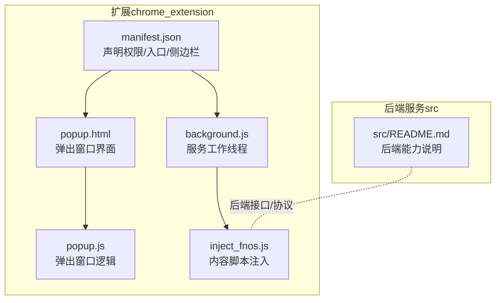
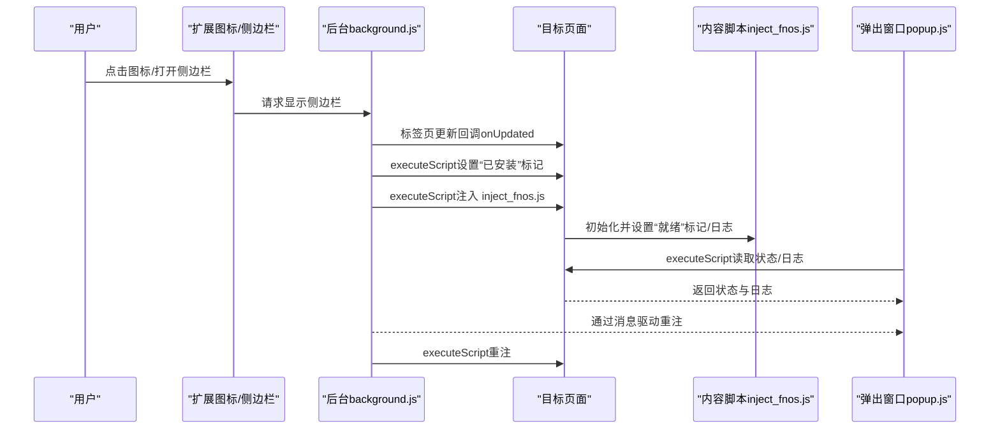
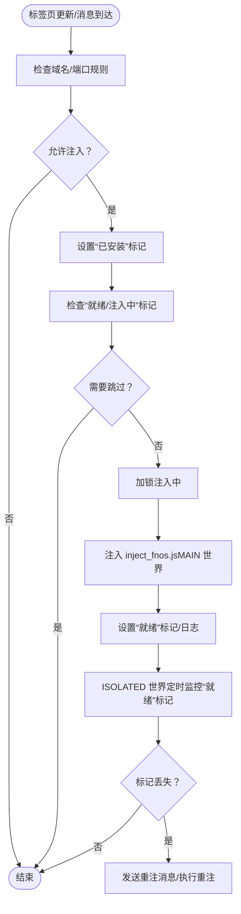
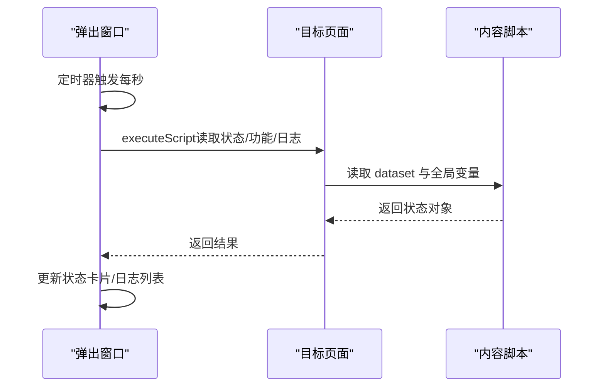
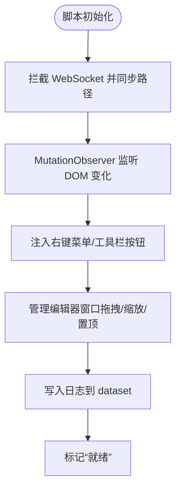
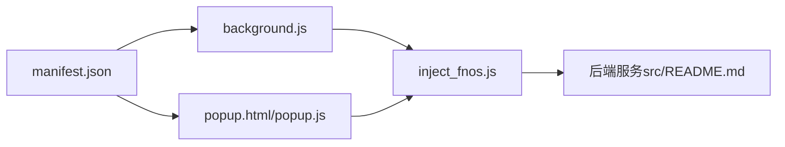

# Chrome 扩展调试

<cite>
**本文引用的文件**
- [manifest.json](file://chrome_extension/manifest.json)
- [background.js](file://chrome_extension/background.js)
- [popup.html](file://chrome_extension/popup.html)
- [popup.js](file://chrome_extension/popup.js)
- [inject_fnos.js](file://chrome_extension/inject_fnos.js)
- [README.md](file://README.md)
- [src/README.md](file://src/README.md)
</cite>

## 目录
1. [简介](#简介)
2. [项目结构](#项目结构)
3. [核心组件](#核心组件)
4. [架构总览](#架构总览)
5. [详细组件分析](#详细组件分析)
6. [依赖关系分析](#依赖关系分析)
7. [性能与内存调试](#性能与内存调试)
8. [故障排查指南](#故障排查指南)
9. [结论](#结论)
10. [附录](#附录)

## 简介
本指南面向需要调试 Chrome 扩展（本仓库为 Chrome/Edge 扩展）的工程师与测试人员，围绕后台页面、内容脚本与弹出窗口三类核心组件，系统讲解调试方法、开发者工具技巧、注入脚本调试、生命周期与消息传递监控、跨域通信与权限诊断、兼容性测试与性能/内存分析。文中所有技术要点均来自仓库现有源码与配置文件，确保可操作与可验证。

## 项目结构
该项目的浏览器扩展位于 chrome_extension 目录，包含清单、后台服务工作线程、弹出窗口及其脚本、以及注入到目标页面的内容脚本。后端服务位于 src 目录，二者共同构成 FNOS 文件管理器的集成生态。

图表来源
- [manifest.json:1-28](file://chrome_extension/manifest.json#L1-L28)
- [background.js:1-169](file://chrome_extension/background.js#L1-L169)
- [popup.html:1-173](file://chrome_extension/popup.html#L1-L173)
- [popup.js:1-200](file://chrome_extension/popup.js#L1-L200)
- [inject_fnos.js:1-898](file://chrome_extension/inject_fnos.js#L1-L898)
- [src/README.md:1-74](file://src/README.md#L1-L74)

章节来源
- [manifest.json:1-28](file://chrome_extension/manifest.json#L1-L28)
- [README.md:12-32](file://README.md#L12-L32)

## 核心组件
- 清单与权限
  - 使用 Manifest V3，声明 scripting、storage、tabs、sidePanel 权限，允许脚本注入、读写本地存储、标签页操作与侧边栏控制。
  - 声明 host_permissions 为 <all_urls>，便于跨域注入与通信。
  - 配置 action.default_popup 指向弹出窗口，side_panel.default_path 指向侧边栏页面。
- 后台服务工作线程（background.js）
  - 监听标签页更新，按域名/端口规则判断是否注入；注入前设置“已安装”标记，防止重复注入；注入后设置“就绪”标记与日志。
  - 在 ISOLATED 世界周期性监控“就绪”标记，若丢失则主动发送重注消息，后台收到消息后再次注入。
  - 通过 runtime.onMessage 监听重注请求，执行相同注入流程。
- 弹出窗口（popup.html + popup.js）
  - 读取本地存储的启用状态与匹配规则，动态更新 UI。
  - 定时查询当前标签页注入状态与日志，渲染“运行状态/功能注入情况/日志列表”。
  - 支持禁用时清理页面残留标记与停止轮询。
- 注入脚本（inject_fnos.js）
  - 在 MAIN 世界运行，负责拦截 WebSocket、同步路径、注入右键菜单与工具栏按钮、管理编辑器窗口等。
  - 通过 dataset 与全局变量与后台/弹窗进行状态与日志共享。

章节来源
- [manifest.json:6-27](file://chrome_extension/manifest.json#L6-L27)
- [background.js:40-117](file://chrome_extension/background.js#L40-L117)
- [background.js:119-168](file://chrome_extension/background.js#L119-L168)
- [popup.js:13-97](file://chrome_extension/popup.js#L13-L97)
- [popup.js:99-158](file://chrome_extension/popup.js#L99-L158)
- [inject_fnos.js:13-47](file://chrome_extension/inject_fnos.js#L13-L47)

## 架构总览
扩展采用“后台工作线程 + 内容脚本注入”的典型架构。后台负责时机控制与跨标签页协调，内容脚本负责与目标页面交互与 UI 扩展。

图表来源
- [background.js:40-117](file://chrome_extension/background.js#L40-L117)
- [background.js:119-168](file://chrome_extension/background.js#L119-L168)
- [popup.js:100-158](file://chrome_extension/popup.js#L100-L158)
- [inject_fnos.js:13-47](file://chrome_extension/inject_fnos.js#L13-L47)

## 详细组件分析

### 后台页面（服务工作线程）调试
- 入口与职责
  - 设置点击图标打开侧边栏；监听标签页更新；按规则注入内容脚本；监控注入状态并在丢失时重注；响应重注消息。
- 调试要点
  - 在“扩展程序”页面打开后台页面的开发者工具，查看控制台输出与网络请求。
  - 关注注入前后的“已安装/就绪”标记设置与日志写入。
  - 使用 chrome.scripting.executeScript 的 world 参数（MAIN）确认注入在正确运行世界执行。
- 关键流程图（注入与重注）

图表来源
- [background.js:40-117](file://chrome_extension/background.js#L40-L117)
- [background.js:119-168](file://chrome_extension/background.js#L119-L168)

章节来源
- [background.js:1-169](file://chrome_extension/background.js#L1-L169)

### 弹出窗口调试
- 入口与职责
  - 读取本地存储的启用状态与匹配规则；根据启用状态启动/停止轮询；定时查询当前标签页注入状态与日志；渲染 UI。
- 调试要点
  - 在“扩展程序”页面打开弹出窗口的开发者工具，查看 DOM 与控制台。
  - 关注定时轮询与 executeScript 的调用频率与结果。
  - 观察状态卡片与日志列表的渲染逻辑与颜色分类。
- 时序图（弹窗状态同步）

图表来源
- [popup.js:99-158](file://chrome_extension/popup.js#L99-L158)
- [inject_fnos.js:13-47](file://chrome_extension/inject_fnos.js#L13-L47)

章节来源
- [popup.html:1-173](file://chrome_extension/popup.html#L1-L173)
- [popup.js:1-200](file://chrome_extension/popup.js#L1-L200)

### 内容脚本（注入脚本）调试
- 入口与职责
  - 在 MAIN 世界运行，拦截 WebSocket、同步路径、注入右键菜单与工具栏按钮、管理编辑器窗口、记录日志。
- 调试要点
  - 在目标页面打开开发者工具，切换到“Elements”面板检查注入的 DOM 结构与 dataset。
  - 在“Sources”面板确认脚本在 MAIN 世界执行，避免与 ISOLATED 世界的差异导致的读取失败。
  - 使用 Console 输出日志，结合弹窗日志面板核对状态。
- 关键流程图（注入与功能注入）

图表来源
- [inject_fnos.js:78-123](file://chrome_extension/inject_fnos.js#L78-L123)
- [inject_fnos.js:891-898](file://chrome_extension/inject_fnos.js#L891-L898)

章节来源
- [inject_fnos.js:1-898](file://chrome_extension/inject_fnos.js#L1-L898)

### 生命周期与消息传递监控
- 生命周期
  - 标签页更新：后台监听 onUpdated，完成加载后按规则注入。
  - 侧边栏/弹出窗口：由清单 action/side_panel 配置触发。
- 消息传递
  - 后台通过 runtime.onMessage 监听重注请求。
  - 内容脚本在 ISOLATED 世界定期检查“就绪”标记，丢失时通过 sendMessage 发送重注消息给后台。
- 调试建议
  - 在后台与内容脚本的控制台中观察消息收发。
  - 在弹窗中验证状态卡片与日志列表是否随注入状态变化而更新。

章节来源
- [background.js:119-168](file://chrome_extension/background.js#L119-L168)
- [inject_fnos.js:108-114](file://chrome_extension/inject_fnos.js#L108-L114)

### 跨域通信与权限诊断
- 权限与跨域
  - 清单声明 host_permissions 为 <all_urls>，允许跨域注入与通信。
  - 使用 scripting 权限执行脚本注入。
- 调试建议
  - 若出现跨域请求失败，优先检查清单 permissions/host_permissions 是否满足目标站点。
  - 在 Network 面板观察 WebSocket 与 fetch 请求，确认拦截与转发逻辑是否生效。
  - 在内容脚本中通过 Console 输出关键路径与状态，结合弹窗日志核对。

章节来源
- [manifest.json:6-17](file://chrome_extension/manifest.json#L6-L17)
- [inject_fnos.js:825-854](file://chrome_extension/inject_fnos.js#L825-L854)

### 注入脚本调试方法与常见问题
- 注入时机与互斥
  - 后台在注入前设置“已安装”标记，内容脚本在 MAIN 世界检查“就绪/注入中”标记，避免重复注入。
- 常见问题与排查
  - 注入失败：检查后台控制台错误、executeScript 的 world 与文件路径。
  - 状态丢失：内容脚本在 ISOLATED 世界监控“就绪”标记，丢失时发送重注消息。
  - 日志不同步：确认 dataset.podnoteLogs 的读写与弹窗渲染逻辑。
- 优化建议
  - 合理设置轮询间隔，避免频繁 executeScript。
  - 对 DOM 查询与 MutationObserver 的回调进行节流/去抖。

章节来源
- [background.js:48-96](file://chrome_extension/background.js#L48-L96)
- [background.js:102-114](file://chrome_extension/background.js#L102-L114)
- [inject_fnos.js:891-898](file://chrome_extension/inject_fnos.js#L891-L898)

## 依赖关系分析
- 清单（manifest.json）决定扩展的入口、权限与宿主范围。
- 后台（background.js）依赖 scripting/tabs/storage 等权限，负责注入与消息调度。
- 弹出窗口（popup.html/js）依赖 storage 与 scripting，负责状态展示与配置。
- 注入脚本（inject_fnos.js）依赖 MAIN 世界与目标页面 DOM，负责功能扩展与日志记录。

图表来源
- [manifest.json:1-28](file://chrome_extension/manifest.json#L1-L28)
- [background.js:1-169](file://chrome_extension/background.js#L1-L169)
- [popup.html:1-173](file://chrome_extension/popup.html#L1-L173)
- [popup.js:1-200](file://chrome_extension/popup.js#L1-L200)
- [inject_fnos.js:1-898](file://chrome_extension/inject_fnos.js#L1-L898)
- [src/README.md:1-74](file://src/README.md#L1-L74)

章节来源
- [manifest.json:1-28](file://chrome_extension/manifest.json#L1-L28)

## 性能与内存调试
- 性能分析
  - 使用 Performance 面板录制注入与 UI 扩展过程，关注主线程阻塞点。
  - 观察 MutationObserver 回调频率与 DOM 操作成本，必要时增加节流。
- 内存泄漏检测
  - 留意窗口实例与全局对象（如 __NP_WINS__）的创建与销毁，确保关闭时移除 DOM 与事件监听。
  - 在 Console 中输出关键对象数量，结合 Memory 面板快照对比。
- 资源与网络
  - 在 Network 面板观察 WebSocket 与 fetch 请求的频率与耗时，优化后端接口调用策略。

[本节为通用指导，无需列出具体文件来源]

## 故障排查指南
- 注入失败
  - 检查后台控制台是否有 executeScript 错误；确认 world 参数与文件路径。
  - 确认目标页面是否为 http(s) 协议，弹窗逻辑会过滤非 http 页面。
- 状态不同步
  - 确认 dataset.podnoteStatus/Features/Logs 的读写是否在 MAIN 世界执行。
  - 检查弹窗轮询间隔与 executeScript 的返回结果。
- 重注循环
  - 若 ISOLATED 世界持续报告“标记丢失”，检查后台重注逻辑与注入锁（__podnote_injecting__）。
- 权限不足
  - 确认清单 permissions 与 host_permissions 是否覆盖目标站点。
- 跨域问题
  - 在 Network 面板检查请求是否被拦截；确认后端 CORS 与代理配置。

章节来源
- [background.js:87-96](file://chrome_extension/background.js#L87-L96)
- [background.js:157-166](file://chrome_extension/background.js#L157-L166)
- [popup.js:100-158](file://chrome_extension/popup.js#L100-L158)
- [manifest.json:6-17](file://chrome_extension/manifest.json#L6-L17)

## 结论
本指南基于仓库现有源码，梳理了 Chrome 扩展的后台、弹出窗口与内容脚本的调试方法与最佳实践。通过合理利用开发者工具、理解注入机制与消息传递、关注性能与内存、以及系统化的故障排查流程，可以高效定位并解决扩展在实际使用中的问题。

[本节为总结性内容，无需列出具体文件来源]

## 附录
- 安装与使用
  - 在扩展页面开启“开发者模式”，加载已解压的扩展目录 chrome_extension。
  - 通过扩展图标打开侧边栏，进入弹出窗口进行配置与状态查看。
- 后端参考
  - 后端服务提供 API 与 WebSocket 能力，扩展通过 fetch 与 WebSocket 与其交互。

章节来源
- [README.md:19-32](file://README.md#L19-L32)
- [src/README.md:46-74](file://src/README.md#L46-L74)