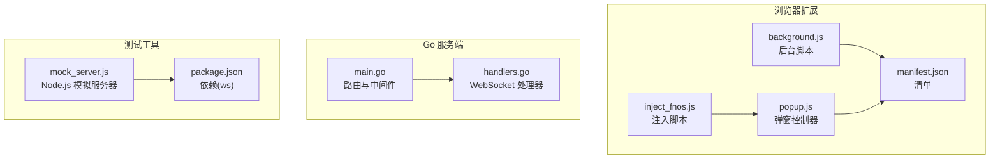
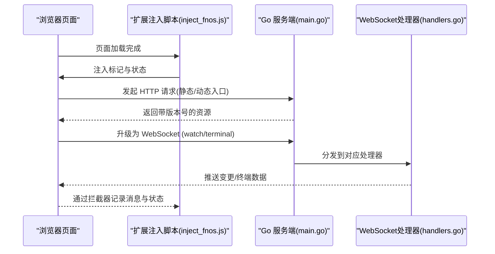
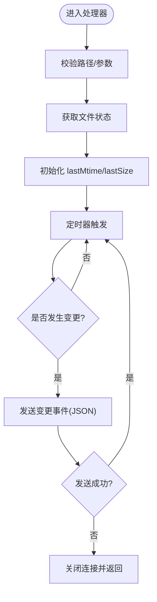
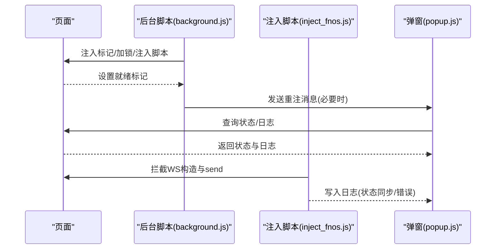
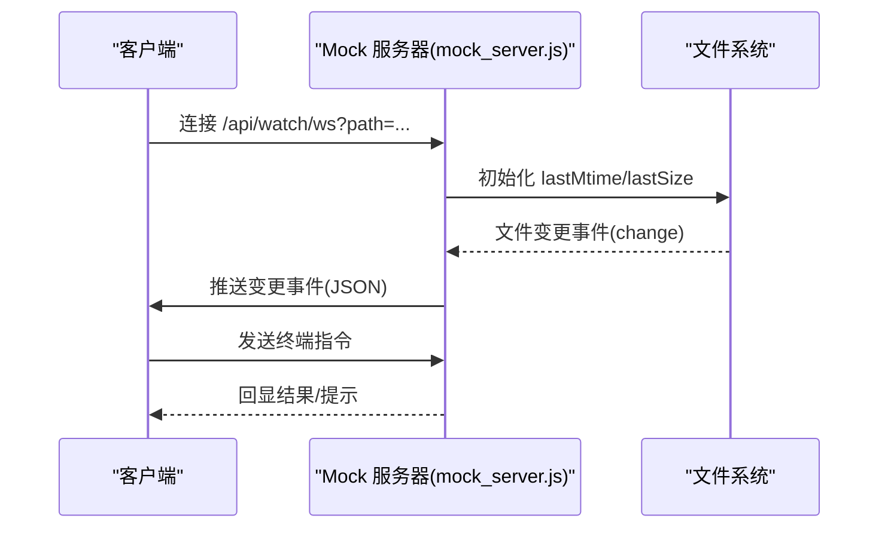
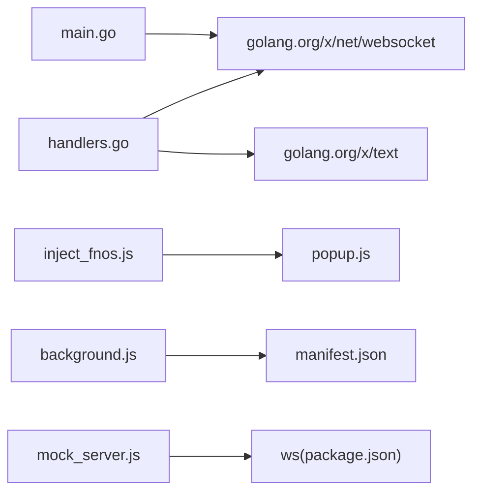

# WebSocket 调试

<cite>
**本文引用的文件**
- [src/main.go](file://src/main.go)
- [src/handlers.go](file://src/handlers.go)
- [chrome_extension/background.js](file://chrome_extension/background.js)
- [chrome_extension/popup.js](file://chrome_extension/popup.js)
- [chrome_extension/manifest.json](file://chrome_extension/manifest.json)
- [chrome_extension/inject_fnos.js](file://chrome_extension/inject_fnos.js)
- [test/scratch/mock_server.js](file://test/scratch/mock_server.js)
- [test/package.json](file://test/package.json)
</cite>

## 目录
1. [简介](#简介)
2. [项目结构](#项目结构)
3. [核心组件](#核心组件)
4. [架构总览](#架构总览)
5. [详细组件分析](#详细组件分析)
6. [依赖关系分析](#依赖关系分析)
7. [性能考量](#性能考量)
8. [故障排查指南](#故障排查指南)
9. [结论](#结论)
10. [附录](#附录)

## 简介
本指南面向需要调试 WebSocket 连接建立、消息传输与断开流程的工程师，结合仓库中的 Go 服务器与 Chrome 扩展前端实现，提供从浏览器开发者工具到协议级调试的全流程方法论。重点覆盖：
- 如何使用浏览器开发者工具监控 WebSocket 通信
- 实时监控（文件变更）与终端会话的测试与调试技巧
- 连接超时、消息丢失与重复接收等常见问题的诊断思路
- 服务器端调试要点与客户端连接状态监控
- 高并发场景下的性能测试与优化建议
- 协议级调试工具与方法

## 项目结构
该项目包含一个基于 Go 的 HTTP/WebSocket 服务端与一个 Chrome 扩展前端，用于在目标页面中注入脚本并监控 WebSocket 通信。

**图表来源**
- [src/main.go:15-144](file://src/main.go#L15-L144)
- [src/handlers.go:426-516](file://src/handlers.go#L426-L516)
- [chrome_extension/background.js:1-169](file://chrome_extension/background.js#L1-169)
- [chrome_extension/popup.js:1-200](file://chrome_extension/popup.js#L1-L200)
- [chrome_extension/manifest.json:1-28](file://chrome_extension/manifest.json#L1-L28)
- [chrome_extension/inject_fnos.js:1-800](file://chrome_extension/inject_fnos.js#L1-L800)
- [test/scratch/mock_server.js:311-382](file://test/scratch/mock_server.js#L311-L382)
- [test/package.json:1-5](file://test/package.json#L1-L5)

**章节来源**
- [src/main.go:15-144](file://src/main.go#L15-L144)
- [src/handlers.go:426-516](file://src/handlers.go#L426-L516)
- [chrome_extension/background.js:1-169](file://chrome_extension/background.js#L1-L169)
- [chrome_extension/popup.js:1-200](file://chrome_extension/popup.js#L1-L200)
- [chrome_extension/manifest.json:1-28](file://chrome_extension/manifest.json#L1-L28)
- [chrome_extension/inject_fnos.js:1-800](file://chrome_extension/inject_fnos.js#L1-L800)
- [test/scratch/mock_server.js:311-382](file://test/scratch/mock_server.js#L311-L382)
- [test/package.json:1-5](file://test/package.json#L1-L5)

## 核心组件
- 服务端路由与中间件链：统一入口、版本注入、静态资源转发、业务 API 与 WebSocket 路由注册、鉴权与日志。
- WebSocket 处理器：
  - 文件监控：周期性轮询文件元数据，发现变更后推送 JSON 事件。
  - 终端会话：根据请求头与环境变量进行权限校验，建立伪终端会话。
- 浏览器扩展：
  - 后台脚本：域名匹配、注入标记、自动重注、ISOLATED 监控。
  - 注入脚本：拦截 WebSocket 构造与 send，解析特定消息并同步 UI 状态。
  - 弹窗控制器：实时展示注入状态、功能注入进度与日志。

**章节来源**
- [src/main.go:37-129](file://src/main.go#L37-L129)
- [src/handlers.go:426-516](file://src/handlers.go#L426-L516)
- [chrome_extension/background.js:40-117](file://chrome_extension/background.js#L40-L117)
- [chrome_extension/inject_fnos.js:80-123](file://chrome_extension/inject_fnos.js#L80-L123)
- [chrome_extension/popup.js:99-158](file://chrome_extension/popup.js#L99-L158)

## 架构总览
下图展示了浏览器扩展与服务端之间的交互关系，以及 WebSocket 的典型调用链。

**图表来源**
- [src/main.go:111-119](file://src/main.go#L111-L119)
- [src/handlers.go:426-494](file://src/handlers.go#L426-L494)
- [src/handlers.go:496-516](file://src/handlers.go#L496-L516)
- [chrome_extension/inject_fnos.js:80-123](file://chrome_extension/inject_fnos.js#L80-L123)

## 详细组件分析

### 服务器端 WebSocket 路由与处理器
- 路由注册：将 /api/watch/ws 与 /api/terminal/ws 映射到对应的 WebSocket 处理器。
- 文件监控处理器：
  - 参数校验与路径合法性检查。
  - 初始化最后修改时间与大小，定时轮询文件状态。
  - 发现变更后发送 JSON 事件；若发送失败则认为客户端断开。
- 终端处理器：
  - 读取查询参数 cols/rows/user 与请求头 X-Trim-Isadmin/X-Trim-Username。
  - 在特定环境下进行管理员鉴权，通过后建立伪终端会话。

**图表来源**
- [src/handlers.go:426-494](file://src/handlers.go#L426-L494)

**章节来源**
- [src/main.go:111-119](file://src/main.go#L111-L119)
- [src/handlers.go:426-494](file://src/handlers.go#L426-L494)
- [src/handlers.go:496-516](file://src/handlers.go#L496-L516)

### 浏览器扩展：WebSocket 拦截与状态监控
- WebSocket 拦截：
  - 重定义 WebSocket 构造函数，标记特定类型连接。
  - 重写 send 方法，解析消息并同步 UI 状态（如路径同步）。
- 注入与重注：
  - 后台脚本在匹配域名时注入脚本并设置“已就绪”标记。
  - ISOLATED 环境定时检查，若状态丢失则自动重注。
- 弹窗状态：
  - 每秒轮询页面状态，显示“已就绪/等待中/未激活”等状态与日志。

**图表来源**
- [chrome_extension/background.js:40-117](file://chrome_extension/background.js#L40-L117)
- [chrome_extension/background.js:120-168](file://chrome_extension/background.js#L120-L168)
- [chrome_extension/inject_fnos.js:80-123](file://chrome_extension/inject_fnos.js#L80-L123)
- [chrome_extension/popup.js:99-158](file://chrome_extension/popup.js#L99-L158)

**章节来源**
- [chrome_extension/background.js:40-117](file://chrome_extension/background.js#L40-L117)
- [chrome_extension/background.js:120-168](file://chrome_extension/background.js#L120-L168)
- [chrome_extension/inject_fnos.js:80-123](file://chrome_extension/inject_fnos.js#L80-L123)
- [chrome_extension/popup.js:99-158](file://chrome_extension/popup.js#L99-L158)

### 测试与模拟：Node.js WebSocket 服务器
- 提供文件监控型 WebSocket 服务器，用于验证客户端对变更事件的处理。
- 支持命令行交互式终端回显（帮助、清屏、日期、用户），便于终端场景联调。
- 使用 ws 依赖作为客户端/服务器库。

**图表来源**
- [test/scratch/mock_server.js:346-382](file://test/scratch/mock_server.js#L346-L382)
- [test/scratch/mock_server.js:311-343](file://test/scratch/mock_server.js#L311-L343)
- [test/package.json:1-5](file://test/package.json#L1-L5)

**章节来源**
- [test/scratch/mock_server.js:311-382](file://test/scratch/mock_server.js#L311-L382)
- [test/package.json:1-5](file://test/package.json#L1-L5)

## 依赖关系分析
- 服务端依赖：
  - golang.org/x/net/websocket：WebSocket 协议处理。
  - golang.org/x/text：字符集检测与转码。
- 浏览器扩展：
  - Manifest v3 权限：scripting、storage、tabs、sidePanel。
  - 注入脚本依赖页面 DOM 结构与 WebSocket API。
- 测试依赖：
  - ws：Node.js 端 WebSocket 客户端/服务器库。

**图表来源**
- [src/main.go:11](file://src/main.go#L11)
- [src/handlers.go:16](file://src/handlers.go#L16)
- [chrome_extension/manifest.json:6-11](file://chrome_extension/manifest.json#L6-L11)
- [chrome_extension/inject_fnos.js:1-800](file://chrome_extension/inject_fnos.js#L1-L800)
- [test/scratch/mock_server.js:311-382](file://test/scratch/mock_server.js#L311-L382)
- [test/package.json:1-5](file://test/package.json#L1-L5)

**章节来源**
- [src/main.go:11](file://src/main.go#L11)
- [src/handlers.go:16](file://src/handlers.go#L16)
- [chrome_extension/manifest.json:6-11](file://chrome_extension/manifest.json#L6-L11)
- [chrome_extension/inject_fnos.js:1-800](file://chrome_extension/inject_fnos.js#L1-L800)
- [test/scratch/mock_server.js:311-382](file://test/scratch/mock_server.js#L311-L382)
- [test/package.json:1-5](file://test/package.json#L1-L5)

## 性能考量
- 服务器端：
  - 文件监控采用定时轮询，建议根据业务场景调整周期，避免过于频繁导致 CPU 占用。
  - 发送失败即视为断开，可减少无效连接占用。
- 客户端：
  - 注入脚本对 send 的解析应尽量轻量，避免阻塞主线程。
  - 弹窗轮询频率为 1 秒，可在长时间无交互时降低频率。
- 并发测试建议：
  - 使用多标签页同时发起多个 WebSocket 连接，观察服务器日志与内存/CPU 指标。
  - 对文件监控场景，批量写入文件以验证去重与防抖效果。

[本节为通用指导，无需具体文件来源]

## 故障排查指南

### 使用浏览器开发者工具监控 WebSocket
- 打开开发者工具，切换到 Network 面板，过滤 WebSocket 类型。
- 查看握手请求头与响应头，确认升级成功。
- 在 Frames 标签查看消息收发，关注事件类型与负载大小。
- 若出现断开，查看 Close/Abort 事件与原因码。

[本小节为通用指导，无需具体文件来源]

### 连接建立阶段
- 确认路由与前缀一致，检查服务端日志中是否有请求到达。
- 若鉴权失败（终端场景），检查请求头与环境变量是否满足要求。
- 若路径非法或文件不存在，服务器会返回错误消息，需在客户端做相应提示。

**章节来源**
- [src/main.go:111-119](file://src/main.go#L111-L119)
- [src/handlers.go:426-441](file://src/handlers.go#L426-L441)
- [src/handlers.go:496-512](file://src/handlers.go#L496-L512)

### 消息传输与断开
- 文件监控：若长时间无变更，不会产生推送；一旦变更，会推送 JSON 事件。若发送失败，服务器会主动关闭连接。
- 终端会话：若客户端心跳或读取阻塞，服务器会检测到断开并返回。
- 客户端拦截：注入脚本会记录同步日志，可用于定位消息解析问题。

**章节来源**
- [src/handlers.go:448-494](file://src/handlers.go#L448-L494)
- [src/handlers.go:496-516](file://src/handlers.go#L496-L516)
- [chrome_extension/inject_fnos.js:80-123](file://chrome_extension/inject_fnos.js#L80-L123)

### 连接超时、消息丢失与重复接收
- 超时：检查网络面板中的握手耗时与服务器日志；确认代理/防火墙策略。
- 消息丢失：核对客户端是否正确解析消息体；在注入脚本中增加日志以定位。
- 重复接收：服务器端已通过比较 lastMtime/lastSize 去重，客户端也应避免重复订阅。

**章节来源**
- [src/handlers.go:478-491](file://src/handlers.go#L478-L491)
- [chrome_extension/inject_fnos.js:80-123](file://chrome_extension/inject_fnos.js#L80-L123)

### 服务器端调试方法
- 在 main.go 中的日志中间件输出请求 URI 与方法，快速定位路由命中情况。
- 在处理器中增加更详细的日志（如参数、状态、错误），便于定位异常分支。

**章节来源**
- [src/main.go:125-128](file://src/main.go#L125-L128)
- [src/handlers.go:446](file://src/handlers.go#L446)

### 客户端连接状态监控
- 使用弹窗控制器每秒轮询页面状态，观察“已就绪/等待中/未激活”状态变化。
- 注入脚本通过 dataset 写入日志，可在弹窗中实时查看。

**章节来源**
- [chrome_extension/popup.js:99-158](file://chrome_extension/popup.js#L99-L158)
- [chrome_extension/inject_fnos.js:13-45](file://chrome_extension/inject_fnos.js#L13-L45)

### 高并发场景测试
- 使用多标签页或自动化脚本同时连接多个 WebSocket，观察服务器日志与资源占用。
- 对文件监控场景，批量写入/删除文件，验证去重与推送一致性。

**章节来源**
- [test/scratch/mock_server.js:346-382](file://test/scratch/mock_server.js#L346-L382)

### 协议级调试工具与方法
- 使用 ws 作为客户端/服务器库进行自测，验证消息格式与事件推送。
- 在 Node.js 端模拟终端交互，验证客户端对回显与命令的处理。

**章节来源**
- [test/package.json:1-5](file://test/package.json#L1-L5)
- [test/scratch/mock_server.js:311-343](file://test/scratch/mock_server.js#L311-L343)

## 结论
通过结合服务端日志、浏览器扩展的状态监控与拦截能力，以及 Node.js 模拟服务器，可以系统地完成 WebSocket 的全链路调试。针对文件监控与终端两类场景，分别采用轮询去重与命令回显的方法进行验证；在高并发场景下，建议从路由命中、消息去重与资源占用三方面进行综合评估与优化。

[本节为总结，无需具体文件来源]

## 附录
- 快速检查清单
  - 服务端：路由是否正确、日志是否输出、鉴权是否通过。
  - 客户端：扩展是否注入、状态是否“已就绪”、日志是否正常。
  - 协议：握手是否成功、消息格式是否符合预期、断开是否可恢复。

[本节为通用指导，无需具体文件来源]