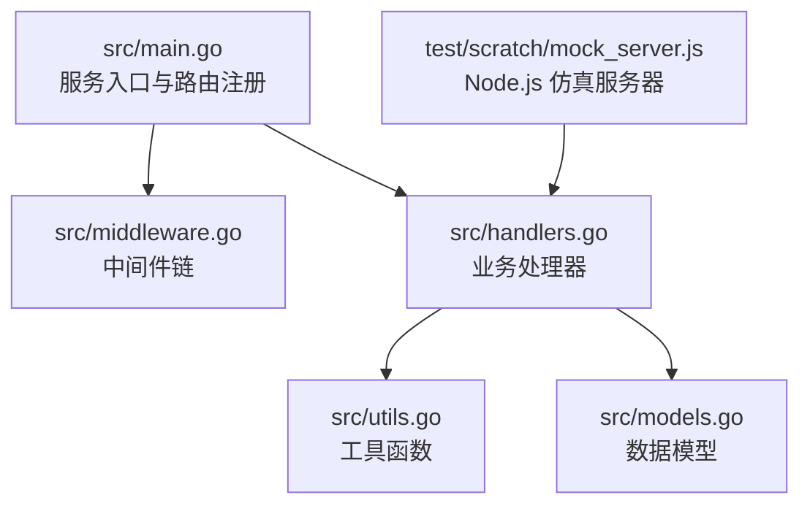
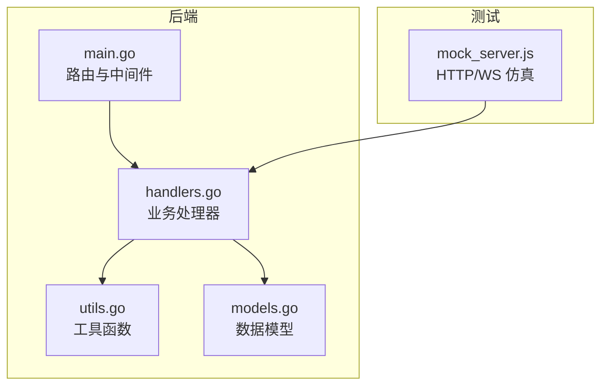
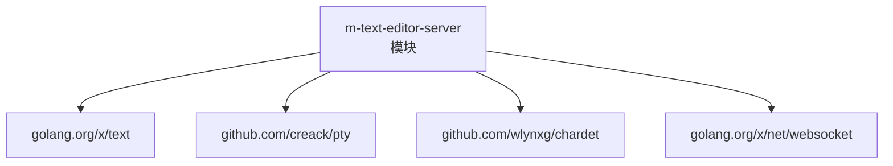

# 单元测试

<cite>
**本文引用的文件**
- [src/main.go](file://src/main.go)
- [src/handlers.go](file://src/handlers.go)
- [src/models.go](file://src/models.go)
- [src/utils.go](file://src/utils.go)
- [src/middleware.go](file://src/middleware.go)
- [src/go.mod](file://src/go.mod)
- [test/README.md](file://test/README.md)
- [test/scratch/mock_server.js](file://test/scratch/mock_server.js)
- [.github/workflows/build.yml](file://.github/workflows/build.yml)
</cite>

## 目录
1. [简介](#简介)
2. [项目结构](#项目结构)
3. [核心组件](#核心组件)
4. [架构总览](#架构总览)
5. [详细组件分析](#详细组件分析)
6. [依赖分析](#依赖分析)
7. [性能考虑](#性能考虑)
8. [故障排查指南](#故障排查指南)
9. [结论](#结论)
10. [附录](#附录)

## 简介
本指南面向为 Go 语言编写的处理器函数、工具函数与数据模型编写单元测试的开发者，结合仓库中的实际代码，系统讲解测试文件组织结构与命名规范、断言方法与测试辅助函数、文件操作与路径验证测试、数据模型测试、错误处理与边界条件测试、以及测试覆盖率要求与质量提升策略。文中所有测试流程与示例均以源码为依据，避免凭空假设。

## 项目结构
- 后端服务入口与路由注册位于 src/main.go，负责环境变量校验、静态资源网关、业务 API 路由与中间件链包装。
- 业务处理器集中在 src/handlers.go，涵盖目录列表、文件读取/保存、新建文件/预检、WebSocket 监控与终端会话、配置读写等。
- 数据模型定义在 src/models.go，统一响应结构与目录项元数据。
- 工具函数位于 src/utils.go，包含路径清洗与校验、语言识别、编码预测与转换、PTY 终端会话等。
- 中间件链位于 src/middleware.go，提供鉴权、压缩、缓存与日志等横切能力。
- 测试侧提供了 Node.js 仿真服务器（test/scratch/mock_server.js），用于非飞牛OS环境下进行端到端联调与前端预览；同时提供测试说明（test/README.md）。

图表来源
- [src/main.go:15-144](file://src/main.go#L15-L144)
- [src/handlers.go:21-611](file://src/handlers.go#L21-L611)
- [src/utils.go:25-261](file://src/utils.go#L25-L261)
- [src/models.go:3-29](file://src/models.go#L3-L29)
- [test/scratch/mock_server.js:79-294](file://test/scratch/mock_server.js#L79-L294)

章节来源
- [src/main.go:15-144](file://src/main.go#L15-L144)
- [src/handlers.go:21-611](file://src/handlers.go#L21-L611)
- [src/utils.go:25-261](file://src/utils.go#L25-L261)
- [src/models.go:3-29](file://src/models.go#L3-L29)
- [test/README.md:1-41](file://test/README.md#L1-L41)
- [test/scratch/mock_server.js:79-294](file://test/scratch/mock_server.js#L79-L294)

## 核心组件
- 数据模型
  - Response：统一的 JSON 响应结构，包含 content、mtime、size、mode、language、encoding、error 等字段。
  - FileInfo：目录项元数据，包含 name、path、is_dir、size、mtime、is_symlink。
  - ListResponse：目录列表响应，包含 path 与 files 数组。
- 工具函数
  - cleanAndValidatePath：对输入路径进行清洗、符号链接解析与应用目录隔离校验，返回绝对路径或错误。
  - detectLanguage：基于扩展名与 shebang 判定语言 ID。
  - predictEncoding：基于 chardet 的编码探测，返回标准化编码标识。
  - getEncoding：将名称映射到具体编码转换器。
  - startPty：启动 PTY 并在 WebSocket 间转发数据，处理 resize 与 ping/pong。
- 处理器函数
  - handleList：列出目录项，过滤隐藏文件，按目录优先排序。
  - handleRead：读取文件，进行大小限制、二进制检测、编码预测与转换。
  - handleSave：原子写入，包含 mtime 乐观锁冲突检测与临时文件重命名。
  - handleCreate/handleNewFile：新建文件预检与物理创建。
  - handleWatchWS：WebSocket 文件变更监控。
  - handleTerminalWS：WebSocket 终端会话。
  - handleSettings：云端配置读写，支持移动端与 PC 端不同配置文件。

章节来源
- [src/models.go:3-29](file://src/models.go#L3-L29)
- [src/utils.go:25-261](file://src/utils.go#L25-L261)
- [src/handlers.go:21-611](file://src/handlers.go#L21-L611)

## 架构总览
后端通过 main.go 注册路由与中间件，handlers.go 提供业务逻辑，utils.go 提供通用能力，models.go 统一数据结构。测试阶段可借助 Node.js 仿真服务器模拟 HTTP 与 WebSocket 行为，便于在非飞牛OS环境中进行端到端验证。

图表来源
- [src/main.go:37-128](file://src/main.go#L37-L128)
- [src/handlers.go:21-611](file://src/handlers.go#L21-L611)
- [src/utils.go:25-261](file://src/utils.go#L25-L261)
- [src/models.go:3-29](file://src/models.go#L3-L29)
- [test/scratch/mock_server.js:79-294](file://test/scratch/mock_server.js#L79-L294)

## 详细组件分析

### 数据模型测试（Response/FileInfo/ListResponse）
- 测试要点
  - JSON 序列化/反序列化正确性与字段完整性。
  - 错误字段与业务字段的互斥关系（如 error 与 content 同时出现时的语义）。
  - 排序与过滤逻辑（目录优先、忽略隐藏文件）对响应的影响。
- 断言建议
  - 使用结构体字段逐项断言，确保字段存在且类型正确。
  - 对空值与零值进行覆盖，验证 omitempty 的行为。
- 示例参考路径
  - [src/models.go:3-29](file://src/models.go#L3-L29)

章节来源
- [src/models.go:3-29](file://src/models.go#L3-L29)

### 路径清洗与校验测试（cleanAndValidatePath）
- 测试要点
  - 空路径与非法路径返回错误。
  - 符号链接解析后的路径是否安全。
  - 应用目录隔离：当路径位于 TRIM_APPDEST 下时应返回权限错误。
  - 返回绝对路径的一致性与规范化。
- 边界条件
  - 路径末尾多余分隔符、. 与 .. 的处理。
  - Unicode 与特殊字符路径的兼容性。
- 断言建议
  - 断言返回路径为绝对路径且不越权。
  - 断言错误类型为权限错误时的场景。
- 示例参考路径
  - [src/utils.go:25-53](file://src/utils.go#L25-L53)

章节来源
- [src/utils.go:25-53](file://src/utils.go#L25-L53)

### 语言识别测试（detectLanguage）
- 测试要点
  - 常见扩展名映射（如 .go → go、.js → javascript 等）。
  - 特殊文件名（如 Dockerfile、Makefile）识别。
  - Shebang 识别（如 #!/bin/bash、#!/usr/bin/env python）。
  - 无匹配扩展名时回退为 plaintext。
- 断言建议
  - 针对已知扩展名与特殊文件名构造用例，逐一断言返回语言 ID。
  - 对首行字节进行边界测试（空、含 0、UTF-16 BOM 等）。
- 示例参考路径
  - [src/utils.go:55-106](file://src/utils.go#L55-L106)

章节来源
- [src/utils.go:55-106](file://src/utils.go#L55-L106)

### 编码预测与转换测试（predictEncoding/getEncoding）
- 测试要点
  - predictEncoding 对空字节、UTF-8、UTF-16、GBxxx 等的判定。
  - chardet 结果的置信度阈值与回退策略。
  - getEncoding 将名称映射到具体编码转换器。
- 断言建议
  - 对不同字节序列构造用例，断言返回编码标识。
  - 对未知编码回退至 utf-8 的行为进行断言。
- 示例参考路径
  - [src/utils.go:108-165](file://src/utils.go#L108-L165)

章节来源
- [src/utils.go:108-165](file://src/utils.go#L108-L165)

### 目录列表处理器测试（handleList）
- 测试要点
  - 缺少 path 参数时返回错误。
  - 路径校验失败（越权/非法）时返回错误。
  - 目标非目录时返回错误。
  - 读取目录失败时返回错误。
  - 隐藏文件过滤与排序（目录优先、大小写不敏感排序）。
- 边界条件
  - 空目录、大量文件、包含符号链接的目录。
- 断言建议
  - 断言响应结构体字段完整，files 数组长度与内容符合预期。
- 示例参考路径
  - [src/handlers.go:21-112](file://src/handlers.go#L21-L112)

章节来源
- [src/handlers.go:21-112](file://src/handlers.go#L21-L112)

### 文件读取处理器测试（handleRead）
- 测试要点
  - 缺失或无效路径参数返回错误。
  - 目标为目录时返回错误。
  - 超过 10MB 的文件拒绝加载。
  - 二进制内容检测（含 0 字节）拒绝加载。
  - 编码自动检测与手动指定编码的优先级。
  - 转码失败时返回错误。
  - 返回字段：content、mtime、size、mode、language、encoding。
- 边界条件
  - UTF-16 文件、纯 ASCII、含 BOM 的文本。
- 断言建议
  - 断言 content 与 encoding 字段一致性。
  - 断言语言识别结果与扩展名/Shebang 一致。
- 示例参考路径
  - [src/handlers.go:114-212](file://src/handlers.go#L114-L212)

章节来源
- [src/handlers.go:114-212](file://src/handlers.go#L114-L212)

### 文件保存处理器测试（handleSave）
- 测试要点
  - 非 POST 请求返回错误。
  - 请求体解析失败返回错误。
  - 路径校验失败返回错误。
  - 目标为目录时返回错误。
  - mtime 乐观锁：外部修改导致冲突时返回错误。
  - 临时文件创建失败、写入失败、重命名失败的错误分支。
  - 成功保存后返回新 mtime、size、mode。
- 边界条件
  - 文件不存在（新建）、存在但 mtime 为 0（冲突）、mtime 大于本地。
- 断言建议
  - 断言最终文件状态与返回字段一致。
  - 断言权限与 UID/GID 同步（若可用）。
- 示例参考路径
  - [src/handlers.go:214-324](file://src/handlers.go#L214-L324)

章节来源
- [src/handlers.go:214-324](file://src/handlers.go#L214-L324)

### 新建文件预检与创建测试（handleCreate/handleNewFile）
- 测试要点
  - 预检：路径存在且为目录、路径不存在但父目录不存在、路径非法。
  - 创建：POST 校验、请求体解析、父目录存在性、文件已存在、创建失败。
  - 权限同步（UID/GID）与默认权限。
- 断言建议
  - 断言预检返回语言 ID 与目标路径扩展名一致。
  - 断言创建后文件存在且权限正确。
- 示例参考路径
  - [src/handlers.go:326-424](file://src/handlers.go#L326-L424)

章节来源
- [src/handlers.go:326-424](file://src/handlers.go#L326-L424)

### WebSocket 监控与终端会话测试
- 文件监控（handleWatchWS）
  - 路径校验失败、文件不存在、监控循环与变更推送。
- 终端会话（handleTerminalWS/startPty）
  - 管理员鉴权、PTY 启动、窗口尺寸变更、心跳 ping/pong、超时断开。
- 断言建议
  - 断言变更事件推送时机与内容。
  - 断言 resize 与 ping/pong 协议行为。
- 示例参考路径
  - [src/handlers.go:426-516](file://src/handlers.go#L426-L516)
  - [src/utils.go:167-261](file://src/utils.go#L167-L261)

章节来源
- [src/handlers.go:426-516](file://src/handlers.go#L426-L516)
- [src/utils.go:167-261](file://src/utils.go#L167-L261)

### 配置读写处理器测试（handleSettings）
- 测试要点
  - 客户端类型（pc/mobile）选择不同配置文件。
  - GET：文件不存在返回空对象；读取失败返回错误。
  - POST：请求体解析失败、目录创建失败、序列化失败、临时文件写入失败、重命名失败。
  - 成功保存后返回 ok。
- 断言建议
  - 断言配置文件内容与请求体一致。
- 示例参考路径
  - [src/handlers.go:518-611](file://src/handlers.go#L518-L611)

章节来源
- [src/handlers.go:518-611](file://src/handlers.go#L518-L611)

### 中间件链测试（adminAuthMiddleware/gzipMiddleware/cacheMiddleware）
- 测试要点
  - 鉴权中间件：拦截未授权请求。
  - 压缩中间件：对响应进行压缩（Content-Encoding）。
  - 缓存中间件：设置合适的缓存头。
  - 日志中间件：记录请求方法与 URI。
- 断言建议
  - 断言响应头包含期望的压缩与缓存策略。
  - 断言日志输出包含请求信息。
- 示例参考路径
  - [src/middleware.go](file://src/middleware.go)

章节来源
- [src/middleware.go](file://src/middleware.go)

## 依赖分析
- 外部依赖
  - golang.org/x/text：编码转换与文本处理。
  - github.com/creack/pty：伪终端管理。
  - github.com/wlynxg/chardet：字符集探测。
  - golang.org/x/net/websocket：WebSocket 支持。
- 内部模块
  - m-text-editor-server：后端服务模块。

图表来源
- [src/go.mod:1-12](file://src/go.mod#L1-L12)

章节来源
- [src/go.mod:1-12](file://src/go.mod#L1-L12)

## 性能考虑
- 文件读取与转码
  - 采用小缓冲预读取与二进制检测，避免大文件阻塞。
  - 编码转换使用流式 Reader/Writer，降低内存峰值。
- 保存流程
  - 临时文件 + 原子重命名，减少部分写入风险。
  - Sync 与权限同步在保证一致性的同时增加 IO 成本，需在测试中评估。
- WebSocket
  - 定时器与心跳机制防止连接挂起，注意资源释放与超时处理。

## 故障排查指南
- 环境变量缺失
  - TRIM_APPDEST/TRIM_APPVER 未设置会导致服务启动失败。测试中可通过设置环境变量或在测试用例中断言错误消息。
- 路径越权
  - cleanAndValidatePath 对 TRIM_APPDEST 目录隔离，越权访问应返回权限错误。测试中构造越权路径用例。
- 文件过大
  - handleRead 对大于 10MB 的文件拒绝加载。测试中准备超大文件用例。
- 二进制内容
  - 含 0 字节的文件会被拒绝加载。测试中准备二进制文件用例。
- 保存冲突
  - mtime 乐观锁冲突时拒绝保存。测试中模拟外部修改场景。
- WebSocket 超时
  - 90 秒无交互断开，测试中验证 ping/pong 与 resize 协议。

章节来源
- [src/main.go:15-35](file://src/main.go#L15-L35)
- [src/utils.go:25-53](file://src/utils.go#L25-L53)
- [src/handlers.go:146-176](file://src/handlers.go#L146-L176)
- [src/handlers.go:258-262](file://src/handlers.go#L258-L262)
- [src/utils.go:234-235](file://src/utils.go#L234-L235)

## 结论
本指南基于仓库现有代码，给出了针对处理器函数、工具函数与数据模型的单元测试策略与实践建议。通过覆盖路径校验、编码处理、文件读写、WebSocket 会话与配置读写等关键路径，结合断言与边界条件测试，可显著提升代码质量与稳定性。建议在 CI 中集成覆盖率统计与测试报告，持续改进测试质量。

## 附录

### 测试文件组织结构与命名规范
- 建议采用 Go 默认的 _test.go 命名方式，例如：
  - utils_test.go
  - handlers_test.go
  - models_test.go
- 每个包内按功能模块拆分测试文件，保持与源码结构一致。
- 使用表格驱动测试（table-driven tests）组织相似场景的多条用例，便于维护与扩展。

### 测试覆盖率要求与提升
- 覆盖率指标
  - 语句覆盖率：建议不低于 80%，关键路径不低于 90%。
  - 分支覆盖率：建议不低于 75%，核心分支不低于 90%。
- 提升策略
  - 针对错误分支与边界条件补充用例。
  - 使用伪对象（如自定义 io.Reader/Writer）隔离外部依赖。
  - 在 CI 中启用覆盖率收集与报告（如 go test -coverprofile=coverage.out && go tool cover -html=coverage.out）。

### 断言方法与测试辅助函数
- 断言方法
  - 使用标准库 testing 包的断言方法，如断言相等、错误类型、响应头等。
  - 对 JSON 响应使用结构化解析后逐字段断言。
- 测试辅助函数
  - 构造测试文件与目录，模拟真实文件系统行为。
  - 使用 http/httptest 创建最小化的请求与响应，隔离外部网络依赖。
  - 对 WebSocket 场景，使用 ws 包或自定义短生命周期的连接模拟器。

### 与仿真服务器的协作
- Node.js 仿真服务器可用于端到端联调与前端预览，但单元测试应尽量通过 httptest 与文件系统模拟完成，减少对外部进程的依赖。
- 若确需与仿真服务器联动，可在集成测试阶段使用，单元测试仍以本地模拟为主。

章节来源
- [test/README.md:1-41](file://test/README.md#L1-L41)
- [test/scratch/mock_server.js:79-294](file://test/scratch/mock_server.js#L79-L294)