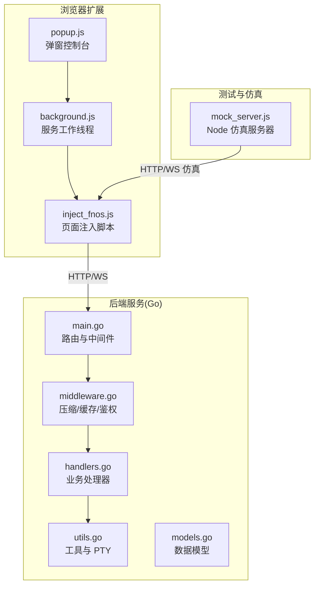
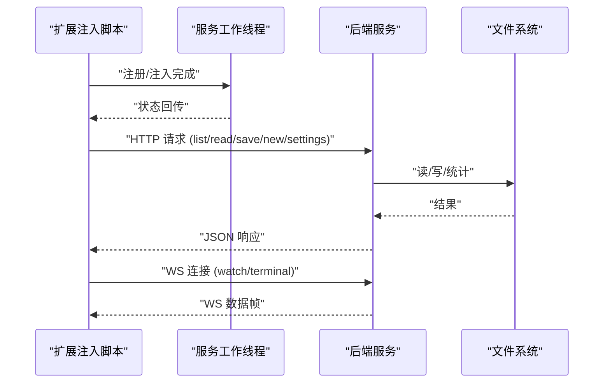
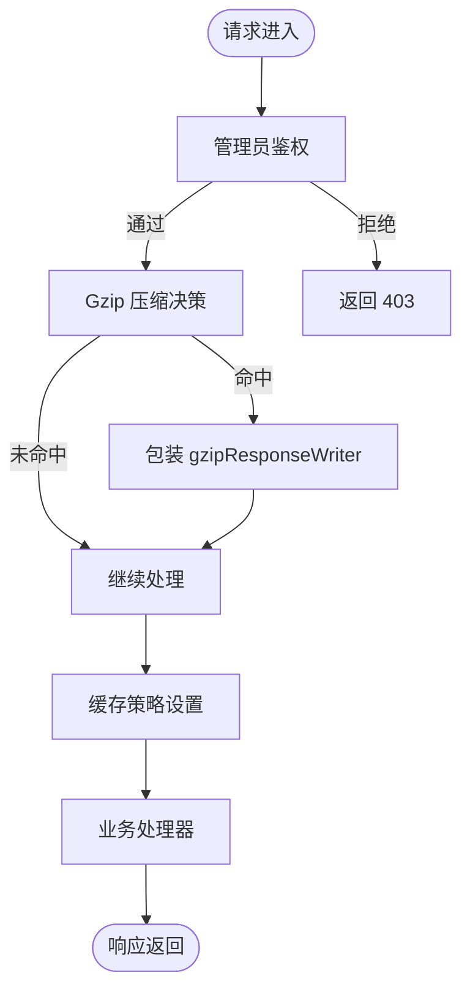
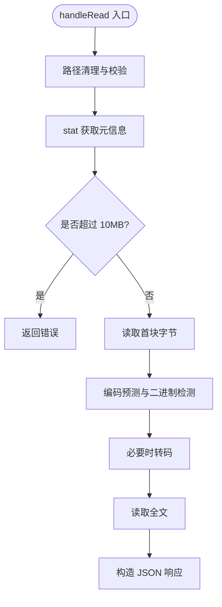
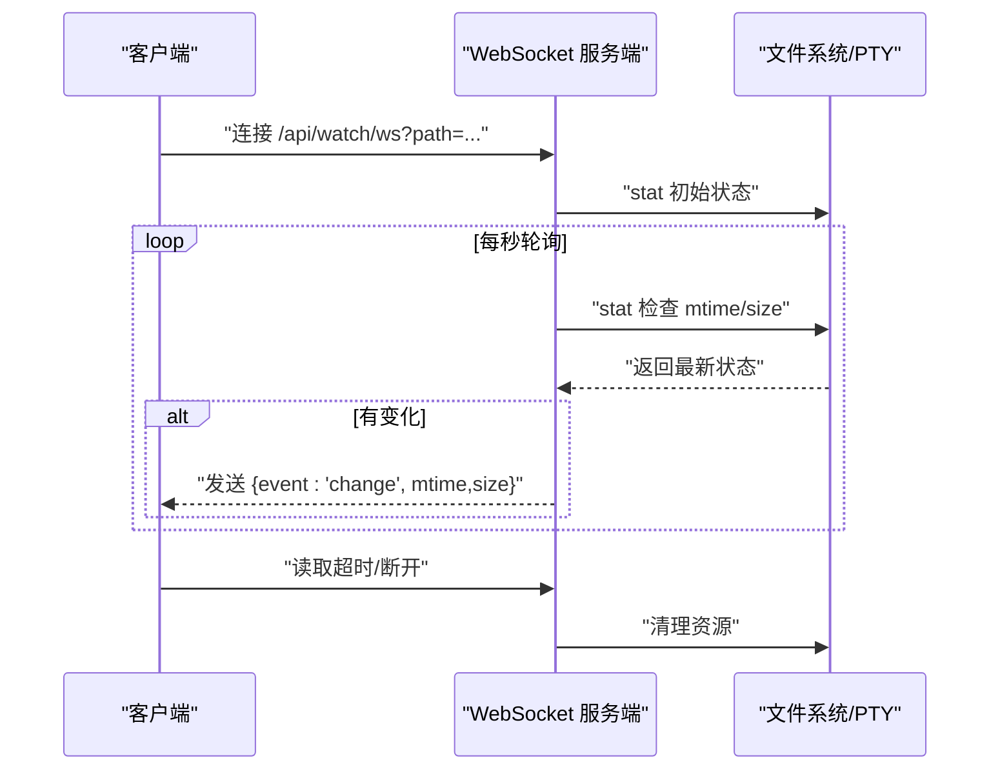
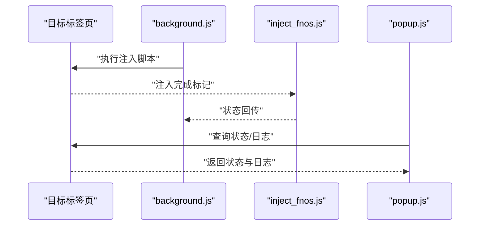
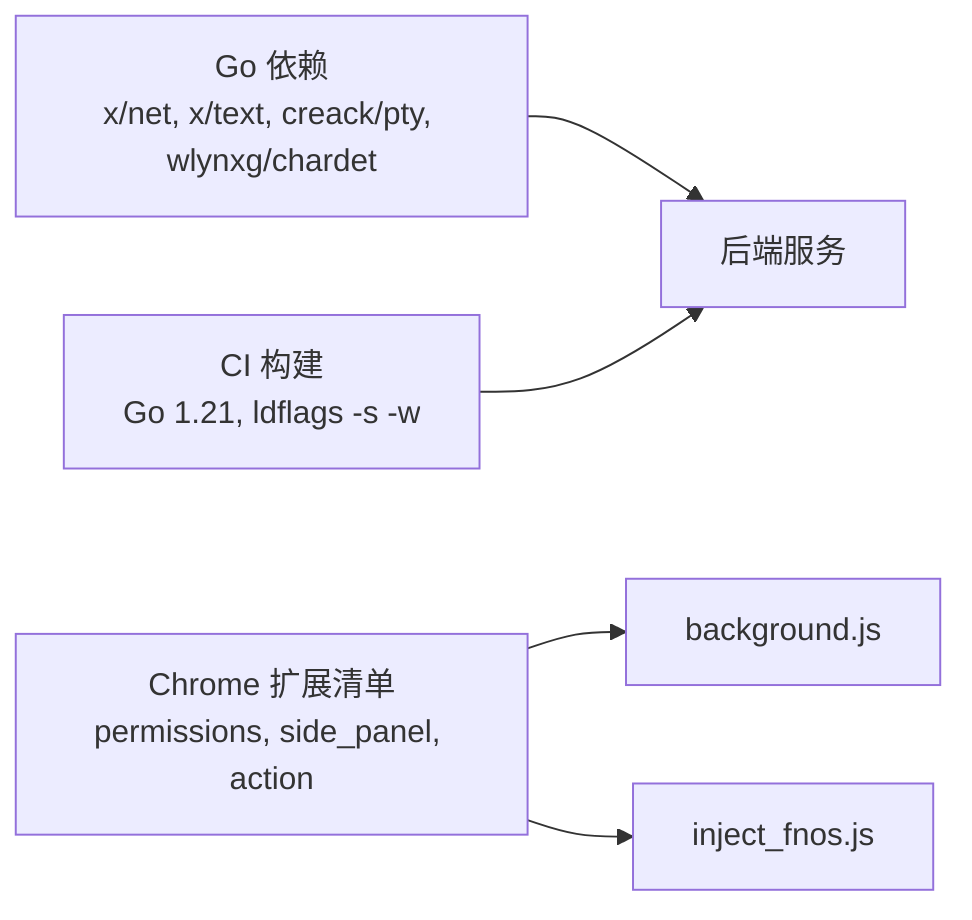

# 性能分析

<cite>
**本文引用的文件**
- [main.go](file://src/main.go)
- [handlers.go](file://src/handlers.go)
- [middleware.go](file://src/middleware.go)
- [models.go](file://src/models.go)
- [utils.go](file://src/utils.go)
- [go.mod](file://src/go.mod)
- [background.js](file://chrome_extension/background.js)
- [inject_fnos.js](file://chrome_extension/inject_fnos.js)
- [popup.js](file://chrome_extension/popup.js)
- [manifest.json](file://chrome_extension/manifest.json)
- [mock_server.js](file://test/scratch/mock_server.js)
- [README.md](file://test/README.md)
- [build.yml](file://.github/workflows/build.yml)
</cite>

## 目录
1. [简介](#简介)
2. [项目结构](#项目结构)
3. [核心组件](#核心组件)
4. [架构总览](#架构总览)
5. [详细组件分析](#详细组件分析)
6. [依赖关系分析](#依赖关系分析)
7. [性能考量](#性能考量)
8. [故障排查指南](#故障排查指南)
9. [结论](#结论)
10. [附录](#附录)

## 简介
本指南面向使用 Go 语言构建的 PodNote 文本编辑器后端与配套 Chrome 扩展的性能分析与优化实践。内容涵盖：
- 如何使用 Go 性能分析工具进行基准测试与瓶颈定位
- 文件操作的性能特征与优化策略
- WebSocket 连接的监控与调优方法
- 高并发场景下的系统表现评估
- 内存使用与垃圾回收优化技巧
- Chrome 扩展的加载时间与运行效率优化
- 性能指标采集与分析（响应时间、吞吐量、资源利用率）

## 项目结构
该项目采用前后端分离与扩展注入的架构：
- 后端服务（Go）：通过 Unix Socket 提供 HTTP 服务与 WebSocket 能力，负责文件读写、目录浏览、设置读写、终端会话等。
- 前端（Chrome 扩展）：通过 service worker 注入脚本，对目标页面进行功能增强与编辑器窗口集成。
- 测试与仿真：提供 Node.js 仿真服务器，模拟后端 API 与 WebSocket，便于本地开发与性能测试。

图表来源
- [main.go:15-144](file://src/main.go#L15-L144)
- [handlers.go:21-611](file://src/handlers.go#L21-L611)
- [middleware.go:22-103](file://src/middleware.go#L22-L103)
- [utils.go:25-261](file://src/utils.go#L25-L261)
- [background.js:1-169](file://chrome_extension/background.js#L1-L169)
- [inject_fnos.js:1-898](file://chrome_extension/inject_fnos.js#L1-L898)
- [popup.js:1-200](file://chrome_extension/popup.js#L1-L200)
- [mock_server.js:79-294](file://test/scratch/mock_server.js#L79-L294)

章节来源
- [main.go:15-144](file://src/main.go#L15-L144)
- [handlers.go:21-611](file://src/handlers.go#L21-L611)
- [middleware.go:22-103](file://src/middleware.go#L22-L103)
- [utils.go:25-261](file://src/utils.go#L25-L261)
- [background.js:1-169](file://chrome_extension/background.js#L1-L169)
- [inject_fnos.js:1-898](file://chrome_extension/inject_fnos.js#L1-L898)
- [popup.js:1-200](file://chrome_extension/popup.js#L1-L200)
- [mock_server.js:79-294](file://test/scratch/mock_server.js#L79-L294)

## 核心组件
- 路由与中间件链：统一入口、鉴权、压缩、缓存、日志与业务路由。
- 文件与目录处理：安全路径校验、编码探测、内容读取与写入、目录排序与过滤。
- WebSocket：文件变更监控与终端会话（PTY）桥接。
- 扩展注入：服务工作线程与页面注入脚本协同，实现功能增强与编辑器窗口集成。
- 仿真测试：Node.js 服务器模拟后端 API 与 WebSocket，便于本地性能测试。

章节来源
- [main.go:37-144](file://src/main.go#L37-L144)
- [handlers.go:21-611](file://src/handlers.go#L21-L611)
- [middleware.go:22-103](file://src/middleware.go#L22-L103)
- [utils.go:167-261](file://src/utils.go#L167-L261)
- [background.js:1-169](file://chrome_extension/background.js#L1-L169)
- [inject_fnos.js:1-898](file://chrome_extension/inject_fnos.js#L1-L898)
- [mock_server.js:79-294](file://test/scratch/mock_server.js#L79-L294)

## 架构总览
后端通过 Unix Socket 提供高性能本地通信；中间件链在进入业务处理前完成鉴权、压缩与缓存策略；业务处理器负责文件系统操作与 WebSocket 会话；扩展通过服务工作线程在目标页面注入脚本，建立与后端的 HTTP/WS 通道。

图表来源
- [main.go:111-144](file://src/main.go#L111-L144)
- [handlers.go:21-611](file://src/handlers.go#L21-L611)
- [utils.go:167-261](file://src/utils.go#L167-L261)
- [inject_fnos.js:1-898](file://chrome_extension/inject_fnos.js#L1-L898)

## 详细组件分析

### 后端服务与中间件链
- 鉴权中间件：生产环境启用管理员校验，避免非授权访问。
- Gzip 压缩中间件：对静态资源与 API 响应进行透明压缩，使用 sync.Pool 复用压缩器，降低分配成本。
- 缓存中间件：针对 Monaco 核心资源与带版本号资源实施强缓存策略，减少网络往返。
- 日志中间件：统一记录请求方法与路径，便于性能追踪与问题定位。

图表来源
- [middleware.go:22-103](file://src/middleware.go#L22-L103)
- [main.go:121-128](file://src/main.go#L121-L128)

章节来源
- [middleware.go:22-103](file://src/middleware.go#L22-L103)
- [main.go:121-128](file://src/main.go#L121-L128)

### 文件与目录处理
- 路径安全：cleanAndValidatePath 对路径进行清理、符号链接解析与应用目录隔离，防止目录逃逸。
- 读取流程：读取首块字节进行编码预测与二进制检测，必要时进行转码；限制最大文件大小以保护性能。
- 写入流程：采用临时文件 + 原子重命名策略，写入后同步落盘并保留权限与 UID/GID。
- 目录列表：忽略隐藏项，区分目录与文件，按目录优先与名称排序。

图表来源
- [handlers.go:114-212](file://src/handlers.go#L114-L212)
- [utils.go:25-53](file://src/utils.go#L25-L53)
- [utils.go:108-165](file://src/utils.go#L108-L165)

章节来源
- [handlers.go:114-212](file://src/handlers.go#L114-L212)
- [utils.go:25-53](file://src/utils.go#L25-L53)
- [utils.go:108-165](file://src/utils.go#L108-L165)

### WebSocket：文件监控与终端会话
- 文件监控：定时轮询文件 mtime/size，有变化即推送变更事件；客户端心跳检测与断开清理。
- 终端会话：启动 PTY，转发 WS 输入输出，支持窗口尺寸变更与心跳；超时断开防止资源泄漏。

图表来源
- [handlers.go:426-494](file://src/handlers.go#L426-L494)
- [utils.go:167-261](file://src/utils.go#L167-L261)

章节来源
- [handlers.go:426-494](file://src/handlers.go#L426-L494)
- [utils.go:167-261](file://src/utils.go#L167-L261)

### Chrome 扩展：注入与状态监控
- 服务工作线程：根据 URL 匹配规则决定注入时机，注入“已安装”标记与注入锁，避免重复注入；定期检查存活标记并自动重注。
- 页面注入脚本：拦截 WebSocket，同步路径与状态；创建编辑器窗口，支持拖拽、缩放、最大化与幽灵模式；记录日志并上报。
- 弹窗控制台：周期性查询页面状态，展示功能注入进度与日志数量，便于性能观察。

图表来源
- [background.js:39-117](file://chrome_extension/background.js#L39-L117)
- [inject_fnos.js:1-898](file://chrome_extension/inject_fnos.js#L1-L898)
- [popup.js:99-158](file://chrome_extension/popup.js#L99-L158)

章节来源
- [background.js:39-117](file://chrome_extension/background.js#L39-L117)
- [inject_fnos.js:1-898](file://chrome_extension/inject_fnos.js#L1-L898)
- [popup.js:99-158](file://chrome_extension/popup.js#L99-L158)

## 依赖关系分析
- Go 依赖：golang.org/x/net/websocket、golang.org/x/text、github.com/creack/pty、github.com/wlynxg/chardet。
- 扩展清单：声明权限与 side panel、action 等能力。
- 构建流程：GitHub Actions 使用 Go 1.21 构建后端二进制，打包为平台包。

图表来源
- [go.mod:5-11](file://src/go.mod#L5-L11)
- [manifest.json:6-27](file://chrome_extension/manifest.json#L6-L27)
- [build.yml:28-33](file://.github/workflows/build.yml#L28-L33)

章节来源
- [go.mod:5-11](file://src/go.mod#L5-L11)
- [manifest.json:6-27](file://chrome_extension/manifest.json#L6-L27)
- [.github/workflows/build.yml:28-33](file://.github/workflows/build.yml#L28-L33)

## 性能考量

### 使用 Go 性能分析工具进行基准测试与瓶颈识别
- 基准测试
  - 使用 go test -bench=. -benchmem 对关键函数进行基准测试，如路径清理、编码预测、文件读取与写入等。
  - 使用 go test -bench=. -benchtime=10x -benchmem 放大样本，提高统计稳定性。
- CPU 分析
  - 使用 go test -run=^$ -cpuprofile=cpu.pprof -bench=. 生成 CPU Profile，结合 go tool pprof 分析热点函数。
- 内存分析
  - 使用 go test -run=^$ -memprofile=mem.pprof -bench=. 生成内存 Profile，关注分配热点与 GC 压力。
- 火焰图
  - 结合 go-torch 或 go pprof svg 输出火焰图，快速定位 CPU 热点。
- 并发与锁竞争
  - 使用 go test -run=^$ -bench=. -race 启用竞态检测，发现潜在的数据竞争与锁争用。

章节来源
- [handlers.go:114-212](file://src/handlers.go#L114-L212)
- [utils.go:25-53](file://src/utils.go#L25-L53)
- [utils.go:108-165](file://src/utils.go#L108-L165)

### 文件操作的性能特征与优化策略
- 路径安全与 I/O
  - 使用 cleanAndValidatePath 避免路径逃逸与多余 stat 调用；在批量目录扫描时尽量减少 stat 次数。
- 读取优化
  - 控制最大文件大小（10MB），避免大文件阻塞；对小文件可考虑 mmap 或分块读取以降低内存峰值。
  - 编码预测与转码：仅在需要时进行转码，避免不必要的解码/编码链路。
- 写入优化
  - 临时文件 + 原子重命名策略有效避免部分写入；写入后同步落盘（Sync）保证一致性但增加 I/O 压力，可根据场景调整频率。
  - 保持权限与 UID/GID，减少后续权限变更带来的系统调用。
- 目录列表
  - 忽略隐藏项与符号链接解析成本较高时，可考虑缓存目录元信息；排序按目录优先与名称，减少前端渲染压力。

章节来源
- [handlers.go:21-112](file://src/handlers.go#L21-L112)
- [handlers.go:114-212](file://src/handlers.go#L114-L212)
- [handlers.go:214-324](file://src/handlers.go#L214-L324)
- [utils.go:25-53](file://src/utils.go#L25-L53)

### WebSocket 连接的监控与调优
- 文件监控
  - 1 秒轮询间隔在高并发场景下可能造成系统负载上升，建议根据业务需求动态调整或引入更高效的文件系统通知机制。
  - 客户端心跳检测与超时断开（done 通道）可避免僵尸连接，注意日志级别以减少噪声。
- 终端会话
  - PTY 启动与尺寸变更处理需谨慎，避免频繁重启进程；心跳（ping/pong）与超时断开（90 秒）可防止资源泄漏。
  - 输入输出转发采用流式复制，注意背压与缓冲区溢出风险。

章节来源
- [handlers.go:426-494](file://src/handlers.go#L426-L494)
- [utils.go:167-261](file://src/utils.go#L167-L261)

### 高并发场景下的系统表现
- Unix Socket 优势：本地通信延迟低、吞吐高，适合容器内服务。
- 中间件链：鉴权、压缩、缓存均在进入业务前完成，减少业务层负担；对 API 与静态资源分别处理，避免不必要的压缩。
- 并发模型：Go 的 goroutine 与 channel 适合高并发 I/O 场景；注意避免在热路径上进行阻塞操作。

章节来源
- [main.go:130-144](file://src/main.go#L130-L144)
- [middleware.go:22-103](file://src/middleware.go#L22-L103)

### 内存使用与垃圾回收优化技巧
- sync.Pool 复用：gzip 压缩器通过 sync.Pool 复用，降低频繁分配与 GC 压力。
- 字节切片与字符串：在编码检测与转码过程中避免不必要的拷贝；使用 io.ReadFull/io.ReadAll 时合理设置缓冲区大小。
- 大对象与长生命周期：避免在热路径上创建大对象；及时释放资源（Ticker、文件句柄、WS 连接）。
- GC 参数：在容器环境中可通过 GOGC、GOMAXPROCS 等环境变量微调 GC 行为，结合 pprof 观察效果。

章节来源
- [middleware.go:14-20](file://src/middleware.go#L14-L20)
- [middleware.go:61-66](file://src/middleware.go#L61-L66)

### Chrome 扩展的加载时间与运行效率优化
- 注入策略
  - 使用注入锁与存活标记避免重复注入与竞态；在 ISOLATED 环境中定期检查并自动重注，提升鲁棒性。
  - 仅在匹配域名/端口时注入，减少对无关页面的影响。
- UI 与交互
  - 编辑器窗口支持拖拽、缩放与幽灵模式，减少不必要的 DOM 操作；最大化/还原动画过渡使用 CSS，降低 JS 计算。
- 日志与状态
  - 通过 dataset 传递状态与日志，避免全局变量污染；弹窗控制台周期性查询，避免高频轮询导致性能下降。

章节来源
- [background.js:39-117](file://chrome_extension/background.js#L39-L117)
- [inject_fnos.js:317-595](file://chrome_extension/inject_fnos.js#L317-L595)
- [popup.js:99-158](file://chrome_extension/popup.js#L99-L158)

### 性能指标采集与分析方法
- 响应时间
  - 在日志中间件中记录请求开始与结束时间，计算平均响应时间与 P95/P99。
- 吞吐量
  - 统计单位时间内请求数（QPS），区分 API 与静态资源。
- 资源利用率
  - 采集 CPU、内存、GC 次数与暂停时间；I/O 采样文件读写次数与字节数。
- WebSocket 指标
  - 连接数、消息速率、丢包率、超时断开次数；终端会话的 PTY 启动成功率与平均耗时。

章节来源
- [main.go:125-128](file://src/main.go#L125-L128)
- [handlers.go:426-494](file://src/handlers.go#L426-L494)
- [utils.go:167-261](file://src/utils.go#L167-L261)

## 故障排查指南
- 文件读取失败
  - 检查路径合法性与权限；确认文件大小限制与编码预测结果；查看转码器初始化与读取错误。
- 写入失败
  - 检查临时文件创建、权限同步与原子重命名；关注 Sync 失败与权限变更错误。
- WebSocket 断开
  - 检查客户端心跳与超时设置；确认 done 通道触发与资源清理。
- 扩展注入异常
  - 检查 URL 匹配规则与注入锁；确认 ISOLATED 监控与重注逻辑。

章节来源
- [handlers.go:114-212](file://src/handlers.go#L114-L212)
- [handlers.go:214-324](file://src/handlers.go#L214-L324)
- [handlers.go:426-494](file://src/handlers.go#L426-L494)
- [background.js:39-117](file://chrome_extension/background.js#L39-L117)

## 结论
通过合理的中间件链、安全的文件操作策略、高效的 WebSocket 会话与扩展注入机制，以及完善的性能指标采集与分析体系，PodNote 能够在高并发与复杂文件操作场景下保持稳定与高效。建议持续使用 Go 性能分析工具进行回归测试，结合 CI 构建流程与仿真测试环境，确保性能与质量的长期可控。

## 附录
- 本地开发与仿真测试
  - 在 test 目录下启动 Node.js 仿真服务器，模拟后端 API 与 WebSocket，便于本地性能测试与调试。
- 构建与部署
  - GitHub Actions 使用 Go 1.21 构建后端二进制并打包，建议在构建阶段加入 -ldflags="-s -w" 减小体积并启用剥离。

章节来源
- [README.md:30-41](file://test/README.md#L30-L41)
- [.github/workflows/build.yml:28-33](file://.github/workflows/build.yml#L28-L33)