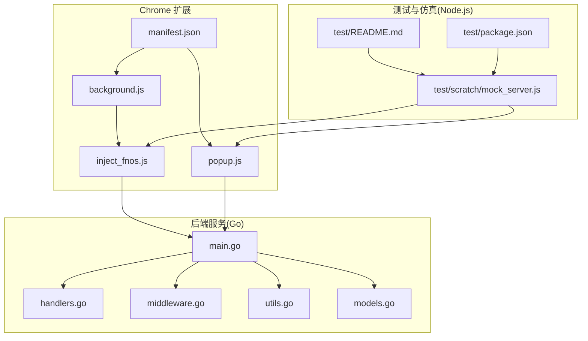
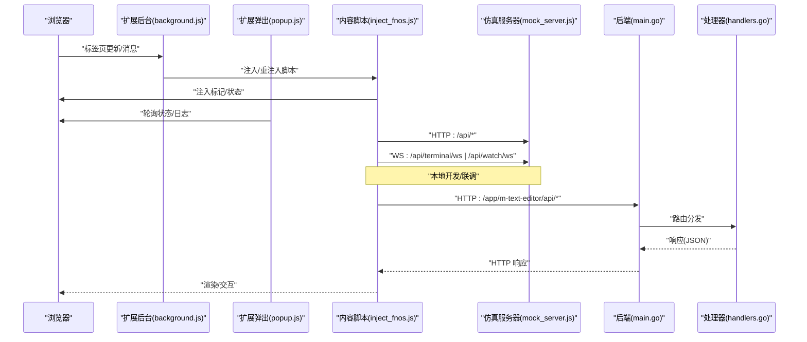
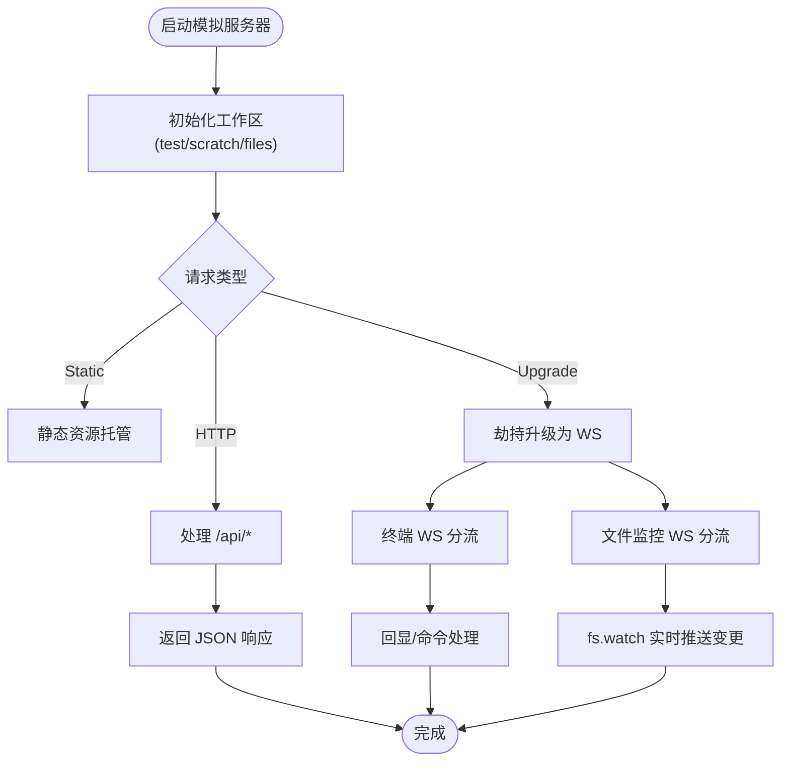
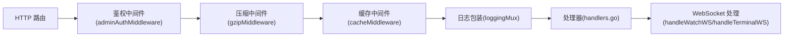
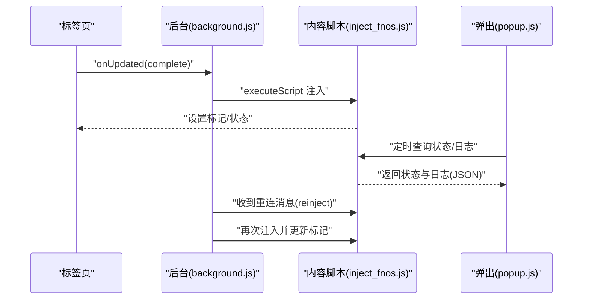
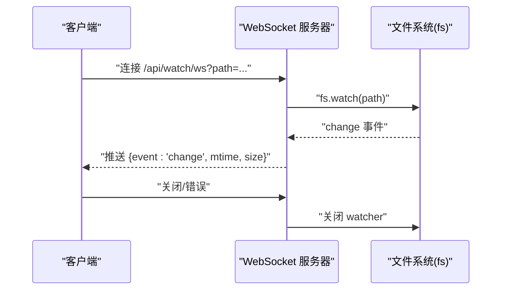
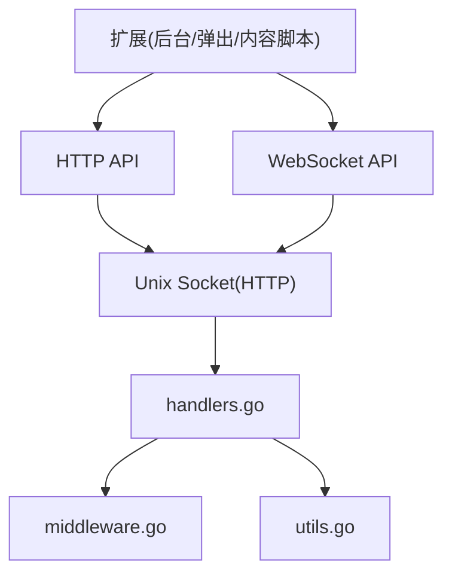

# 测试与调试

<cite>
**本文引用的文件**
- [test/README.md](file://test/README.md)
- [test/package.json](file://test/package.json)
- [test/scratch/mock_server.js](file://test/scratch/mock_server.js)
- [chrome_extension/manifest.json](file://chrome_extension/manifest.json)
- [chrome_extension/background.js](file://chrome_extension/background.js)
- [chrome_extension/popup.js](file://chrome_extension/popup.js)
- [chrome_extension/inject_fnos.js](file://chrome_extension/inject_fnos.js)
- [src/main.go](file://src/main.go)
- [src/handlers.go](file://src/handlers.go)
- [src/middleware.go](file://src/middleware.go)
- [src/models.go](file://src/models.go)
- [src/utils.go](file://src/utils.go)
</cite>

## 目录
1. [简介](#简介)
2. [项目结构](#项目结构)
3. [核心组件](#核心组件)
4. [架构总览](#架构总览)
5. [详细组件分析](#详细组件分析)
6. [依赖关系分析](#依赖关系分析)
7. [性能考虑](#性能考虑)
8. [故障排查指南](#故障排查指南)
9. [结论](#结论)
10. [附录](#附录)

## 简介
本指南面向开发者与测试工程师，系统性地阐述本项目的测试与调试方法，涵盖：
- 单元测试与集成测试的编写思路与组织结构
- 模拟服务器的使用与测试场景配置
- Chrome 扩展的调试技巧（后台页面、内容脚本、弹出窗口）
- WebSocket 连接调试与实时监控测试
- 常见错误诊断与解决
- 性能测试与压力测试实施建议
- 日志记录与错误追踪最佳实践

## 项目结构
项目采用多模块分层组织：
- 后端服务（Go）：提供 HTTP API 与 WebSocket 服务，通过 Unix Socket 对外提供服务
- Chrome 扩展：包含清单文件、后台脚本、弹出窗口与内容注入脚本
- 测试与仿真：Node.js 本地仿真服务器，模拟核心 API 与 WebSocket，便于离线开发与联调

图表来源
- [chrome_extension/manifest.json:1-28](file://chrome_extension/manifest.json#L1-L28)
- [chrome_extension/background.js:1-169](file://chrome_extension/background.js#L1-L169)
- [chrome_extension/popup.js:1-200](file://chrome_extension/popup.js#L1-L200)
- [chrome_extension/inject_fnos.js:1-898](file://chrome_extension/inject_fnos.js#L1-L898)
- [src/main.go:1-145](file://src/main.go#L1-L145)
- [src/handlers.go:1-614](file://src/handlers.go#L1-L614)
- [src/middleware.go:1-103](file://src/middleware.go#L1-L103)
- [src/utils.go:1-262](file://src/utils.go#L1-L262)
- [src/models.go:1-30](file://src/models.go#L1-L30)
- [test/README.md:1-41](file://test/README.md#L1-L41)
- [test/package.json:1-6](file://test/package.json#L1-L6)
- [test/scratch/mock_server.js:1-437](file://test/scratch/mock_server.js#L1-L437)

章节来源
- [test/README.md:1-41](file://test/README.md#L1-L41)
- [test/package.json:1-6](file://test/package.json#L1-L6)
- [test/scratch/mock_server.js:1-437](file://test/scratch/mock_server.js#L1-L437)
- [chrome_extension/manifest.json:1-28](file://chrome_extension/manifest.json#L1-L28)
- [src/main.go:1-145](file://src/main.go#L1-L145)

## 核心组件
- 模拟服务器（Node.js）：提供 HTTP API 与 WebSocket 仿真，覆盖目录读取、文件读取/保存、新建、设置读写、终端与文件监控等能力，便于本地联调与自动化测试
- 后端服务（Go）：通过 Unix Socket 提供 HTTP 服务，内置鉴权、压缩、缓存中间件；实现文件列表、读取、保存、新建、设置、文件监控与终端等接口
- Chrome 扩展：后台脚本负责注入与重注入、域名匹配与侧边栏行为；弹出窗口负责状态展示与日志；内容脚本负责拦截 WebSocket、注入 UI、打开编辑器窗口

章节来源
- [test/scratch/mock_server.js:1-437](file://test/scratch/mock_server.js#L1-L437)
- [src/main.go:1-145](file://src/main.go#L1-L145)
- [src/handlers.go:1-614](file://src/handlers.go#L1-L614)
- [chrome_extension/background.js:1-169](file://chrome_extension/background.js#L1-L169)
- [chrome_extension/popup.js:1-200](file://chrome_extension/popup.js#L1-L200)
- [chrome_extension/inject_fnos.js:1-898](file://chrome_extension/inject_fnos.js#L1-L898)

## 架构总览
下图展示了从浏览器到后端服务与 WebSocket 的整体交互流程，以及测试仿真服务器的角色。

图表来源
- [chrome_extension/background.js:1-169](file://chrome_extension/background.js#L1-L169)
- [chrome_extension/popup.js:1-200](file://chrome_extension/popup.js#L1-L200)
- [chrome_extension/inject_fnos.js:1-898](file://chrome_extension/inject_fnos.js#L1-L898)
- [test/scratch/mock_server.js:1-437](file://test/scratch/mock_server.js#L1-L437)
- [src/main.go:1-145](file://src/main.go#L1-L145)
- [src/handlers.go:1-614](file://src/handlers.go#L1-L614)

## 详细组件分析

### 模拟服务器（Node.js）测试支撑
- 目的：在非飞牛OS环境下，提供与后端一致的 API 与 WebSocket 行为，便于前端与扩展联调
- 能力：
  - HTTP API：/api/list、/api/read、/api/save、/api/new、/api/create、/api/settings
  - 静态资源托管：映射到构建产物目录
  - WebSocket：终端仿真（/api/terminal/ws）、文件监控（/api/watch/ws）
- 使用步骤：
  - 安装依赖后启动，访问 http://localhost:3000 预览与调试
  - 测试用例可直接对接该服务器，无需真实后端

图表来源
- [test/scratch/mock_server.js:1-437](file://test/scratch/mock_server.js#L1-L437)

章节来源
- [test/README.md:1-41](file://test/README.md#L1-L41)
- [test/scratch/mock_server.js:1-437](file://test/scratch/mock_server.js#L1-L437)
- [test/package.json:1-6](file://test/package.json#L1-L6)

### 后端服务（Go）接口与中间件
- 入口与路由：
  - 动态入口：为首页、样式、脚本注入版本号；静态资源转发
  - 业务 API：/api/read、/api/save、/api/settings、/api/create、/api/new、/api/list
  - WebSocket：/api/watch/ws、/api/terminal/ws
- 中间件链：
  - 管理员鉴权、Gzip 压缩、缓存控制、日志审计
- 数据模型：统一响应结构、目录项结构

图表来源
- [src/main.go:1-145](file://src/main.go#L1-L145)
- [src/middleware.go:1-103](file://src/middleware.go#L1-L103)
- [src/handlers.go:1-614](file://src/handlers.go#L1-L614)
- [src/models.go:1-30](file://src/models.go#L1-L30)

章节来源
- [src/main.go:1-145](file://src/main.go#L1-L145)
- [src/handlers.go:1-614](file://src/handlers.go#L1-L614)
- [src/middleware.go:1-103](file://src/middleware.go#L1-L103)
- [src/models.go:1-30](file://src/models.go#L1-L30)

### Chrome 扩展调试要点
- 后台页面调试：
  - 监听标签页更新，按域名/端口规则决定是否注入
  - 注入互斥与存活标记，避免重复注入
  - 收到重连请求时主动重注
- 内容脚本调试：
  - 拦截 WebSocket，同步路径与特征
  - 注入 UI、打开编辑器窗口、幽灵模式与拖拽缩放
  - 通过 dataset 与 window 标记传递状态与日志
- 弹出窗口调试：
  - 本地存储启用状态与匹配规则
  - 定时轮询页面状态，渲染功能注入进度与日志

图表来源
- [chrome_extension/background.js:1-169](file://chrome_extension/background.js#L1-L169)
- [chrome_extension/popup.js:1-200](file://chrome_extension/popup.js#L1-L200)
- [chrome_extension/inject_fnos.js:1-898](file://chrome_extension/inject_fnos.js#L1-L898)

章节来源
- [chrome_extension/manifest.json:1-28](file://chrome_extension/manifest.json#L1-L28)
- [chrome_extension/background.js:1-169](file://chrome_extension/background.js#L1-L169)
- [chrome_extension/popup.js:1-200](file://chrome_extension/popup.js#L1-L200)
- [chrome_extension/inject_fnos.js:1-898](file://chrome_extension/inject_fnos.js#L1-L898)

### WebSocket 连接与实时监控测试
- 终端 WS：
  - 校验管理员身份；支持窗口尺寸变更与心跳
  - 通过 PTY 启动 bash，双向转发数据
- 文件监控 WS：
  - 基于 fs.watch，仅在 mtime 或 size 实质变化时推送
  - 初始化与关闭时释放资源，捕获常见错误

图表来源
- [src/handlers.go:426-494](file://src/handlers.go#L426-L494)
- [test/scratch/mock_server.js:345-416](file://test/scratch/mock_server.js#L345-L416)

章节来源
- [src/handlers.go:426-494](file://src/handlers.go#L426-L494)
- [src/utils.go:167-261](file://src/utils.go#L167-L261)
- [test/scratch/mock_server.js:345-416](file://test/scratch/mock_server.js#L345-L416)

## 依赖关系分析
- 扩展与后端：
  - 扩展通过 HTTP 与 WebSocket 与后端交互
  - 后端通过 Unix Socket 提供服务，扩展需在目标站点上运行
- 扩展与仿真服务器：
  - 本地联调时，扩展可直连本地 3000 端口的仿真服务器
- 后端与中间件：
  - 中间件链顺序影响性能与安全（鉴权 → 压缩 → 缓存 → 日志）

图表来源
- [src/main.go:1-145](file://src/main.go#L1-L145)
- [src/handlers.go:1-614](file://src/handlers.go#L1-L614)
- [src/middleware.go:1-103](file://src/middleware.go#L1-L103)
- [src/utils.go:1-262](file://src/utils.go#L1-L262)
- [chrome_extension/inject_fnos.js:1-898](file://chrome_extension/inject_fnos.js#L1-L898)

章节来源
- [src/main.go:1-145](file://src/main.go#L1-L145)
- [src/handlers.go:1-614](file://src/handlers.go#L1-L614)
- [src/middleware.go:1-103](file://src/middleware.go#L1-L103)
- [src/utils.go:1-262](file://src/utils.go#L1-L262)
- [chrome_extension/inject_fnos.js:1-898](file://chrome_extension/inject_fnos.js#L1-L898)

## 性能考虑
- 压缩与缓存：
  - 启用 Gzip 压缩，对 .js/.css/.html 与 API 响应进行压缩
  - 静态资源与带版本号资源设置长缓存，减少网络开销
- 路由与中间件：
  - WebSocket 升级请求绕过压缩，避免协议干扰
  - 静态资源与 Monaco 核心资源强缓存，提升加载速度
- 文件读取与保存：
  - 读取前进行大小限制与二进制探测，避免大文件与二进制文件阻塞
  - 保存采用原子写入（临时文件 + 重命名），降低数据损坏风险
- 终端与监控：
  - 终端会话设置读超时，避免僵尸连接
  - 文件监控仅在 mtime/size 变化时推送，减少冗余消息

章节来源
- [src/middleware.go:40-92](file://src/middleware.go#L40-L92)
- [src/handlers.go:114-212](file://src/handlers.go#L114-L212)
- [src/handlers.go:214-324](file://src/handlers.go#L214-L324)
- [src/handlers.go:426-494](file://src/handlers.go#L426-L494)
- [src/utils.go:167-261](file://src/utils.go#L167-L261)

## 故障排查指南
- 环境变量缺失：
  - 后端启动需 TRIM_APPDEST、TRIM_APPVER，否则直接退出
- 权限与路径：
  - 路径校验防止目录逃逸与系统受保护目录访问
  - 保存时若 mtime 发生外部变化，拒绝覆盖
- WebSocket 连接：
  - 终端 WS 需管理员身份；超时未交互自动断开
  - 文件监控 WS 若监听文件不存在，立即返回错误并关闭
- 扩展注入：
  - 若页面未激活，弹出窗口显示“未激活”；检查域名匹配与注入锁
  - 重注失败时清理注入标记并重试
- 仿真服务器：
  - 读取/保存失败时返回错误码；文件过大或二进制文件会被拒绝

章节来源
- [src/main.go:15-24](file://src/main.go#L15-L24)
- [src/utils.go:25-53](file://src/utils.go#L25-L53)
- [src/handlers.go:253-263](file://src/handlers.go#L253-L263)
- [src/handlers.go:496-516](file://src/handlers.go#L496-L516)
- [src/handlers.go:426-446](file://src/handlers.go#L426-L446)
- [chrome_extension/background.js:119-168](file://chrome_extension/background.js#L119-L168)
- [chrome_extension/popup.js:144-156](file://chrome_extension/popup.js#L144-L156)
- [test/scratch/mock_server.js:144-171](file://test/scratch/mock_server.js#L144-L171)

## 结论
本指南提供了从测试环境搭建、接口与 WebSocket 调试，到扩展注入与日志追踪的完整方法论。结合模拟服务器与后端中间件特性，可在本地高效完成端到端联调与问题定位。建议在持续集成中引入自动化测试与压力测试，保障稳定性与性能。

## 附录
- 测试文件组织建议（示例结构）
  - 单元测试：按模块拆分（handlers、middleware、utils），针对关键函数与边界条件
  - 集成测试：以仿真服务器为后端，覆盖典型业务流程（读取/保存/新建/监控/终端）
  - 场景化测试：构造不同文件大小、编码、权限与异常路径，验证错误处理
- 调试清单
  - 后端：检查日志输出、中间件链顺序、Unix Socket 权限
  - 扩展：确认域名匹配、注入互斥、状态与日志的 dataset 存储
  - WebSocket：验证管理员校验、心跳与超时、监控推送去重
- 性能测试建议
  - 使用压测工具对 /api/read、/api/save、/api/list 进行并发与吞吐测试
  - 验证压缩与缓存策略在高并发下的效果
  - 监控终端 WS 会话数量与资源占用