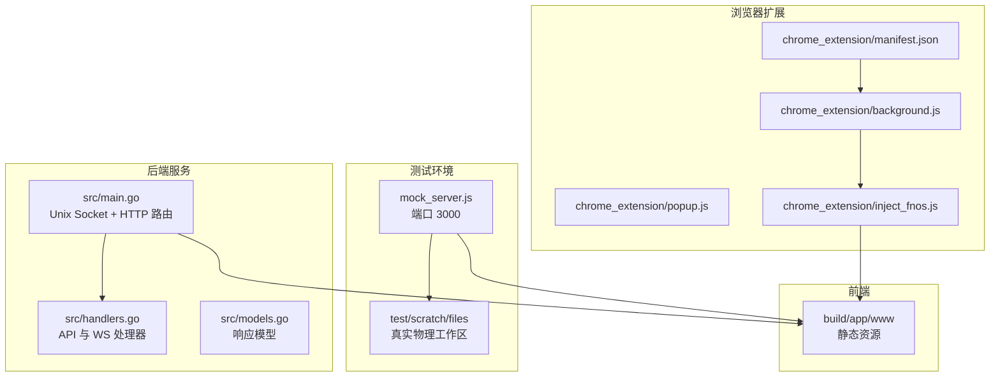
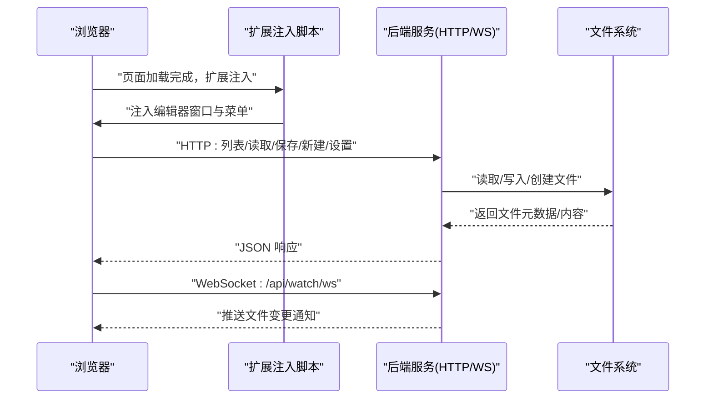
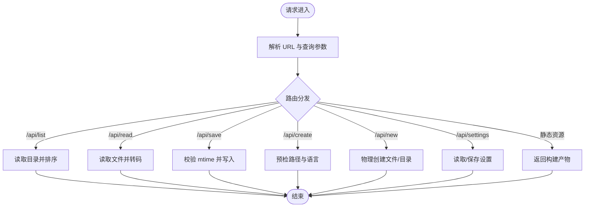
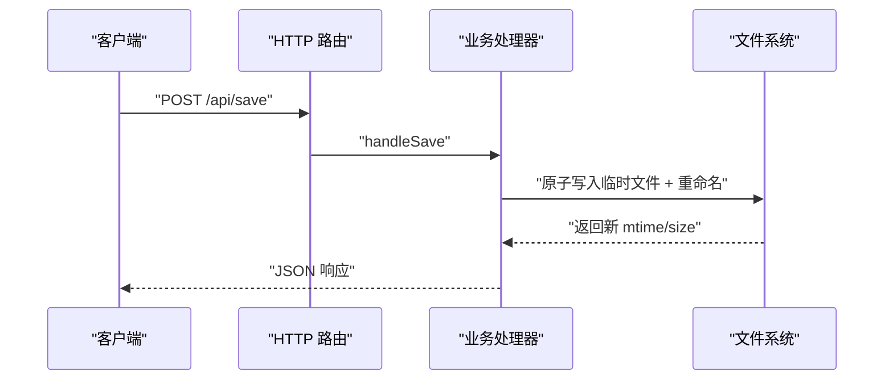
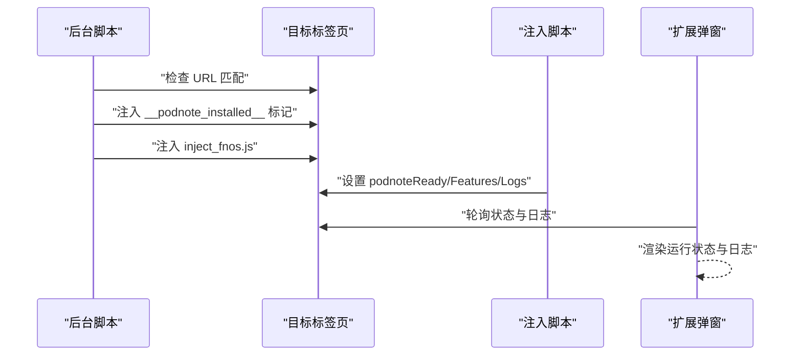
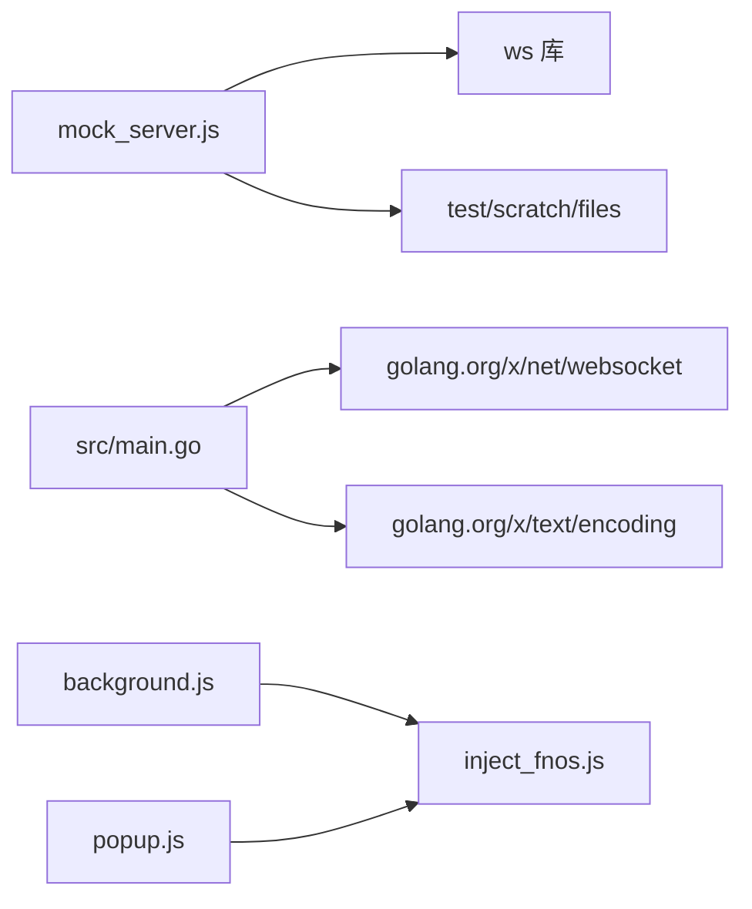

# 集成测试

<cite>
**本文引用的文件**   
- [mock_server.js](file://test/scratch/mock_server.js)
- [README.md（测试目录）](file://test/README.md)
- [package.json（测试依赖）](file://test/package.json)
- [main.go（后端入口）](file://src/main.go)
- [handlers.go（后端处理器）](file://src/handlers.go)
- [models.go（数据模型）](file://src/models.go)
- [manifest.json（Chrome 扩展清单）](file://chrome_extension/manifest.json)
- [background.js（扩展后台脚本）](file://chrome_extension/background.js)
- [popup.js（扩展弹窗脚本）](file://chrome_extension/popup.js)
- [inject_fnos.js（注入脚本）](file://chrome_extension/inject_fnos.js)
</cite>

## 目录
1. [简介](#简介)
2. [项目结构](#项目结构)
3. [核心组件](#核心组件)
4. [架构总览](#架构总览)
5. [详细组件分析](#详细组件分析)
6. [依赖关系分析](#依赖关系分析)
7. [性能考量](#性能考量)
8. [故障排查指南](#故障排查指南)
9. [结论](#结论)
10. [附录](#附录)

## 简介
本指南面向需要对“文件读取保存流程、WebSocket 连接测试、Chrome 扩展集成测试”进行全面验证的工程师。文档围绕以下目标展开：
- 如何使用本地 mock 服务器模拟后端核心能力，覆盖文件列表、读取、保存、新建、设置读取与 WebSocket 文件监控。
- 如何设计端到端测试流程，从用户操作到系统响应的完整链路验证。
- 如何在不同操作系统下进行兼容性测试。
- 测试数据准备与清理策略。
- 实时监控与文件变更通知机制的验证方法。

## 项目结构
该项目采用前后端分离与扩展注入的架构：
- 后端服务通过 Unix Socket 提供 HTTP 服务与 WebSocket 能力，核心路由集中在 src 目录。
- 前端构建产物位于 build/app/www，由后端作为静态资源提供。
- 测试环境提供 Node.js 本地 mock 服务器，直接映射 test/scratch/files 为真实物理工作区，便于离线调试与自动化测试。
- Chrome 扩展负责在目标页面注入 PodNote 集成脚本，桥接编辑器与飞牛系统界面。

图表来源
- [mock_server.js:1-437](file://test/scratch/mock_server.js#L1-L437)
- [main.go:14-145](file://src/main.go#L14-L145)
- [handlers.go:21-614](file://src/handlers.go#L21-L614)
- [models.go:1-30](file://src/models.go#L1-L30)
- [manifest.json:1-28](file://chrome_extension/manifest.json#L1-L28)
- [background.js:1-169](file://chrome_extension/background.js#L1-L169)
- [popup.js:1-200](file://chrome_extension/popup.js#L1-L200)
- [inject_fnos.js:1-898](file://chrome_extension/inject_fnos.js#L1-L898)

章节来源
- [README.md（测试目录）:1-41](file://test/README.md#L1-L41)
- [mock_server.js:1-437](file://test/scratch/mock_server.js#L1-L437)
- [main.go:14-145](file://src/main.go#L14-L145)
- [handlers.go:21-614](file://src/handlers.go#L21-L614)
- [models.go:1-30](file://src/models.go#L1-L30)
- [manifest.json:1-28](file://chrome_extension/manifest.json#L1-L28)
- [background.js:1-169](file://chrome_extension/background.js#L1-L169)
- [popup.js:1-200](file://chrome_extension/popup.js#L1-L200)
- [inject_fnos.js:1-898](file://chrome_extension/inject_fnos.js#L1-L898)

## 核心组件
- 本地 mock 服务器：提供 HTTP API 与 WebSocket 升级，直接映射 test/scratch/files 为真实工作区，支持文件列表、读取、保存、新建、设置读取与文件监控。
- 后端服务：通过 Unix Socket 提供 HTTP 与 WebSocket，实现文件读取保存、目录列表、设置读取、文件监控与终端会话。
- Chrome 扩展：在目标页面注入脚本，桥接编辑器窗口与飞牛系统界面，提供右键菜单注入、工具栏按钮注入、编辑器窗口管理与状态上报。
- 数据模型：统一响应结构，便于前后端契约一致与测试断言。

章节来源
- [mock_server.js:78-294](file://test/scratch/mock_server.js#L78-L294)
- [handlers.go:21-614](file://src/handlers.go#L21-L614)
- [models.go:1-30](file://src/models.go#L1-L30)
- [background.js:1-169](file://chrome_extension/background.js#L1-L169)
- [inject_fnos.js:1-898](file://chrome_extension/inject_fnos.js#L1-L898)

## 架构总览
下图展示从浏览器到后端再到文件系统的端到端链路，以及扩展注入与 WebSocket 监控的关键节点。

图表来源
- [main.go:111-119](file://src/main.go#L111-L119)
- [handlers.go:426-494](file://src/handlers.go#L426-L494)
- [inject_fnos.js:80-123](file://chrome_extension/inject_fnos.js#L80-L123)

## 详细组件分析

### 本地 mock 服务器（mock_server.js）
- 目标与职责
  - 提供与后端一致的 HTTP API：/api/list、/api/read、/api/save、/api/create、/api/new、/api/settings。
  - 提供 WebSocket：/api/terminal/ws（终端仿真）、/api/watch/ws（文件监控）。
  - 将请求参数 path 映射到 test/scratch/files 下的真实物理路径，便于离线测试。
- 关键特性
  - 路径安全：getPhysicalPath 对相对路径与绝对路径进行安全转换。
  - 语言识别：detectLanguage 基于扩展名推导 Monaco 语言 ID。
  - 并发乐观锁：/api/save 基于 mtime 校验防止外部修改覆盖。
  - 文件监控：基于 fs.watch 实现变更通知，避免重复推送。
- 兼容性与跨平台
  - 使用 Node.js 原生命令与 fs.watch，适用于 Windows、macOS、Linux。
  - 注意：某些平台对 fs.watch 的行为差异可能影响监控灵敏度，建议在目标平台进行回归验证。

图表来源
- [mock_server.js:78-294](file://test/scratch/mock_server.js#L78-L294)

章节来源
- [mock_server.js:16-40](file://test/scratch/mock_server.js#L16-L40)
- [mock_server.js:92-246](file://test/scratch/mock_server.js#L92-L246)
- [mock_server.js:248-279](file://test/scratch/mock_server.js#L248-L279)
- [mock_server.js:296-416](file://test/scratch/mock_server.js#L296-L416)

### 后端服务（src/main.go 与 handlers.go）
- 目标与职责
  - 通过 Unix Socket 暴露 HTTP 与 WebSocket 服务，提供文件读取、保存、列表、新建、设置读取与文件监控。
  - 路由前缀 /app/m-text-editor/，静态资源经 www 目录提供。
- 关键特性
  - 版本注入：首页与静态资源注入版本号，避免缓存问题。
  - 安全与中间件：鉴权、压缩、缓存与日志。
  - 乐观锁保存：基于 mtime 防止覆盖外部修改。
  - 文件监控：定时轮询文件元数据变化并推送变更。
- 数据模型
  - Response、FileInfo、ListResponse 统一响应结构，便于断言。

图表来源
- [main.go:111-119](file://src/main.go#L111-L119)
- [handlers.go:214-324](file://src/handlers.go#L214-L324)

章节来源
- [main.go:14-145](file://src/main.go#L14-L145)
- [handlers.go:21-614](file://src/handlers.go#L21-L614)
- [models.go:1-30](file://src/models.go#L1-L30)

### Chrome 扩展（manifest.json、background.js、popup.js、inject_fnos.js）
- 目标与职责
  - 在匹配域名与端口的页面注入 PodNote 集成脚本，提供右键菜单注入、工具栏按钮注入、编辑器窗口管理与状态上报。
  - 通过扩展弹窗管理启用状态与匹配规则，轮询页面注入状态并渲染日志。
- 关键特性
  - URL 匹配：支持多关键词匹配与注释行解析。
  - 注入互斥：通过 __podnote_injecting__ 防止重复注入。
  - 状态上报：通过 dataset 与 window 对象向扩展弹窗暴露状态与日志。
  - 重连机制：ISOLATED 监控与消息重注，保证稳定性。

图表来源
- [background.js:40-117](file://chrome_extension/background.js#L40-L117)
- [popup.js:99-158](file://chrome_extension/popup.js#L99-L158)
- [inject_fnos.js:13-55](file://chrome_extension/inject_fnos.js#L13-L55)

章节来源
- [manifest.json:1-28](file://chrome_extension/manifest.json#L1-L28)
- [background.js:1-169](file://chrome_extension/background.js#L1-L169)
- [popup.js:1-200](file://chrome_extension/popup.js#L1-L200)
- [inject_fnos.js:1-898](file://chrome_extension/inject_fnos.js#L1-L898)

## 依赖关系分析
- 测试依赖
  - mock_server.js 依赖 Node.js 内置模块与 ws WebSocket 库，用于升级与终端仿真。
- 后端依赖
  - Go 标准库与 golang.org/x/net/websocket 提供 WebSocket 支持；golang.org/x/text/encoding 用于转码。
- 前端与扩展
  - 扩展通过 scripting.executeScript 注入脚本，依赖页面 DOM 结构与 dataset 传递状态。

图表来源
- [package.json:1-6](file://test/package.json#L1-L6)
- [main.go:11-12](file://src/main.go#L11-L12)
- [handlers.go:16-19](file://src/handlers.go#L16-L19)
- [background.js:1-169](file://chrome_extension/background.js#L1-L169)
- [inject_fnos.js:1-898](file://chrome_extension/inject_fnos.js#L1-L898)

章节来源
- [package.json:1-6](file://test/package.json#L1-L6)
- [main.go:11-12](file://src/main.go#L11-L12)
- [handlers.go:16-19](file://src/handlers.go#L16-L19)
- [background.js:1-169](file://chrome_extension/background.js#L1-L169)
- [inject_fnos.js:1-898](file://chrome_extension/inject_fnos.js#L1-L898)

## 性能考量
- 文件大小限制：后端与 mock 服务器均对读取文件大小进行限制，避免内存压力与性能退化。
- 乐观锁保存：减少并发写入冲突，提升一致性与可靠性。
- WebSocket 监控：后端采用定时轮询与文件元数据对比，避免高频事件风暴；mock 服务器使用 fs.watch 并进行去重判断。
- 静态资源版本注入：避免浏览器缓存导致的回退问题，保障测试一致性。

章节来源
- [handlers.go:146-151](file://src/handlers.go#L146-L151)
- [mock_server.js:155-157](file://test/scratch/mock_server.js#L155-L157)
- [handlers.go:258-262](file://src/handlers.go#L258-L262)
- [mock_server.js:379-393](file://test/scratch/mock_server.js#L379-L393)
- [main.go:52-104](file://src/main.go#L52-L104)

## 故障排查指南
- 本地 mock 服务器
  - 端口占用：确认 3000 端口可用，或调整 PORT。
  - 路径映射：确保请求参数 path 能正确映射到 test/scratch/files 下的物理路径。
  - 文件监控：在部分平台 fs.watch 行为差异可能导致延迟，建议结合日志观察。
- 后端服务
  - Unix Socket 权限：确保监听路径可写且权限正确。
  - 路由前缀：确认 /app/m-text-editor/ 前缀与前端一致。
  - 保存失败：检查 mtime 与文件权限，确认原子写入流程。
- Chrome 扩展
  - URL 匹配：检查匹配规则与注释语法，确保域名/端口正确。
  - 注入失败：查看扩展弹窗日志，确认 __podnote_installed__ 与 __podnoteReady__ 标记。
  - 重连机制：若状态丢失，后台脚本会发送重注消息，确认弹窗轮询正常。

章节来源
- [mock_server.js:7-9](file://test/scratch/mock_server.js#L7-L9)
- [mock_server.js:17-28](file://test/scratch/mock_server.js#L17-L28)
- [main.go:130-139](file://src/main.go#L130-L139)
- [handlers.go:214-324](file://src/handlers.go#L214-L324)
- [background.js:40-117](file://chrome_extension/background.js#L40-L117)
- [popup.js:99-158](file://chrome_extension/popup.js#L99-L158)

## 结论
通过本地 mock 服务器与后端服务的协同，结合 Chrome 扩展的注入与状态上报，可以构建覆盖文件读取保存、WebSocket 监控与扩展集成的完整端到端测试方案。建议在多操作系统环境下进行回归验证，并建立标准化的数据准备与清理流程，确保测试结果稳定可靠。

## 附录

### 端到端测试实施步骤（示例）
- 准备阶段
  - 启动本地 mock 服务器或后端服务，确保端口与路由可达。
  - 准备测试文件与目录，放置于 test/scratch/files 或后端可访问路径。
- 文件读取保存流程
  - 列出目录：调用 /api/list，断言返回文件列表与排序。
  - 读取文件：调用 /api/read，断言内容、语言与大小。
  - 保存文件：调用 /api/save，传入 mtime 验证乐观锁，断言返回新 mtime/size。
  - 新建文件/目录：先调用 /api/create 预检，再调用 /api/new 创建。
  - 设置读取/保存：调用 /api/settings，断言读取与保存成功。
- WebSocket 连接测试
  - 终端仿真：连接 /api/terminal/ws，发送命令并断言回显。
  - 文件监控：连接 /api/watch/ws，修改文件并断言变更通知。
- Chrome 扩展集成测试
  - 启用扩展并配置匹配规则，打开目标页面。
  - 断言注入标记与菜单注入，打开编辑器窗口并验证窗口管理。
  - 通过扩展弹窗轮询状态与日志，验证运行状态与错误提示。

章节来源
- [README.md（测试目录）:30-41](file://test/README.md#L30-L41)
- [mock_server.js:92-279](file://test/scratch/mock_server.js#L92-L279)
- [handlers.go:21-614](file://src/handlers.go#L21-L614)
- [background.js:40-117](file://chrome_extension/background.js#L40-L117)
- [inject_fnos.js:80-123](file://chrome_extension/inject_fnos.js#L80-L123)

### 测试数据准备与清理策略
- 准备
  - 在 test/scratch/files 下创建测试目录与文件，包含多种扩展名与大小。
  - 预置 settings.json/settings_mobile.json 以便设置读取测试。
- 清理
  - 测试结束后删除临时文件与目录，恢复工作区状态。
  - 清空扩展弹窗日志与注入标记，避免跨测试污染。

章节来源
- [mock_server.js:11-14](file://test/scratch/mock_server.js#L11-L14)
- [handlers.go:518-529](file://src/handlers.go#L518-L529)
- [popup.js:74-96](file://chrome_extension/popup.js#L74-L96)

### 不同操作系统下的兼容性测试要点
- Windows/macOS/Linux
  - 文件监控：fs.watch 在不同平台的行为差异，需关注延迟与事件合并。
  - 路径分隔符：统一使用正斜杠进行 API 传输，内部转换为系统路径。
  - 权限与符号链接：注意权限同步与软链接解析差异。

章节来源
- [mock_server.js:17-28](file://test/scratch/mock_server.js#L17-L28)
- [handlers.go:76-81](file://src/handlers.go#L76-L81)