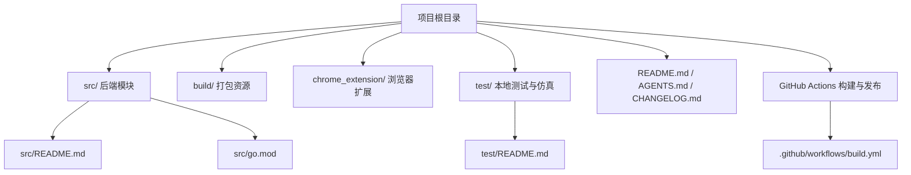
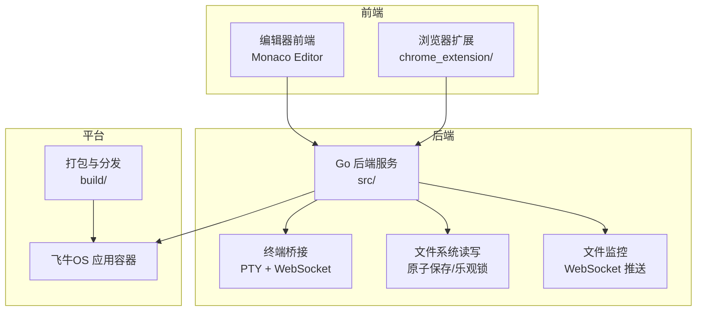
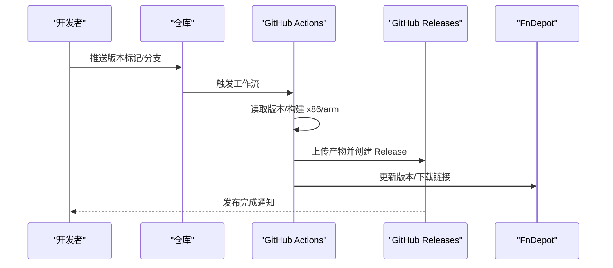
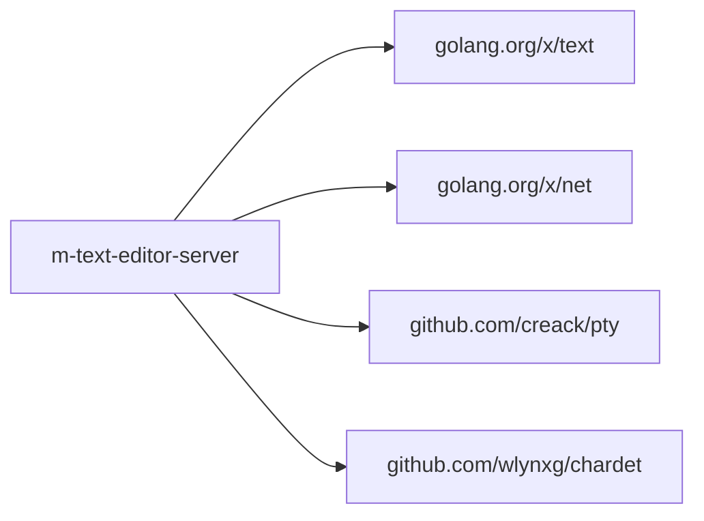

# 贡献指南

<cite>
**本文档引用的文件**
- [README.md](file://README.md)
- [AGENTS.md](file://AGENTS.md)
- [CHANGELOG.md](file://CHANGELOG.md)
- [.github/workflows/build.yml](file://.github/workflows/build.yml)
- [src/README.md](file://src/README.md)
- [src/go.mod](file://src/go.mod)
- [test/README.md](file://test/README.md)
</cite>

## 目录
1. [简介](#简介)
2. [项目结构](#项目结构)
3. [核心组件](#核心组件)
4. [架构总览](#架构总览)
5. [详细组件分析](#详细组件分析)
6. [依赖分析](#依赖分析)
7. [性能考虑](#性能考虑)
8. [故障排查指南](#故障排查指南)
9. [结论](#结论)
10. [附录](#附录)

## 简介
本指南面向希望参与 PodNote（飞牛OS文本编辑器）项目的贡献者，覆盖从 Fork 到 PR 提交流程、代码规范与最佳实践、分支与版本发布策略、Issue 报告与 Bug 反馈模板、文档贡献方式、社区行为与沟通规范，以及新贡献者的入门路径与资源链接。项目采用多模块协作：Go 后端服务、飞牛OS打包资源、浏览器扩展与本地测试仿真。

## 项目结构
- 顶层说明与使用指引：[README.md](file://README.md)
- 项目规范与模块索引：[AGENTS.md](file://AGENTS.md)
- 变更日志维护：[CHANGELOG.md](file://CHANGELOG.md)
- CI/CD 发布工作流：[build.yml](file://.github/workflows/build.yml)
- Go 后端模块说明：[src/README.md](file://src/README.md)
- Go 依赖清单：[src/go.mod](file://src/go.mod)
- 本地测试与仿真：[test/README.md](file://test/README.md)

图表来源
- [README.md](file://README.md)
- [src/README.md](file://src/README.md)
- [src/go.mod](file://src/go.mod)
- [test/README.md](file://test/README.md)
- [.github/workflows/build.yml](file://.github/workflows/build.yml)

章节来源
- [README.md](file://README.md)
- [src/README.md](file://src/README.md)
- [test/README.md](file://test/README.md)

## 核心组件
- Go 后端服务模块：提供 API 服务、文件读写与原子保存、终端 WebSocket 桥接、文件监控等能力，运行于飞牛OS应用容器。
- 飞牛OS打包资源：包含前端网页、配置、后端程序与生命周期脚本，支持 x86 与 ARM 平台打包。
- 浏览器扩展：与 FNOS 文件管理器集成，支持右键编辑与一键新建。
- 本地测试与仿真：通过 Node.js 仿真服务器模拟后端核心接口，便于非飞牛OS环境调试。

章节来源
- [src/README.md](file://src/README.md)
- [README.md](file://README.md)
- [test/README.md](file://test/README.md)

## 架构总览
PodNote 由前端编辑器（Monaco Editor）与后端服务协同组成，后端通过 Unix Socket 或 HTTP API 对接，浏览器扩展负责与 FNOS 文件管理器联动。CI/CD 自动化打包并生成发布物。

图表来源
- [src/README.md](file://src/README.md)
- [README.md](file://README.md)
- [.github/workflows/build.yml](file://.github/workflows/build.yml)

## 详细组件分析

### 贡献流程与 Pull Request 规范
- Fork 仓库并在本地创建功能分支，建议遵循“模块/主题/简要描述”的命名风格。
- 修改完成后提交，遵循“一次日期一条日志”的变更记录原则，参考 [AGENTS.md](file://AGENTS.md) 的日志规范。
- 创建 Pull Request 时，简述改动类型（新增/修改/修复/重构）与受影响模块，确保通过 CI 校验。
- 代码审查通过后，由维护者合并，随后在根目录 [CHANGELOG.md](file://CHANGELOG.md) 中追加本次变更记录。

章节来源
- [AGENTS.md](file://AGENTS.md)
- [CHANGELOG.md](file://CHANGELOG.md)

### 代码规范与最佳实践
- Go 语言编码标准
  - 使用 Go Modules 管理依赖，参考 [src/go.mod](file://src/go.mod)。
  - 保持最小必要依赖，避免引入未使用的第三方包。
  - 遵循 Go 官方风格与命名约定，保持函数与变量简洁清晰。
- 注释规范
  - 注释简洁凝练、直击核心，杜绝无意义与繁琐描述。
  - 公共 API 与复杂逻辑需提供清晰注释，便于他人理解。
- 命名约定
  - 包名、函数名、变量名语义明确，避免缩写与歧义。
  - 结构体字段与常量使用一致的命名风格。
- 代码组织
  - 严格遵守已有架构：Go 后端 + 前端 HTML/JS/CSS + 浏览器扩展。
  - 新增/重命名/删除文件/模块后，同步更新对应目录下的 README 索引。

章节来源
- [AGENTS.md](file://AGENTS.md)
- [src/go.mod](file://src/go.mod)

### 分支管理策略
- 主分支保护：主分支不直接推送，所有改动通过 Pull Request 合并。
- 特性分支：按功能拆分短期分支，完成后清理。
- 版本分支：发布前创建版本分支，修复仅合并到版本分支并回溯到主分支。

（本节为通用策略说明，不直接分析具体文件）

### 版本发布流程
- 版本号来源：从打包清单中读取版本信息，CI 自动构建 x86 与 ARM 平台产物。
- 发布物：FPK 包与浏览器扩展压缩包。
- 发布渠道：GitHub Releases，同时更新 FnDepot。
- 变更日志：自动生成，包含提交摘要与影响范围。

图表来源
- [.github/workflows/build.yml](file://.github/workflows/build.yml)

章节来源
- [.github/workflows/build.yml](file://.github/workflows/build.yml)

### Issue 报告模板与 Bug 反馈指南
- 报告模板建议包含：
  - 环境信息：操作系统、浏览器/扩展版本、飞牛OS 版本
  - 复现步骤：最小可复现步骤与预期/实际结果
  - 日志与截图：关键错误日志、控制台输出、相关截图
  - 影响范围：是否影响文件读写/终端/监控等模块
- Bug 反馈优先级：
  - 导致数据丢失/破坏的高危问题
  - 影响核心功能（文件读写、终端、监控）的严重问题
  - 其他一般问题与优化建议

（本节为通用模板说明，不直接分析具体文件）

### 文档贡献方式与要求
- 文档更新范围：README、模块 README、变更日志等。
- 更新要求：
  - 新增/重命名/删除模块后，同步更新对应目录 README 的索引。
  - 变更日志按“一次日期一条日志”原则，格式参考 [AGENTS.md](file://AGENTS.md) 的模板。
- 文档一致性：确保路径引用与实际文件结构一致，避免过期链接。

章节来源
- [AGENTS.md](file://AGENTS.md)
- [CHANGELOG.md](file://CHANGELOG.md)

### 社区行为准则与沟通规范
- 行为准则
  - 尊重与包容：尊重不同观点与背景，避免人身攻击。
  - 建设性反馈：提出问题时附带可行的改进建议。
  - 保守秘密：不泄露敏感信息与用户隐私。
- 沟通规范
  - 使用清晰、简洁的语言，必要时附带截图或日志。
  - 遵循 Issue/PR 模板，提高沟通效率。
  - 避免在讨论中引入无关话题。

（本节为通用准则说明，不直接分析具体文件）

### 新贡献者入门指导与资源链接
- 快速开始
  - 阅读顶层 [README.md](file://README.md)，了解项目目标与模块概览。
  - 查看模块说明：后端 [src/README.md](file://src/README.md)、测试 [test/README.md](file://test/README.md)。
- 本地调试
  - 在 test 目录启动 Node.js 仿真服务器，预览前端与后端接口。
- 提交流程
  - Fork 仓库 → 创建功能分支 → 编写代码与注释 → 提交并更新 CHANGELOG → 发起 PR → 代码审查 → 合并。

章节来源
- [README.md](file://README.md)
- [src/README.md](file://src/README.md)
- [test/README.md](file://test/README.md)

## 依赖分析
- Go 依赖管理：使用 go.mod 管理第三方库，确保版本稳定与可复现。
- 第三方库示例：文本编码探测、网络与 PTY 控制等，详见 [src/go.mod](file://src/go.mod)。
- 依赖更新策略：遵循最小化原则，避免不必要的升级；升级后在 CI 中验证构建与功能。

图表来源
- [src/go.mod](file://src/go.mod)

章节来源
- [src/go.mod](file://src/go.mod)

## 性能考虑
- 后端接口
  - 文件读取限制与二进制拦截，避免大文件与二进制文件造成内存压力。
  - 原子保存采用临时文件与重命名，减少写入失败风险。
- 前端交互
  - 终端重绘与滚动条优化，降低移动端渲染开销。
  - 事件监听与资源释放，避免内存泄漏与重复绑定。

（本节为通用性能建议，不直接分析具体文件）

## 故障排查指南
- 本地测试
  - 使用 test 目录的 Node.js 仿真服务器验证接口行为与前端交互。
- 构建与发布
  - 关注 CI 工作流中的版本读取、平台打包与发布物上传。
- 日志与记录
  - 变更日志按“一次日期一条日志”原则维护，便于回溯问题。

章节来源
- [test/README.md](file://test/README.md)
- [.github/workflows/build.yml](file://.github/workflows/build.yml)
- [CHANGELOG.md](file://CHANGELOG.md)

## 结论
本贡献指南提供了从流程、规范到发布与排障的完整路径。请在贡献过程中遵循代码与文档规范，保持简洁注释与清晰日志，共同维护高质量的 PodNote 生态。

## 附录
- 相关文件索引
  - 顶层说明与使用：[README.md](file://README.md)
  - 项目规范与模块索引：[AGENTS.md](file://AGENTS.md)
  - 变更日志：[CHANGELOG.md](file://CHANGELOG.md)
  - CI/CD 发布：[build.yml](file://.github/workflows/build.yml)
  - 后端模块说明：[src/README.md](file://src/README.md)
  - Go 依赖：[src/go.mod](file://src/go.mod)
  - 本地测试：[test/README.md](file://test/README.md)