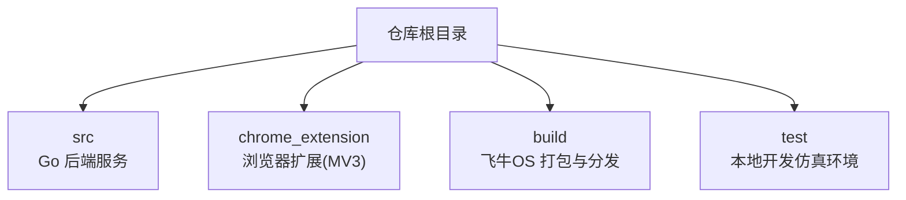
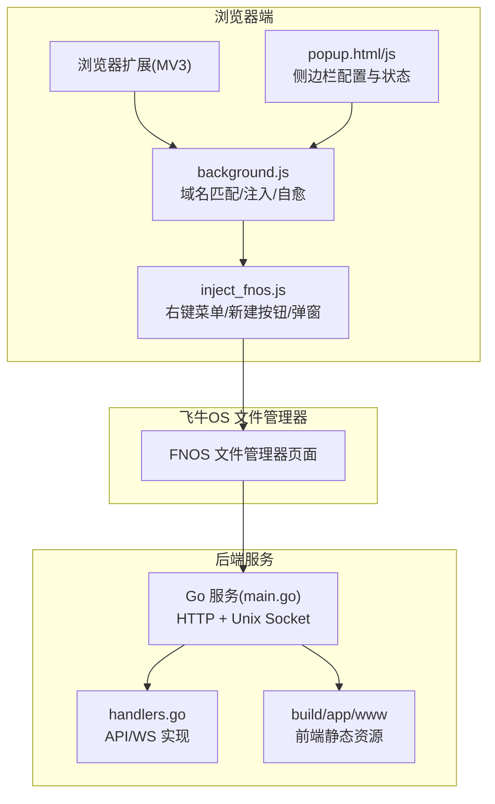
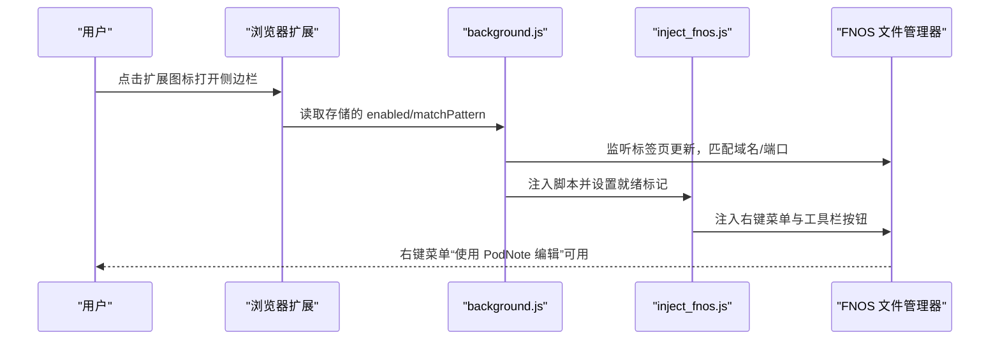
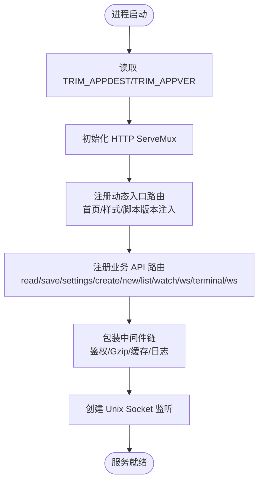
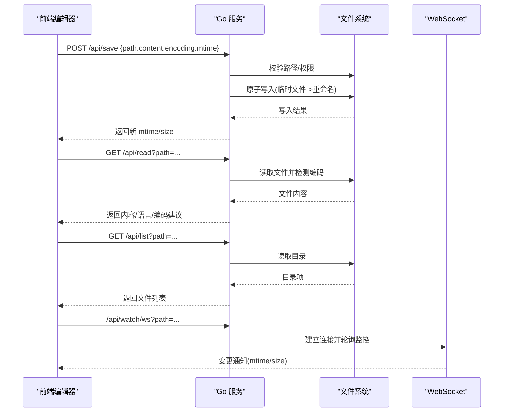
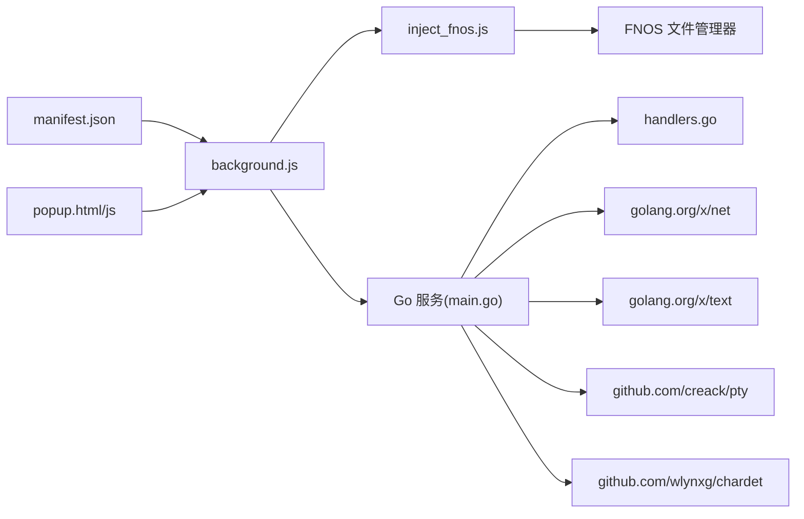

# 快速开始

<cite>
**本文引用的文件**
- [README.md](file://README.md)
- [go.mod](file://src/go.mod)
- [main.go](file://src/main.go)
- [handlers.go](file://src/handlers.go)
- [manifest.json](file://chrome_extension/manifest.json)
- [background.js](file://chrome_extension/background.js)
- [inject_fnos.js](file://chrome_extension/inject_fnos.js)
- [popup.html](file://chrome_extension/popup.html)
- [popup.js](file://chrome_extension/popup.js)
- [README.md](file://chrome_extension/README.md)
- [README.md](file://build/README.md)
- [README.md](file://test/README.md)
- [mock_server.js](file://test/scratch/mock_server.js)
- [build.yml](file://.github/workflows/build.yml)
</cite>

## 目录
1. [简介](#简介)
2. [项目结构](#项目结构)
3. [核心组件](#核心组件)
4. [架构总览](#架构总览)
5. [详细组件分析](#详细组件分析)
6. [依赖关系分析](#依赖关系分析)
7. [性能考虑](#性能考虑)
8. [故障排查指南](#故障排查指南)
9. [结论](#结论)
10. [附录](#附录)

## 简介
本指南面向首次使用 PodNote 的用户，帮助你在约 15 分钟内完成安装与基础使用。PodNote 是一款适配飞牛OS（FNOS）的轻量极速文本编辑器，核心特性包括：
- 类 VS Code 的工作区布局，支持多标签页、全局正则查找与替换、只读监听追踪
- 集成交互式终端（基于 WebSocket 与 xterm.js）
- 深度适配 FNOS：支持在 FNOS 文件管理器中右键编辑、工具栏一键新建文件
- 丰富的语言与语法支持，内置 JSON/HTML/CSS 语法校验

你将从浏览器扩展安装开始，配置 FNOS 访问地址，然后体验右键菜单编辑与工具栏新建文件的完整流程。

## 项目结构
PodNote 仓库包含四个主要部分：
- src：Go 后端服务源码，提供 HTTP 与 WebSocket 接口，以及 Unix Socket 监听
- chrome_extension：配套浏览器扩展（MV3），用于与 FNOS 文件管理器集成
- build：飞牛OS 打包与分发资源，包含前端静态资源、服务端可执行文件与生命周期脚本
- test：本地开发仿真调试环境，提供 Node.js mock 服务器与前端界面预览

**图表来源**
- [README.md:12-17](file://README.md#L12-L17)
- [README.md:1-30](file://build/README.md#L1-L30)

**章节来源**
- [README.md:12-17](file://README.md#L12-L17)
- [README.md:1-30](file://build/README.md#L1-L30)

## 核心组件
- 浏览器扩展（MV3）
  - manifest.json：声明扩展名称、版本、权限、侧边栏、图标等
  - background.js：后台服务脚本，负责域名匹配、注入标记、存活自愈轮询
  - inject_fnos.js：页面注入脚本，实现右键菜单注入、工具栏“新建文件”按钮、弹窗管理与幽灵模式
  - popup.html/popup.js：侧边栏面板，展示状态、日志与生效域名/端口列表配置
- 后端服务（Go）
  - main.go：启动 HTTP 服务、Unix Socket、路由注册与中间件链
  - handlers.go：实现文件读取、保存、新建、目录列表、文件监视与终端 WebSocket
- 构建与打包
  - build/README.md：说明 app/www 前端资源、server 可执行文件、UI 关联配置与生命周期脚本
- 本地开发仿真
  - test/README.md：说明 mock_server.js 仿真后端 API 与 WebSocket，便于本地调试

**章节来源**
- [manifest.json:1-28](file://chrome_extension/manifest.json#L1-L28)
- [background.js:1-169](file://chrome_extension/background.js#L1-L169)
- [inject_fnos.js:1-898](file://chrome_extension/inject_fnos.js#L1-L898)
- [popup.html:1-173](file://chrome_extension/popup.html#L1-L173)
- [popup.js:1-200](file://chrome_extension/popup.js#L1-L200)
- [main.go:1-145](file://src/main.go#L1-L145)
- [handlers.go:1-614](file://src/handlers.go#L1-L614)
- [README.md:1-30](file://build/README.md#L1-L30)
- [README.md:1-41](file://test/README.md#L1-L41)

## 架构总览
PodNote 的整体架构由浏览器扩展与后端服务组成。浏览器扩展在 FNOS 文件管理器页面注入脚本，实现右键菜单与工具栏按钮的增强；后端服务通过 Unix Socket 对外提供 HTTP 与 WebSocket 接口，承载文件读写、目录浏览、文件监视与终端能力。

**图表来源**
- [manifest.json:1-28](file://chrome_extension/manifest.json#L1-L28)
- [background.js:1-169](file://chrome_extension/background.js#L1-L169)
- [inject_fnos.js:1-898](file://chrome_extension/inject_fnos.js#L1-L898)
- [popup.html:1-173](file://chrome_extension/popup.html#L1-L173)
- [popup.js:1-200](file://chrome_extension/popup.js#L1-L200)
- [main.go:1-145](file://src/main.go#L1-L145)
- [handlers.go:1-614](file://src/handlers.go#L1-L614)
- [README.md:1-30](file://build/README.md#L1-L30)

## 详细组件分析

### 浏览器扩展（MV3）安装与配置
- 在线安装
  - 访问 Microsoft Edge Add-ons 官方商店，搜索并安装 PodNote 拓展
- 本地安装
  - 打开 chrome://extensions/
  - 开启“开发者模式”
  - 点击“加载已解压的扩展程序”，选择项目内 chrome_extension 文件夹
- 配置 FNOS 访问地址
  - 点击浏览器工具栏中的 PodNote 图标，打开侧边栏
  - 在“生效域名/端口列表”中填写你的 FNOS 地址（例如 IP 或域名），保存后生效
  - 页面加载时，扩展会根据该列表判断是否注入脚本

**图表来源**
- [README.md:19-32](file://README.md#L19-L32)
- [manifest.json:1-28](file://chrome_extension/manifest.json#L1-L28)
- [background.js:1-169](file://chrome_extension/background.js#L1-L169)
- [inject_fnos.js:1-898](file://chrome_extension/inject_fnos.js#L1-L898)
- [popup.html:1-173](file://chrome_extension/popup.html#L1-L173)
- [popup.js:1-200](file://chrome_extension/popup.js#L1-L200)

**章节来源**
- [README.md:19-32](file://README.md#L19-L32)
- [manifest.json:1-28](file://chrome_extension/manifest.json#L1-L28)
- [background.js:1-169](file://chrome_extension/background.js#L1-L169)
- [inject_fnos.js:1-898](file://chrome_extension/inject_fnos.js#L1-L898)
- [popup.html:1-173](file://chrome_extension/popup.html#L1-L173)
- [popup.js:1-200](file://chrome_extension/popup.js#L1-L200)

### 后端服务（Go）启动与路由
- 环境变量
  - TRIM_APPDEST：应用容器的工作目录，用于定位 www 静态资源与 Unix Socket
  - TRIM_APPVER：版本号，用于静态资源缓存控制
- 启动流程
  - 读取环境变量并打印启动日志
  - 注册动态入口服务（处理首页、样式与脚本的版本号注入）
  - 注册业务 API 路由（读取、保存、设置、新建、列表、文件监视、终端）
  - 包装中间件链（管理员鉴权、Gzip 压缩、缓存控制、日志审计）
  - 创建并监听 Unix Socket，提供 HTTP 服务

**图表来源**
- [main.go:1-145](file://src/main.go#L1-L145)

**章节来源**
- [main.go:1-145](file://src/main.go#L1-L145)

### API 与 WebSocket 处理流程
- 文件读取（/api/read）
  - 校验路径合法性与访问权限
  - 限制最大文件大小（10MB）
  - 检测编码并进行转码
  - 返回内容、修改时间、大小、权限与语言类型
- 文件保存（/api/save）
  - 支持 POST 请求
  - 基于 mtime 的乐观锁冲突检测
  - 原子写入（临时文件 + 重命名）
- 新建文件（/api/new）
  - 校验父目录存在性与目标路径唯一性
  - 创建空文件并同步权限
- 目录列表（/api/list）
  - 读取目录项并排序（文件夹优先）
- 文件监视（/api/watch/ws）
  - 基于 WebSocket 推送文件变更（mtime/size）
- 终端（/api/terminal/ws）
  - 建立 WebSocket，支持尺寸调整与命令回显

**图表来源**
- [handlers.go:114-614](file://src/handlers.go#L114-L614)

**章节来源**
- [handlers.go:1-614](file://src/handlers.go#L1-L614)

### 本地开发与仿真
- 本地仿真服务器
  - Node.js 服务启动于 3000 端口，映射 /api/list、/api/read、/api/save、/api/new、/api/create、/api/settings
  - WebSocket 仿真：/api/terminal/ws（终端）、/api/watch/ws（文件监视）
  - 通过 test/scratch/mock_server.js 提供真实物理文件读写与并发乐观锁校验
- 本地调试步骤
  - 在 test/ 目录安装依赖并启动仿真服务器
  - 打开浏览器访问 http://localhost:3000 预览与调试前端

**章节来源**
- [README.md:1-41](file://test/README.md#L1-L41)
- [mock_server.js:1-437](file://test/scratch/mock_server.js#L1-L437)

## 依赖关系分析
- 浏览器扩展依赖
  - Manifest V3：声明权限（scripting、storage、tabs、sidePanel）、侧边栏、图标
  - 后台脚本：域名匹配、注入标记、存活自愈轮询
  - 注入脚本：右键菜单注入、工具栏按钮、弹窗管理
  - 侧边栏：配置生效域名/端口列表，查看注入状态与日志
- 后端服务依赖
  - golang.org/x/net：WebSocket 支持
  - golang.org/x/text：字符编码检测与转码
  - github.com/creack/pty：终端 PTY 桥接
  - github.com/wlynxg/chardet：二进制内容检测

**图表来源**
- [manifest.json:1-28](file://chrome_extension/manifest.json#L1-L28)
- [background.js:1-169](file://chrome_extension/background.js#L1-L169)
- [inject_fnos.js:1-898](file://chrome_extension/inject_fnos.js#L1-L898)
- [popup.html:1-173](file://chrome_extension/popup.html#L1-L173)
- [popup.js:1-200](file://chrome_extension/popup.js#L1-L200)
- [main.go:1-145](file://src/main.go#L1-L145)
- [handlers.go:1-614](file://src/handlers.go#L1-L614)
- [go.mod:1-12](file://src/go.mod#L1-L12)

**章节来源**
- [manifest.json:1-28](file://chrome_extension/manifest.json#L1-L28)
- [go.mod:1-12](file://src/go.mod#L1-L12)
- [main.go:1-145](file://src/main.go#L1-L145)
- [handlers.go:1-614](file://src/handlers.go#L1-L614)

## 性能考虑
- 文件大小限制：后端对单文件读取设置 10MB 上限，避免影响编辑器性能
- 原子写入：保存采用临时文件 + 重命名策略，减少数据损坏风险
- 缓存控制：动态入口服务为静态资源注入版本号，配合浏览器缓存提升加载速度
- WebSocket 监控：文件监视基于 mtime/size 变化推送，避免频繁轮询

**章节来源**
- [handlers.go:146-151](file://src/handlers.go#L146-L151)
- [handlers.go:270-314](file://src/handlers.go#L270-L314)
- [main.go:53-77](file://src/main.go#L53-L77)

## 故障排查指南
- 扩展未注入或功能不可用
  - 检查侧边栏“运行中/已禁用”状态与“注入状态/右键菜单/新建按钮”的显示
  - 确认“生效域名/端口列表”中包含当前页面的主机名或端口
  - 若页面状态丢失，扩展会在 30 秒后自动重注
- 无法连接 FNOS
  - 在侧边栏确认已填写正确的访问地址（IP 或域名）
  - 检查网络连通性与防火墙设置
- 右键菜单未出现“使用 PodNote 编辑”
  - 确认当前页面为 FNOS 文件管理器，且不在根目录
  - 确认扩展处于启用状态
- 保存失败或提示被外部修改
  - 检查 mtime 乐观锁冲突，刷新页面后重试
  - 确认目标文件未被其他进程占用
- 本地开发仿真
  - 确认已启动 test/scratch/mock_server.js 并监听 3000 端口
  - 检查工作区目录 test/scratch/files 是否存在

**章节来源**
- [popup.js:1-200](file://chrome_extension/popup.js#L1-L200)
- [background.js:1-169](file://chrome_extension/background.js#L1-L169)
- [handlers.go:253-263](file://src/handlers.go#L253-L263)
- [README.md:1-41](file://test/README.md#L1-L41)

## 结论
通过本快速开始指南，你已完成浏览器扩展安装、FNOS 访问地址配置，并掌握了右键菜单编辑与工具栏新建文件的基本使用流程。若遇到问题，可参考故障排查章节或使用本地仿真环境进行调试。建议在飞牛OS环境中部署后端服务，以获得完整的编辑器体验。

## 附录

### 环境要求与安装清单
- Go 语言版本
  - 项目使用 Go 1.26.2
- 浏览器版本要求
  - 使用支持 Manifest V3 的现代浏览器（推荐 Chrome/Edge）
- 安装清单（15 分钟内完成）
  - 步骤 1：安装浏览器扩展（在线或本地加载已解压）
  - 步骤 2：打开侧边栏，填写 FNOS 访问地址（IP 或域名）
  - 步骤 3：在 FNOS 文件管理器中右键点击文件，选择“使用 PodNote 编辑”
  - 步骤 4：在工具栏点击“新建文件”，输入文件名并确认
  - 步骤 5：在编辑器中进行编辑与保存，观察文件监视与终端功能

**章节来源**
- [go.mod:1-12](file://src/go.mod#L1-L12)
- [README.md:19-32](file://README.md#L19-L32)
- [inject_fnos.js:179-194](file://chrome_extension/inject_fnos.js#L179-L194)
- [inject_fnos.js:745-800](file://chrome_extension/inject_fnos.js#L745-L800)