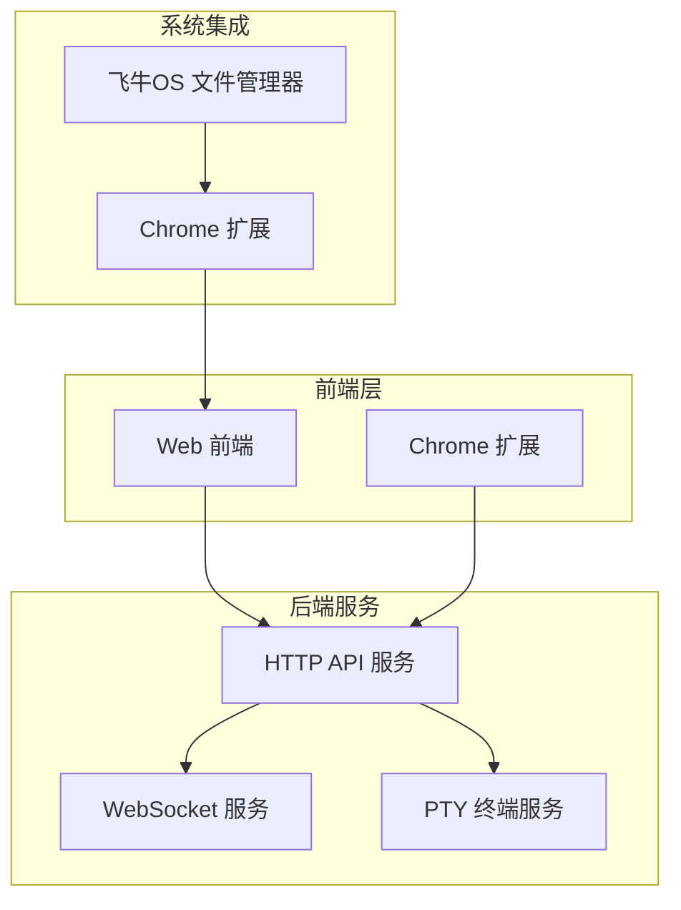

# 故障排除

<cite>
**本文档引用的文件**
- [README.md](file://README.md)
- [main.go](file://src/main.go)
- [handlers.go](file://src/handlers.go)
- [models.go](file://src/models.go)
- [middleware.go](file://src/middleware.go)
- [utils.go](file://src/utils.go)
- [manifest.json](file://chrome_extension/manifest.json)
- [background.js](file://chrome_extension/background.js)
- [popup.js](file://chrome_extension/popup.js)
- [inject_fnos.js](file://chrome_extension/inject_fnos.js)
- [mock_server.js](file://test/scratch/mock_server.js)
- [test_README.md](file://test/README.md)
</cite>

## 目录
1. [简介](#简介)
2. [项目结构](#项目结构)
3. [常见问题分类](#常见问题分类)
4. [安装问题排查](#安装问题排查)
5. [配置错误诊断](#配置错误诊断)
6. [连接失败分析](#连接失败分析)
7. [性能问题诊断](#性能问题诊断)
8. [日志分析指南](#日志分析指南)
9. [网络诊断方法](#网络诊断方法)
10. [测试工具使用](#测试工具使用)
11. [错误代码详解](#错误代码详解)
12. [社区支持与问题报告](#社区支持与问题报告)
13. [最佳实践建议](#最佳实践建议)

## 简介

PodNote 是一款基于飞牛OS（FNOS）适配的轻量极速文本编辑器，集成了 Monaco Editor 内核和交互式终端功能。本文档提供了系统化的故障排除指南，帮助开发者快速定位和解决在安装、配置、连接和性能方面遇到的各种问题。

## 项目结构

PodNote 采用模块化架构设计，主要包含以下组件：



**图表来源**
- [main.go:15-145](file://src/main.go#L15-L145)
- [handlers.go:112-120](file://src/handlers.go#L112-L120)

**章节来源**
- [README.md:12-17](file://README.md#L12-L17)
- [main.go:15-145](file://src/main.go#L15-L145)

## 常见问题分类

### 1. 安装相关问题
- 环境变量缺失导致的服务启动失败
- Unix Socket 权限问题
- 静态资源加载失败
- Chrome 扩展安装和启用问题

### 2. 配置相关问题
- TRIM 环境变量配置错误
- 路径安全校验失败
- 编码检测和转换问题
- 缓存策略配置不当

### 3. 连接相关问题
- WebSocket 连接建立失败
- PTY 终端会话异常
- 文件监控服务中断
- 跨域资源共享问题

### 4. 性能相关问题
- 文件读取超时
- 大文件处理失败
- 编码转换性能问题
- 缓存命中率低

## 安装问题排查

### 环境变量检查

**问题症状**：服务启动时报错，提示缺少必要的环境变量

**排查步骤**：
1. 验证 TRIM_APPDEST 环境变量是否设置
2. 检查 TRIM_APPVER 环境变量是否正确
3. 确认应用容器内的环境变量完整性

**解决方案**：
```bash
# 检查环境变量
echo $TRIM_APPDEST
echo $TRIM_APPVER

# 设置环境变量（示例）
export TRIM_APPDEST=/opt/fnos/apps/m-text-editor
export TRIM_APPVER=1.0.0
```

**章节来源**
- [main.go:16-24](file://src/main.go#L16-L24)

### Unix Socket 权限问题

**问题症状**：服务启动后无法接受请求，Unix Socket 权限不足

**排查步骤**：
1. 检查 socket 文件是否存在
2. 验证 socket 文件权限
3. 确认 socket 路径的可写性

**解决方案**：
```bash
# 检查 socket 权限
ls -la /opt/fnos/apps/m-text-editor/m-text-editor.sock

# 修改权限
chmod 666 /opt/fnos/apps/m-text-editor/m-text-editor.sock

# 清理残留 socket 文件
rm -f /opt/fnos/apps/m-text-editor/m-text-editor.sock
```

**章节来源**
- [main.go:131-139](file://src/main.go#L131-L139)

### 静态资源加载失败

**问题症状**：页面显示空白或资源加载错误

**排查步骤**：
1. 验证 www 目录结构
2. 检查静态资源文件完整性
3. 确认版本号注入是否正常

**解决方案**：
```bash
# 验证目录结构
ls -la /opt/fnos/apps/m-text-editor/www/

# 检查关键文件
ls -la /opt/fnos/apps/m-text-editor/www/index.html
ls -la /opt/fnos/apps/m-text-editor/www/style.css
```

**章节来源**
- [main.go:26-28](file://src/main.go#L26-L28)
- [main.go:44-59](file://src/main.go#L44-L59)

## 配置错误诊断

### 路径安全校验

**问题症状**：文件操作被拒绝，提示路径无效

**排查步骤**：
1. 检查路径是否为绝对路径
2. 验证路径是否包含目录逃逸尝试
3. 确认应用资源目录访问限制

**解决方案**：
```go
// 路径清理和验证逻辑
cleaned := filepath.Clean(path)
absPath, err := filepath.Abs(cleaned)
if err != nil {
    return "", err
}

// 应用资源目录保护
appDest := os.Getenv("TRIM_APPDEST")
if appDest != "" {
    absAppDest, err := filepath.Abs(appDest)
    if err == nil {
        if absPath == absAppDest || strings.HasPrefix(absPath, absAppDest+string(filepath.Separator)) {
            return "", os.ErrPermission
        }
    }
}
```

**章节来源**
- [utils.go:25-53](file://src/utils.go#L25-L53)

### 编码检测和转换

**问题症状**：文件内容显示乱码或编码错误

**排查步骤**：
1. 检查文件头部编码标识
2. 验证 chardet 检测结果
3. 确认编码转换器配置

**解决方案**：
```go
// 编码预测逻辑
func predictEncoding(raw []byte) string {
    if len(raw) == 0 {
        return "utf-8"
    }

    if utf8.Valid(raw) {
        return "utf-8"
    }

    results := chardet.DetectAll(raw)
    targetMap := map[string]string{
        "UTF-8":    "utf-8",
        "GB2312":   "gb18030",
        "GB18030":  "gb18030",
        "UTF-16LE": "utf-16le",
        "UTF-16BE": "utf-16be",
        "BIG5":     "big5",
    }
    
    // 选择最高置信度的编码
    var bestID string
    maxConfidence := -1.0
    for _, res := range results {
        charset := strings.ToUpper(res.Charset)
        if id, ok := targetMap[charset]; ok {
            if res.Confidence > maxConfidence {
                maxConfidence = res.Confidence
                bestID = id
            }
        }
    }
    
    if bestID != "" && maxConfidence > 0.5 {
        return bestID
    }
    
    return "utf-8"
}
```

**章节来源**
- [utils.go:108-147](file://src/utils.go#L108-L147)

### 缓存策略配置

**问题症状**：静态资源更新不生效或缓存过期问题

**排查步骤**：
1. 检查缓存头设置
2. 验证版本号查询参数
3. 确认缓存控制策略

**解决方案**：
```go
// 缓存中间件逻辑
func cacheMiddleware(next http.Handler) http.Handler {
    return http.HandlerFunc(func(w http.ResponseWriter, r *http.Request) {
        path := r.URL.Path
        if strings.Contains(path, "/vs/") {
            // Monaco 核心资源强缓存一年
            w.Header().Set("Cache-Control", "public, max-age=31536000, immutable")
        } else if strings.HasSuffix(path, ".css") || strings.HasSuffix(path, ".js") {
            if r.URL.Query().Get("v") != "" {
                // 带版本号的资源强缓存 30 天
                w.Header().Set("Cache-Control", "public, max-age=2592000, immutable")
            } else {
                // 普通业务资源缓存 1 天
                w.Header().Set("Cache-Control", "public, max-age=86400")
            }
        }
        next.ServeHTTP(w, r)
    })
}
```

**章节来源**
- [middleware.go:75-92](file://src/middleware.go#L75-L92)

## 连接失败分析

### WebSocket 连接问题

**问题症状**：文件监控或终端连接失败

**排查步骤**：
1. 检查 WebSocket 升级请求
2. 验证路径参数有效性
3. 确认文件存在性和可访问性

**解决方案**：
```go
// WebSocket 连接处理逻辑
func handleWatchWS(ws *websocket.Conn) {
    defer ws.Close()

    pathParam := ws.Request().URL.Query().Get("path")
    path, err := cleanAndValidatePath(pathParam)
    if err != nil {
        websocket.JSON.Send(ws, map[string]string{"error": "无效的路径"})
        return
    }

    info, err := os.Stat(path)
    if err != nil {
        websocket.JSON.Send(ws, map[string]string{"error": "监听的文件不存在"})
        return
    }

    // 启动监控循环
    ticker := time.NewTicker(1 * time.Second)
    defer ticker.Stop()

    for {
        select {
        case <-done:
            return
        case <-ticker.C:
            // 检查文件变更
            currentInfo, errStat := os.Stat(path)
            if errStat != nil {
                websocket.JSON.Send(ws, map[string]string{"error": "文件已被外部删除"})
                return
            }
            
            // 发送变更通知
            websocket.JSON.Send(ws, map[string]interface{}{
                "event": "change",
                "mtime": currentInfo.ModTime().Unix(),
                "size":  currentInfo.Size(),
            })
        }
    }
}
```

**章节来源**
- [handlers.go:426-494](file://src/handlers.go#L426-L494)

### PTY 终端会话异常

**问题症状**：终端无法启动或会话立即断开

**排查步骤**：
1. 检查 bash 可执行文件
2. 验证用户权限和家目录
3. 确认 PTY 分配和窗口大小

**解决方案**：
```go
// PTY 终端启动逻辑
func startPty(ws *websocket.Conn, colsStr, rowsStr, userParam, username string) {
    cols := 80
    rows := 24
    if c, err := strconv.Atoi(colsStr); err == nil && c > 0 {
        cols = c
    }
    if r, err := strconv.Atoi(rowsStr); err == nil && r > 0 {
        rows = r
    }

    cmd := exec.Command("/bin/bash")
    cmd.Env = append(os.Environ(), "TERM=xterm-256color", "LANG=zh_CN.UTF-8", "LC_ALL=zh_CN.UTF-8")

    // 用户切换逻辑
    if userParam == "current" && username != "" {
        u, err := user.Lookup(username)
        if err == nil {
            uidInt, errUid := strconv.Atoi(u.Uid)
            gidInt, errGid := strconv.Atoi(u.Gid)
            if errUid == nil && errGid == nil {
                cmd.SysProcAttr = &syscall.SysProcAttr{
                    Credential: &syscall.Credential{
                        Uid: uint32(uidInt),
                        Gid: uint32(gidInt),
                    },
                }
                cmd.Dir = u.HomeDir
            }
        }
    }

    // PTY 分配和会话管理
    ptyFile, err := pty.StartWithSize(cmd, &pty.Winsize{Cols: uint16(cols), Rows: uint16(rows)})
    if err != nil {
        websocket.Message.Send(ws, "无法启动终端: "+err.Error())
        return
    }
    defer ptyFile.Close()
}
```

**章节来源**
- [utils.go:167-261](file://src/utils.go#L167-L261)

### Chrome 扩展连接问题

**问题症状**：扩展无法注入到文件管理器或功能失效

**排查步骤**：
1. 检查扩展权限配置
2. 验证域名匹配规则
3. 确认注入脚本执行状态

**解决方案**：
```javascript
// 扩展后台脚本逻辑
function isUrlAllowed(url, callback) {
    if (!url) {
        callback(false);
        return;
    }
    chrome.storage.local.get(['enabled', 'matchPattern'], (data) => {
        const enabled = data.enabled !== false;
        const pattern = data.matchPattern || 'fnos.net //默认生效的域名\n:5666,:5777 //默认生效的端口';
        
        if (!enabled) {
            callback(false);
            return;
        }
        if (!pattern) {
            callback(true);
            return;
        }
        
        // 域名匹配逻辑
        const urlObj = new URL(url);
        const host = urlObj.host;
        const lines = pattern.split('\n');
        const keywords = [];
        
        lines.forEach(line => {
            const noComment = line.split('#')[0].split('//')[0].trim();
            if (!noComment) return;
            const items = noComment.split(',').map(i => i.trim()).filter(Boolean);
            keywords.push(...items);
        });
        
        callback(keywords.some(k => host.includes(k)));
    });
}
```

**章节来源**
- [background.js:4-37](file://chrome_extension/background.js#L4-L37)

## 性能问题诊断

### 文件读取性能优化

**问题症状**：大文件读取缓慢或内存占用过高

**诊断步骤**：
1. 检查文件大小限制
2. 验证内存使用情况
3. 分析读取缓冲区效率

**优化建议**：
```go
// 文件读取优化逻辑
const maxFileSize = 10 * 1024 * 1024  // 10MB 限制
if info.Size() > maxFileSize {
    w.Header().Set("Content-Type", "application/json")
    json.NewEncoder(w).Encode(Response{Error: "文件超过 10MB，为保护编辑器性能，后端拒绝加载。"})
    return
}

// 二进制内容检测
buf := make([]byte, 1024)
n, _ := f.Read(buf)
f.Seek(0, 0)

detectedEnc := predictEncoding(buf[:n])
isUTF16 := strings.HasPrefix(detectedEnc, "utf-16")

if n > 0 && !isUTF16 {
    for i := 0; i < n; i++ {
        if buf[i] == 0 {
            w.Header().Set("Content-Type", "application/json")
            json.NewEncoder(w).Encode(Response{Error: "检测到二进制内容。为防止文件损坏，编辑器拒绝加载。"})
            return
        }
    }
}
```

**章节来源**
- [handlers.go:146-176](file://src/handlers.go#L146-L176)

### 编码转换性能优化

**问题症状**：大量文件编码转换耗时过长

**优化策略**：
1. 实施编码检测缓存机制
2. 优化字符集转换算法
3. 减少不必要的转换操作

**章节来源**
- [utils.go:108-147](file://src/utils.go#L108-L147)

### 缓存策略优化

**问题症状**：静态资源重复加载影响性能

**优化方案**：
```go
// Gzip 压缩池优化
var gzipPool = sync.Pool{
    New: func() interface{} {
        w, _ := gzip.NewWriterLevel(io.Discard, gzip.BestSpeed)
        return w
    },
}

// 智能缓存控制
func cacheMiddleware(next http.Handler) http.Handler {
    return http.HandlerFunc(func(w http.ResponseWriter, r *http.Request) {
        path := r.URL.Path
        if strings.Contains(path, "/vs/") {
            w.Header().Set("Cache-Control", "public, max-age=31536000, immutable")
        } else if strings.HasSuffix(path, ".css") || strings.HasSuffix(path, ".js") {
            if r.URL.Query().Get("v") != "" {
                w.Header().Set("Cache-Control", "public, max-age=2592000, immutable")
            } else {
                w.Header().Set("Cache-Control", "public, max-age=86400")
            }
        }
        next.ServeHTTP(w, r)
    })
}
```

**章节来源**
- [middleware.go:14-92](file://src/middleware.go#L14-L92)

## 日志分析指南

### 服务端日志分析

**关键日志类型**：
1. **HTTP 请求日志**：记录所有 HTTP 请求和响应
2. **WebSocket 连接日志**：跟踪连接建立和断开
3. **文件操作日志**：记录文件读写和监控事件
4. **错误日志**：捕获异常和错误信息

**日志分析方法**：
```go
// 日志记录示例
log.Printf("[HTTP] %s %s", r.Method, r.RequestURI)
log.Printf("[Watch] 开启 WebSocket 文件监控: %s (mtime: %d, size: %d)", path, lastMtime, lastSize)
log.Printf("[Terminal] 新的 WebSocket 终端连接. cols=%s, rows=%s, user=%s, username=%s", colsStr, rowsStr, userParam, username)
log.Printf("[Auth] 拒绝访问 %s: 用户不是管理员", r.URL.Path)
```

**章节来源**
- [main.go:125-128](file://src/main.go#L125-L128)
- [handlers.go:446-447](file://src/handlers.go#L446-L447)
- [handlers.go:514](file://src/handlers.go#L514-L515)
- [middleware.go:30-31](file://src/middleware.go#L30-L31)

### 扩展日志分析

**扩展日志结构**：
```javascript
// 日志格式
{
    t: new Date().toLocaleTimeString(),  // 时间戳
    m: "消息内容",                      // 日志消息
    s: "info"                          // 日志级别
}

// 日志级别
// success: 操作成功
// info: 一般信息  
// error: 错误信息
// sync: 路径同步信息
```

**章节来源**
- [inject_fnos.js:15-45](file://chrome_extension/inject_fnos.js#L15-L45)

## 网络诊断方法

### 端到端连接测试

**诊断流程**：
1. **DNS 解析测试**：验证域名解析是否正常
2. **TCP 连接测试**：检查端口连通性
3. **HTTP 请求测试**：验证 API 接口可用性
4. **WebSocket 升级测试**：确认协议升级成功

**测试命令**：
```bash
# DNS 解析测试
nslookup fnos.net

# TCP 端口测试
telnet fnos.net 80
nc -zv fnos.net 80

# HTTP 请求测试
curl -I http://fnos.net/app/m-text-editor/

# WebSocket 连接测试
websocat ws://fnos.net/app/m-text-editor/api/watch/ws?path=/
```

### 负载均衡和代理诊断

**问题症状**：偶发性连接失败或超时

**诊断步骤**：
1. 检查负载均衡器健康检查
2. 验证反向代理配置
3. 分析连接池状态
4. 监控上游服务响应时间

**章节来源**
- [main.go:130-143](file://src/main.go#L130-L143)

## 测试工具使用

### 本地开发测试

**测试环境搭建**：
```bash
# 进入测试目录
cd test/

# 安装依赖
npm install

# 启动仿真服务器
node scratch/mock_server.js
```

**仿真服务器功能**：
1. **HTTP API 仿真**：完整模拟后端 API 接口
2. **WebSocket 仿真**：模拟文件监控和终端会话
3. **文件系统仿真**：使用真实物理文件进行测试
4. **跨平台兼容性测试**：支持 Windows 和 Linux 环境

**章节来源**
- [test_README.md:32-40](file://test/README.md#L32-L40)
- [mock_server.js:78-294](file://test/scratch/mock_server.js#L78-L294)

### 单元测试和集成测试

**测试策略**：
1. **API 接口测试**：验证所有 HTTP 端点功能
2. **文件操作测试**：测试文件读写和权限管理
3. **WebSocket 测试**：验证实时通信功能
4. **边界条件测试**：处理异常输入和错误场景

**测试工具配置**：
```javascript
// 测试服务器配置
const PORT = 3000;
const WWW_DIR = path.join(__dirname, '../../build/app/www');
const WORKSPACE_DIR = path.join(__dirname, 'files');

// 支持的文件类型检测
const extMap = {
    '.js': 'javascript', '.ts': 'typescript', '.jsx': 'javascript', '.tsx': 'typescript',
    '.html': 'html', '.css': 'css', '.json': 'json', '.md': 'markdown', '.go': 'go', '.py': 'python',
    '.sh': 'shell', '.bash': 'shell', '.txt': 'plaintext'
};
```

**章节来源**
- [mock_server.js:7-49](file://test/scratch/mock_server.js#L7-L49)

### 性能基准测试

**测试指标**：
1. **响应时间**：HTTP 请求平均响应时间
2. **吞吐量**：每秒处理请求数
3. **并发连接数**：同时维持的连接数量
4. **内存使用**：服务运行时内存占用

**测试方法**：
```bash
# 基准测试命令
ab -n 1000 -c 10 http://localhost:3000/app/m-text-editor/api/read?path=/test.txt

# 压力测试
wrk -t12 -c400 -d60s http://localhost:3000/app/m-text-editor/
```

## 错误代码详解

### HTTP 状态码对照表

| 状态码 | 含义 | 可能原因 | 解决方案 |
|--------|------|----------|----------|
| 200 | OK | 请求成功 | 检查响应数据格式 |
| 400 | Bad Request | 请求参数错误 | 验证 API 参数完整性 |
| 403 | Forbidden | 权限不足 | 检查管理员权限 |
| 404 | Not Found | 资源不存在 | 验证路径和文件存在性 |
| 405 | Method Not Allowed | HTTP 方法不支持 | 使用正确的请求方法 |
| 409 | Conflict | 资源冲突 | 检查文件修改时间 |
| 500 | Internal Server Error | 服务器内部错误 | 查看服务端日志 |

### WebSocket 错误类型

**连接错误**：
- `无效的路径`：路径参数格式不正确
- `监听的文件不存在`：目标文件被删除
- `文件已被外部删除`：文件监控对象不存在

**传输错误**：
- `发送变更通知失败`：客户端连接已断开
- `无法启动终端`：PTY 分配失败

### 编码错误处理

**编码检测失败**：
- `utf-8`：默认编码，最常见
- `gb18030`：简体中文编码
- `big5`：繁体中文编码
- `utf-16le/be`：Unicode 编码变种

**章节来源**
- [handlers.go:34-37](file://src/handlers.go#L34-L37)
- [handlers.go:134-136](file://src/handlers.go#L134-L136)
- [handlers.go:433-440](file://src/handlers.go#L433-L440)

## 社区支持与问题报告

### 支持渠道

**官方支持**：
1. **GitHub Issues**：提交技术问题和功能请求
2. **官方论坛**：讨论使用经验和最佳实践
3. **邮件支持**：商业支持和定制需求

**社区资源**：
1. **Stack Overflow**：技术问答和经验分享
2. **技术博客**：深入的技术分析文章
3. **开发者群组**：实时交流和互助

### 问题报告模板

**基本信息**：
- PodNote 版本：[版本号]
- 操作系统：[系统名称和版本]
- 浏览器：[浏览器名称和版本]
- 飞牛OS 版本：[版本号]

**重现步骤**：
1. 步骤一
2. 步骤二  
3. 步骤三

**预期行为**：
[描述期望的结果]

**实际行为**：
[描述实际出现的问题]

**日志信息**：
[粘贴相关的日志片段]

**附加信息**：
[截图、配置文件、其他相关信息]

## 最佳实践建议

### 安全配置建议

**路径安全**：
1. 始终使用绝对路径
2. 实施严格的路径验证
3. 避免目录逃逸攻击

**权限管理**：
1. 最小权限原则
2. 定期审查访问权限
3. 实施审计日志

### 性能优化建议

**资源管理**：
1. 合理设置文件大小限制
2. 实施有效的缓存策略
3. 优化数据库连接池

**监控告警**：
1. 建立性能监控体系
2. 设置合理的告警阈值
3. 定期进行性能评估

### 维护和升级

**版本管理**：
1. 制定升级计划
2. 备份重要数据
3. 测试升级影响

**故障恢复**：
1. 建立备份策略
2. 制定应急预案
3. 定期演练恢复流程