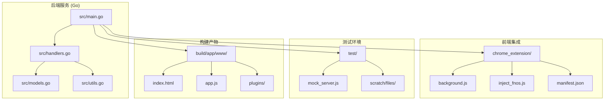
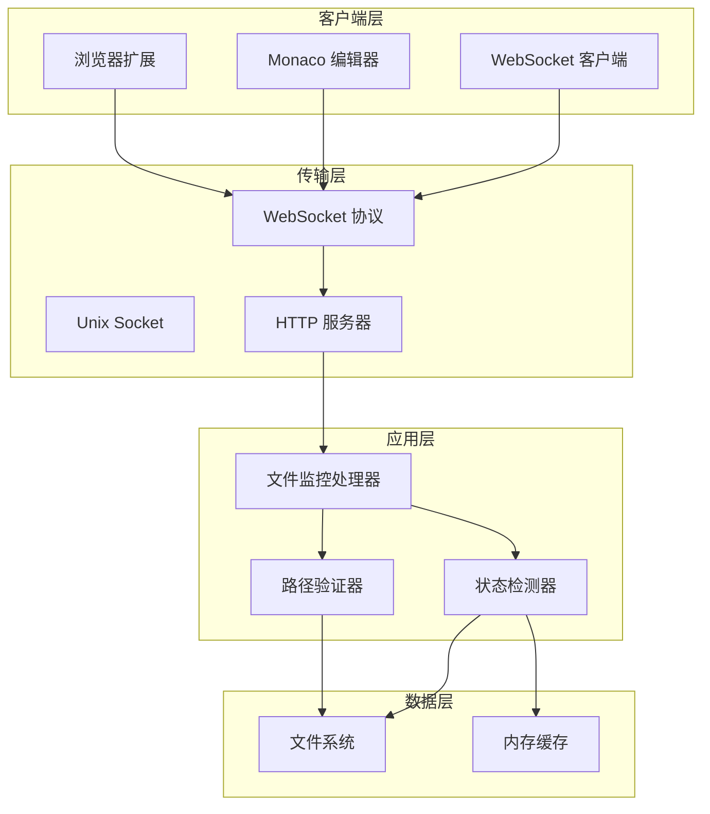
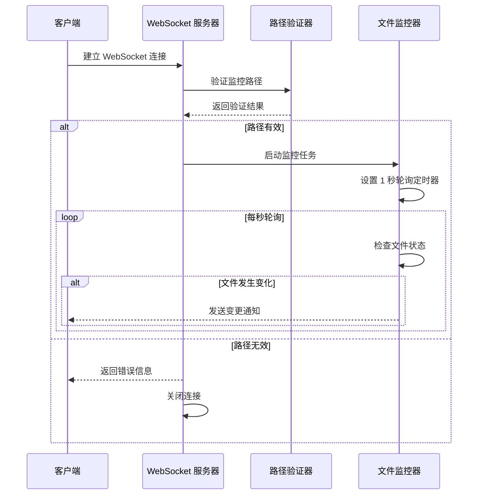
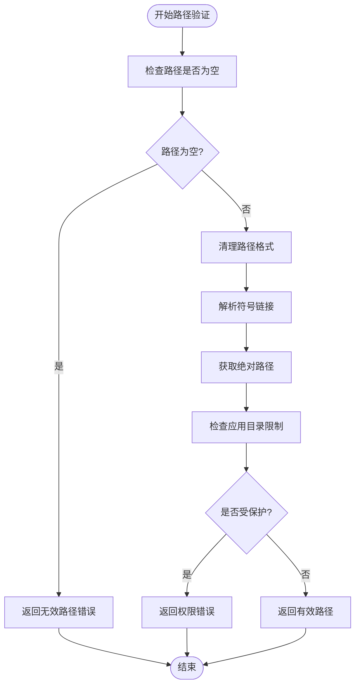
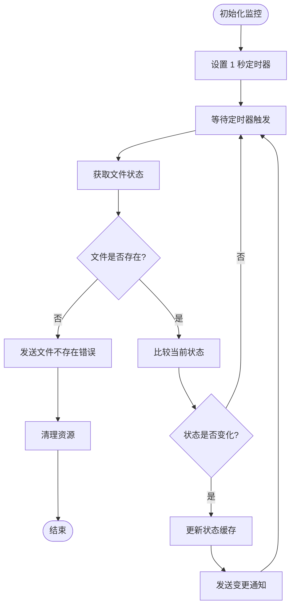
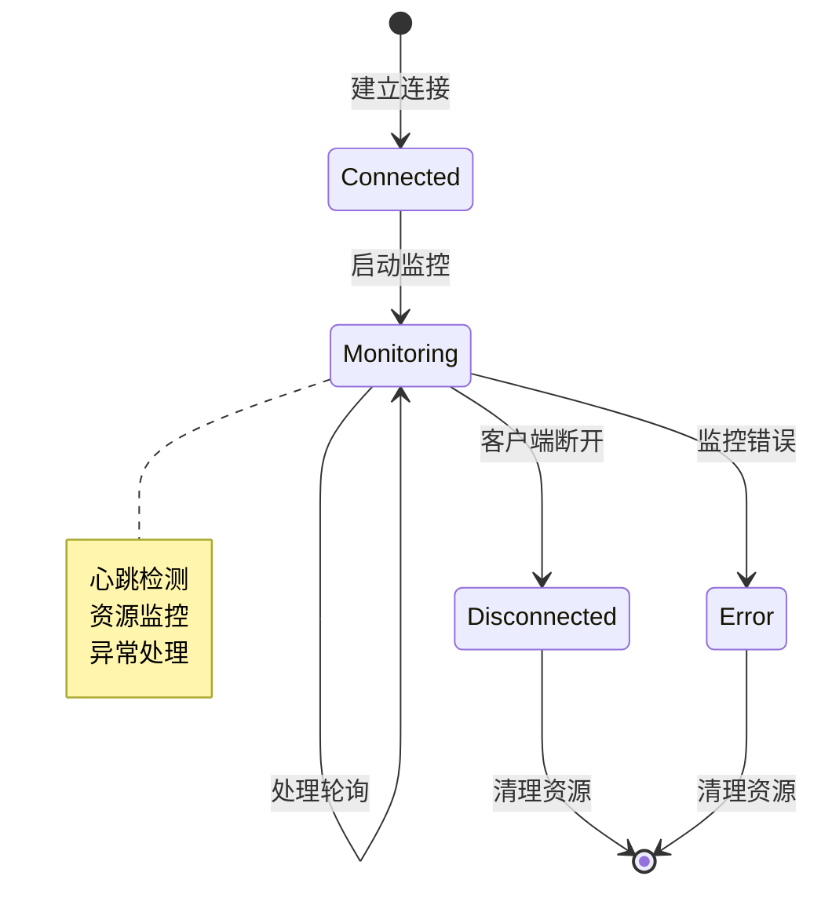
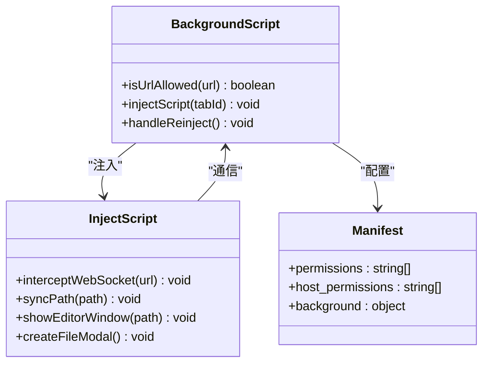
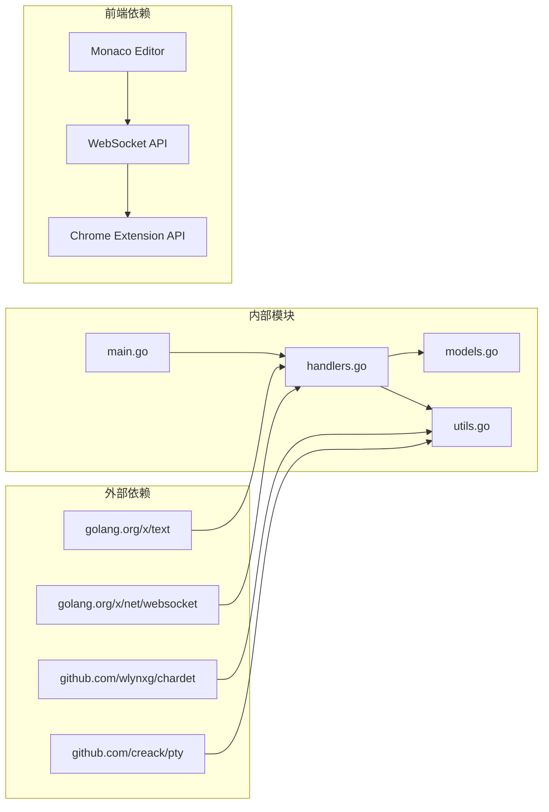

# 实时监控系统

<cite>
**本文档引用的文件**
- [src/main.go](file://src/main.go)
- [src/handlers.go](file://src/handlers.go)
- [src/models.go](file://src/models.go)
- [src/utils.go](file://src/utils.go)
- [chrome_extension/background.js](file://chrome_extension/background.js)
- [chrome_extension/inject_fnos.js](file://chrome_extension/inject_fnos.js)
- [chrome_extension/manifest.json](file://chrome_extension/manifest.json)
- [test/scratch/mock_server.js](file://test/scratch/mock_server.js)
- [build/app/www/index.html](file://build/app/www/index.html)
</cite>

## 目录
1. [简介](#简介)
2. [项目结构](#项目结构)
3. [核心组件](#核心组件)
4. [架构概览](#架构概览)
5. [详细组件分析](#详细组件分析)
6. [依赖关系分析](#依赖关系分析)
7. [性能考虑](#性能考虑)
8. [故障排除指南](#故障排除指南)
9. [结论](#结论)

## 简介

实时监控系统是一个基于 WebSocket 的文件监控解决方案，专为 FNOS 文件管理系统设计。该系统提供了高效的文件变更检测机制，支持毫秒级的文件状态监控，确保用户能够及时获知文件的任何变化。

系统采用 Go 语言构建后端服务，结合浏览器扩展实现前端集成，通过 WebSocket 实现实时双向通信。监控机制基于 1 秒轮询间隔，结合文件修改时间和文件大小双重检测，实现了精准而高效的文件变更通知。

## 项目结构

该项目采用模块化设计，主要分为以下几个核心部分：

**图表来源**
- [src/main.go:1-145](file://src/main.go#L1-L145)
- [chrome_extension/background.js:1-169](file://chrome_extension/background.js#L1-L169)
- [test/scratch/mock_server.js:1-437](file://test/scratch/mock_server.js#L1-L437)

**章节来源**
- [src/main.go:1-145](file://src/main.go#L1-L145)
- [chrome_extension/manifest.json:1-28](file://chrome_extension/manifest.json#L1-L28)

## 核心组件

### WebSocket 文件监控服务

系统的核心是基于 WebSocket 的文件监控服务，它提供了实时的文件变更检测能力。该服务通过 1 秒轮询间隔监控指定文件的状态变化。

### 路径验证机制

为了确保安全性，系统实现了严格的路径验证机制，防止目录遍历攻击和非法文件访问。

### 监控频率控制

系统采用固定 1 秒轮询间隔，平衡了监控精度和系统资源消耗。

### 客户端连接管理

系统提供了完善的客户端连接管理，包括心跳检测、连接断开处理和资源清理。

**章节来源**
- [src/handlers.go:426-494](file://src/handlers.go#L426-L494)
- [src/utils.go:25-53](file://src/utils.go#L25-L53)

## 架构概览

系统采用分层架构设计，实现了清晰的职责分离：

**图表来源**
- [src/main.go:130-144](file://src/main.go#L130-L144)
- [src/handlers.go:426-494](file://src/handlers.go#L426-L494)

## 详细组件分析

### WebSocket 连接建立流程

WebSocket 连接建立过程遵循标准的握手协议，系统通过专用的路由处理文件监控连接：

**图表来源**
- [src/handlers.go:426-494](file://src/handlers.go#L426-L494)
- [src/utils.go:25-53](file://src/utils.go#L25-L53)

### 路径验证机制

系统实现了多层路径验证，确保监控的安全性和有效性：

**图表来源**
- [src/utils.go:25-53](file://src/utils.go#L25-L53)

**章节来源**
- [src/utils.go:25-53](file://src/utils.go#L25-L53)

### 监控循环机制

文件监控采用基于时间轮询的机制，通过定时器实现周期性检查：

**图表来源**
- [src/handlers.go:448-494](file://src/handlers.go#L448-L494)

**章节来源**
- [src/handlers.go:448-494](file://src/handlers.go#L448-L494)

### 客户端连接管理

系统提供了完善的客户端连接生命周期管理：

**图表来源**
- [src/handlers.go:451-461](file://src/handlers.go#L451-L461)

**章节来源**
- [src/handlers.go:451-461](file://src/handlers.go#L451-L461)

### 监控消息格式

监控系统使用标准化的 JSON 消息格式进行通信：

| 字段 | 类型 | 描述 | 必需 |
|------|------|------|------|
| event | string | 事件类型，固定为 "change" | 是 |
| mtime | integer | 文件最后修改时间戳 | 是 |
| size | integer | 文件大小（字节） | 是 |
| error | string | 错误信息 | 否 |

**章节来源**
- [src/handlers.go:482-490](file://src/handlers.go#L482-L490)

### 浏览器扩展集成

系统通过 Chrome 扩展实现与 FNOS 文件管理器的深度集成：

**图表来源**
- [chrome_extension/background.js:1-169](file://chrome_extension/background.js#L1-L169)
- [chrome_extension/inject_fnos.js:1-898](file://chrome_extension/inject_fnos.js#L1-L898)
- [chrome_extension/manifest.json:1-28](file://chrome_extension/manifest.json#L1-L28)

**章节来源**
- [chrome_extension/background.js:1-169](file://chrome_extension/background.js#L1-L169)
- [chrome_extension/inject_fnos.js:1-898](file://chrome_extension/inject_fnos.js#L1-L898)

## 依赖关系分析

系统依赖关系清晰明确，各组件职责分明：

**图表来源**
- [src/main.go:3-12](file://src/main.go#L3-L12)
- [src/utils.go:3-23](file://src/utils.go#L3-L23)

**章节来源**
- [src/main.go:3-12](file://src/main.go#L3-L12)
- [src/utils.go:3-23](file://src/utils.go#L3-L23)

## 性能考虑

### 监控频率优化

系统采用 1 秒轮询间隔，在监控精度和系统资源消耗之间取得平衡：

- **CPU 使用率**: 每秒一次文件状态查询，对 CPU 影响最小
- **内存占用**: 每个监控连接仅维护少量状态变量
- **网络开销**: 变更通知按需发送，避免不必要的网络传输

### 大量文件监控最佳实践

对于大量文件的监控场景，建议采用以下策略：

1. **分批监控**: 将大量文件分组监控，避免单个连接承载过多文件
2. **智能过滤**: 仅监控关键文件或特定类型的文件
3. **连接池管理**: 合理管理 WebSocket 连接数量，避免资源耗尽
4. **缓存策略**: 对频繁访问的文件状态进行缓存

### 内存使用优化

系统在内存管理方面采用了多项优化措施：

- **状态缓存**: 仅缓存必要的文件状态信息
- **连接池**: 复用连接资源，减少内存分配
- **垃圾回收**: 及时清理不再使用的监控任务

## 故障排除指南

### 常见问题诊断

| 问题症状 | 可能原因 | 解决方案 |
|----------|----------|----------|
| 连接立即断开 | 路径验证失败 | 检查文件路径权限和存在性 |
| 无变更通知 | 文件未实际修改 | 确认文件确实发生了修改 |
| 高 CPU 使用率 | 监控连接过多 | 减少同时监控的文件数量 |
| 内存泄漏 | 连接未正确清理 | 检查连接关闭逻辑 |

### 调试技巧

1. **启用详细日志**: 在开发环境中启用详细的日志输出
2. **监控连接数**: 使用系统工具监控 WebSocket 连接数量
3. **性能分析**: 使用性能分析工具识别性能瓶颈
4. **网络抓包**: 使用网络工具分析 WebSocket 通信

**章节来源**
- [src/handlers.go:432-441](file://src/handlers.go#L432-L441)

## 结论

实时监控系统通过精心设计的架构和实现，为文件监控提供了高效、可靠的解决方案。系统的主要优势包括：

1. **高可靠性**: 基于成熟的 WebSocket 技术，确保通信稳定性
2. **安全性**: 实施多层次路径验证，防止安全漏洞
3. **性能优化**: 合理的监控频率和资源管理策略
4. **易于集成**: 提供清晰的 API 和浏览器扩展支持

该系统为 FNOS 文件管理系统提供了强大的实时监控能力，能够满足各种复杂的文件监控需求。通过持续的优化和改进，系统将继续为用户提供更好的监控体验。