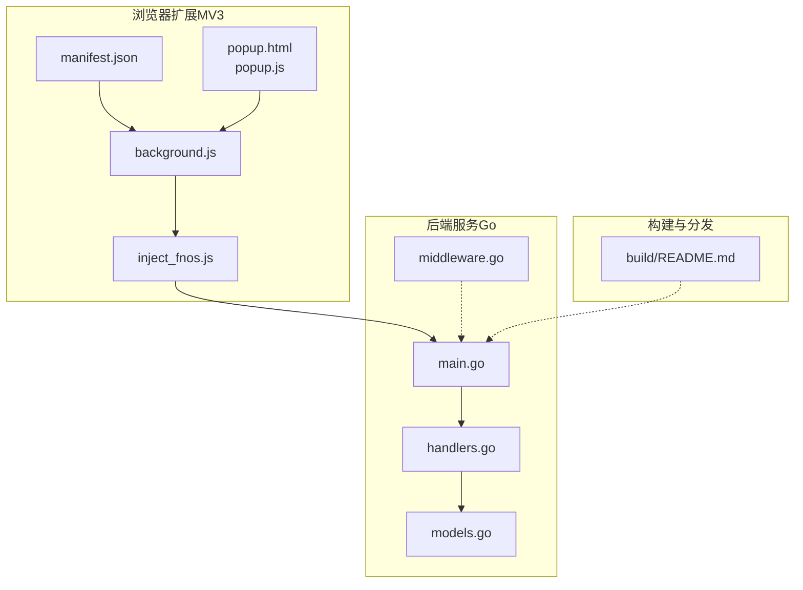
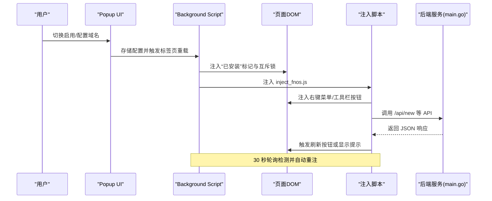
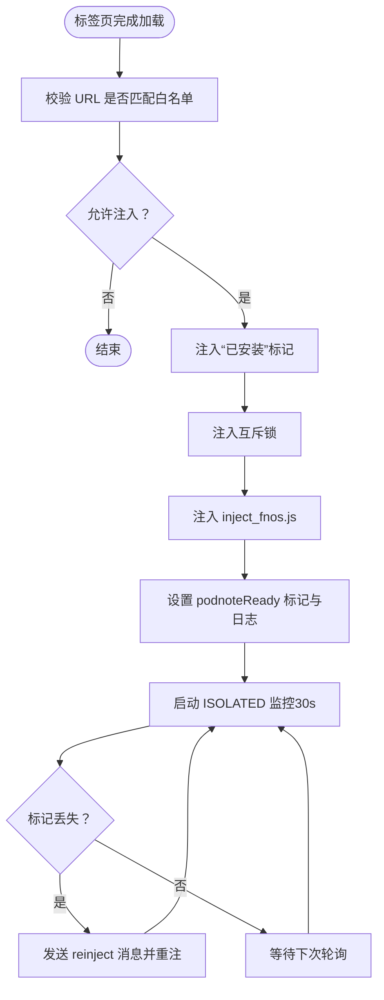
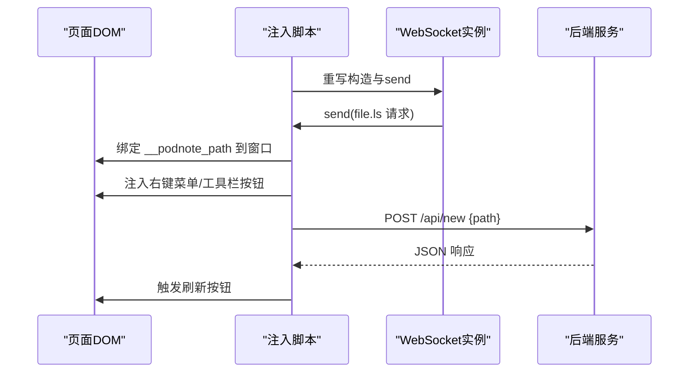
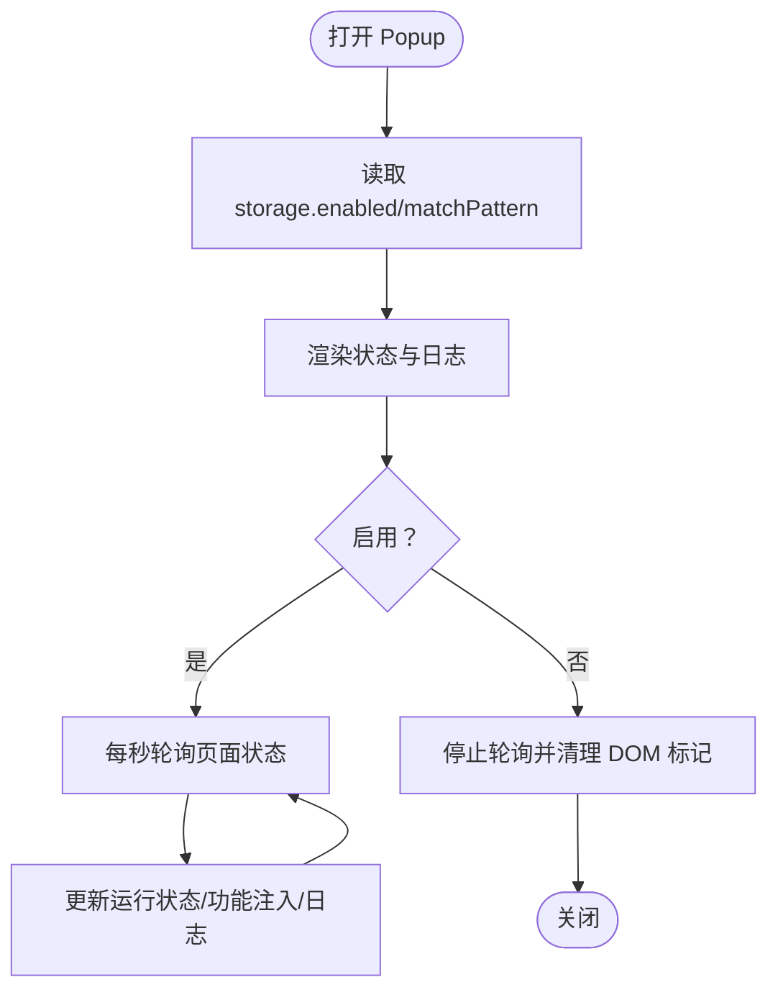
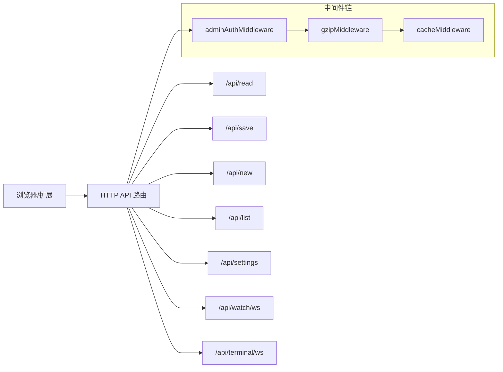
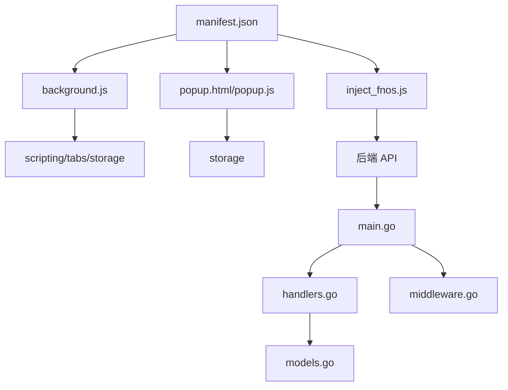

# 扩展通信机制

<cite>
**本文引用的文件**
- [manifest.json](file://chrome_extension/manifest.json)
- [background.js](file://chrome_extension/background.js)
- [inject_fnos.js](file://chrome_extension/inject_fnos.js)
- [popup.html](file://chrome_extension/popup.html)
- [popup.js](file://chrome_extension/popup.js)
- [main.go](file://src/main.go)
- [handlers.go](file://src/handlers.go)
- [middleware.go](file://src/middleware.go)
- [models.go](file://src/models.go)
- [README.md](file://README.md)
- [chrome_extension/README.md](file://chrome_extension/README.md)
- [build/README.md](file://build/README.md)
</cite>

## 目录
1. [简介](#简介)
2. [项目结构](#项目结构)
3. [核心组件](#核心组件)
4. [架构总览](#架构总览)
5. [组件详解](#组件详解)
6. [依赖关系分析](#依赖关系分析)
7. [性能考量](#性能考量)
8. [故障排查指南](#故障排查指南)
9. [结论](#结论)
10. [附录](#附录)

## 简介
本文件面向 Chrome 扩展的“通信机制”主题，系统性梳理 PodNote FNOS 文件管理辅助扩展的架构设计与实现细节，重点覆盖以下方面：
- 扩展三脚架：background script、content script（注入脚本）、popup UI 的职责与协作流程
- 页面注入机制：inject_fnos.js 的执行时机、DOM 操作与事件监听
- 扩展与后端服务的 API 通信：HTTP 请求封装、错误处理与状态管理
- 权限配置、安全策略与跨域访问控制
- 用户界面交互：右键菜单、工具栏按钮与弹窗功能
- 开发与调试指南：热重载、日志查看与性能分析
- 发布与维护最佳实践

## 项目结构
该仓库采用“多模块并行”的组织方式：
- chrome_extension：浏览器扩展源码（MV3），包含 manifest、background、注入脚本、popup
- src：后端服务（Go），提供静态资源网关、业务 API 与 WebSocket
- build：飞牛OS（FNOS）打包与分发资源，包含生命周期脚本与打包工具
- test：本地开发仿真调试环境
- 根目录 README：总体介绍与使用说明

图表来源
- [manifest.json:1-28](file://chrome_extension/manifest.json#L1-L28)
- [background.js:1-169](file://chrome_extension/background.js#L1-L169)
- [inject_fnos.js:1-898](file://chrome_extension/inject_fnos.js#L1-L898)
- [popup.html:1-173](file://chrome_extension/popup.html#L1-L173)
- [popup.js:1-200](file://chrome_extension/popup.js#L1-L200)
- [main.go:1-145](file://src/main.go#L1-L145)
- [handlers.go:1-614](file://src/handlers.go#L1-L614)
- [middleware.go:1-103](file://src/middleware.go#L1-L103)
- [models.go:1-30](file://src/models.go#L1-L30)
- [build/README.md:1-30](file://build/README.md#L1-L30)

章节来源
- [README.md:1-39](file://README.md#L1-L39)
- [chrome_extension/README.md:1-39](file://chrome_extension/README.md#L1-L39)
- [build/README.md:1-30](file://build/README.md#L1-L30)

## 核心组件
- 扩展清单与权限
  - 使用 Manifest V3，声明 side_panel、action、storage、tabs、scripting、host_permissions 等权限
- Background Script
  - 负责标签页生命周期监听、域名白名单校验、注入标记与互斥锁、注入脚本与存活自愈轮询
- 注入脚本（Content Script）
  - 重写 WebSocket 构造与 send，拦截文件管理 WS，绑定路径；注入右键菜单与工具栏按钮；管理编辑器弹窗与幽灵模式
- Popup UI
  - 配置启用状态与域名/端口规则；轮询页面状态与日志；主动清理 DOM 标记
- 后端服务（Go）
  - 静态资源网关与版本号注入；业务 API（读取、保存、新建、列表、设置、WebSocket 监控等）；中间件链（鉴权、Gzip、缓存）

章节来源
- [manifest.json:1-28](file://chrome_extension/manifest.json#L1-L28)
- [background.js:1-169](file://chrome_extension/background.js#L1-L169)
- [inject_fnos.js:1-898](file://chrome_extension/inject_fnos.js#L1-L898)
- [popup.js:1-200](file://chrome_extension/popup.js#L1-L200)
- [main.go:1-145](file://src/main.go#L1-L145)
- [handlers.go:1-614](file://src/handlers.go#L1-L614)
- [middleware.go:1-103](file://src/middleware.go#L1-L103)

## 架构总览
扩展与后端的通信链路如下：
- 扩展通过注入脚本与页面 DOM 交互，调用后端 API（如新建文件）或建立 WebSocket 监控
- background 负责注入时机与存活自愈；popup 负责用户配置与状态展示
- 后端通过 Unix Socket 提供 HTTP 服务，中间件链处理压缩、缓存与鉴权

图表来源
- [background.js:40-117](file://chrome_extension/background.js#L40-L117)
- [inject_fnos.js:825-854](file://chrome_extension/inject_fnos.js#L825-L854)
- [popup.js:13-32](file://chrome_extension/popup.js#L13-L32)
- [main.go:111-120](file://src/main.go#L111-L120)

## 组件详解

### 1) 扩展清单与权限配置
- Manifest V3
  - side_panel 默认路径指向 popup.html
  - action.default_popup 指向 popup.html
  - permissions：scripting、storage、tabs、sidePanel
  - host_permissions：<all_urls>（允许跨域访问）
  - icons：128×128、256×256
- 安全与跨域
  - host_permissions 允许对任意 URL 访问
  - scripting 与 tabs 用于注入与标签页控制
  - storage 用于持久化启用状态与匹配规则

章节来源
- [manifest.json:1-28](file://chrome_extension/manifest.json#L1-L28)

### 2) Background Script：标签页生命周期与注入控制
- 行为
  - 设置点击图标即打开侧边栏
  - onUpdated 监听标签页完成加载，校验 URL 是否匹配白名单
  - 注入“已安装”标记与互斥锁，避免重复注入
  - 注入 inject_fnos.js，并在 MAIN 世界执行
  - 注入完成后设置 podnoteReady 标记与日志
  - 启动 ISOLATED 监控，每 30 秒检查标记，必要时重注
  - 监听 runtime.onMessage，响应“reinject”指令进行重注
- 关键点
  - 互斥锁：window.__podnote_injecting__ 防止并发注入
  - 存活标记：documentElement.dataset.podnoteReady
  - 重注策略：基于标记丢失的自愈轮询

图表来源
- [background.js:40-117](file://chrome_extension/background.js#L40-L117)
- [background.js:119-168](file://chrome_extension/background.js#L119-L168)

章节来源
- [background.js:1-169](file://chrome_extension/background.js#L1-L169)

### 3) 注入脚本（inject_fnos.js）：页面注入与业务逻辑
- 执行时机
  - 由 background 注入，运行在 MAIN 世界，可直接访问页面 DOM
- 核心职责
  - WebSocket 拦截：重写 WebSocket 构造与 send，识别文件管理 WS，解析 file.ls 请求，绑定路径到窗口 DOM
  - 右键菜单注入：监听 contextmenu，利用 MutationObserver 在“打开方式/下载”锚点插入“使用 PodNote 编辑”，点击时拼接绝对路径并呼出编辑器
  - 工具栏注入：在“新建文件夹/上传”锚点后插入“新建文件”按钮，调用 /api/new 创建空文件后自动点击刷新按钮
  - 弹窗管理：动态创建 iframe 容器承载编辑器，支持拖拽、缩放、最大化/还原、幽灵模式（半透明穿透）
  - 日志与状态：通过 dataset.podnoteLogs 与 dataset.podnoteStatus 管理日志与功能注入状态
- 数据与状态
  - 窗口状态：window.__NP_WINS__、window.__NP_MAX_Z__
  - 路径绑定：winContainer.__podnote_path
  - 功能注入：dataset.podnoteFeatures（menu、toolbar）

图表来源
- [inject_fnos.js:80-123](file://chrome_extension/inject_fnos.js#L80-L123)
- [inject_fnos.js:179-194](file://chrome_extension/inject_fnos.js#L179-L194)
- [inject_fnos.js:825-854](file://chrome_extension/inject_fnos.js#L825-L854)

章节来源
- [inject_fnos.js:1-898](file://chrome_extension/inject_fnos.js#L1-L898)

### 4) Popup UI：配置与状态展示
- 功能
  - 切换启用状态：写入 storage，触发当前标签页重载
  - 配置域名/端口：本地存储 matchPattern，防抖保存
  - 轮询页面状态：每秒查询 dataset.podnoteStatus/features/logs，渲染运行状态、功能注入状态与日志
  - 禁用时清理 DOM 标记：主动移除 podnoteReady/status/features/logs
- 交互
  - 开关切换、输入框防抖、日志列表滚动到底部

图表来源
- [popup.html:1-173](file://chrome_extension/popup.html#L1-L173)
- [popup.js:13-97](file://chrome_extension/popup.js#L13-L97)
- [popup.js:99-158](file://chrome_extension/popup.js#L99-L158)

章节来源
- [popup.html:1-173](file://chrome_extension/popup.html#L1-L173)
- [popup.js:1-200](file://chrome_extension/popup.js#L1-L200)

### 5) 后端服务：API 与中间件
- 入口与路由
  - main.go：监听 Unix Socket，注册静态网关与业务 API 路由
  - 静态网关：为 index.html/style.css/app.js 等注入版本号；对非 Monaco JS 注入 .js?v=...；转发 Monaco 资源
  - 业务 API：/api/read、/api/save、/api/create、/api/new、/api/list、/api/settings、/api/watch/ws、/api/terminal/ws
- 中间件链
  - adminAuthMiddleware：生产环境校验 X-Trim-Isadmin
  - gzipMiddleware：对 .js/.css/.html 与 API 响应启用透明 Gzip
  - cacheMiddleware：对 Monaco 资源强缓存一年；带版本号资源缓存 30 天；普通资源缓存 1 天
- 关键处理
  - handleRead：路径校验、大小限制、编码预测与转码、返回语言与建议编码
  - handleSave：原子写入（tmp + rename），同步权限与 UID/GID
  - handleNewFile：物理创建空文件并同步权限
  - handleWatchWS：基于 stat 轮询文件变更并通过 WebSocket 通知
  - handleTerminalWS：校验管理员身份后桥接 PTY

图表来源
- [main.go:111-120](file://src/main.go#L111-L120)
- [handlers.go:21-112](file://src/handlers.go#L21-L112)
- [handlers.go:214-324](file://src/handlers.go#L214-L324)
- [handlers.go:363-424](file://src/handlers.go#L363-L424)
- [handlers.go:426-494](file://src/handlers.go#L426-L494)
- [handlers.go:496-516](file://src/handlers.go#L496-L516)
- [middleware.go:22-92](file://src/middleware.go#L22-L92)

章节来源
- [main.go:1-145](file://src/main.go#L1-L145)
- [handlers.go:1-614](file://src/handlers.go#L1-L614)
- [middleware.go:1-103](file://src/middleware.go#L1-L103)
- [models.go:1-30](file://src/models.go#L1-L30)

### 6) 用户界面交互：右键菜单、工具栏按钮与弹窗
- 右键菜单
  - 保存最后右键目标；在包含特定关键词的菜单容器中注入“使用 PodNote 编辑”项；点击时拼接路径并呼出编辑器
- 工具栏按钮
  - 在“新建文件夹/上传”锚点后注入“新建文件”按钮；调用 /api/new 创建空文件；自动定位并点击刷新按钮
- 弹窗管理
  - 动态创建 iframe 容器；支持拖拽、缩放、双击最大化/还原；幽灵模式半透明穿透；聚焦时提升 z-index 并弱化其他窗口

章节来源
- [inject_fnos.js:179-194](file://chrome_extension/inject_fnos.js#L179-L194)
- [inject_fnos.js:718-868](file://chrome_extension/inject_fnos.js#L718-L868)
- [inject_fnos.js:317-595](file://chrome_extension/inject_fnos.js#L317-L595)

### 7) 扩展与后端 API 通信：封装、错误处理与状态管理
- 请求封装
  - 注入脚本通过 fetch 调用 /api/new，POST JSON {path}
- 错误处理
  - 对后端错误与网络异常分别提示；在 UI 中弹出警告框
- 状态管理
  - 通过 dataset.podnoteLogs 记录日志；通过 dataset.podnoteStatus/Features 更新 UI 状态
  - Popup 侧栏每秒轮询并渲染最新状态与日志

章节来源
- [inject_fnos.js:825-854](file://chrome_extension/inject_fnos.js#L825-L854)
- [popup.js:100-158](file://chrome_extension/popup.js#L100-L158)

## 依赖关系分析
- 扩展内部
  - manifest.json 依赖 background、popup、inject_fnos
  - background 依赖 scripting/tabs/storage
  - inject_fnos 依赖页面 DOM 与后端 API
  - popup 依赖 storage 与 scripting
- 扩展与后端
  - 注入脚本直连后端 API；background 仅负责注入与自愈
- 后端内部
  - main.go 聚合路由与中间件；handlers.go 实现具体业务；middleware.go 提供通用能力；models.go 定义响应模型

图表来源
- [manifest.json:1-28](file://chrome_extension/manifest.json#L1-L28)
- [background.js:1-169](file://chrome_extension/background.js#L1-L169)
- [popup.js:1-200](file://chrome_extension/popup.js#L1-L200)
- [inject_fnos.js:1-898](file://chrome_extension/inject_fnos.js#L1-L898)
- [main.go:1-145](file://src/main.go#L1-L145)
- [handlers.go:1-614](file://src/handlers.go#L1-L614)
- [middleware.go:1-103](file://src/middleware.go#L1-L103)
- [models.go:1-30](file://src/models.go#L1-L30)

章节来源
- [manifest.json:1-28](file://chrome_extension/manifest.json#L1-L28)
- [main.go:1-145](file://src/main.go#L1-L145)

## 性能考量
- 注入与存活自愈
  - 通过互斥锁与存活标记避免重复注入；ISOLATED 监控每 30 秒轮询，降低资源占用
- 前端性能
  - inject_fnos.js 使用 MutationObserver 精准注入，减少全局扫描
  - 弹窗采用 iframe 容器，避免与页面复杂布局冲突
- 后端性能
  - gzip 中间件对静态与 API 响应启用透明压缩，显著降低带宽
  - 缓存策略针对 Monaco 资源强缓存一年，业务资源按版本号缓存 30 天
  - handleSave 使用 tmp + rename 原子写入，减少磁盘碎片与锁竞争

章节来源
- [background.js:54-97](file://chrome_extension/background.js#L54-L97)
- [inject_fnos.js:891-898](file://chrome_extension/inject_fnos.js#L891-L898)
- [middleware.go:40-92](file://src/middleware.go#L40-L92)
- [handlers.go:214-324](file://src/handlers.go#L214-L324)

## 故障排查指南
- 注入失败
  - 检查 URL 白名单是否匹配；确认 background 注入日志与存活标记
  - 若标记丢失，确认 ISOLATED 监控是否正常轮询并触发重注
- 右键菜单/工具栏未出现
  - 确认页面 DOM 中包含预期关键词；检查注入锚点是否存在
  - 查看 dataset.podnoteFeatures 是否包含 menu/toolbar
- 新建文件失败
  - 检查 /api/new 返回的错误信息；确认路径合法性与父目录存在
  - 确认刷新按钮定位逻辑是否命中
- 日志查看
  - Popup 侧栏实时日志；注入脚本通过 dataset.podnoteLogs 记录
- 网络问题
  - 检查 host_permissions 与跨域访问；确认后端 Unix Socket 正常监听

章节来源
- [background.js:101-117](file://chrome_extension/background.js#L101-L117)
- [inject_fnos.js:825-854](file://chrome_extension/inject_fnos.js#L825-L854)
- [popup.js:160-189](file://chrome_extension/popup.js#L160-L189)

## 结论
该扩展通过 MV3 的 side_panel 与 service worker 架构，实现了对 FNOS 文件管理器的深度集成。background 负责注入与自愈，inject_fnos.js 实现去类名化的 DOM 交互与业务逻辑，popup 提供直观的配置与状态展示。后端以中间件链优化性能与安全性，API 设计兼顾易用性与健壮性。整体方案在功能完整性与工程可维护性之间取得良好平衡。

## 附录
- 开发与调试
  - 本地安装扩展：chrome://extensions 开启开发者模式，加载已解压的扩展目录
  - 热重载：修改 manifest.json、background、inject_fnos.js、popup 后，刷新扩展页面或重启浏览器
  - 日志查看：Popup 侧栏日志；浏览器扩展页面 Console；后端日志输出
  - 性能分析：使用 Performance 面板观测注入与弹窗交互；Network 面板观察 API 与 WebSocket
- 发布与维护
  - 遵循 manifest v3 规范；合理配置 permissions 与 host_permissions
  - 保持 inject_fnos.js 的去类名化策略，降低宿主界面升级带来的破坏性影响
  - 后端中间件链按需启用，确保压缩与缓存策略与前端版本号配合
  - 发布前在测试环境验证 SPA 路由切换场景下的存活自愈行为

章节来源
- [README.md:19-32](file://README.md#L19-L32)
- [chrome_extension/README.md:37-39](file://chrome_extension/README.md#L37-L39)
- [build/README.md:16-30](file://build/README.md#L16-L30)