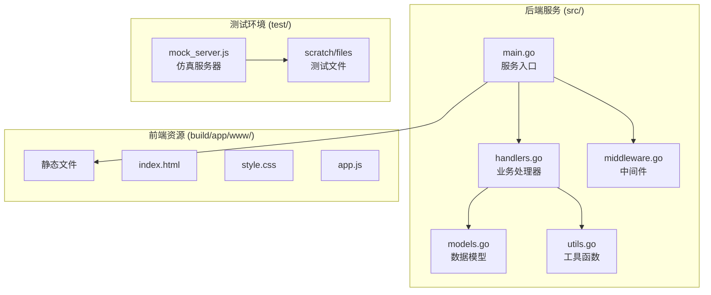
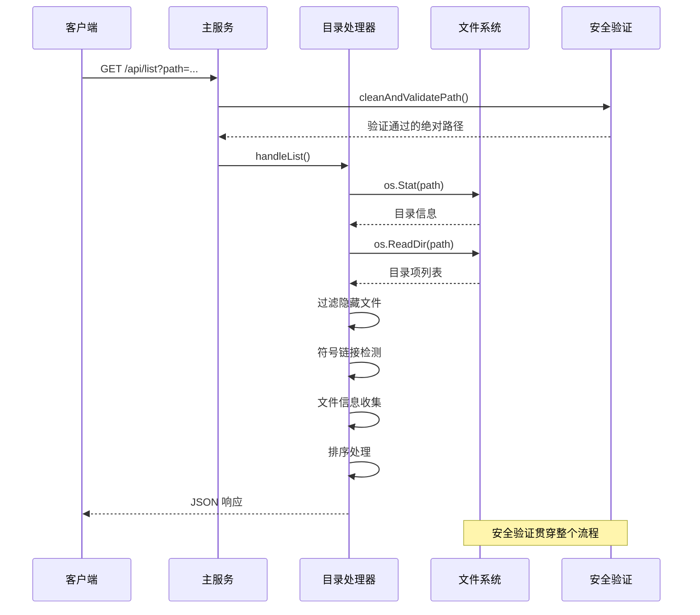
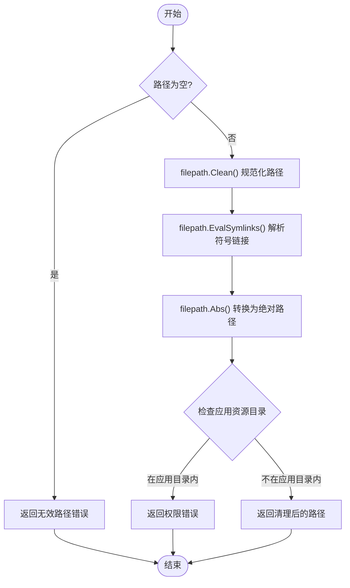
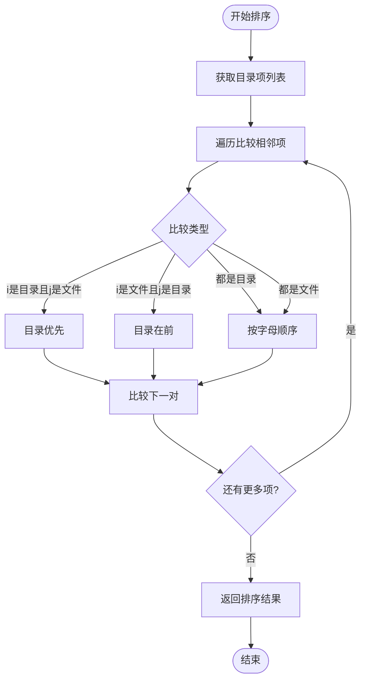
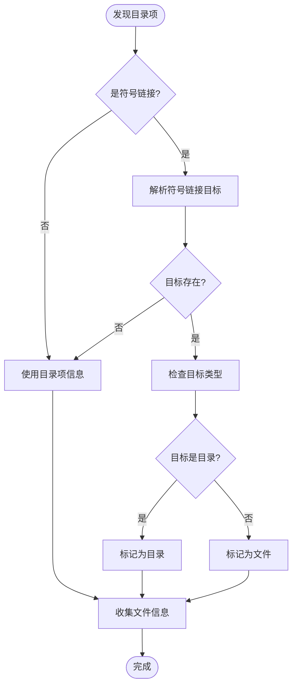
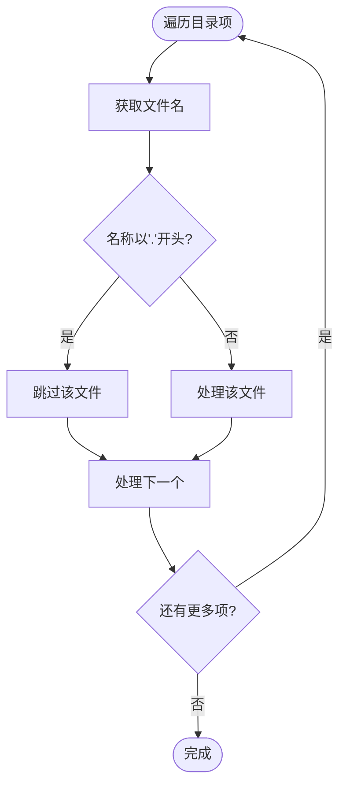
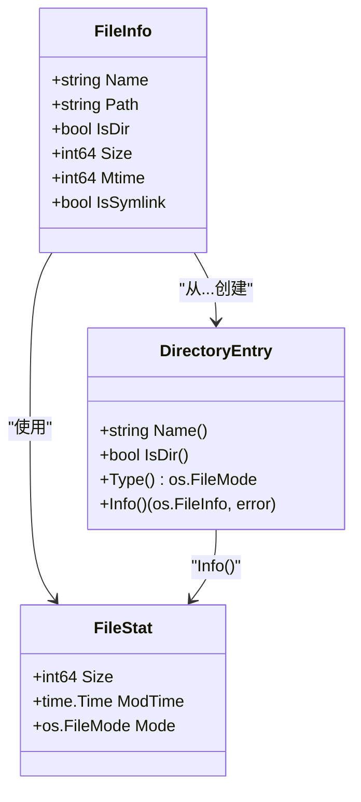
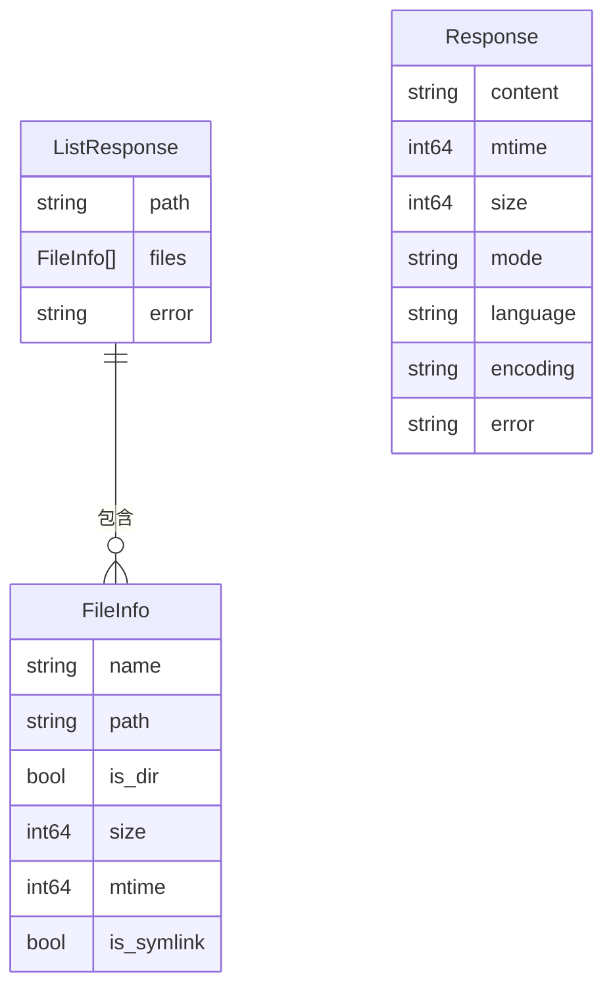
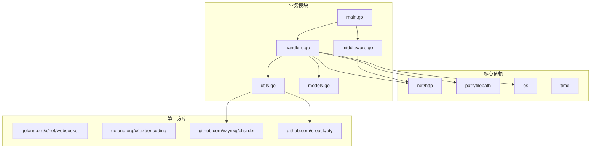

# 文件管理操作

<cite>
**本文档引用的文件**
- [main.go](file://src/main.go)
- [handlers.go](file://src/handlers.go)
- [models.go](file://src/models.go)
- [utils.go](file://src/utils.go)
- [middleware.go](file://src/middleware.go)
- [mock_server.js](file://test/scratch/mock_server.js)
- [README.md](file://README.md)
- [test/README.md](file://test/README.md)
</cite>

## 目录
1. [简介](#简介)
2. [项目结构](#项目结构)
3. [核心组件](#核心组件)
4. [架构概览](#架构概览)
5. [详细组件分析](#详细组件分析)
6. [依赖关系分析](#依赖关系分析)
7. [性能考虑](#性能考虑)
8. [故障排除指南](#故障排除指南)
9. [结论](#结论)

## 简介

本文档详细介绍了 PodNote 文本编辑器的文件管理操作功能，特别是目录浏览功能的完整实现。该系统基于 Go 语言构建，提供了安全、高效的文件管理系统，支持飞牛OS（FNOS）平台的深度集成。

PodNote 是一款现代化的文本编辑器，搭载 Monaco Editor 内核，专为飞牛OS平台设计，提供类 VS Code 的工作体验，支持多标签页编辑、交互式终端、以及与文件管理器的无缝集成。

## 项目结构

项目采用模块化的 Go 语言架构，主要包含以下核心组件：



**图表来源**
- [main.go:1-145](file://src/main.go#L1-L145)
- [handlers.go:1-614](file://src/handlers.go#L1-L614)
- [models.go:1-30](file://src/models.go#L1-L30)
- [utils.go:1-262](file://src/utils.go#L1-L262)
- [middleware.go:1-103](file://src/middleware.go#L1-L103)

**章节来源**
- [README.md:12-17](file://README.md#L12-L17)
- [main.go:15-129](file://src/main.go#L15-L129)

## 核心组件

### 目录浏览处理器 (handleList)

目录浏览功能的核心实现位于 `handleList` 函数中，负责处理 `/api/list` 接口的请求。该函数实现了完整的路径验证、目录读取、文件信息收集和排序逻辑。

### 数据模型定义

系统使用标准化的数据模型来确保前后端数据交换的一致性：

- **Response**: 标准 API 响应结构，用于文件读取等操作
- **FileInfo**: 目录项元数据结构，包含文件的基本信息
- **ListResponse**: 目录列表响应结构，包含路径和文件数组

### 路径安全验证

系统实现了多层次的安全验证机制，防止路径遍历攻击和系统目录访问：

- 绝对路径转换和规范化
- 符号链接解析和验证
- 应用资源目录保护
- 环境变量驱动的安全检查

**章节来源**
- [handlers.go:21-112](file://src/handlers.go#L21-L112)
- [models.go:3-29](file://src/models.go#L3-L29)
- [utils.go:25-53](file://src/utils.go#L25-L53)

## 架构概览

系统采用分层架构设计，结合中间件模式实现功能模块化：



**图表来源**
- [main.go:111-119](file://src/main.go#L111-L119)
- [handlers.go:21-112](file://src/handlers.go#L21-L112)
- [utils.go:25-53](file://src/utils.go#L25-L53)

## 详细组件分析

### 路径清理和验证机制

#### 清理流程

路径清理过程包含多个关键步骤，确保输入的安全性和有效性：



**图表来源**
- [utils.go:25-53](file://src/utils.go#L25-L53)

#### 安全防护措施

系统实施了多重安全防护机制：

1. **路径遍历防护**: 通过符号链接解析防止目录逃逸
2. **应用目录保护**: 禁止访问应用自身的资源目录
3. **权限检查**: 基于环境变量的动态权限验证
4. **输入验证**: 对所有用户输入进行严格的格式检查

**章节来源**
- [utils.go:25-53](file://src/utils.go#L25-L53)
- [handlers.go:31-39](file://src/handlers.go#L31-L39)

### 目录项排序规则

#### 排序算法实现

目录列表的排序遵循特定的优先级规则：



**图表来源**
- [handlers.go:98-106](file://src/handlers.go#L98-L106)

#### 排序规则详解

排序算法采用两阶段比较策略：

1. **类型优先级**: 目录项始终优先于文件项
2. **字母排序**: 同类型项按名称进行不区分大小写的字母排序
3. **稳定性保证**: 使用稳定的排序算法确保相同项的相对位置不变

**章节来源**
- [handlers.go:98-106](file://src/handlers.go#L98-L106)

### 符号链接处理

#### 符号链接检测和解析

系统对符号链接进行了专门的处理，确保用户看到的是符号链接指向的实际内容：



**图表来源**
- [handlers.go:74-81](file://src/handlers.go#L74-L81)

#### 符号链接信息收集

对于符号链接，系统收集以下信息：

- **名称**: 符号链接本身的名称
- **路径**: 符号链接的完整路径
- **类型**: 基于目标文件类型的最终判定
- **大小**: 目标文件的实际大小（目录为0）
- **修改时间**: 目标文件的最后修改时间
- **符号链接标识**: 明确标注为符号链接

**章节来源**
- [handlers.go:74-95](file://src/handlers.go#L74-L95)

### 隐藏文件过滤

#### 过滤机制

系统默认过滤掉以点号开头的隐藏文件，这一设计符合大多数文件管理器的惯例：



**图表来源**
- [handlers.go:64-68](file://src/handlers.go#L64-L68)

#### 过滤范围

隐藏文件过滤适用于所有目录项，包括：
- 隐藏文件（如 `.gitignore`, `.DS_Store`）
- 隐藏目录（如 `.git`, `.vscode`）
- 系统特殊文件

**章节来源**
- [handlers.go:64-68](file://src/handlers.go#L64-L68)

### 文件系统安全机制

#### 路径遍历攻击防护

系统采用了多层防护机制来防止路径遍历攻击：

1. **绝对路径强制**: 所有输入路径都转换为绝对路径
2. **符号链接解析**: 自动解析符号链接，防止通过符号链接绕过限制
3. **目录边界检查**: 确保路径不会逃逸到应用目录之外
4. **权限验证**: 结合环境变量进行动态权限检查

#### 权限检查机制

系统实现了基于环境变量的权限控制系统：

- **管理员验证**: 通过 `X-Trim-Isadmin` 头部验证管理员身份
- **生产环境保护**: 在飞牛OS环境中启用严格的安全检查
- **开发环境宽松**: 在本地开发环境中提供更宽松的访问权限

#### 系统目录保护

系统特别保护了应用自身的资源目录，防止被意外或恶意访问：

- **应用根目录保护**: 禁止访问 `TRIM_APPDEST` 指定的应用目录
- **资源文件保护**: 防止对编辑器核心文件的修改
- **配置文件保护**: 保护敏感的配置文件不被随意读取

**章节来源**
- [utils.go:25-53](file://src/utils.go#L25-L53)
- [middleware.go:22-38](file://src/middleware.go#L22-L38)

### 文件信息获取

#### 元数据收集

系统为每个文件收集详细的元数据信息：



**图表来源**
- [models.go:14-22](file://src/models.go#L14-L22)
- [handlers.go:83-86](file://src/handlers.go#L83-L86)

#### 信息收集流程

文件信息的收集遵循以下流程：

1. **基础信息**: 从 `DirectoryEntry` 获取名称、类型和基本状态
2. **符号链接处理**: 检测并解析符号链接类型
3. **详细统计**: 通过 `entry.Info()` 获取精确的文件大小和修改时间
4. **类型确定**: 根据符号链接目标重新确定文件类型

**章节来源**
- [handlers.go:63-96](file://src/handlers.go#L63-L96)

### 目录列表 JSON 响应格式

#### 响应结构定义

目录列表的 JSON 响应遵循标准化的结构：



**图表来源**
- [models.go:24-29](file://src/models.go#L24-L29)
- [models.go:14-22](file://src/models.go#L14-L22)
- [models.go:3-12](file://src/models.go#L3-L12)

#### 字段含义详解

**ListResponse 字段**:
- `path`: 返回的目录绝对路径
- `files`: 目录项数组，包含所有可见文件的信息
- `error`: 错误信息，当操作失败时返回

**FileInfo 字段**:
- `name`: 文件或目录的显示名称
- `path`: 文件的完整绝对路径
- `is_dir`: 布尔值，指示是否为目录
- `size`: 文件大小（字节），目录为0
- `mtime`: 最后修改时间的时间戳（秒）
- `is_symlink`: 布尔值，指示是否为符号链接

**章节来源**
- [models.go:24-29](file://src/models.go#L24-L29)
- [models.go:14-22](file://src/models.go#L14-L22)

### API 使用示例

#### /api/list 接口

##### 查询参数

| 参数 | 类型 | 必需 | 描述 | 示例 |
|------|------|------|------|------|
| path | string | 是 | 目标目录的路径 | `/home/user/documents` |

##### 成功响应示例

```json
{
  "path": "/home/user/documents",
  "files": [
    {
      "name": "项目",
      "path": "/home/user/documents/项目",
      "is_dir": true,
      "size": 0,
      "mtime": 1703654700,
      "is_symlink": false
    },
    {
      "name": "readme.md",
      "path": "/home/user/documents/readme.md",
      "is_dir": false,
      "size": 1024,
      "mtime": 1703654700,
      "is_symlink": false
    }
  ]
}
```

##### 错误响应示例

```json
{
  "error": "目录不存在"
}
```

##### 常见错误场景

1. **缺少路径参数**: 返回 "缺少 path 参数"
2. **无效路径**: 返回 "无效的路径"
3. **权限不足**: 返回 "禁止访问系统受保护目录"
4. **路径不存在**: 返回 "目录不存在"
5. **非目录路径**: 返回 "目标路径不是一个文件夹"

**章节来源**
- [handlers.go:22-112](file://src/handlers.go#L22-L112)

## 依赖关系分析

### 组件依赖图



**图表来源**
- [main.go:3-11](file://src/main.go#L3-L11)
- [handlers.go:3-19](file://src/handlers.go#L3-L19)
- [utils.go:3-23](file://src/utils.go#L3-L23)

### 关键依赖说明

#### 标准库依赖

- **net/http**: 提供 HTTP 服务器和客户端功能
- **path/filepath**: 提供跨平台的路径操作功能
- **os**: 提供操作系统相关的文件操作
- **time**: 提供时间处理功能

#### 第三方库依赖

- **golang.org/x/net/websocket**: 提供 WebSocket 支持
- **golang.org/x/text/encoding**: 提供字符编码转换
- **github.com/wlynxg/chardet**: 提供字符编码自动检测
- **github.com/creack/pty**: 提供伪终端支持

**章节来源**
- [main.go:3-11](file://src/main.go#L3-L11)
- [handlers.go:3-19](file://src/handlers.go#L3-L19)
- [utils.go:3-23](file://src/utils.go#L3-L23)

## 性能考虑

### 缓存策略

系统实现了多层缓存优化机制：

1. **静态资源缓存**: 对 JavaScript、CSS 和 HTML 文件实施长期缓存
2. **Gzip 压缩**: 对可压缩内容进行透明压缩，减少网络传输
3. **Monaco 编辑器缓存**: 对编辑器核心资源实施一年强缓存

### 内存管理

- **Gzip 编码器池**: 使用 sync.Pool 复用 Gzip 编码器实例
- **响应写入器包装**: 通过自定义包装器实现高效的流式响应
- **临时文件管理**: 原子写入过程中正确处理临时文件生命周期

### I/O 优化

- **批量读取**: 目录项读取使用 `os.ReadDir` 提供更好的性能
- **延迟计算**: 文件大小和修改时间在需要时才进行计算
- **符号链接优化**: 对符号链接进行必要的解析但避免重复操作

**章节来源**
- [middleware.go:14-72](file://src/middleware.go#L14-L72)
- [handlers.go:57-61](file://src/handlers.go#L57-L61)

## 故障排除指南

### 常见问题诊断

#### 路径相关问题

| 问题症状 | 可能原因 | 解决方案 |
|----------|----------|----------|
| "缺少 path 参数" | 请求未包含 path 参数 | 确保请求包含有效的 path 参数 |
| "无效的路径" | 路径格式不正确或包含非法字符 | 检查路径格式，避免使用相对路径 |
| "禁止访问系统受保护目录" | 尝试访问受保护的系统目录 | 使用用户可访问的目录 |
| "目录不存在" | 指定路径不存在 | 验证路径正确性，确认目录存在 |

#### 权限相关问题

| 问题症状 | 可能原因 | 解决方案 |
|----------|----------|----------|
| "拒绝访问" | 权限不足或认证失败 | 检查用户权限，确保具有读取权限 |
| "仅限系统管理员使用" | 需要管理员权限 | 以管理员身份登录或使用正确的凭据 |
| "无法读取目录" | 目录权限设置不当 | 检查目录权限设置，确保可读权限 |

#### 性能相关问题

| 问题症状 | 可能原因 | 解决方案 |
|----------|----------|----------|
| 目录加载缓慢 | 目录项过多或磁盘 I/O 瓶颈 | 分批加载或优化目录结构 |
| 内存使用过高 | 大文件处理或内存泄漏 | 检查内存使用情况，优化处理逻辑 |
| 响应时间过长 | 网络延迟或服务器负载过高 | 检查网络连接，优化服务器配置 |

### 调试技巧

#### 日志分析

系统提供了详细的日志记录功能：

1. **HTTP 请求日志**: 记录所有 HTTP 请求的详细信息
2. **安全验证日志**: 记录路径验证和权限检查过程
3. **错误日志**: 记录所有错误和异常情况
4. **性能日志**: 记录关键操作的执行时间和资源使用

#### 本地测试

系统提供了完整的本地测试环境：

1. **Node.js 仿真服务器**: 模拟后端 API 行为
2. **真实文件系统**: 使用实际的文件和目录进行测试
3. **WebSocket 仿真**: 模拟实时通信功能
4. **自动化测试**: 提供测试用例和验证脚本

**章节来源**
- [handlers.go:43-55](file://src/handlers.go#L43-L55)
- [middleware.go:22-38](file://src/middleware.go#L22-L38)
- [test/README.md:15-41](file://test/README.md#L15-L41)

## 结论

PodNote 的文件管理操作功能展现了现代 Web 应用的安全性和可靠性。通过精心设计的路径验证机制、完善的错误处理、以及高效的性能优化，系统为用户提供了稳定可靠的文件管理体验。

### 主要优势

1. **安全性**: 多层次的安全防护机制有效防止各种攻击
2. **可靠性**: 完善的错误处理和恢复机制确保系统稳定运行
3. **性能**: 优化的 I/O 操作和缓存策略提供快速响应
4. **兼容性**: 支持多种字符编码和文件类型
5. **可维护性**: 清晰的代码结构和详细的文档便于维护

### 技术亮点

- **路径安全**: 通过符号链接解析和目录边界检查防止路径遍历攻击
- **性能优化**: 使用批量读取和缓存策略提升响应速度
- **错误处理**: 完善的错误分类和用户友好的错误消息
- **跨平台支持**: 基于 Go 语言的跨平台兼容性

该系统为飞牛OS平台的文件管理提供了坚实的技术基础，为用户提供了现代化、高效、安全的文件管理体验。