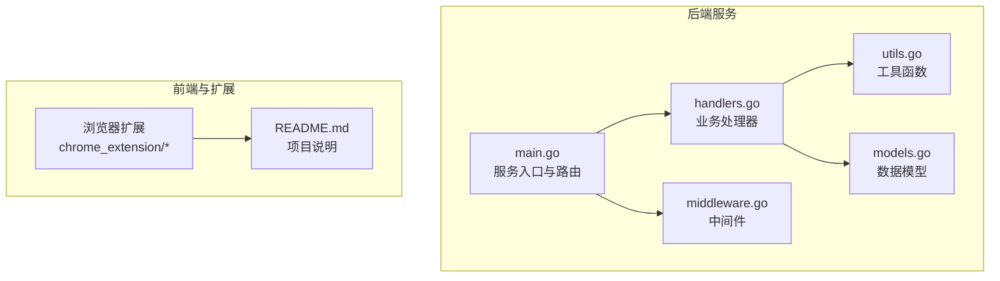
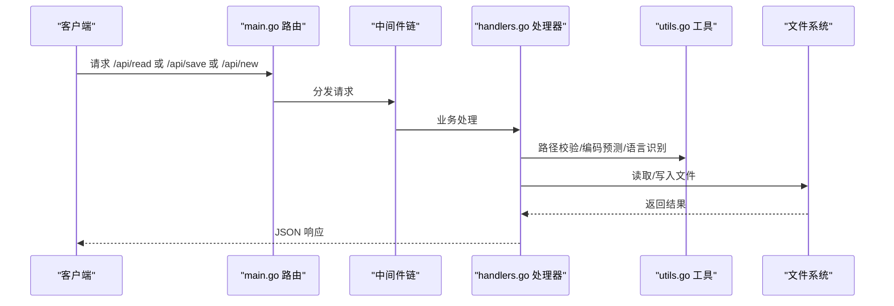
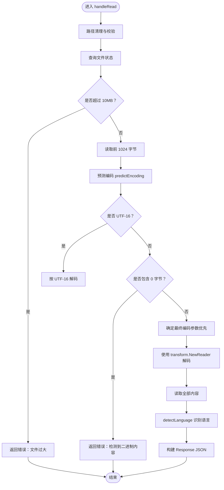
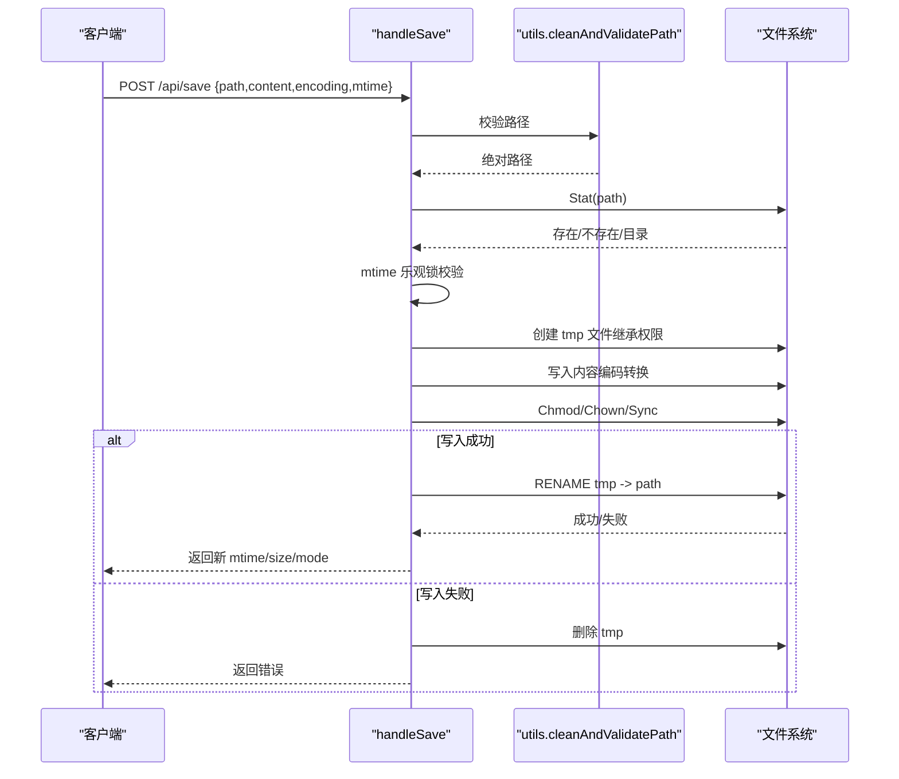
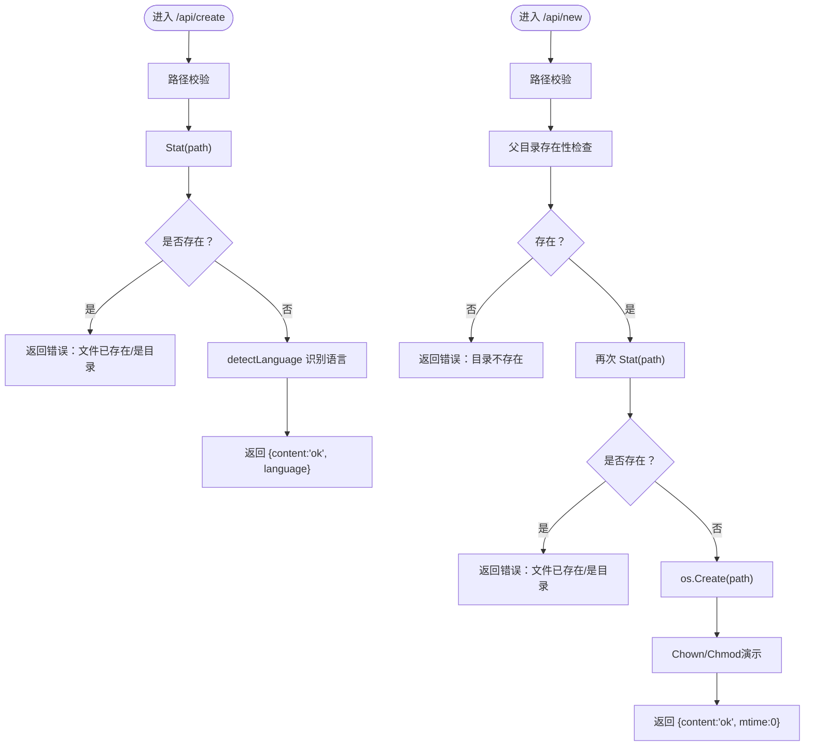
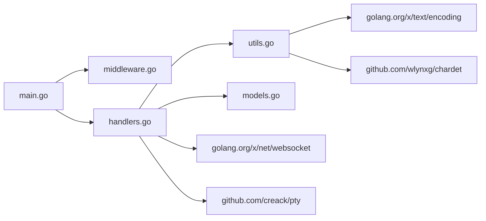

# 文件编辑功能

<cite>
**本文引用的文件**
- [main.go](file://src/main.go)
- [handlers.go](file://src/handlers.go)
- [models.go](file://src/models.go)
- [utils.go](file://src/utils.go)
- [middleware.go](file://src/middleware.go)
- [README.md](file://README.md)
- [src/README.md](file://src/README.md)
- [test/README.md](file://test/README.md)
</cite>

## 目录
1. [简介](#简介)
2. [项目结构](#项目结构)
3. [核心组件](#核心组件)
4. [架构总览](#架构总览)
5. [详细组件分析](#详细组件分析)
6. [依赖关系分析](#依赖关系分析)
7. [性能考量](#性能考量)
8. [故障排查指南](#故障排查指南)
9. [结论](#结论)
10. [附录](#附录)

## 简介
本技术文档围绕文件编辑功能展开，重点解释以下方面：
- 文件读取机制：多编码格式检测（UTF-8、GBK、GB2312、Big5、UTF-16 等）与自动编码识别算法。
- 文件保存流程：原子写入机制、临时文件创建与重命名策略、文件权限同步与所有权保持。
- 文件创建预检与实际创建的双阶段流程：路径安全验证与目录存在性检查。
- 文件大小限制（10MB）与二进制内容检测机制。
- 具体的 API 使用示例：如何调用 /api/read、/api/save、/api/new 等接口。
- 错误处理策略与性能优化建议。

## 项目结构
后端采用 Go 语言实现，通过 Unix Socket 对外提供服务，核心模块如下：
- main.go：服务入口、路由注册、中间件包装、Unix Socket 监听。
- handlers.go：业务处理器，包含文件读取、保存、创建、列表、监视、终端等。
- utils.go：通用工具函数，包括路径清理与校验、编码预测、语言识别、PTY 终端桥接。
- models.go：统一响应结构体与目录项结构体。
- middleware.go：管理员鉴权、Gzip 压缩、缓存控制中间件。
- test/README.md：本地开发与测试说明，包含 mock 服务器与 API 仿真。
- src/README.md：后端模块说明与核心 API 逻辑概览。
- README.md：项目总体介绍与浏览器扩展使用说明。

图表来源
- [main.go:15-144](file://src/main.go#L15-L144)
- [handlers.go:114-424](file://src/handlers.go#L114-L424)
- [utils.go:25-165](file://src/utils.go#L25-L165)
- [models.go:3-29](file://src/models.go#L3-L29)
- [middleware.go:22-103](file://src/middleware.go#L22-L103)
- [README.md:1-39](file://README.md#L1-L39)
- [src/README.md:1-74](file://src/README.md#L1-L74)

章节来源
- [main.go:15-144](file://src/main.go#L15-L144)
- [src/README.md:1-74](file://src/README.md#L1-L74)

## 核心组件
- 路由与入口：在 main.go 中注册 /api/* 路由，并通过中间件链包装处理请求。
- 数据模型：Response、FileInfo、ListResponse 统一响应结构，便于前后端契约一致。
- 工具函数：路径安全校验、编码预测、语言识别、PTY 终端桥接。
- 中间件：管理员鉴权、Gzip 压缩、缓存控制，提升安全性与性能。
- 业务处理器：handleRead、handleSave、handleCreate、handleNewFile、handleList、handleWatchWS、handleTerminalWS。

章节来源
- [models.go:3-29](file://src/models.go#L3-L29)
- [utils.go:25-165](file://src/utils.go#L25-L165)
- [middleware.go:22-103](file://src/middleware.go#L22-L103)
- [handlers.go:114-424](file://src/handlers.go#L114-L424)

## 架构总览
后端通过 Unix Socket 监听，路由到具体处理器。管理员鉴权中间件在最外层，随后是 Gzip 压缩与缓存控制中间件，最后进入业务处理。文件读取与保存均依赖路径安全校验与编码预测。

图表来源
- [main.go:112-119](file://src/main.go#L112-L119)
- [middleware.go:22-92](file://src/middleware.go#L22-L92)
- [handlers.go:114-424](file://src/handlers.go#L114-L424)
- [utils.go:25-165](file://src/utils.go#L25-L165)

## 详细组件分析

### 文件读取机制与编码识别
- 路径安全：cleanAndValidatePath 清理并解析符号链接，生成绝对路径，并禁止访问应用自身资源目录。
- 大小限制：读取前检查文件大小，超过 10MB 直接拒绝。
- 二进制检测：读取前 1024 字节，若非 UTF-16 且包含 0 字节，则判定为二进制内容并拒绝加载。
- 编码预测：predictEncoding 使用 chardet 检测常见编码（UTF-8、GB18030、UTF-16LE/BE、BIG5），并设定置信度阈值。
- 转码输出：根据最终编码（参数优先，否则预测）使用 golang.org/x/text/encoding 进行解码，输出 UTF-8 文本。
- 语言识别：detectLanguage 基于扩展名与 Shebang 判断语言 ID，用于 Monaco 语法高亮。
- 响应字段：包含 content、mtime、size、mode、language、encoding（建议编码）。

图表来源
- [handlers.go:114-212](file://src/handlers.go#L114-L212)
- [utils.go:108-147](file://src/utils.go#L108-L147)
- [utils.go:55-106](file://src/utils.go#L55-L106)

章节来源
- [handlers.go:114-212](file://src/handlers.go#L114-L212)
- [utils.go:25-53](file://src/utils.go#L25-L53)
- [utils.go:108-147](file://src/utils.go#L108-L147)
- [utils.go:55-106](file://src/utils.go#L55-L106)

### 文件保存流程与原子写入
- 方法限制：仅接受 POST 请求。
- 预检：路径校验、目标是否为目录、mtime 乐观锁冲突检测（若请求 mtime 为 0 或实际 mtime 更新则拒绝覆盖）。
- 权限继承：若文件存在，继承原文件权限位。
- 临时文件：在同级创建以纳秒时间戳结尾的 .tmp 文件，避免跨设备重命名问题。
- 写入与转码：使用 golang.org/x/text/encoding 的 ReplaceUnsupported 编码器写入，过滤非法 Unicode。
- 落盘与同步：写入后调用 Sync 强制刷盘，记录警告日志但不中断流程。
- 权限与所有权：恢复原文件权限；若可获取 UID/GID，则尝试 Chown 同步所有权。
- 原子替换：成功后执行 os.Rename 将 tmp 替换为目标文件；失败则删除 tmp 并返回错误。
- 响应：返回新文件的 mtime、size、mode。

图表来源
- [handlers.go:214-324](file://src/handlers.go#L214-L324)
- [utils.go:25-53](file://src/utils.go#L25-L53)

章节来源
- [handlers.go:214-324](file://src/handlers.go#L214-L324)
- [utils.go:25-53](file://src/utils.go#L25-L53)

### 文件创建预检与实际创建
- 预检（/api/create）：校验路径合法性与安全性，确认目标文件不存在；返回语言建议。
- 实际创建（/api/new）：校验父目录存在性，再次确认目标不存在，然后创建空文件；随后同步 UID/GID 为固定值（演示用途）。

图表来源
- [handlers.go:326-424](file://src/handlers.go#L326-L424)
- [utils.go:55-106](file://src/utils.go#L55-L106)

章节来源
- [handlers.go:326-424](file://src/handlers.go#L326-L424)
- [utils.go:55-106](file://src/utils.go#L55-L106)

### API 使用示例
以下示例展示如何调用相关接口（请根据实际部署的前缀与地址调整）：
- 读取文件
  - 方法：GET
  - 地址：/app/m-text-editor/api/read?path=绝对路径&encoding=可选编码
  - 示例：curl "http://localhost/app/m-text-editor/api/read?path=/data/test.txt&encoding=utf-8"
- 保存文件
  - 方法：POST
  - 地址：/app/m-text-editor/api/save
  - 请求体：JSON，包含 path、content、encoding、mtime
  - 示例：curl -X POST "http://localhost/app/m-text-editor/api/save" -H "Content-Type: application/json" -d '{"path":"/data/test.txt","content":"...","encoding":"utf-8","mtime":0}'
- 新建文件（预检）
  - 方法：GET
  - 地址：/app/m-text-editor/api/create?path=绝对路径
  - 示例：curl "http://localhost/app/m-text-editor/api/create?path=/data/new.txt"
- 新建文件（实际创建）
  - 方法：POST
  - 地址：/app/m-text-editor/api/new
  - 请求体：JSON，包含 path
  - 示例：curl -X POST "http://localhost/app/m-text-editor/api/new" -H "Content-Type: application/json" -d '{"path":"/data/new.txt"}'

章节来源
- [main.go:112-119](file://src/main.go#L112-L119)
- [handlers.go:114-212](file://src/handlers.go#L114-L212)
- [handlers.go:214-324](file://src/handlers.go#L214-L324)
- [handlers.go:326-424](file://src/handlers.go#L326-L424)

## 依赖关系分析
- 路由与中间件：main.go 注册 /api/* 路由，中间件链 adminAuthMiddleware -> gzipMiddleware -> cacheMiddleware。
- 处理器依赖：handlers.go 依赖 utils.go 的路径校验、编码预测、语言识别；使用 golang.org/x/text/encoding 进行转码。
- 第三方库：golang.org/x/text、github.com/wlynxg/chardet、golang.org/x/net/websocket、github.com/creack/pty。

图表来源
- [main.go:112-119](file://src/main.go#L112-L119)
- [middleware.go:22-92](file://src/middleware.go#L22-L92)
- [handlers.go:114-424](file://src/handlers.go#L114-L424)
- [utils.go:108-165](file://src/utils.go#L108-L165)
- [src/go.mod:5-11](file://src/go.mod#L5-L11)

章节来源
- [src/go.mod:5-11](file://src/go.mod#L5-L11)
- [handlers.go:114-424](file://src/handlers.go#L114-L424)
- [utils.go:108-165](file://src/utils.go#L108-L165)

## 性能考量
- Gzip 压缩：gzipMiddleware 对 .js/.css/.html 与 /api/ 路径启用压缩，减少传输体积；WebSocket 升级请求除外。
- 缓存策略：Monaco 核心资源强缓存一年；带版本号的业务脚本缓存 30 天；普通业务资源缓存 1 天。
- 编码检测：predictEncoding 使用 chardet 检测多种编码，置信度阈值避免误判；对 UTF-8 直接快速判断。
- 二进制拦截：提前读取少量字节并检测 0 字节，避免大文件读取造成的资源浪费。
- 原子写入：使用 tmp 文件 + rename，避免部分写入与并发覆盖风险。
- 落盘同步：写入后 Sync 强制刷盘，保证持久化可靠性。

章节来源
- [middleware.go:40-92](file://src/middleware.go#L40-L92)
- [utils.go:108-147](file://src/utils.go#L108-L147)
- [handlers.go:146-176](file://src/handlers.go#L146-L176)
- [handlers.go:270-314](file://src/handlers.go#L270-L314)

## 故障排查指南
- 路径错误或权限不足
  - 现象：返回错误信息，如“无效的路径”“禁止访问系统受保护目录”。
  - 排查：确认 path 参数为绝对路径，且未指向应用资源目录；检查 TRIM_APPDEST 环境变量。
- 文件不存在或类型错误
  - 现象：读取返回“文件不存在”或“目标路径是一个文件夹”。
  - 排查：确认路径正确且为文件；检查符号链接解析结果。
- 文件过大
  - 现象：读取返回“文件超过 10MB”。
  - 排查：对大文件采用其他方式处理或拆分。
- 二进制内容
  - 现象：读取返回“检测到二进制内容”。
  - 排查：确认文件为纯文本；必要时手动指定编码。
- 保存冲突
  - 现象：保存返回“文件已被外部修改”或“目标文件已存在”。
  - 排查：刷新页面重新获取 mtime；避免并发覆盖。
- 写入失败
  - 现象：保存返回“文件写入失败”，并清理临时文件。
  - 排查：检查磁盘空间、权限、编码兼容性；查看日志中的 Sync/Chown 警告。
- 原子替换失败
  - 现象：保存返回“原子替换（重命名）失败”。
  - 排查：确认 tmp 文件存在且可重命名；检查跨设备限制。

章节来源
- [handlers.go:114-212](file://src/handlers.go#L114-L212)
- [handlers.go:214-324](file://src/handlers.go#L214-L324)
- [utils.go:25-53](file://src/utils.go#L25-L53)

## 结论
本文件编辑功能通过严格的路径安全校验、多编码识别与二进制拦截、原子写入与权限同步，提供了稳定可靠的文本编辑能力。结合中间件的压缩与缓存策略，兼顾了性能与用户体验。对于大文件与二进制文件，系统采取明确的限制与拦截措施，避免资源浪费与数据损坏。

## 附录
- 本地开发与测试：参考 test/README.md，使用 Node.js 仿真服务器模拟后端接口，便于前端联调与功能验证。
- 项目总体介绍：参考 README.md，了解浏览器扩展安装与配置方式，以及与飞牛OS的集成方案。

章节来源
- [test/README.md:15-40](file://test/README.md#L15-L40)
- [README.md:19-32](file://README.md#L19-L32)